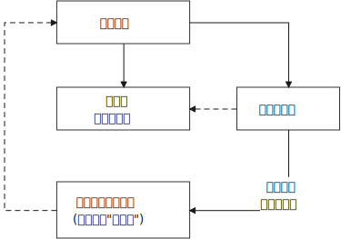

- ROI 投资回报率
  background-color:: #264c9b
	- 不管是什么投资,只有在'风险'和'收益'配比的情况下('高风险'应该给你带来'高收益'),才会有人去玩。
		- > 刚成立的新公司值得去吗？其实这个问题的本质, 跟"刚成立的公司值不值得投资"(即"风险投资")是一个样的。 
		  去刚成立的新公司，也是风险投资。也**要讲风险和收益配比的原则，你不能承担着巨大的风险(新创业公司)，但却只能获得明显很小的收益(低薪水).**
		  永远要记住: 
		  1. 青春= 转行机会, 没有机会就没有一切! 
		  2. 应届生的身份很值钱. 
		  3. 第一份工作对以后人生轨迹的影响很重要 (可能会导致路径依赖).
		- 替领导去得罪人是非常愚蠢的，领导比你有钱，比你有权，人脉比你广，即使这样，他都不去得罪人让你去得罪人.
	- 在风险不变的情况下扩大收益, 和在收益不变的情况下减小风险, 是一回事。
		- 人越老，技能越过时退化，所以你必须找一个能托你底的工作或单位，让制度保障来托你的底，而不是只靠你的技能。
		- 穷人常常把钱花在昂贵的治疗上，而不是廉价的预防上。
	- **付出了代价, 就要拿到回报. 花了时间, 就要拿到收益 (ROI),(贼不走空). 反之, 如果不存在回报(或回报是虚拟的, 只会"转瞬即逝"), 就不要去投入.**
		- 任何产品，都只服务于短期时间(生命周期, 保质期内), 所以不需你将产品打造到能流芳百世.
			- -> 很快就飞进垃圾桶的东西, 比如设计, 不需要你去打磨.
			- -> 你的短视频也不是"做电影"要流传后世, 不需要去浪费你的人生.
		- 电子世界中的东西, 都只能是虚拟的“获得”. 数字化可以被清零. 现实世界中, 实体的东西才不会被消失. 时光会带走无形，留下的只有实体。
			- 虚拟的电子文件(比如ps图片)制作后再删除（做图，删图；打游戏，删游戏；下视频，删视频），一直循环这样的操作, 就是你的整段时间都浪费了。经常如此做，累积下来就是你浪费了大量时间。
			  你花上千个小时下载, 制造, 和耗时的东西, 一秒就能删除所有数据, 清空得干干净净. 而你浪费掉的几十年来的人生光阴, 却一去不复返了.
			- 能在脑子里想到最终效果的东西(如打游戏, ps图片)，就不要实际再去做它们，因为你只不过是把脑中已经知道的结果, 再在实际中浪费时间来重复一遍，没有必要! 只是在浪费你宝贵的人生光阴.
			- 在网上寻找的“圆梦”, 都是虚拟的“获得”. 生活中旅游等, 也是虚拟的获得( 玩完就没了, 没有任何实体财务留下)，因为你都没有实实在在的得到它们. (无论你在电子游戏中获得多少"财富"和"成就", 游戏从硬盘上一删, 就都没了. 如同黄粱一梦)。只有实际的获得你真正想要的工作，购物，进到你口袋里了，你才是真正得到了它们！
			- **把所有这些时间都用在英语听力上的话，你早就成功了！**
			- 所以, **人的一辈子活动, 无论你做什么, 最大的实实在在的实体物质遗留, 就是生儿育女传承下去! 其他都会化为烟云.**
			- **时光会带走无形，留下的只有实体。** 回忆, 无形只属于我们自己，而实体才是你唯一能留给后代的东西。
		- 大学学历如果有价值, 它就必须能得到与这些价值对应的收入! 十几年的学习投入, 大学毕业之后，你再告诉他去和农民工比？上学的时候逼逼读书改变命运，毕业后逼逼请你们向农民工看齐。这不是诈骗么?!
	- 做不同的事, 职业, 会带给你不同的投资回报率 ROI
		- **坑与坑是不一样的**。有的坑(编程)你可以填平; 有的坑(设计)你只会陷死在里头, 并不会因你有多少决心和热情而能跨过.
		- 你为之服务的人越多，你就会越富。(要"规模化", 不要"定制化"!) 如果你建立了能为几百万人服务的公司，你将成为百万富翁。
		  (这也是互联网平台性公司看到的. 也是带货主播, 自媒体创业者在做的 ---- 去获取无限的用户, 而非只服务少数大客户, 变成项目制)
		- 双休和的单休，看起来只多了一天，但实际上是6:1和2.5:1（工作时间比休息时间）的差别:  5天工作/2天休息= 2.5/1
-
- 学习的本质
  background-color:: #264c9b
	- 不断发现自己的盲点, 即"不知道自己不知道"之处.
	  collapsed:: true
		- 当看不见自己的盲点(即"不知道自己不知道"之处)时, 就不会感觉自己有问题. 所以**要尽量发现自己的盲点呢, 找出"自己原以为是这样，其实不是这样"的情况.**
	- 你自己得出的领悟, 是最宝贵的. (人不是被他人说服的, 而是从自己的遭遇中改变认识)
		- 看书最重要的收获, 不是为了书上所写的内容，而是你在看书时，被启发思考出来的你自己的观点。这些事实上就是你的"领悟".
		- 学习中遇到的问题, 在你解决后, 必须将"解决过程中的思路, 和采坑教训"记录下来, 复盘.  即, **你拿到了什么结果不重要, 如何想出"解决思路"的过程, 才是最有价值的!** 如果没有复盘，你 70% 的功夫白费了 —— 你花了不少时间，读了不少代码，除了拿到一个结果外，并无太大的"掌握了解决问题的方式"收获。
		- **人最大的敌人是“忘记”，忘了你的历史，就背叛了你的教训.** 人最容易犯的就是"健忘". 只有随时随地，想到并深感在"海中"的感受，你才会对人生"上岸"有更长远的思考 -- 
		  1. 什么工作是能一直干到老的，而非青春饭.
		  2.什么工作是能自我独立出来干的（如美发，厨师），而非一个更大系统的螺丝钉环节(要做可复制的树枝, 不要做树叶).
	- 认知上的升级, 带给你的, 是"小步迭代升级", 而不存在"一步登天的神药"
	  collapsed:: true
		- 把方法论(哪怕是针对"解决很小问题"的小技巧, 小方法), 思维升级类的学习, 最好**把它们看做是能给你启发 (每次都比旧的你, 多获得一点点新的洞察)**,  而不要把它们看做是灵丹妙药, 吃一颗就能让你跨一大步, 直接改变命运.
		- 比如,讲"抗压"的书，里面每一条, 你觉得作用都很小. 事实上这源于你的错误预期，幻想着有一个神招能一下子解决你的大问题. 其实**世上不存在神药, 有的只是一个个心理小技巧，虽然它们每一个都作用微小，就像一条条蛛丝一样，但几十个小技巧合在一起，共同来起作用，就能像"结成的蛛网"一样，联合起来就有强大的力量了！**
		-
		-
	- 少即是多(只录底层逻辑), 才能保持整体"思维导图框架"的条理清晰, 一目了然.
		- 在录入前先要做筛选, 仔细想一想, 这一条有没有改变了一点点你的以往认知?
		- 只记录"我自己得出的认识", 及"我深感赞同的醍醐灌顶的话", 而不要去记录"世人皆知的普通道理, 只不过换了件马甲包装而已".
	- 不断迭代
		- 专业化之后，你一定要求"标准化"。要不断地分析自己的做事方法流程，以改善每一个环节和细节。所谓细节，是指动作、步骤、做法的最优解，统统规范出来。
		- **提高复盘频率: 在做事的当时，遇到各种问题，就要立刻把"领悟"记录下来，随遇随记，用最小迭代法，最高频率的提升自己。**
		- **不断的复盘, 不断记录下自己的新的领悟和顿悟, 已经变成了我的一种思维模式. 这能让我感到 自己每天都变得跟以前不一样。**
	- 学习时要牢记初心, 别因"意义迷惘"而失去动力.
		- 我在看书学习时，有时往往会陷入似乎感觉"所看的内容和自己没什么关系，不知为什么要看它们?"。其实，**这是因为你忘了当初为何会出发的“初心原因”了 -- 即, 当初, 你是想解决你的什么问题? 才去查(学)的它们.**
		- > 你看政治思想家的各种理论，目的是为了解决 -> 由人组成的群体中，人性中的“恶”的问题. 这些问题在你与社会人群交互的过程中, 及任何由人组成的组织中, 都会遇到的.
		  而历代先贤, 思想家们, 都曾经深入思考过这些问题的解决方式. 同时, 他们提出各种理论，并在实践中来检验这些理论的效用. 这些经验和教训, 对你都是具有宝贵借鉴价值的. 所以, 这才是你学习政治理论的初心原因。
		- > 学"世界观"时, 要随时记得学它的目的, 是用来评判"社会中, 人的各种说法(无论是"政府宣传",还是"知识付费","广告宣传")中理论的真伪性.
		- > 学数学(微积分, 概率)时, 要随时记得学它的目的是为了学金融数学, 经济数学; 基因遗传数学等.
		- 所以, **你学任何东西，都要不断的去回忆，回想起你学习他的初心原因。而不要因为路途走得太远了，而忘了你为什么要出发。**
		- 即, 要在"元知识"和"学它们的目的"之间, 反复来回提醒记忆. 才不会觉得自己在学"元知识"时脱离了你自己的日常实用性, 而陷入学习的迷惘状态.
- ---
- 我实践中杀出来的学习方法
  background-color:: #264c9b
	- 人生有限, 所以只读(学) 第一流的思想家(包括顶尖教授)的著作, 少看二倒手的(科普), 不看三倒手的(自媒体文章)
		- 原因:
			- 以有涯追无涯, 我们没时间看所有的书, 只能选择看最精华的. **读书不在多，而在精，一优胜十劣.**
				- -> 第1类: 一流的思想（政治，经济，心理学，人性认识）来自于西方著名思想家，和大学顶尖教授.
				- -> 第2类: 政治家只不过接受了某个思想的理念，并实践化，但思想深度就差些了.
				- 所以，我看书，就只看第一类的，学习后真正就能一览众山小. 再去看历史学书中讲经济政治，真是满处bug。
				- > 比如历史上，五四等时期，中国的各种思潮追求，如果你对这些思潮理论没有深刻的研究，你怎么知道他们所追求的这些思想，是合理的,还是和邪教没本质区别？
			- 特定时间段内, 世上没有那么多新发现, 都只是抄袭历史上已知的, 或最前沿的东西 -- 学术期刊 而已.
		- 方法
			- 建立作者情报库 . 把各行各业的著名作者列成情报清单(如 **作者的SCI 影响因子** )，作为选书依据。
		- 辨别价值含量
			- **能实际运用的"方法论", 比单纯的只"鼓励你去行动"的话语, 更有价值!** 你不能老是只做"鼓动自己(只停留在起跑线之前)"的笔记, 而要多记录"具体的, 实际可行性的方法论(跑在第一步, 第二步...上)"内容.
	- 必须翻译成自己的话来理解!
		- 如果你不能用自己的话来重新转述出它的意思, 就表明你没有理解. 哪怕用"比喻"来得到非精确的理解, 也要先求部分理解, 之后再求准确!
	- 学习时, 要把别人的东西, 分解(变形)成你自己容易吸收的形式.
		- 因为教科书, 法条等等, 都是被“压缩”信息密度后的文本. 你必须将它还原成口语化的, 更容易理解的, 具有"逻辑条理（思维导图等），方便消化吸收"的知识条块.
		- -> 生物里,**最好的学习方式是看动画！因为往往文字讲不清楚太多物质之间的"动力学关系".**
		- -> 同样, 学数学, 你在看书学习时, 你的难解迷惑，几乎都是因为作者的文字表达能力太差，或文字表达困难，讲不清楚复杂的事情 (或多个复杂变量间 的互动关系). 而通过"看动画"来学习, 就非常直观了. 即, **我们要找到效率最高的学习方式.**
		- 定义先行, 对"基本概念"的理解要非常清楚才行! 因为概念没弄清楚的话，就不理解建立在概念之上的更高的架构。(如数学)
	- 抽象的东西，需要借用日常比喻, 来转为更容易"理解和记忆"的形式.
		- **对于"抽象"又"彼此关系复杂"的一堆东西, 只能通过比喻，投射日常的方式，来理解与记忆.**
		- 虽然一经"比喻"的转换后，会扭曲该事物的本来情形, 在你的认知上可能造成些微误导. 但至少一开始这些都不重要，因为如果你连记都记不住，又何谈以后能慢慢理解到它们的真相呢？
		- 所以, **只能从"形象"出发，来记住和理解"抽象"；不能从"抽象"出发，来理解"形象"。**
		- 古人对当时他们难以理解的自然现象, 历史真实, 只能通过创造神话故事来诠释, 降低理解难度.
- ---
- 创建我自己的价值观, 方法论架构大树
  background-color:: #264c9b
	- 创建你自己的一颗大树
		- 各科都有自己的理论框架模型，就像一棵棵不同长相的大树. **你不可能记住世上所有的树**（各种学科的各种理论框架），而且未来还会永远有新树出来. **但你一定能记住你自己, 从零创造出来的这一棵树 (自己的框架)！** 即, 你能以你的“一”，来统其他的“万“。
	- 把别的树上的叶子, 组装到自己的大树上
		- 一定要把别人的理论, 翻译成你自己的话. 即经过你自己的理解"翻译", 变成你思考后的东西. 再把所学到的理论, 思维模型，模块化, 变形组装到你自己的大树上。作为叶子.  **千万不要原封不动直接搬别人的框架(或别人的思维导图)! 你自己想出来的组织方式，才最符合你自己的实战需要的。** 当然, 你的架构也是在不断迭代(不断重构)中的.  只能"飞机边飞, 边换引擎"一样.
	- 不需要背诵树叶, 你要弄懂的是树枝,树干(底层逻辑)
		- 一棵树上的叶子万万千（各种规律现象发现），我们去单独直接记忆所有的叶子是错误的. 我们要理解弄懂的, 是更少的树干，树枝(即"本源出发点"). 正是树干, 推导出了树枝, 树枝又推导出了树叶. 即, 知其"所以然"，就能知其"然".
		- 学习上也是一样, 真正重要的, 不是已经是最后一步的"果", 而是推导出"果"的前面的"因".
			- -> 郭德纲说: 说三国, 三国的故事(只是因果的"果")本身根本不重要, 重要的是导致这些事件发生的"因"的部分 -- 即其背后的人物的思考, 性格, 当时所处的环境分析.
			- -> 我不是在看历史故事，我并不关心历史的具体细节，我是借助他们的遭遇，来得到我自己的人生启示。比如，看蒋介石的历史，不是为了向他人去说这些无用的陈年旧事. 我看的目的，是从他的教训中，得到对现在的我有用的处事经验。
			- -> 我在看老毛的思想及行径时, 重点不是在判断他的对错上, 而是能从中看出(总结出), 他的"政治斗争手段"套路!
			- -> 我是在学JavaScript吗？不, 我在学的是"函数式编程"的思想逻辑，JS对我没用, 但编程思想却是相通的"底层逻辑思考方式".
			- -> 你学的不是那几首歌, 而是发声技巧
			- -> 你学的是背后的做菜方法，而不是去记那些做出来的菜本身！
		- 你学习并使用各种思维模型, 来分析解决工作, 商业等问题, 也并不只是为了该问题本身, 而是为了借助它们来训练你的大脑思维方式!
		- **把案例研究当哑铃, 你的目的不是哑铃, 而是锻炼你肌肉(大脑思维认知, 及建立你自己"方法论大树"的食材)**
		-
		-
	- 打通底层, 一通百通 (如数学, 英语)
		- 学好数学，那整个涉及到数学公式的书，你就都不在话下了. 反之, 不掌握数学, 则“一不通百不同”, 一辈子被封死在数学的玻璃天花板之下. 所有涉及到数学原理的书籍 你都看不懂.
	-
	-
- ---
- "思考, 分析问题"的方法论
  background-color:: #264c9b
	- 我读史的4步逻辑分析法:
		- 1. 造成现状的原因 (向前推, 溯源)
		  2. 当前现状, 带来的后果和问题
		  3. 如何解决当前这个现状?
		  4. 当前采取的措施, 又导致了什么新的后果和问题(即"未来的现状")? 这一步就与第1步形成了循环.
		- 
		- **一切问题的核心, 都可以归源于一个核心点: 如何控制人的人性和权力**. -- 官员管理问题, 宦官问题, 外戚问题, 中朝外朝问题, 诸侯军阀问题, 党争问题, 人事斗争问题, 抗击与控制少数民族入侵问题.
		- 看历史, 要看人物导致他们命运的各种"背后原因". 并且要关注每个人物最后是怎么死的, 而不能只看他们最光辉的那会儿. (比如看<三国>, 如果你只看那些人物的高光时刻, 却不去关心他们在政治斗争中怎么死的, 就等于买椟还珠, 没有学到真正有价值的东西.)
		-
	-
-