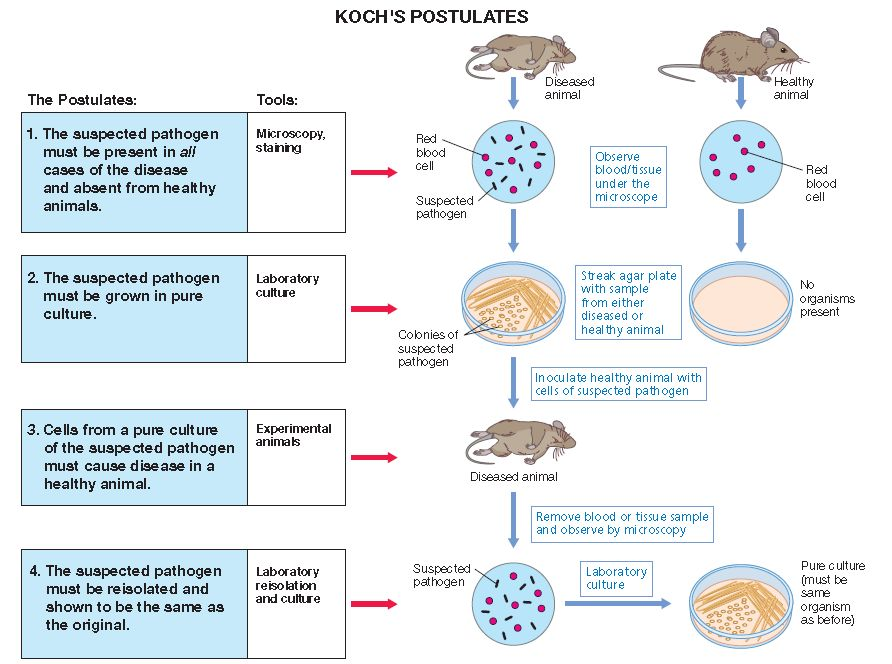

= 疫苗常识
:toc:

---

(笔记自王立铭等等)

*不要浪费任何一次危机! 反思的价值是让我们能够对下一次危机，做更充足的准备。*

== 基础常识

==== ★ 对一种全新传染病, 如何确定它的病原微生物? -> 科赫法则 Koch postulates

确认任何一种全新传染病的"病原微生物"，都不是一件特别容易的事情:

一个人身体里寄生着上千种不同的微生物。*你在疾病患者体内找到了一种新的病毒，但你怎么证明就是这种新病毒导致了这种新的传染病呢？你如何建立起这两者间的因果关系呢？*

如何判断一种传染病的病原体，有一个非常古老但行之有效的办法——*科赫法则。用来判断某种微生物和某个传染病之间的因果关系。*

[cols="1a, 1a"]
|===
|科赫法则 Koch postulates |柯赫氏法则已被移植, 并成为"植物病理学"中一项经典法则

|1.每一位病患体内, 都能找到大量的这种微生物，而健康人体内没有；
|1.共存性观察：被疑为"病原物"的生物, 必须经常被发现于病植物体上。

|2.这种微生物可以从患者体内被分离出来，然后在体外培养；
|2.分离：必须把该生物从病植物体分离出来，在培养基上养成纯培养，纯培养即只有该种生物而无其它生物的培养物。

|3.体外培养的微生物, 可以让健康人患病；
|3.接种：*用上述纯培养, 接种于健康植物上，又引起与原标本相同的病害。*

|4.新患病的人体内, 仍然可以找到同样的微生物。
|4.再分离：*从上述接种引起的病植物, 再度进行分离而得纯培养，此纯培养与接种所用纯培养完全一致*（第4点是在柯赫氏以后由斯密斯（E．F．Smith）补充的）。 <- *即, 形成了一个完美的循环.*
|===

把科赫法则用在新冠病毒上, 来验证"新冠病毒"是否是"新冠肺炎"的病原体:

[cols="1a,3a"]
|===
|Header 1 |SARS-CoV-2

|1.每一位病患体内, 都能找到大量的这种微生物，而健康人体内没有；
|Column 2, row 1

|2.这种微生物可以从患者体内被分离出来，然后在体外培养；
|<- 科学家们成功从患者样本中分离出了这种病毒颗粒，并证明了它们在培养皿里仍然能够感染人的上皮细胞。这基本满足科赫法则第二条的要求.

|3.体外培养的微生物, 重新输入人体, 可以让健康人患病；
|<- 新**冠病毒SARS-CoV-2 和SARS病毒入侵人体细胞走的是一个共同的路径 : 这两种病毒都可以用外壳上那些长长的尖刺——学名叫作"刺突蛋白分子"（Spike）——去识别和结合人体细胞表面一个叫作 ACE2 的蛋白质，借此打开这些细胞的大门，进入这些细胞内部。**

只要在老鼠细胞里转入一个人类的ACE2蛋白(变成转基因小鼠)，病毒就可以顺利入侵这些老鼠细胞，并且在其中持续繁殖。这个发现至少是部分支持了科赫法则第三条和第四条的成立.

|4.新患病的人体内, 仍然可以找到之前分离出来的同样的微生物。
|Column 2, row 4
|===

---

==== 基本传染数 basic reproduction number, R~0~ <- 用来测量病毒的传播能力

对于传播能力，流行病学上有一个指标: “基本传染数”（basic reproduction number, R~0~ ）。它指的是**一个患者在整个病程中（从发病到痊愈/死亡），平均能够传染几个人。** +
显然，任何一种能够流行起来的传染病，R~0~ 肯定得大于1，否则越传越少它自己就消失了。 +
即, 如果一个患者在自己被感染期间，平均只能传染0.5个人，那么每过一段时间，等原来的患者痊愈或者死亡，新患者的总数就会减少一半。久而久之，这种传染病自己就会慢慢消失。

R~0~ 越大，一种疾病的传播能力就越强。

---

==== ---- R0如何计算?

如果我们知道，从一个新冠肺炎患者发病开始算，到他把病毒传染给另一个人并发病确诊，平均需要4天。 +
然后我们发现, 第一天一共有100个患者，到第四天一共有400个患者（100+300），到第八天一共有1600个患者[（100+300）+1200]。那我们就可以计算得知，平均一个新冠肺炎患者能传染3个人，R0 =3。

但在真实世界里, 很难做到 R0 的精确计算, 因为:

[options="autowidth"]
|===
|Header 1 |Header 2

|他们到底是哪一天发病的?
|

|谁传染了谁?
|

|在真实世界场景里，疾病的传播不可能如此“均匀”。
|<- 在不同的气候环境、不同的人群当中、不同的防护措施下，疾病的传播速度肯定会不同.
|===

因此, 科学家们只能基于不同的假设, 对R~0~ 进行估计，永远也无法获得最精确的R~0~ 。

---

==== ---- 常见传染病的 R0值

[options="autowidth"]
|===
|Header 1 |R~0~值

|季节性流感
|1.3左右

|新冠肺炎
|2.5 - 3.5

|麻疹
|12 - 18
|===

---

==== ★ 实际传染数 R

相比R0 的高低，也就是一种传染病在理想条件下的传播能力，**实际传染数R** 这个指标就更有意义。**它衡量的是我们人类能采取什么措施，将疾病的流行限制到什么程度。** +
换言之, *不管一个疾病的R0 有多高，也就是它天然的传播能力有多强，只要我们把 "实际传染数R" 降低到1之下，就可以有效消除这种疾病。*

---

==== ★ 如何降低 "实际感染数R" 的数值？ -> 降低 1.病程长短, 2.病患和健康人的接触频率, 3.感染概率

那怎么降低 "实际感染数R" 的数值呢？ 它由三个相互独立的因素决定：

1. 一种疾病的病程长短；
2. 患者和其他人的接触频率；
3. 每次接触过程中, 传播疾病的概率。

一种疾病的病程越长，在这段时间内患者接触的健康人越多，每次接触的时候感染越容易发生，R当然就越大，这种疾病当然就会更容易流行起来。

所以, 如果我们想要限制疾病的流行，就需要考虑如何降低这三个要素。

[cols="1a,3a"]
|===
|Header 1 |采用何种手段来降低它

|1.一种疾病的病程长短
|疾病的感染周期, 往往是疾病的自身特性，比如流感一般病程就是一周左右，艾滋病的病程可能长达几年甚至几十年，这个往往不能轻易改变。 +
所以我们只能对剩下两个要素来作文章。

|2.患者和其他人的接触频率
|- 采取隔离措施

|3.每次接触过程中, 传播疾病的概率
|- 佩戴口罩
- 科学洗手

---

- 打疫苗

**新冠肺炎的R0 是2.5，**也就是说平均一个患者会感染2.5个健康人。那**如果人群当中只要有超过60%的人通过接种疫苗获得了免疫力，新冠肺炎的实际传染数R就会被遏制到1（2.5×40%=1）以下，疫情蔓延就会被控制住。这就是所谓“群体免疫”的真实含义。**

其实, 并不需要疫苗能够对所有人都起作用，只要它能够保护达到一定比例的人，**把传染病的实际传染数R降低到1以下，**就能大大限制疾病的传播，逐渐消灭疾病。

比如, 如果一种传染病的基本传染数R0为3，也就是说在感染期间1个患者平均可以传染3个健康人，而通过接种疫苗，让人群中2/3以上的人具有免疫力，那么即便还有低于1/3的人容易被感染，这种传染病的实际传染数也能够降低到1以下。 +
换句话说，这2/3通过接种疫苗获得了免疫力的人，为其余1/3的人提供了保护。 +
*这就是用接种疫苗的方法, 来实现“群体免疫”的原理 ——疫苗让一个群体中的大部分人获得了免疫力，就能够间接地为其他不能或者不愿意接受疫苗接种的人, 提供保护。*

|===

---

==== 超额死亡人数 Excess Deaths

有很多原本年龄偏大、身患基础疾病（糖尿病、心血管疾病、呼吸道慢性疾病等）的人，在流感的攻击下会死于各种并发症。这个时候临床上就很难严格区分他们到底是因流感而死，还是死于各自原本患有的慢性病了。

为了解决这个问题，人们发明了"超额死亡"这个指标，抛开具体的病情分析，直接去看在每年秋冬流感高发的季节里，整体死亡人数相比以往平均, 上升了多少。

*即"超额死亡人数"是指: 在特定时间段内观察到的死亡人数, 与过去同一时期历史平均死亡人数相比，由于各种原因(无论是流感还是身体基础疾病)而导致的超出预期的死亡人数。* +
这些“超额死亡”的人当中，有些直接死于流感，有些死于流感引起的并发症，甚至有些人因为流感季节医院爆满而耽误了诊治其他疾病，他们都可以看成是流感的牺牲品。

[options="autowidth"]
|===
|传染病 |超额死亡人数

|全世界每年因"季节性流感"而导致的超额死亡
|约40万人

|美国因为"季节性流感"导致的超额死亡人数
|每年都在波动，为2-3万人

|新冠肺炎
|截至2020年12月底，新冠肺炎官方死亡人数接近200万人，超额死亡人数可能还要2倍于此.
|===

---

== ---------- ----------

---

== 新冠肺炎 COVID-19 <- 由病毒 SARS-CoV-2 所致

[options="autowidth"]
|===
|疾病 |<- 致病病毒

|新冠肺炎  +
COVID-19（coronavirus disease-2019）
|SARS-CoV-2. +
由"国际病毒分类委员会"（International Committee on Taxonomy of Viruses）分类.

|===

---

== SARS-CoV-2 病毒

SARS-CoV-2

[cols="1a,3a"]
|===
|Header 1 |Header 2

|病毒的"刺突蛋白" -> 会结合人体细胞的ACE2蛋白质
|这一根根尖刺，其实是新冠病毒"刺突蛋白质"分子形成的，3枚三维结构完全一样的"刺突蛋白质", 彼此镶嵌在一起，形成了一个类似大头针的结构. 针帽朝外，针头插入病毒颗粒内部。朝外的大头针帽，就是新冠病毒识别宿主的核心部位。
科学家们还看清了这枚大头针, 和人体细胞表面的ACE2蛋白质相互结合的具体形态.

新冠病毒进入人体细胞的过程：刺突蛋白和ACE2蛋白“握手”之后，新冠病毒被进一步拉近，贴近到人体细胞的表面。紧接着，新冠病毒最外层的膜, 和人体细胞膜, 融为一体，就像两个肥皂泡合二为一，新冠病毒颗粒内部的遗传物质, 就能进入人体细胞深处。

|RdRp蛋白质 -> 能帮助病毒复制
|作为一种RNA病毒，新冠病毒的遗传物质, 是一条大约3万碱基长度、携带11个基因的RNA长链。 +
这条RNA分子进入细胞之后，能够劫持人体细胞自带的蛋白质生产机器，为自己生产出自身繁殖复制所需的各种蛋白质（比如大量新的刺突蛋白）. +
这其中，*一个名叫RdRp（RNA-dependent RNA polymerase）的蛋白质特别值得关注，它是新冠病毒繁殖的关键。在这种蛋白质的帮助下，新冠病毒的遗传物质得以在人体细胞内快速复制。*
|===

---

==== 新冠病毒到底从何而来？

新冠病毒的起源问题，可以分成三个子问题：

==== ---- 1. 它到底是从哪种病毒演化而来? 天然的动物宿主是什么?

其实在野生动物身上发现一些新病毒, 本身没什么大不了的 —— *人类目前对病毒世界的理解极其有限，已知的病毒物种可能都不到全部病毒物种的万分之一.*

[cols="1a,2a,3a"]
|===
|Header 1 |宿主  |

|SARS病毒
|蝙蝠(天然宿主) -> 果子狸(中间宿主) -> 人类
|果子狸身体里的一种病毒,和SARS病毒, 相似度达 99.8%. +
同时, 在接近果子狸的人群中，他们血液里广泛存在SARS抗体，这样就彻底锁定了果子狸的中间宿主身份.

|MERS病毒
|蝙蝠 -> 骆驼(中间宿主) -> 人类
|

|SARS-CoV-2病毒
|蝙蝠 -> ?(中间宿主) -> 人类
|云南蝙蝠身上的RaTG13病毒, 与SARS-CoV-2, 两者之间基因序列的相似程度, 超过了96%。*这4%的序列差异，意味着这种蝙蝠病毒不可能直接入侵人体. 还需要进一步基因突变.* +

这种中间宿主动物, 应该是一种半野生的，但是能够被规模养殖运输的，和人类世界比较接近的哺乳动物。理由很简单：

- 半野生状态下 -> 它才能够和野生蝙蝠等, 有比较多的接触机会，能够从它们那里获取病毒。
- 比较大的群体规模 ->才能给病毒在这种宿主内部的互相传播和变异, 提供了平台。
- 而只有这种动物也比较接近人类世界，有很多和人接触的机会 -> 才能给新病毒提供了一个"自然选择"压力，并最终获得了感染人体的变异可能性。

遗憾的是，华南海鲜市场早在2020年1月初就已经关闭清理，里面的动物也被彻底消杀。这给找到中间宿主增加了相当大的难度。

穿山甲冠状病毒, 和新冠病毒的整体基因组序列, 相似性只有90%左右，远低于蝙蝠病毒96%的水平。  +

|===

*但穿山甲冠状病毒中, 偏偏有一段特殊区域（刺突蛋白的受体结合区域）, 与SARS-CoV-2的相似程度很高——这段序列的蛋白质相似度高达97%，甚至某几个特定的、可能对受体结合至关重要的氨基酸位点，是完全一样的。*

这个信息为什么重要？因为冠状病毒想要识别宿主细胞并且入侵它，靠的是病毒表面一根根突起的尖刺（这也是冠状病毒这个名称的由来）。这个尖刺是病毒专门生产的一个蛋白质分子，被恰如其分地命名为“刺突蛋白”。**尖刺朝外、类似于大头针针帽形状的一小段所谓“受体结合区域”，能够专门结合宿主细胞表面的ACE2蛋白质，让病毒能够锚定这些细胞然后入侵之。** +
那么可想而知，**刺突蛋白的特性，特别是刺突蛋白上的受体结合区域的特性，决定了一种冠状病毒到底能够入侵什么细胞、什么动物。**

这暗示了一个相当严峻的问题：*在自然界中，应该有大量我们尚未发现和了解的病毒，它们隐藏在蝙蝠和穿山甲这样的动物体内，目前虽然不侵犯人类, 但这些病毒完全有可能在几年、几十年里, 演化(基因突变)出入侵人类世界的能力。*

考虑到病毒物种数量的庞大（有人甚至估计未知病毒数量高达数千万种甚至更多），考虑到在自然界它们有几乎难以穷尽的藏身空间，考虑到病毒演化的超高效率，我们甚至可以说，人类习以为常的静好岁月其实是一种奢侈，有太多的病毒准备好了突袭。

---

==== ---- 2. 它最早是在何时何地, 进入人类世界?

传染病最早是从哪个人开始的，这个人就被定义为“原发病例”（primary case）, 或称“零号病人”。

要发现传播链条, 一个方法是观察"病毒基因序列"的变异.

比如: 我们从三个患者身上分离出了新冠病毒，通过检测病毒的基因序列，发现患者1身上的病毒有基因突变X，患者2身上的病毒有基因突变X和Y，患者3身上的病毒有三个基因突变——XYZ。 +
那么，一个最简单的推测就是 : 病毒的传播应该是 患者1 -> 患者2 -> 患者3，并且它们在这个过程中逐渐积累了更多的基因突变。 +
这个时候，如果你又找到了第四个患者，他身上的病毒没有XYZ的突变，但是有突变W. 那你也可以推断: 这个患者身体里的病毒，大概和患者1、2、3的关系更远一些，可能不是一个家族的。

科学家们分析了从世界各地的患者身上分别提取的160个新冠病毒的基因组序列，并根据这些基因序列的差异大小，把它们分成了A、B、C三组。来猜测不同组别之间的传播顺序, 结果发现: +
A(美国多见) —> B(武汉多见) —> C(欧洲多见)

但这项研究无法说明新冠病毒的起源。原因是:

[cols="1a,3a"]
|===
|Header 1 |Header 2

|样本太小, 代表性太差
|相比全世界千万计的患者，区区一百多条病毒基因组序列的代表性, 就很成问题。

|病毒丧失基因多样性???
|在病毒暴发的源头，病毒的多样性很可能是最高的，在传播过程中反而会逐渐“聚焦”。

比如:100个幼儿园孩子穿不同颜色的衣服，放学回家，从幼儿园门口出来，朝各个方向走的孩子里，每个方向上的衣服颜色会逐渐减少，也许东边的孩子里红衣服更多，南边的孩子里黄衣服更多。再继续分散走下去，兴许走到一个小区里的孩子就只有一两个，衣服的颜色会更单调。 +
因此, 病毒的传播也有这样的可能性。

(*不过我觉得这个假设不成立, 新冠病毒从动物进入人体, 一定是单点突破(某个序列的基因恰好适应了人体), 而不是多点突破, 不可能n种不同序列的基因, 都同时适应人体而第一次进入人体.*)

|病毒基因突变速度不快, 重叠可能不多
|要想利用基因变异的规律, 分析病毒的传播和进化链条，这个方法成立的前提是: 病毒在传播过程中确实发生了大量的基因变异。  +
而新冠病毒的基因变异速度并不快, 而且彼此之间的基因突变还不重叠，没有形成特别明确的“重叠热点”。

如, 上面讲过的患者1,2,3的例子, 如果这三个患者身上病毒的基因突变不是X、XY、XYZ，而是XY、XZ和W，我们就很难判断它们三者的传播顺序了。 +
当然，你可以大概猜测XY和XZ的关系, 应该大于XY和W的关系，但是谁先出现、谁传给谁，就很难分析了。

|前提错误, 即目前假设的始祖病毒, 可能并不是真的始祖病毒.
|*最大的问题是：分析的基本假设可能就是错的！* +
**这项研究假设蝙蝠RaTG13病毒是人新冠病毒的祖先，**来看A、B、C三组当中谁和RaTG13更接近，就定义谁是病毒进化的起点和“根”。*但这个假设(蝙蝠是源头)可能本身是错的。因为目前我们无法确定RaTG13真的就是新冠的祖先。也许未来我们会发现更接近新冠的病毒呢？也许最后发现根本不是蝙蝠体内的某个病毒呢？这样的话，研究的基本假设就得改.**  +
*所以我们无法判断A、B、C到底谁才是真的最古老、最早出现的病毒。*
|===

---

==== ---- 3. 它在人类世界当中, 又是如何广泛流行开来的？

---

== 如何防止病毒从动物身上, 转移到人类身上

实际上科学界有一个主流认知，就是**人类世界今天流行的大多数病毒，都是我们的祖先进入农业社会、开始畜养家禽家畜之后, 从动物身上获得的。**

- 人类祖先和家禽家畜近距离朝夕相处，给病毒跨越物种屏障进入人类世界, 提供了机会。
- 另一方面，**进入农业社会以后，人口规模大大提高，形成了高密度的人群聚集区，这就给病毒在人和人之间传播、进化和流行提供了天然的温床。**

这一点甚至还影响了现代世界的政治格局 : +
绝大多数能够被驯化的动物都生活在亚欧大陆，而美洲和澳洲的土地上天生就没有什么动物能被驯化。亚欧大陆的居民天然就有开启农业文明的基础, 并且因此亚欧大陆的居民从1万年前开始，就饱受病毒入侵的折磨，但是也因此形成了对病毒一定程度的免疫力。 +
而美洲和澳洲大陆的当地土著居民, 并没有自然条件来大规模的驯化诸如牛、羊、猪、鸡这样的动物，对于来自动物的病毒也就毫无抵抗力。 +
最终, 我们都可以说，是在病毒的帮助下，欧洲殖民者才轻松占领了这些广袤土地，形成了对整个世界的统治局面。

所以如今, 面对动物身上的病毒, 我们能做的是什么呢?

- 保护野生动物的天然栖息地，
- 尽量避免入侵它们的天然栖息地
- 阻止人类对它们的围猎和贩卖，部分屏蔽动物和人之间的密切接触.

总之, 就是保持距离! 让它们不要和人类世界产生太多交集。让野生动物体内的病毒接近不了人类，以阻碍其快速演化适应人体的进程。

-

---

== ---------- ----------

---

== 制造疫苗的方法

人体的免疫系统, 有两套特定的防御机制:

[cols="1a,3a"]
|===
|防御机制 |Header 2

|1.体液免疫 -> 杀病毒
|人体的一类免疫细胞——**B细胞，大量产生针对病毒的所谓“中和抗体”，**识别和**消灭在血液中自由流动的病毒颗粒**，阻止病毒进一步入侵人体细胞.

|2.细胞免疫 -> 杀被感染的细胞
|人体的另一类免疫细胞——*T细胞，识别已经被病毒入侵了的人体细胞，直接杀死它们(被感染的细胞本身)*，用壮士断腕的方式让这些细胞内的病毒也死掉。
|===

在病毒被消灭之后，这两套防御机制——"体液免疫"和"细胞免疫"，也被保留了下来，形成“免疫记忆”。 +
所以, 其实病毒本身就是它自己的疫苗。

*所以, 开发疫苗的基本逻辑就很清楚了: 我们真正需要的疫苗，其实就是一个比真的病毒安全，但是同样能够引发人体对病毒的"免疫记忆"，能够让人体对真病毒拥有识别和防御能力的假病毒。*

image:../img_readBook/疫苗常识/vaccine_02.png[]

---

==== ★ 减毒活疫苗

就是培养一种和原来的病毒基本一样，但**毒性要弱得多的病毒，**把这些活病毒直接注射到人体内，引发一次局部的、很轻微的病毒感染，借此形成"免疫记忆"。

我们从小接种过的疫苗里，就有很多"减毒活疫苗"，如: 麻疹疫苗、腮腺炎疫苗、水痘疫苗等。

案例:

[cols="1a,3a"]
|===
|减毒活疫苗 |Header 2

|天花疫苗
|养牛场里感染过牛痘病毒的挤奶工, 就不会再感染天花病毒了。*因为"牛痘病毒"和"天花病毒"的生物学特征高度相似，但是毒性小得多*（毕竟牛痘病毒主要是感染牛的）。在感染人体以后，牛痘病毒引起的症状很轻微，人很快就会自己好起来。**因为牛痘病毒和天花病毒高度相似，人体也就顺便形成了对"天花病毒"的防御能力。**

所以, 这种"减毒活疫苗"不是利用"天花病毒"培养出来的，而是借助了天然存在的"牛痘病毒"。
|===

减毒活疫苗的优缺点:

[cols="1a,3a"]
|===
|减毒活疫苗 |Header 2

|优点
|
减毒活疫苗, **这种疫苗能在最大限度上模拟病毒的一切生物学特征，不光长得像，进入人体之后入侵和繁殖的方式也非常像。这样一来，它就能最大限度地激活人体的"体液免疫(杀病毒)"和"细胞免疫(杀被感染的细胞)"这两条防御路径，形成对真病毒持久的免疫力。**

|缺点
|- 既然是活病毒，能入侵人体细胞，能自我复制，还能变异，就很难说它会不会引起什么意想不到的副作用。 +
比如说针对"脊髓灰质炎病毒"，传统上用的就是减毒活疫苗，也就是通常说的“脊灰糖丸”。**但是在极少数情况下，糖丸里的病毒会发生变异，恢复强烈的毒性，不光不能为人体提供保护，反而还会直接引发脊髓灰质炎。**这就是所谓的“疫苗衍生脊髓灰质炎”，发病率在二百五十万分之一左右。有人甚至给这种现象起了一个名字，“恶魔的抽签”。

- 减毒活疫苗的另一个大麻烦是，**开发周期实在太长了。**人们往往需要在实验室里长期培养和筛选，才能挑选出毒性大大降低，但仍然能激活免疫反应的活病毒。这个工作有点像传统的农业育种，需要日复一日、年复一年的烦琐工作，而且还有很大的运气成分。 +
我们说，历史上疫苗开发的周期很长，其实主要说的就是"减毒活疫苗"。
|===

---

==== ★ 灭活疫苗

疫苗其实就是一个假病毒。从这个意义上说，**病毒的任何一个组成部分，可能都有这个潜力。 +
并且因为它仅仅是病毒的一个组成部分，它根本无法入侵人体细胞，显然没有什么危害，比较安全。**但这个单独的组成部分，肯定和完整的病毒有些相似性，所以也确实有可能引发人体的免疫记忆。

*除了"减毒活疫苗"之外，人类目前拥有的所有疫苗开发手段，本质上都是这个路子。*

其中最传统的一种，叫作“灭活疫苗”。就是在实验室和工厂里培养一大堆病毒颗粒，然后用化学药品或者紫外线照射，把病毒颗粒的生物学活性给破坏了，然后一股脑注射到人体内。 +
在外形上，这种疫苗保有了真病毒的不少特征，但是**既然活性已经被破坏，就不能再入侵人体细胞了。因此一般来说，灭活疫苗能够激发人体的"体液免疫"，**也就是说，能够产生识别病毒颗粒的中和抗体去杀灭病毒，**但是不太能引发"细胞免疫"，因为没有真病毒入侵，不存在需要被杀死的人体细胞。** +
*这样一来，免疫保护作用就弱了不少，往往需要打好几针才管用. 还需要添加能够人为增强免疫反应的化学物质（学名叫作“佐剂”，常用的是含铝盐的佐剂）。*

即:

[cols="1a,3a"]
|===
|灭活疫苗 |Header 2

|优点
|病毒的活性已经被破坏，不能再入侵人体细胞了, 对人体更安全.

|缺点
| - 假病毒存在, 能激起人体的"体液免疫". +
- 但是**灭活的病毒无法入侵细胞, 也就无法激起人体的"细胞免疫", 不会去杀死被感染细胞**(本身也没有细胞被感染)

- **产能比较低、价格比较高。**这是因为为了制备灭活疫苗，人们需要培养大量的病毒颗粒，毕竟是直接培养有感染力的活病毒，所以只能在高度防护的实验室和车间里进行。
- "灭活疫苗"是一条比较传统的开发路线，不可知的风险比较小。但因为接种的是失去活性的完整病毒，成分比较复杂，对人体免疫系统的影响需要长期追踪和研究。

|===

我们从小使用的疫苗里，也有不少是"灭活疫苗"，如: 流脑疫苗、百白破疫苗，还有流感疫苗。

中国科兴等的灭活疫苗, 具体的研究是这样做的： +
研究者们分别选取了一种从人群中提取的新冠病毒，在实验室进行大规模培养。收集足够的病毒颗粒后，**再加入一种能够改变病毒RNA分子结构、破坏病毒复制能力的化学物质，然后再加入增强免疫反应的"铝佐剂"，**最终制备出可供动物测试的新冠"灭活疫苗"。

目前世界范围内，只有中国研发的这三种新冠疫苗, 走的是"灭活疫苗"的开发路线。

---

==== ★ RNA疫苗 <- 即将细胞进行"转基因", 让它生产出病毒的某蛋白质, 用以喂投人体免疫系统.

"灭活疫苗"的制备思路，无非是先生产危险的病毒颗粒，然后灭活，再给人体打几针失去活性的病毒颗粒来训练免疫系统。 +
既然如此，**如果利用基因工程的办法，直接生产出本来就没有活性的病毒颗粒，甚至是病毒外壳上的几个蛋白质分子，不也能起到一样的效果吗？** +
这样一来，疫苗生产过程就**不会见到任何活的病毒，安全性大大提高**，产能和价格的瓶颈相对也容易解决了。

[cols="1a,3a"]
|===
|核酸疫苗 |Header 2

|直接生产出"本来就没有活性的病毒颗粒"
|Column 2, row 1

|直接生产"病毒外壳上的几个蛋白质分子"
|- 现在使用的"乙肝疫苗"，就是用基因工程手段，生产乙肝病毒的表面抗原分子而制作出来的.

- 新冠病毒，最具特征性的外观，就是病毒颗粒表面一根根长长的突起。这些突起是由病毒的"刺突蛋白"构成的。新冠病毒靠它识别和入侵人体细胞，而人体的免疫系统也当然会特别关注这个蛋白。 +
因此**如果单独生产这个刺突蛋白，把它当成疫苗注射到人体内，是不是也能起到以假乱真、训练免疫系统的功效呢？**

|===

具体怎么生产新冠病毒的"刺突蛋白"呢？目前人类掌握了几种不同的方法：

---

==== ---- ★ 给培养皿中的细胞植入某病毒基因 (即变成"转基因细胞"), 让细胞来生产出病毒的刺突蛋白

*这种方法是: 把编码"刺突蛋白"的病毒基因找出来，放在实验室培养的细胞里，让细胞为我们生产"刺突蛋白"。*

---

==== ---- ★ 核酸疫苗 <- 让人体细胞,来产生出病毒的刺突蛋白

即: **直接把编码"刺突蛋白"的DNA或者RNA分子, 注射到人体内。这些分子进入人体细胞后，就能命令人体细胞源源不断地生产刺突蛋白，然后这些生产出来的刺突蛋白再激发人体的免疫反应。**这就是所谓的“核酸疫苗”的概念。

优点:

- **它等于是把疫苗生产的工序, 从实验室和工厂, 搬到了人体内部，**所以可能是最省事儿的疫苗开发路线了。
- 而且这条技术路线, 理论上可能比"灭活疫苗"更好地激发人体的免疫系统。因为注射疫苗后, 一部分人体细胞会开始主动生产新冠病毒的刺突蛋白分子，那它除了"体液免疫"之外，还应该能够激发人体的"细胞免疫"反应。
- 这类疫苗的设计开发相对直接（有了病毒基因序列就可以着手开始设计），生产比较容易，*如果病毒出现变异, 也可以很方便地改变疫苗核酸序列, 重新大规模接种。*

虽然这个疫苗开发路线, 技术含量很高, 但也是未知数最大的。道理很简单：

- 把DNA或者RNA直接注射到人体内，怎么保证有足够量的核酸分子进入人体细胞？
- 怎么保证人体细胞, 乖乖听话生产刺突蛋白？
- 怎么保证生产出来的刺突蛋白, 能够顺利进入血液，激发免疫反应？
- 怎么保证人体的免疫功能, 能够被充分激发？
- 怎么保证被激活的免疫细胞, 能够正确地识别和防御真病毒?

……这里面有太多的未知问题需要进一步探索了。

---

==== ★ 病毒载体疫苗 <- 让病毒作为特洛伊木马(内藏"编码刺突蛋白的DNA"), 侵入人体细胞

简单说，*就是用一种比较安全的、不太会引起疾病的病毒作为载体，把编码刺突蛋白的DNA分子, 放在病毒里面，然后注射到人体。-> 进入人体之后，这种载体病毒可以照常入侵人体细胞，-> 相应地，就会把编码刺突蛋白的DNA分子也带入人体细胞，-> 从而指挥人体细胞生产新冠刺突蛋白。*

*从逻辑上说，"病毒载体疫苗"和"DNA疫苗"、"RNA疫苗"本质上是一回事，都是让"人体细胞"来完成疫苗生产工序。*

腺病毒载体疫苗的缺陷:

[cols="1a,3a"]
|===
|Header 1 |Header 2

|"腺病毒载体"被免疫系统消灭 (直接打翻船, 船上的东西也就一起沉了)
|**"腺病毒"是一种人类世界的常见病毒，很多秋冬季节的呼吸道感染都是腺病毒引起的。换句话说，很多人其实已经自带对腺病毒的免疫记忆了。给他们注射腺病毒载体疫苗，人体的免疫机制首先会被动员起来消灭腺病毒载体。这样一来，疫苗的保护作用就会大打折扣。** +
麻烦的是，*年纪越大的人, 可能被"腺病毒"感染过的概率越高，因此疫苗的效果可能会更弱*；而这群人却是最会被新冠病毒感染、最需要疫苗保护的一群人。

|免疫系统会更多攻击"腺病毒载体", 而不是"新冠病毒"
|通俗地说，"腺病毒载体疫苗"其实相当于一下子给人体免疫系统输入了两个值得警惕的对象: 一个是腺病毒载体本身，另一个才是它所携带的新冠病毒的基因，一不留神就可能把人体免疫系统的火力给带偏了。 +
**在那些已经有"腺病毒抗体"的人体内，注射疫苗会大大激发出针对"腺病毒"，而不是"新冠病毒"的免疫反应。相应地，他们对"新冠病毒"的免疫反应就会减弱。**这样一来，这支疫苗的应用价值，可能就需要画上一个大大的问号了。
|===

案例:

[cols="1a,3a"]
|===
|Header 1 |Header 2

|一款埃博拉病毒疫苗
|2019年，默克公司开发的一款埃博拉病毒疫苗获得批准上市。它就是一款"病毒载体疫苗"，用"水疱性口炎病毒"作为载体，将"埃博拉病毒"的一个基因送入人体细胞，激发人体的免疫反应.

|===

---

==== ▶ 各种疫苗开发方法的总结 & 当前的批准的新冠疫苗

从"减毒活疫苗"到"灭活疫苗"，再到用单独一个刺突蛋白做疫苗("基因工程疫苗"):

[cols="1a,3a"]
|===
|Header 1 |减毒活疫苗 -> 灭活疫苗 -> RNA疫苗

|优点
|- 开发疫苗的难度, 实际上是在下降的.
- 开发周期, 是在加快的.

|缺点
|- *疫苗的作用, 可能会依次打个折扣。* +
*毕竟这三种疫苗, 和真病毒的相似程度, 是依次降低的* : +
-> "减毒活疫苗"其实和真病毒差异很小， +
-> "灭活疫苗"就只剩下形似神不似的死病毒了， +
-> 而用一个刺突蛋白做疫苗，能够模拟的更是只有病毒的一部分外观特征而已。
|===

*疫苗的研发和生产程序也许可以加速，但有些环节是无法省略的 -- 大规模的人体临床试验.*

[cols="1a,3a"]
|===
|新冠病毒疫苗 |下面打★号的, 是截至2021年5月7日, 世界卫生组织批准的在全球紧急使用的五种疫苗

|减毒活疫苗
|Column 2, row 1

|灭活疫苗
|- 北京科兴生物技术公司
- 中国国药集团_中国生物_北京生物制品研究所 : BBIBP-CorV 疫苗 ★

|核酸疫苗(RNA疫苗)
|- 美国 Moderna ★
- 德国 辉瑞 & BioNTech ★

|病毒载体疫苗
|- 美国强生公司和贝斯以色列医疗中心, 开发了一款基于人"腺病毒"的疫苗  ★
- 英国阿斯利康公司和牛津大学, 开发了一款基于黑猩猩"腺病毒"的疫苗 ★

这些疫苗的设计思想很接近，都是使用"腺病毒"作为载体，都是试图将"编码新冠刺突蛋白的基因"送入人体细胞, 并激发免疫反应。
|===

---

== ---------- ----------

---

== 什么样的病毒, 才能被人类消灭? -> 1.只在人类世界传播(逃不到自然界中), 2. 症状明显(而非隐形)

两个特别关键的限制条件是：

[cols="1a,3a"]
|===
|Header 1 |Header 2

|1.这种病毒只在人类世界传播
|一种病毒只在人类世界传播，那它相对来说就比较容易被彻底清除；而如果它还能在别的动物物种里传播，那我们就几乎不可能消灭它。

|2.这种病毒的传播要特别“明显”才行
|简单来说就是，只要一个人被病毒感染，就会表现出非常强烈和明确的症状。

- 如, 天花和脊髓灰质炎病毒, 传播时会引发明显而严重的疾病症状, 使我们能识别和追踪每一位患者，准确地切断传播链条. +
又因为这两种病毒根本不能在人类之外的生物体内生存，所以一旦从人类世界绝迹，它们就彻底被消灭了。
|===

---

