= 傅世宁医学通识
:toc: left
:toclevels: 3
:sectnums:

'''

== ★ 医学的目的 : 是先保证让人活下来, 然后才有其他治疗可能.

ICU 重症医学科 : 工作就是把所有最危急的病人的生命体征, 先稳定下来，再送回其他科室继续原发病的治疗。

医学存在的目的, 是先保证人活着. 先活下来，然后才有其他可能。

医学界的一个共识就是, 艾滋病、癌症，很快就能成为慢性病，人不会因为这些病很快死亡。

== ★ 不怕难题有多难，就怕没有解决方法.

学医之后我体会到 : 不怕难题有多难，怕的是没有办法解决。只要有办法，我总会一步一步地搞定它。

每个病人都是不同的个体，治疗的反应因人而异，结果也不同。

医学(包括医学开拓) 面临的一个现实就是"不确定"。

.案例
====
在几十年前，心脏外科就面临着一个难题，就是没办法把心脏里的血引出来，这样就不可能打开心脏做手术。

到了1954年，有个美国医生 Lillehei (李拉海) 认为，不能眼睁睁看着这些孩子死。他设计了一种大胆的手术方案。给孩子做手术的时候，让他的父亲躺在边上，把孩子的血管和父亲的血管连在一起。这样，孩子心脏里的血就能引出来，流到父亲体内，用父亲的肺给血液加上氧，再打回孩子的身体。这么做，手术的风险也从一条命增加到了两条命。

李拉海医生不做，没人会说什么。但是一旦失败，父子俩人的命都没了，而且李拉海的职业生涯也会到此结束。
====

.案例
====
慢性心衰, 也就是心脏功能逐渐衰竭. 到最后，病人甚至连平躺都成了奢望。想要治愈只能心脏移植。全球每年有约100万严重的心衰患者，需要进行心脏移植手术。但是，哪有那么多供体给病人呢？

为了解决这个问题，美国的医生们最先研发出了人工心脏。在找到合适的心脏供体之前，代替心脏工作。
====

== ★★ 一切医疗只起"支持"的作用, 核心治愈靠人体自身的修复.

真正治好病的，是病人自己。所有的医疗行为，只是起到支持的作用。*医疗的本质是支持生命自我修复。* +
首先是人体的自我修复，然后才是医学的支持。*人体的自我修复是核心，是关键。*

[.small]
[options="autowidth" cols="1a,1a"]
|===
|Header 1 |Header 2

|人体的自我修复, 主要靠细胞分裂。
|- 骨折之后，骨折的地方会长出骨痂，逐渐让断裂的部分愈合，靠的也是细胞分裂。
- 秋水仙碱本来是一种治疗痛风的药，小剂量可以治病，但是超过剂量很容易中毒，甚至死亡。这种毒根本没有解药。*服用致死量的秋水仙碱，会阻断细胞的分裂，让细胞在分裂中期死亡。细胞不再分裂了，不再产生新的细胞了，这就剥夺了疾病治愈最基本的环节——自我修复。*

|一切医疗都是用来支持"人体的自我修复"
|在疾病面前，*尤其是大病，医疗的支持作用是必不可少的。因为这个时候，人体的自我修复垮了。医疗的支持，就是给自我修复赢得时间、创造条件，等待自我修复最终发挥作用、战胜疾病。*

- ICU，也就是重症医学科，是疾病最重、距离死亡最近的地方。里面几乎所有的救命手段都是支持。
.. 呼吸机 : 是支持肺，让肺休息，等待自愈.
.. 床旁的血液净化 : 是支持肾，替代肾脏的功能，等待自愈.
.. ECMO 魔肺 : 是对心脏和肺，提供最高级别的支持.

*所有这些顶级的医疗设备，都是为了先把命保住，给自我修复赢得时间、创造条件，然后等待"人体的自我修复"发挥作用。*

- 得了肺炎，先用抗生素杀死大部分细菌，但是总有耐药的，没被杀死的细菌。怎么办？这个时候，人体的白细胞发挥作用 (即自我修复)，消灭剩下的细菌，让肺炎痊愈。
- **同样是肺炎，但是白血病病人, 或者艾滋病病人, 就没有这么幸运了，**会非常难治，这些病人甚至会因为肺炎去世。*因为这类病人的白细胞吞噬功能差，自我修复能力低下*，因此，再强大的抗生素效果也不好。

- *如果癌症细胞可以逃过人体免疫细胞的监视，那么说明这个时候自我修复垮了。如果不能够恢复这种自我修复，病人再怎么手术、放疗，效果都不好。* +

在免疫疗法出现之前，医生用手术、化疗、放疗，直接攻击癌细胞，这几种方法的本质都是外部干预。也就是借助于外援，帮着咱们杀敌。而免疫疗法彻底换了一个思路，也就是增强内力。让免疫细胞获得识别和杀伤癌细胞的能力, 就是癌症治疗方法之一。

CAR-T治疗是由一系列微观研究促成的。包括"癌症基因"的研究、"免疫细胞"的研究、"细胞表面受体"的研究，以及"免疫细胞如何识别癌细胞". 所以, 的CAR-T治疗，正是百年来无数微观研究的成果。

|===

急性淋巴细胞性白血病, 是儿童白血病的一种常见类型。一种叫做CAR-T的免疫疗法出现了。CAR-T的原理就是把病人杀肿瘤的T细胞抽出来，在体外进行修饰，加上一个专门寻找癌细胞的“GPS”，然后，把这些加了“导航”的细胞扩增，再回输到艾米丽体内，让它们攻击癌症细胞。

'''

== 人体有"代偿机制", 这就导致 -> 疾病不是突然发生的，而是突然发现的

[.small]
[options="autowidth" cols="1a,1a"]
|===
|Header 1 |Header 2

|很多病没有症状，一旦发现就是中晚期. 所有严重的慢性疾病都不是突然发生的，而是突然发现的。
|- 很多胃癌的病人, 早期没有明显症状。幽门螺旋杆菌感染, 可以导致胃癌. 世界卫生组织把这种细菌列为一级致癌物。 +
*一级致癌物指的是 : 有明确证据表明可以致癌的物质*，比如雾霾、烟草、槟榔、黄曲霉素等等。
- 结肠癌，从一个良性的腺瘤, 逐步演变成恶性肿瘤，通常需要15年。
- 女性持续的高危型HPV感染, 到发生宫颈癌，一般需要大约十几年（高危型，就是最容易引起宫颈癌的病毒类型）。
- 中国人死亡原因第一的心脑血管病，*也是从青壮年开始，血管上就开始出现斑块，经过20-30年的进展，血管逐步狭窄。当狭窄超过一定范围，才会出现"心脏病"或"脑血管病"的症状。*

这种无症状的进展是多么漫长。但是，一旦出现症状，多数都是中晚期。 +
*之所以人体能够在疾病状态下，十几年甚至几十年都不出现明显的症状，是因为人体有一种"代偿机制"。* 代偿, 是慢病进展过程中, 人体的妥协.

|*代偿, 即是代替、补偿。身体某些组织或者器官持续受损，已经没办法修复原样了，人体就调动没有受损的部分，加快补充或者代替受损的部分完成工作。*
|- 幽门螺旋杆菌会持续攻击胃的细胞，引起胃炎，细胞就会死亡。这个时候，人体就会启动代偿机制，让深层的干细胞加速分裂，赶紧补充死亡的细胞。这样就防止发生严重的穿孔、出血。 +
所以，人体的代偿, 能够让器官在持续损伤的状态下，基本上能够满足功能，也就是凑合着用，所以才不会出现明显的症状。*只有到了疾病晚期，代偿不动或者超过极限了，症状才会出现。*

代偿的最终目的, 是保证器官的基本功能，也就是为了保命。 +
*所有的慢性病，人体都会启动代偿。*

- 比如高血压。血压持续增高，心脏射血的负担就会增加。所以，心肌就会变得肥厚，射血才更有劲。这是代偿。
- 甚至冠心病病人，血管狭窄了、堵了，这根堵了的血管周围的小血管, 就会变粗、变长，甚至长出新生的血管，替代这根堵了的血管给心肌供血，防止发生致命性的心肌梗死。这也是代偿。

*这种机制让我们在没办法去除持续损伤因素的情况下，先妥协着活下来。这本身是有利的一面，但它也有另一面，即同时也掩盖了病情。*
|===

代偿带给我们疾病防治的建议:

[.small]
[options="autowidth" cols="1a,1a"]
|===
|建议 |Header 2

|既然很多慢性病在早期没有症状，我们就要主动筛查。
|开展了癌症的早期筛查。

- 比如结肠癌、直肠癌的发病率下降，主要原因就是推广"结肠镜"检查。 +
从2000年到2015年，美国50岁以上的成年人接受结肠镜检查的比例从21%升高到了60%。

|从源头上预防, 或者从中间环节阻断，可以有效防止慢病的发展。
|- 比如宫颈癌。绝大多数是HPV病毒感染，整个发展链条是 : 先引起慢性炎症，然后到不典型增生，最后才发展成宫颈癌。 +
-> 从链条的"源头上"预防HPV感染 : 接种宫颈癌疫 +
-> 从链条的"中间过程"中, 预防HPV感染 : 对于已经发生感染的，在不同的阶段进行针对性的治疗，就是阻断中间环节，避免最终发展成癌症。

但是，很多病我们很难从源头上预防，也很难完全阻断。 +
比如冠心病。尽管我们严格控制血压、血糖、血脂、不吸烟，但是还是有相当比例的人群得了冠心病。而且尽管严格用药，也会有相当比例病人的病情依然在进展。

|巧妙地放大代偿机制。
|- 冠心病是有血管狭窄了。那么，狭窄血管周围的小血管就会变粗、变长，甚至产生新血管，代替那些狭窄的血管完成供血任
务。这是代偿。 +
放大代偿，就是主动帮助小血管长出来。通过适度运动就可以帮助形成这些小血管。
|===

-

== "病"和"症状"不是一回事

所有不舒服的感觉，都叫症状。广义的症状, 还包括到医院检查发现的各种异常。

[.small]
[options="autowidth" cols="1a,1a"]
|===
|Header 1 |Header 2

|有时候病比较复杂，会出现一系列的症状。
|- 比如"脑梗塞"这种病，它会出现三个症状引起咱们注意。这三个症状加在一起有个名字，叫做“120” : +
-> 1：看1张脸。有没有口角歪斜、脸不对称。 +
-> 2：两只胳膊平举。看看有没有胳膊无力、下垂。 +
-> 0：聆听病人的语言。看看是不是说话不利索。 +
*如果人同时出现这三个症状，90%以上的可能性就是脑梗塞。*

|不要把"症状"当成"病"来治.
|- **人在大出血的时候，血压低是一种自我保护，血压低下来出血速度才会慢。**如果快速输液，把血压提上来，那么出血反而更快了，结果就是加速了伤员的死亡。所以这个时候应该少输液，让血压维持在一个较低的水平，抓紧时间手术，止血才是关键。

这个病例说明： +
-> 症状对人具有保护作用，就像低血压可以减慢出血速度一样。 +
-> *如果盲目地干预症状，有可能会南辕北辙。*

所以，正确区分"病"和"症"就很重要。不要把"症状"当成"病"来治.

- 得了慢性感染，比如肺结核，很多人会出现"缺铁"的症状，会出现"缺铁性贫血"。这种缺铁现象, 就是人体的一种自我保护。因为微生物要存活需要铁，但是微生物却不能自己合成铁，只能从人体获得。所以，感染的时候人体会减少铁的吸收，故意造成一种缺铁状态，就是为了限制细菌的生长。如果盲目补铁，反而会加重病情。

- 怀孕的女性在即将分娩的前几天，血液里有个凝血指标, 会快速大幅度上升，有时候甚至升高几十倍，表示血液容易凝固。 这还是为了自我保护，防止未来几天生孩子的时候，产道损伤可能发生的大出血。 等到生完孩子，安全了，这个指标也会迅速恢复正常。

|但症状具有"双刃剑"效应
|- 伤员大出血的例子, 血压低是为了保命，但是血压过低或者持续时间过长，会引起器官的缺血，导致器官功能衰竭，接下来也会引起死亡。
- 过敏是人体接触到异物，免疫系统产生的排斥性反应，目的是为了让咱们远离过敏物质。但是，有些人的过敏反应特别强烈，会出现休克、气道痉挛、水肿，严重的会引起窒息和死亡。

|要区分哪些是病，哪些是症. "病"需要治，但"症状"却未必需要处理。(即不要头疼医头, 脚痛医脚)
|- 骨刺不是病，而是症状。真正的病，是人的骨骼和关节的老化。
- 高血压是怎么来的呢？**随着年龄增高、肥胖或者有些说不清的原因，血管会逐步狭窄、硬化、血流阻力增加。**这个时候，为了保证器官的正常供血，血压就会增高，这就是"原发性高血压"。高血压只是为了在血流阻力增加的情况下，让器官仍然能够保持一定血流的保护性反应。 +
所以我(傅世宁)认为，把"原发性高血压"定义成一种病，不如把它看成是一种症状更贴切。真正的病是隐藏起来的，引起血流阻力增加的病理改变。 +
+
症状具有双刃剑效应，如果症状严重或者持续存在，就一定会带来后续的损害。血压持续增高，必须口服降压药，防止血压持续异常引起后续的心脏、脑血管受损。但是你要记得，治疗高血压更重要的应该从改变生活方式，降低血流的阻力着手，而不能单纯依靠药物降压。(治标与治本的区别.) 别跟症状死磕，而是要找到病根，治病。

明白了哪些问题是"症"，哪些问题是"病"，接下来的治疗才更有针对性。

|===

== 医学思维: 提出假设-收集证据-验证假设的循环 ("麦肯锡方法"就是遵循的这个路径)

.案例
====
有一个胖胖的已经生过小孩的中年女性说她右上腹疼痛。
没经验的医生怕遗漏，可能就会把所有肚子疼的相关检查都做了。
而高手会马上假设她会不会是胆囊炎呢？然后让病人做一个超声、血常规，立刻就能确诊了。

因为，有的专家把这类病人的特点总结成了4个以“F”打头的英文单词： +
- Female（女性） +
- Forties（40岁左右） +
- Fat（肥胖） +
- Fertile（生过几次孩子）

**符合“F4”特点的病人, 患"胆囊炎"的概率比其他病人高。**这个病人又恰好是**右上腹疼，所以医生会优先考虑是不是胆囊问题。**
====

.案例
====
大出血的时候，病人就会血压低。血压低才能让出血速度慢下来，这是人体的保命反应。但是这个大出血的病人，血压不低，而是越来越高。我立刻想到这个病人可能是脑水肿，也就是脑子肿了。*大脑里压力高了，所以人体会拼命让血压升高，以对抗大脑里面的高压，给大脑供血。*
====

高手会保持开放性，一旦有证据表明最初的假设不对，会立刻校正，提出新假设，寻找新证据，再来一次新的验证。不会钻牛角尖。 +
福尔摩斯说过一句话：一旦你排除了所有的不可能，那么剩下的不管多么难以置信，就是真相。

但是低手就容易产生惯性思维。认准一种假设之后，往往容易主观上丢弃不符合假设的证据，而不是修正假设来适应证据。

'''

== ★★ "循证医学"的五级证据

循证的意思，就是要遵循证据，找到最靠谱的证据。找证据是循证医学的核心。它把证据分成了五级，第一级最可信，第
二、三、四、五级，可信程度依次降低。

[.small]
[options="autowidth" cols="1a,1a"]
|===
|Header 1 |Header 2

|5级证据(可信度相对最低)
|无论是不是专家，医生的个人经验都属于第五级证据，也就是可信度最低的证据。只有在缺乏其他证据的情况下，才选择用个人经验给病人看病。

- 比如牙齿正畸。根据北京大学口腔医院的统计，大约70%的人需要先拔牙，再矫正。决定是否需要拔牙，是依据X光片或者CT的结果，还要结合每个人的具体状况。 +
假设现在你的主治医生评估完你的情况，动员你拔几颗牙，再做正畸。你会怎么想？你估计会想，我是做正畸，为什么要拔牙呢？如果医生告诉你，他的老师就是这么教的，他也这么做一辈子了，他的经验认为拔牙好。这个时候你立刻就要想到，这只是"个人经验"，个人经验是第五级证据，是"循证医学"层级中最不可靠的证据。

|4级证据
|就是治疗前后对比研究。

- 但是如果医生说，他做过几百例拔牙后再正畸的病人，治疗前和治疗后对比，所有的病人都满意。那你要知道，这种把"治疗前"和"治疗后"作对比的研究，只是比个人经验靠谱一些，但依然是第四级证据。因为，病人满意并不代表效果好。让病人满意的办法有很多。比如费用打折，或者医生的态度特别好。因此，难以了解治疗的真实效果。

|3级证据
|就是"对照研究"。

- 要想看一个治疗有效没效，一定要和安慰剂对照。
- 要想知道拔牙好还是不拔牙好，作个"对照"就明白了。让一组病人拔牙，一组病人不拔牙，这就是对照研究。所以，如果医生告诉你，他做了几百例拔牙后正畸，又做了几百例不拔牙正畸，观察了很多指标，能够证明这部分病人拔牙优势更明显。对照研究的可靠程度又升高了一级，这就是第三级证据。

但是第三级证据的问题，就是没有随机分配研究对象。

|2级证据
|把病人随机分到拔牙组或者不拔牙组，这叫做随机对照试验。"随机对照研究"得到的证据就是"二级证据"。能够拿出二级证据的医生就非常靠谱了。甚至FDA（美国食品药品监督管理局）进行新药审评的时候，就看"随机对照试验"的结果。

二级证据很牛，但是有可能受到地区、人种、卫生情况等因素的影响。

|1级证据 (可信度最高)
|第一级证据，称为Meta分析（荟萃分析）。它是级别最高的证据。也就是把全世界发表的"随机对照研究"都拿过来，用一套科学的方法进行客观评价，得出的结论就更可靠了。
|===

掌握了这五种级别的证据，你肯定已经发现**循证医学的优势了。 它最大的优势，就是综合评价当前能够获得的全部证据。**一个治疗方法到底好不好，看看全世界的医生们怎么说，这样也就避免了医生个人经验带来的偏差。  +
其次，循证医学得到的结论可以标准化推广，避免了因为医生水平差异，导致的治疗水平差异。  +
循证医学是让病人获得最佳治疗方案的解决办法。

现在, 你来思考一下: 关于新生儿是趴着睡好，还是仰着睡好，很多人在争论。运用"循证医学"的知识，应该怎么找到这个问题的科学答案呢？

== 医生的思考逻辑

多治疗不等于彻底治疗.

- 第一个误区，是认为越多越安全。
- 第二个**误区，是把所有异常都当成病，必须纠正到正常值。**
- 第三个误区，把高消费当成好医疗。

少即是多。 +
《英国医学杂志》（The BMJ）一篇文章指出，多数药物只对30%-50%的病人有效。这就意味着，在能解决问题的最少的药物基础上，每增加一种, 不仅不会带来收益，反而会因为药物的副作用，引起医源性损害。

做到"少即是多"的三个方法：寻求杠杆解，寻找最小代价，终局思维。

[.small]
[options="autowidth" cols="1a,1a"]
|===
|Header 1 |Header 2

|-> 寻求杠杆解
|**要用最关键的干预 (杠杆解)，获取最大效益。**在效益相似情况下，寻求代价最小的解决方案。

|-> 寻找最小代价
|
为了保命必须截肢。但是从哪里截？截多少？这里面就有几个关键性原则：

1. 尽可能保留肢体长度。
2. 要有利于安装假肢。
3. 如果手指必须截肢，尽可能保留拇指，因为拇指的重要性比其他四个指头加起来还多。如果是脚掌，则尽可能保留第一和第五脚趾。

这些原则，都是在保证生命安全这个效益的基础上，寻找有利于恢复肢体功能的方案，也就是代价最小的方案。

|-> 终局思维
|比如甲状腺癌, 怎么治? -- 首先就要知道甲状腺癌的人, 到底是什么结局? 这个病到底会不会影响生命和健康。

根据美国、日本、加拿大、波兰、芬兰和哥伦比亚等国家的尸检资料显示，高达35.6%的人尸检可以发现甲状腺癌，而且多数都是微小癌。也就是说，微小甲状腺癌很常见，但是它并没有影响到健康和寿命。这就是终局。

知道了终局，也就知道如何对待了。对于微小"甲状腺癌"，动态观察就可以，如果确实需要手术的，仅仅切除病变那侧的甲状腺就够了，而不是都需要做全切。
|===

== 在信息不完备下快速决策

这类问题符合以下几个特征：

1. 信息极不完备；
2. 时间特别紧张；
3. 你的决策带来的后果, 性命攸关。

在医院这种情况非常多见，医生必须快速决策。会遵循下面4条原则:

[.small]
[options="autowidth" cols="1a,1a"]
|===
|Header 1 |Header 2

|1.先保证病人活着，才有后续希望.
|我们经常遇到心跳停止的病人. 能够导致病人突然心跳停止的原因，可能有无数个, 可能是心肌梗死、脑出血、脑梗死, 肺里面出现大面积栓塞了 ... 但是，在病人命悬一线的那几分钟里，这些原因都不重要了，重要的是什么呢？就是三个字：先保命。

所以，我最先关注的一定是三个指标：心率、呼吸和血压。 +
-> 心率不稳，就把心率用药物维持到一个稳定的水平，处理致命性的心律失常。 +
-> 血压低, 就用升压药物把血压提起来，让身体每个器官都有血流。 +
-> 呼吸不好, 就上呼吸机，气管插管，先给病人供上氧.

*这条原则的核心，就是给自己争取更多的时间，把"紧急事件"转化为"常规事件"，然后再做进一步处理。*

|2.找到多米诺的第一张骨牌 -- 源发病因
|如果把病人身上的不同症状呈现出来，一定有一个最关键的"源发病因"，所有的症状都是围绕这个病因相继出现的 (即因果判断)。如果没有方法找到这个源发病因，面对不同的症状，也无从下手。 +
我们的方法是，无论病人的病情有多么复杂，在诊断中，能用一种疾病解释所有问题的，就不考虑很多种。

.案例
====
她患有严重肺炎，呼吸困难。还伴随着骨头疼、骨质疏松、骨刺、腰椎间盘突出等问题。一年之前还被诊断为肺癌、甲状腺癌，有多年的糖尿病、高血压病史。 +
这个病例，十几个症状可以列出几十种诊断，那怎么办呢？先治哪个呢？哪个病才是第一张骨牌呢？ +

我的判断是肺癌。肺癌阻塞气管，就会得肺炎；肺炎就引起呼吸困难；肺癌骨转移，就会引起剧烈的骨痛，病人也会因为疼痛失眠、抑郁。
====

|3.概率法则: 如果你听到马蹄声，先想马，不要猜斑马。因为马常见，而斑马并不常见。
|医生在决策的时候，要优先考虑到大概率的常见病、多发病，根据概率大小，逐一落实，最后才考虑罕见病。

为什么要把这个原则强调出来呢？就是因为人有惯性思维。对于罕见的东西，印象会比较强烈，尤其是罕见病。一旦一个医生，近期内诊断或者接触过罕见病的病人，那么他就很容易产生一个思维定势，在出现其他类似症状的时候，容易过高估计这种罕见病的可能性，而忽略了常见病。

.案例
====
咳嗽，有种少见情况就是血管炎可以引起咳嗽。有的医生在近期见到血管炎引起咳嗽的病例，那么下次再遇到咳嗽的
时候，就很容易第一时间考虑血管炎，而忘记了这本来就是少见情况。 +
应该优先考虑呼吸道感染，肺炎，气管炎，老年人还要警惕癌症，服用高血压药物的人还要除外是药物的作用。而把血管炎的诊断放到最后考虑。
====

但是有两个例外:

- 一个是如果病人病情严重危及生命了，就要一次性考虑到所有的概率，包括罕见问题，因为这个时候，时间就是生命。
- 还有就是在考虑大概率问题的时候，必须要想到"恶性病"的可能性，比如癌症。因为，恶性病带来的后果太严重了，必须首先排除。

|4.更加新的证据,不断迭代认知判断 (正如循证医学)
|打高尔夫的人，想要球最终进洞，都会不断调整自己的挥杆角度和站立的位置。医生也一样，从第一个决策开始，就会有一个不断校正的过程。

病人入院时有入院诊断，这个"入院诊断"就是医生最开始给出的决策。 +
在住院之后，会详细地进行进一步检查、会诊、治疗，然后再根据这些补充信息，不断地对最开始的决策进行校正。 +
最后，等到病人治愈了出院了，医生还会再给出一个出院诊断。

你会发现, 大多数情况下，入院诊断和出院诊断并不是完全一致的。这个过程，就是一个决策不断校正的过程。

|===

注意: 上面这一套思维逻辑，只是能够降低发生错误的概率，但是不确定还是经常会发生。 +
根据统计，即使是在医学高度发达的西方国家，急诊误诊率仍然高达10%-20%，漏诊率高达25%。

== 医源性损害

"医源性损害" 的定义是：由于医疗人员的言谈、操作行为不慎, 以及医疗相关操作的副作用，而造成患者生理或心理上的损伤。

它直接的意思来自于医疗一方的损害。只要是在医院，不论是不是医疗人员，凡是和医疗过程有关的人，包括清洁人员，甚至电梯司机、护工、陪护，都有可能给病人带来损害。

包括:
[.small]
[options="autowidth" cols="1a,1a"]
|===
|Header 1 |Header 2

|误诊、误治
|Column 2, row 1

|医疗事故
|最容易出现在手术或者操作环节。*它又分为"技术事故"和"责任事故"。*

.技术事故:
是医务人员的技术水平不高，诊疗经验不足，并没有主观故意违反操作规程。 +

- 比如切错了肾，比如把纱布留在病人肚子里，再比如没有遵守操作制度引起的传染病等。

.责任事故 :
就是医生个人的责任心问题了。

*如果是医疗事故，病人就有获得赔偿的权利.* 严重的医疗责任事故，还会追究当事医生的刑事责任。

在今天的医疗事故中，大多数情况下，是因为技术上的缺陷而导致的问题。所以，用流程和制度, 可以很大程度上避免个人差错，降低风险。

- 比如，在以前医生开药用手写。先别说医生的天书普通人看不懂，就连抓药的人也容易看错。万一小数点看错1位，就等于剂量错了10倍。现在开药必须用HIS系统（Hospital Information System），电脑会自动审核。如果人为开错了药，就根本通不过系统，也就发不出来药，这就是用制度避免个人错误。
- 以前配药都是护士在病房操作。由于个人疏忽可能配错药，或者无菌操作不严格造成液体污染，给病人带来伤害。今天，很多大医院开展了 PIVAS （Pharmacy 药房，配药室 Intravenous (a.)静脉内的 Admixture  混合；混合物；结合体 Services），也叫"静脉用药配置中心 /静脉用药集中调配中心"。
- 对于一些特殊药物比如抗生素、营养液、化疗药等等，按照规范的流程，集中管理集中配置，专门的人干专门的事。

|第二类医源性损害：医疗局限性的代价
|.案例
====
梁启超案即便在今天，有尿血、肾上有肿瘤，今天的医生仍然可能把这个良性的瘤子当成癌症。首先，肾上的良性肿瘤本来就少。其次，不做手术，单凭影像学资料很难区分。

有些情况能判断是良性，比如"血管瘤"、"肾脏血管平滑肌脂肪瘤"等。但是，多数肾脏的良性肿瘤和癌症, 很难通过影像区分。在今天，这个手术恐怕还是在所难免。 +
所以，这个病例不是事故。但是不可否认，它仍然是医源性损害。
====

因为这个手术给病人造成了伤害，它属于医疗局限性的代价。这是第二类"医源性损害"。

.案例
====
千手观音舞蹈, 这21个演员里，有18个是因为药物导致的耳聋。这也是医源性损害。 +
她们小时候因为发烧，医生给她们使用链霉素、庆大霉素这一类被称为"氨基糖甙类"的药物，因为药物副作用导致耳聋。今天这些药已经很少用了，但在20-30年以前，这些都是常用的抗生素。当时的医生也不知道这些药有这么大的副作用。 +
今天才知道, 这些孩子都携带一种基因的突变。这类人群用"氨基糖甙类抗生素"就容易耳聋，这是小概率事件。
====
每个时代的医疗都有着认知局限，这种认知局限就会给病人带来损害。

|===

==== 医生的错误可分成两类："无知之错", 和"无能之错"。

[.small]
[options="autowidth" cols="1a,1a"]
|===
|Header 1 |Header 2

|无知之错
|指因没有掌握正确知识, 而犯的错.

循证医学，它告诉我们沿袭已久的经验未必可靠。循证医学，就是降低体系"无知之错"的一种科学方法。

|无能之错
|有了知识，没有正确运用而犯的错。
|===

== ---------- ----------

'''

== ★ 找不到发病机制, 找不到病因，也就没有治疗方法.

我们通常把人体解剖学、生理学、病理学这三门基础学科的成立，看做是现代医学诞生的标志。 即 : 不仅要找"发病部位"，还要研究"发病机制", 和"致病因子". 致病因子就是引起疾病的物质实体。

比如非典:
[.small]
[options="autowidth" cols="1a,1a"]
|===
|Header 1 |Header 2

|发病部位 :
|肺

|发病机制 :
|

|致病因子 :
|蝙蝠身上的“非典”病毒
|===

- 寻找传染病的"病因"还是最简单的。有些病可以找到"发病部位"，但是找不到确切的"发病机理"。比如渐冻人。*找不到病因，也就没有治疗方法。* +
目前，中国阿尔茨海默症的患者有1000万左右。但是直到今天，*医学还没有搞清楚确切的发病机制, 也就缺乏对于这个病的治疗方法, 和有效药物。*

- 也有有的病研究了几十年，找了几十年的病因，最后发现它根本不是病。比如同性恋。
- 甚至还有很多病一点线索都没有，连诊断都做不出来。

所以，**治病必须打断发病机制，改变细胞或者器官的功能。**而承载这个改变机能任务的, 就是"药"。

- 抗生素通过杀死或抑制细菌，治疗感染，是打断发病机制；
- 退烧药通过调节体温, 调节中枢的功能，达到退烧；
- 口服避孕药通过抑制排卵，防止怀孕；
- 紧急避孕药, 阻止受精卵在子宫内膜着床，达到避孕。

== ★ 对于没掌握"整个"因果链的疾病, 只要能发现其中的"部分"环节链, 能打断它, 也能治病.

*对于有些病, 我们当前还找不到确切的因果关系和发病机制，但只要能找到发病的某个"因果链条"，阻断链条，同样可以治病。*

- "氯丙嗪 qín" (Chlorpromazine) 的作用, 和大脑内的多巴胺受体相关。氯丙嗪阻断多巴胺受体，对大脑内的神经递质进行干预，就可以减轻精神错乱。

多数慢性病出现症状前的因果关系链条, 可概括为：①高危因素 -> ②修复、代偿能力下降 -> ③疾病隐性期。 +
我就从疾病发作之前的这三个关键环节出发 :

[.small]
[options="autowidth" cols="1a,1a"]
|===
|Header 1 |Header 2

|① 避免高危因素
|什么是"高危因素"呢？就是目前已知的，*可能对于疾病的生成和发展, 具有高度相关性的某些因素*。

- BRCA1 基因，能使患乳腺癌、卵巢癌的几率大大增加。这种基因就是高危因素。
- 乙肝病毒感染, 可以引起肝炎，之后引起肝硬化、肝癌。慢性病毒或者细菌感染，也是高危因素。
- 雾霾、亚硝酸盐、槟榔、黄曲霉素，这些被称为"一级致癌物"的物质，就是高危因素。
- 喝热茶**当水温过高，超过65度的时候，食管上皮受损，上皮细胞加速分裂，这样食管癌发病风险大大增加。**饮食过烫，这也是高危因素。

- 《柳叶刀》（The Lancet）指出，不健康的饮食习惯, 是全球死亡的首要危险因素。包括：钙、膳食纤维、水果和蔬菜摄入不足，红肉、加工肉类摄入过多，高纳饮食、含糖饮料等等。

- 不健康的饮食结构和高热量摄入，又会带来肥胖。肥胖会引起糖尿病、心血管疾病，哮喘发病率增高，肥胖还可能与大脑萎缩有关。*肥胖还带来了13种癌症的高发。* +
*引起中青年女性"直肠癌"、"结肠癌"发病率上升的一个重要危险因素, 就是肥胖。只要是BMI超过30（BMI是体重指数，是用体重的公斤数除以身高米数的平方, 即 latexmath:[ BMI =\frac{Weight}{(height)^2}]），"结、直肠癌"风险立刻增加近一倍。*

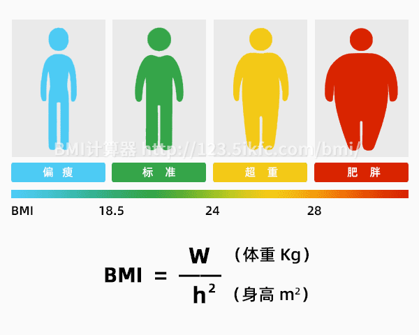

针对疾病因果关系链的第一个环节高危因素，我的建议是：

- 预防或者治疗慢性感染: +
比如，通过注射乙肝疫苗，通过阻断传染途径，应用药物抑制乙肝病毒复制等等，就可以在很大程度上避免"肝癌"的发生。

- 避免高危行为: +
高危行为包括抽烟，过度饮酒，熬夜，过烫饮食; 雾霾天不戴口罩; 应减少食用可能含有"亚硝酸盐"或者"黄曲霉素"的食物等等。

- 健康饮食: +
少吃糖，少吃红肉和加工肉类，少吃盐。多吃膳食纤维多的食物。比如全麦面包、燕麦片等全谷物、杂粮，多吃水果蔬菜，多摄入高Omega-3脂肪酸的食物，比如某些海产品。 +
尤其是膳食纤维。一项荟萃分析指出，增加膳食纤维, 有助于降低体重、血糖、血压、血脂，与冠心病、糖尿病和肠癌等多种疾病风险的下降有关。 +
建议每天摄入至少25-29克或更多的膳食纤维。

- 不要有赌博心理，谁又吸烟又喝酒，活了100多岁；谁天天运动还跑马拉松，结果得了胰腺癌。*健康生活方式的建议，是循证医学大数据得出的目前可靠的证据，这本身和一些"小概率事件"是不冲突的。*

|② 不破坏"修复"和"代偿"能力
|干预疾病"因果关系链条"的第二个环节："修复"和"代偿"能力下降。

多细胞生物赖以生存的一个关键机制，就是修复和代偿。 +
-> 细胞靠加速分裂，补充受损或者死亡的细胞，这是修复。免疫细胞清除“异己”，这也是"修复"。 +
-> 细胞和器官靠加快工作，替代受损的细胞或者器官执行功能，这是"代偿"。

我们的很多行为, 会影响到机体的修复和代偿能力:

- 熬夜会破坏肾上腺素等物质分泌的昼夜节律，从而抑制T细胞对侵入人体的病原体，或者肿瘤细胞的粘附能力。

|③ 针对疾病隐性期，应该进行疾病的早期筛查，尤其是癌症筛查。
| - 没有筛查之前，我国肺癌确诊时有将近80.0% 的患者已是中晚期，失去了根治性手术治疗的机会，5年生存率很低，大约在16.1%。如果早期发现，这个数字就可以提高到至少70%以上。

有四种癌症，具有明确的筛查价值。包括：

- 用低剂量肺部CT, -> 筛查早期"肺癌"；
- 用乳腺钼靶检查，或者加上超声、核磁共振, -> 筛查早期"乳腺癌"；
- 用宫颈细胞学涂片检查，或者加上HPV检测, -> 筛查早期"宫颈癌"；
- 用结肠镜, -> 筛查"结肠癌"和"直肠癌"。

|===

[.small]
[options="autowidth" cols="1a,1a"]
|===
|Header 1 |Header 2

|肺癌
|中国"低剂量肺部CT肺癌筛查指南"建议，年龄介于50岁-74岁之间，吸烟，以及已经戒烟但是戒烟时间没超过5年的人, 定期接受检查。

|乳腺癌
|中国抗癌协会乳腺癌专业委员会建议：

.20~39岁
不推荐对该年龄段人群进行乳腺筛查。

.40~45岁
⑴ 适合机会性筛查。 +
⑵ *每年1次乳腺X线检查。* +
⑶ 对致密型乳腺(腺体为c型或d型), 推荐与B超检查联合。

.45~69岁
⑴ 适合机会性筛查和人群普查。 +
⑵ *每1~2年, 1次乳腺X线检查。* +
⑶ 对致密型乳腺, 推荐与B超检查联合。 +

.70岁或以上
⑴ 适合机会性筛查。 +
⑵ 每2年1次乳腺X线检查。

."乳腺癌"高危人群, 筛查意见
建议对乳腺癌高危人群, 提前进行筛查(小于40岁)，筛查间期推荐每年1次，筛查手段除了应用一般人群"乳腺X线检查"之外，还可以应用MRI等新的影像学手段。

.乳腺癌高危人群的定义
⑴ 有明显的乳腺癌遗传倾向者。 +
⑵ 既往有"乳腺导管或小叶不典型增生", 或"小叶原位癌"(lobular carcinoma in situ，LCIS)的患者。 +
⑶ 既往行胸部放疗。

|肺癌
|根据<中国肺癌低剂量CT筛查指南（2023年版）>

2016年我国新发肺癌为82.8万例，死亡例数65.7万，*肺癌"发病率"和"死亡率"非常接近，说明其预后较差。* +
从2003 年-2005年至2012年-2015年，我国肺癌的5年生存率, 仅从16.1%提高到19.7%，主要原因仍是未能做到早期诊断和早期治疗。 +
**肺癌的生存与分期密切相关，分期越早，预后越好，I期肺癌患者的5年生存率可达85.5%-90.2%. **但我国肺癌患者在诊断时为I期的比例低于20%。因此，肺癌筛查和早期诊断对于改善患者预后、降低肺癌死亡率具有重要意义。

2011年，美国国家肺癌筛查试验（National Lung Screening Trial，NLST）首次证明**"低剂量计算机断层扫描（low-dose computed tomography，LDCT）筛查"可显著降低"肺癌"死亡率。** +
Meta分析和系统评价的结果表明，与对照组比较，LDCT筛查可使"肺癌"死亡率显著降低16%-21%。

2021年，美国预防服务工作组对其肺癌筛查指南进行了更新。*建议50岁-80岁、吸烟史≥20包/年 的目前吸烟者, 或戒烟不足15年者, 接受年度性的LDCT筛查。*

.中国的标准是: 如果具备下列条件之一，则建议参加肺癌筛查： +
（1）年龄介于50岁-80岁； +
（2）具有下列条件之一： +
①吸烟史：吸烟≥20包年（每天吸烟包数×吸烟年数）或被动吸烟≥20年，若现在已戒烟，戒烟时间不超过5年； +
②*有长期职业致癌物暴露史：长期接触氡dōng、砷shēn、铍pí、铬gè 及其化合物，石棉，氯甲醚mí，二氧化硅，以及焦炉逸散物, 和煤烟等肺癌致癌物；* +
③一级、二级亲属患肺癌，同时吸烟≥15包年或者被动吸烟≥15年； +
④如果某些高发地区有其他重要的肺癌危险因素也可作为筛选高危人群的条件。

LDCT筛查的禁忌证与2018年版筛查指南相比无变化。

与西方国家相比，**我国**肺癌发病的危险因素更为复杂，*超过40%的肺癌发生于非吸烟者中。(那就是说吸烟占60%.)*

近年来，**多项国外研究基于年龄、性别、种族、教育水平、BMI、家族史、吸烟史等因素建立了多个肺癌风险预测模型，**包括Bach模型、Spitz模型、LLP模型、PanCan 模型、PLCO模型等，并发现这些风险预测模型, 可更为精准地选择适合LDCT(低剂量计算机断层扫描)肺癌筛查的高危人群。美国对肺癌风险预测模型在肺癌筛查中的效能进行了评估，不同风险模型间也存在差异，因此，在2021年美国预防服务工作组肺癌筛查指南中，未建议基于风险预测模型来进行高危人群分层。

|肝癌
|具有"乙型肝炎病毒"（HBV）和/或"丙型肝炎病毒"（HCV）感染、长期酗酒、非酒精脂肪性肝炎、食用被"黄曲霉毒素"污染食物、各种原因引起的肝硬化、以及有肝癌家族史等的人群，*尤其是年龄40岁以上的男性风险更大。*

检查措施：血清甲胎蛋白（AFP）和肝脏超声检查。 +
具体建议：*建议上述高危人群, 每隔6个月进行至少一次检查。*

|胃癌
|根据<中国早期胃癌筛查流程专家共识意见(草案) >

年龄≥40岁，且符合下列任意一条者，建议其作为胃癌筛查对象人群：

①胃癌高发地区人群； +
②Hp感染者； +
③既往患有慢性萎缩性胃炎、胃溃疡、胃息肉、手术后残胃、肥厚性胃炎、恶性贫血等胃的癌前疾病； +
④胃癌患者一级亲属； +
⑤*存在胃癌其他风险因素（如摄入高盐、腌制饮食、吸烟、重度饮酒等）。*

检查措施：血清学筛查, 和内镜筛查，最终确诊需要病理证实。 +
具体建议：建议推荐的早期胃癌筛查流程如下图：

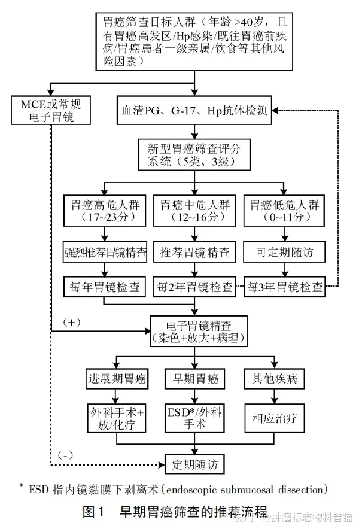

|食管癌
|

据 2009 年《中国肿瘤登记年报》数据显示，食管癌是继胃癌、结直肠癌和肝癌后最常见的消化道肿瘤。*我国食管癌以鳞癌为主，超过 90%，鳞癌新发病例数约占世界的 53%，腺癌则占 18%。*

根据 <中国早期食管癌筛查及内镜诊治专家共识意见>

*早期食管癌缺乏典型的临床症状，早期发现率偏低.* 寻找和实施有效的筛查方案和早诊早治, 是降低食管癌死亡率、提高生存率和生存质量的关键手段。

早期食管癌缺乏典型的临床症状。患者因进行性吞咽困难或转移性症状就诊时，多已属于中晚期，临床治疗效果不佳且花费大。**而在中晚期癌发生之前，存在长达5～10年的癌前状态、癌前病变及早期癌阶段，这为食管癌筛查提供了重要的窗口期。**因此，对食管癌高危人群进行筛查和早诊早治，是食管癌防治的重要策略与途径。

**食管癌是预后较差的恶性肿瘤之一。**食管癌患者总体5年生存率, 美国（20.0%）和德国（20.8%）.  +
由于**食管癌Ⅰ期患者治疗后5年生存率可以达到90%左右，**而Ⅲ期和Ⅳ期患者分别为32.80%和26.17%，因此继续推动我国食管癌的早诊早治工作尤为迫切.

中国, **食管癌筛查的高危人群判定标准为≥40岁，**并符合下列标准任意1条者： +
（1）出生或长期居住于食管癌高发地区； +
（2）患有"上消化道"癌前疾病或癌前病变［如低级别上皮内瘤变（low-grade intraepithelial neoplasia, LGIN）、Barrett食管］； +
（3）一级亲属有食管癌病史； +
（4）患有头颈部和（或）呼吸道鳞状细胞癌； +
（5）具有**食管癌高危因素（如重度吸烟、重度饮酒、进食过快、热烫饮食等不良生活习惯，室内空气污染，牙齿缺失）。**

食管癌的发生发展是一个长期的过程，经过炎症、癌前病变、早期癌逐, 渐演进至中晚期浸润癌。 *癌前病变 : 主要指食管鳞状上皮细胞的异型增生.*

内镜筛查, 是发现食管早期病变的有效手段。

下图为: 早期食管癌筛查及内镜精查流程图（注：SM1 为病变浸润黏膜下层上 1/3；SM2 为病变浸润黏膜下层中 1/3） +

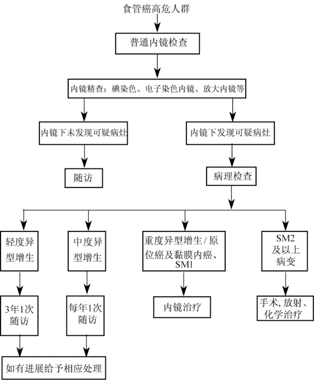

|宫颈癌
|

|结直肠癌
|

|子宫内膜癌
|

|前列腺癌
|

|===

== 每一种药，都代表了特定年代的医学认知水平

药的实质, 就是医学解决方案的物质载体。

比如阿莫西林，它背后是体现着一整套复杂的认知体系。比如嗓子疼和细菌的关系，细菌的结构，药物杀灭细菌的机制，药在人体怎么代谢，半衰期是多少等等。 每一种药，都代表了不同年代的认知水平。所以只有医学整体认知水平提高了，才可能交付出更好的载体，也就是更好的药。

对于药的安全性和有效性，法律监管只能保证它是一个“合格”的药。但是，让药更安全、更有效、副作用更小，最终依靠的是整体医学认知水平的提高。

== 实践, 是医学的核心理念

每个医生在上医学院的时候，都有读不完的书，而且都是大部头：生理、生化、解剖、组织胚胎、微生物、内、外、妇、儿、皮肤、性病、眼科等等。但是学了这么多理论，就会看病了吗？理论和现实永远不一样。而**"实践"是理论和现实之间的桥梁。**临床医学更是如此，实践是临床医学的核心理念。

医学和任何科学都不同。医学面对的是活生生的人，每个病人都不同。而且，即便是同一种病，不同的人用同一种治疗方法，用同一种药，效果也不一样。医学充满着不确定性。

理论上只要符合“1、2、3”，那么就能诊断。但是现实中没有清晰的线索用于诊断，需要医生去挖掘、梳理。有些病人会隐瞒病情，有些病人会故意隐瞒性倾向，隐瞒心理问题，隐瞒家族史、接触史，隐瞒病情的真正原因等等。甚至，医生在诊断过程中搜集到的信息和指标, 也可能会相互冲突、相互矛盾，客观检查的数据指标, 也可能并不是完全一致。所以, 临床医学充满了不确定，没有任何一个公式可以套用在任何一个病人身上。

奥斯勒(美国"约翰·霍普金斯大学医学院"奠基人之一) 是怎么解决这个问题的呢？首先，医学生在医学院上学的时候，就开始进入临床实习。这就是奥斯勒的“床边教学”。到病房里去学习、实习，边学习理论边实践。天天和病人在一起，想不成长都难。

奥斯勒经常说：多跟病人说说话，病人的语言就揭示了诊断。

如果医学生毕业之后，直接分配到不同水平的医院，那么他们今后的技术和能力势必发展也不同。水平有差异的医院，很可能会影响这些年轻医生的发展。所以，医学生从医学院毕业后，继续规范化培训。

比如中国, 医学生从医学院毕业之后，要想当医生，先要在国家规定的、具有培训资格的大医院, 进行三年的"住院医师"规范化培训。 +
在美国，内科系统要培训3-5年，外科系统要培训5-7年。

这些医生几乎是吃住在医院。不仅要培训医学知识、病人管理能力、沟通技巧、实践技能、多学科协作能力，还要培训科研能力、教学能力和职业精神。

断肢再植。**要在显微镜下精细地缝合血管、神经、组织，**还要保证缝合后的血运，避免缺血时间过久。

.“针感”从实践得来

对于某些能在CT上看到的小结节，有的时候需要穿刺活检，明确它的病理性质. 但是人是一个活体，**每个结节生长部位不同，穿刺难度也不同。比如肺里的结节还会随着呼吸和心跳产生移动。**能看到的，未必能够穿到。

这个结节位置很深，如果长在肺的边缘，很多医生都可以穿刺成功。*但是这个结节长在肺内非常深的位置，而且最难的是，它不仅会随着呼吸移动，它还紧邻主动脉。穿刺的时候，如果病人剧烈咳嗽，或者医生的手稍微一抖，那么你肯定知道结局。*

理论上需要穿刺，但是现实中找谁操作呢？这个61岁的病人到北京大学肿瘤医院找到了柳晨医生。医学界有人把柳晨称为“中国穿刺第一针”. 他几年内读过几万张影像学片子，每天不断地实践。*每一个结节在穿刺之前，他都能立刻在大脑中构建出这个结节的三维空间位置、结构，以及穿刺路径。*

柳晨医生经常对其他医生说，“穿刺靠的是实践，靠的是在大脑中本能形成的三维立体图像，靠的是“空间感”和“针感”，*也就是穿刺过程中穿刺针穿过不同组织，传递到手心的感觉。*”

柳晨叮嘱病人，“千万别咳嗽".

== 要让病人能有尊严地活着

临床医生要做的, 就是结合医生自己的临床经验 + 患者的期望意愿, 来给病人制定最佳的治疗方案.

现代医学已经认识到 : 单纯地延长存活时间是远远不够的，维护患者的尊严，支持患者的生活意义，提高患者的生命质量，是医学最重要的使命。 +
不关心人的科学是傲慢，没有科学依据的关心是滥情。如果你不能切实地帮助患者，你的关心，就没有价值。(但很多时候是做不到实质性的帮助的，只能安慰，你不是上帝，不可能解决所有的问题. 所以关心依然是有价值的.)

很多病，会让人失去尊严。

癌症晚期的病人最怕的不是死亡，而是疼痛. 有的病人痛不欲生，甚至抑郁自杀。

晚期癌痛，医生们就用药物或者手术，让病人不那么疼。让病人在不疼中，有尊严地走完生命的最后时光，对于他们来说，比多活几天更重要。

医学从来都具有"科学"和"人文"的双重性格。只有伴随着"科学"的人文, 才是真人文。

== 让病人追求自己独特的意义

有的人们为了实现自己的价值，他们并没有选择医生认为的最有利的方案。

- 一个乳腺癌的女性坚持要怀孕，怀孕可能会加重她的病情，缩短她的生命。但在她看来，能有个后代, 就是她生命的全部意义。

== 医患不是甲方乙方，而是"阶段性"的联盟.

不应把医疗, 单纯看做是消费. 因为医疗这个行业, 带有特殊性。每一个病人都是不同的个体，即使是同一种病，治疗过程也不相同，达不到完全的标准化流程。同时，治疗结果也是不确定的。如果把医疗看做是消费，那怎么评价质量呢？如果我对这次消费不满意，可以退款吗？

- 医生具有技术优势，掌握诊断技术、病因、预后（预测疾病的可能病程和结局）、治疗方案, 及预防策略。
- 患者的优势在于 : 提供治疗的体会、本人生活习惯，以及其他有助于诊断和治疗的关键信息。(即提供医学实验的效果反馈)

*医患之间, 其实只有阶段性关系。只要有更好的治疗方法，病人可以随时换医院、换医生，而且不论治疗多久，这种医患关系早晚是要终结的。*

你或家人病了，怎样决策呢？在过去，很多人会认为，我啥都听医生的，反正我急也没用，让医生全权决定我的诊断和治疗。今天，很多人认为，我要对治病的每个过程和细节都了如指掌，我要决定每个环节。其实, 这两种态度都不是科学的态度。

决策体系，可分为了三个环节，知情、选择、寻求支持。

[.small]
[options="autowidth" cols="1a,1a"]
|===
|Header 1 |Header 2

|知情
|现代医疗制度中，知情是一项重要制度，指患者对自己的病情, 和医生据此作出的诊断与治疗方案, 明了和认可。 +
*它要求医生向病人提供作出诊断和治疗方案的根据，并说明这种治疗方案的益处、不良反应、危险性及可能发生的其他意外情况，使病人能自主地作出决定，接受或不接受这种诊疗。* +
在治疗之前会有术前谈话，签署知情同意书，查房的时候还会对病情做进一步解释等等。

但是在短时间内，由于医学专业知识门槛高, 要想真正达到知情的最佳目的并不容易。(*所以你平时就要多了解和学习.*)

无论医生谈话、术前告知，还是知情同意，各种交流, 都包括了五个核心问题. 如果我们能够了解这五个问题并梳理出来，不懂的点还可以去再次和医生进行沟通，那么也就可以在很大程度上做到知情了。这也是《英国医学杂志》有篇论文提到的五个问题:

- 第一个问题：我真的需要做这个检查、治疗或手术吗？
- 第二问题：有什么风险或者不足之处？
- 第三个问题：可能会有什么副作用？
- 第四个问题：还有其他更简单、更安全的选择吗？
- 第五个问题：如果我什么都不做，会怎么样？

这五个问题就是医生在决策之前，向病人交付的关键点。

我们需要并且只需要和患者沟通治疗的框架，进行原则性的选择，至于复杂细致的专业问题就交给信任的专业人员去处理。
所以，知情的目的不是把病人都培养成医生。

医生是诊断和治疗的专家。患者是对自己的身体、人生价值、经济状况、治疗预期、治疗效果最了解的人。医患关系的本质是联盟.

|选择
|美国医生葛文德（Atul Gawande）通过一项调查指出，64%的人表示，如果自己得了癌症，他们希望可以自己选择治疗方式；但是真正得了癌症的人中，只有12%希望自己作决定。

很多时候选择没有对错，也没有通用原则。

比如，一个高龄老人，骨折，需要做关节置换。不做，会很痛苦，还会发生各种卧床并发症。做，那就面临着更大的手术风险。这个时候做，还是不做？这些问题即便是医生都很难作出最佳的选择。

|寻求支持
|经常有朋友给我打电话，说：“我现在有个亲人住我们这边的ICU，你能不能给指导一下？" 我说，即便我有经验，我也不如病人的主管医生。 +
因为，只有主管医生是最了解病情的人，也只有他才能看得到每一种药用下去之后病人的反应。他能把病人的每一个症状和冰冷的数据结合起来.所以，在决策的时候，寻求支持的第一人选，不是你的医生朋友，而是你的医生。

|===

== 中国推行的医院间的分级诊疗，本质就是分工协作

- 乡镇卫生院、社区服务中心 : 保障基础的医疗保健，慢病管理、健康教育, 可以完成疾病的首诊。
- 大医院和专科医院 : 对于疑难病、复杂病、急性病有能力有经验。

大医院和基层医院相互转诊，急性病在大医院得到有效治疗后，还可以转到基层医院继续康复。

这就是基层首诊、双向转诊、急慢分治、上下联动。

'''

== ---------- ----------

'''

== 人的处境, 会大大影响人的心理

你知道每天有多少外地病人, 进京看病吗？每天至少有70多万。这么算下来，每年就是两个多亿。这些人风餐露宿，整宿守在医院门口，就为了一张专家号。你能想象病人排了一宿的队之后，见到医生是什么感觉吗？就像见了神一样。(所以古代, 带有宗教色彩的农民起义, 都把宗教神棍当做神仙看待, 因为他们声称能看病.)

== 早诊断, 是经济收益最大的方法

很多病根本没症状，是去医院检查以后才发现的。

实际上，几乎多数癌症, 都经历了一个漫长的没有症状的过程。

- 肺癌可以在体内潜伏20多年，然后突然转变为侵袭性的癌症.
- 科学家推测，在90岁以上去世的人当中，如果能够给他们进行尸体解剖，很可能多数人体内, 都有癌症或者癌前病变，只是生前没有感觉而已。

- 我们每个人从出生开始，得冠心病的风险就在不断增加。*婴儿一出生，血管就开始逐渐地老化，到了成年，血管壁上开始出现
斑块，血管会慢慢硬化变窄。当血管继续狭窄，超过70%、80%，甚至90%的时候，人就开始出现"心绞痛"的症状了。*

治病的代价远远大于预防。疾病预防，永远是性价比最高的举措。

== 人会生病的原因

[.small]
[options="autowidth" cols="1a,1a"]
|===
|Header 1 |Header 2

|我们的基因是不完美的 :
|癌症，各种遗传病、慢性病，都跟基因有关。

|人体设计是不完美的 :
|**进化的逻辑是让利益和风险平衡，而不是让利益最大化。所以导致了人体器官性状的不完美。**可以说，几乎人体的每个器官, 都有不完美的地方。

你知道人类到今天可以得多少种病吗？到目前为止，世界卫生组织（WHO）一共收录了26000多条疾病的名称。但肯定还有很多未知的病不在这个疾病清单里。

- 胃酸几乎能杀灭所有的细菌，但是它却不能消灭"幽门螺旋杆菌". 而这种细菌会让我们得胃炎、胃溃疡，甚至得胃癌的几率明显增加。
- 我们人体的免疫系统, 可以攻击病毒、细菌、癌细胞，但是它有时也会误伤我们自身 -- 产生"自身免疫病"，比如红斑狼疮、类风湿关节炎等等。
- 心脏很重要, 但心脏自身的血管却非常细，细了就容易窄甚至堵，结果就是心绞痛和心肌梗死。
- 人类排泄废物是用两个通道：一个尿道，一个肠道。一个液体，一个固体。多一套系统，也就多一层风险。医院现在要分"泌尿科"和"消化科", 来处理两条道上的问题。

|人类与环境适应的不完美 :
|"人类进化"的速度, 永远赶不上"人类生活环境"变化的速度，一个重要的结果就是带来了病。

- 不用使劲跑就可以获得高脂肪、高热量的食物, 同时也带来了肥胖、高血脂、高尿酸等一系列代谢性疾病。肥胖又增加了人类患癌的风险。
|===

== 内共生

目前所有的研究, 也只能反应内共生与疾病关系的冰山一角.

[.small]
[options="autowidth" cols="1a,1a"]
|===
|Header 1 |Header 2

|内共生
|真核细胞里的线粒体, 是由细菌演化而来的。真核细胞和它内部的细菌是"内共生"关系。

- 如"5-羟色胺"是让人产生快乐的物质。人体自身合成的5-羟色胺只占总量的5%，另外95%是由细菌合成的。
- 肠道。为了和细菌作战，人体给肠道配备了最王牌的部队。有七成以上的免疫细胞集中在肠道，包括巨噬细胞、T细胞、NK细胞、B细胞；还有七成以上的免疫球蛋白A（IgA）是由肠道制造的。可以说肠道是人的免疫系统和细菌作战的最大战场。

|打破内共生就会带来病
|很多药物包括化疗药物、抗生素，很多食物包括糖，都会干扰"内共生"。内共生关系一旦被打破, 就会带来病。

1.细菌移位会带来病。也就是说，细菌跑到不该去的地方了。细菌如果在它应该待的地方，就是正常菌，或者不会引起严重的问
题；如果细菌跑到其他地方，就会变成有害菌。

- 阿尔茨海默症，在这些病人的大脑里，发现了牙周炎的细菌和一些引起口腔溃疡的白色念珠菌。

2.内共生被打破，有害的微生物就会趁虚而入，这样也会带来病。

- 很多女生用含有杀菌剂的洗液冲洗阴道，那么接下来反而会引起真菌感染，引起"真菌性阴道炎"。
- ICU 中, 因为严重感染必须大剂量应用抗生素的病人，就很容易继发耐药菌的细菌感染, 或者深部真菌感染。

3.内共生被打破，导致"细菌合成化学物质"异常，也会带来病。

- 大脑细胞完成信号传递功能，涉及到主要20多种化学物质，这些化学物质中, 很多都是由肠道细菌参与合成的。如果肠道菌群紊乱，就会引起精神问题，比如焦虑、抑郁、自闭症等等。

|怎么重建或者恢复内共生呢？
|1.如果不是严重的或者关键部位的细菌感染，就少用抗生素。因为抗生素是对内共生破坏最大的药物。

- 健康人不要动不动就用含杀菌剂的任何洗液或者漱口水。

2.孩子的成长过程别太干净，要让孩子多和大自然接触.

- 产妇能顺产就不要剖腹产。现在研究认为，经过女性产道的婴儿, 可以迅速建立起第一道多样性更好的肠道菌群。

3.多吃膳食纤维丰富的食物。比如苹果、梨、魔芋、黑麦、黄豆、青豆、枸杞、石榴、椰子、冬
菇。

4.少吃糖。

|===

== 免疫系统的问题

[.small]
[options="autowidth" cols="1a,1a"]
|===
|免疫系统 |Header 2

|认不出“坏人”
|- 流感病毒, 为了逃避人体免疫，会不断地变换病毒表面的H蛋白。H蛋白就是一种辨别物质，H蛋白变了，人体免疫也就认不出来了。
- 水痘-带状疱疹病毒，它可以藏在神经节里。很多病毒可以藏在细胞里，让免疫细胞找不到。
- 癌细胞有个机制能逃过人体免疫，就是伪造一张“身份证”，骗过免疫系统的检查。

有时候，即使认出来了，癌细胞也会释放一些物质麻痹免疫细胞，让免疫细胞的杀伤能力大大降低。

|认不出“自己人”, 把“自己人”当“坏人”
|1.人类自身免疫病有100多种，但是机理都相似，都是人体免疫不断地攻击自身的细胞。

- 红斑狼疮这个病，眼睛、皮肤、造血系统、肺部、肾脏，几乎人体的每一个器官，每时每刻都在遭受着自身免疫的攻击.

*在临床上，各个学科的难题通常都会涉及到自身免疫问题。有专家说过，当你遇到解释不通的临床问题时，就想想会不会是自身免疫出了问题。*

'''

2.过敏 : 就是免疫系统把本来无害的物质辨别为“敌人”，产生过度的反应。

- 过敏性鼻炎、荨麻疹、湿疹、哮喘这些病都是过敏。

|打不过“坏人”
|免疫功能低下。

- 比如艾滋病、白血病、糖尿病、尿毒症。这些病有的是免疫细胞的数目减少，有的是功能降低.

|===

== 癌症

==== 癌症的链条

[.small]
[options="autowidth" cols="1a,1a,1a"]
|===
|链条环节 || ← 针对此环节的治癌方法

|DNA 错误的图纸
|正常的基因突变成癌基因.

正常细胞生长分裂, 需要"生长信号"，同时还有"抑制信号"防止过度生长。癌细胞一个最大的特点就是"生长信号"多，而且对"抑制信号"不敏感。所以，癌细胞长得快，不停地长。

|← 靶向药

|失效的自检体系
|人体有一种"细胞凋亡机制"，目的是让这些不合格细胞自我销毁。细胞的凋亡就是细胞的程序性死亡，它是人体防止细胞癌变的一种主要机制 -- 由抑癌基因（ tumor suppressor genes）控制。P53就是一种抑癌基因。 +
如果抑癌基因发生突变, 那本该自杀的细胞就会不死。
|←

|灵活的能量供应
|正常情况下，一个细胞和它最近的毛细血管的距离, 不能超过100微米，也就是0.1毫米。太远了营养够不着.

但是，癌细胞特别灵活。癌症的时候，促进血管形成的信号增多，而抑制血管形成的信号减少。这样，就有持续的新生血管形成，源源不断地给肿瘤组织供血。这就好比是，“癌症跑车”上路，既然找不到固定的加油站，那么就自带移动的加油枪，随时供应燃料.

所以在临床上，多数恶性肿瘤通常都是血流丰富。医生们甚至用这个特点区分良性和恶性。

|← 血管内皮生长因子抑制剂，就是针对癌症组织血管丰富的特点，抑制血管生长，也就抑制了肿瘤的生长。

|失明的警察
|正常情况下, 免疫细胞就是警察，它们会主动寻找和攻击癌细胞。但癌细胞会伪造一张“假身份证”，躲过警察的检查. 这种机制叫做免疫逃逸。
|← 免疫治疗药物PD-1抑制剂，就是恢复警察的火眼金睛和战斗力.

|篡改生死簿
|正常细胞的分裂次数是有极限的, 所以细胞是有寿命的。但癌细胞可以无限次分裂。
|←

|自由游移
|正常细胞就是按照基因编码，不会乱长。胃里的细胞永远也不会长到鼻子上去。 +
但是癌细胞不同，它们能在组织内部和组织间灵活移动，也就是癌症容易发生侵袭和转移的原因。
|←

|===

而所有的癌症治疗方法, 就是针对上述这6大环节的 (切断链条). 所有治疗的前提，都是基于医学对于这六大环节的认知越来越清晰。

==== 癌症发生的原因

人体的自我修复, 需要细胞分裂. 但细胞分裂也会带来随机错误。  +
人的基因组有31.6亿个碱基对，每次分裂这31.6亿个碱基对都要复制一次。工作量太大就难免出错. 每次细胞分裂都会带来随机错误。随着这些错误不断累积，犯的错就会越来越多，就有可能发生在关键点上, 变成癌基因。 +
所以，细胞分裂次数越多，癌基因发生的几率也就越大。

年龄越大，细胞分裂次数也就越多，癌症发生风险也就越来越高。 +
数据显示，40岁以上的人患癌症的风险, 呈指数倍增长。如果人的寿命达到85岁，累计癌症发生风险高达36%。

2017年《科学》（Science）杂志发表了一篇研究, 认为 : 引起癌症基因突变的因素中，最主要原因是染色体复制过程中发生的随机错误，这个因素占到了66%。而环境因素和遗传因素，加一起也只占34%。

为什么这些年，癌症突然就多了？主要原因是: 人的寿命延长了。

- 骨癌的基因突变：随机错误占了99.5%，遗传占0.5%，与环境因素完全无关。
- 甲状腺癌，随机错误占98%，遗传占1.5%，环境因素仅占微不足道的0.5%。
- 非何杰金氏淋巴瘤、脑部肿瘤、前列腺癌、睾丸癌，这些癌症的基因突变中，随机因素都占到了95%以上。

将癌症推迟的方法就是:
[.small]
[options="autowidth" cols="1a,1a"]
|===
|Header 1 |Header 2

|减少器官损伤, 即减少细胞修复次数 :
|- 戒烟、戒酒、减肥、多运动、多吃全谷物食品、蔬菜、水果、豆类，少吃糖、少吃红肉（比如猪肉、牛肉、羊肉）
- 避免乙肝病毒、丙肝病毒、幽门螺旋杆菌、HPV病毒感染。已经感染了，要治疗或者定期复查。

|定期进行疾病筛查。早期发现，早期治疗.
|避免这些良性的病变, 进一步发展成为恶性的癌症。 +
超过一定年龄之后定期进行科学的筛查，是发达国家总结出来的可行的癌症预防方法。

- 美国明尼苏达大学癌症检查中心，对45岁以上无症状的普通人, 每年做一次"乙状结肠镜"检查，见到"腺瘤"就切除。("腺瘤"就是一种癌前病变，长期发展就可以变成癌症。) 这样做的结果，就是结肠癌、直肠癌发病率比预期的减少了85%。

|===

== 冠心病：不只是器官问题，而是全身病

冠心病是因为血管窄了、堵了，引起心绞痛和心肌梗死。但是，为什么有些冠心病的病人容易脑血管也出问题呢？为什么有些男病人容易出现性功能障碍呢？原因是 -- 冠心病反映全身血管问题. 换言之, 是先有血管问题(因), 后有冠心病(果).

血管内皮就会受损，血液里的脂质就会沉积，就像河道的淤泥一样。时间久了，还会形成斑块，血管就会越来越狭窄。正如交通体系拥堵一样, 一旦一个部位出问题了，窄了，那么其他部位的血管，能好到哪儿去呢？ 动脉血管出问题了，长斑块，变狭窄，影响血流了 :

- 如果出现在"肾动脉"，就会导致肾动脉狭窄；
- 如果"脑血管"病变了，就容易发生脑血栓、脑出血；
- 如果发生在供应"肠道"的动脉里，就会引起肠道功能异常。完全堵死了，还会出现肠坏死。
- 如果供应"男性器官"的血流减少了，离阳痿还远吗？
- 当供应心脏的动脉血管——冠状动脉长斑块，变狭窄了，如果超过一定程度，就是冠心病。

这些病本质上都是动脉血管出问题了。(动脉血管问题是肇事的"因", 上面这些病只是后到的"果"而已)

有了冠心病的病人，很可能也容易发生脑血管病，或者其他动脉缺血引起的病。

医生想到：既然冠心病是因为血管里有地方窄了，那把这个最窄的地方扩张起来，不就可以了吗？但是问题很快来了，大约50%的病人，他们好不容易拓宽的地方，慢慢又重新窄了。 +
到了1987年，法国有位医生说，如果拓宽后再放个金属支架撑起来，就不会变窄了吧？ -- 这就是冠脉介入手术。

但是，对于"稳定性心绞痛"的病人，和单纯吃药比起来，吃药加上支架并不能降低病人发生心肌梗死的几率和死亡率。

*"稳定性心绞痛"就是冠脉血管狭窄了。严重的，如果狭窄在70%以上，就会影响血流。病人累的时候，心肌需氧增多，但是血流又供不上，就容易发生心肌缺血缺氧，就会疼。这就是稳定性心绞痛。*

为什么放支架, 并没有降低这部分病人发生心肌梗死的几率呢？

*引起冠心病的主要问题，是年龄，是不健康的生活方式，还有高血压、高血脂、糖尿病、肥胖等等。所以，如果这些因素持续存在，单纯放支架解决了一个部位的狭窄问题，但是预防不了其他部位继续狭窄。就像交通拥堵一样。在高峰期，单纯拓宽一个桥、一个路口没用，因为流量大这个根本问题还存在，那么还会引起其他的路、其他的桥继续拥堵。*
同样，冠心病可能是一个矛盾最集中的点而已。得了冠心病，很可能其他部位的血管也好不到哪里去。

已经证实的可以降低冠心病死亡率和心肌梗死的药物，包括：

- 抗血栓的药物，如阿司匹林；
- 降血脂的药物，如他汀；
- 减慢心率、降低心肌氧耗的药物，如倍他乐克等；
- 降低血压、改善心肌重构的药物，如某某普利、某某沙坦。

这四种药物，是治疗冠心病的基础药物。

给西直门桥拓宽、改造。这就好比是介入手术。介入手术尽管解决不了全局问题，但是介入手术可
以解决矛盾最集中、最危急的情况。

心绞痛变得没有规律了，我们也称为"不稳定性心绞痛"。药物已经控制不住了，不处理的话很容易发生心肌梗死。这个时候做介入手术，放支架，也是非常有必要的。 +
有些病人吃药控制不住心绞痛的症状。对于这类病人，介入手术对于改善症状也非常必要。

最后，咱们还有其他方法，这就是冠状动脉搭桥手术。它尤其适合那些合并了糖尿病的严重冠心病病人。

== 压力会导致的胃溃疡

把两只猴子 a,b 分别捆在两把椅子上，每20秒钟椅子会自动放电一次。但是，给其中一个猴子a开关, 如果它能在快要放电的时候准确地按下开关，那么两只猴子就可以同时避免挨电。按错了，就一起挨电。几天过去了，其中一只猴子得了胃溃疡，另外一只安然无恙。是哪只猴子病了呢？是积极主动，按压开关的这只猴子a呢？还是消极被动，默默承受的那只猴子b呢？*答案是，负责按压开关的 a猴子病了。*

挨电就是一种刺激，我们称为应激。仅有应激，不会得病，只有对应激产生了剧烈的心理变化，才会之后引起了身体上的病。所以它的三个环节：应激、心理改变、躯体疾病，缺一不可。

.案例
====
- 伞兵天生就是被包围的。 事实上有项研究指出，对伞兵而言，即使是刺激的军事训练, 就能成为引发溃疡的一种危险因素。

- 压力越大的部门，尤其是这个部门的领导，就越容易得心身疾病。

- 二战时, 德军对列宁格勒的围攻，持续了872天。战后，医生们给列宁格勒的居民做体检, 发现幸存居民的高血压发病率, 是战前的16倍，从战前的4％上升到64％。
====

人生不如意十之八九. +
消化系统是最容易受到影响的系统之一。比如胃溃疡、神经性厌食，再比如一紧张就吃不进去饭了，或者一有大事就肚子疼。

人体几乎每个器官都有可能发生心身疾病(即情绪心理, 影响身体疾病)。 如:

- 反映在皮肤上，会出现斑秃、湿疹；
- 反映在循环系统上，会出现高血压、冠心病；
- 反映在呼吸系统，会出现哮喘；
- 反映在泌尿生殖系统，会出现男性阳痿、女性性交疼痛和性冷淡；
- 如果影响了免疫系统，就会出现自身免疫病，比如甲亢、类风湿关节炎，甚至免疫低下引起癌症。

据统计，心身疾病的发病率, 女性高于男性，城市高于农村，脑力劳动者高于体力劳动者，发达地区高于不发达地区。

== 疼痛：不仅是症，还可能是病

世界卫生组织认为，"疼痛"是除了"血压"、"呼吸"、"脉搏"、"体温"之外的第五大生命体征.

疼痛就是一种最常见的症状。60%以上的门诊病人，是因为疼痛就诊。30％以上的成人有慢性疼痛，而且随着年龄增长，这个比例还会逐年增加。

中国传统观念里, 会认为忍痛是一种英雄行为。比如关公刮骨疗伤. 但是国外则不这样看. 在中国，无痛分娩率不到10%，在美国这一数字是85%，在英国是90%。中国吗啡类的镇痛药物用量不到美国的1/10, 而中咱们的人口是人家的4倍多。

疼痛跟体温、血压、脉搏都不一样，疼痛没有一种客观的测量手段。 医学上有个疼痛标尺，用0-10分表示疼痛的级别。这种方法也只是相对准确。医院有句话：病人说疼就是疼，病人说有多疼，就有多疼。因为，你永远不知道别人有多疼。

研究表明，痛觉的产生, 有明确的神经传导通路。各种损伤会刺激人体组织，释放致痛物质，也就是导致疼痛的化学物质。接下来，这种化学物质会转化为生物电信号，然后由神经通过脊髓传给大脑。所以，这个通路上的任何一个点出问题，痛觉都会受影响。

- **经常会有糖尿病病人, 因为暖水袋烫伤。就是因为糖尿病损害了病人的末梢神经，**所以，这条通路也就受到了影响。痛觉降低了，感受不到疼，也就不知道躲，就这么生生地被烫伤了。
- 如果没有痛觉，是一件很可怕的事。医学上有一种罕见病——"先天性无痛症"。这些人生下来就不知道疼是什么感觉, 也就不知道躲。美国有个案例, 有个孩子她长牙以后，和别的小孩一样喜欢啃手指。但是，如果没有人阻止的话，她会把自己的手啃得血肉模糊，甚至露出骨头。

尼采说过：疾病损害人的机体，疼痛摧毁人的灵魂。 +
疼痛不仅能摧毁人的灵魂，疼久了，也会对身体带来巨大的伤害。

[.small]
[options="autowidth" cols="1a,1a"]
|===
|Header 1 |Header 2

|急性疼痛 :
|通常容易找到原发病。

|慢性疼痛 :
|是"持续时间大于三个月"的疼痛. +
很多慢性痛，找不到病因。慢性疼痛本身就是一种病。

持续的疼痛, 会影响病人的生理事实:

- 身体的多个系统，比如神经系统、消化系统，内分泌系统、循环系统、免疫系统, 都会相继出现功能紊乱。
- 疼久了，还会促进"神经系统"发生"病理性重构"。也就是说，痛觉通路异常了，疼痛的感觉乱了。没刺激，也会疼。 +
有些长期腿疼的病人，神经通路就会发生"病理性重构"。截肢以后，病人仍然会感觉到腿疼 -- 即"幻肢痛".

既然"慢性疼痛"是病，就必须治疗。 +
把"忍痛"认为是美德，非常不科学，更不人道。

- 一个肝癌晚期，已经全身转移的病人, 这个时候，止疼就成了她最重要的治疗。

有一种常见的错误观念，认为止疼药会上瘾. 其实，美国国立卫生研究院指出，癌症病人吗啡药物上瘾的比例低于1％。所以，世界卫生组织强调：对于医疗上需要使用吗啡的病人，应该满足需要。在这一点上，咱们远远没有达到世界水平。

当然，前提是必须首先确诊。在确诊之前，盲目用止疼药可能会掩盖病情。

|===

一旦明确病情之后，所有的疼都不需要忍。免除疼痛是人类的基本权利。 +
国际疼痛学会（ International Association for the Study of Pain）把每年的10月11日定为“全球征服疼痛日”。就是为了唤起全世界的人，对于"止疼"的重视。

**免除疼痛不只一种人道主义的关怀，止疼更是一门专业的学科。**这个学科专门研究疼痛的病理生理机制，还有科学止疼的方法。他们用药物、手术，可以有效地去除绝大部分的疼痛。

== 静脉输液：给药途径的新思路

*在医学上，药、液体、营养、电解质、白蛋白、氨基酸、葡萄糖，甚至血液等等，都是治病的"能量"。给药途径，本质上就是一种“能量投放系统”。*

.案例
====
霍乱是一种由"霍乱弧菌"引起的"烈性消化道传染病"。病人会出现剧烈恶心、呕吐、腹泻。严重的病例，几个小时就可能脱水而死。*病人无论吃进去啥，喝进去啥，立刻就会拉出来。腹泻又造成了严重脱水，体内电解质也会发生紊乱。*

这个时候，怎么通过"口服"这个原有的"能量投放系统"，补水、给药、给营养呢？ 这个系统失效，就会危及生命。

既然全身的血管是连在一起的，那么**把液体通过血管输进去，不就可以解决能量投送问题了吗？ 这就是"静脉输液技术".**

不过在早期, 盐水的浓度应该是多少？电解质是什么比例？如何正确消毒？所有这些关键因素在当时都没有得到解决。一直到当"电解质平衡理论"和"低血容量性休克"的病理生理机制, 得到阐释之后，静脉输液技术才得到迅速推广开。
====

1972年，美国成立"静脉输液护士协会"（INS）。INS标准成为了世界各地"静脉输液治疗"的指南。

医学的发展, 就是 *不断出现的新情况，让医生不断地开发出新的能量投送通道。* +
就是在治病过程中，若一条老路在新困难面前走不通了，那么，就必须开拓一条新路 (新方法)。

[.small]
[options="autowidth" cols="1a,1a"]
|===
|Header 1 |Header 2

|"深静脉穿刺"方法 :
|大面积烧伤的病人，怎么给药呢？这些**病人全身的皮肤都烧坏了，怎么找血管呢？这个时候，医生可以"深静脉穿刺"。**也就是从颈部，或者从大腿根，或者从锁骨下，*把一根无菌导管放到深部的、更粗大的血管里，输送药物。*

|“输液港”（implantable venous access port，PORT）方法:
|需要长期化疗的肿瘤病人，化疗药有刺激。*用表浅的血管就容易得静脉炎，就需要刚才说的这些深部大血管。* +
但是，化疗是个漫长的过程。如果每次都穿刺，病人太痛苦了，而且也不安全。那怎么办呢？医生又发明了一种叫做“输液港”的技术。

把这个"输液港"埋到病人皮下，输液港一头放到深部大血管里，另一头放在皮下，就像建造了一个临时“港口”。以后每次给药，把药直接打到这个“港口”里，然后药就能进入人体了。

image:img/implantable venous access port.jpg[,50%]

|"介入治疗 interventional therapy"方法 :
|肿瘤病人的用药，经过血液稀释，人体代谢之后，能达到癌症组织的药物浓度就低了很多。如果加大药量，药物浓度增加的同时，不良反应也会增加。 +
**肿瘤科的医生就开发出"介入治疗"。也就是把导管, 直接放置到供应肿瘤组织的那根血管里。局部给药，**既增加了药效，还降低了化疗药物的不良反应。

|透析技术
|*尿毒症病人的肾没办法工作了，体内的毒素也就清除不出去。必须寻找一条新的途径清除这些毒素。* 血液透析、腹膜透析技术，可以利用分子弥散原理，让这些毒素物质排到体外。

|口服补液
|研究发现，即便在腹泻的时候，肠道也并不是一点都不吸收。只要口服的液体成分中, 葡萄糖和氯化钠按照一定比例搭配，人喝下去，肠道还能吸收。而且效果和"静脉输液"差距不大。 +
今天，儿童腹泻，多数情况通过"口服补液"就可以解决了，只有严重病例, 才会需要"静脉补液"。静脉输液未必比口服来得更快。

|===

除了输液技术的提高，能输的液体种类, 也大大丰富了。 +
比如，静脉营养。营养主要是通过肠道吸收的, 病人没了肠子还怎么活呢？就是通过静脉把营养输进去。*把葡萄糖、氨基酸、脂肪乳、微量元素、电解质，这些生命必须的能量物质，按照合适的比例，计算好热卡混在一起，通过静脉血管, 输送
到她的身体里。*

今天的静脉输液技术, 已经成为了临床上最常见，也是最普通的治疗技术。

== 麻醉：不疼后，才有无限的后续治疗可能

麻醉的出现，是医学发展的分水岭。因为有了麻醉，很多治疗技术才得以实现。

在200多年前，人们要是得了必须做手术的病，就得忍着疼做手术。因为疼，手术必须做得快。那么肯定就做得不细致，导致病人死亡率高。当时外科大手术的死亡率超过70%。疼的问题不解决，外科手术就没办法往前走。

进入19世纪，麻醉终于诞生了。美国医生 Crawford Long 发现了一种跟笑气类似的东西——乙醚 mí，而且乙醚的麻醉效果比笑气还好。1842年3月30日，朗医生给病人吸入乙醚，成功地进行了世界上第一台麻醉手术。之后, 3月30日也被定为“国际医生节”，就是为了纪念"麻醉"给医学带来的巨大改变。

很多手术不一定必须全身麻醉, 只让需要手术的地方不疼就可以了。这就是"局部麻醉".

再发展，麻醉从外科中独立了出来，成为了一门独立的学科，有了专职的麻醉医生、麻醉护士。

*麻醉让以前很多无法开展的手术, 成为可能。在不疼的基础上，复杂、精细的外科手术得以实现。* 医生不用再因为疼，而去尽量缩短时间导致手术粗糙。据我(薄世宁)所知，最长的手术时间记录是96个小时。

- 进行肺癌手术的时候，麻醉医生可以让病人"单肺通气"，也就是让两个肺中的一个肺来呼吸，把另外一个肺留给外科医生做手术.
- *如果出血量大，麻醉医生可以人为降低病人的血压，这样出血速度就慢下来了。*
- 做心脏和大血管手术的时候，为了不让病人的重要器官缺氧，麻醉医生甚至可以把患者的体温降到最低16℃。
- 无痛胃镜、肠镜也用到了麻醉；试管婴儿技术穿刺取卵，无痛膀胱镜，各种深部穿刺，组织活检，这些都用到了麻醉。

一台全麻手术，还要做到不知。这是从心理层面关心病人。如果病人可以感知手术场景，可能会出现心理创伤。

== 护理：既是医嘱执行者，又是安全代言人

[.small]
[options="autowidth" cols="1a,1a"]
|===
|Header 1 |Header 2

|病的恢复不只是诊断、治疗这么简单。护理是不可缺少的另外一环。
|1854年克里米亚战争中，英军有军医，但是没有专业的护士，伤员死亡率在42%以上。有了专业护理以后，伤员死亡率一下子降到2.2%。创造这个奇迹的人就是南丁格尔 Florence Nightingale。国际护理的最高奖是"南丁格尔奖"，每年5月12日的国际护士节，就是她的生日。 +
南丁格尔分析了克里米亚战争中英军的死亡原因。发现，真正在战场上战死的士兵不多，反而大部分死亡，是战地恶劣的卫生条件和缺乏护理导致的。

医生不是医疗的全部，没护理不行。护理也并不只是关怀，它更是一门技术。 +
*今天，护理已经成为一门独立的学科，是独立于医生之外的。在我国，"护理学"是一级学科，与"临床医学"平行。*

.案例
====
渐冻人是一种运动神经元病，属于罕见病，在中国的发病率大约是3/10万。霍金得的就是这种病。
病人逐渐出现肌肉无力，最后所有的肌肉都瘫痪了. 负责呼吸的肌肉瘫痪，只能靠呼吸机活着。根据统计，有一半渐冻人会在3年内死亡，90%活不过5年。

*医生没有更好的治疗方法，护理就成了最后的"治疗"。* +
护士要随时给病人吸痰，定时翻身拍背，帮助病人活动肢体。还要给予精确的营养，监测病人全部的生命数据，随时观测呼吸机运转。同时还要跟病人多说说话，否则，病人会出现严重的心理问题。
====

|护理，就是医疗体验的核心环节。
|我们来到医院，第一个接触和最后一个接触的人是谁呢？是护士。医疗服务流程的主要界面是护士；和病人打交道时间最多的是护士；病人躺在病床上呼叫，第一个应答的也是护士。所有这些环节，都是医疗体验。
护理，就是医疗体验的核心环节。

所以，一个态度不好的护士会影响到整个医疗体验，让病人产生不好的感觉。病人来医院看病，不仅希望治好病，同时，更希望被尊重、被理解、被体贴。这种体验决定了病人的信任度和满意度。

|护理，既是医嘱执行者，又是安全代言人。
|
.案例
====
做手术的时候，病人突然呼吸停止。这时，医生必须赶紧停止手术，立刻给病人气管插上管，这样才能保证呼吸，能让各个器官不缺氧.  +
但是，这个病人气管插管非常困难。其实，这个时候最好的办法是别插了，赶紧把气管切开, 同样能供上氧，防止窒息。但是这个医生还是反复尝试插管。最终，*他错过了最佳时机，病人因为缺氧变成植物人了。*

过多地关注在操作上，就会忽略其他的问题，比如时间。大脑能耐受的缺氧时间只有4-5分钟，错过了时间就等同于伤
害。
====

所以，必须有人对医疗过程进行监督，而且必须根据紧迫程度，不断地发出级别越来越高的警示。这样才能保证流程安全。*作出监督和警示的人, 就是护士。*

护士不仅要给药、准备器械。同时，也会不断地发出警示。

- 比如，护士会说，病人氧合不好，要不要气管插管？东西已经准备好了。 +
- 如果医生插不上，病人的血氧就会下降。这个时候护士会不断地说，现在血氧已经不到90%了，现在是88%，85%。 +
- 如果医生反复插管失败，护士还会说，要不要叫麻醉科？ +

*这可不是多管闲事。所有这一切的目的，就是相互监督，保证流程安全。* +
一个人可能会出错，如果有了监督，只有各个环节同时出错才会发生事故。但是，几率就会大大降低。

*现代医疗制度规定，协作工作时，如果护士没有履行监督的责任，出了问题，医护必须同时接受处分。* 从这个角度来说，护理可不仅是医嘱执行者，同时还是保证医疗安全的代言人。

|===

== 呼吸机 ventilator ："热修复"的新起点

你能通过医生手里的“武器”，判断他是哪个科的吗？

- 手里拿着凿子、锤子的, -> 这是骨科医生。
- 手里端着显微镜的, -> 这是病理科医生
- 推着呼吸机的, -> 是ICU医生。

脊髓灰质炎，也就是小儿麻痹症. *严重的"脊髓灰质炎"不仅肢体的肌肉瘫痪，病人呼吸的肌肉也会瘫痪麻痹。没有呼吸机的时候，病人就只能活活憋死。这种病主要攻击5岁以下的孩子。*

1952年，脊髓灰质炎在欧美再次爆发，这次不能用“铁肺”了。两位医生提出，需要把病人的气管切开，在气管里插上管子. 这能解决两个关键问题：1.解决病人的通气问题。 2.*可以通过这个管子给病人吸痰，解决"肺部感染"问题。*

用外力、用正压把气体打到病人的肺里去，帮助病人呼吸。这就是呼吸机的工作原理。

呼吸机普遍用于各种原因所致的 呼吸衰竭、大手术期间的麻醉呼吸管理、呼吸支持治疗, 和急救复苏中.

能支持呼吸，就能先把病人的生命维持住，这给医生治病提供了更多可能。

救命和修机器不同。修机器的时候，可以先让机器停下来去修某个零件，修好了再装回去。这是"冷修复"。那治病行吗？当然不能。每一项医学的治疗技术都是"热修复" (给飞行中的飞机换引擎)。热修复是个计算机术语，它的意思就是在不停机的情况下，去修复功能。

- “热”，就是活着，是维持病人的生命体征。
- “修”，就是干预，是医生用药、用刀去作用于疾病部位，切除病变组织，修理缺损，或者改变某种机能。
- “复”，就是自我修复。

在呼吸机出现之前，对于大病，医生们很难“修”。

- "脊髓灰质炎"病毒的毒力很强，可能还没等人体的自我修复起作用，就已经夺去了生命。这个时候，必须先让病人能呼吸。 *先活着，然后才有然后。这是热修复。*
- *大手术的时候，需要深度麻醉，麻醉就会让呼吸受到抑制。只有用呼吸机去控制呼吸*，让血里的氧气足够维持生命，医生才有可能做手术。这也是热修复。

热修复的“热”, 意味的是 :

[.small]
[options="autowidth" cols="1a,1a"]
|===
|Header 1 |Header 2

|-> 器官支持
|- *打开心脏做手术，必须先保证心脏里面没有血, 这样，外科医生才有可能做手术。但如果心脏不射血了，怎么保证给其他器官供血呢？这就要用到"体外循环技术" -- 就是用一台机器把心脏里的血引出来，然后经人工在体外进行气体交换，加上氧，除掉二氧化碳，然后再输回动脉系统。*

|-> 降低功能
|
- 心跳停止，抢救成功之后，或者严重的大脑外伤，或者溺水，这些病人都会发生脑细胞的损伤，救治难点就是怎么修复受损的脑细胞。*如果脑细胞还在快速地工作，快速地代谢，快速地履行功能，那么修复起来就非常难。那怎么办呢？研究表明体温每降低1度，大脑代谢率就会降低5%。* 我们就用药物、呼吸机，再加上降温措施，让病人在高度的镇静和肌肉
松弛状态下，体温降低到32-35摄氏度。让大脑先休息，然后等待自我修复。

|-> 器官替代
|"爆发性心肌炎"的人，心脏短期内发生了剧烈的心肌结构变化。心脏不射血了，怎么办？ +
爆发性的流感肺炎，肺在两三天内就快速变白了，不工作了。这个时候用呼吸机也保证不了病人的生命了，怎么办呢？怎么做
到热修复呢？

生命支持技术发展到今天，已经可以做到短期内替代心脏和肺工作，维持基本生命. 用到的设备就是“魔肺”，它的全称是体外膜肺氧合(extra corporeal 身体的；肉体的；身体所需的 membrane （身体内的）膜 oxygenation 以氧处理，氧化作用)，简称 ECMO。 +
“魔肺”它可以临时替代心脏或肺，或者两者一起替代。优先保证生理状态稳定，先保命。

image:img/ecmo.jpg[,50%]

|宫颈癌
|

|结直肠癌
|

|子宫内膜癌
|

|前列腺癌
|
|===

== X射线：最小干预获取信息的新起点

医学面临的一个困境就是, 如何在活体上获取信息。信息越准确，也就越接近疾病的真相。医生必须想方设法，尽量
小地干预病人的生理状态，来获取信息。

X射线第一次让医生能够不用手术，不用打开人体，就能在活人身上获取身体内部的信息。这是用最小的干预获取信息的开始。

咱们生活的环境本来就存在辐射，我们把这种辐射叫做"天然本底辐射"。它指的是宇宙射线和自然界中, "天然放射性核素"发出的射线。

- 拍一张普通的胸部X光片，病人接受的放射剂量, 大约相当于3天的"本底辐射"。
- 做一次低剂量肺部CT，放射剂量大约相当于150天的"天然本底辐射"。这种剂量比普通肺部CT照射剂量减少近90%，对于肺癌筛查，是非常安全和行之有效的手段。这种低剂量肺部CT，虽然不如普通肺部CT清晰，但它依然可以清晰地辨别直径小于5毫米的病灶。

== 抗生素

为什么真菌周围不长细菌呢？一定是真菌分泌的什么东西，抑制或者杀死了细菌。真菌分泌的物质，就是青霉素，可以杀死细菌。

青霉素是第一个抗生素。 *“抗生”的意思，就是一种微生物对另外一种微生物的生长繁殖, 有抑制或者杀灭作用。一种微生物分泌的，可以抑制或者杀死对方的物质，就是"抗生素"。*

**以青霉素为代表的"β-内酰xiān胺类"抗生素，作用机制就是干扰了细菌"细胞壁"的合成。咱们人体的细胞是没有细胞壁的，所以青霉素杀细菌效果好，同时对人体细胞伤害很小。**我们熟悉的头孢，就是β-内酰胺类抗生素。

人类又研发或者合成了其他种类的抗生素，作用原理也不再只是干扰细胞壁的合成。比如，有的是影响细菌蛋白的合成，有的是阻碍细菌DNA的合成。

以前很多治不了的病，今天能治了。比如"细菌性肺炎"、"细菌性尿路感染"等等。

但我们今天担心的所谓抗生素的耐药，以及二重感染等问题，从抗生素发现的那一天，就埋下了种子。

大量使用抗生素会带来的问题:
[.small]
[options="autowidth" cols="1a,1a"]
|===
|Header 1 |Header 2

|-> 有耐药性的细菌会活下来, 壮大 :
|抗生素是把物种天然的竞争关系，人为拿出来利用。 +
*长期使用的话，对抗生素敏感的细菌就杀光了，这时候，另一些不敏感的细菌就会过度繁殖，细菌也会演化出适应抗生素环境的生存方式。这就是"耐药"。* 这部分细菌会把耐药的遗传物质，通过接触传递给周围的细菌，也通过繁殖传递给它的后代。

人类研发一种新型抗生素，要用数年甚至十几年。但是，细菌只需几个小时就能完成一次进化和迭代。

|-> 打破肠道内细菌的"内共生关系" :
|大量应用抗生素，还会打破肠道内细菌的"内共生关系"。就会引起菌群紊乱。 +
*在医院，因为严重感染性疾病，需要大量使用抗生素的病人，会出现顽固的腹泻。就是因为抗生素打破了原本的菌群平衡，导致菌群紊乱。*

这种腹泻很难治，那怎么办呢？最好的办法就是恢复平衡。有一种办法，就是把健康人的粪便提取液，也就是健康人的肠道细
菌，打到病人的肠道里，很多病人的腹泻就能止住。

|-> 带来真菌感染 :
|大量广谱抗生素应用，还会带来真菌感染。 +
**真菌分泌的物质杀死了细菌. 真菌过度生长，也会带来真菌感染。**大量使用广谱抗生素的病人就会出现深部真菌感染，这类感染就更难治了。

很多女生受到广告误导，动不动就用含有杀菌剂的洗液冲洗阴道。阴道本身就是一个充满细菌的环境，用洗液就破坏了阴道本身的菌群平衡，反而会引起真菌感染。*很多阴道炎，尤其是"真菌性阴道炎", 都与阴道的微生态失调有关。*
|===

科学使用抗生素的三条建议 :
[.small]
[options="autowidth" cols="1a,1a"]
|===
|Header 1 |Header 2

|1.在严重感染的时候一定要用抗生素，不要排斥。
|

|2.任何感染都不能单纯地“杀”，*除了应用抗生素之外，应该鼓励人体的自我防御。*
|把痰咳出来，就是身体的一种自我防御。很多病情严重的病人没办法自主咳痰，这样就很危险。 +
对于严重的肺炎病人，医生和护士时刻都在鼓励病人咳痰。咳不出来的，医生还会用气管镜吸痰，这些都是在激励人体本来的自我防御机制。

|3.少备抗生素。
|
|===

== 临床诊治指南

[.small]
[options="autowidth" cols="1a,1a"]
|===
|Header 1 |Header 2

|临床诊治指南
|临床诊治指南，它的定义是：针对特定的临床情况，系统制订出的帮助临床医生和患者做出恰当处理的推荐意见。

指南,是一套标准化的方案，对医生治病的每一个环节都有建议。比如，怎么检查、怎么治疗、怎么手术、怎么用药、剂量多少、联合
用什么药。几乎所有的常见病都有这么细的指南。 +
同时，对于同一种病，不论这种病有多简单，都会用到多个不同的指南。

- 就拿"阑尾炎"这种外科医生入门级的手术来说，也至少要用到4个指南。麻醉有《麻醉学操作指南》；手术有《阑尾炎诊治指南》；术后要用到《抗菌药物在围手术期的预防应用指南》；如果感染严重，还会用到《抗菌药物临床应用指南》。
- 冠心病的病人，可能要用到至少10个指南。包括《高血压管理指南》、《中国心血管病预防指南》等等。

|指南用规范的流程, 解决水平差异问题。
|指南就是这么重要。它几乎涵盖到了临床上所有的常见病，以及常见病里所有的类型。指南对于每个环节都有清晰的指示。一个医生规范地应用指南，就可以保证病的基本治疗。*按照这个方案做，就可以避免不同操作者的水平差异带来的治疗差异，还能保证效果、降低风险。* +

- 遇到心脏骤停的病人，我们应该立刻心肺复苏，不能等。这个时候，无论是大医院的医生，还是卫生院的护士，只要掌握了这个指南，心肺复苏的操作手法就基本一致。
- 同样是心肺复苏，ICU的医生和急诊科的医生最有经验，因为抢救太多了。

在临床工作中，越是常见病，研究也就越透彻，它的指南就越规范、越厉害。不按指南操作的风险也就越高。

*指南的第一个特点，它是地板，保证了最基本、最规范的治疗。 但是，每个病人又是千差万别的个体，所以指南只是地板，它不是天花板。*

|循证医学
|制定指南用到的科学方法，叫做"循证医学"。循证，也就是让证据说话，把证据转化为最好的临床指导建议。所以，只要有关键的新证据出现，指南就要迭代升级。

- 《心肺复苏指南》，每年都会迭代一次。

|===

== 衰老：老不是问题，衰才是关键

人类寿命的极限, 可能是120岁。 推论有三 :

- 人类历史上有证可考的最长寿人士，享年122岁。
- 法国博物学家布丰（Georges Louis Leclere de Buffon）认为：物种寿命是生长期的5-7倍左右。人类的生长期基本就到18岁，按照最高7倍推算，18乘以7等于126岁，与120岁接近。
- 美国科学家海夫利克（Leonard Hayflick）发现，人类一生中细胞平均分裂次数为50次，每一次分裂产生的新细胞平均存活2.4年. 那么50乘以2.4, 也等于120岁。

一般来说，病的严重程度和年龄相关。75岁以上的老人治起来非常难。在病情这么重的情况下，几乎所有高龄病人的情况，都是一个器官还没治好，别的器官又出问题了。原因是: *人老了，器官的代偿能力差了。*

衰老的体现:
[.small]
[options="autowidth" cols="1a,1a"]
|===
|Header 1 |Header 2

|基因损伤 :
|细胞分裂, 带来基因突变. 基因损伤的累积越来越多，就会影响细胞的功能。

|细胞功能异常, 细胞功能下降 :
|- **内分泌腺体分泌激素, 越来越少。**女性雌激素水平下降，就会引起皮肤弹性下降、皮肤干燥、月经紊乱和骨质疏松。
- **细胞利用营养物质的能力, 会下降。**会出现糖尿病、高血脂。所以，这类病人并不完全是营养物质摄入过多，同时还有利用障碍。
- *人体还会产生很多衰老细胞和有害的蛋白质，短时间内清除不掉。* +
比如，阿尔茨海默症病人的大脑里面，会沉积很多淀粉样蛋白和衰老细胞。**这些物质不仅“占着地方不干活”，还会引发慢性炎症反应，**进一步加速阿尔茨海默症的发展。

|人体自我修复能力下降 :
|人体有自我修复能力。比如 :

- 细胞损伤或者死亡之后，人体的干细胞会加快分裂，补充坏死的细胞。
- 深度睡眠的时候，大脑神经胶质细胞的体积可以缩小60%, 就是为了给大脑内的液体留出空间，加快液体循环，清除衰老物质。这是自我修复。

只有自我修复能力下降了，它没办法修复基因损伤，没办法恢复细胞功能的时候，才是真的衰了。所以，衰老的本质不是年龄，而是自我修复能力的下降。

衰老带来了很多问题: 皮肤皱纹，行动能力下降，免疫力低，得了病很难痊愈，记忆力也会下降。
|===

心理学家把人的智力, 分成"晶体智力"和"流体智力"。

[.small]
[options="autowidth" cols="1a,1a"]
|===
|Header 1 |Header 2
|流体智力 :
|是一种先天的能力。比如记忆力、运算速度等。这种智力是有生理基础的，所以，它在30岁以后会逐步下降。 所以运动员职业, 艺术创作职业, 都是青春饭.

|晶体智力 :
|是后天获得的认知能力。 如学会的某种技能等等。晶体智力不会随着年龄下降。(其实也会用进废退, 不用就会遗忘.) 所以老师职业, 医生职业不是青春饭.
|===

== 疫苗

是否一定需要真的病原体, 或者病原体产生的毒素, 进入人体，才能产生激发特异的免疫力呢？不是。基因工程技术已经可以人工合成一种物质，相当于人工合成了病毒的特征, 再让这种物质再去诱导人体产生免疫力. 这样, 就可以不用“生小病来防大病”了.

*先找到可以诱发人体产生"抗体"的关键物质，再找到能够指挥这种关键物质生成的"基因片段"，然后再找一个“加工厂”，通常是其他物种的"细胞"，用别的生物, 替咱们加工这种关键物质。 最后再把这些关键物质收集起来，提纯加工，做成疫苗。*

一支合格的疫苗就绝对安全吗？不是。

比如，脊髓灰质炎疫苗。这种疫苗分为两种：
[.small]
[options="autowidth" cols="1a,1a"]
|===
|Header 1 |Header 2

|-> 口服减毒活疫苗（OPV） :
|口服疫苗里面有活病毒，接种后发生儿童残疾的概率, 大约为1/25万。

|-> 注射的灭活疫苗（IPV）:
|把第一次口服疫苗改成了注射IPV，后面3剂还用口服。国内有学者估计，这样做让伤害的比例, 降到低于1/2500万。
|===

== 脑死亡：重新定义生命终点

大多数人可能认为，生命的终点就是心脏停了，没有呼吸了。但是，这么想是混淆了"生命体征"和"生命"的关系。

人基本的生命体征包括： 呼吸、血压、脉搏、体温。医生在书写住院病历的时候，一定会首先记录这四个生命体征。无论什么品牌的"监护仪"，也一定会包括脉搏、血压、呼吸、心电波形。*大多数情况下，生命体征的正常与否，代表了病情的危急和严重程度。*

那么，有"生命体征"就一定代表着"生命"还在吗？

在美国，诊断"脑死亡", 就意味着宣告生命的终点。这个诊断标准通常包括：不可逆的深昏迷、无自主呼吸、脑干反射全
部消失和脑电波消失。符合全部以上标准，并在一定时间内反复测试，多次检查，结果无变化即可宣告脑死亡。

"脑死亡"比以前用到的"心跳、呼吸停止"作为死亡诊断标准，更科学。 原因是:

- 某些动物离体的心脏, 仍然可以继续跳动很长时间。但是，对于大脑这个器官来说, 一旦发生脑死亡，就永远没有逆转的可能了。*因为，神经细胞不可再生，作为呼吸心跳中枢的"脑干"一旦死亡，接下来心跳、呼吸的停止, 只是时间问题。*
- 如果一个人肾脏衰竭，得了尿毒症不可恢复了，通过移植一个肾脏，他还可以健康地生存。如果肝脏衰竭了，也可以移植一个肝脏。甚至，如果心脏不工作了，还可以移植一个心脏，这个人依然还是他本人。但是, 如果一个人的大脑死亡了，给他移植一个大脑, 还是他本人吗？所以大脑是不可替代的。用"脑死亡"标准更科学。

美国神经病学学会表示，一旦脑死亡被准确判定，迄今为止，从来没有重新获得脑活动的例子出现。之所以有“复活”的说法，是人们以讹传讹，或者把"植物人"说成了脑死亡。

从生理角度上看，"脑死亡"的时候，所有大脑功能都消失了，没有任何反射，没有自主呼吸，也没有瞳孔反射。脑电图是一条直线，也就是说没有任何大脑活动的痕迹了。 +
但是植物人不同，*植物人的脑干功能还在。脑干是负责心跳和呼吸的中枢，所以，植物人可以有自主呼吸、心跳和神经反射*，还会有无意识的睁眼；甚至可以有吸吮，躲避疼痛这些基础的反射。而且，植物人的脑电图也不是一条直线，会有一些杂乱波形，这说明大脑皮层仍然有一些凌乱的电活动。

== 避孕药

因为当时的社会不让谈避孕，所以，FDA把这个药审批成治疗月经不调。在药品说明书里注明，*副作用是阻止排卵。不排卵不就等于避孕吗？* 药一上市，几十万女性来开药，很多人都说自己月经不调。显然，她们是奔着这个药的副作用，也就是避孕来的。

**口服避孕药也有副作用，它最大的副作用是增加了"静脉血栓"的机会。**所以，35岁以上，吸烟或有心脑血管病的女性，不推荐用口服避孕药。

注意 : "口服避孕药"和"紧急避孕药"是不同的:

- 口服避孕药 : 主要是通过**抑制排卵，**防止怀孕，副作用很小。
- 而 紧急避孕药 : 是**阻止受精卵着床，**副作用远远大于口服避孕药。

即, 它们作用于"怀孕过程"这条链条的的不同节点环节上.

女性的生育力在35岁以后会迅速下降。冻卵技术就是一种“后悔药”。卵子取出来以后，放到保护液里，立刻投入零下196℃
的液氮里保存起来。但是当前的医疗技术，还没办法保证冷冻卵子100%能够复原、受孕。而且按照国际惯例，保存期也不超过5年。

美国冻卵受孕成功率最高的机构，根据那里的数据是:

- 35岁之前冷冻, 冻卵复原后成功怀孕的比例，最高可以达到61.3%。
- 如果超过40岁再冻卵，这个成功比例就会降低到44.6%。

== 癫痫

癫痫 : 它的病理基础是大脑的神经元突然异常放电，导致短暂的大脑功能异常。所以，病人会出现抽搐，意识丧失。等到神经元恢复正常放电了，病人也就好了。

在西方很多国家，医学生入学或者毕业即将开始职业生涯的时候，要宣读《希波克拉底誓言》。 +
中国没有照搬这个誓言，但是医生、护士都有着各自的誓言。

1948年，世界医学会在这个《希波克拉底誓言》的基础上进行了修改，制定了正式作为医生行业道德规范的《日内瓦宣言》。以后每隔10年重新评估、修改，以符合时代进步。

== 产褥热

产褥热，也就是生孩子期间的高热。**怀孕期间孕妇的子宫血流非常丰富，血管会扩张增粗，为的是给胎儿供给更多营养。但是，这种丰富的血流也给细菌提供了肥沃的土壤。产妇容易感染，**而且一旦感染很难控制。这就是产褥热。产妇会出现寒战、高热，然后呼吸困难，几天人就没了。

== 新生儿溶血病

这种病主要是母子血型不合引起的。孩子的红细胞破碎、溶血，导致黄疸dǎn，严重的病例很快就会死亡。 +
换血疗法, 是对于严重新生儿溶血病的一项关键的救治方法。

== 肺鼠疫

鼠疫主要通过老鼠传染给人。12月份的东北大地已经天寒地冻了，老鼠根本就很少活动，怎么可能疫情传播这么快？伍连徳认为，这是一种新型鼠疫，在人和人之间经过呼吸道传播。他给这个病起了一个名字——肺鼠疫。

鼠疫的特效药是在33 年之后的1943 年才有的， 叫做链霉素（streptomycin）。也就是说，伍连徳当时控制鼠疫根本没有药。伍连徳用了什么方法呢？-- 大规模传染病的控制原则：管理传染源，切断传播途径，保护易感人群。

[.small]
[options="autowidth" cols="1a,1a"]
|===
|Header 1 |Header 2

|-> 管理传染源 :
|- 焚烧尸体.
- 挨家挨户搜查，一旦发现病人，立刻送到防疫医院，房屋用生硫磺和石炭酸消毒。
- 按照病情, 分为疫症院、轻病院、疑似病院几种。为不同病情的病人进行治疗的同时，还防止了交叉感染。

|-> 切断传播途径 :
|- 进行交通管制，任何人都不可能穿越封锁线。日本控制的南满铁路，俄国控制的东清铁路相继停驶。
- 在关隘设立检疫所，凡是经此南下的旅客都要停留5天，观察有没有得病。

|-> 保护易感人群 :
|- 戴口罩

|===

事实上, 伍连徳能第一时间找到了鼠疫杆菌，是不幸中的万幸。

治疗普通疾病，首先要了解准确的病因、病原体、发病机制。但是，突如其来的烈性传染病不同。如果在瘟疫早期病原体不明，或者遇到一种前所未有的传染病怎么办？不能等。

防控的第一个层面：

- 应该迅速判断疾病的性质和导致的危害。**搞清楚病原体可能对什么敏感，对什么不敏感。**
- **迅速判断传播途径，**是飞沫传播，还是经过水系或者消化道传染。

== 急进性肾炎

注意: 下面这两种疾病, 虽然名字很相似, 但却是完全不同的疾病:

[.small]
[options="autowidth" cols="1a,1a"]
|===
|Header 1 |Header 2

|"急进性"肾炎 :
|是青年和中年发病。 +
如果治疗不及时，90%以上的"急进性肾炎"病人，会在6个月内死亡, 或依赖透析生存。

|"急性"肾炎 :
|多数是儿童发病，可以自愈。
|===

== 诺贝尔奖：所有的"科学奖"都是"医学奖"

最开始, 人为地把"自然科学"分成了不同学科。研究到最后才发现，大家都是在为生命服务。不论是什么学科，只要是科学的理论，都被医学借鉴了。100多年来，有近一半的医学奖都涉及到多个学科。

- 2018年的物理奖颁给了激光镊子和激光刀。乍一看属于物理领域，但其实，激光镊子就是用激光“捏住”病毒、细菌、
细胞、分子、原子这样的小东西，而且不损伤它们。这个技术给医学研究甚至治疗，打开了无限的空间。

很多化学家抱怨，得诺贝尔化学奖的研究都是跟医学相关的，干脆把化学和医学合并算了。

我统计了100多年来的医学奖，又发现了另一个特点 : 也就是**大部分获奖项目都是"基础研究"，很少有"临床项目"获奖。**只有在早期，有些临床项目还能获奖，但是越到后来越难。以"病因"和"机制研究"为主的基础医学，始终是医学研究的热点。因为**临床项目只是对"基础研究"的运用，没有一个临床项目会永垂不朽。** (正如拍电影, 故事内涵会长存, 而特效技术会过时.) 甚至，临床奖项还有可能发错。 但是，只要基础研究越来越深入，对生命的认识就会更透彻，医学这座大厦也就能越建越高。

== 医疗的禁区是如何一个一个被打破的？

人类探索禁区的过程中，有两个领域最特殊，同时具备三个共性：

1. 研究对象未知，过程充满风险。
2. 无论前期做过多少试验，得出多少数据，最终都要在真人身上验证。
3. 成功和失败具有巨大的不对称性。凯旋与悲剧同行，一旦成功，会给个人与人类带来巨大福利。但是一旦失败，受试者可能是名誉粉身碎骨。福斯曼的研究结果经过几十年才得到认可和应用。但他的冒险仍然是幸运的，而大多数的试验结果都没有这么幸运，很可能最后验证下来根本没有价值。

这两个领域一个是太空研究，另外一个就是医学探索。

用解剖动物或者尸体得来的粗浅认知, 给病人诊断或者治疗，是不可能获得突破性进展的。必须能够在人活着的时候，测量心
脏内部数据，这样才有可能更好地诊断和治疗。

医学探索的三个困境:
[.small]
[options="autowidth" cols="1a,1a"]
|===
|困境 |Header 2

|-> 缺乏技术规范
|在以前，医学缺乏技术规范。为了减少对病人的伤害，很多医生先做自体试验。在今天，这种"自体试验"已经不提倡了。医学领域已经制定出严格的技术流程和规范, 来保证受试者的安全。

- 比如，新药审批必须要有临床试验。药监部门制定出一整套流程，先要说清楚毒理，要有足够的动物实验证明安全，然后才能拿到健康志愿者身上验证，最后才会用到病人身上开展安全性和有效性的进一步验证。

|-> 伦理困境
|有些探索的困境来自于伦理，比如，性医学研究。 +
研究方法越科学，也就越有可能克服这种困境。否则真的可能成为不道德的研究。只有符合医学目的的人体试验才是正当的.

- 马斯特斯利认为，"阴道高潮"和"阴蒂高潮"产生的生理反应是一致的，也就是说两种高潮按照生理指标, 是无法区分的。

为了解决伦理问题，已经有了严谨的医学研究伦理规范。甚至在医院，都有各自的"医学研究伦理委员会"规范伦理问题。

|-> 特殊的现实困境
|新药审批, 要求必须完成足够的人体试验，充分验证安全性和有效性后才能上市。那么，罕见病的病人怎么办？本来患病人数就少，如果等到凑够了人体试验的人数，可能患病的人也就错过了最佳治疗时机。这就是医学探索面临的第三个困境：特殊的现实困境。 +
对于特殊的情况，监管部门又单独制定出特殊规范，鼓励医学探索。

- 中国就规定，对于罕见病病人开发的新药，临床试验可以适当放松，也可以申请减免临床试验，有条件批准上市。另外，加快罕见病治疗药物, 和医疗器械的审评审批。对于国外已经批准上市的罕见病治疗药物和医疗器械，可有条件批准上市，上市后在规定时间内“补”做相关研究。
|===

在未来，我们必然会遇到更多的禁区需要打破.

== 女性医生带来的好处

- 女性从医，支持了患者的选择权。 +
2016年，斯坦福大学的一项研究指出，50.2％的女性倾向于看女妇科医生，41％的女性没有选择倾向，8.3％的女性更希望选择男妇科医生。

- 有研究指出，女医生每次的问诊时间, 会比男医生高出10%左右。男医生一旦找到关键信息之后，就马上给出诊断治疗。女医生则更愿意从其他方面多聊几句。所以，病人的体验相对更好。

- 整体而言女性更谨慎，不盲目自信，表现为更遵从临床治疗指南。这个风格，在治疗"老年内科疾病"方面显示出了优势。 +
哈佛大学公共卫生学院做了这样一项研究。研究对象是在2011年1月-2014年12月期间，入院的150多万名65岁及以上的内科住院患者。结果发现，女医生治疗的病人入院30天死亡率和再入院率, 都低于男医生。

*女医生在"老年内科疾病"方面具有优势。但是，男医生的思维相对更活跃，勇于开拓。所以，在一些疑难病和需要冒险精神的疾病面前，具有优势。*

== 最后的告别：还有更好的选择

根据《经济学人》公布的《2015年度死亡质量指数》报告显示，在调查的全球80个国家中：死亡质量英国位居第1，中国台湾地区排名第6，中国大陆地区排名第71。

“死亡质量指数”是用善终及医疗保健环境、人力资源、人们对死亡提供服务的负担力、服务的质量、社会参与等因素来综合评分。"善终"是评价死亡质量最重要的指标。

在欧美国家，对"善终"提出了六个要求:

- 无痛苦的死亡（Pain-free death）: **当死亡来临的时候，人体的电解质、酸碱平衡都会发生紊乱，**癌症侵袭转移，*肌肉僵硬，长期卧床等等，各种因素都会引起病人剧烈难忍的疼痛。* 在痛苦中等待死亡，不仅会加速死亡，而且让这个过程非常不人道。
- 公开承认死亡即将到来（ Open acknowledgment of the imminence of death）
- 在家中去世，有家属和朋友陪伴（Death at home, surrounded by family and friends）: 死亡的过程同时也是一个告别的过程。
- “明明白白”地死亡，内心冲突和未尽事宜都得到了解决（An "aware" death—in which personal conflicts and unfinished business are resolved）。去世前，让这些未了的心愿得以实现，才可以做到安详。
- 认定死亡是个体的成长过程（Death as personal growth）。
- 与个人的爱好和与特征相符合的方式死亡（Death according to personal preference and in a manner that resonates with the person’s individuality）。根据个人的宗教和信仰，进行心理和灵性关怀。

"缓和医疗"(有着各种各样的叫法，比如，姑息治疗、安宁疗护、舒缓医疗等等) 的原则 :

- 不加速也不延后死亡；
- 提供解除临终痛苦和不适的办法。

缓和医疗, 既不让晚期病人等死，也不是给他们虚假的希望，而是让病人舒适和有尊严地死亡。

"缓和医疗"和"安乐死"的区别 :

[.small]
[options="autowidth" cols="1a,1a"]
|===
|Header 1 |Header 2

|缓和医疗 :
|不加速死亡，也不拖延死亡。

缓和医疗不仅是纯粹的医学干预，应该是身体、心理、精神三个层面的全方位干预。 +
缓和医疗不是“顺其自然”。多数死亡的自然过程是充满痛苦的，顺其自然不人道。缓和医疗是用积极的医学手段去干预痛苦，它最重要、最核心的一点，就是缓解痛苦，让病人有尊严地去世。

- 补水，不让病人脱水而死；
- *应用吗啡等镇痛药物，不让病人忍受疼痛的折磨；*
- *帮助病人活动肢体，减少肢体僵硬的痛苦；*
- *处理恶心呕吐，帮病人缓解焦虑、躁动、谵妄，使用利尿剂减轻病人水肿；*
- *给予吸氧、使用药物减少呼吸道分泌物，以改善病人呼吸困难。*

|安乐死 :
|是用一种相对激进的方法，为了减免病人的痛苦，加速死亡过程。
|===

如病人昏迷，或者其他情况失去选择的能力，这个时候如何保留生命的尊严呢？ -- 生前预嘱(遗嘱)是更好的选择.

生前预嘱的内容通过“我的五个愿望”来实现，包括：

- 我要或者不要什么医疗服务。
- 我希望使用或者不使用生命支持治疗。
- 我希望别人怎样对待我。
- 我想让我的家人和朋友知道什么。
- 我希望谁帮助我。

== 医学的未来：继承与叛逆

**我们无法真正预测未来，因为科技并不会带来确定的结果。我们的思想和行动通常会受限于当今的意识形态和社会制度，**要以新的方式来思考或行动并非易事。

牛顿在他对“上帝”的思考和求证过程中，反而带来了叛逆和发展 (历史学家在对党史的解读中, 也是如此, 会真正认清他们的本质, 并摆脱对党愚民宣传的说教). 同样, 医学永远都在继承与叛逆中成长。

== 疾病的来源

远古人类, 人口数量少、密度低，没有固定的居所, 以采集狩猎为生，不断迁徙。其好处有:

- 人口少且密度低，使人们不容易受到传染病的侵扰；
- 频繁的迁徙不会污染水源，也不会引来昆虫和疾病；
- 没有畜养牲畜，远离了人畜共患病的重要传染源；
- 年轻即死亡的死亡率比较高、远离了与衰老相关的疾病。

农业定居后, 在疾病上的坏处:

- 人类开始聚集之后，传染病就来了。
- 畜牧业的发展, 使许多微生物经过不断演化，转变成可以影响人类的重要病原。结核和天花是从牛身上来的，猪带来了流行性感冒（以下简称流感），马带来了鼻病毒，家禽带来了禽流感……动物不断丰富着人类的疾病库。
- 动物的卫生状况堪忧，随意排便，食用粪便. 微生物大量繁殖，于是，寄生虫来了.
- 人类饮食不经煮沸，肠道蛔虫开始在人体内长期寄生. 虫卵还伴随着粪便不断传播.
- 人们光脚下田干活，血吸虫钻进人体，进入肝脏和脾脏，引起了肝硬化和脾肿大.
- 人类创造的温暖、湿润的环境，是蚊子和昆虫滋生的温床, 蚊虫叮咬让疟原虫得以传播，造成了贫血和高热。
- 人类群居，共用水源，喝水、清洗和排泄都在一条河里。伤寒和霍乱发作.
- 定居还有一个副作用，就是人们营养摄入的失衡。种植小麦就只能吃小麦，种植水稻就只能吃水稻，种植土豆就只能吃
土豆，难以获取丰富的水果和蔬菜，也难以获得多种家禽和肉类。于是，人们就有了由缺少维生素C引起的坏血病和由缺少维生素B3引起的糙皮病。日本在近代还因为食物品种的不足，导致人们粗粮摄入少，引起了各种营养性的疾病。

- 远古时期，地理阻隔, 每个地区都有自己相对特定的疾病。随着文明的扩张, 也带来了瘟疫的扩张。 +

.. 西班牙人进攻阿兹特克帝国和印加帝国, 带来了天花。但欧洲人并不能全身而退, 他们也从美洲带回了梅毒。
.. 拿破仑入侵俄国，遭遇“斑疹伤寒 scrubtyphus”. 这是一种由"立克次体 Rickettsiatsutsugamushi"引起的急性传染病，老鼠是传染源，体虱是传播媒介。简单来说，这是一种人-虱-人传播的疾病。军队里所有战士吃住在一起，卫生条件又非常简陋，60万法军几乎全军覆没.

我们用药物治疗细菌感染; 局部感染严重的部分, 还可以通过外科手术切除。*从某种程度上讲，这个时代的"烈性疾病"变少了，"慢性疾病"却变多了。*

工业的发展催生了一些职业性疾病 :

- 长期吸入生产性粉尘，患上了难以治愈的"尘肺病"。
- 工业的废物排放污染导致了更多的疾病，如由重金属中毒引起的"肾衰竭"、由镉中毒引起的“痛病”等.
- 室内装修的甲醛污染, 让许多儿童患上了"白血病"。

生活方式的改变, 也导致了许多新型的疾病:

- 抽烟引起了肺气肿、肺癌，
- 喝酒引起了酒精中毒和肝硬化。

寿命的延长也让许多"退行性疾病"得以出现，如骨关节炎、腰椎间盘突出、阿尔茨海默病等。

人类的生活方式变得复杂，沉重的压力催生出许多心理疾病.

虽然人类的寿命延长了许多，但疾病并没有减少，反而增多了。

== 医院

如果一个人想用自己的名字命名医院，方法是：最好做总统，其次做老板，最后才是做医生。

[.small]
[options="autowidth" cols="1a,1a"]
|===
|Header 1 |Header 2

|协和  Union Medical College Hospital
|医院建成于1921年，由洛克菲勒基金会创办。建院之初，就志在“建成亚洲最好的医学中心”。同时，北京协和医院是洛克菲勒基金会在海外单项拨款数目最大、时间延续最长的慈善援助项目.

前卫生部认证的"协和医院"只有三家:

- 北京协和医院 (北京的协和医院毫无疑问是全国医院的No.1)
- 华中科技大学 同济医学院附属协和医院、
- 福建医科大学 附属协和医院

|同济
|1907年, 德国医生埃里希•宝隆 创办"同济德文医学堂"。1917年由华人接办，1923年定名为同济大学. 抗战后, 1946年回迁上海以后，发展成为以理、工、医、文、法五大学院著称的综合性大学。

前卫生部（现国家卫生健康委员会）注册的"同济医院"只有两家 :

- 上海同济大学 附属同济医院。
- 华中科技大学 同济医学院 附属同济医院

|中山
|
|===

邵逸夫奖:

邵逸夫（Run Run，1907年11月19日－2014年1月7日）, 香港电视广播有限公司（TVB）荣誉主席，邵氏兄弟电影公司创办人。 +
邵逸夫奖设有三个奖项 : 1.数学科学, 2.生命科学与医学, 3.天文学. 每年评选和颁发一次。每项奖金120万美元.

无论医院有几栋大楼，其实从功能上来说，医院大多分为4个部门 : 急诊部、门诊部、住院部、支持部门。

[.small]
[options="autowidth" cols="1a,1a"]
|===
|Header 1 |Header 2

|急诊部
|为情况紧急的患者提供服务的部门叫"急诊部"，现在一般称作“急救中心”。 +
急诊部一般处理危急重症患者，患者可以直接走进去，还有一条专门的通道是为急救车准备的。

|门诊部
|**负责治疗所患疾病并不紧急、不需要住院治疗的患者的部门, 叫门诊部。**门诊部会依照各种疾病分科室，一般负责疾病的初诊、复查。 +
门诊部也可以做手术，但一般都是小手术，患者做完之后观察一下即可离开。

|住院部
|需要住院治疗的患者所住的地方叫"住院部"。 +
住院部以病床为单位。床位的多少是衡量医院规模大小的重要指标之一。

|支持部门
|支持部门包括药房、手术室、影像科、检验科、病理科等，为以上三个部门提供医疗协助。
|===

== 医生这个职业, 就是生产力.

医疗行业是西方社会最赚钱的行业之一，这一点在欧美医护人员的收入上完全可以体现出来。*医生和科学家都是生产力. 职业没有高低贵贱，但是贡献有大小之分。*

中国古代, 为了与官名相区别，人们将称医生的“大夫”的“大”读成dài，而不读dà。 +
古代, 坐堂医除了每日坐诊，还需要上山采药，并且制作一些药品制剂。很多坐堂医也要定期出门云游一下，像我们现代医学的学术交流活动一样。

西方传统的医生, 被称作 physician，分为 : physician（内科医生）, 和 surgeon（外科医生）。医生被认为是最博学和慈爱的人，所以用doctor这个词来作为医生的统称。

过去，"外科医生"常常是学徒出身，比"内科医生"低一等。

并非所有的医疗工作者, 都穿白大褂，这一点在美国表现得尤其明显:

[.small]
[options="autowidth" cols="1a,1a"]
|===
|Header 1 |Header 2

|白色
|白大褂是跟着无菌术一起出现的。因为白色是最容易被弄脏的颜色，医生穿白大褂可以及时发现衣服的污染情况，及时清洗消毒，以减少自己和患者之间的细菌传播。

在美国，只有在医院注册的医生才可以穿白大褂，而访问交流、进修学习的医生都没有资格穿。这其实是对医生职责的尊重和对患者的保护。患者有权利获得更加专业、负责的建议，而不是东听一句西听一句。

|以美国某医院的制服为例：
|- 护士 : 穿海军蓝和白色制服，
- 护理员 : 穿炭灰色制服，
- 心肺科医生 : 穿浅灰色制服，
- 放射科技师 : 穿水蓝色制服，
- 实验人员 : 穿黑色制服，
- 药剂师 : 穿紫色制服，
- 治疗师 : 穿品蓝色制服，
- 手术室医护人员 : 穿天蓝色制服，
- 妇产科医生 : 穿宝石绿制服。

|===

不同颜色的制服，至少有以下几个好处：
[.small]
[options="autowidth" cols="1a,1a"]
|===
|Header 1 |Header 2

|-> 不同颜色的制服, 可以让患者更容易辨认出自己需要求助的对象。
|现在中国的很多患者都有这样一个错觉，认为所有穿白大褂的人都是一个人。主治医师张医生刚走，过一会儿患者就拉住王医生询问病情，但其实王医生对该患者的病情一无所知. +
可能过了一会儿患者又随便拉住一个护士询问。医护人员如果对其置之不理，可能会被认为高傲冷漠；但如果说上几句，那才是真的不负责任。 +
叫医生帮忙输液，让护士帮忙诊病，这样的情况屡见不鲜。

所有的人都穿着相近，尤其女医生常常被误认为是护士，而男护士则常常被误认为是医生。

这时候, 不同颜色的制服就可以让患者一目了然。

|-> 不同颜色的制服, 可以更好地区分职能。
|放射科技师不能做临床诊断，护理员不能做治疗操作. 用不同颜色的制服加以区分，就可以让医护人员更好地各司其职。*如果有人越权操作，或者出现在不应该出现的地方，那他将会十分显眼。*

|-> 不同颜色的制服, 也增加了医护人员自身的荣誉感和使命感。(犹如各具特色的名校校服一样)
|若医院所有的人都被叫作医生，这是对其他工种的忽视。
|===

中国的医生, 大部分没有西方医院里那么多五彩斑斓的制服，但在手术室里一定少不了洗手衣。**无论在国内还是国外，"洗手衣"大都选择蓝色或者绿色。这样的设计主要是为了避免医生产生视觉疲劳。**尤其是在手术过程中，医生长时间盯住红色的东西, 或者在一大堆红色的东西里寻找细小的神经和组织，大脑极易疲劳，从而导致视觉对红色产生模糊的感觉。长时间盯着一个颜色，对这个颜色的判断力也会下降。医生在手术中一晃神或者一花眼，都可能造成不可挽回的后果。*而绿色和蓝色作为红色的对比色在医院随处可见，可以让大脑更容易放松下来，重新获得对红色的辨认力。*

美国医院会根据不同的发型和要求，提供很多不同的手术帽。除了满足无菌的要求之外，有些宽松的帽子的设计目的是尽量不影响佩戴者的发型。外科医生不同花色的手术帽也代表着自己的个性，而且似乎只有"主治医师"才有资格佩戴不同花色的手术帽。 +
现在中国有些医院也引进了不同花色的手术帽。外科医生、麻醉师、护士把时间都献给了病房和手术室，理应有一些属于自己的工作标志和个性。

中国的军装做得很漂亮，这样比较容易吸引年轻人来参军。而医生的白大褂在制作上就感觉差了一些，大概跟被广泛调侃的学生校服一个水平。*对于一个20岁左右的年轻人来说，他们可能会因为某个职业在某方面的“酷炫”而被吸引，所以制服漂亮很重要！*

医护人员到底是"服务人员", 还是"专业技术人员"呢？*护士是一种专业性很强的技术人员。因此，制服的改良、各工种款式的统一，有利于改变人们的刻板印象，提高护理人员的地位。*

各个专业的医护人员也是普通人, 也爱漂亮，喜欢被称赞，讨厌做无意义的工作。

医院有那么多的科室，那么多的专业，你的医生朋友也只是对某个专业领域比较熟悉。其他的领域，他也要去请教他的朋友，麻烦他的同事。并且，这些都要利用私人的关系。医生们都很忙，很少有人愿意花费自己的时间和精力去给不认识的人做免费咨询。一家医院有成百上千名医生，谁能全部认识呢？

更不要动不动就告诉别人“我是××医生介绍来的”。记住，这句话只会让其他医生对你产生反感。

**认识医生朋友并不能成为你依赖别人和懒惰的原因。生病是自己的事，不是医生的事，**医生只是提供帮助的人。

== 体检

哪些体检项目应该避开

[.small]
[options="autowidth" cols="1a,1a"]
|===
|哪些体检项目应该避开 : |Header 2

|肿瘤标志物检测
|大多数肿瘤标志物, 检测的敏感性和特异性都不够高。*指标异常不代表一定有肿瘤，指标正常也不能肯定地说没有肿瘤。* +
肿瘤标志物检测, 通常是疑似癌症患者的检查项目之一，或者用来监测癌症患者的病情发展情况。对于常规体检来说，这项检测基本上没有什么意义。

|-> 基因筛查癌症
|市场上有一种针对普通人的基因检测，宣称“一滴唾液就能筛查出癌症”。强烈不建议把它作为常规体检项目。 +
*基因检测只能提示一个人是否具有与癌症相关的基因变异，但目前我们能够清晰确定与癌症相关的基因变异还不多。有，患癌风险不一定明确；没有，也不能排除患癌的可能。*

有家族遗传史的癌症高危人群，如安吉丽娜·朱莉，可以通过检测特定基因来判断患癌风险，从而请医生提供预防方
案。但**对于并不存在家族遗传史的朋友来说，这样的检测就纯粹是白花钱了。**

|-> 微量元素检测
|这项检测并不能准确地反映体内的微量元素水平。另外，只要饮食均衡、出现生病等特殊情况后注意补充，孩子一般也不会缺乏微量元素。 +
早在2013年，原国家卫生和计划生育委员会（现国家卫生健康委员会）就已经明确规定：不宜将微量元素检测作为体检等普查项目。 +
*而目前仍然提供这项检测的机构，目的就只有一个——多赚钱。*

|-> 用X线胸片排查癌症
|

|-> 正电子发射计算机断层显像
|“一个检查看到你全身的病灶”是体检机构在推荐正电子发射计算机断层显像（PET-CT）时经常使用的宣传语。

PET-CT可以说是目前世界上最高端的医学影像诊断设备之一，对癌症分期、转移复发的鉴别，肿瘤预后评估和治疗方案指导等意义重大。*但是，它在常规体检中的作用并不是很大。*

根据中国人民解放军总医院（301医院）的统计，PET-CT在健康人群中筛查出恶性肿瘤的比例仅为1.3%，概率很低。因此，专家普遍认为，PET-CT并不适合作为普通的体检项目。

至于为什么有很多机构会推荐这项检查，是因为做一次PET-CT常常要花费近万元。
|===

哪些体检项目应该选择

其实，现在许多完全标准化的单位体检套餐, 并不适合所有人。

1．10~18岁的青少年
总的来说，年轻人各项疾病的发病率都低于儿童和中老年人。如
果你有些肥胖，记得做肝胆胰脾的B超检查，看看有没有脂肪肝；如
果你身材矮小，可以检查内分泌激素，做一下垂体磁共振检查；如果
你长期伏案工作，同时有脖子酸痛或者手麻的症状，建议做一下颈椎
X线平片或者磁共振检查。
2．成年女性
20~39岁的女性，建议每3年由乳腺专科医生检查1次乳腺，包括
乳腺外部的观察与触摸；40岁以上的女性建议每年查1次乳腺钼靶；
有乳腺疾病家族史的高风险女性，则建议每年查1次乳腺B超。
另外，建议21~65岁的女性朋友每3年查一次针对子宫颈的液基
薄层细胞学检查（TCT），或者每5年做一次人乳头瘤病毒（HPV）
和TCT检测（30岁以前的女性可以只做TCT）。
3．肾脏病高危人群
直系亲属患肾脏病或者本人患过慢性肾炎、蛋白尿、高血压、糖
尿病、眼睑水肿、血尿、尿少、厌食恶心等的，这类人就属于肾脏病
高危人群。体检时建议监测血压、血肌酐、尿微量蛋白，以及做肾脏
超声检查等。
4．心脑血管疾病高危人群
这类人群的特点有：吸烟喝酒，吃东西口味重、爱放盐，时常头
晕、头痛，直系亲属患心血管疾病等。体检时建议增加颈动脉超声、
同型半胱氨酸检测等，来评估心脑血管疾病的发病风险。
5．糖尿病高危人群

6．肺癌高危人群
肺癌高危人群的特点有：年龄≥55岁，吸烟≥30包年(2)，且戒烟
未超过15年；年龄≥50岁，吸烟≥20包年，以及有额外的肺癌危险
因素，如家族史、职业接触史等。这类人群建议每年做一次低剂量胸
部CT检查，这比做普通胸片更安全有效。

到底应该多久体检一次
许多卫生政策专家都支持每年体检一次. 但是，通过对几项大型研究进行仔细回顾，人们又发现这些
年度体检对健康结果没有任何影响。换句话说就是，一年看一次医生
并不一定会让你不生病，甚至不会让你活得更长。

关于体检你需要知道的常识
1．虽然现在有一些号称服务特别好的私人体检机构，但是大
型公立医院还是体检的首选，毕竟那里的医生见多识广，经验丰
富。
2．体检前一天晚上不要吃得过于油腻，不要饮酒，不要剧烈
运动，如果准备做妇科检查要尽量避免夫妻生活。因为这些行为都
可能给体检结果带来误差，导致指标异常，

3．晚上10点之后不能吃东西，但是喝点水是可以的. 有些慢性疾病需要吃药，药可以继续吃；如果在
服用短效避孕药，也不用停。

4．体检当天早上要早点去，因为体检中心尤其是大型公立医
院，绝对人满为患。而像抽血这样的检查，到10点半就结束了，下
午也不能做，只能等到第二天。
5．到达体检中心的第一件事是去排B超检查的队，先去排个
号，后面等叫号就行了。B超检测是最慢的，一个人至少要做几分
钟。
6．第二件事就是把血抽了，这样就可以喝点水、吃点东西
了。虽然肝胆胰脾胃肠的B超检查原则上要求不吃不喝，但是稍微
吃一点东西是不会给B超医生造成太大影响的，他们分得清胃里的
东西是食物还是肿瘤。
7．虽然肛门指检可以发现许多早期的直肠疾病，不过大多数
人都会放弃检查。你不是唯一一个放弃检查的。如果你长期便秘、
腹泻、便血等，还是建议做一下这项检查。
8．未婚女性是不做妇科检查的，这里的未婚女性默认是没有
过性生活的女性。

9．对于医生提出的问题，不要有所隐瞒。医院里每天有那么
多患者，他们不会在意你的私生活，相反有些错误的信息会误导医
生。

11．血压、心率、身高、体重，在哪里都可以测；五官科和口
腔科的问题，大部分你自己心里已经有数了。
12．如果体检结果有异常，要记得去复查，或者进一步就诊。
如果你真的觉得自己有什么问题，记得要去专科就诊，不能完全依
赖体检。

目前的大型医院分科很细，不仅患者摸不清门道，有时候连医生都会被绕晕。根据传统说法，外科是手术科室，内科是非手术科室。但其实医学的分科, 是有序中透着无序，既有历史的沿革，又有时代的特点。

“内科”的英文是 Internal Medicine，internal有“内”的意思；“外科”来源于 surgery，这个英文单词本身没有“外”的意思，直译过来应该是“手术科室”。外科强调用"手"来解决问题，也就是我们常说的技术。

"普通外科"是外科学最重要的分支. 它的英文叫作 General Surgery，此“普通”非彼“普通”。*"普通外科"并不是说医生都很普通，而是基础外科的意思。*

*在心血管系统、神经系统、泌尿系统、消化系统的解剖, 都尚不清楚的时代，手术因疼痛、出血、感染风险高而未得到广泛的推广。在这样的条件下，唯独"骨折"的治疗比较直观。于是，骨科学率先发展，成为西方外科学的代表。*

orthopedics（骨科）的古希腊词根是orthopaedia，当时更多的是采用手法复位和夹板固定的方式，而真正通过手术来解决问题的并不多。

中国元代，骑术盛行，从马上摔下来导致骨折的大有人在，于是又出现了"正骨科".

当"解剖学"、"无菌术"和"麻醉"这三个必要条件逐步成熟之后，外科学才开始迎来真正的大发展，并且分出了更多、更细的专科。 +
-> 人们对人体解刨结构的认识不断加深，很多外科医生开始尝试在各个器官上进行手术； +
-> 无菌术和抗生素的发展，让手术的感染率大大降低； +
-> 麻醉技术的发展解除了患者的疼痛，让更复杂的手术成为可能。

外科手术已经遍布全身，直到人们一般认为的手术禁区——心脏和大脑也全面展开了手术，外科学又进入了一个新的时代。

心脏外科, 和神经外科的手术, 都是在近100年左右展开的。**复杂的心脏手术需要中断供血，随着"低温麻醉"和"体外循环技术"的发展，**外科医生开始将征服心脏禁区的梦想变为现实。

目前的外科, 主要根据解剖结构进行分科，比如"普通外科"主要负责腹部、乳腺和甲状腺。而最早的"普通外科", 就是综合外科，什么手术都可以做。 +
**后来一个个学科被独立出来，**如心胸外科、泌尿外科、骨外科、脑外科、烧伤整形科等。**没能独立出来的学科就继续由普通外科医生处理。**这也是目前应用最为广泛的分科方法。

还有一种按"疾病特点"和"处理方式", 进行分科的方法，外科可以分出肿瘤外科、显微外科、急诊外科、创伤外科等。因为需要应用显微器械，所以显微外科成立了；处理紧急情况的独特要求使急诊外科分了出来；由于受伤和生病在处理上也有很多区别，于是创伤外科也有了独立的需求。

以上两种分类方法相互重叠，目前依然没有统一的界限。

有人说"内科学"才是真正的医学，"外科学"是为了培养专业的手术技术人员才得以发展的。这句话确实有一定的道理。**内科学的确建立在诊断学、生理学、病理学、药理学等多个学科的基础上。它具有一整套完整的理论体系，并把人体当作一个独立的系统进行研究。"内科学"是研究人类和疾病的学科，**换句话说，**内科更符合医学科学的本质。**其实英文单词把这个问题说得很清楚。medicine 既指“医学”，又指“内科”，还能指“药物”。这个词把内科的范畴和方法说得清清楚楚：范畴是整个医学，方法则是用药物。

与"外科学"的跳跃式发展不同，"内科学"的发展缓慢而持续。*内科就是"处理疾病"，而如何"鉴别疾病"则离不开"诊断学"的发展；要了解正常人的生理功能和患病人群功能的区别，则需要依赖"生理学"和"病理学"；而内科的治疗方法在很长一段时间内, 主要依赖药物，于是"药理学"的发展成为内科学的独门武器。*

**与外科学在哪个器官上做手术多了就成立一个相应的学科不同，内科学更多的是按照系统分科。**一般小一点的医院仅有一个大内科，负责处理所有的内科疾病。大医院里因为患者很多，所以医生根据自己的专长和兴趣进行了分组。虽然内科涉及的系统错综复杂，但毕竟每个系统都有一些自己的特点。于是，内科根据人体的不同功能分为神经内科、心血管内科、呼吸内科、消化内科、内分泌科、风湿免疫科、肾脏内科，等等。

每个系统的疾病, 都是极其复杂的，比如"高血压"看上去是心血管系统的问题，但可能仔细检查后发现原因是肾功能不全、"肾上腺腺瘤"等；而"肾衰竭"看上去仅仅是肾脏内科的问题，但究其原因可能是"糖尿病"或者"红斑狼疮"，于是"内分泌科"和"风湿免疫科"又要被拉进来做进一步分析。人体本就是一个复杂的系统，任何疾病都不能独立于系统之外，甚至内科和外科的划分, 也只是为了相互区别，而非相互独立。

那么占据医疗极大比重的"妇产科"和"儿科"属于什么科呢？

如果说内科是从"系统功能"上分的，外科是从"解剖结构"上分的，那么妇产科和儿科, 就是从人群和疾病的特点上分的。

妇女在月经期、分娩期、哺乳期、绝经期等阶段, 都有特殊的需求，所以她们不仅有解剖结构上的不同，而且一旦怀孕生产，全身各个系统也会有巨大的变化。

许多人猜测, 最早的剖宫产手术主要用于孕妇已经死亡，但孩子还存活的情况. 由于古代当时的技术限制，医生甚至都不知道剖宫产之后的子宫需要缝合，也不知道子宫可以缝合，这就导致大量进行剖宫产手术的产妇很快死亡。

而儿科医生由于待遇差、工作强度大, 成了最短缺的医疗人才。

在两个世纪以前，儿童的健康根本不被重视。那时候成年劳动力的健康尚不能保证，儿童的健康更无从谈起。19世纪以前，婴儿的死亡率居然达到了25%。1888年，美国成立了儿科学会。于是，儿科医生才慢慢从内科医生中分出来。

**“儿童不是缩小版的成人”，**这句话是儿科医生在参加临床工作之初经常能听到的教诲。**因为它意义重大，**被许多血和泪的教训，以及无数医学前辈的研究结果反复印证。*儿童的生理结构和功能与成人的大有不同，许多疾病更是儿童所特有的。即使是儿童和成人共有的疾病，治疗方法也常常大相径庭。*

与妇科包含"内科"和"外科"两方面不同，**儿科是单纯的"内科"。需要做手术的儿童患者, 要交给从普通外科中分出来的"小儿外科"。**

其实疾病和医学本身, 并没有分科和分支，这些分科都是人为形成的。

如果医生在手术中遇到了超出自己学科范围的意外情况，他该如
何处理呢？比如，因糖尿病导致肾衰竭的患者，又出现了难以控制的
高血压，哪个学科的医生才是治疗这种疾病最合适的人呢？血管堵
塞，手术医生可能会建议做手术切除栓子，介入医生可能会建议放入
支架，到底什么治疗方式对患者而言才是最好的呢？

**治疗效果好的患者，各科医生都想收入囊中；但病情棘手复杂的患者，又成了各学科踢来踢去的“皮球”。虽然有许多医学准则可以作为处理疾病的标准，但是医学的"不确定性"和"局限性", 决定了这些准则不是非黑即白的，而更多的是模棱两可，**需要灵活掌握的。

有人提出综合诊疗，有人提出全科医生。现阶段，**国内成立了许多"综合治疗中心"，**如小儿心脏病诊疗中心、癫痫病中心、消化病中心、脑血管病中心、肿瘤中心等。*它们的共同特点是 : 汇集了传统意义上各种不同专科的医生.*

在更广泛的地区，全科医生的回归被再次提上日程。*"全科医生"在治疗任何疾病上都不够专业，最专业的是诊断和帮助患者找到最合适的医生和专科。*

医生从选择专业, 或者进入医院的那一刻起，就确定了自己的身份。各科医生之间还出现了“鄙视链”.

看病是否需要家人陪伴

生病了去医院最好找一个人陪着自己，这样在行动不便的时候可以有个人帮着跑前跑后。 +
如果是带孩子去看病，可能至少需要两个人。一个人看孩子，另一个人去排队取药或者做其他事情。
*也不要怕麻烦，因为在看病的时候一点小小的麻烦, 都会被身体和心理上的不适感进一步放大。*

如果需要报销，则不要忘记携带医保卡。现在大部分医院都采用医保卡和银行卡关联的收费方式。

患者是不是一定要来医院 ?

有一些患者家属带上患者的片子和化验单就来看病，希望医生给出诊断和建议，其实这是不合适的。医生诊断水平再高，也不能代替面诊患者，所以首诊一定要带患者来医院。 +
但是有些复诊或者转诊的患者，以及确实不方便前来的患者，可以让家属带着片子找医生看一下。医生通过片子了解初步情况后，会告诉患者家属是否需要患者前来治疗。

普通号、专家号、专科门诊，如何选择 ?

挂号要把握以下三个原则：

[.small]
[options="autowidth" cols="1a,1a"]
|===
|Header 1 |Header 2

|-> 初次就诊挂普通号
|**初次就诊不需要挂专家号。大多数情况下，西医是不会只凭主诉和症状就开始治疗的，基本都会参照生化指标和影像资料。"主任医师"和"主治医师"开的化验单没什么区别；**如果要做检查的话，正规医院的实验室结果都是互相承认的。*因此，患者可以先挂个普通号，做完检查后，再决定是否要到上级医院找专家诊疗。*

因此，*初次就诊时, 即便患者挂到知名专家的号，他能做的事情与一名主治医师（看普通号的医生）做的是一样的——为患者开具一系列化验检查申请单，嘱咐患者等检查结果出来以后再来复诊。*

|-> 看疑难杂症挂专家号
|**一些患者的病, 确属疑难杂症，在多家医院就诊后仍然不能确诊。**他们往往辗转多家医院，化验单、检查单、病历都是厚厚一叠，但病情仍然没有确诊。**这时，患者就需要找主任医师甚至知名专家来看病，以便尽快确诊.** 但初次就诊还是要看普通门诊。

|-> 有慢性病挂专科门诊号
|**一些患有常见病、慢性病的患者, 可以考虑看专科门诊。**现在很多医院都开设了专病专科门诊，如脂肪肝专病门诊、腹膜透析专病门诊、糖尿病门诊、盆底疾病门诊、高血压门诊等。患者可以根据自己确诊的疾病名称，对号入座来挂号。
|===

什么时段去看病比较便利?

周一至周三是每周门诊患者最多的日子，其中周一或者长假后第一天人最多，周六、周日患者相对较少。
每天上午就诊的患者比下午多，一般上午9~10点看病的人比较集中，这跟大家的作息习惯有关系。

如果患者要在网上预约挂号，注意查看每家医院各自起挂的时间。打听好各家医院各个科室的放号规律，提前算好时间.

如果是当天的化验单，医生都会帮忙解读；如果是隔日的检查结果，则需要再次挂号领取。

询问接诊医生在哪些网络平台上可以找到他，请他帮忙解读报告。那些收费的网络平台一般价格不贵，比起再挂一次号和坐车来回跑一趟医院，时间和金钱哪种划算，可自己评估选择。

== 看病时要跟医生说什么内容

- 主要症状是什么？
- 症状持续多长时间了？最近是加重了，还是减轻了？
- 做过什么检查？结果如何？
- 吃过什么药物？做过什么治疗？效果如何？

刚来到诊室时，请一定先给医生留一些时间来输入患者的卡号，不要一进来就滔滔不绝地讲病情。医生在最开始要做一些准备工作，等他提问以后，患者再开始讲。

关于收费、医疗保险的各项政策、各个化验场所和药房的位置，可以询问门诊护士，他们了解得更清楚，这样
也可以节约患者和医生沟通的时间。

把想要了解的问题提前想清楚，甚至写在纸上，避免回过头来再去问。

患者可以对照以下这些内容，来想一想自己的问题：

- 我得了什么病？病因是什么？
- 还需要做哪些检查？
- 是否需要手术？有什么风险？
- 除了吃药，还需要做什么治疗？
- 药吃多久，怎么吃，吃完之后怎么办？
- 一般多长时间后病情会有好转？如果吃药后没有好转，需要怎么办？
- 如果情况好转，需要来复查吗？多久复查一次？

== 再次就诊是否需要找同一个医生来看?

同一个医生对患者的病情更加了解，在治疗方案的制定上会有延续性，所以一般推荐固定找一个医生就诊。

第一次就诊的医生让拍片，拍完片子结果出来已经是第二天了，如果再等之前的医生可能要到下周了。这时候西医的优势就发挥出来了，那就是标准化。除非是疑难杂症，对于一般的检查结果，不同医生都会给出标准化的方案，所以不用担心。

== 动物实验

== 药

新闻报道科学家研究出了治疗某种疾病的新药，距离患者能吃上, 一般要至少10年。

为什么啮齿动物是最合适的实验动物呢？因为它们与人类同属于哺乳动物，基因相似度在70%以上，而且生存周期短，繁殖力极强。

据统计，每10只实验动物中, 就有9只是小白鼠。更准确地说，这类实验动物是啮齿动物，如大鼠、小鼠、豚鼠等。

每种啮齿动物都有自身的优势:

- 小鼠最适合拿来做人类"遗传病"的研究，
- 大鼠则适合"癌症"研究, 和"毒物学"实验。

抓各种老鼠的技能, 几乎成了医学院研究生的入门必修课。

不同种属的老鼠, 在"身体结构"和"对药物的反应上"差距很大。实验用的老鼠至少要有一致的种属、同样的年龄和性别，最好遗传基因也一致。

这时就需要用到"封闭群"。封闭群就是引种于某"亲本"或"同源亲本"的动物，让其不以"近交"形式，也不与群外动物"杂交", 而繁衍的动物群。简单地说，就是模拟正常野外动物的生存和交配模式，不要近亲结婚，也不要和外族通婚。

还有一种一致性更高的动物，叫作"纯系动物"。纯系动物就是"近交系"动物。20代全同胞兄妹, 单线连续繁殖，各条染色体上的基因趋于纯合，品系内个体差异趋于零。 +
这种动物在自然界里并不存在，是人工专门培育的实验动物。这样的动物个体之间极为一致，对实验反应一致，实验数据标准差很小，实验组和对照组, 都只需少量的动物就能看出差异。由于近交，"隐性基因纯合性状"得以暴露，许多先天性畸形及先天性疾病的动物模型, 也由此获得，如糖尿病、高血压等。

"封闭群"的动物, 在全世界各个实验室中大都有饲养，可以供大部分实验研究使用。而"纯系动物"的培养难度大，仅存在于某些大型实验室内。美国杰克逊实验室, 和美国国家卫生研究院, 拥有全世界最全的实验动物品系。 +
种系齐全的实验动物, 是实验室的重要资产，更成为世界著名大学、著名实验室, 吸引青年才俊的重要条件。这样的实验动物一般想买都买不到，即使市场上有出售，价格也极其昂贵。

这些动物本就是为了实验而出生的，它们没有接触过动物应该生存的环境，有点像动物版的“楚门的世界”。

果蝇甚至可以被称作一个小的遗传学实验场。找一个瓶子，往里面随便扔点什么水果，就可以养出成千上万只果蝇。因为它们寿命短，繁殖期非常紧凑，十天就能繁殖一代，所以科学家们能够在很短的时间内观察几代、十几代，甚至几十代动物的遗传特性。

Gregor Johann Mendel 孟德尔最开始用豌豆进行遗传学研究，豌豆一年生长一代。按我们现在的教学环境来说，研究生如果摊上了豌豆实验，三年的学习时间只能观察三代遗传，什么都看不出来，毕业堪忧。如果用啮齿动物做实验，则只需要几周或者几个月的时间, 就能观察一代。若换了用果蝇做实验，研究速度就可以用突飞猛进来形容了。

斑马鱼和人类的基因有着87%的高度同源性，不仅饲养周期短，而且有着与人类相似的免疫系统可供研究。另外，斑马鱼还有一个独一无二的特色，就是它的身体几乎是透明的，个体发育过程也几乎是在全透明状态下完成的。各个系统的发育情况一览无余，对科学家来说，这实在是太完美了。

猪、狗、兔子和羊也都是动物实验的常客。猪的心脏和人类的相似度极高，猪的心脏瓣膜可以代替人的瓣膜，兔子主要用来测试化妆品的安全性；而兔子和羊也是抗体制作的绝佳选择。

巴甫洛夫的狗, 条件反射一经提出，迅速震惊了学术圈。后来，关于"条件反射"的研究甚至占据了心理学研究的半壁江山 -- *如何建立条件反射，如何保留条件反射，不同条件反射对人的影响，如何利用条件反射在儿童教育、人际关系、社会协作上取得优势.*

Luigi Galvani 伽尔瓦尼 发现了"生物电"，也就是生物体中有电流的现象。这项发现引出了对"神经传导"的深入研究. 也就是说，*无论是大脑控制肢体运动，还是感觉器官把信号传递给大脑，都要通过"生物电流"。*

“3R原则”, 是国内外公认的实验动物准则，主要概念是: 减少、替代, 和优化。

[.small]
[options="autowidth" cols="1a,1a"]
|===
|Header 1 |Header 2

|减少 reduction :
|指的是在科学研究中，使用较少量的动物, 获取同样多的实验数据; 或者使用一定数量的动物, 获得更多实验数据的科学方法。

|替代 replacement :
|指的是使用其他方法, 而不用动物, 所进行的实验或其他研究课题，以达到某一实验目的；或者使用没有知觉的实验材料, 代替以往神志清醒的、活的脊椎动物, 来进行实验的一种科学方法。

|优化 refinement :
|指的是在符合科学原则的基础上，通过改进条件、善待动物、提高动物福利, 或完善实验程序和改进实验技术，来避免或减轻给动物造成的, 与实验目的无关的疼痛和紧张不安的科学方法。
|===

用动物做实验是残忍的，但如果真的废除了动物实验，摆在科学界面前的路似乎只有两条可走: +
1. 回归"用人来检测药品"的时代； +
2. 不做实验，少做研究，甚至不批准任何新药、新食品上市。

显然，这两种选择都是历史的倒退，对人类生存来说更是弊大于利。

我们是人类，所以只能优先保护人类。所以现阶段唯一可以实现的方法, 就是: 减少地来使用, 和科学使用实验动物.

目前，包括哈佛大学、斯坦福大学和耶鲁大学等在内的超过90%的美国医学院校，已经废除了将"活体动物"用于基本生理学、药理学, 或外科概念的教学。 +
2013年，欧盟就全面禁止了经过动物实验的化妆品的销售。凡是经过动物实验的化妆品，哪怕是在其他国家生产的，也 不能在欧盟销售。

但如何保护动物，依然存在许多争议。动物是否应该分贵贱，众生又是否应该完全平等？如果是比人类更高等的生物统治地球，我们是否也会像小白鼠一样成为实验动物呢？

== 药物上市的流程

"美国食品药品监督管理局"的药物审批上市流程:

[.small]
[options="autowidth" cols="1a,1a"]
|===
|Header 1 |Header 2

|1.临床前研究
|此阶段的研究对象, 从细胞到动物都有.

▶  研究开发（2~3年）： +
目标: **针对疾病的某个靶点，初步筛选出可能具有治疗价值的药物。** +
然后加入对于某个靶点有效, 但对于其他靶点有干扰的因素。 +
治好了白血病却导致了肝癌，这种药物肯定不能用。

▶ 临床前实验（一般2~4年）： +
目标: *评估药物的"药理"和"毒理"作用，以及药物的吸收、分布、代谢和排泄情况等。*

- 毒性太强不行: 有的药物虽然有效，但是治疗剂量容易使人中毒，稍微吃一点就肝衰竭、肾衰竭，那肯定不行；
- 达不到靶点不行 : 有的药物是治疗脑炎的，吃下去之后却主要在胃肠道聚集，无法突破血脑屏障，到达不了大脑，一样没有用；
- 人体对药物的"代谢速度"不理想不行 : 有的药物在人体内代谢速度非常快，吃下去一小时后就代谢光了，如果患者想要起到治疗的作用，就必须每小时吃一次药，这同样不可行。但是，这些问题, 很多都可以通过现代的制药工艺, 加以解决。

这一阶段, *还需要评估药物的"生产工艺"、"质量控制"、"稳定性"等研究。*

药物进展到这里，它才可以被称为一种药，之前的都是实验品。

|2.临床试验
|这个阶段大致需要3~7年，**这时候药物被允许进入人体。**

临床试验的阶段如下：

- I 期临床 : 20~100例，正常人，主要进行**"安全性"评价.**
- II 期临床 : 100~300例，病人，主要进行**"有效性"评价.**
- III 期临床 : 300~5000例，病人，扩大样本量，进一步评价.

|3.上市审批
|如果药物能够走到这一步，就暂时可以说是大功告成了，前面几个亿甚至几十个亿的科研经费, 就没有白花。

当然，对于患者来说，*既然它是一种新药，一定有老药没有的独到之处。*

|4.上市后研究
|这个阶段也叫作 Ⅳ期临床研究。此前研究的药物，患者服药的时间较短，一般只有3~5年。如果药物有长期的不良反应，则难以监控到。药物上市之后，还需要对其长期的不良反应进行考量。如果它有严重的不良反应，就需要退市！
|===

所以, 药物从“研制出”到“吃得到”, 还需要10年左右。中间任何一个环节出了问题，都要跟这种新药说再见了。

== 关于打针

皮内注射、指尖采血、粗针和刺激性药物，会让打针更疼。

让稍大的孩子自己去面对注射，会让他们更加勇敢。

输液时气泡输入体内不会造成空气栓塞，回血也不会造成失血过多。

注射器的意义在于 : 它创造了一种新的诊断方式和给药方式。 +
[.small]
[options="autowidth" cols="1a,1a"]
|===
|Header 1 |Header 2

|-> 诊断方式:
|曾经在体表摸到小泡和囊肿无法明确性质，现在穿刺一抽, 就可以明确病变性质，甚至可以完成治疗。不用切开、缝合，创伤小，效率高。

|-> 给药方式:
|曾经的药物, 大多需要吃到肚子里，不仅吸收效率差、作用缓慢，还会带来许多胃肠道反应。 +
如果是局部需要药物治疗，只能以"药膏"的形式涂抹在皮肤表面，用药麻烦和对皮肤的刺激都不说，人体究竟能吸收多少药量还是个未知数。 +
有了注射器，不仅可以局部给药，“指哪打哪”，甚至可以直接把药物注射到血管里，以最快的速度发挥药物的治疗效果。
|===

玻璃材质的注射器, 可以高温消毒，避免感染. 再之后, 一次性塑料注射器被发明出来。

老年人的神经敏感度有所下降，对痛觉不敏感.

常见的注射方法有四种：1.皮内注射、2.皮下注射、3.肌肉注射, 和4.静脉注射。

[.small]
[options="autowidth" cols="1a,1a,1a,1a"]
|===
|Header 1 |Header 2 |注射部位|相对而言的疼痛程度

|皮内注射 Intradermal injection :
|有时候打针要**把皮肤挑起来注射，其实是打在"真皮"和"表皮"之间，这是"皮内注射".** 如接种"卡介苗".

主要用于三种目的： +
①**为了预防过敏, 而进行的药物试验，**如青霉素皮试； +
②手术局部麻醉之前的准备工作，如普鲁卡因皮试； +
③疫苗接种，如卡介苗。

*进行"皮内注射"时有三小： 针头小，注射器小，进针角度小。另外，注射的药液一般也是少量的。*

**皮内注射常打在前臂内侧，因为那里皮肤薄，注射后的局部反应容易辨认。** +
皮内注射后，在皮肤表面会形成隆起，这是正常现象，多数会在半个小时内消失。

|"皮内注射"和"皮下注射"主要用于皮试，*常常打在前臂内侧，手腕的上方。*
|☆☆☆☆  +
单看注射方法，皮内注射可能会更疼，因为皮肤内的感受器最丰富。

|皮下注射 :
|*斜着进针，药物在皮下鼓起一个小包*，这种叫"皮下注射"，如接种麻疹和流脑疫苗。

"皮下注射"是将少量药液注入皮下组织。它与"皮内注射"的区别在于：*"皮内注射"是打在皮肤组织内；"皮下注射"是穿过皮肤，打在皮肤与肌肉之间。因而，皮下注射进针比皮内注射深，角度稍大，与皮肤表面约为45度角，针头也稍大一些。*

哪些情况需要"皮下注射"呢？ +
①*需要迅速达到药效, 或药物不能口服时使用，如胰岛素、肾上腺素等. 因为胰岛素若口服的话, 会在胃肠道内易被消化酶破坏，失去作用.* 而皮下注射才会被迅速被吸收。 +
②为手术进行局部麻醉； +
③疫苗接种，例如麻疹疫苗、水痘减毒疫苗、流脑多糖体菌苗、甲肝疫苗、乙脑疫苗、风疹疫苗、腮腺炎疫苗等。

|*"皮下注射"通常打在"上臂"，必要时也打"大腿外侧"或"腹部"*. 例如需要终生注射"胰岛素"的糖尿病患者，仅打在上臂是不够用的，因而增加大腿外侧或腹部的部位，轮流注射。
|☆☆☆

|肌肉注射 :
|接种过疫苗的人都会注意到，大部分时候, 注射针头似乎都是**直接戳到肉里的，也就是"肌肉注射".**

不是什么情况下都能进行肌肉注射的，如在注射部位有硬结、感染时就不宜做肌肉注射治疗。

*肌肉注射主要适用于：不宜或不能做"静脉注射"，要求比"皮下注射"更迅速发生疗效时，以及注射"刺激性较强"或"药量较大"的药物时。*

|通常，**肌肉注射的部位主要有两个： +
-> ①胳膊，**也就是三角肌.  +
-> **②屁股，**也就是臀大肌。

肌肉注射最常用的注射部分为臀大肌，其次为臀中肌、臀小肌、股外侧肌及三角肌。肌肉注射很重要的是对注射部分的精确定位。*注射臀大肌时, 应避免损伤"坐骨神经"。*

|☆☆  +
因为**肌肉里的"痛觉感受器"分布相对较少，感觉相对迟钝。**

|静脉注射 :
|在输液的时候，针头则**直接刺入患者手背的血管中，也就是"静脉注射"。**

目的 +
1．*药物不宜口服、皮下或肌内注射，需迅速发生药效时，可采用"静脉注射法"。* +
2．*药物因浓度高、刺激性大、量多而不宜采取其它注射方法。* +
3．作诊断、试验检查时，由静脉注入药物，如为肝、肾、胆囊等X线摄片。 +
4．输液和输血。 +
5．用于静脉营养治疗。

|-> **"静脉注射"一般选择"手背"或者"肘部".  +
-> **对于不需要经常走动的卧床患者，静脉针**也可以选择打在"脚"上.**  +
-> 小孩子的手和脚的血管都非常纤细，常常需要**在"头皮"上找血管进行注射。**
|☆  +
最不疼的应该是"静脉注射"，**因为血管本身没有痛觉，**所有的疼痛都来自针头刺破皮肤时。在输液的时候，只要扎上针，无论针头留置多久，人都不会有痛觉。
|===

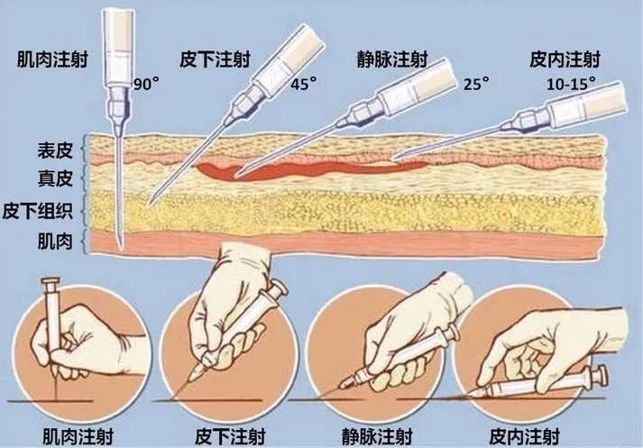
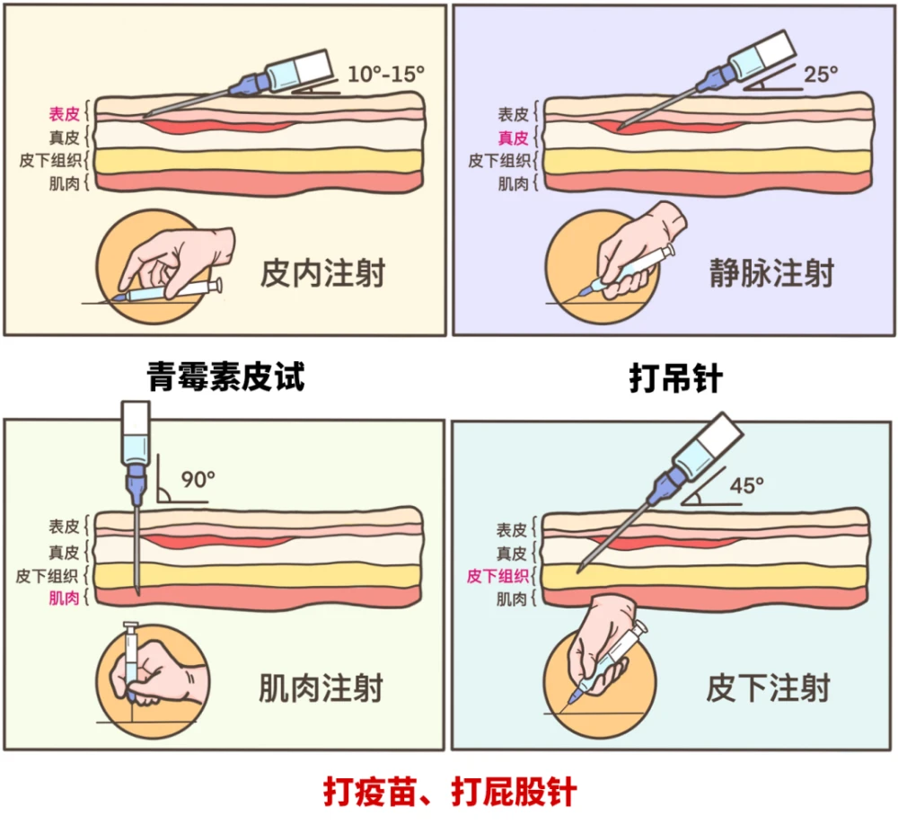

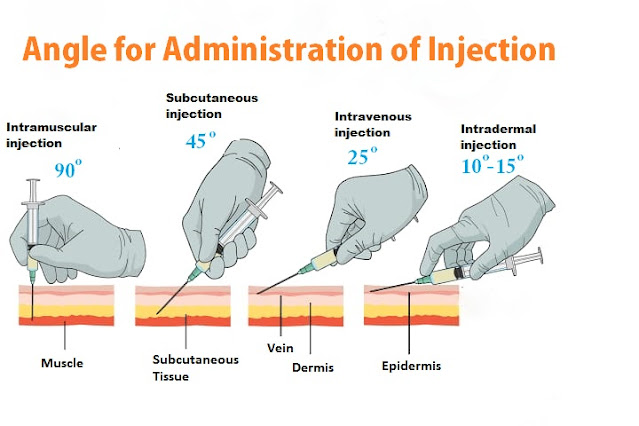

针头的粗细

国际上通用的针头标准单位, 是G. 针头内径一般是 22~31G. **数值越大, 针头越细。**  +
中国的针头标准单位是"号"，与国际相对应的针头一般是 4~7号. *号越大, 针头越粗。*

临床上常用的针头, 一般最粗的就是7号，也就是内径为0.5毫米。7号针头一般搭配20毫升以上的注射器。 +
而最小的针头, 一般就是注射"胰岛素"和某些"抗凝药物"的针头了，按照国际单位一般在
29~31G。

当然，不同的注射方法、注射部位, 和针头粗细一般都是相互对应的。**太细的针头打到肌肉里可能会被强烈的肌肉收缩掰断，太粗的针头则根本无法找到皮肤的间隙。**在临床上，腰穿、骨穿、胸穿等操作, 都有相应的专门针头。

不管针头有多粗、打在什么部位，疼的时候也只有进针的那一刹那。*一旦针头扎进去，影响疼痛的关键因素就变成了打的是什么药，以及打了多少药量。*

[.small]
[options="autowidth" cols="1a,1a"]
|===
|Header 1 |Header 2

|皮内注射
|拿"皮内注射"来说，两层皮肤之间只有那么点空间，如果大量注射药物，患者就只能承受皮肤被撑开的痛苦了。

|皮下注射
|

|肌肉注射
|肌肉的间隙比皮内要大些，但是大量注射药物也会造成疼痛。 +
还有许多药物不适合"肌肉注射"，如去甲肾上腺素、钙盐、钾盐、维生素C、各种酸制剂和碱制剂等。肌肉注射这些药物, 会引起局部强烈刺激性疼痛，超剂量注射甚至可能导致局部组织死。

|静脉注射
|静脉注射是否疼痛, 则不太考虑药量，很多住院患者都是从早到晚不间断地输液。这时候最重要的因素就是药物的刺激性了。**临床上最常见的引起疼痛的输液就是"补钾"。因为静脉输入"氯化钾", 会造成血管刺痛.**

很多肿瘤化疗药物, 也会刺激血管。血管被刺激后不仅会疼痛，它**经常痉挛收缩还会导致输液通道阻塞，**患者可能不得不重新再打一针。因此，需要长期输液的患者, 常常要进行PICC置管（Peripherally Inserted Central Venous Catheters，经外周静脉穿刺中心静脉置管）和**"深静脉置管"，也就是把液体输入更粗的大静脉里，这样就可以耐受更大量和更刺激的药物的输入了。**

image:/img/PICC.png[,50%]
|===

为了解决注射疼痛问题，70年代，人们就开始研制不疼的注射器。最早的"无针注射器"于1992年在美国上市，这是一种胰岛素注射器。**糖尿病患者需要长期注射胰岛素，**虽然用很细的针，但每天3次雷打不动，长年累月，还是让很多患者苦不堪言。他们的需求要最先得到解决。

**新型的无针注射器, 就是在进行药物注射时, 不借助针头，而是使用"高压射流"原理，使药液形成较细的液体流，瞬间穿透皮肤到达皮下。很可惜，"无针注射器"只适用于皮下注射，对于其他注射方式无法起到替代作用。** 而且"无针注射器"的价格相对昂贵，注射的效果也没有那么确切，所以它虽然已经上市了20多年，依然没有得到普及。

为了治病，医生发明了注射这种治疗方式。美国儿童医院有一句宣传语：*让孩子哭泣，并拯救他的生命！Make a child cry, save his life!*

.输完液, 没及时拔针，空气会不会输入体内?
"静脉输液"的原理是，通过液体重量产生的正压和大气压, 将液体输入人体周围静脉。因为**人体周围静脉的压力, 高于大气压，**所以输液瓶放得低一点，液体都输不进去了，更别说空气了。 +
只要不加压输液，比如用手挤，是不会发生空气栓塞的，也没有必要因为害怕空气进入身体而提前拔针。

.输液管中的气泡进入血管后, 会不会有危险?
一般小于0.02毫升／千克的空气进入体内，人是不会有任何感觉的。*超过2毫升／千克的空气进入体内，就会使人产生肺栓塞、脑栓塞或者猝死的风险。* +
让我们来计算一下：一个体重为50千克的成年人, 至少需要100毫升的空气，且必须在1分钟之内输完才会致命。因此，即使输液器的管壁上黏附的少量空气泡进入血管，也会被肺吸收，不必惊慌。

.出现回血怎么办?
其实输完液体之后，针头没有及时拔出所导致的回血现象才是问题。那么血会一直回下去，最后导致人失血过多吗？ +
静脉血回到输液管中以后，输液管中的血液就变成了之前的药液。*当大气压力加上输液管中血液的压力，与静脉血管中的血液压力一样的时候，回血就会停止了。* +
因此，输液结束后不及时拔针，确实会导致回血，但只有那么一点点而已。

.会不会形成血栓?
血块确实有可能凝集，但是不必紧张，因为人体有凝血系统和纤溶系统: +
-> *人体受伤出血的时候，"凝血因子"和"血小板", 会在伤口处聚集，形成血栓，止住出血.* +
-> *伤口愈合后，人体的"纤溶系统", 会把血液凝固过程中形成的"纤维蛋白", 分解液化.* +
所以，这么小的血栓，即使推进血管，也会很快被溶解。

.留置针 Indwelling needle 为什么能留置?
**留置针的使用, 能减少反复静脉穿刺所造成的痛苦。基本上，只要患者需要多次输液，就要使用留置针。**  +
中国规定: 外周静脉留置针, 应72~96小时更换一次。

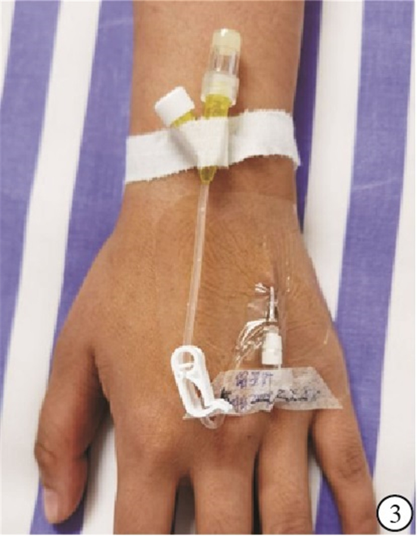
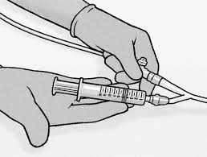

输注对血管有刺激性的药物，如造影剂、术中麻醉药物后，宜进行"留置针"更换； +
**出现"静脉炎"等并发症时, 应立即拔管，更换新的部位重新置管。 **

"留置针"虽然留置时间长，但是**每次使用结束之后都会用"肝素 Heparin"封管。"肝素"是最常见的"抗凝剂"，所以留置针里的血不会凝固，也不会产生血栓。**

.拔针之后需要按压多久?
输液完毕拔针后，护士都会给患者一根棉签来按压针眼。*一般建议，静脉输液拔针后至少要按压3分钟，最好能按压5分钟，这样才能有效防止针眼出血。对于老年患者和
小儿患者来说，按压时间更需延长。*

需要特别注意的是，按压的位置不仅要包含皮肤针眼处，还要覆盖针眼稍微往上一点的地方。这是因为扎针的时候针是斜向上进入皮肤的，刺破血管的位置比皮肤的穿刺点更往上一点。

== 感冒药

无论是否吃药，感冒都有一个自然病程，药物大多只能起到缓解症状的作用。

感冒时最重要的是休息，千万不要“硬扛”！

“*运气坏的医生治病头，运气好的医生治病尾*”，治好感冒并不能体现一个医生的水平高。

普通感冒的小病毒, 只能依靠人体的免疫系统来自然清除，没有什么特效药。

市面上大多数感冒药的成分, 主要有以下几种：

[.small]
[options="autowidth" cols="1a,1a"]
|===
|Header 1 |Header 2

|解热镇痛成分 :
|解热镇痛成分包括: 对乙酰氨基酚、布洛芬、阿司匹林等. 很多复方的感冒药中都会含有。而且它们还有中等强度的镇痛作用和抗炎、抗风湿作用。 +
但是，与此同时**它们也会使患者产生一些胃肠道的不良反应, 和凝血功能的问题。** 所以"解热镇痛药"不可以过量服用.

|抗过敏成分 :
|感冒的时候，我们的皮肤、眼睛、鼻子都处在充血和敏感的状态中。这时候，有一类药物可以对抗"组胺"引起的"毛细血管通透性增加"，阻止"组胺"及其他"过敏反应介质"的释放，缓解"平滑肌"痉挛。

这类药物成分包括: 苯海拉明、色甘酸钠、酮替芬、马来酸氯苯那敏等。 +
它们可以减轻局部充血水肿的症状，缓解鼻塞、流涕、流眼泪等让人感觉很不舒服的症状。*但是，这类药物成分会引起口干、嗜睡等问题。*

|维生素C :
|根据全球最权威的"循证医学"数据库 Cochrane Database 显示，很多研究对维生素C治疗普通感冒的问题进行了持续的关注。从2013年更新的内容来看，**补充维生素C不能减少感冒的发病率，但可能会缩短感冒的持续时间，只是这个作用的可复制性不高。** 所以维生素C到底对治疗感冒有没有用处，目前还没有有力的证据来证实。

|板蓝根 :
|板蓝根是一味中药材. *目前还没有足够的证据表明"板蓝根"能够预防感冒和缩短感冒的时间。*

|抗生素 :
|**"抗生素"对感冒并没有作用。因为感冒大多是由"病毒"感染引起的，而抗生素针对的是"细菌"。**那为什么有些人在因感冒去看病时，医生会给开抗生素呢？这是**为了预防感冒可能会诱发的"呼吸道炎症"。**

|抗病毒成分 :
|注意: 治疗"流感"的药, 对于"普通感冒"可能完全无效。

"流感"和"普通感冒"是不同的:

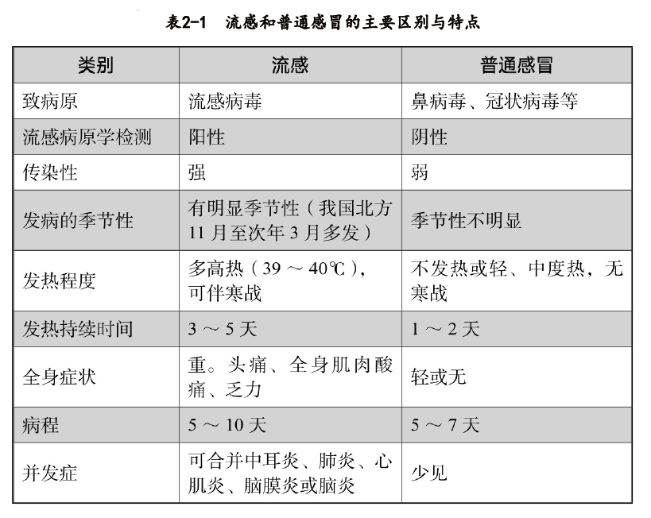

|===

*其实市面上的感冒药, 就是对以上几种有效成分进行"排列组合"。*

根据症状选择感冒药:
[.small]
[options="autowidth" cols="1a,1a"]
|===
|症状 |<- 药

|发热、头痛
|需要含有"解热镇痛"成分，如: *对乙酰氨基酚、阿司匹林、双氯芬酸等。*

|鼻塞
|感冒会鼻塞, 主要是因为鼻腔充血. 所以我们需要一些可以减轻此种症状的药物，比如"*伪麻黄碱*"等。

发热、头痛和鼻塞, 基本上是所有感冒的症状，也就是"上呼吸道感染"患者共有的症状，这也就是"对乙酰氨基酚"和"伪麻黄碱"会成为感冒药必备成分的原因。

|流鼻涕
|感冒时不停地流鼻涕，**需要使用"抗组胺"的药物来减少鼻涕的分泌，**同时也可以减少打喷嚏。**这类药物有一些镇静作用，**比如"*苯海拉明*"。在白天吃具有镇静作用的药物会使患者出现困倦、注意力难以集中等症状. 而这种镇静作用在晚上则表现为助眠.

*鼻塞和流鼻涕这两个症状, 还长期困扰着"慢性鼻炎"或"过敏性鼻炎患者"。很多患者会误以为自己得了感冒，就服用感冒药，但是你在不知不觉中也服用了很多不需要的药物成分。*

|咳嗽
|咳嗽是"上呼吸道感染"的后期症状。**"右美沙芬"是强效的镇咳药物，**也有很多药品生产商把镇咳成分混入感冒药物中.

**需要注意的是，咳嗽可能伴有"肺部炎症"，**如果再有发热的症状，患者可能就需要酌情增加抗生素。虽然官方一直在强调严格控制抗生素的应用，严格把握适应证.

虽然感冒引起"肺炎"的概率并不大，但是总会出现. 还有些感冒会导致"心肌炎".

|困倦
|*很多感冒药里含有"咖啡因"。咖啡因是一种"中枢兴奋剂"，一来可以帮助感冒患者对抗萎靡的精神状态，二来可以抵消许多抗过敏药物中的镇静成分。*
|===

以上感冒药并不能改变感冒的自然病程。即使你去打针、输液，也不能加快身体康复的速度。所有的药物仅仅是让你在感冒期间舒服一些而已。

很多疾病都像感冒一样，有自然的病程。学医的人都知道**“运气坏的医生治病头，运气好的医生治病尾”.** 很多患者都会有这样的经历: 去了医院后病反而越看越严重了，后来自己回家休息了一阵子或者找了个老中医后病就好了. 要知道，很多疾病就是如此，需要经历由轻到重，最后缓解的过程。大部分感冒不治疗也会自己缓解，所以**得到怎么样的治疗效果就看你在哪个阶段去看医生了。**

== 头痛

*头痛的原因, 就是头部疼痛敏感的组织纤维, 过度放电.*

**大脑本身是没有痛觉的，**这也是神经外科医生可以在患者清醒的情况下, 完成大脑手术的原因。*头骨也不会有痛觉。有的人说“头疼得快要裂了”，其实那不是骨头的疼痛，而是因为我们没办法找到准确定位；还有就是颅腔的体积有限，很多时候我们感受到的胀痛好像要胀裂头骨。*

2013年，国际头痛学会推出的最新指南把头痛分成14大类，每一大类中又有很多小类，加起来有100多种。

总的来说，头痛按性质不同, 可以分为两种: "器质性头痛"和"功能性头痛":

- 器质性头痛: 原因可查. 是由神经变性、血管损伤, 或者炎症、长了肿瘤等情况导致的。
- 功能性头痛 : 病因难解. 影像学、化验检查等都没法查出问题. 它通常症状相对轻微、不易致命，但是其中很多也难以缓解，患者不得不饱受煎熬。

头痛可见于多种疾病中，大部分没有特殊意义。比如，全身感染会头痛，精神紧张会头痛，过度疲劳也可能会头痛。但是，*反复发作或者持续的头痛, 可能是某些疾病的信号，需要引起重视。*

总结来说，头痛有以下几种病因：
[.small]
[options="autowidth" cols="1a,1a"]
|===
|Header 1 |Header 2

|血管的原因 :
|*血管是非常敏感的，血管里的血液多了或者少了，血管破了、痉挛了，大脑里长了东西牵拉或者压迫了血管，都会导致严重的疼痛。*

|脑膜 meninges 的原因 :
|*脑膜也是十分敏感的痛觉感受器。脑膜的炎症、肿瘤的挤压、外界的刺激都会导致剧烈的疼痛。*

*脑膜，指的是颅骨与脑间有三层膜，由外向内为"硬脑膜"、"蛛网膜"和"软脑膜"；三层膜合称"脑膜"。*

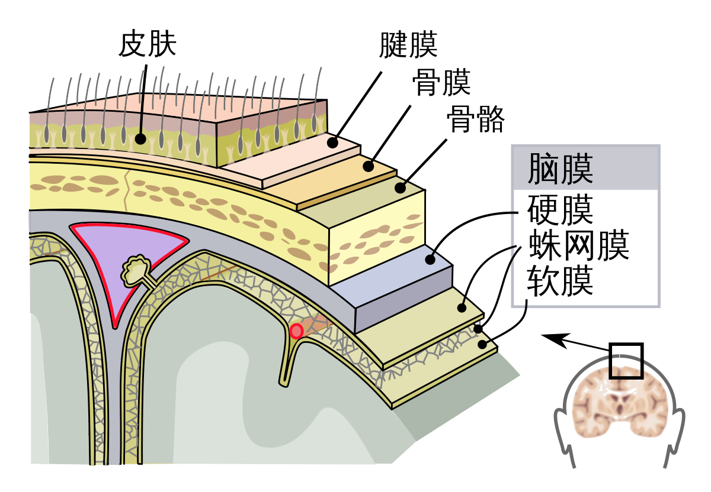
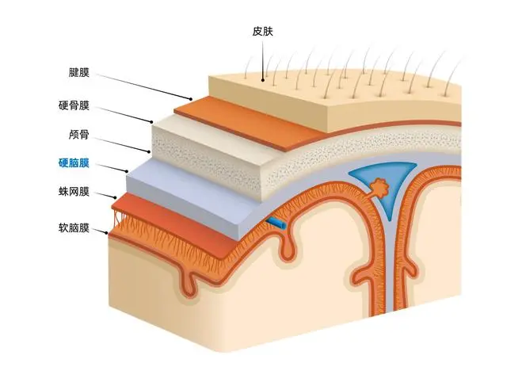
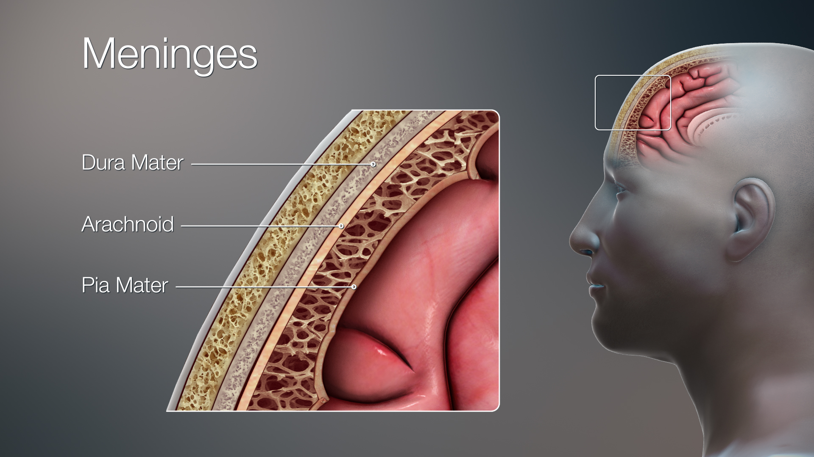

|神经的原因 :
|大脑共发出12对脑神经 Cranial nerve，其中一部分是感觉神经，一部分是运动神经，还有一部分两者皆有。*具备感觉功能的神经受到刺激、挤压和牵拉, 同样会导致头痛。*

脑神经（英语：cranial nerve），又称"颅神经"，属于周围神经系统，**它们是直接由脑发出的，区别于由脊髓发出的脊神经。** +
**脑神经在脑和身体各部分之间传递信息，主要是往返于头部和颈部的区域，**包括视觉、味觉、嗅觉和听觉等特殊感觉。 +
部分脑神经属于"传出神经"，部分为"传入神经"，其余的为"混合神经"（同时含有传出神经纤维, 和传入神经纤维）。

在人体中，传统上认为一共有12对脑神经，*其中有10对分布于头面部；除第1及第2对外，其余10对脑神经都是从"脑干"发出。*

"脑神经"有着重要的功能：视觉、嗅觉、听觉、味觉、平衡觉均由脑神经传递，人类丰富的面部表情也由脑神经控制。 +
脑神经中的"迷走神经", 参与构成"自主神经系统"。

.以下为几种背诵口诀：
- 嗅视动滑三外旋， 颜听舌迷副舌下。
- 一嗅二视三动眼， 四滑五叉六外旋， 七颜八听九舌咽， 十来迷走副舌下。
- 一嗅二视三动眼， 四滑五叉六外旋， 七颜八听九舌咽， 十迷走来十一副，十二舌下神经束。

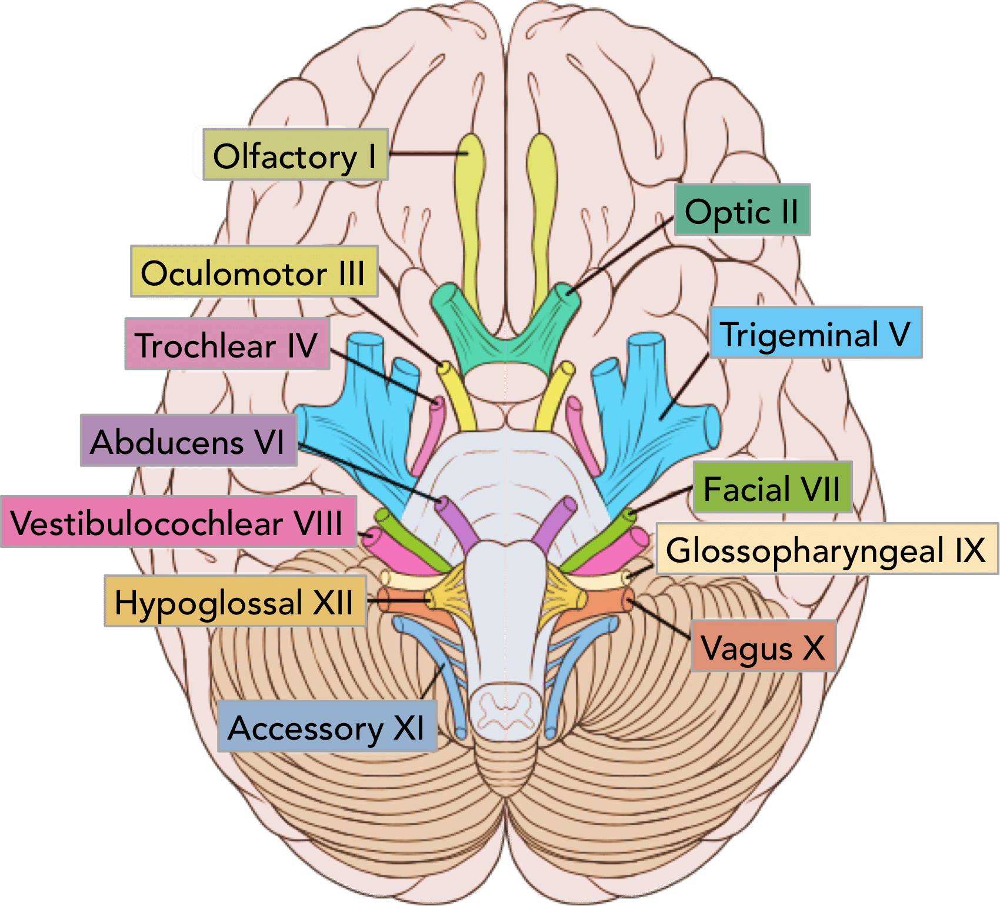
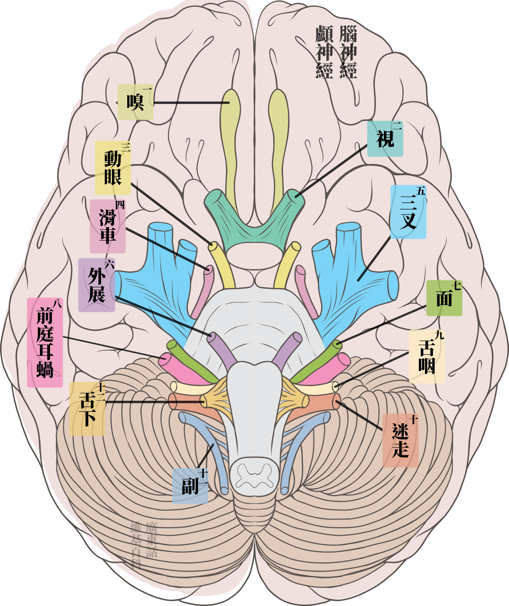
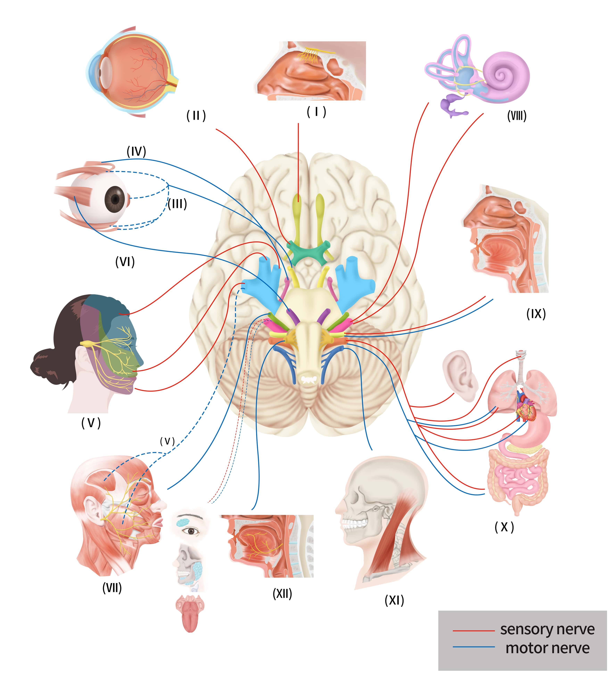

|眼耳鼻的原因 :
|眼睛、鼻子和耳朵的问题也会引起头痛，而且很多时候我们并不能辨别具体是哪里导致了头痛。有时候耳、鼻、眼出了问题导致的头痛，耳朵、鼻子和眼睛本身反而不会有疼痛感。

|全身的原因 :
|这里指的是由内分泌紊乱、全身疾病引起的头痛。*血液里的生化水平改变了，激素水平改变了，也可能引起头痛。*

|精神和心理的原因 :
|焦虑等心理问题也会引起头痛。
|===

头痛的类型:

[.small]
[options="autowidth" cols="1a,1a"]
|===
|Header 1 |Header 2

|突发的急剧头痛，持续不减
|**这种症状一看就非常严重，**相信大家都不会掉以轻心。**出现这种情况的最大可能性就是颅内的血管性疾病，血管突然破裂，出血刺激会引起头痛持续不减。如果出血继续的话，患者很可能很快出现意识障碍或者偏瘫、失语等。遇到这种情况，只有一句话——快速就医。** +
**而且这种情况中的很大一部分需要进行介入或者手术治疗，至少也要严密观察，所以尽可能去正规的大医院，**小诊所是解决不了问题的。

|长期反复发作的头痛
|临床最常见的原发性头痛类型，以发作性中重度、搏动样头痛为主要表现。头痛多为偏侧，一般持续4~72小时，伴有恶心、呕吐等症状，光、声刺激或日常活动均会加重头痛，安静的环境、休息则可缓解头痛。

大部分人在就诊之后都会得到"偏头痛"的诊断。**对于偏头痛，目前尚无特效治疗方法，只能预防和减轻症状，**也就是尽量改善生活方式、**避免诱发因素，**以及发作的时候减轻头痛症状。

|进行性加重的头痛
|*这是一种尤其需要引起重视的头痛。它一般表现为"全头痛"，疼痛越来越重，很多时候为胀痛。这种情况经常与颅内占位性病变有关，简单地说，就是大脑里可能长了东西，压迫到了神经和血管，由此引发了疼痛。也就是说，这种情况需要考虑是不是大脑里长了肿瘤。*

虽然脑肿瘤中有不少呈恶性表现，*但是肿瘤增加的速度一般还不足以让疼痛在几天内加重。那么疼痛的加重是由什么引起的呢？一般的原因是"脑水肿"和"脑积水"。"脑水肿"的原因有很多，比如压迫颅内的静脉回流, 导致血流不畅、细胞的炎症反应等。人的颅骨很硬，而且容纳量非常有限，里面的脑组织稍微有一点肿胀, 就会引起强烈的不适。*

**大脑是泡在液体里的，也就是"脑脊液"，它有一个循环系统。当这个循环系统受阻的时候，就可能引起严重的头痛。**人每天分泌的脑脊液有400~500毫升，差不多是一大瓶水的容量，但是人体脑脊液循环的容纳量只有100~150毫升。简单来说，如果下水道被完全堵塞，只需要几个小时上面就憋得受不了了。

*如果肿瘤导致了周围脑组织的肿胀和脑脊液循环的阻塞，头痛就会进行性地加重。这样的情况需要尤为重视，因为越早切除肿瘤，治愈的概率越大。*

*如果这样的头痛突然加重，患者甚至出现了意识障碍，则提示可能出现了"脑疝"。此时需要紧急送医进行手术，这种情况真的可以说是跟时间赛跑，时间就是生命。*

|头痛伴有其他症状
|伴有其他症状的头痛:

.伴高热：
一般是颅内感染的表现，

.伴头晕：
常常提示为小脑半球的问题，可能是肿瘤，也可能是轻微的梗死。但更多的是基底动脉的供血不足，可能是由颈椎问题引起的。

.伴视力障碍：
眼睛突然看不见或者视力突然下降，大多数是由青光眼或者颅内的肿瘤压迫了视觉的传导通路导致的。

.伴精神障碍：
额叶肿瘤的可能性非常大。

.伴癫痫发作：
*癫痫也就是我们常说的羊角风，可能由肿瘤、血管畸形或者寄生虫引起。出现癫痫不是小问题，每次发作都是对大脑功能的损害，需要尽快控制癫痫的发作。*

|偶然发作的轻度头痛，兴奋、劳累之后的头痛自行缓解
|没什么诱因出现的头痛只要能很快缓解，比如睡一觉之后就好了，一般问题也不大。
|===

== 传染病 : 流感

**"流感"不同于"普通感冒"，它的并发症较多，导致死亡的可能性也更大。**区别于普通感冒的是，在得了"流感"的人群中，年轻人和身体非常强壮的人死亡率较高。

流感最厉害的是, 有强大的变异能力。我们接种的流感疫苗, 只针对最近流行的主要亚型，对其他亚型无效，更不要说明年春天的新亚型流感。

[.small]
[options="autowidth" cols="1a,1a"]
|===
|Header 1 |Header 2

|西班牙流感
|流感中的一个亚型——西班牙流感.  第一次世界大战, 死亡超过1 000万人. 而战争后期暴发的西班牙流感, 则夺去了4 000万人的性命，导致了战争的提前结束。*西班牙流感在18个月内神秘地消失了，因此其病株从来没有被真正地确认过。* +
由于这场流感中死者的遗体都已经被焚毁，再加上重新合成病毒的危险性，人们对流感的研究一直举步维艰。

|疯牛病 Mad Cow Disease
|人一旦食用了被疯牛病污染的牛肉，就有可能染上致命的"克罗伊茨费尔德-雅各布氏症"，简称"克-雅氏症"。其典型临床症状为: 痴呆或神经错乱、视觉模糊、平衡障碍、肌肉收缩等。患者最后会因为大脑的损害而死亡。

其病源是"朊病毒 Prion". "朊"是蛋白质的旧称，**朊病毒意思就是蛋白质病毒，**朊病毒严格来说不是病毒，*是一类不含核酸, 而仅由"蛋白质"构成的具感染性的因子。* 朊病毒是空间构型改变了的正常蛋白质，是正常蛋白质"变性"所致。

目前针对疯牛病, 并没有什么治疗方式.

|禽流感
|它对人的致病性并不算太高，致死率也不高。但是禽流感病毒具有"血凝素 hemagglutinin"结构，所以虽然它一般只感染禽类，但当它在复制过程中发生基因重配，致使结构发生改变时，就会获得感染人的能力。

.血凝素 (血球凝集素) :
是指可使"红血球"凝集的抗体或其他物质。 在流感病毒、痳疹病毒（以及许多其他细菌和病毒）表面等均能找到，可附著于不同动物的红血球，而使红血球凝集。严重时可致死。

疯牛病的传播主要通过进口牛肉，所以其传播速度较慢，*毕竟牛的流动性比较低。但飞禽就具有极大的流动性了.*
|===

== 艾滋病

艾滋病的四大传播途径是: 性接触, 不洁注射, 血液, 母婴.

[.small]
[options="autowidth" cols="1a,1a"]
|===
|Header 1 |Header 2

|性接触
|- 男同性恋人群艾滋病抗体阳性率, 在近几年一直维持在8%以上，已经成为我国艾滋病感染的第一高危人群。

|不洁注射
|- 吸毒者共享针头或注射器, 是传播艾滋病的高危行为.
- 以前, 有些村子里因大批村民卖血，*因卖血贩子重复使用不经消毒杀菌的针头, 血袋, 导致全村感染艾滋病。* +
而且，血站还会对血液进行"单采"，即有的需要血浆，有的需要血小板等等。当村民们的血液被抽出来放入袋子(已被艾滋病病毒污染)后，“血站”利用离心机分离出来他们想要的东西，之后又将剩下的“血液”重新注入村民体内。 +
后来, 随着国家严禁非法卖血, 及对血制品统一管理后，艾滋病经血制品传播的报道就很少了。

|血液
|

|母婴
|

|===

艾滋病由感染"人类免疫缺陷病毒"（HIV，即"艾滋病病毒"）引起。HIV是一种能攻击人体免疫系统的病毒。**它把人体免疫系统中最重要的"T淋巴细胞"作为主要攻击目标，大量破坏该细胞。**它全面摧毁人类的免疫系统之后，微不足道的细菌病毒都能给身体带来毁灭性的后果。

**艾滋病病毒在人体内的平均潜伏期, 为 8~9年，**所以人在确诊艾滋病以前可以没有任何症状地生活和工作多年。患者可以通过药物控制病毒复制，使其在体内保持较低水平，从而使患者长期不发病。

艾滋病的特效疗法尚未找到。目前也尚无疫苗能够预防艾滋病.

**有一种鸡尾酒疗法，即“ 高效抗反转录病毒治疗”  Highly Active Antiretroviral Therapy，HAART, 是通过联合使用三种或三种以上的抗病毒药物, 来治疗艾滋病。这种疗法可以减少单一用药产生的抗药性，**最大限度地抑制病毒的复制，使被破坏的机体免疫功能部分甚至全部恢复。即, 它可以控制艾滋病病毒的数量，使人一直作为艾滋病的带菌者, 而不发病。

即使可控，艾滋病的治疗却远远没有达到理想的状态。**人类唯一能庆幸的是艾滋病传播能力不强，除了前面提到的四种传播方式，一般的接触并不会传播此病。但如果有一天艾滋病发生了变异，跟其他传染病一样可以通过飞沫传播, 或通过禽类携带，那时谁还敢保证人类能赢得此次战争？**

== 慢病毒 Lentivirus

"慢病毒"是逆转录病毒中的一类，一般潜伏期较长，因此得名慢病毒。*慢病毒感染的显著特点是: 感染个体在出现典型的临床症状之前，大多经历长达数年的潜伏期，之后缓慢发病，因此这些病原体被称为慢病毒。* 例如人类免疫缺陷病毒(HIV)、猴免疫缺陷病毒(SIV)、马传染性贫血(EIA)、猫免疫缺陷病毒(FIV)都是"慢病毒"属，慢病毒属的原文是 Lentivirus，其中 Lenti- 在拉丁文中有"慢"的意思。

慢病毒能够能够穿透"细胞核膜". 而大多数的"逆转录病毒"就没有穿透"核膜"的能力，只能等待"有丝分裂"时进入核中。

慢病毒对"分裂细胞"和"非分裂细胞"都能实现高效的感染。

.外源基因
外源基因: 是指来源于所关注或研究的生物体之外的基因。将"外源基因"导入生物体的过程(其实就是"基因改造"), 称为"转化"。导入的"外源基因", 可以导致被插入"内源基因"的突变或表达改变。

"慢病毒载体"可以将"外源基因"有效地整合到宿主染色体上, 达到基因治疗效果。

目前，最常用的慢病毒载体（Lentiviral Vectors, LV）是基于人类免疫缺陷病毒（HIV）而来。

== 针对"传染病"最重要的不是治疗，而是防控.

传染病促成了"公共卫生学"和"流行病学"的诞生。

中国把传染病分为甲、乙、丙三类。

甲类传染病, 也称为"强制管理传染病"，包括鼠疫和霍乱。防疫部门对此类传染病发生后, 报告疫情的时限，对患者、病原携带者的隔离、治疗方式，以及对疫点、疫区的处理等, 都有明确的规定。也就是说，人一旦发病，就会被强制隔离.  +
其余我们经常听说的疾病, 都属于乙类或丙类传染病。

三个重要的概念：消灭、消除, 和控制。

目前, 传染病中只有一种被人类消灭 -- 天花。 原因是:

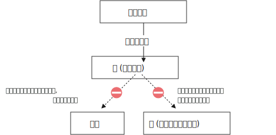

除此外, 很多疾病还是不能被人类"消灭"，只能被"消除"。消除是指在一个地区范围内(而非全球)，让某种传染病消失。*比如鼠疫，因为老鼠是重要的宿主，所以只要老鼠不灭绝，鼠疫就永远无法被消灭。*

== 急救

心脏按压、人工呼吸和电击除颤是抢救心跳呼吸骤停的最有效方法。

掐"人中"不仅没有用，还会错过心脏按压的重要时间。

烫伤抹牙膏、摔倒揉一揉、流鼻血仰头、骨折扳回来、癫痫发作时嘴巴塞筷子，都是错误的！

对于真正"心源性昏厥"和"心脏停搏"的患者来说，去"掐人中"肯定会错过最佳的救护时间。*现代医学已经证实，真正有用的方法是"心脏按压"*:

- *心脏按压不仅能刺激心脏再次跳动，还能代替心脏搏动的作用，保证大脑等重要器官不至于缺血坏死。如果没有及时按压，几分钟之后，即使患者心跳恢复了，大脑也会因为缺血而完全坏死，人也就成了我们所说的植物人。*
- *按压的时候, 还得进行"人工呼吸"，否则会没有氧气，不能保证大脑的供氧。*

急救医生拿两个熨斗一样的东西在患者身上电击 -- *"电击除颤"的确是终止心室颤动的最有效方法。患者晕倒并不一定是心跳停止，很多情况是心脏受到了打击而出现了活动紊乱。这种紊乱一般称为心室颤动，一旦出现，心脏就不能正常泵血，患者也会随之昏迷。* +
*电击除颤 : 是用外部的电流, 强行终止心脏所有的电活动，等待心脏重新开始电活动 (相当于重启电脑)。心脏必须在一定时间内重启，否则时间长了人脑就会因为缺血, 而形成不可逆的损伤。*

*心脏按压、人工呼吸, 和电击除颤, 是抢救"心跳呼吸骤停"的最有效方法。*

与外科学一样，急救医学的大规模发展, 也源于战争。军医们通常采用黑、红、黄、绿四色来评估伤员的情况。其中黑色代表死亡，红色代表重伤，黄色代表中度伤，而绿色代表轻伤。现场的救治原则是: 重伤员第一优先，中度伤员第二优先，轻伤员稍后处理，死亡遗体最后处理。

*学会急救，应该是人的常识. 平时没有遇到突发状况时，人们不去关注急救知识; 一旦遇到了状况，想要做些什么，就会手足无措。* 普及普通人的急救知识才是最有效的方式。因为专业的急救人员不可能随时随地出现，等他们到达时，很多患者都错过了最佳抢救时机。

每个国家都有自己的急救电话号码。美国是911，日本是119，英国是999.中国的全国统一急救号码是120. 北京红十字会还有个999急救电话。不同于120的是，999是民间急救组织电话。

.急救医生的前途生态

当前，急救人员供不应求。很少有人愿意做急救医生，归根结底还是因为工作太累、收入少、职业发展差、每天在路上不分寒暑地跑，所以能转行的差不多都转行了。 +
北京协和医院, 虽然是中国医疗的殿堂级医院，但依然留不住急诊医生。近几年在北京协和医院培训的120急诊医生大约有几十人，最后没有一个人能坚持留下来。

120急救中心的急救医生, 主要负责"院前急救"; 医院的急诊科医生, 则负责"院内急救"。**一般认为 120急救中心最苦，急诊科次之。** +
医院内的急诊科医生虽然不用东奔西跑，但也绝不轻松。都得24小时随时待命。**急救医生自己的休息时间都难以保证，更谈不上去照顾家庭。**因此，很多急救医生都是恨不得立刻转行。

请设想一下，在患者最危急的生死时刻，如果给予急救的医生心中带着怨气, 或者抱着当一天和尚撞一天钟的态度，你还能放心吗？(所以急救措施得靠普通人自己，你一定要学习掌握住!)

急救技术说起来不难，但是背后折射出许多社会问题。怎样才能让急救医生获得尊严和尊重？又怎样才能让每一个普通人在遇到突发状况时, 可以没有后顾之忧地第一时间去施以援手呢？(我们面对的是一个连老人都不敢扶的社会.)

普通人急救中的误区有 :

.误区1：烧、烫伤之后抹牙膏、酱油等

老人常在烧、烫伤伤口上涂抹牙膏. 殊不知**牙膏中的化学物质，包括氟化物，反而会造成伤口进一步侵蚀和疼痛。**

除了牙膏，酱油、凡士林、油性药膏等, 也是急诊室里经常碰见的涂抹物。其实**在烧、烫伤伤口上涂抹这些莫名其妙、 未经消毒杀菌的东西，只会徒增伤口感染的机会。涂抹油性的东西, 更是会把热隔绝在已受伤的皮肤里面，让热的伤 害持续更久。**

烧、烫伤后的正确做法应该是：

[.small]
[options="autowidth" cols="1a,1a"]
|===
|Header 1 |Header 2

|-> 远离热源
|小心地脱掉烧、烫伤处的衣物，让伤口裸露。 +
如果衣物粘在皮肤上不能脱下，可以用剪刀剪开，不要强行脱下，以免对伤口造成二次损伤。

|-> 降温散热
|刚被烧伤、烫伤的伤口处会有大量余热，所以**需要做降温散热处理，否则深层皮肤也会被烫伤。**常见的方法是马上用自来水冲。要注意，*冲的时间要比你感受到凉意的时间长，以帮助深层降温。*

|-> 水疱处理
|**烧、烫伤引起的水疱是需要挑破的，否则容易化脓感染，对伤口恢复不利。** +
- 小水疱用消毒针头低位挑破，把水放干； +
- 大水疱可用消毒剪刀剪开一个口，把水放干。 +

*水疱挑破后疱皮不要剪掉，更不能用手撕掉。疱皮能够保护创面，防止伤口感染发炎。*
|===

.误区2：流鼻血时仰头、举胳膊等

**流鼻血时仰头, 不仅对止血毫无帮助，还会使鼻血倒流回咽喉、食管、气管和胃，**引起我们身体上的不适和恶心。*若出血量很大，仰头还易把血呛入气管及肺内，造成"吸入性肺炎"，甚至有引起窒息的危险。*

况且，*鼻腔的黏膜血管收缩, 受"交感神经"控制，而"交感神经"属于自主神经，也就是不受人的意识控制。* 换句话说, 鼻腔的黏膜血管不是你想收缩就收缩的，也不是抬抬胳膊就能导致其收缩的。

冰敷, 在理论上可以促进血管收缩，但是临床验证的效果并不明显.

正确的做法应该是：**一旦发生鼻出血，要及时进行局部压迫，让患者低头、张口呼吸、用拇指和食指捏住双侧鼻翼，向后上方压迫，一般在数分钟后多可止住出血。**

有一些鼻出血是由全身性疾病导致的，所以在进行局部压迫的同时，还要进行全身性治疗。

**压迫应至少持续5分钟，然后检查出血是否停止。**通常鼻血在5~10分钟后停止。*如果压迫两次之后，出血仍止不住，应到医院进一步诊治。*

.误区3：崴脚扳一扳，摔伤揉一揉

殊不知，*小包会揉成大包，骨裂会扳成骨折。头皮的血肿揉一揉，不仅不能缓解疼痛，还会在刺激到伤处时加速血液循环，从而加重出血。摔到腿、扭伤、抽筋给扳成了骨裂，轻微的骨裂给扳成了错位，这样的情况屡见不鲜。全身任何部位受伤，揉都起不到任何作用。*

正确的做法应该是：

（1）四肢受伤: 早期最重要的是固定和保护，冰敷可以减少肿胀。

（2）**头部摔伤需要注意 : 除了头上的包不能揉之外，还要观察患者的精神状态和饮食情况。**换句话说，如果患者精神正常、吃喝正常，那问题应该不大；*如果患者精神不振、昏昏欲睡、胡言乱语、频繁呕吐，就需要及时送医了。*

.误区4：癫痫发作时往嘴里塞筷子

有人会问，如果不塞东西，患者不会咬伤舌头吗？答案是不用担心。现实中确实有人因为癫痫发作, 而咬伤自己舌头和嘴唇的情况，但这都是皮外伤，不会致命。*相比于在口腔内放入异物引起窒息，这点皮外伤根本不值一提。所以，两害相权取其轻。*

临床上有很多这样由于塞东西, 而导致患者反受其害的病例。**患者在处于抽搐状态时，不单单四肢的肌肉会抽搐，口腔的肌肉也是痉挛的，且上下颌牙齿紧咬。**因此，此时往患者嘴里强行塞东西，很可能会出现以下几种情况：

（1）*强行撬开患者的嘴巴，导致嘴唇撕裂。* +
（2）*尖锐的勺子、筷子末端插入口腔深部侧壁组织，造成口腔内持续性出血。* +
（3）*塞毛巾或者衣服，导致患者窒息。*

除此之外，*在患者四肢抽搐抖动时，多数人会习惯性地去按压，但这样有可能导致患者关节脱位、骨折, 或者施救者自己受伤。也不要喂水、药和食物，因为患者意识不清醒，所有进入口腔的东西都有导致窒息的风险。*

正确的做法应该是：

（1）为防止患者受伤，*可以扶住他缓慢躺下，并清除身旁的凳子及其他尖硬物品，防止患者肢体抽搐时被物品碰伤、划伤。* +
（2）*缓慢翻转患者，使其呈侧卧位，以方便口腔分泌物流出，避免窒息。该体位还可以防止舌头后坠、堵住呼吸道。* +
（3）*松解过紧的衣物，比如解开领带、领结，松开衣领等。* +
（4）*保护头部，用毛巾或厚衣服稍稍垫高头部。* +
（5）陪伴等待，记录时间。

.误区5：晕倒掐人中

有人晕倒了怎么办？也许很多人下意识地就要去"掐人中", 因为中医认为"掐人中"是一种强烈的疼痛刺激，会引起呼吸循环中枢的兴奋，对癔症性的意识障碍可以起到促醒的作用。但是，这种方式在临床上主要是针对晕厥的患者。*它不仅对大多数患者无效，甚至还会使患者产生生命危险。*

**人在仰面倒地的时候，大多数气道是开放的。而"掐人中"则时常要把患者的头抱起来，**抠住下巴的手往下用力按压，**这反而可能使患者的气道产生闭合。气道呈90°的夹角，若舌头把气道堵塞住，则会引起窒息。** +
*很多患者昏迷时，会同时伴有呕吐。如果按压不正确使气道闭合，则可能会使呕吐物周围的小空当也被堵住了，从而导致患者窒息缺氧死亡。*

还有一些老人认为，掐人中需要用很大的力气才有效。而**在施救时力度过大, 很容易造成牙齿松动, 或者戴假牙的老年人假牙脱落，并使其掉入气道中，导致患者窒息而死。**

正确的做法应该是：遇到晕厥的人，首先要判断其是否有心跳、呼吸停止。*如果患者生命体征消失，则需要立即实施心肺复苏。如果患者仅仅是晕厥，那施救者首先要做的事并不是把他叫醒，而是保证他的安全，这个安全包括环境安全和呼吸循环稳定，然后立刻拨打120，将其送医处理。*

== 献血

我国采取无偿献血制度。

服用药物后3天内不宜献血；献血当天可以按照往常的习惯进食，但不宜吃肥肉、鱼等高脂肪或高蛋白的食物；献血前不宜饮酒；保持睡眠充足，不宜做剧烈运动。

**人一共有多少血? 成人的平均血量是4升左右，**大概相当于全家装的可乐瓶2瓶，一斤装的白酒瓶4瓶，倒出来大概有一大盆，装到桶里有大半桶。

升 liter : 1L =1000mL(毫升) =0.001立方米 *=1立方分米* =1000立方厘米 +
1mL =1立方厘米 =1cc +
1立方米= 1000升

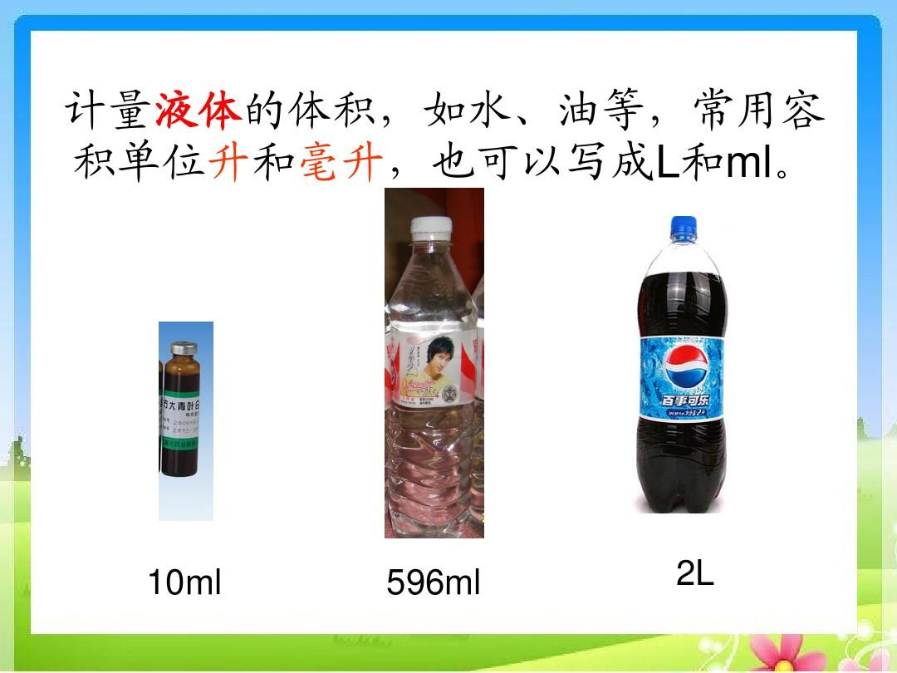
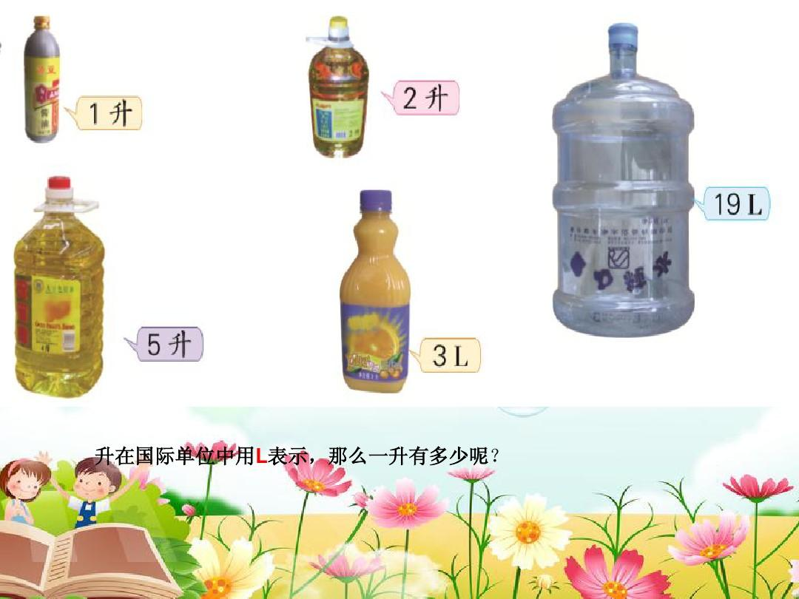

一个人的血量是4升，**失血超过30%就会出现严重的反应。** +
在外科学还没有高度发展的早期，长时间的复杂手术导致患者出血1~2升的情况较为常见。如果患者血流干了，就撑不到手术结束；但是如果能边出血边输血，情况就不一样了。

"自体血回输"技术, 大大地增加了患者自身血容量的库存。准备做手术的患者先把血抽出来，作为手术用血的储备；或者手术中出的血经过过滤后，再输回患者体内。这样做不仅不用担心血型、疾病传播等问题，还大大节约了血液资源。

**人类的"红细胞"中, 主要含有两种不同的"凝集原"，分别称为A和B。**根据红细胞所含"凝集原"的不同，Karl
Landsteiner 把人类的血液分为4种基本类型，即O、A、B、AB型。**红细胞中含A凝集原的, 为A型; 含B凝集原的为B型，含A和B两种凝集原的为AB型，两种凝集原都没有的为O型。** +
**血型相同的人之间输血，就不会发生"溶血"现象。**没有"凝集原"的人供血，有"凝集原"的人受血，一般也不会发生溶血现象。

溶血 Hemolysis: 即**红细胞破裂，血红蛋白逸出称红细胞溶解**，简称溶血。  +
有多种原因均可引起溶血 : 在体外，如低渗溶液、机械性强力振荡、突然低温冷冻（-20℃～—25℃）或突然化冻、过酸或过碱，以及酒精、乙醚、皂碱、胆碱盐等, 均可引起溶血。

人血浆的等渗溶液为0.9%NaCl溶液，**红细胞在低于0.45%NaCl溶液中，因水渗入，红细胞膨胀而破裂，血红蛋白逸出。**在体内，溶血可为溶血性细菌或某些蛇毒侵入、抗原-抗体反应（如输入配血不合的血液）、各种机械性损伤、红细胞内在（膜、酶）缺陷、某些药物等引起。溶血性细菌，如某些"溶血性链球菌"和"产气荚膜杆菌"可导致"败血症"。*疟nüè原虫破坏红细胞,* 和某些溶血性蛇毒含卵磷脂酶，使血浆或红细胞的卵磷脂转变为溶血卵磷脂，使红细胞膜分解。

**在ABO血型系统之外的新的人类血型系统，即Rh系统。**它不但与输血有关，还与新生儿的溶血症有关，尤其是白种人。 *在汉族人中，Rh阴性血只占1%，也就是我们常说的“熊猫血”。*

**人的血型, 通常是由红细胞表面某些可遗传的**糖蛋白及糖链构成的**抗原决定。**血型系统已经被发现有超过30种。"Rh血型系统"是已分类的红细胞血型系统中最复杂的一类.

人们大多知道血型有四种类型，即A型、B型、O型、AB型，它们都属于ABO血型系统。其实，血型不止这四种，而是有数十种类型或系统，庞大复杂。由于A型、B型、O型、AB型以外的血型抗原性大都不强，所以临床医学家认为，除上述四种血型外，再加上"Rh血型系统", 是临床上应用最广, 也最为重要的血型。

Rh是恒河猴（Rhesus Macacus）外文名称的头两个字母，人类红细胞血型由多达二十多种的血型系统组成，*ABO和Rh血型是与人类输血关系最为密切的两个血型系统。*

当一个人的红细胞上, 存在一种D血型物质（抗原）时，则称为Rh阳性，用Rh（+）表示；当缺乏"D抗原"时, 即为Rh阴性，用Rh（-）表示。

有Rh抗原的称为Rh阳性，反之则为阴性。Rh是一种血型系统，*中国99%以上的人为"Rh阳性"。*

如果Rh阴性血型的受血者, 输了Rh阳性血型的血液，就会引起免疫"溶血"反应。

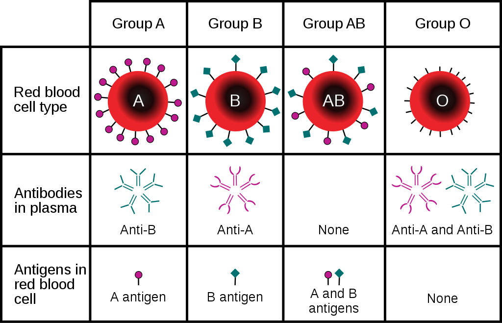

有了血型系统，输血的成功率就得到了保障。但是，其中有一个万万不能忽视的重要问题——"抗凝"。出血后，即使不管它，血也大都能自己止住. 是血凝住了还怎么输血呢？ 就要使用"抗凝剂", 如"枸橼 jǔ yuán 酸钠".

血液中的成分被进一步明确后。一份全血包括血浆、红细胞、白细胞和血小板。缺什么输什么，避免浪费，更避免给机体造成负担。

我国采取的是"无偿献血制度"。**患者急救时输的血, 都是血站根据需要分派给各医院的，**医院的血库会做一些统筹安排。如果出现大型事故或者特殊情况，导致血站的存血也告急，就会采取周边单位相互调度的方式. 所以血库的存量必须具备一定的预见性，"现抽现用"肯定无法满足需求。

一次性献血量符合最低标准200毫升，就可以获得中国国家颁发的无偿献血证。

什么人暂时不能献血?

- 口腔护理（包括洗牙等）后未满三天者；拔牙或其他小手术后未满半个月者；阑尾切除术、疝修补术及扁桃体手术痊愈后未满三个月者；较大手术痊愈后未满半年者。
- 妇女月经期及前后三天者，妊娠期及流产后未满六个月者，分娩及哺乳期未满一年者。
- 上呼吸道感染病愈未满一周者，肺炎病愈未满三个月者。
- 急性胃肠炎病愈未满一周者。
- 伤口愈合或感染痊愈未满一周者，皮肤局限性炎症愈合后未满一周者，皮肤广泛性炎症愈合后未满两周者。
- 一年内输注全血及血液成分者。

== 当医生说法不同时，你该听谁的

**医学上没有绝对的正确，只有证据的多寡。**断案需要证据，医学也是如此。*现代医学之所以先进，就在于它有一套严谨的诊断标准。大家都不能随便乱说，任何决策都需要找到证据。*

最基本的证据当然是教科书，但教科书更新得比较慢。更细致、更快速一些的证据, 是临床指南或者专家共识。某种治疗方法想要写入临床指南，需要有很强的证据支持！

什么样的证据最可信

动物实验、医生自己的临床经验、临床报道、病例对照研究、队列研究、随机对照研究、系统性综述，这些都是证据。不同级别的证据，可信度不一样。*证据级别不同，给出的推荐级别也不一样。*

证据级别高的，叫作“多中心随机对照研究”。

随机分配两组患
者，一组用新药，一组用老药（即随机对照研究）；**谁用什么药是保密的，医生和患者都不知道（即双盲. 否则, 无论是患者知道, 还是医生知道, 都会对他们造成"心理上的倾向", 就不客观了）。**治疗了一段时间后，医生根据患者的恢复情况给出评价。最后再揭开谜底，到底哪些患者用了哪些药。假如用药的患者生存期比另一方更长，就说明药物有效，并且在全世界很多所医院（即多中心）都得出了同样的研究结果。这样的研究结果叫作“A类证据”，是最可信的。

如果试验没有做到多中心、双盲、随机对照，那么可信度就要打一点折扣。**不过很多时候是无法做到"双盲"的。吃药可以双盲，开刀就不能双盲了。**医生不可能不知道开的是什么刀，更不可能在没有手术的患者身上假装划一道口子（但在动物身上可以这么做）。而**有些病例对照研究是回顾之前的治疗结果，发现A方法比B方法好。因为这都是已经完成的治疗，所以无法做到随机分组。**

在动物和细胞身上做的研究, 是证据等级中最低的。“某某研究饿死癌细胞”“某某团队根治糖尿病”，千万不要把这些在动物和细胞上做出来的试验结果当真了. 它们距离真的有效有多大距离呢？还差着十万八千里。

还有一种比这种证据等级更低的，叫作“经验”或者“推测”。比如，有的医生说喝醋能治百病，隔壁老头说每天吃红枣就能延年益寿，张大姐、李大妈每个人都有一套养生的哲学。*这些就属于个人经验和主观臆断，最大的特点就是不能重复。*

保健品的效果能信吗?

**如果号称能"降血脂"的保健品真的能降血脂，那它就已经不是保健品了，而是降脂药.** 如果号称能帮助睡眠的保健品真的能助眠，那它也不是保健品了，而是安眠药。 +
之所以它们只是保健品而不是药物，就是因为人们经过试验发现，它们没有可靠的效果。

如果所谓的效果, 完全靠的是古方、经验，那它其实只是商业宣传而已。*但是，许多保健品居然因为这个卖得比能真正解决问题的药贵得多。*

不可证伪，就是胡说！

我们现在坚持的所有健康观念, 都有可能是错的。只是现有的证据表明，这些方式相对于其他方式来说比较靠谱。

曾经人们认为，孩子发热焐一下就好了，甚至要去汗蒸。在付出过许多惨痛的代价之后，人们才知道这种做法的荒谬。现在还有许多类似的说法，比如输液通血管、以形补形、脚上什么位置按着疼就说明什么脏器不好，等等。甚至有的健康观念是不允许说不的，无论它们怎么没效果，拥趸们都能找到看似合理的解释，最后实在解释不了就来一句：你心不诚所以没有效果。

**既然这个药这么好，为什么正规药店买不到？既然这个方法这么好，为什么大医院的医生都不建议用？**

== 认识人体

人体的每个结构各有什么作用，人类到现在都还没有完全搞清楚。*我们对自身的认识依然非常有限。至今，科学还在不断发现着人体新的解剖结构。*

医学想要发展，只有一个办法，就是毫无保留地剖开人类自己的躯体 (查明地图)。没有解剖学就没有医学.

血液循环, 至少它是看得见摸得着的。而神经传导是真的看不到摸不着，就算找到一根根的神经，人们也不知道它们是如何发挥作用的。

华佗想给曹操做的开颅手术, 在那个时代想做出现在需要"影像学"技术支持的诊断, 是幻想.

"解剖学"和"外科学"紧密结合，要求外科医生掌握显微解剖学技术，在治疗疾病的基础上, 给患者带来最小的伤害。

== 手术麻醉

没有麻醉, 就没有现代外科学。

麻醉和毒品从来就不可分割，适量便可以用于医疗，过量就会成瘾。

毒品:

[.small]
[options="autowidth" cols="1a,1a"]
|===
|毒品 |Header 2

|鸦片
|鸦片是一种初级毒品. 现在许多麻醉药也来自鸦片——罂粟碱、吗啡、可待因等。

|大麻
|一种常见的麻醉剂是大麻。大麻的主要有效化学成分是"四氢大麻酚".

|可卡因
|可卡因被合成之后，被用作局部麻醉药, 或者血管收缩剂。它的麻醉效果好，穿透力强，很快让局部麻醉成为可能。但是，众所周知，可卡因也是极强的中枢兴奋剂，患者用了之后不仅不疼了，而且会飘飘欲仙，这也导致了成瘾和药物滥用。从1985年起，*可卡因就成了世界性的主要毒品之一, 不再用于麻醉.*

|古柯碱
|高纯度的可卡因，就是"古柯碱"，是一种被政府明令禁止的毒品。
|===

"口服的麻醉药物"有很大的安全隐患. 直到"气体麻醉"出现，这一情况才有了一点改观。

[.small]
[options="autowidth" cols="1a,1a"]
|===
|气体麻醉 |Header 2

|乙醚 mí
|乙醚被合成，人吸入之后会情绪快乐. 但吸入过多会导致人意识丧失.

|氧化亚氮 (笑气)
|这种气体带来的快乐感更强烈. 但笑气也具有让人丧失意识的作用。

|氯仿
|
|===

三大麻醉药物的诞生, 宣布了现代麻醉学的开始。麻醉药经过呼吸道吸入，产生中枢神经系统抑制，使患者暂时丧失意识。*吸入的麻醉药在体内代谢、分解后，大部分以原形从肺部排出体外，因此更容易控制，比较安全。*

气体麻醉最初的安全性, 远没有想象中高，*多少药量能充分发挥麻醉作用，多少药量会致死，这些数据都仅仅处于摸索阶段。*

此后，人们开始考虑是否能做到不全身麻醉，只要局部不疼就可以了。

1853年，注射器被发明出来，才让"局部麻醉"的应用成为可能。

1905年，"普鲁卡因"被合成；1943年，"利多卡因"问世，也就是现在临床上应用最多的"局部麻醉"药。

越来越多的手术可以在局部麻醉下进行。

后来随着外科学的发展，许多颅脑、心脏大手术的可能性被提出，小儿的手术也广泛开展。因为大手术需要更深入的麻醉.

**1862年，"氯仿麻醉机"问世，它可以精确地控制麻醉药的用量。此后各种现代仪器的诞生，如心电监护仪、呼吸机、有创血流动力学监护仪、麻醉深度监护仪、体外循环机等，进一步保障了患者的安全。**患者的一切数据都可以通过监护仪实时传输。 "气管插管"成功后，麻醉医生根据监护仪, 实时观察患者的生命体征和麻醉深度，按需精确调整满足手术需求的麻醉深度，维持患者的基本生命体征，保障患者术中安全，术毕及时让患者从麻醉中平稳安全地苏醒。

后来，**人们又发明了"硬脊膜外腔麻醉"和"蛛网膜下腔麻醉"，使麻醉药仅仅作用于相应的脊髓平面以下。**做过剖宫产的妈妈都深有体会，生孩子的时候肚子和双腿就像橡皮一样，摸上去一点感觉都没有，但是胸部以上的双手却运动自如，可以让你亲手抱起宝贝。

**还有一种麻醉叫"神经阻滞麻醉"，它可以仅仅麻醉相应神经干支配的区域，比如可以单纯麻醉手和脚，**让外科手术既不疼又安全。

这些新兴的麻醉方法, 和新型的麻醉药物协同使用，进一步提高了外科手术的安全性。

**目前医疗中使用的"全身麻醉", 基本上是"复合式麻醉"，即同时使用多种不同作用的药物。"镇静遗忘"、"镇痛"、"肌肉松弛"是这些药物的三个主要功能。**如果患者出现了"术中知晓"，就意味着"镇静遗忘"作用不足，而"肌肉松弛"、"镇痛"作用还存在。在这样的状况下，患者存在意识，可听见周边环境的声音。由于被应用了镇痛剂和肌肉松弛剂，他们可能感觉不到疼痛，身体无法动弹，也无法呐喊求救，只能在恐惧中煎熬。

全球每年有超过2 000万人接受全身麻醉手术，大多数患者对麻醉效果比较满意，也不会记得手术的过程。但是其中有几万人就没有这么幸运了，他们无法睡着，而是陷入了所谓的"术中知晓"状态。

在手术室中，麻醉医师大部分时间似乎都在无所事事地靠在椅子上盯着监护仪.

麻醉从一开始, 就是为了"止疼"而生.

医生不了解"疼痛医学"的现象也不少见，不少人还停留在“疼痛只是一种症状”的旧观念上。现代医学的理论是，不管是治个感冒、割个阑尾，还是肿瘤晚期的治疗，都要免除患者的疼痛。医学的发展以人为本，近代医学更强调舒适化医疗。**有时候虽然医生不能治愈所有的疾病，但可以尽可能地缓解患者的不适。**

术后的"镇痛泵"已经普及, 患者可以自主调节药物的用量，达到自我感觉无痛的程度。

.全身麻醉前的注意事项

- 训练在床上大小便及深呼吸。
- 进手术室前要去掉“身外之物”。戴有活动假牙、齿托等的患者，要取下假牙和齿托等，以防麻醉插管时其脱落，误入食管或呼吸道。
- 麻醉醒来之后，你会听到医生叫你的名字，身体却动弹不得。你嘴巴里会有一根管子，不舒服是肯定的，但是你需
要淡定、大口喘气。很快麻醉医师就会拔掉你口中的管子.

== 手术消毒

最原始的消毒办法，是把剪刀在火炉上烤一烤，也就是使用高温使菌体蛋白质变性，从而消灭细菌.

灭菌常用高温、高压. 而日常的无菌术，不管是用紫外线灯、酒精、碘酒还是其他消毒剂，大都只能做到消毒水平。

现代医学在做手术、外科换药、打针，甚至测血糖扎针时，都要先消毒。在医院用酒精、碘伏，在野外也至少会用打火机烧一下。

因为显微镜的发明，不仅是医学，物理学、化学等许多学科, 也都出现了翻天覆地的变化。

2017年的诺贝尔化学奖, 就颁给了"冷冻电子显微镜 cryo-EM"的发明者。利用冷冻电镜，人们已经可以看到埃（长度单位，1埃=10-10米）级物质，这是一种接近原子级别高分辨率的三维结构.

**仅仅发现微生物并没有什么价值，**同时代的很多学者也有类似的发现，*而阐述了微生物与疾病的关系, 才是巴斯德的最大贡献。*

细菌的生长速度快到什么程度？"结核杆菌"每18~20小时繁殖一代，"大肠埃希菌"每20~30分钟繁殖一代，"产气荚膜菌"只要9分钟就可以繁殖一代。

有研究表明，细菌每100万次分裂可能会产生一次基因突变，虽然这些突变没有确定的方向，但看看前文所说的细菌分裂的次数，可见突变的次数也非常可怕。最糟是，*耐药细菌居然可以从死亡细菌中释放到环境里，而不一定要从自己的母代释放。*

生活中的无菌术

.酒精

酒精是我们生活中最常见的消毒剂。*不同浓度的酒精有不同的消毒效果。我们日常喝的白酒大都是40%~60%的酒精度。而在医学上，75%的酒精用于灭菌消毒。*

在欧美的很多药店里，酒精可不容易买到，而是用"苯扎氯铵"代替，目的是防止饥不择食的酒鬼买酒精喝。

*酒精消毒的原理很简单，就是吸收"细菌蛋白"的水分，使其脱水、变性、凝固。*

**很多人认为酒精浓度越高杀菌效果越好，这是个错误的观点。**高浓度酒精会使细菌蛋白脱水过于迅速，从而使细菌表面的蛋白质首先变性、凝固，形成一层坚固的包膜，这样酒精反而不能很好地渗入细菌内部，从而影响其杀菌能力。

**而75%的酒精, 与细菌的渗透压相近，可以在细菌表面蛋白未变性前, 逐渐地向菌体内部渗入，**使细菌的所有蛋白脱水、变性、凝固，最终杀死细菌。

*但是，当酒精浓度低于75%时，由于渗透性降低，杀菌能力也会相应地降低。*

.碘剂
现在医学上消毒用的碘剂, 为"碘酊 dīng"和"碘伏"两种。*碘酒和碘伏的杀菌力, 强于酒精、红药水和紫药水。*

[.small]
[options="autowidth" cols="1a,1a"]
|===
|Header 1 |Header 2

|碘酊(即碘酒) :
|**其中含有的"单质碘", 会烧灼黏膜，所以碘酊不可以用来给黏膜消毒，只能用作皮肤的短时间消毒。** +
碘酒对皮肤黏膜的刺激性大，不宜直接涂在破损伤口及口腔、鼻腔等黏膜上。

消毒之后，**还需要用75%的酒精脱碘，防止碘长时间停留在皮肤上造成损伤。**

一般来说，**碘酒较酒精更为高效、广谱，甚至可以杀灭部分芽孢。** +
**碘酒中的酒精, 是用来做溶剂的，而不是用来消毒的。**

|碘伏 :
|**"碘伏"里面的碘, 处于"络合碘 Complexing iodine"状态，不会对皮肤和黏膜造成损伤，但是消毒作用也相对弱一些。**

碘剂的消毒原理, 是"氧化作用". 与之类似的消毒剂还有"双氧水"（过氧化氢）-- 接触伤口就会冒出大量泡泡。

- 医用"碘伏"常见的浓度是1%，用于皮肤的消毒治疗，可直接涂擦.  +
- 稀释两倍可用于口腔炎漱口.  +
- 0.3%~0.5%的碘伏, 用于外科手术中, 手和其他部位皮肤的消毒。

*由于与碘酒、酒精相比，碘伏对皮肤、黏膜、伤口没有刺激性，因此广泛用于皮肤、外科手术及口腔、腔等黏膜的消毒。*
|===

.红药水和紫药水

红药水和紫药水靠的是阳离子结合羧基杀菌。

[.small]
[options="autowidth" cols="1a,1a"]
|===
|Header 1 |Header 2

|红药水
|红药水是2%的"汞溴红"溶液。

- 其实**红药水的消毒作用很弱，只适用于皮肤或黏膜较小创面的消毒。**
- 而且**红药水含有汞，给大面积破损的伤口消毒, 可能会造成"汞中毒"。**有的小朋友满腿都涂满了红药水，其实是有风险的。

|紫药水
|紫药水是1%~2%的"龙胆紫"溶液，**杀菌效果比红药水强，对组织刺激性小. 且能在黏膜、皮肤表面凝结成保护膜而起到收敛作用，防止细菌感染和局部组织液的外渗。**

- 由于**紫药水对"革兰氏阴性杆菌"不敏感，**因而对深部感染就不太适用了。
- 另外，紫药水收敛性较强，*易使创面结硬痂从而影响渗出物的排出，同时还会使痂下细菌繁殖，反而会使病情加重，目前也已经较少使用。*

|===

.84消毒液
84消毒液是一种高效消毒剂，主要成分为"次氯酸钠"，*适用于一般物体表面、白色衣物、医院污染物品的消毒。* +
*84消毒液有一定的刺激性与腐蚀性，使用时应戴手套.*

.洗手液和洗洁精
**洗手液和洗洁精本身没有杀菌作用，但能做到"除菌"，即用流动的水把细菌带走，**洗手液的泡泡也能帮助更彻底地清洁手部。 +
目前市面上有一些洗手液、沐浴液等，由于添加了"对氯间二甲苯酚"、三氯生、季安盐、胍类等，也确实有一定的抑菌效果。但是它们针对的菌类不同，适用范围也不一样，安全性也有所区别。

.煮碗
热水消毒应该是追求高温，但是**从水瓶里倒出的“开水”的温度只能杀死极少数的细菌，不能起到消毒作用。真正想要消毒，需要将物品置于煮沸的水中，并且至少要煮30~60分钟。**

== 手术医生

医生做手术就是日常上班，可以听歌，可以聊天。

手术室是医院的核心区域，所有的设施都围绕着手术室设计，医院先不先进先看手术室。

手术室灯火通明，永不关门，是外科医生的圣地和归宿。

**从医学院毕业后，有些人选择了"内科"，便很少再有机会去手术室了；而有些人成了"外科"医生，成了出入手术室的常客；**还有一些人选择做了手术室护士、麻醉医师，也可以说是以手术室为家.

手术室里的护士有两种:
[.small]
[options="autowidth" cols="1a,1a"]
|===
|Header 1 |Header 2

|器械护士 (洗手护士)
|即在手术台上为手术医生传递器械的护士. +

"器械护士"必须全程配合一台手术，有些复杂的手术甚至需要两名器械护士同时上台。

|巡回护士
|主要负责手术室里所有有关手术的准备; 全面负责患者出入手术室的安全; 与手术组、麻醉人员密切配合。 +

一个"巡回护士"可以负责多个手术间.
|===

空调是在1902年才被发明出来的。想想此前的手术，无论是在炎热的夏天, 还是寒冷的冬天，对一丝不挂的患者和穿着长袍的医生来说, 都是极大的考验。

现代医院一般都拿出整整一层楼的房间, 作为手术室. 现代的手术室可不仅仅是一个提供手术的房间，里面还包括了一
整套的供应系统——水电暖、消毒、清洁、护理、麻醉、病理等。

手术室最重要的, 就是对污染的控制，以减少术后感染的概率。1966年，世界上第一间"层流手术室"在美国建立. 所谓的“层流”，就是采用空气洁净技术, 对微生物污染进行控制。层流手术室还可以提供适宜的温度、湿度，创造一个清新、洁净、舒适、细菌数低的手术空间环境.

不仅有"层流手术室"，还有"层流病房"，它们最大的目的只有一个——预防感染。

“千级”,“百级”,“万级” 代表了层流手术室的标准。

根据美国联邦标准 :
[.small]
[options="autowidth" cols="1a,1a,1a"]
|===
|层流手术室的标准 |每立方英尺空气中, 0.5微米以上的尘粒数 |或每升空气中

|1 000级
|≤1 000颗
|≤35颗

|10 000级
|≤10 000颗
|≤350颗
|===

大部分医院的手术室, 都设在4楼或5楼，这是为什么呢？

其实，对于手术室的位置和楼层, 并没有绝对的要求. 但是**手术室需要清洁卫生、远离危险、易于联络。这就要求药房、麻醉科、病理科、影像科、检验科、血库还有外科等都应该围绕在手术室的周围。此外，手术室还需要避免一些可能出现污染和危险的区域，如锅炉房、垃圾站、吵闹的街道等。**

手术室在医院中扮演了一个核心角色，**如果把医院比作一座剧场，手术室毫无疑问就是剧场的舞台中心。手术室也是最先进设备的展示场所，是整座医院中投入资金最多的地方。**在这里，各种设备应有尽有——内窥镜、显微镜、电生理标测仪、电刀、超声刀、手术机器人、B超机，甚至CT机和磁共振机, 都可以被推进手术室。*手术室的设备和应用这些设备的人, 也成为衡量医院水平的重要标准。*

在大部分的综合性医院里，急诊科是医疗的先头兵，占据了距离患者最近的1楼。由于大型设备不便搬动，拍片子的影像科一般也设在1楼。而门诊部、检验科、药房这些人流量比较大的科室则常常占据2、3楼，这是患者整个就诊过程的延伸。手术被安排在尽可能靠近这些科室的楼层。因此，4楼和5楼成了最合理的选择。楼层的布局甚至可以看出医院的发展重点，

157
