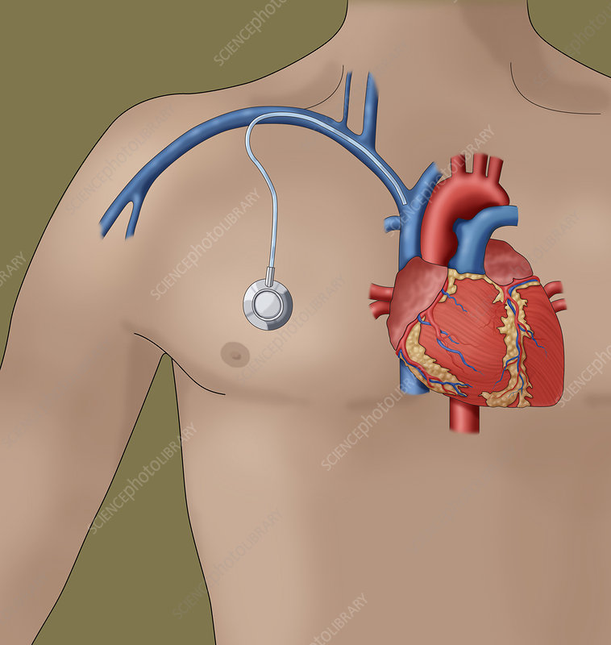
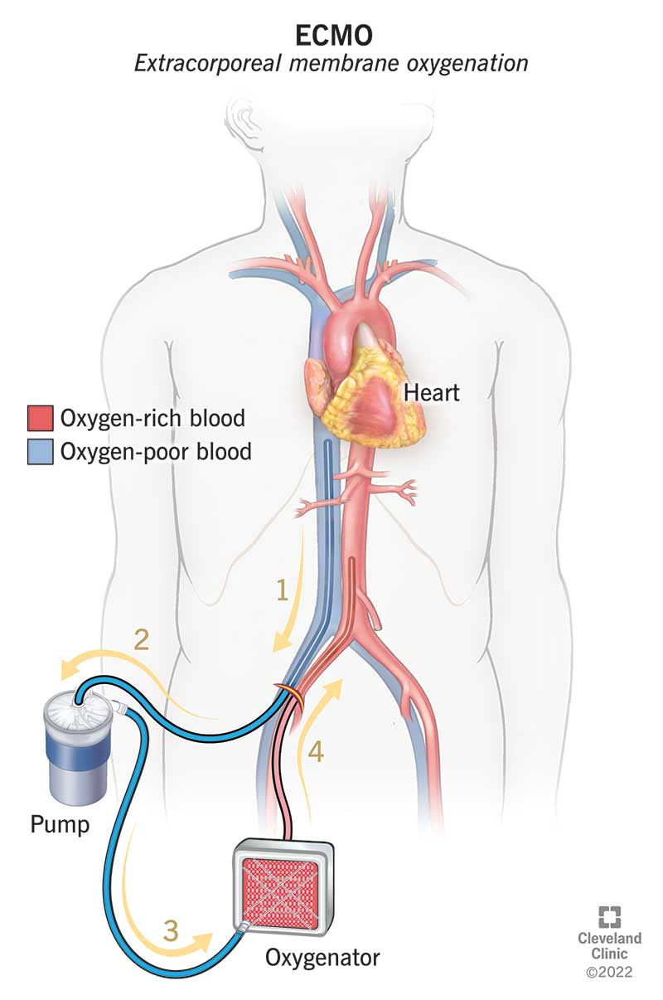

= 傅世宁医学通识
:toc: left
:toclevels: 3
:sectnums:

'''

== ★ 医学的目的 : 是先保证让人活下来, 然后才有其他治疗可能.

ICU 重症医学科 : 工作就是把所有最危急的病人的生命体征, 先稳定下来，再送回其他科室继续原发病的治疗。

医学存在的目的, 是先保证人活着. 先活下来，然后才有其他可能。

医学界的一个共识就是, 艾滋病、癌症，很快就能成为慢性病，人不会因为这些病很快死亡。

== ★ 不怕难题有多难，就怕没有解决方法.

学医之后我体会到 : 不怕难题有多难，怕的是没有办法解决。只要有办法，我总会一步一步地搞定它。

每个病人都是不同的个体，治疗的反应因人而异，结果也不同。

医学(包括医学开拓) 面临的一个现实就是"不确定"。

.案例
====
在几十年前，心脏外科就面临着一个难题，就是没办法把心脏里的血引出来，这样就不可能打开心脏做手术。

到了1954年，有个美国医生 Lillehei (李拉海) 认为，不能眼睁睁看着这些孩子死。他设计了一种大胆的手术方案。给孩子做手术的时候，让他的父亲躺在边上，把孩子的血管和父亲的血管连在一起。这样，孩子心脏里的血就能引出来，流到父亲体内，用父亲的肺给血液加上氧，再打回孩子的身体。这么做，手术的风险也从一条命增加到了两条命。

李拉海医生不做，没人会说什么。但是一旦失败，父子俩人的命都没了，而且李拉海的职业生涯也会到此结束。
====

.案例
====
慢性心衰, 也就是心脏功能逐渐衰竭. 到最后，病人甚至连平躺都成了奢望。想要治愈只能心脏移植。全球每年有约100万严重的心衰患者，需要进行心脏移植手术。但是，哪有那么多供体给病人呢？

为了解决这个问题，美国的医生们最先研发出了人工心脏。在找到合适的心脏供体之前，代替心脏工作。
====

== ★★ 一切医疗只起"支持"的作用, 核心治愈靠人体自身的修复.

真正治好病的，是病人自己。所有的医疗行为，只是起到支持的作用。*医疗的本质是支持生命自我修复。* +
首先是人体的自我修复，然后才是医学的支持。*人体的自我修复是核心，是关键。*

[.small]
[options="autowidth" cols="1a,1a"]
|===
|Header 1 |Header 2

|人体的自我修复, 主要靠细胞分裂。
|- 骨折之后，骨折的地方会长出骨痂，逐渐让断裂的部分愈合，靠的也是细胞分裂。
- 秋水仙碱本来是一种治疗痛风的药，小剂量可以治病，但是超过剂量很容易中毒，甚至死亡。这种毒根本没有解药。*服用致死量的秋水仙碱，会阻断细胞的分裂，让细胞在分裂中期死亡。细胞不再分裂了，不再产生新的细胞了，这就剥夺了疾病治愈最基本的环节——自我修复。*

|一切医疗都是用来支持"人体的自我修复"
|在疾病面前，*尤其是大病，医疗的支持作用是必不可少的。因为这个时候，人体的自我修复垮了。医疗的支持，就是给自我修复赢得时间、创造条件，等待自我修复最终发挥作用、战胜疾病。*

- ICU，也就是重症医学科，是疾病最重、距离死亡最近的地方。里面几乎所有的救命手段都是支持。
.. 呼吸机 : 是支持肺，让肺休息，等待自愈.
.. 床旁的血液净化 : 是支持肾，替代肾脏的功能，等待自愈.
.. ECMO 魔肺 : 是对心脏和肺，提供最高级别的支持.

*所有这些顶级的医疗设备，都是为了先把命保住，给自我修复赢得时间、创造条件，然后等待"人体的自我修复"发挥作用。*

- 得了肺炎，先用抗生素杀死大部分细菌，但是总有耐药的，没被杀死的细菌。怎么办？这个时候，人体的白细胞发挥作用 (即自我修复)，消灭剩下的细菌，让肺炎痊愈。
- **同样是肺炎，但是白血病病人, 或者艾滋病病人, 就没有这么幸运了，**会非常难治，这些病人甚至会因为肺炎去世。*因为这类病人的白细胞吞噬功能差，自我修复能力低下*，因此，再强大的抗生素效果也不好。

- *如果癌症细胞可以逃过人体免疫细胞的监视，那么说明这个时候自我修复垮了。如果不能够恢复这种自我修复，病人再怎么手术、放疗，效果都不好。* +

在免疫疗法出现之前，医生用手术、化疗、放疗，直接攻击癌细胞，这几种方法的本质都是外部干预。也就是借助于外援，帮着咱们杀敌。而免疫疗法彻底换了一个思路，也就是增强内力。让免疫细胞获得识别和杀伤癌细胞的能力, 就是癌症治疗方法之一。

CAR-T治疗是由一系列微观研究促成的。包括"癌症基因"的研究、"免疫细胞"的研究、"细胞表面受体"的研究，以及"免疫细胞如何识别癌细胞". 所以, 的CAR-T治疗，正是百年来无数微观研究的成果。

|===

急性淋巴细胞性白血病, 是儿童白血病的一种常见类型。一种叫做CAR-T的免疫疗法出现了。CAR-T的原理就是把病人杀肿瘤的T细胞抽出来，在体外进行修饰，加上一个专门寻找癌细胞的“GPS”，然后，把这些加了“导航”的细胞扩增，再回输到艾米丽体内，让它们攻击癌症细胞。

'''

== 人体有"代偿机制", 这就导致 -> 疾病不是突然发生的，而是突然发现的

[.small]
[options="autowidth" cols="1a,1a"]
|===
|Header 1 |Header 2

|很多病没有症状，一旦发现就是中晚期. 所有严重的慢性疾病都不是突然发生的，而是突然发现的。
|- 很多胃癌的病人, 早期没有明显症状。幽门螺旋杆菌感染, 可以导致胃癌. 世界卫生组织把这种细菌列为一级致癌物。 +
*一级致癌物指的是 : 有明确证据表明可以致癌的物质*，比如雾霾、烟草、槟榔、黄曲霉素等等。
- 结肠癌，从一个良性的腺瘤, 逐步演变成恶性肿瘤，通常需要15年。
- 女性持续的高危型HPV感染, 到发生宫颈癌，一般需要大约十几年（高危型，就是最容易引起宫颈癌的病毒类型）。
- 中国人死亡原因第一的心脑血管病，*也是从青壮年开始，血管上就开始出现斑块，经过20-30年的进展，血管逐步狭窄。当狭窄超过一定范围，才会出现"心脏病"或"脑血管病"的症状。*

这种无症状的进展是多么漫长。但是，一旦出现症状，多数都是中晚期。 +
*之所以人体能够在疾病状态下，十几年甚至几十年都不出现明显的症状，是因为人体有一种"代偿机制"。* 代偿, 是慢病进展过程中, 人体的妥协.

|*代偿, 即是代替、补偿。身体某些组织或者器官持续受损，已经没办法修复原样了，人体就调动没有受损的部分，加快补充或者代替受损的部分完成工作。*
|- 幽门螺旋杆菌会持续攻击胃的细胞，引起胃炎，细胞就会死亡。这个时候，人体就会启动代偿机制，让深层的干细胞加速分裂，赶紧补充死亡的细胞。这样就防止发生严重的穿孔、出血。 +
所以，人体的代偿, 能够让器官在持续损伤的状态下，基本上能够满足功能，也就是凑合着用，所以才不会出现明显的症状。*只有到了疾病晚期，代偿不动或者超过极限了，症状才会出现。*

代偿的最终目的, 是保证器官的基本功能，也就是为了保命。 +
*所有的慢性病，人体都会启动代偿。*

- 比如高血压。血压持续增高，心脏射血的负担就会增加。所以，心肌就会变得肥厚，射血才更有劲。这是代偿。
- 甚至冠心病病人，血管狭窄了、堵了，这根堵了的血管周围的小血管, 就会变粗、变长，甚至长出新生的血管，替代这根堵了的血管给心肌供血，防止发生致命性的心肌梗死。这也是代偿。

*这种机制让我们在没办法去除持续损伤因素的情况下，先妥协着活下来。这本身是有利的一面，但它也有另一面，即同时也掩盖了病情。*
|===

代偿带给我们疾病防治的建议:

[.small]
[options="autowidth" cols="1a,1a"]
|===
|建议 |Header 2

|既然很多慢性病在早期没有症状，我们就要主动筛查。
|开展了癌症的早期筛查。

- 比如结肠癌、直肠癌的发病率下降，主要原因就是推广"结肠镜"检查。 +
从2000年到2015年，美国50岁以上的成年人接受结肠镜检查的比例从21%升高到了60%。

|从源头上预防, 或者从中间环节阻断，可以有效防止慢病的发展。
|- 比如宫颈癌。绝大多数是HPV病毒感染，整个发展链条是 : 先引起慢性炎症，然后到不典型增生，最后才发展成宫颈癌。 +
-> 从链条的"源头上"预防HPV感染 : 接种宫颈癌疫 +
-> 从链条的"中间过程"中, 预防HPV感染 : 对于已经发生感染的，在不同的阶段进行针对性的治疗，就是阻断中间环节，避免最终发展成癌症。

但是，很多病我们很难从源头上预防，也很难完全阻断。 +
比如冠心病。尽管我们严格控制血压、血糖、血脂、不吸烟，但是还是有相当比例的人群得了冠心病。而且尽管严格用药，也会有相当比例病人的病情依然在进展。

|巧妙地放大代偿机制。
|- 冠心病是有血管狭窄了。那么，狭窄血管周围的小血管就会变粗、变长，甚至产生新血管，代替那些狭窄的血管完成供血任
务。这是代偿。 +
放大代偿，就是主动帮助小血管长出来。通过适度运动就可以帮助形成这些小血管。
|===

-

== "病"和"症状"不是一回事

所有不舒服的感觉，都叫症状。广义的症状, 还包括到医院检查发现的各种异常。

[.small]
[options="autowidth" cols="1a,1a"]
|===
|Header 1 |Header 2

|有时候病比较复杂，会出现一系列的症状。
|- 比如"脑梗塞"这种病，它会出现三个症状引起咱们注意。这三个症状加在一起有个名字，叫做“120” : +
-> 1：看1张脸。有没有口角歪斜、脸不对称。 +
-> 2：两只胳膊平举。看看有没有胳膊无力、下垂。 +
-> 0：聆听病人的语言。看看是不是说话不利索。 +
*如果人同时出现这三个症状，90%以上的可能性就是脑梗塞。*

|不要把"症状"当成"病"来治.
|- **人在大出血的时候，血压低是一种自我保护，血压低下来出血速度才会慢。**如果快速输液，把血压提上来，那么出血反而更快了，结果就是加速了伤员的死亡。所以这个时候应该少输液，让血压维持在一个较低的水平，抓紧时间手术，止血才是关键。

这个病例说明： +
-> 症状对人具有保护作用，就像低血压可以减慢出血速度一样。 +
-> *如果盲目地干预症状，有可能会南辕北辙。*

所以，正确区分"病"和"症"就很重要。不要把"症状"当成"病"来治.

- 得了慢性感染，比如肺结核，很多人会出现"缺铁"的症状，会出现"缺铁性贫血"。这种缺铁现象, 就是人体的一种自我保护。因为微生物要存活需要铁，但是微生物却不能自己合成铁，只能从人体获得。所以，感染的时候人体会减少铁的吸收，故意造成一种缺铁状态，就是为了限制细菌的生长。如果盲目补铁，反而会加重病情。

- 怀孕的女性在即将分娩的前几天，血液里有个凝血指标, 会快速大幅度上升，有时候甚至升高几十倍，表示血液容易凝固。 这还是为了自我保护，防止未来几天生孩子的时候，产道损伤可能发生的大出血。 等到生完孩子，安全了，这个指标也会迅速恢复正常。

|但症状具有"双刃剑"效应
|- 伤员大出血的例子, 血压低是为了保命，但是血压过低或者持续时间过长，会引起器官的缺血，导致器官功能衰竭，接下来也会引起死亡。
- 过敏是人体接触到异物，免疫系统产生的排斥性反应，目的是为了让咱们远离过敏物质。但是，有些人的过敏反应特别强烈，会出现休克、气道痉挛、水肿，严重的会引起窒息和死亡。

|要区分哪些是病，哪些是症. "病"需要治，但"症状"却未必需要处理。(即不要头疼医头, 脚痛医脚)
|- 骨刺不是病，而是症状。真正的病，是人的骨骼和关节的老化。
- 高血压是怎么来的呢？**随着年龄增高、肥胖或者有些说不清的原因，血管会逐步狭窄、硬化、血流阻力增加。**这个时候，为了保证器官的正常供血，血压就会增高，这就是"原发性高血压"。高血压只是为了在血流阻力增加的情况下，让器官仍然能够保持一定血流的保护性反应。 +
所以我(傅世宁)认为，把"原发性高血压"定义成一种病，不如把它看成是一种症状更贴切。真正的病是隐藏起来的，引起血流阻力增加的病理改变。 +
+
症状具有双刃剑效应，如果症状严重或者持续存在，就一定会带来后续的损害。血压持续增高，必须口服降压药，防止血压持续异常引起后续的心脏、脑血管受损。但是你要记得，治疗高血压更重要的应该从改变生活方式，降低血流的阻力着手，而不能单纯依靠药物降压。(治标与治本的区别.) 别跟症状死磕，而是要找到病根，治病。

明白了哪些问题是"症"，哪些问题是"病"，接下来的治疗才更有针对性。

|===

== 医学思维: 提出假设-收集证据-验证假设的循环 ("麦肯锡方法"就是遵循的这个路径)

.案例
====
有一个胖胖的已经生过小孩的中年女性说她右上腹疼痛。
没经验的医生怕遗漏，可能就会把所有肚子疼的相关检查都做了。
而高手会马上假设她会不会是胆囊炎呢？然后让病人做一个超声、血常规，立刻就能确诊了。

因为，有的专家把这类病人的特点总结成了4个以“F”打头的英文单词： +
- Female（女性） +
- Forties（40岁左右） +
- Fat（肥胖） +
- Fertile（生过几次孩子）

**符合“F4”特点的病人, 患"胆囊炎"的概率比其他病人高。**这个病人又恰好是**右上腹疼，所以医生会优先考虑是不是胆囊问题。**
====

.案例
====
大出血的时候，病人就会血压低。血压低才能让出血速度慢下来，这是人体的保命反应。但是这个大出血的病人，血压不低，而是越来越高。我立刻想到这个病人可能是脑水肿，也就是脑子肿了。*大脑里压力高了，所以人体会拼命让血压升高，以对抗大脑里面的高压，给大脑供血。*
====

高手会保持开放性，一旦有证据表明最初的假设不对，会立刻校正，提出新假设，寻找新证据，再来一次新的验证。不会钻牛角尖。 +
福尔摩斯说过一句话：一旦你排除了所有的不可能，那么剩下的不管多么难以置信，就是真相。

但是低手就容易产生惯性思维。认准一种假设之后，往往容易主观上丢弃不符合假设的证据，而不是修正假设来适应证据。

'''

== ★★ "循证医学"的五级证据

循证的意思，就是要遵循证据，找到最靠谱的证据。找证据是循证医学的核心。它把证据分成了五级，第一级最可信，第
二、三、四、五级，可信程度依次降低。

[.small]
[options="autowidth" cols="1a,1a"]
|===
|Header 1 |Header 2

|5级证据(可信度相对最低)
|无论是不是专家，医生的个人经验都属于第五级证据，也就是可信度最低的证据。只有在缺乏其他证据的情况下，才选择用个人经验给病人看病。

- 比如牙齿正畸。根据北京大学口腔医院的统计，大约70%的人需要先拔牙，再矫正。决定是否需要拔牙，是依据X光片或者CT的结果，还要结合每个人的具体状况。 +
假设现在你的主治医生评估完你的情况，动员你拔几颗牙，再做正畸。你会怎么想？你估计会想，我是做正畸，为什么要拔牙呢？如果医生告诉你，他的老师就是这么教的，他也这么做一辈子了，他的经验认为拔牙好。这个时候你立刻就要想到，这只是"个人经验"，个人经验是第五级证据，是"循证医学"层级中最不可靠的证据。

|4级证据
|就是治疗前后对比研究。

- 但是如果医生说，他做过几百例拔牙后再正畸的病人，治疗前和治疗后对比，所有的病人都满意。那你要知道，这种把"治疗前"和"治疗后"作对比的研究，只是比个人经验靠谱一些，但依然是第四级证据。因为，病人满意并不代表效果好。让病人满意的办法有很多。比如费用打折，或者医生的态度特别好。因此，难以了解治疗的真实效果。

|3级证据
|就是"对照研究"。

- 要想看一个治疗有效没效，一定要和安慰剂对照。
- 要想知道拔牙好还是不拔牙好，作个"对照"就明白了。让一组病人拔牙，一组病人不拔牙，这就是对照研究。所以，如果医生告诉你，他做了几百例拔牙后正畸，又做了几百例不拔牙正畸，观察了很多指标，能够证明这部分病人拔牙优势更明显。对照研究的可靠程度又升高了一级，这就是第三级证据。

但是第三级证据的问题，就是没有随机分配研究对象。

|2级证据
|把病人随机分到拔牙组或者不拔牙组，这叫做随机对照试验。"随机对照研究"得到的证据就是"二级证据"。能够拿出二级证据的医生就非常靠谱了。甚至FDA（美国食品药品监督管理局）进行新药审评的时候，就看"随机对照试验"的结果。

二级证据很牛，但是有可能受到地区、人种、卫生情况等因素的影响。

|1级证据 (可信度最高)
|第一级证据，称为Meta分析（荟萃分析）。它是级别最高的证据。也就是把全世界发表的"随机对照研究"都拿过来，用一套科学的方法进行客观评价，得出的结论就更可靠了。
|===

掌握了这五种级别的证据，你肯定已经发现**循证医学的优势了。 它最大的优势，就是综合评价当前能够获得的全部证据。**一个治疗方法到底好不好，看看全世界的医生们怎么说，这样也就避免了医生个人经验带来的偏差。  +
其次，循证医学得到的结论可以标准化推广，避免了因为医生水平差异，导致的治疗水平差异。  +
循证医学是让病人获得最佳治疗方案的解决办法。

现在, 你来思考一下: 关于新生儿是趴着睡好，还是仰着睡好，很多人在争论。运用"循证医学"的知识，应该怎么找到这个问题的科学答案呢？

== ---------- ----------

'''

== 找不到发病机制, 找不到病因，也就没有治疗方法.

我们通常把人体解剖学、生理学、病理学这三门基础学科的成立，看做是现代医学诞生的标志。 即 : 不仅要找"发病部位"，还要研究"发病机制", 和"致病因子". 致病因子就是引起疾病的物质实体。

比如非典:
[.small]
[options="autowidth" cols="1a,1a"]
|===
|Header 1 |Header 2

|发病部位 :
|肺

|发病机制 :
|

|致病因子 :
|蝙蝠身上的“非典”病毒
|===

- 寻找传染病的"病因"还是最简单的。有些病可以找到"发病部位"，但是找不到确切的"发病机理"。比如渐冻人。*找不到病因，也就没有治疗方法。* +
目前，中国阿尔茨海默症的患者有1000万左右。但是直到今天，*医学还没有搞清楚确切的发病机制, 也就缺乏对于这个病的治疗方法, 和有效药物。*

- 也有有的病研究了几十年，找了几十年的病因，最后发现它根本不是病。比如同性恋。
- 甚至还有很多病一点线索都没有，连诊断都做不出来。

所以，**治病必须打断发病机制，改变细胞或者器官的功能。**而承载这个改变机能任务的, 就是"药"。

- 抗生素通过杀死或抑制细菌，治疗感染，是打断发病机制；
- 退烧药通过调节体温, 调节中枢的功能，达到退烧；
- 口服避孕药通过抑制排卵，防止怀孕；
- 紧急避孕药, 阻止受精卵在子宫内膜着床，达到避孕。

对于有些病, 我们当前还找不到确切的因果关系和发病机制，但只要能找到发病的某个"因果链条"，阻断链条，同样可以治病。

- "氯丙嗪 qín" (Chlorpromazine) 的作用, 和大脑内的多巴胺受体相关。氯丙嗪阻断多巴胺受体，对大脑内的神经递质进行干预，就可以减轻精神错乱。

== 每一种药，都代表了特定年代的医学认知水平

药的实质, 就是医学解决方案的物质载体。

比如阿莫西林，它背后是体现着一整套复杂的认知体系。比如嗓子疼和细菌的关系，细菌的结构，药物杀灭细菌的机制，药在人体怎么代谢，半衰期是多少等等。 每一种药，都代表了不同年代的认知水平。所以只有医学整体认知水平提高了，才可能交付出更好的载体，也就是更好的药。

对于药的安全性和有效性，法律监管只能保证它是一个“合格”的药。但是，让药更安全、更有效、副作用更小，最终依靠的是整体医学认知水平的提高。

== 实践, 是医学的核心理念

每个医生在上医学院的时候，都有读不完的书，而且都是大部头：生理、生化、解剖、组织胚胎、微生物、内、外、妇、儿、皮肤、性病、眼科等等。但是学了这么多理论，就会看病了吗？理论和现实永远不一样。而**"实践"是理论和现实之间的桥梁。**临床医学更是如此，实践是临床医学的核心理念。

医学和任何科学都不同。医学面对的是活生生的人，每个病人都不同。而且，即便是同一种病，不同的人用同一种治疗方法，用同一种药，效果也不一样。医学充满着不确定性。

理论上只要符合“1、2、3”，那么就能诊断。但是现实中没有清晰的线索用于诊断，需要医生去挖掘、梳理。有些病人会隐瞒病情，有些病人会故意隐瞒性倾向，隐瞒心理问题，隐瞒家族史、接触史，隐瞒病情的真正原因等等。甚至，医生在诊断过程中搜集到的信息和指标, 也可能会相互冲突、相互矛盾，客观检查的数据指标, 也可能并不是完全一致。所以, 临床医学充满了不确定，没有任何一个公式可以套用在任何一个病人身上。

奥斯勒(美国"约翰·霍普金斯大学医学院"奠基人之一) 是怎么解决这个问题的呢？首先，医学生在医学院上学的时候，就开始进入临床实习。这就是奥斯勒的“床边教学”。到病房里去学习、实习，边学习理论边实践。天天和病人在一起，想不成长都难。

奥斯勒经常说：多跟病人说说话，病人的语言就揭示了诊断。

如果医学生毕业之后，直接分配到不同水平的医院，那么他们今后的技术和能力势必发展也不同。水平有差异的医院，很可能会影响这些年轻医生的发展。所以，医学生从医学院毕业后，继续规范化培训。

比如中国, 医学生从医学院毕业之后，要想当医生，先要在国家规定的、具有培训资格的大医院, 进行三年的"住院医师"规范化培训。 +
在美国，内科系统要培训3-5年，外科系统要培训5-7年。

这些医生几乎是吃住在医院。不仅要培训医学知识、病人管理能力、沟通技巧、实践技能、多学科协作能力，还要培训科研能力、教学能力和职业精神。

== 要让病人能有尊严地活着

临床医生要做的, 就是结合医生自己的临床经验 + 患者的期望意愿, 来给病人制定最佳的治疗方案.

现代医学已经认识到 : 单纯地延长存活时间是远远不够的，维护患者的尊严，支持患者的生活意义，提高患者的生命质量，是医学最重要的使命。 +
不关心人的科学是傲慢，没有科学依据的关心是滥情。如果你不能切实地帮助患者，你的关心，就没有价值。(但很多时候是做不到实质性的帮助的，只能安慰，你不是上帝，不可能解决所有的问题. 所以关心依然是有价值的.)

很多病，会让人失去尊严。

癌症晚期的病人最怕的不是死亡，而是疼痛. 有的病人痛不欲生，甚至抑郁自杀。

晚期癌痛，医生们就用药物或者手术，让病人不那么疼。让病人在不疼中，有尊严地走完生命的最后时光，对于他们来说，比多活几天更重要。

医学从来都具有"科学"和"人文"的双重性格。只有伴随着"科学"的人文, 才是真人文。

== 让病人追求自己独特的意义

有的人们为了实现自己的价值，他们并没有选择医生认为的最有利的方案。

- 一个乳腺癌的女性坚持要怀孕，怀孕可能会加重她的病情，缩短她的生命。但在她看来，能有个后代, 就是她生命的全部意义。

== 医患不是甲方乙方，而是"阶段性"的联盟.

不应把医疗, 单纯看做是消费. 因为医疗这个行业, 带有特殊性。每一个病人都是不同的个体，即使是同一种病，治疗过程也不相同，达不到完全的标准化流程。同时，治疗结果也是不确定的。如果把医疗看做是消费，那怎么评价质量呢？如果我对这次消费不满意，可以退款吗？

- 医生具有技术优势，掌握诊断技术、病因、预后（预测疾病的可能病程和结局）、治疗方案, 及预防策略。
- 患者的优势在于 : 提供治疗的体会、本人生活习惯，以及其他有助于诊断和治疗的关键信息。(即提供医学实验的效果反馈)

*医患之间, 其实只有阶段性关系。只要有更好的治疗方法，病人可以随时换医院、换医生，而且不论治疗多久，这种医患关系早晚是要终结的。*

== 中国推行的医院间的分级诊疗，本质就是分工协作

- 乡镇卫生院、社区服务中心 : 保障基础的医疗保健，慢病管理、健康教育, 可以完成疾病的首诊。
- 大医院和专科医院 : 对于疑难病、复杂病、急性病有能力有经验。

大医院和基层医院相互转诊，急性病在大医院得到有效治疗后，还可以转到基层医院继续康复。

这就是基层首诊、双向转诊、急慢分治、上下联动。

'''

== ---------- ----------

'''

== 人的处境, 会大大影响人的心理

你知道每天有多少外地病人, 进京看病吗？每天至少有70多万。这么算下来，每年就是两个多亿。这些人风餐露宿，整宿守在医院门口，就为了一张专家号。你能想象病人排了一宿的队之后，见到医生是什么感觉吗？就像见了神一样。(所以古代, 带有宗教色彩的农民起义, 都把宗教神棍当做神仙看待, 因为他们声称能看病.)

== 早诊断, 是经济收益最大的方法

很多病根本没症状，是去医院检查以后才发现的。

实际上，几乎多数癌症, 都经历了一个漫长的没有症状的过程。

- 肺癌可以在体内潜伏20多年，然后突然转变为侵袭性的癌症.
- 科学家推测，在90岁以上去世的人当中，如果能够给他们进行尸体解剖，很可能多数人体内, 都有癌症或者癌前病变，只是生前没有感觉而已。

- 我们每个人从出生开始，得冠心病的风险就在不断增加。*婴儿一出生，血管就开始逐渐地老化，到了成年，血管壁上开始出现
斑块，血管会慢慢硬化变窄。当血管继续狭窄，超过70%、80%，甚至90%的时候，人就开始出现"心绞痛"的症状了。*

治病的代价远远大于预防。疾病预防，永远是性价比最高的举措。

== 人会生病的原因

[.small]
[options="autowidth" cols="1a,1a"]
|===
|Header 1 |Header 2

|我们的基因是不完美的 :
|癌症，各种遗传病、慢性病，都跟基因有关。

|人体设计是不完美的 :
|**进化的逻辑是让利益和风险平衡，而不是让利益最大化。所以导致了人体器官性状的不完美。**可以说，几乎人体的每个器官, 都有不完美的地方。

你知道人类到今天可以得多少种病吗？到目前为止，世界卫生组织（WHO）一共收录了26000多条疾病的名称。但肯定还有很多未知的病不在这个疾病清单里。

- 胃酸几乎能杀灭所有的细菌，但是它却不能消灭"幽门螺旋杆菌". 而这种细菌会让我们得胃炎、胃溃疡，甚至得胃癌的几率明显增加。
- 我们人体的免疫系统, 可以攻击病毒、细菌、癌细胞，但是它有时也会误伤我们自身 -- 产生"自身免疫病"，比如红斑狼疮、类风湿关节炎等等。
- 心脏很重要, 但心脏自身的血管却非常细，细了就容易窄甚至堵，结果就是心绞痛和心肌梗死。
- 人类排泄废物是用两个通道：一个尿道，一个肠道。一个液体，一个固体。多一套系统，也就多一层风险。医院现在要分"泌尿科"和"消化科", 来处理两条道上的问题。

|人类与环境适应的不完美 :
|"人类进化"的速度, 永远赶不上"人类生活环境"变化的速度，一个重要的结果就是带来了病。

- 不用使劲跑就可以获得高脂肪、高热量的食物, 同时也带来了肥胖、高血脂、高尿酸等一系列代谢性疾病。肥胖又增加了人类患癌的风险。
|===

== 内共生

目前所有的研究, 也只能反应内共生与疾病关系的冰山一角.

[.small]
[options="autowidth" cols="1a,1a"]
|===
|Header 1 |Header 2

|内共生
|真核细胞里的线粒体, 是由细菌演化而来的。真核细胞和它内部的细菌是"内共生"关系。

- 如"5-羟色胺"是让人产生快乐的物质。人体自身合成的5-羟色胺只占总量的5%，另外95%是由细菌合成的。
- 肠道。为了和细菌作战，人体给肠道配备了最王牌的部队。有七成以上的免疫细胞集中在肠道，包括巨噬细胞、T细胞、NK细胞、B细胞；还有七成以上的免疫球蛋白A（IgA）是由肠道制造的。可以说肠道是人的免疫系统和细菌作战的最大战场。

|打破内共生就会带来病
|很多药物包括化疗药物、抗生素，很多食物包括糖，都会干扰"内共生"。内共生关系一旦被打破, 就会带来病。

1.细菌移位会带来病。也就是说，细菌跑到不该去的地方了。细菌如果在它应该待的地方，就是正常菌，或者不会引起严重的问
题；如果细菌跑到其他地方，就会变成有害菌。

- 阿尔茨海默症，在这些病人的大脑里，发现了牙周炎的细菌和一些引起口腔溃疡的白色念珠菌。

2.内共生被打破，有害的微生物就会趁虚而入，这样也会带来病。

- 很多女生用含有杀菌剂的洗液冲洗阴道，那么接下来反而会引起真菌感染，引起"真菌性阴道炎"。
- ICU 中, 因为严重感染必须大剂量应用抗生素的病人，就很容易继发耐药菌的细菌感染, 或者深部真菌感染。

3.内共生被打破，导致"细菌合成化学物质"异常，也会带来病。

- 大脑细胞完成信号传递功能，涉及到主要20多种化学物质，这些化学物质中, 很多都是由肠道细菌参与合成的。如果肠道菌群紊乱，就会引起精神问题，比如焦虑、抑郁、自闭症等等。

|怎么重建或者恢复内共生呢？
|1.如果不是严重的或者关键部位的细菌感染，就少用抗生素。因为抗生素是对内共生破坏最大的药物。

- 健康人不要动不动就用含杀菌剂的任何洗液或者漱口水。

2.孩子的成长过程别太干净，要让孩子多和大自然接触.

- 产妇能顺产就不要剖腹产。现在研究认为，经过女性产道的婴儿, 可以迅速建立起第一道多样性更好的肠道菌群。

3.多吃膳食纤维丰富的食物。比如苹果、梨、魔芋、黑麦、黄豆、青豆、枸杞、石榴、椰子、冬
菇。

4.少吃糖。

|===

== 免疫系统的问题

[.small]
[options="autowidth" cols="1a,1a"]
|===
|免疫系统 |Header 2

|认不出“坏人”
|- 流感病毒, 为了逃避人体免疫，会不断地变换病毒表面的H蛋白。H蛋白就是一种辨别物质，H蛋白变了，人体免疫也就认不出来了。
- 水痘-带状疱疹病毒，它可以藏在神经节里。很多病毒可以藏在细胞里，让免疫细胞找不到。
- 癌细胞有个机制能逃过人体免疫，就是伪造一张“身份证”，骗过免疫系统的检查。

有时候，即使认出来了，癌细胞也会释放一些物质麻痹免疫细胞，让免疫细胞的杀伤能力大大降低。

|认不出“自己人”, 把“自己人”当“坏人”
|1.人类自身免疫病有100多种，但是机理都相似，都是人体免疫不断地攻击自身的细胞。

- 红斑狼疮这个病，眼睛、皮肤、造血系统、肺部、肾脏，几乎人体的每一个器官，每时每刻都在遭受着自身免疫的攻击.

*在临床上，各个学科的难题通常都会涉及到自身免疫问题。有专家说过，当你遇到解释不通的临床问题时，就想想会不会是自身免疫出了问题。*

'''

2.过敏 : 就是免疫系统把本来无害的物质辨别为“敌人”，产生过度的反应。

- 过敏性鼻炎、荨麻疹、湿疹、哮喘这些病都是过敏。

|打不过“坏人”
|免疫功能低下。

- 比如艾滋病、白血病、糖尿病、尿毒症。这些病有的是免疫细胞的数目减少，有的是功能降低.

|===

== 癌症

==== 癌症的链条

[.small]
[options="autowidth" cols="1a,1a,1a"]
|===
|链条环节 || ← 针对此环节的治癌方法

|DNA 错误的图纸
|正常的基因突变成癌基因.

正常细胞生长分裂, 需要"生长信号"，同时还有"抑制信号"防止过度生长。癌细胞一个最大的特点就是"生长信号"多，而且对"抑制信号"不敏感。所以，癌细胞长得快，不停地长。

|← 靶向药

|失效的自检体系
|人体有一种"细胞凋亡机制"，目的是让这些不合格细胞自我销毁。细胞的凋亡就是细胞的程序性死亡，它是人体防止细胞癌变的一种主要机制 -- 由抑癌基因（ tumor suppressor genes）控制。P53就是一种抑癌基因。 +
如果抑癌基因发生突变, 那本该自杀的细胞就会不死。
|←

|灵活的能量供应
|正常情况下，一个细胞和它最近的毛细血管的距离, 不能超过100微米，也就是0.1毫米。太远了营养够不着.

但是，癌细胞特别灵活。癌症的时候，促进血管形成的信号增多，而抑制血管形成的信号减少。这样，就有持续的新生血管形成，源源不断地给肿瘤组织供血。这就好比是，“癌症跑车”上路，既然找不到固定的加油站，那么就自带移动的加油枪，随时供应燃料.

所以在临床上，多数恶性肿瘤通常都是血流丰富。医生们甚至用这个特点区分良性和恶性。

|← 血管内皮生长因子抑制剂，就是针对癌症组织血管丰富的特点，抑制血管生长，也就抑制了肿瘤的生长。

|失明的警察
|正常情况下, 免疫细胞就是警察，它们会主动寻找和攻击癌细胞。但癌细胞会伪造一张“假身份证”，躲过警察的检查. 这种机制叫做免疫逃逸。
|← 免疫治疗药物PD-1抑制剂，就是恢复警察的火眼金睛和战斗力.

|篡改生死簿
|正常细胞的分裂次数是有极限的, 所以细胞是有寿命的。但癌细胞可以无限次分裂。
|←

|自由游移
|正常细胞就是按照基因编码，不会乱长。胃里的细胞永远也不会长到鼻子上去。 +
但是癌细胞不同，它们能在组织内部和组织间灵活移动，也就是癌症容易发生侵袭和转移的原因。
|←

|===

而所有的癌症治疗方法, 就是针对上述这6大环节的 (切断链条). 所有治疗的前提，都是基于医学对于这六大环节的认知越来越清晰。

==== 癌症发生的原因

人体的自我修复, 需要细胞分裂. 但细胞分裂也会带来随机错误。  +
人的基因组有31.6亿个碱基对，每次分裂这31.6亿个碱基对都要复制一次。工作量太大就难免出错. 每次细胞分裂都会带来随机错误。随着这些错误不断累积，犯的错就会越来越多，就有可能发生在关键点上, 变成癌基因。 +
所以，细胞分裂次数越多，癌基因发生的几率也就越大。

年龄越大，细胞分裂次数也就越多，癌症发生风险也就越来越高。 +
数据显示，40岁以上的人患癌症的风险, 呈指数倍增长。如果人的寿命达到85岁，累计癌症发生风险高达36%。

2017年《科学》（Science）杂志发表了一篇研究, 认为 : 引起癌症基因突变的因素中，最主要原因是染色体复制过程中发生的随机错误，这个因素占到了66%。而环境因素和遗传因素，加一起也只占34%。

为什么这些年，癌症突然就多了？主要原因是: 人的寿命延长了。

- 骨癌的基因突变：随机错误占了99.5%，遗传占0.5%，与环境因素完全无关。
- 甲状腺癌，随机错误占98%，遗传占1.5%，环境因素仅占微不足道的0.5%。
- 非何杰金氏淋巴瘤、脑部肿瘤、前列腺癌、睾丸癌，这些癌症的基因突变中，随机因素都占到了95%以上。

将癌症推迟的方法就是:
[.small]
[options="autowidth" cols="1a,1a"]
|===
|Header 1 |Header 2

|减少器官损伤, 即减少细胞修复次数 :
|- 戒烟、戒酒、减肥、多运动、多吃全谷物食品、蔬菜、水果、豆类，少吃糖、少吃红肉（比如猪肉、牛肉、羊肉）
- 避免乙肝病毒、丙肝病毒、幽门螺旋杆菌、HPV病毒感染。已经感染了，要治疗或者定期复查。

|定期进行疾病筛查。早期发现，早期治疗.
|避免这些良性的病变, 进一步发展成为恶性的癌症。 +
超过一定年龄之后定期进行科学的筛查，是发达国家总结出来的可行的癌症预防方法。

- 美国明尼苏达大学癌症检查中心，对45岁以上无症状的普通人, 每年做一次"乙状结肠镜"检查，见到"腺瘤"就切除。("腺瘤"就是一种癌前病变，长期发展就可以变成癌症。) 这样做的结果，就是结肠癌、直肠癌发病率比预期的减少了85%。

|===

== 冠心病：不只是器官问题，而是全身病

冠心病是因为血管窄了、堵了，引起心绞痛和心肌梗死。但是，为什么有些冠心病的病人容易脑血管也出问题呢？为什么有些男病人容易出现性功能障碍呢？原因是 -- 冠心病反映全身血管问题. 换言之, 是先有血管问题(因), 后有冠心病(果).

血管内皮就会受损，血液里的脂质就会沉积，就像河道的淤泥一样。时间久了，还会形成斑块，血管就会越来越狭窄。正如交通体系拥堵一样, 一旦一个部位出问题了，窄了，那么其他部位的血管，能好到哪儿去呢？ 动脉血管出问题了，长斑块，变狭窄，影响血流了 :

- 如果出现在"肾动脉"，就会导致肾动脉狭窄；
- 如果"脑血管"病变了，就容易发生脑血栓、脑出血；
- 如果发生在供应"肠道"的动脉里，就会引起肠道功能异常。完全堵死了，还会出现肠坏死。
- 如果供应"男性器官"的血流减少了，离阳痿还远吗？
- 当供应心脏的动脉血管——冠状动脉长斑块，变狭窄了，如果超过一定程度，就是冠心病。

这些病本质上都是动脉血管出问题了。(动脉血管问题是肇事的"因", 上面这些病只是后到的"果"而已)

有了冠心病的病人，很可能也容易发生脑血管病，或者其他动脉缺血引起的病。

医生想到：既然冠心病是因为血管里有地方窄了，那把这个最窄的地方扩张起来，不就可以了吗？但是问题很快来了，大约50%的病人，他们好不容易拓宽的地方，慢慢又重新窄了。 +
到了1987年，法国有位医生说，如果拓宽后再放个金属支架撑起来，就不会变窄了吧？ -- 这就是冠脉介入手术。

但是，对于"稳定性心绞痛"的病人，和单纯吃药比起来，吃药加上支架并不能降低病人发生心肌梗死的几率和死亡率。

*"稳定性心绞痛"就是冠脉血管狭窄了。严重的，如果狭窄在70%以上，就会影响血流。病人累的时候，心肌需氧增多，但是血流又供不上，就容易发生心肌缺血缺氧，就会疼。这就是稳定性心绞痛。*

为什么放支架, 并没有降低这部分病人发生心肌梗死的几率呢？

*引起冠心病的主要问题，是年龄，是不健康的生活方式，还有高血压、高血脂、糖尿病、肥胖等等。所以，如果这些因素持续存在，单纯放支架解决了一个部位的狭窄问题，但是预防不了其他部位继续狭窄。就像交通拥堵一样。在高峰期，单纯拓宽一个桥、一个路口没用，因为流量大这个根本问题还存在，那么还会引起其他的路、其他的桥继续拥堵。*
同样，冠心病可能是一个矛盾最集中的点而已。得了冠心病，很可能其他部位的血管也好不到哪里去。

已经证实的可以降低冠心病死亡率和心肌梗死的药物，包括：

- 抗血栓的药物，如阿司匹林；
- 降血脂的药物，如他汀；
- 减慢心率、降低心肌氧耗的药物，如倍他乐克等；
- 降低血压、改善心肌重构的药物，如某某普利、某某沙坦。

这四种药物，是治疗冠心病的基础药物。

给西直门桥拓宽、改造。这就好比是介入手术。介入手术尽管解决不了全局问题，但是介入手术可
以解决矛盾最集中、最危急的情况。

心绞痛变得没有规律了，我们也称为"不稳定性心绞痛"。药物已经控制不住了，不处理的话很容易发生心肌梗死。这个时候做介入手术，放支架，也是非常有必要的。 +
有些病人吃药控制不住心绞痛的症状。对于这类病人，介入手术对于改善症状也非常必要。

最后，咱们还有其他方法，这就是冠状动脉搭桥手术。它尤其适合那些合并了糖尿病的严重冠心病病人。

== 压力会导致的胃溃疡

把两只猴子 a,b 分别捆在两把椅子上，每20秒钟椅子会自动放电一次。但是，给其中一个猴子a开关, 如果它能在快要放电的时候准确地按下开关，那么两只猴子就可以同时避免挨电。按错了，就一起挨电。几天过去了，其中一只猴子得了胃溃疡，另外一只安然无恙。是哪只猴子病了呢？是积极主动，按压开关的这只猴子a呢？还是消极被动，默默承受的那只猴子b呢？*答案是，负责按压开关的 a猴子病了。*

挨电就是一种刺激，我们称为应激。仅有应激，不会得病，只有对应激产生了剧烈的心理变化，才会之后引起了身体上的病。所以它的三个环节：应激、心理改变、躯体疾病，缺一不可。

.案例
====
- 伞兵天生就是被包围的。 事实上有项研究指出，对伞兵而言，即使是刺激的军事训练, 就能成为引发溃疡的一种危险因素。

- 压力越大的部门，尤其是这个部门的领导，就越容易得心身疾病。

- 二战时, 德军对列宁格勒的围攻，持续了872天。战后，医生们给列宁格勒的居民做体检, 发现幸存居民的高血压发病率, 是战前的16倍，从战前的4％上升到64％。
====

人生不如意十之八九. +
消化系统是最容易受到影响的系统之一。比如胃溃疡、神经性厌食，再比如一紧张就吃不进去饭了，或者一有大事就肚子疼。

人体几乎每个器官都有可能发生心身疾病(即情绪心理, 影响身体疾病)。 如:

- 反映在皮肤上，会出现斑秃、湿疹；
- 反映在循环系统上，会出现高血压、冠心病；
- 反映在呼吸系统，会出现哮喘；
- 反映在泌尿生殖系统，会出现男性阳痿、女性性交疼痛和性冷淡；
- 如果影响了免疫系统，就会出现自身免疫病，比如甲亢、类风湿关节炎，甚至免疫低下引起癌症。

据统计，心身疾病的发病率, 女性高于男性，城市高于农村，脑力劳动者高于体力劳动者，发达地区高于不发达地区。

== 疼痛：不仅是症，还可能是病

世界卫生组织认为，"疼痛"是除了"血压"、"呼吸"、"脉搏"、"体温"之外的第五大生命体征.

疼痛就是一种最常见的症状。60%以上的门诊病人，是因为疼痛就诊。30％以上的成人有慢性疼痛，而且随着年龄增长，这个比例还会逐年增加。

中国传统观念里, 会认为忍痛是一种英雄行为。比如关公刮骨疗伤. 但是国外则不这样看. 在中国，无痛分娩率不到10%，在美国这一数字是85%，在英国是90%。中国吗啡类的镇痛药物用量不到美国的1/10, 而中咱们的人口是人家的4倍多。

疼痛跟体温、血压、脉搏都不一样，疼痛没有一种客观的测量手段。 医学上有个疼痛标尺，用0-10分表示疼痛的级别。这种方法也只是相对准确。医院有句话：病人说疼就是疼，病人说有多疼，就有多疼。因为，你永远不知道别人有多疼。

研究表明，痛觉的产生, 有明确的神经传导通路。各种损伤会刺激人体组织，释放致痛物质，也就是导致疼痛的化学物质。接下来，这种化学物质会转化为生物电信号，然后由神经通过脊髓传给大脑。所以，这个通路上的任何一个点出问题，痛觉都会受影响。

- **经常会有糖尿病病人, 因为暖水袋烫伤。就是因为糖尿病损害了病人的末梢神经，**所以，这条通路也就受到了影响。痛觉降低了，感受不到疼，也就不知道躲，就这么生生地被烫伤了。
- 如果没有痛觉，是一件很可怕的事。医学上有一种罕见病——"先天性无痛症"。这些人生下来就不知道疼是什么感觉, 也就不知道躲。美国有个案例, 有个孩子她长牙以后，和别的小孩一样喜欢啃手指。但是，如果没有人阻止的话，她会把自己的手啃得血肉模糊，甚至露出骨头。

尼采说过：疾病损害人的机体，疼痛摧毁人的灵魂。 +
疼痛不仅能摧毁人的灵魂，疼久了，也会对身体带来巨大的伤害。

[.small]
[options="autowidth" cols="1a,1a"]
|===
|Header 1 |Header 2

|急性疼痛 :
|通常容易找到原发病。

|慢性疼痛 :
|是"持续时间大于三个月"的疼痛. +
很多慢性痛，找不到病因。慢性疼痛本身就是一种病。

持续的疼痛, 会影响病人的生理事实:

- 身体的多个系统，比如神经系统、消化系统，内分泌系统、循环系统、免疫系统, 都会相继出现功能紊乱。
- 疼久了，还会促进"神经系统"发生"病理性重构"。也就是说，痛觉通路异常了，疼痛的感觉乱了。没刺激，也会疼。 +
有些长期腿疼的病人，神经通路就会发生"病理性重构"。截肢以后，病人仍然会感觉到腿疼 -- 即"幻肢痛".

既然"慢性疼痛"是病，就必须治疗。 +
把"忍痛"认为是美德，非常不科学，更不人道。

- 一个肝癌晚期，已经全身转移的病人, 这个时候，止疼就成了她最重要的治疗。

有一种常见的错误观念，认为止疼药会上瘾. 其实，美国国立卫生研究院指出，癌症病人吗啡药物上瘾的比例低于1％。所以，世界卫生组织强调：对于医疗上需要使用吗啡的病人，应该满足需要。在这一点上，咱们远远没有达到世界水平。

当然，前提是必须首先确诊。在确诊之前，盲目用止疼药可能会掩盖病情。

|===

一旦明确病情之后，所有的疼都不需要忍。免除疼痛是人类的基本权利。 +
国际疼痛学会（ International Association for the Study of Pain）把每年的10月11日定为“全球征服疼痛日”。就是为了唤起全世界的人，对于"止疼"的重视。

**免除疼痛不只一种人道主义的关怀，止疼更是一门专业的学科。**这个学科专门研究疼痛的病理生理机制，还有科学止疼的方法。他们用药物、手术，可以有效地去除绝大部分的疼痛。

== 静脉输液：给药途径的新思路

*在医学上，药、液体、营养、电解质、白蛋白、氨基酸、葡萄糖，甚至血液等等，都是治病的"能量"。给药途径，本质上就是一种“能量投放系统”。*

.案例
====
霍乱是一种由"霍乱弧菌"引起的"烈性消化道传染病"。病人会出现剧烈恶心、呕吐、腹泻。严重的病例，几个小时就可能脱水而死。*病人无论吃进去啥，喝进去啥，立刻就会拉出来。腹泻又造成了严重脱水，体内电解质也会发生紊乱。*

这个时候，怎么通过"口服"这个原有的"能量投放系统"，补水、给药、给营养呢？ 这个系统失效，就会危及生命。

既然全身的血管是连在一起的，那么**把液体通过血管输进去，不就可以解决能量投送问题了吗？ 这就是"静脉输液技术".**

不过在早期, 盐水的浓度应该是多少？电解质是什么比例？如何正确消毒？所有这些关键因素在当时都没有得到解决。一直到当"电解质平衡理论"和"低血容量性休克"的病理生理机制, 得到阐释之后，静脉输液技术才得到迅速推广开。
====

1972年，美国成立"静脉输液护士协会"（INS）。INS标准成为了世界各地"静脉输液治疗"的指南。

医学的发展, 就是 *不断出现的新情况，让医生不断地开发出新的能量投送通道。* +
就是在治病过程中，若一条老路在新困难面前走不通了，那么，就必须开拓一条新路 (新方法)。

[.small]
[options="autowidth" cols="1a,1a"]
|===
|Header 1 |Header 2

|"深静脉穿刺"方法 :
|大面积烧伤的病人，怎么给药呢？这些**病人全身的皮肤都烧坏了，怎么找血管呢？这个时候，医生可以"深静脉穿刺"。**也就是从颈部，或者从大腿根，或者从锁骨下，*把一根无菌导管放到深部的、更粗大的血管里，输送药物。*

|“输液港”（implantable venous access port，PORT）方法:
|需要长期化疗的肿瘤病人，化疗药有刺激。*用表浅的血管就容易得静脉炎，就需要刚才说的这些深部大血管。* +
但是，化疗是个漫长的过程。如果每次都穿刺，病人太痛苦了，而且也不安全。那怎么办呢？医生又发明了一种叫做“输液港”的技术。

把这个"输液港"埋到病人皮下，输液港一头放到深部大血管里，另一头放在皮下，就像建造了一个临时“港口”。以后每次给药，把药直接打到这个“港口”里，然后药就能进入人体了。

|"介入治疗 interventional therapy"方法 :
|肿瘤病人的用药，经过血液稀释，人体代谢之后，能达到癌症组织的药物浓度就低了很多。如果加大药量，药物浓度增加的同时，不良反应也会增加。 +
**肿瘤科的医生就开发出"介入治疗"。也就是把导管, 直接放置到供应肿瘤组织的那根血管里。局部给药，**既增加了药效，还降低了化疗药物的不良反应。

|透析技术
|*尿毒症病人的肾没办法工作了，体内的毒素也就清除不出去。必须寻找一条新的途径清除这些毒素。* 血液透析、腹膜透析技术，可以利用分子弥散原理，让这些毒素物质排到体外。

|口服补液
|研究发现，即便在腹泻的时候，肠道也并不是一点都不吸收。只要口服的液体成分中, 葡萄糖和氯化钠按照一定比例搭配，人喝下去，肠道还能吸收。而且效果和"静脉输液"差距不大。 +
今天，儿童腹泻，多数情况通过"口服补液"就可以解决了，只有严重病例, 才会需要"静脉补液"。静脉输液未必比口服来得更快。

|===

除了输液技术的提高，能输的液体种类, 也大大丰富了。 +
比如，静脉营养。营养主要是通过肠道吸收的, 病人没了肠子还怎么活呢？就是通过静脉把营养输进去。*把葡萄糖、氨基酸、脂肪乳、微量元素、电解质，这些生命必须的能量物质，按照合适的比例，计算好热卡混在一起，通过静脉血管, 输送
到她的身体里。*

今天的静脉输液技术, 已经成为了临床上最常见，也是最普通的治疗技术。

== 麻醉：不疼后，才有无限的后续治疗可能

麻醉的出现，是医学发展的分水岭。因为有了麻醉，很多治疗技术才得以实现。

在200多年前，人们要是得了必须做手术的病，就得忍着疼做手术。因为疼，手术必须做得快。那么肯定就做得不细致，导致病人死亡率高。当时外科大手术的死亡率超过70%。疼的问题不解决，外科手术就没办法往前走。

进入19世纪，麻醉终于诞生了。美国医生 Crawford Long 发现了一种跟笑气类似的东西——乙醚 mí，而且乙醚的麻醉效果比笑气还好。1842年3月30日，朗医生给病人吸入乙醚，成功地进行了世界上第一台麻醉手术。之后, 3月30日也被定为“国际医生节”，就是为了纪念"麻醉"给医学带来的巨大改变。

很多手术不一定必须全身麻醉, 只让需要手术的地方不疼就可以了。这就是"局部麻醉".

再发展，麻醉从外科中独立了出来，成为了一门独立的学科，有了专职的麻醉医生、麻醉护士。

*麻醉让以前很多无法开展的手术, 成为可能。在不疼的基础上，复杂、精细的外科手术得以实现。* 医生不用再因为疼，而去尽量缩短时间导致手术粗糙。据我(薄世宁)所知，最长的手术时间记录是96个小时。

- 进行肺癌手术的时候，麻醉医生可以让病人"单肺通气"，也就是让两个肺中的一个肺来呼吸，把另外一个肺留给外科医生做手术.
- *如果出血量大，麻醉医生可以人为降低病人的血压，这样出血速度就慢下来了。*
- 做心脏和大血管手术的时候，为了不让病人的重要器官缺氧，麻醉医生甚至可以把患者的体温降到最低16℃。
- 无痛胃镜、肠镜也用到了麻醉；试管婴儿技术穿刺取卵，无痛膀胱镜，各种深部穿刺，组织活检，这些都用到了麻醉。

一台全麻手术，还要做到不知。这是从心理层面关心病人。如果病人可以感知手术场景，可能会出现心理创伤。

== 护理：既是医嘱执行者，又是安全代言人

[.small]
[options="autowidth" cols="1a,1a"]
|===
|Header 1 |Header 2

|病的恢复不只是诊断、治疗这么简单。护理是不可缺少的另外一环。
|1854年克里米亚战争中，英军有军医，但是没有专业的护士，伤员死亡率在42%以上。有了专业护理以后，伤员死亡率一下子降到2.2%。创造这个奇迹的人就是南丁格尔 Florence Nightingale。国际护理的最高奖是"南丁格尔奖"，每年5月12日的国际护士节，就是她的生日。 +
南丁格尔分析了克里米亚战争中英军的死亡原因。发现，真正在战场上战死的士兵不多，反而大部分死亡，是战地恶劣的卫生条件和缺乏护理导致的。

医生不是医疗的全部，没护理不行。护理也并不只是关怀，它更是一门技术。 +
*今天，护理已经成为一门独立的学科，是独立于医生之外的。在我国，"护理学"是一级学科，与"临床医学"平行。*

.案例
====
渐冻人是一种运动神经元病，属于罕见病，在中国的发病率大约是3/10万。霍金得的就是这种病。
病人逐渐出现肌肉无力，最后所有的肌肉都瘫痪了. 负责呼吸的肌肉瘫痪，只能靠呼吸机活着。根据统计，有一半渐冻人会在3年内死亡，90%活不过5年。

*医生没有更好的治疗方法，护理就成了最后的"治疗"。* +
护士要随时给病人吸痰，定时翻身拍背，帮助病人活动肢体。还要给予精确的营养，监测病人全部的生命数据，随时观测呼吸机运转。同时还要跟病人多说说话，否则，病人会出现严重的心理问题。
====

|护理，就是医疗体验的核心环节。
|我们来到医院，第一个接触和最后一个接触的人是谁呢？是护士。医疗服务流程的主要界面是护士；和病人打交道时间最多的是护士；病人躺在病床上呼叫，第一个应答的也是护士。所有这些环节，都是医疗体验。
护理，就是医疗体验的核心环节。

所以，一个态度不好的护士会影响到整个医疗体验，让病人产生不好的感觉。病人来医院看病，不仅希望治好病，同时，更希望被尊重、被理解、被体贴。这种体验决定了病人的信任度和满意度。

|护理，既是医嘱执行者，又是安全代言人。
|
.案例
====
做手术的时候，病人突然呼吸停止。这时，医生必须赶紧停止手术，立刻给病人气管插上管，这样才能保证呼吸，能让各个器官不缺氧.  +
但是，这个病人气管插管非常困难。其实，这个时候最好的办法是别插了，赶紧把气管切开, 同样能供上氧，防止窒息。但是这个医生还是反复尝试插管。最终，*他错过了最佳时机，病人因为缺氧变成植物人了。*

过多地关注在操作上，就会忽略其他的问题，比如时间。大脑能耐受的缺氧时间只有4-5分钟，错过了时间就等同于伤
害。
====

所以，必须有人对医疗过程进行监督，而且必须根据紧迫程度，不断地发出级别越来越高的警示。这样才能保证流程安全。*作出监督和警示的人, 就是护士。*

护士不仅要给药、准备器械。同时，也会不断地发出警示。

- 比如，护士会说，病人氧合不好，要不要气管插管？东西已经准备好了。 +
- 如果医生插不上，病人的血氧就会下降。这个时候护士会不断地说，现在血氧已经不到90%了，现在是88%，85%。 +
- 如果医生反复插管失败，护士还会说，要不要叫麻醉科？ +

*这可不是多管闲事。所有这一切的目的，就是相互监督，保证流程安全。* +
一个人可能会出错，如果有了监督，只有各个环节同时出错才会发生事故。但是，几率就会大大降低。

*现代医疗制度规定，协作工作时，如果护士没有履行监督的责任，出了问题，医护必须同时接受处分。* 从这个角度来说，护理可不仅是医嘱执行者，同时还是保证医疗安全的代言人。

|===

== 呼吸机 ventilator ："热修复"的新起点

你能通过医生手里的“武器”，判断他是哪个科的吗？

- 手里拿着凿子、锤子的, -> 这是骨科医生。
- 手里端着显微镜的, -> 这是病理科医生
- 推着呼吸机的, -> 是ICU医生。

脊髓灰质炎，也就是小儿麻痹症. *严重的"脊髓灰质炎"不仅肢体的肌肉瘫痪，病人呼吸的肌肉也会瘫痪麻痹。没有呼吸机的时候，病人就只能活活憋死。这种病主要攻击5岁以下的孩子。*

1952年，脊髓灰质炎在欧美再次爆发，这次不能用“铁肺”了。两位医生提出，需要把病人的气管切开，在气管里插上管子. 这能解决两个关键问题：1.解决病人的通气问题。 2.*可以通过这个管子给病人吸痰，解决"肺部感染"问题。*

用外力、用正压把气体打到病人的肺里去，帮助病人呼吸。这就是呼吸机的工作原理。

呼吸机普遍用于各种原因所致的 呼吸衰竭、大手术期间的麻醉呼吸管理、呼吸支持治疗, 和急救复苏中.

能支持呼吸，就能先把病人的生命维持住，这给医生治病提供了更多可能。

救命和修机器不同。修机器的时候，可以先让机器停下来去修某个零件，修好了再装回去。这是"冷修复"。那治病行吗？当然不能。每一项医学的治疗技术都是"热修复" (给飞行中的飞机换引擎)。热修复是个计算机术语，它的意思就是在不停机的情况下，去修复功能。

- “热”，就是活着，是维持病人的生命体征。
- “修”，就是干预，是医生用药、用刀去作用于疾病部位，切除病变组织，修理缺损，或者改变某种机能。
- “复”，就是自我修复。

在呼吸机出现之前，对于大病，医生们很难“修”。

- "脊髓灰质炎"病毒的毒力很强，可能还没等人体的自我修复起作用，就已经夺去了生命。这个时候，必须先让病人能呼吸。 *先活着，然后才有然后。这是热修复。*
- *大手术的时候，需要深度麻醉，麻醉就会让呼吸受到抑制。只有用呼吸机去控制呼吸*，让血里的氧气足够维持生命，医生才有可能做手术。这也是热修复。

热修复的“热”, 意味的是 :

[.small]
[options="autowidth" cols="1a,1a"]
|===
|Header 1 |Header 2

|-> 器官支持
|- *打开心脏做手术，必须先保证心脏里面没有血, 这样，外科医生才有可能做手术。但如果心脏不射血了，怎么保证给其他器官供血呢？这就要用到"体外循环技术" -- 就是用一台机器把心脏里的血引出来，然后经人工在体外进行气体交换，加上氧，除掉二氧化碳，然后再输回动脉系统。*

|-> 降低功能
|
- 心跳停止，抢救成功之后，或者严重的大脑外伤，或者溺水，这些病人都会发生脑细胞的损伤，救治难点就是怎么修复受损的脑细胞。*如果脑细胞还在快速地工作，快速地代谢，快速地履行功能，那么修复起来就非常难。那怎么办呢？研究表明体温每降低1度，大脑代谢率就会降低5%。* 我们就用药物、呼吸机，再加上降温措施，让病人在高度的镇静和肌肉
松弛状态下，体温降低到32-35摄氏度。让大脑先休息，然后等待自我修复。

|-> 器官替代
|"爆发性心肌炎"的人，心脏短期内发生了剧烈的心肌结构变化。心脏不射血了，怎么办？ +
爆发性的流感肺炎，肺在两三天内就快速变白了，不工作了。这个时候用呼吸机也保证不了病人的生命了，怎么办呢？怎么做
到热修复呢？

生命支持技术发展到今天，已经可以做到短期内替代心脏和肺工作，维持基本生命. 用到的设备就是“魔肺”，它的全称是体外膜肺氧合(extra corporeal 身体的；肉体的；身体所需的 membrane （身体内的）膜 oxygenation 以氧处理，氧化作用)，简称 ECMO。 +
“魔肺”它可以临时替代心脏或肺，或者两者一起替代。优先保证生理状态稳定，先保命。

|===

== X射线：最小干预获取信息的新起点

医学面临的一个困境就是, 如何在活体上获取信息。信息越准确，也就越接近疾病的真相。医生必须想方设法，尽量
小地干预病人的生理状态，来获取信息。

X射线第一次让医生能够不用手术，不用打开人体，就能在活人身上获取身体内部的信息。这是用最小的干预获取信息的开始。

咱们生活的环境本来就存在辐射，我们把这种辐射叫做"天然本底辐射"。它指的是宇宙射线和自然界中, "天然放射性核素"发出的射线。

- 拍一张普通的胸部X光片，病人接受的放射剂量, 大约相当于3天的"本底辐射"。
- 做一次低剂量肺部CT，放射剂量大约相当于150天的"天然本底辐射"。这种剂量比普通肺部CT照射剂量减少近90%，对于肺癌筛查，是非常安全和行之有效的手段。这种低剂量肺部CT，虽然不如普通肺部CT清晰，但它依然可以清晰地辨别直径小于5毫米的病灶。

== 抗生素

为什么真菌周围不长细菌呢？一定是真菌分泌的什么东西，抑制或者杀死了细菌。真菌分泌的物质，就是青霉素，可以杀死细菌。

青霉素是第一个抗生素。 *“抗生”的意思，就是一种微生物对另外一种微生物的生长繁殖, 有抑制或者杀灭作用。一种微生物分泌的，可以抑制或者杀死对方的物质，就是"抗生素"。*

**以青霉素为代表的"β-内酰xiān胺类"抗生素，作用机制就是干扰了细菌"细胞壁"的合成。咱们人体的细胞是没有细胞壁的，所以青霉素杀细菌效果好，同时对人体细胞伤害很小。**我们熟悉的头孢，就是β-内酰胺类抗生素。

人类又研发或者合成了其他种类的抗生素，作用原理也不再只是干扰细胞壁的合成。比如，有的是影响细菌蛋白的合成，有的是阻碍细菌DNA的合成。

以前很多治不了的病，今天能治了。比如"细菌性肺炎"、"细菌性尿路感染"等等。

但我们今天担心的所谓抗生素的耐药，以及二重感染等问题，从抗生素发现的那一天，就埋下了种子。

大量使用抗生素会带来的问题:
[.small]
[options="autowidth" cols="1a,1a"]
|===
|Header 1 |Header 2

|-> 有耐药性的细菌会活下来, 壮大 :
|抗生素是把物种天然的竞争关系，人为拿出来利用。 +
*长期使用的话，对抗生素敏感的细菌就杀光了，这时候，另一些不敏感的细菌就会过度繁殖，细菌也会演化出适应抗生素环境的生存方式。这就是"耐药"。* 这部分细菌会把耐药的遗传物质，通过接触传递给周围的细菌，也通过繁殖传递给它的后代。

人类研发一种新型抗生素，要用数年甚至十几年。但是，细菌只需几个小时就能完成一次进化和迭代。

|-> 打破肠道内细菌的"内共生关系" :
|大量应用抗生素，还会打破肠道内细菌的"内共生关系"。就会引起菌群紊乱。 +
*在医院，因为严重感染性疾病，需要大量使用抗生素的病人，会出现顽固的腹泻。就是因为抗生素打破了原本的菌群平衡，导致菌群紊乱。*

这种腹泻很难治，那怎么办呢？最好的办法就是恢复平衡。有一种办法，就是把健康人的粪便提取液，也就是健康人的肠道细
菌，打到病人的肠道里，很多病人的腹泻就能止住。

|-> 带来真菌感染 :
|大量广谱抗生素应用，还会带来真菌感染。 +
**真菌分泌的物质杀死了细菌. 真菌过度生长，也会带来真菌感染。**大量使用广谱抗生素的病人就会出现深部真菌感染，这类感染就更难治了。

很多女生受到广告误导，动不动就用含有杀菌剂的洗液冲洗阴道。阴道本身就是一个充满细菌的环境，用洗液就破坏了阴道本身的菌群平衡，反而会引起真菌感染。*很多阴道炎，尤其是"真菌性阴道炎", 都与阴道的微生态失调有关。*
|===

科学使用抗生素的三条建议 :
[.small]
[options="autowidth" cols="1a,1a"]
|===
|Header 1 |Header 2

|1.在严重感染的时候一定要用抗生素，不要排斥。
|

|2.任何感染都不能单纯地“杀”，*除了应用抗生素之外，应该鼓励人体的自我防御。*
|把痰咳出来，就是身体的一种自我防御。很多病情严重的病人没办法自主咳痰，这样就很危险。 +
对于严重的肺炎病人，医生和护士时刻都在鼓励病人咳痰。咳不出来的，医生还会用气管镜吸痰，这些都是在激励人体本来的自我防御机制。

|3.少备抗生素。
|
|===

== 临床诊治指南

[.small]
[options="autowidth" cols="1a,1a"]
|===
|Header 1 |Header 2

|临床诊治指南
|临床诊治指南，它的定义是：针对特定的临床情况，系统制订出的帮助临床医生和患者做出恰当处理的推荐意见。

指南,是一套标准化的方案，对医生治病的每一个环节都有建议。比如，怎么检查、怎么治疗、怎么手术、怎么用药、剂量多少、联合
用什么药。几乎所有的常见病都有这么细的指南。 +
同时，对于同一种病，不论这种病有多简单，都会用到多个不同的指南。

- 就拿"阑尾炎"这种外科医生入门级的手术来说，也至少要用到4个指南。麻醉有《麻醉学操作指南》；手术有《阑尾炎诊治指南》；术后要用到《抗菌药物在围手术期的预防应用指南》；如果感染严重，还会用到《抗菌药物临床应用指南》。
- 冠心病的病人，可能要用到至少10个指南。包括《高血压管理指南》、《中国心血管病预防指南》等等。

|指南用规范的流程, 解决水平差异问题。
|指南就是这么重要。它几乎涵盖到了临床上所有的常见病，以及常见病里所有的类型。指南对于每个环节都有清晰的指示。一个医生规范地应用指南，就可以保证病的基本治疗。*按照这个方案做，就可以避免不同操作者的水平差异带来的治疗差异，还能保证效果、降低风险。* +

- 遇到心脏骤停的病人，我们应该立刻心肺复苏，不能等。这个时候，无论是大医院的医生，还是卫生院的护士，只要掌握了这个指南，心肺复苏的操作手法就基本一致。
- 同样是心肺复苏，ICU的医生和急诊科的医生最有经验，因为抢救太多了。

在临床工作中，越是常见病，研究也就越透彻，它的指南就越规范、越厉害。不按指南操作的风险也就越高。

*指南的第一个特点，它是地板，保证了最基本、最规范的治疗。 但是，每个病人又是千差万别的个体，所以指南只是地板，它不是天花板。*

|循证医学
|制定指南用到的科学方法，叫做"循证医学"。循证，也就是让证据说话，把证据转化为最好的临床指导建议。所以，只要有关键的新证据出现，指南就要迭代升级。

- 《心肺复苏指南》，每年都会迭代一次。

|===

== 医源性损害

"医源性损害" 的定义是：由于医疗人员的言谈、操作行为不慎, 以及医疗相关操作的副作用，而造成患者生理或心理上的损伤。

它直接的意思来自于医疗一方的损害。只要是在医院，不论是不是医疗人员，凡是和医疗过程有关的人，包括清洁人员，甚至电梯司机、护工、陪护，都有可能给病人带来损害。

包括:
[.small]
[options="autowidth" cols="1a,1a"]
|===
|Header 1 |Header 2

|误诊、误治
|Column 2, row 1

|医疗事故
|最容易出现在手术或者操作环节。*它又分为"技术事故"和"责任事故"。*

.技术事故:
是医务人员的技术水平不高，诊疗经验不足，并没有主观故意违反操作规程。 +

- 比如切错了肾，比如把纱布留在病人肚子里，再比如没有遵守操作制度引起的传染病等。

.责任事故 :
就是医生个人的责任心问题了。

*如果是医疗事故，病人就有获得赔偿的权利.* 严重的医疗责任事故，还会追究当事医生的刑事责任。

在今天的医疗事故中，大多数情况下，是因为技术上的缺陷而导致的问题。所以，用流程和制度, 可以很大程度上避免个人差错，降低风险。

- 比如，在以前医生开药用手写。先别说医生的天书普通人看不懂，就连抓药的人也容易看错。万一小数点看错1位，就等于剂量错了10倍。现在开药必须用HIS系统（Hospital Information System），电脑会自动审核。如果人为开错了药，就根本通不过系统，也就发不出来药，这就是用制度避免个人错误。
- 以前配药都是护士在病房操作。由于个人疏忽可能配错药，或者无菌操作不严格造成液体污染，给病人带来伤害。今天，很多大医院开展了 PIVAS （Pharmacy 药房，配药室 Intravenous (a.)静脉内的 Admixture  混合；混合物；结合体 Services），也叫"静脉用药配置中心 /静脉用药集中调配中心"。
- 对于一些特殊药物比如抗生素、营养液、化疗药等等，按照规范的流程，集中管理集中配置，专门的人干专门的事。

|第二类医源性损害：医疗局限性的代价
|.案例
====
梁启超案即便在今天，有尿血、肾上有肿瘤，今天的医生仍然可能把这个良性的瘤子当成癌症。首先，肾上的良性肿瘤本来就少。其次，不做手术，单凭影像学资料很难区分。

有些情况能判断是良性，比如"血管瘤"、"肾脏血管平滑肌脂肪瘤"等。但是，多数肾脏的良性肿瘤和癌症, 很难通过影像区分。在今天，这个手术恐怕还是在所难免。 +
所以，这个病例不是事故。但是不可否认，它仍然是医源性损害。
====

因为这个手术给病人造成了伤害，它属于医疗局限性的代价。这是第二类"医源性损害"。

.案例
====
千手观音舞蹈, 这21个演员里，有18个是因为药物导致的耳聋。这也是医源性损害。 +
她们小时候因为发烧，医生给她们使用链霉素、庆大霉素这一类被称为"氨基糖甙类"的药物，因为药物副作用导致耳聋。今天这些药已经很少用了，但在20-30年以前，这些都是常用的抗生素。当时的医生也不知道这些药有这么大的副作用。 +
今天才知道, 这些孩子都携带一种基因的突变。这类人群用"氨基糖甙类抗生素"就容易耳聋，这是小概率事件。
====
每个时代的医疗都有着认知局限，这种认知局限就会给病人带来损害。

|===

== 衰老：老不是问题，衰才是关键

人类寿命的极限, 可能是120岁。 推论有三 :

- 人类历史上有证可考的最长寿人士，享年122岁。
- 法国博物学家布丰（Georges Louis Leclere de Buffon）认为：物种寿命是生长期的5-7倍左右。人类的生长期基本就到18岁，按照最高7倍推算，18乘以7等于126岁，与120岁接近。
- 美国科学家海夫利克（Leonard Hayflick）发现，人类一生中细胞平均分裂次数为50次，每一次分裂产生的新细胞平均存活2.4年. 那么50乘以2.4, 也等于120岁。

一般来说，病的严重程度和年龄相关。75岁以上的老人治起来非常难。在病情这么重的情况下，几乎所有高龄病人的情况，都是一个器官还没治好，别的器官又出问题了。原因是: *人老了，器官的代偿能力差了。*

衰老的体现:
[.small]
[options="autowidth" cols="1a,1a"]
|===
|Header 1 |Header 2

|基因损伤 :
|细胞分裂, 带来基因突变. 基因损伤的累积越来越多，就会影响细胞的功能。

|细胞功能异常, 细胞功能下降 :
|- **内分泌腺体分泌激素, 越来越少。**女性雌激素水平下降，就会引起皮肤弹性下降、皮肤干燥、月经紊乱和骨质疏松。
- **细胞利用营养物质的能力, 会下降。**会出现糖尿病、高血脂。所以，这类病人并不完全是营养物质摄入过多，同时还有利用障碍。
- *人体还会产生很多衰老细胞和有害的蛋白质，短时间内清除不掉。* +
比如，阿尔茨海默症病人的大脑里面，会沉积很多淀粉样蛋白和衰老细胞。**这些物质不仅“占着地方不干活”，还会引发慢性炎症反应，**进一步加速阿尔茨海默症的发展。

|人体自我修复能力下降 :
|人体有自我修复能力。比如 :

- 细胞损伤或者死亡之后，人体的干细胞会加快分裂，补充坏死的细胞。
- 深度睡眠的时候，大脑神经胶质细胞的体积可以缩小60%, 就是为了给大脑内的液体留出空间，加快液体循环，清除衰老物质。这是自我修复。

只有自我修复能力下降了，它没办法修复基因损伤，没办法恢复细胞功能的时候，才是真的衰了。所以，衰老的本质不是年龄，而是自我修复能力的下降。

衰老带来了很多问题: 皮肤皱纹，行动能力下降，免疫力低，得了病很难痊愈，记忆力也会下降。
|===

心理学家把人的智力, 分成"晶体智力"和"流体智力"。

[.small]
[options="autowidth" cols="1a,1a"]
|===
|Header 1 |Header 2
|流体智力 :
|是一种先天的能力。比如记忆力、运算速度等。这种智力是有生理基础的，所以，它在30岁以后会逐步下降。 所以运动员职业, 艺术创作职业, 都是青春饭.

|晶体智力 :
|是后天获得的认知能力。 如学会的某种技能等等。晶体智力不会随着年龄下降。(其实也会用进废退, 不用就会遗忘.) 所以老师职业, 医生职业不是青春饭.
|===

== 疫苗

是否一定需要真的病原体, 或者病原体产生的毒素, 进入人体，才能产生激发特异的免疫力呢？不是。基因工程技术已经可以人工合成一种物质，相当于人工合成了病毒的特征, 再让这种物质再去诱导人体产生免疫力. 这样, 就可以不用“生小病来防大病”了.

*先找到可以诱发人体产生"抗体"的关键物质，再找到能够指挥这种关键物质生成的"基因片段"，然后再找一个“加工厂”，通常是其他物种的"细胞"，用别的生物, 替咱们加工这种关键物质。 最后再把这些关键物质收集起来，提纯加工，做成疫苗。*

一支合格的疫苗就绝对安全吗？不是。

比如，脊髓灰质炎疫苗。这种疫苗分为两种：
[.small]
[options="autowidth" cols="1a,1a"]
|===
|Header 1 |Header 2

|-> 口服减毒活疫苗（OPV） :
|口服疫苗里面有活病毒，接种后发生儿童残疾的概率, 大约为1/25万。

|-> 注射的灭活疫苗（IPV）:
|把第一次口服疫苗改成了注射IPV，后面3剂还用口服。国内有学者估计，这样做让伤害的比例, 降到低于1/2500万。
|===

== 脑死亡：重新定义生命终点

大多数人可能认为，生命的终点就是心脏停了，没有呼吸了。但是，这么想是混淆了"生命体征"和"生命"的关系。

人基本的生命体征包括： 呼吸、血压、脉搏、体温。医生在书写住院病历的时候，一定会首先记录这四个生命体征。无论什么品牌的"监护仪"，也一定会包括脉搏、血压、呼吸、心电波形。*大多数情况下，生命体征的正常与否，代表了病情的危急和严重程度。*

那么，有"生命体征"就一定代表着"生命"还在吗？

在美国，诊断"脑死亡", 就意味着宣告生命的终点。这个诊断标准通常包括：不可逆的深昏迷、无自主呼吸、脑干反射全
部消失和脑电波消失。符合全部以上标准，并在一定时间内反复测试，多次检查，结果无变化即可宣告脑死亡。

"脑死亡"比以前用到的"心跳、呼吸停止"作为死亡诊断标准，更科学。 原因是:

- 某些动物离体的心脏, 仍然可以继续跳动很长时间。但是，对于大脑这个器官来说, 一旦发生脑死亡，就永远没有逆转的可能了。*因为，神经细胞不可再生，作为呼吸心跳中枢的"脑干"一旦死亡，接下来心跳、呼吸的停止, 只是时间问题。*
- 如果一个人肾脏衰竭，得了尿毒症不可恢复了，通过移植一个肾脏，他还可以健康地生存。如果肝脏衰竭了，也可以移植一个肝脏。甚至，如果心脏不工作了，还可以移植一个心脏，这个人依然还是他本人。但是, 如果一个人的大脑死亡了，给他移植一个大脑, 还是他本人吗？所以大脑是不可替代的。用"脑死亡"标准更科学。

美国神经病学学会表示，一旦脑死亡被准确判定，迄今为止，从来没有重新获得脑活动的例子出现。之所以有“复活”的说法，是人们以讹传讹，或者把"植物人"说成了脑死亡。

从生理角度上看，"脑死亡"的时候，所有大脑功能都消失了，没有任何反射，没有自主呼吸，也没有瞳孔反射。脑电图是一条直线，也就是说没有任何大脑活动的痕迹了。 +
但是植物人不同，*植物人的脑干功能还在。脑干是负责心跳和呼吸的中枢，所以，植物人可以有自主呼吸、心跳和神经反射*，还会有无意识的睁眼；甚至可以有吸吮，躲避疼痛这些基础的反射。而且，植物人的脑电图也不是一条直线，会有一些杂乱波形，这说明大脑皮层仍然有一些凌乱的电活动。

== 避孕药

因为当时的社会不让谈避孕，所以，FDA把这个药审批成治疗月经不调。在药品说明书里注明，*副作用是阻止排卵。不排卵不就等于避孕吗？* 药一上市，几十万女性来开药，很多人都说自己月经不调。显然，她们是奔着这个药的副作用，也就是避孕来的。

**口服避孕药也有副作用，它最大的副作用是增加了"静脉血栓"的机会。**所以，35岁以上，吸烟或有心脑血管病的女性，不推荐用口服避孕药。

注意 : "口服避孕药"和"紧急避孕药"是不同的:

- 口服避孕药 : 主要是通过**抑制排卵，**防止怀孕，副作用很小。
- 而 紧急避孕药 : 是**阻止受精卵着床，**副作用远远大于口服避孕药。

即, 它们作用于"怀孕过程"这条链条的的不同节点环节上.

女性的生育力在35岁以后会迅速下降。冻卵技术就是一种“后悔药”。卵子取出来以后，放到保护液里，立刻投入零下196℃
的液氮里保存起来。但是当前的医疗技术，还没办法保证冷冻卵子100%能够复原、受孕。而且按照国际惯例，保存期也不超过5年。

美国冻卵受孕成功率最高的机构，根据那里的数据是:

- 35岁之前冷冻, 冻卵复原后成功怀孕的比例，最高可以达到61.3%。
- 如果超过40岁再冻卵，这个成功比例就会降低到44.6%。

== 癫痫

癫痫 : 它的病理基础是大脑的神经元突然异常放电，导致短暂的大脑功能异常。所以，病人会出现抽搐，意识丧失。等到神经元恢复正常放电了，病人也就好了。

在西方很多国家，医学生入学或者毕业即将开始职业生涯的时候，要宣读《希波克拉底誓言》。 +
中国没有照搬这个誓言，但是医生、护士都有着各自的誓言。

1948年，世界医学会在这个《希波克拉底誓言》的基础上进行了修改，制定了正式作为医生行业道德规范的《日内瓦宣言》。以后每隔10年重新评估、修改，以符合时代进步。

== 诺贝尔奖：所有的"科学奖"都是"医学奖"

最开始, 人为地把"自然科学"分成了不同学科。研究到最后才发现，大家都是在为生命服务。不论是什么学科，只要是科学的理论，都被医学借鉴了。100多年来，有近一半的医学奖都涉及到多个学科。

- 2018年的物理奖颁给了激光镊子和激光刀。乍一看属于物理领域，但其实，激光镊子就是用激光“捏住”病毒、细菌、
细胞、分子、原子这样的小东西，而且不损伤它们。这个技术给医学研究甚至治疗，打开了无限的空间。

很多化学家抱怨，得诺贝尔化学奖的研究都是跟医学相关的，干脆把化学和医学合并算了。

我统计了100多年来的医学奖，又发现了另一个特点 : 也就是**大部分获奖项目都是"基础研究"，很少有"临床项目"获奖。**只有在早期，有些临床项目还能获奖，但是越到后来越难。以"病因"和"机制研究"为主的基础医学，始终是医学研究的热点。因为**临床项目只是对"基础研究"的运用，没有一个临床项目会永垂不朽。** (正如拍电影, 故事内涵会长存, 而特效技术会过时.) 甚至，临床奖项还有可能发错。 但是，只要基础研究越来越深入，对生命的认识就会更透彻，医学这座大厦也就能越建越高。

298

