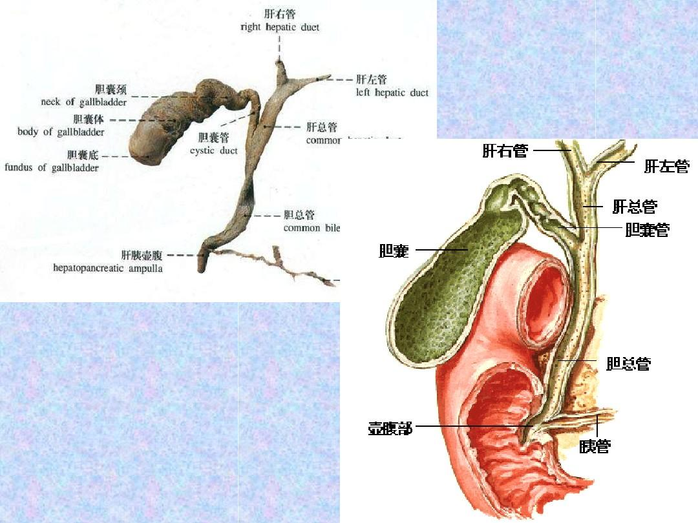
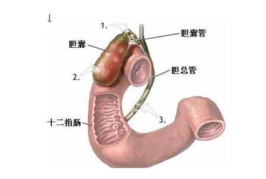
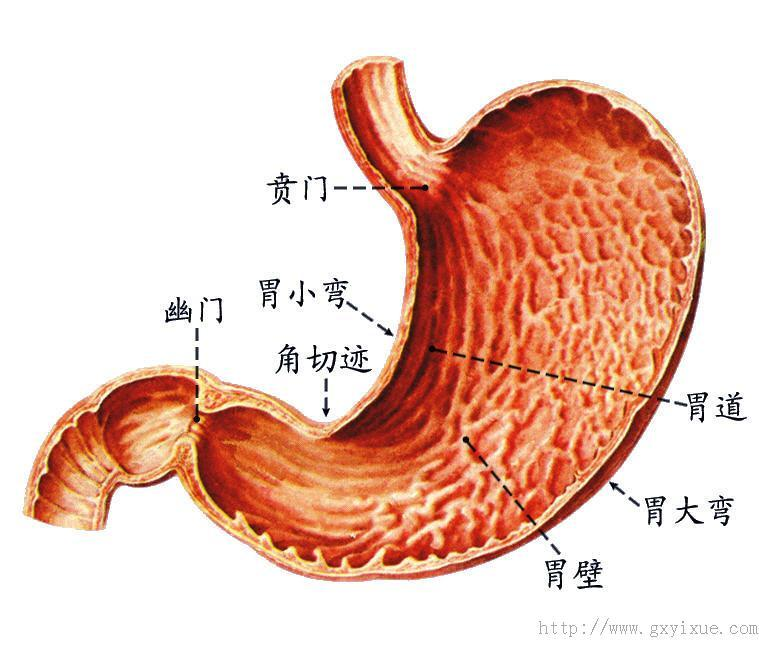
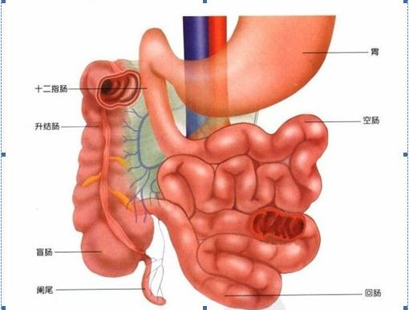
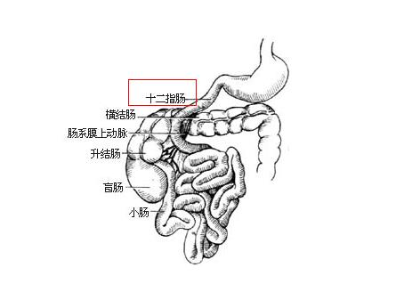
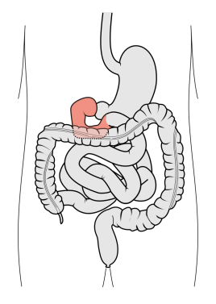
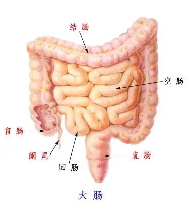
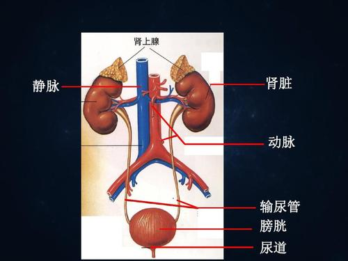
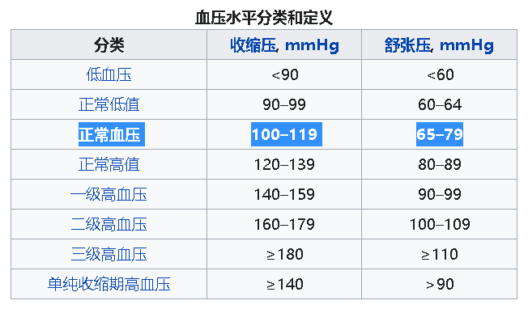

= 人体生物疾病常必知识1
:toc:

---

== ★ 腺体

*腺体: 指的是身体内分泌化学物质的任何器官。*

人体“腺体”, 可分为"外分泌腺"和"内分泌腺"：

[cols="1a,3a"]
|===
|Header 1 |Header 2

|外分泌腺
|- *释放分泌物至"导管"内*。 +
外分泌腺是一类有导管（单细胞腺无导管）的腺体，**其分泌物不进入血液，且由导管流出。**如肝脏产生胆汁，通过总胆管流到十二指肠。
- 例如：肝脏、胰脏、胃腺, 乳腺、泪腺

|内分泌腺
|
- *激素仅存在于体内的"内分泌腺"(endocrine glands). 内分泌腺分泌的分泌物称"激素"。*
- *无管腺，直接将产物分泌至周遭细胞外，而后进入血液循环至作用器官发生作用。*
- 包含: 下丘脑（hypothalamus）、脑下垂体(pituitary gland)、松果腺、甲状腺、副甲状腺、乳腺、肾上腺、胰脏的胰岛、卵巢、睾丸、胎盘

|===

在生物化学中，激素可分为三类：

[cols="1a,3a"]
|===
|Header 1 |Header 2

|类固醇（Steroid）
|- 是属于脂类的一类.
- 包括: 皮质醇和醛固酮、动情素和孕酮、睾固酮。

|氨基酸类
|包括酪胺酸、色胺酸的衍生物。

- 碘化的酪胺酸衍生物 -> 甲状腺素, 三碘甲状线素
- 儿茶酚胺(酪胺酸的衍生物) -> 黑色素、肾上腺激素
- 色胺酸的衍生物 -> 褪黑激素（松果腺素）

|蛋白质或肽类激素
|其余大多数的激素均属于此类。
|===

---

== 外分泌腺

==== 肝脏 (外分泌腺) -> 1.解毒, 2.将"葡萄糖"转化为"糖原"

肝脏是腺体，它在婴儿体内大得不成比例，这就是为什么宝宝的腹部呈可爱的圆溜溜形状。

[cols="1a,3a"]
|===
|Header 1 |Header 2

|功能
|- 合成氨基酸
- 糖代谢; 蛋白质代谢; 脂质代谢. +
储存和吸收维生素，将脂肪和蛋白质转化为碳水化合物，并管理葡萄糖. ——这一过程对身体无比关键，*葡萄糖只要稀释几分钟，就会导致器官衰竭*，甚至脑损伤。 +
特别是，**肝脏将"葡萄糖"转化为"糖原"，**这是一种更紧凑的化学物质，有点像压缩食品。*等到需要能量时，肝脏又将糖原转化为葡萄糖，并将其释放到血液中。*

- 早期在孕的胎儿，肝脏是主要红血细胞的生产者，一直到42周左右才由骨髓生产红血细胞。
- 肝脏会分泌食物消化需要的胆汁，有些胆汁直接分泌到十二指肠，有些则储存在胆囊。
- 肝脏中和毒素(排毒)，大部分药品以及血红蛋白。 +
由于肝脏是动物体内主要化解外来毒素的器官，肝脏在转化毒素过程中可能会渐渐积累毒素。人类食用这些有问题动物(尤其是过度使用动物抗生素、生长激素等化学饲料的动物)的肝脏，会引致中毒.
- 等等

肝脏总共参与了大约500种代谢过程。基本上，它就是身体的实验室。肝脏是身体里最繁忙的器官，它的功能十分重要，一旦它停机，你几小时之内就会死。

|有再生能力
|肝脏是人类身体器官中唯一有再生功能器官. 肝脏有再生能力, 你可以切除2/3的肝脏，短短几个星期，它就会恢复到原来的大小。
 +
然而，肝脏的恢复力并非没个限度。它会受100多种疾病的影响，其中许多都很严重。

|肝脏疾病
|- 非酒精性脂肪性肝病(NAFLD) : 它跟超重或肥胖强烈相关.
- 肝硬化 +
-> 女性代谢酒精的方式不同，意味着她们更容易喝醉，而且比男性更容易得"肝硬化"等酒精相关的疾病。
|===

---

==== ---- 胆囊 → 储存来自肝脏的胆汁

胆囊(gall bladder，或者gallbladder 和gall-bladder，它的拼写没有统一规范)。

[cols="1a,3a"]
|===
|Header 1 |Header 2

|胆囊的作用
|人类的胆囊储存来自肝脏的胆汁，并将其传递到肠道. +
相关的化学反应可能由于种种原因出错，导致"胆结石"。

|胆汁之旅
|- 肝细胞中进行的化学作用, 会制造出大量的副产品，其中一种就是"胆汁". *肝会不断分泌胆汁 -> 流进胆囊中储存. -> 当小肠进行消化作用时，胆囊便会释放胆汁。 -> 经"胆囊管"和"胆总管", 在"肝胰壶腹"处,与胰液混合，-> 并排到十二指肠。*

image:../img_readBook/img_人体生物疾病必知常识/img_人体生物疾病 09.gif[]

|胆汁的作用
|*胆汁的主要作用是乳化脂质（其中不含酵素）。胆汁能溶解脂肪及酒精*。
|===

---

==== 胰脏 (外分泌腺) -> 生成"胰岛素"

胰脏是人体内唯一的一个既是外分泌腺,又是内分泌腺的腺体.  +
胰脏(也称胰腺,Pancreas) 由两部分组成:

[options="autowidth"]
|===
|Header 1 |Header 2

|胰腺
|是外分泌腺，产生胰液

|胰岛
|*胰岛是内分泌腺，产生"胰岛素"(是一种激素)。*
|===

胰的内分泌部分叫做胰岛（朗罕氏小岛），是不规则的细胞群，散布在外分泌部的腺泡之间。胰岛分泌"胰岛素"、"胰高血糖素", 对维持血糖水平有十分重要的作用。

胰岛细胞有A细胞、B细胞、D细胞、PP细胞多种类型。

胰脏功能:

[cols="1a,3a"]
|===
|Header 1 |Header 2

|生成胰岛素(是一种小蛋白质, 是一种激素) : +
*葡萄糖 => 糖原*
|- 糖类——碳水化合物，是人体最重要的供能物质，主要以葡萄糖的形式被吸收。 *血中的葡萄糖,称为"血糖"（Glu）。* 胰岛是体内调节血糖浓度的主要器官.

=> *当血液中葡萄糖的浓度升高时，比如饭后*，-> *胰岛的β-细胞, 就释放"胰岛素"到血液中。-> 胰岛素使得大多数的细胞*（通常的估计是全身2/3的细胞，包括肌细胞和脂肪组织）*从血液中吸收"葡萄糖"作为能量, 或促进肝脏细胞和肌肉细胞, 将"葡萄糖"转化为"糖原(即肝糖)".* 糖原贮藏于肝细胞及肌细胞浆中.

=> 血糖浓度降低, -> 则会导致胰岛β细胞减少释放胰岛素，-> 也会降低"葡萄糖"向"肝糖"的转化。 +
*葡萄糖供应不足时，"糖原"可以迅速分解为"葡萄糖"，以供机体利用。* +
*体内"糖原"存量不足,会引发血糖降低*，这是造成疲劳、运动表现降低、无法持续运动的原因之一。运动后体内的糖原存量会显著降低。

- "胰岛素"和"升糖素"互相反馈，控制血糖稳定在一个小的范围内。如果因为任何原因导致胰岛素绝对或相对不足，就会导致糖尿病。

- 胰岛素每个分子只能持续5~15分钟，因此，人体对它有着不间断的补给需求。

- *胰岛素不能口服，因为口服的话，它将先在肠道里分解，无法得到吸收和利用。因此必须采用注射的方式.* +
但是, 注射也有自己的不足. *在健康的人体里，胰岛素水平受监控，且逐秒调整。而在糖尿病患者中，只有在患者自我治疗的时候，胰岛素才定期调整。这就意味着胰岛素水平在大多数时候都会不怎么对头，这有可能产生累积的负面效应。*

|分泌激素"胰高血糖素(升糖素)" : +
*非糖物质 => 葡萄糖/糖原*
|*可以促进肝糖原分解，使血糖升高。* +
分泌激素"胰高血糖素"，参与调节血糖、消化酶胰蛋白酶、脂肪酶和淀粉酶，后三者有助于消化胆固醇和脂肪。

- *胰高血糖素（glucagon,升糖素）*: 亦称"胰增血糖素"或"抗胰岛素", 或"胰岛素B"。它是由胰脏的"胰岛α细胞"分泌的一种激素。 *与"胰岛素"相对抗，起着增加血糖的作用。* +
"胰高血糖素"具有很强的促进糖原分解和"糖异生"作用，使血糖明显升高.

- **"糖异生": 就是生物体将多种非糖物质,转变成"葡萄糖"或"糖原"的过程。** +
在哺乳动物中，*肝是"糖异生"的主要器官*，正常情况下，*肾的"糖异生"能力只有肝的1/10*，长期饥饿时,"肾糖异"生能力则可大为增强。

|分泌胰液
|胰液是胰腺分泌的液体,其含有多种酶. 经导管进入十二指肠的**胰液, 可消化糖、脂肪和蛋白质，是机体重要的消化液.**

|===

---

==== ---- 糖尿病

它的特征是: 患者的血糖长期高于标准值.

1889年，德国科学家 Joseph von Mering等, 发现摘除了"胰腺"的狗, 出现了糖尿病所有的症状, 并在不久后死亡。 +
*患有糖尿病的病人, 是因为缺少一种胰腺制造的物质 -- 胰岛素.*

糖尿病(diabetes, DM)分为两种:

[cols="1a,3a,3a"]
|===
| |1型糖尿病 |2型糖尿病(占糖尿病患者中的90%左右)

|状态
|*身体无法生产足够的胰岛素, 或根本无法生产胰岛素.* +
1型糖尿病患者身体, 因为胰脏里的胰岛细胞已经损坏，所以完全丧失了生产胰岛素的功能。

|始于**胰岛素抵抗作用异常（细胞对于胰岛素的反应不正常、不灵敏）, 或细胞对胰岛素没有反应，而本身胰脏并没有任何病理问题。**

胰岛素所作用的目标细胞, 对胰岛素没有做出正常的响应 -- 这叫作"胰岛素抗性"。

随着病情进展, 胰岛素的分泌,亦可能渐渐变得不足.

|原因
|多为遗传. 与人的HLA(人类白细胞抗原)基因缺陷有关.
|根据一些研究，肥胖为胰岛素阻抗的主因之一. 研究显示，饮食和生活型态改变，可减轻体重，并降低罹患第二型糖尿病的风险.

|===

后果:

[cols="1a,3a"]
|===
|Header 1 |Header 2

|心血管疾病
|过高的血糖水平, 会持续影响患者的心血管健康。多项研究指出，糖尿病患者患上心血管疾病的风险, 较一般人高出二至四倍.

|眼底病变
|长期的高血糖环境, 会损伤视网膜血管的内皮，引起一系列的眼底病变.

|肾病
|糖尿病患者患上肾病的机会, 比非糖尿病人士高出许多，当中约一半二型糖尿病患者受到影响。 +
在晚期时，肾病更可能会导致肾衰竭，患者必须接受透析治疗或肾脏移植。

|神经系统病变
|因长期代谢失调血管系统功能影响，引起神经系统病变。常见：下肢、手臂、手指出现剧烈疼痛刺痛、烧灼、麻木感.
|===

---

== 内分泌系统

*“内分泌”一词，是指激素的分泌.*  +
*激素是一种化学传导物质，自"腺体"分泌出来后，借由体液或进入血液, 经由循环系统, 运送到标的器官, 来产生作用。*

内分泌系统 = 无导管腺体（内分泌腺） + 分泌激素（又称 荷尔蒙）

内分泌系统（Endocrine）: 是负责调控动物体内各种生理功能正常运作的两大控制系统之一. 另一个控制系统是"神经系统"。

内分泌系统, 包括了以下的腺体、组织或细胞:

---

==== 下丘脑(Hypothalamus)(内分泌系统)

---

==== 脑垂腺(脑下垂体) (内分泌系统)

会分泌多种激素。

垂体腺通常被称为主腺，因为大部分激素都受它控制。 +
它生成(或调解生成)生长激素、皮质醇、雌激素和睾酮、催产素、肾上腺素，等等。

当你剧烈运动时，垂体腺会将"内啡肽"喷入你的血液。内啡肽就是你进食或发生性行为时所释放的化学物质。它们跟阿片类药物密切相关。"跑步者高潮"的说法也正是由此而来。

---

==== 睾丸 (内分泌腺)

男性的睾丸或女性的卵巢, 会分泌"睾酮"(睾丸素) Testosterone. 是一种"类固醇"荷尔蒙.

睾酮对健康有重要影响，包括性欲、力量、免疫功能、对抗骨质疏松症等功效。

从40多岁开始，男性的睾酮水平每年下降约1％.

随着年纪渐长，睾酮的分量下降，对人体来说, 以下这些影响亦随之而减少:

[cols="1a,3a"]
|===
|Header 1 |Header 2

|维持肌肉强度及品量
|Column 2, row 1

|维持骨质密度及强度
|Column 2, row 2

|提神及提升体能
|刻意补充对体能不会有显著的增加

|维持性欲及勃起次数
|- 滥用补充剂可能会导致疼痛性阴茎异常勃起、和性欲亢进
- 成年男子不论服用或施打多少睾酮, 都无法再次促使阴茎的成长与发育. 相反的，错误的使用激素，将可能造成体内原生激素紊乱，将无法自行生成. 反而会使睾丸及阴茎萎缩，衍生出其他生殖系统疾病.
- 过度超量或是长期的使用睾酮，会导致睾丸及男性生殖器萎缩，且导致永久性的阳痿。 +
如果为女性，则会出现乳房萎缩、刺激毛发过度生长、阴蒂肥大貌似小阴茎, 和长胡子等种种男性化现象。
|===

*大量的证据表明, 服用补剂它可能会提高心脏病发作或中风的风险。*

---

== + 激素的总结

[cols="1a,3a"]
|===
|Header 1 |Header 2

|大多数激素有着多种功能
|*大多数激素有着多种功能，人们很难解构其化学成分.* +
任何一种激素所负责的监管工作，其范围都可能广得让人眼花缭乱:

- "催产素"以其产生依恋和亲情的作用而闻名。为雌性大鼠注射催产素，会让它们去为不是自己后代的幼鼠筑巢，给予过分的关心和体贴。然而，在给人类施用催产素的临床测试中，它几乎没有效果。在某些情况下，它反而让测试对象变得更好斗，更不乐意合作。

*一句话，激素是复杂的分子，其中一些(如催产素)既是激素,也是神经递质(神经递质是神经系统里的信号分子)。简而言之，它们做很多事，而且每一件都不简单。*

|*对激素修修补补也有很大的风险。*
|例如，胃饥饿素不仅事关饥饿，也参与控制胰岛素水平和释放生长激素。*篡改其中一项功能，有可能连带也破坏其他功能。*
|===

---

== ---------- ----------

---

== 神经系统

*神经信号以每秒120米的速度传播.*

[cols="1a,3a"]
|===
|Header 1 |Header 2

|中枢神经系统(大脑和脊髓)
|不能再生. 所以脊髓损伤会导致瘫痪.

|周边神经系统
|周边神经系统里的神经, 要是受到损坏，可以愈合并再生.
|===

---

== ---------- ----------

---

== 消化系统

消化系统(digestive system)的组成:

[cols="1a,3a"]
|===
|Header 1 |Header 2

|消化道
|- 口腔、咽、食管
- 胃
- 小肠（十二指肠、空肠、回肠）
- 大肠（盲肠、阑尾、结肠、直肠、肛门）

|消化腺
|- 三对唾液腺（腮腺、下颌下腺、舌下腺）
- 肝脏
- 胰脏
|===

---

==== 胃

[cols="1a,3a"]
|===
|Header 1 |Header 2

|位置
|胃部比腹部高得多，而且明显偏左。它大约有25厘米长。 +
上接食道，下接十二指肠。

|功能
|胃的主要消化介质是盐酸。胃的任务之一是杀死许多微生物，用盐酸浸泡它们。
|===

---

==== 小肠（十二指肠、空肠、回肠）

小肠分为十二指肠、空肠和回肠三部分。全长约4-6米. 小肠上连胃幽门，下接盲肠.

---

==== ---- 十二指肠

十二指肠 Duodenum 是多数高等脊椎动物的小肠的始段。十二指肠是小肠最短的部分，之后是空肠和回肠。 +
十二指肠整体上呈“C”形. 人类的十二指肠长达25－38厘米.

因为十二指肠既接受胃液,又接受胰液和胆汁,所以十二指肠的消化功能十分重要。

---

==== 大肠（盲肠、阑尾、结肠、直肠、肛门）

大肠包括盲肠、结肠、直肠以及肛管.

大肠的作用是: 从肠道内剩余的可消化物质中, 吸取水分与电解质; 将剩余的无用部分形成粪便, 并作暂时储存, 以及最终排出粪便。

大肠的功能:

[options="autowidth"]
|===
|Header 1 |Header 2

|水分的重吸收
|主要在结肠中进行

|从消化物中吸收电解质进入血液
|

|存储粪便直至可以排除
|主要在直肠进行

|===

在大肠内部一共有700种以上对的细菌生活, 并有着不同的功能.

[cols="1a,3a"]
|===
|大肠中的细菌 |Header 2

|类杆菌属细菌
|大肠内最常见的细菌类型是类杆菌属细菌，这类细菌也是导致大肠炎和结肠癌的原因之一。

**几乎所有发生在肠道的癌症，都发现在大肠中，极少见于小肠。**虽然没有人知道确切的原因，但许多研究人员认为，这是因为前者含有大量的细菌。也有研究者认为, 这跟饮食有关。

|双歧杆菌属细菌
|通常他们也被认为是“友善的细菌”.

|大肠杆菌
|Escherichia coli. 是肠杆菌科埃希氏菌属的一个物种. 主要寄生于大肠内而得名，约占肠道菌中的0.1%。

大部分的大肠杆菌不会致病，但在以下三种情况下也会导致疾病：

-  当细菌离开肠道进入泌尿道, 可以导致感染.
- 当细菌由于如溃疡等导致的穿孔进入腹腔，通常会导致致命性的腹膜炎感染。
- **大肠杆菌的某些株具有毒性, 可以导致食物中毒. 这通常是因为使用了被污染的肉类.**

在水净化和污水处理领域，因大肠杆菌在粪便中数量极多，故常用为检查水源是否被粪便污染的标志.

|===

一些肠道细菌的代谢产物包括气体（俗称“肠胃胀气”或者“屁”）.

屁的气味主要是由"硫化氢"构成的，尽管硫化氢只占排出气体的百万分之一到百万分之三。 +
*硫化氢是急性剧毒物质，具有臭鸡蛋味*，吸入少量高浓度硫化氢可于短时间内致命。低浓度的硫化氢对眼、呼吸系统及中枢神经都有影响。

*硫化氢是剧毒, 及易燃,易爆气体。它比空气重，容易积聚在通风不良的空间底部。起初很刺鼻（闻起来像臭鸡蛋），它会迅速麻痹嗅觉，因此受害者意识到它的存在时就为时已晚。*

"硫化氢"通常由有机物在无氧气的原核生物分解的情况下产生，例如在沼泽和下水道中. +
*有机物腐败场所如沼泽地、阴沟、化粪池、污物沉淀池等处均可有大量"硫化氢"逸出，使人中毒并不罕见。* +
国内"硫化氢"中毒, 占职业性急性中毒的第２位，仅次于一氧化碳中毒。

---

== ---------- ----------

---

== 泌尿系统

泌尿系统由肾脏、输尿管、膀胱及尿道组成。

---

==== 肾脏

右肾总是较低，因为它上面压着肝脏。 +
左肾比右肾大。

肾脏的功能:

[cols="1a,3a"]
|===
|Header 1 |Header 2

|过滤废物
|过滤废物是肾脏的主要功能. 肾脏每天处理大约180升水, 外加1.5公斤的盐。

- 近曲小管 : 几乎回收了全部的葡萄糖、氨基酸、维生素、多肽类物质和少量蛋白质. +
而肌酐、尿素、尿酸及其他代谢产物，经过选择，或部分吸收，或完全排出。
- 肾小管 : 可分泌排出药物及毒物，如酚红、对氨马尿酸、青霉素类、头孢霉素类等.
- 肾小球: 药物若与蛋白质结合，则可通过肾小球滤过而排出。

|过滤血液中的杂质.
|通过肾脏的血流占有总血量的四分之一。

|维持体液和电解质的平衡
|肾脏维持着关键的体内盐与水平衡:

- 如果你吃了太多的盐，肾脏会过滤掉血液中的多余部分，并将其送到膀胱，好让你通过撒尿把盐分排出。
- 如果摄人盐太少，肾脏会在排尿之前，把盐分抽取回来再次使用。

问题是，如果你要求肾脏过长时间进行过滤，它们会感到疲倦，无法正常运转。*随着肾脏效率降低，血液中的钠含量变高，你的血压也会危险地升高。*

|调节酸碱平衡
|正常人动脉血PH为7.35~7.45。生命活动中，随着机体细胞的代谢,会不断产生酸性或碱性物质，而机体PH始终保持稳定，这主要依靠体内各种缓冲系统和肺、肾的调节来实现。

- 肾脏通过排出酸性物质、回吸收碱性物质的方式, 来调节人体体内的酸碱平衡.
- 还可通过控制酸性和碱性物质排出量的比例, 来维持酸碱平衡。

|内分泌
|具备内分泌的功能, 以调节血压。肾脏能够分泌不少激素, 并销毁许多多肽类激素。
|===

经"肾脏"过滤之后的含有代谢产物的体液, 流入膀胱，形成尿液.

---

==== ---- 肾衰竭

糖尿病是导致肾衰竭的最常见原因. 肥胖和高血压是重要的促成因素。

---

==== ---- 肾脏移植

目前，美国肾脏移植的平均等待时间为3.6年.

遇到的问题:

[cols="1a,3a"]
|===
|Header 1 |Header 2

|器官移植的问题:
|- 免疫抑制药物并不理想，它们不光会影响移植部位，还将影响整个免疫系统. 因此病人日后, 始终会更容易受到感染和癌症的侵袭.
- 这类药物也可能存在毒副作用。

|若使用动物器官移植的问题:
|- 来自另一动物物种的器官，会引发人体疯狂的免疫反应.
- 猪身上存在一种内源性逆转录病毒(简称PERV)，一旦引入必然会传染人类。
|===

---

==== 膀胱

膀胱不产生激素(至少尚未发现)或在体内化学中发挥作用.

膀胱很像气球，因为它的设计目的就是随着填充膨胀起来。随着年龄的增加，膀胱会失去弹性，无法一如既往地膨胀，这是老年人随时随地都在找厕所的部分原因。

膀胱那里没有永久性的细菌群落。但偶尔，某些细菌可能潜人并使得我们尿路感染.

膀胱、胆囊和肾脏, 有一个共同的不幸特征，那就是容易形成结石。结石是钙和盐变成的硬球。

---

== ---------- ----------

---

== 循环系统

包括心血管系统和淋巴系统。

[cols="1a,3a"]
|===
|Header 1 |Header 2

|心血管系统
|- 心血管系统内, 循环流动的是血液。

|淋巴系统
|- **淋巴系统内, 流动的是淋巴液。**
- *淋巴液沿着一系列的淋巴管道向心流动，最终汇入静脉*. 因此淋巴系统也可认为是静脉系统的辅助部分。
|===

---

==== 血液

据估计，一滴血可能含有4000种不同类型的分子。这就是为什么医生这么喜欢验血 ——你的血液里充满了信息。

用离心机旋转血液试管，血将分为四层：红细胞、白细胞、血小板和血浆。

==== 红细胞 -> 输送氧气

红细胞（Red blood cells，简称RBCs，或称erythrocytes），又称为红血球或血红细胞.

[cols="1a,3a"]
|===
|红细胞 |Header 2

|来源
|- 对人体而言，产后**造血能力, 主要由骨髓支撑.** 骨髓里面有丰富的血管和神经组织。 +
人体在稳定状况下，每小时约有10^10 个**红细胞与**10^8 - 10^9个**白细胞生成**，以维持外周血循环中血细胞的组成与数量。产生的血细胞通过骨髓中的血窦, 进入血液循环。

- 人体的骨髓可分为红骨髓（拉丁语：medulla ossium rubra）、黄骨髓（拉丁语：medulla ossium flava）两种: +
-> 5岁以前，人体内的骨髓都是红骨髓。*婴幼儿的骨髓腔内的骨髓是红色的（即"红骨髓"），有造血功能. 但随着年龄的增长，逐渐失去造血功能.* 例如肋骨这些扁骨内的骨髓, *最后都会因为脂肪及纤维结缔组织等结缔组织堆积, 而形成"黄骨髓"并且失去造血功能。* +
但长骨两端和扁骨的骨松质内，终生保持着具有造血功能的"红骨髓"。 +
-> *5岁以后，人骨髓中开始出现脂肪组织，至成年后大部分骨髓均转化为黄骨髓。* +
在慢性缺氧等条件下，成人体内的黄骨髓可转化回红骨髓。

- 因此, 骨髓移植, 能用于治疗"白血病"等疾病。

|功能
|红细胞只为了完成一项任务：输送氧气。

|结构
|由于它们没有任何常见的细胞机制(如细胞核和线粒体)，所以并不是真正的细胞，*仅仅是血红蛋白(Hemoglobin)的容器。* +
为了让自己达到最大效率，红细胞几乎抛弃了传统细胞的所有成分——DNA、RNA、线粒体、高尔基体、各种酶。完整的红细胞几乎完全是"血红蛋白"。

|血红蛋白(Hemoglobin,缩写为HGB 或 Hb)
|- *血红蛋白: 是"红细胞"内运输氧的特殊蛋白质.* +
*血红蛋白是一种含有"血红素"的蛋白质分子*，它可以在肺部或鳃部, 与氧气分子结合，然后在身体的组织中将结合的氧气分子释放。

- **血红蛋白有一种危险的癖好：它对一氧化碳的喜欢程度，远远高于氧气。如果存在一氧化碳，血红蛋白就会把它装走，而把氧气留在站台上。**这就是一氧化碳让人窒息而死的原因. +
*血红蛋白与一氧化碳的结合活性, 要远高于氧气*，因此当空气中存在一定量的一氧化碳时，血红蛋白就会被夺走携氧能力，导致一氧化碳中毒，严重时可致死。

|高原反应 -> 会令红细胞增加, 使血液变稠
|- 约有40%的人到了海拔4000米以上的地方会出现高原反应，而且，这跟健康与否毫无关系.
- 在海平面，红细胞大约占据了40%的血液体积，但随着对更高海拔的适应，这一比例还可以再增加一半左右，但这是要付出代价的。**红细胞的增加使血液变稠，流动迟缓，为心脏的泵动施加了额外的压力，**哪怕是一辈子都生活在高海拔地区的人都会受到影响。 +
像玻利维亚首都拉巴斯(海拔3500米)这种高海拔城市的居民，有时会患上一种叫作"蒙格病"的疾病。这种病让人嘴唇发紫，手指粗得像棒槌，因为他们浓稠的血液流动不畅. 转移到较低海拔后，问题就消失了。

|能量来源
|红细胞用"葡萄糖"来满足自身的能量需求。

|生命周期
|- 每个红细胞存活大约四个月。每一个红细胞都将在你身体里穿梭大约15万次，完成100英里左右的旅行，直至精疲力竭，无法维持。衰老的红细胞会被脾脏、肝脏等处的巨噬细胞, 吞噬并破坏. 组成血红蛋白的血红素, 则最终被分解为"胆红素"。
- 你每天会丢弃大约1000亿个红细胞。你的粪便是褐色，主要原因就在它们身上(尿液的金色光泽，以及淤血退去时的黄红痕迹，是同一过程的副产物胆红素所致)。

|===

---

==== 人造血的问题是什么? -> 会掉落氧分子, 把铁(毒素)释放到血液里

红细胞就像磁铁一样, 它能锁住肺部的氧分子，将其传送到目的地细胞。为了做到这一点，它必须知道在哪里摄取氧气、什么时候释放氧气，同时不能让氧气在中途掉落。 +
这也始终是人造血液的问题。**哪怕是制造得最好的人造血液也会偶尔掉落氧分子，把铁释放到血液里。铁是一种毒素。由于循环系统极度繁忙，哪怕是无限小的事故率，也会迅速达到毒性水平.** 因此，输送系统必须非常完美。从本质上说，人体自带的输送系统的确很完美。

20世纪90年代，一些血液制品进入试验阶段，但参加试验的患者里, 心脏病发作和中风的数量惊人。2006年，由于结果太过糟糕，美国食品和药物管理局暂时停止了所有试验。

---

==== 血型 → 即"红细胞"膜上的特"异性抗原"的类型

所有的血细胞, 都有着相同的内部结构，但**外部覆盖着不同种类的"抗原"(即从细胞表面往外突出的蛋白质)，**它们就是存在血型的关键。所以, *血型是指血液成分（包括红细胞、白细胞、血小板）表面的"抗原"类型。*

但一般上, 血型通常是特指"红细胞"的分型，其依据是红细胞表面是否存在某些可遗传的"抗原"物质。

抗原物质可以是: 蛋白质、糖类、糖蛋白或者糖脂。这些抗原就组成一个血型系统。抗**原总共有400多种，但只有少数对输血有着重要影响**，出于这个原因，我们就只听过A型、B型、AB型和O型. 而其它的型号很少听见.

人类血型系统中，最为重要的是“ABO血型系统”和“Rh血型系统”。例如，一位血液是AB型同时是Rh阳性的人，其血型可以简写为AB+。

根据红细胞膜上, 是否存在抗原A与抗原B, 我们就能将血液分成4种血型:

[cols="1a,3a"]
|===
|红细胞膜上的抗原类型 |血型

|红细胞上仅有抗原A
|-> A型

|只有抗原B
|-> B型

|同时存在A和B抗原
|-> AB型

|这两种抗原俱无
|-> O型

- 血液里自带某种抗原，我们可以从中获得对特定疾病的抵抗力——尽管这常常也是有代价的。例如，O型血的人对疟疾的抵抗力更强，但对霍乱的抵抗力较弱。

|人的红细胞上具有与恒河猴同样的抗原
|-> Rh型.

- 血液中另一主要特点是恒河猴因子（Rh血型系统）, 也被读作Rh抗原、Rh因子，*因与恒河猴红细胞上的抗原相同得名.*

- Rh血型系统是红细胞血型中最复杂的一种，*已发现40余种Rh抗原，其中D抗原抗原性最强，因此通常将红细胞上含有D抗原的, 称为Rh阳性; 而红细胞上缺乏D抗原的,称为Rh阴性。*

- *每个人的红细胞上只可能"有"或"没有"Rh因子*. 通常会与ABO结合起来，写的时候放在ABO血型后面，此时常常省略Rh，只保留+或-号，比如A+，B-等等。当中O+型（即O型血，Rh阳性）最常见。 +
-> Rh+，称作“Rh阳性”或“Rh显性” : 表示人类红细胞“有Rh因子”. +
-> Rh-，称作“Rh阴性”或“Rh隐性” : 表示人类红细胞“没有Rh因子”.

- ABO血型中配合Rh因子, 是非常重要的:  +
-> **错配（Rh+的血捐给Rh-的人）会导致溶血。** +
-> 不过Rh+的人接受Rh-的血, 是没有问题的。
|===

不同血型人的血清中, 含有不同的抗体，但不含有对抗自身"红细胞抗原"的抗体。如：在A型血血清中只含有抗B抗体。

输血匹配

[options="autowidth"]
|===
|血型 |可以献血给

|A
|-> A, AB

|B
|-> B, AB

|AB
|-> AB

|O
|-> O, A, B, AB
|===

image:../img_readBook/img_人体生物疾病必知常识/img_人体生物疾病 07.jpg[200,200]

---

==== 血小板 -> 能凝血

[cols="1a,3a"]
|===
|Header 1 |Header 2

|功能
|- 血小板在凝血中具有核心作用. 一旦开始流血，数百万个血小板就聚集在伤口周围，通过数量相当的蛋白质的连接，这些蛋白质会沉积一种叫作"纤维蛋白"的物质。"纤维蛋白"跟"血小板"附聚，形成塞子。 +
为了避免错误，这一过程中内嵌了不少于12种自动防故障机制。

- 凝血在"主动脉"中不起作用，因为血液流动过于剧烈, 任何凝块都会被冲走. 这就是为什么止住大出血必须配合止血带的压力。

- 在严重的出血中，身体会尽其所能地把血液从肌肉和表面组织等二级前哨转移掉，使之流向重要器官。这就是为什么出血过多的患者，肤色会变得苍白，摸起来冰冷。

|寿命
|血小板只能存活一个星期左右。

|===

---

==== 血浆

血浆是90％以上的水，并伴有若干盐、脂肪和其他化学物质。 +
抗体、凝血因子, 和其他组成部分, 可以被分离出来. 其浓缩形式可用于治疗自身免疫性疾病, 或血友病.

---

==== 血友病 -> 患者血浆中缺乏某种凝血因子

[cols="1a,3a"]
|===
|Header 1 |Header 2

|情况
|人体无法凝血形成血块来止血. 血友病患者的凝血因子比正常人要少，因此血管破裂后，血液不容易凝固，导致出血难止。

|后果
|- 体表的伤口所引起的出血通常并不严重，而内出血则严重得多。内出血一般发生在关节、组织和肌肉内部。会增加关节积血, 或脑出血的几率.
- 关节出血在血友病患者中是很常见的，最常出血的是膝关节、肘关节和踝关节。血液淤积到患者的关节腔后，会使关节活动受限，使其功能暂时丧失，例如膝关节出血后患者常常不能正常站立行走。
- 如果关节反复出血, 则可导致滑膜炎和关节炎，造成关节畸形，使关节的功能很难回复正常，因此很多血友病患者有不同程度的残疾。
|===

---

==== 心脏

已有名字的心脏疾病比其他任何器官的疾病都要多，而且还全都是坏消息。

==== ---- 心力衰竭 <- 心脏的收缩/舒张功能发生障碍

[cols="1a,3a"]
|===
|Header 1 |Header 2

|现象
|心力衰竭（heart failure）简称心衰，是指**由于心脏的收缩功能和（或）舒张功能发生障碍，-> 不能将静脉回心血量,充分排出心脏，-> 导致静脉系统血液淤积，动脉系统血液灌注不足**，-> 从而引起"心脏循环障碍症候群".

其中**绝大多数的心力衰竭,都是以左心衰竭开始的**，即首先表现为**肺循环淤血**。

|后果
|**此种障碍症候群, 集中表现为肺淤血、腔静脉淤血。**

|原因
|- 心肌梗死、心肌病、血流动力学负荷过重、炎症等任何原因引起的心肌损伤，-> 均可造成心肌结构和功能的变化，-> 最后导致心室泵血和（或）充盈功能低下。

- 心力衰竭并不是一个独立的疾病，而是心脏疾病发展的终末阶段。*几乎所有的心血管疾病, 最终都会导致"心力衰竭"的发生*.

|===

---

==== ---- 心动过缓 : 心率每分钟低于60次 <- 唯一的治疗手段是 : 心脏起搏器

[cols="1a,3a"]
|===
|Header 1 |Header 2

|现象
|心动过缓（bradycardia,心率过缓），是心律失常的一个重要类型。如果心率每分钟低于60次跳动, 就叫"心动过缓"。

|治疗手段
|- 心脏外科手术不能解决心脏不正常跳动的问题, 只能采用作"起搏器"(Pacemaker、Artificial pacemaker）的设备。*迄今为止，心脏起搏器是治疗"心动过缓"的唯一手段。*
- 心脏起搏器，能使用电击, 对心脏的肌肉做持续与规律的刺激，以维持心脏的持续跳动。
|===

---

==== 血压

血液绕你身体一周的旅程，大约要用50秒完成。

血压（blood pressure，BP）: 是指血液在血管内流动时, 作用于单位面积血管壁的侧压力，**它是推动血液在血管内流动的动力。**习惯以毫米汞柱（mmHg）为单位。

通常所说的血压, 就是指体循环的"动脉血压"。动脉血压是血液对动脉血管的压力.

血压读数中的两个数字——比如说120(收缩压)/80(舒张压)，只是简单测量了每次心跳时, 血管出现的最高和最低压力。

|===
|收缩压 |舒张压

|当心脏收缩时，左心室会将血液泵出到主动脉，主动脉压产生"血液高压"，称"收缩压"。
|接下来，心脏会舒张，血液流入右心房. 这个时候压力最低，称为"血液低压"或"舒张压"。
|===

平均血压 = (收缩压 + 2 x 舒张压)/3 = 1/3收缩压 + 2/3舒张压。

中国血压正常值

- 血压在白天最高，到了夜里逐渐下降，午夜时分是最低点。人们早就知道，夜深人静时心脏病发作更为常见.

- 血压会随着年龄增长而逐渐增加，因为动脉弹性变差，而其中收缩压的改变较明显.

- 血压长期维持高位 -- 高血压，将极大地提高心脏病发作或中风的风险。

---

==== 低钠血症

喝太多水其实有害无利。摄入太多的水，而肾脏无法足够快地排掉水分，最终便错误地稀释了血液中的钠含量，引发低钠血症。

低钠血症，简单解释就是“血液中的盐分不足”，也就是血液中钠的浓度低于135毫摩尔/升（正常为135-145毫摩尔/升）。血液中盐分减少，会使细胞们变得“更加吸水”，一个个膨胀成球，这对大脑来说是非常危险的。 +
大多数组织的细胞都有一定的伸缩空间，因为脂肪和肌肉是有弹性的。但神经细胞则不然，它们紧紧地聚集在坚硬的头颅中，和血液、脑脊液共用一个有限的空间，几乎没有延展余地。因此，如果这些神经细胞也“膨胀成球”的话，那么带来的将是毁灭性的后果——脑水肿，即脑细胞急速水肿，大脑膨胀，导致脑组织受损，突发昏迷、呼吸抑制、脑疝，甚至死亡。

低血钠症（英语：Hyponatremia）是人体血液中的钠含量过低时，所引起的临床病征. +
-> 轻度的低血钠症, 可能没有任何症状； +
-> 中度, 则可能伴随有无法思考、头痛、晕眩以及失去平衡； +
-> 更严重的重度低血钠症, 包括会使患者产生谵妄、癫痫还有中风。

在夏季，人们游玩或运动过后，汗流浃背，体内钠盐等电解质流失的概率很高，如果此时大量饮用淡水而未补足盐分，也会出现轻度低钠血症的症状. 所以要缓慢补水，或喝淡盐水.

== ---------- ----------

---

==  呼吸系统

==== 肺

外部世界和肺部周围空间(即所谓胸膜腔)的些许气压差。胸部的气压低于大气压，有助于保持肺部膨胀。如果空气通过刺穿的伤口进入胸腔，就会让气压差消失，肺会塌陷到正常大小的1/3左右。

---

==== 哮喘

哮喘（英语：asthma，又称气喘）是常见的气道慢性炎症疾病.

[cols="1a,3a"]
|===
|Header 1 |Header 2

|现象
|- 哮喘发作时，呼吸道变窄，患者很难吸入或呼出空气，呼气尤其困难。
- 哮喘与其他肺部疾病的不同之处在于，它通常只在部分时间出现。如果你测试哮喘患者的肺功能，大多数时候，大多数人的肺功能完全正常。只有他们发作的时候，肺功能的问题才会变得明显，能检测出来。就疾病而言，这极不寻常。哪怕没有症状，疾病也几乎总会在血液或痰液测试中表现得很明显。而哮喘，有时候直接消失了。

|病因
|- 对许多患者来说，冷空气、压力、运动，或者其他跟过敏原、空中悬浮物完全无关的因素, 都可引发哮喘。

|治疗手段
|- 对轻度哮喘患者来说，类固醇几乎总是能有效地控制病情，但对重度哮喘患者，类固醇很少起作用。
|===

---

==== 肺癌

经常吸烟的人(差不多每天一包)患癌症的概率是不吸烟者的50倍。

1964年，美国卫生局局长宣布吸烟与肺癌之间存在明确联系。值得注意的是，美国医学协会花了15年时间才为卫生局局长的发现背书。因为这期间，美国癌症协会的一位董事会成员是一位烟草巨头。

---

== ---------- ----------

== 大脑

虽然大脑严密地被保护性的颅⻣包裹着，但这竟然会使它因无法排出多余物质，而容易受到感染后发胀、出现额外液体的损害。其结果就是，大脑受到压迫，严重的话，有可能致命。

大脑中, 跟神经紊乱相关的奇特怪异综合征和病症，数量多到无穷无尽。

==== 癫痫

[cols="1a,3a"]
|===
|Header 1 |Header 2

|病情状况
|癫痫并不是单一疾病，而是一系列的症状，包括短暂的意识丧失和长时间的抽搐.

|病因
|它们全都是大脑中神经元错误启动导致的。

|历史
|癫痫的历史可以概括为4000年的无知、迷信和污名化；此后又是100年的知道、迷信和污名化。
|===

---

==== 慢性创伤性脑病(CTE)

慢性创伤性脑病变（英语：Chronic traumatic encephalopathy；简称：CTE）是一种神经退化性疾病，常发生于受到多次脑伤的患者。

[cols="1a,3a"]
|===
|Header 1 |Header 2

|Column 1, row 1
|Column 2, row 1

|病因
|- 慢性创伤性脑病变常发生于，频繁参与剧烈接触型运动（例如美式足球、拳击、啦啦队、竞技啦啦队等）的运动员。 +
根据一项估计，美国职业橄榄球大联盟有20%~45%的退役球员患有一定程度的慢性创伤性脑病，而且，这种病也常见于前英式橄榄球运动员(rugby),和在比赛时经常使用头部顶球的足球运动员身上。
- 这样的脑病变，也常发生在家庭暴力的受害者身上。
- 大多发生在频繁从事剧烈运动，受到频繁脑伤后八到十年陆续出现。
|===

---

==== 阿尔茨海默病

阿尔茨海默病(Alzheimer's disease，縮寫：AD) 占所有痴呆症病例的60%~70%.  +
阿尔茨海默病只是100多种通常很难区分的痴呆症中的一种。

[cols="1a,3a"]
|===
|Header 1 |Header 2

|病情
|患者会承受不可逆转的记忆稳步丧失。 +
在病情通常的发展过程中，阿尔茨海默病首先摧毁短期记忆，接着转移到所有或大部分其他记忆，导致混乱、脾气暴躁、抑制能力丧失，最终失去所有的身体功能，包括如何呼吸和吞咽。正如一位观察者所说，到最后，人会从肌肉层面上忘记如何呼气。

|病因
|- 阿尔茨海默病始于患者大脑中β-淀粉样蛋白斑块的累积。 +
没人确切知道淀粉样蛋白正常运转时对我们发挥着什么作用，但一般认为，它们可能在形成记忆方面扮演着一定的⻆色。通常，使用完之后，它们会被冲掉，不再需要。然而，在阿尔茨海默病患者中，它们并没有完全清除，而是聚集成簇，也即俗称的斑块，妨碍大脑正常运作。
- 到了疾病的后期，患者还会积累缠结的tau蛋白纤维，称为"tau缠结"。 +
tau蛋白与淀粉样蛋白的关系，以及二者与阿尔茨海默病的关系，至今仍不确定.

- 但即使没有淀粉样蛋白和tau蛋白的积聚，仍有可能患上痴呆症. 反过来说，淀粉样蛋白和tau蛋白积聚了也有可能不患痴呆症。 +
一项研究发现，大约30%的老年人有大量的β-淀粉样蛋白积累，但并未表现出认知能力下降的迹象。 +
斑块和缠结或许不是导致这种疾病的原因，而只是它的"特征"，也即疾病本身留下的碎屑。

- 由于缺乏共识，研究人员分为两大阵营：一个阵营主要指责β-淀粉样蛋白(被挖苦地叫作"β-淀派")，另一个阵营主要指责tau蛋白(俗称"tau派")。

- 研究人员发现了若干种与阿尔茨海默病相关的基因，但无一是直接导致生病的根源。单纯地变老，就足以极大地增加你对阿尔茨海默病的易感性，但这一点，对几乎所有糟糕的事情都成立。

|治疗手段
| - 有一件事我们知道，那就是斑块和缠结的积累非常缓慢，而且早在痴呆症的迹象变得明显之前就开始积聚。因此，很明显，治疗阿尔茨海默病的关键是，尽早赶在积累造成真正损害之前就把它们处理掉。

- 你接受的教育越多，患阿尔茨海默病的概率就越小，拥有不断探索的活跃大脑(与年轻时在课堂上长时间地被动学习相对)几乎肯定可以阻挡阿尔茨海默病的侵袭。
- 在饮食健康、保持适度运动、维持合理体重、完全不抽烟、不过量饮酒的人群里，各类的痴呆症都相当少见。 +
良性的生活并不能完全消除阿尔茨海默病的风险，但能将之减少约60%。

|药物研发
|*在临床试验中，针对阿尔茨海默病的药物失败率高达99.6%，属于整个药理学领域中失败率最高之一。* +
部分问题在于，阿尔茨海默病的试验只能在实验室老鼠身上进行，而老鼠并不会得阿尔茨海默病，它们必须经过特殊的培育在大脑内长出斑块，而这意味着，老鼠对药物的反应跟人类有所不同。

许多制药公司现在已经彻底放弃了这一领域的药物研制。2018年，辉瑞宣布退出阿尔茨海默病和帕金森病的研究.

|研究经费
|- 阿尔茨海默病是导致老年人死亡的第三常见病因，仅次于心脏病和癌症.  +
加到一起，65岁以上的人里会有1/3死于这样那样的痴呆症。
- 但令人困惑的是，各地的研究经费都严重不足。在英国，痴呆症每年让国民健康服务破费260亿英镑，但每年只获得9000万英镑的研究经. 相比之下，心脏病的研究经费是1.6亿英镑，癌症为5亿英镑。

|===

---

== 睡眠

我们保持清醒的时间越长，睡眠压力就越强烈。在很大程度上，这是大脑中化学物质(尤其是"腺苷")随着时间推移积累所带来的结果。"腺苷"是为细胞提供动力的能量密集小分子ATP(三磷酸腺苷)输出的副产物。你积累的腺苷越多，你越是觉得困。

=== 失眠 -> 与糖尿病、癌症、高血压、中风、心脏病，以及抑郁症相关

失眠跟糖尿病、癌症、高血压、中风、心脏病，以及抑郁症(不足为奇)有关。

- 《自然》杂志上刊登的一项丹麦研究发现，经常上夜班的女性患乳腺癌的风险比白天工作的女性高50%。
- 现在有充分的数据表明，缺乏睡眠的人比正常睡眠的人体内的β-淀粉样蛋白(一种与阿尔茨海默病有关的蛋白质)含量更高。 +
倒不是说睡眠不足会导致阿尔茨海默病，但它有可能是一个促成因素，甚至还会加快人体机能的衰退。

---

==  疼痛

一般来说，我们感觉不到自己大部分内脏器官的疼痛。任何由它们引起的疼痛都称为"牵涉性疼痛"，因为它"牵涉到了"身体的另一部位。

- 例如，冠状动脉心脏病的疼痛可能出现在手臂或颈部，有时在下巴。

大脑同样没有感觉. 这就提出了一个很自然的问题：头痛是从哪儿来的？答案是，头皮、面部和头部的其他外部部位，都有丰富的神经末梢，它们足以解释大部分的头痛了。即使它感觉像是来自大脑深处. 日常头痛几乎肯定是表面特征。

==== 止痛药

止痛药一直是"药理学的坟场"。制药公司在药物开发上已经投入了数十亿美元，**仍未能开发出一种既能有效控制疼痛又不会导致上瘾的药物。**

- 恶名远扬的阿片类药物泛滥危机，阿片类药物是一种止痛药，与海洛因发挥作用的方式大致相同，而且，它们都来自同一种成瘾物质：鸦片。
- 那里的医生试图靠着注射吗啡让他戒掉可卡因。最终，他对两种毒品都上了瘾。

我们如今进入了超现实的境地：制药公司开始生产药物来减轻阿片类药物滥用的副作用。制药公司先是帮助造就了数以百万计的瘾君子，现在竟然又靠着替瘾君子缓解毒瘾来赚钱。

---

== 感观

==== 视觉

[cols="1a,3a"]
|===
|Header 1 |Header 2

|神经传递信息的速度: 200毫秒
|每一次视觉输入，信息都要花一段微小但可感知的时间(*大约200毫秒，或者1/5秒*)，顺着视神经传输到大脑当中，再由大脑进行处理和阐释。

|眼睛的颜色
|如果你的眼睛是蓝色或绿色的，那不是因为你的虹膜有着比其他人更多的颜色，而是因为缺少了别的颜色。 +
其他色素的缺乏, 使得眼睛看起来呈蓝色或绿色。
|===

我们的眼睛包含了两类视觉感光器：

[cols="1a,3a"]
|===
|视觉感光器 |Header 2

|杆细胞
|它们帮助我们在昏暗条件下视物，但却不能在光线明亮时分辨颜色.

|锥细胞
|锥细胞，它在光线明亮时发挥作用，将世界分为三种颜色：蓝色、绿色和红色。 +
"色盲"通常缺少三种锥细胞中的一种. +
完全没有视锥细胞，也就是真正色盲的人叫作"全色盲"。他们的主要问题还不在于世界暗淡苍白，而是很难应对明亮光线，在日光下可以说完全失明。
|===

---

==== 听觉 -> 分贝: 音量大约每6分贝翻一倍

分贝是对数函数，也就是说，两个10分贝的声音总量不是20分贝，而是13分贝。*音量大约每6分贝翻一倍. 所以，96分贝的噪声不是只比90分贝的噪声大一点，而是大两倍。*

[options="autowidth"]
|===
|Header 1 |分贝数

|一个安静的地方(如图书馆或乡村)
|30

|打鼾
|60~80

|附近响起的雷声
|120

|噪声的疼痛阈值
|约为120分贝

|耳膜爆裂
|150分贝
|===

---

==== ---- 伐氏操作(Valsalva effect)

如果快速改变高度，就像飞机降落时那样, 你会感到不舒服。这叫作伐氏效应(Valsalva effect)，它的产生原因是因为你头部的气压无法跟上外面气压的变化。 +
*你可以把嘴巴和鼻子紧闭住, 同时往外吐气, 把耳朵顶起来，这叫作伐氏操作*(Valsalva manoeuvre)。 +
你不要吐气吐得太用力，这样做容易让耳膜破裂。

---

==== 嗅觉

嗅觉是一⻔孤儿科学. 每年有关视力和听力的论文，发表数量多达数万篇. 而有关嗅觉的论文，最多只有几百篇。 +
研究资金也一样，分配给听觉和视觉的资金至少是分配给嗅觉的10倍。由此而来的一个结果是: 有关嗅觉的许多东西，包括嗅觉具体怎样运作，我们仍然不知道。

在人的五种基本感知中，只有嗅觉不经下丘脑介导。每当我们闻到某种味道，信息会直接传递到嗅觉皮层，*嗅觉皮层又靠近塑造记忆的海⻢体。一些神经科学家认为，这可以解释为什么某些气味能强烈唤起记忆。*

---

==== 味觉

我们吃东西的时候，感受的是"滋味"(flavour)，也就是味道(taste) + 气味(smell)。

---

==== ---- 牙齿

唾液中, 含有有用的酶，即加速化学反应的蛋白质。

[cols="1a,3a"]
|===
|Header 1 |Header 2

|淀粉酶 & 唾液素
|食物还在我们嘴里的时候，它们就开始分解碳水化合物里的糖了。遗憾的是，**嘴里的细菌也喜欢甜味；它们吞噬了释放而出的糖分并排出酸，这些酸会钻透我们的牙⻮，蛀牙。**

|溶菌酶
|溶菌酶 : 能够溶解细菌的细胞壁, 具有抗菌消炎的作用.  +
溶菌酶是一种可在唾液、黏液和眼泪中找到的抗菌酶，是身体抵抗入侵病原体的第一道防线。 +
溶菌酶能攻击许多入侵的病原体，但遗憾的是, 它却并不攻击能导致蛀牙的病原体.
|===

我们睡觉时产生的唾液很少，这就是为什么微生物会大量滋生，所以睡前刷牙是个好主意.

---

== 表面定律 -> 随着物体体积的增大，其"相对表面积"减小。

表面定律 : 随着物体体积的增大，其"相对表面积"减小。

*热量是从表面流失的，故此，"表面积相对于体积"越大，你就越是难以保持温度。这意味着，小动物产生热量必然会比大动物更快。*

表面定律也规定了我们能长到多大体格。要是把一个人放大到《格列佛游记》巨人国里30米的巨人那么高，他的体重将达到280吨, 这将使他的体重变成正常人的4600倍，但他的⻣头又只有正常人的300倍粗，不足以支撑这样庞大的重量。 +
一句话，我们的体格之所以是现在这样，是因为我们只能保持这样的体格。
