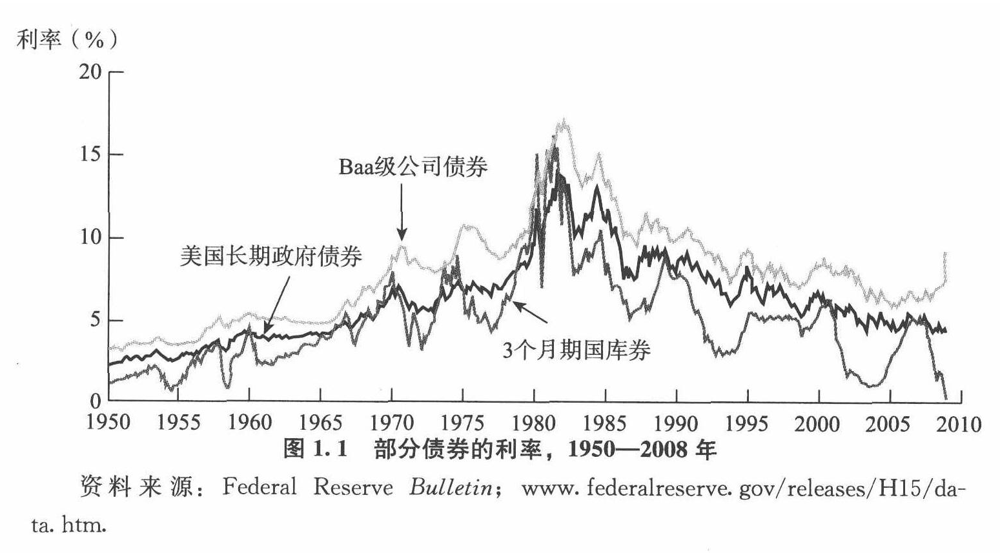
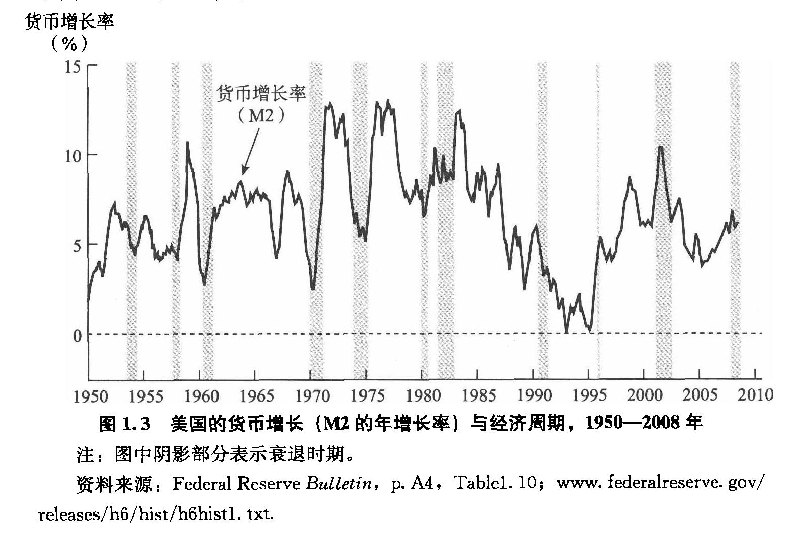
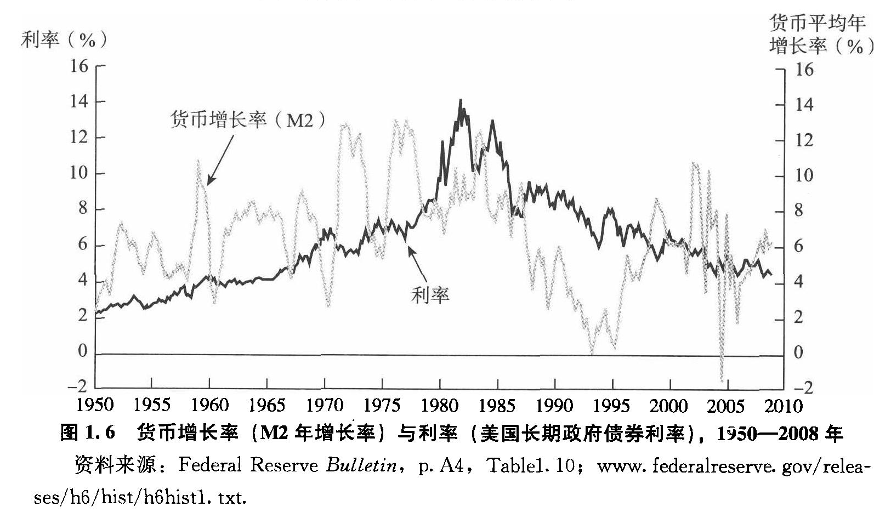
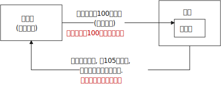

= 货币金融学 /米什金
:toc: left
:toclevels: 3
:sectnums:

'''

== 经济数据来源的网站

[options="autowidth"]
|===
|Header 1 |网站

|代表"长期利率"的最适当的指标, 是"10年期美国政府债券的利率"。
|https://www.federalreserve.gov/releases/h15/

|提供代表性利率、汇率等经济指标的历史数据，并发布最新的日、周、月、季度和年度数据。 +
提供美联储的一般信息、货币政策、银行体系、研究活动和经济数据。
|https://www.federalreserve.gov/data.htm

|提供不同时期各种股票指数的历史图表。
|https://stockcharts.com/freecharts/historical/

|提供了计算美元1913年以来购买力变动的计算器。
|https://www.bls.gov/data/inflation_calculator.htm

|===

== 总览

[options="autowidth" cols="1a,1a"]
|===
|Header 1 |Header 2

|证券 (security，又称金融工具):
|是对发行人未来收入与资产（ asset，金融索取权或隶属于所有权的财产权）的索取权。

|债券(bond):
|是债务证券，它承诺在一个特定的时间段中, 进行定期支付。 +
**由于债券市场可以帮助政府和企业, 筹集到所需要的资金，所以它是决定"利率"的场所.**

|利率 interest rate:
|利率不仅影响消费者支出与储蓄的意愿，还影响企业的投资决策，因此利率对经济有重要影响. +
高利率 →  励个人增加储蓄以赚取更多利息收入 → 因此就减少消费. +
高利率 →  提高融资成本 → 降低企业投资意愿, 对就业不利.

**由于不同利率的运动有统一的趋势，经济学家通常将各种利率糅合在一起，统称为“利率”。**

然而，如图1.1所示，*不同种类债券的利率差别很大.*

-  3个月期国库券利率的波动, 要大于其他利率，但总的来说，其平均水平最低;
- Baa级（中等质量)企业债券利率的平均水平, 要高于其他种类.

20世纪70年代它们之间的差距变大，90年代收窄，21世纪初短暂变大后再次收窄。2007年夏天之后则开始迅速扩大。

|股票:
|一家企业股票价格高, 意味着它可以筹集到更多的资金, 用于购置生产设施和设备。

|金融危机:
|所谓金融危机，是指金融市场出现混乱，并伴随着资产价格的暴跌, 以及众多金融机构和非金融企业的破产。

|"货币"与"经济周期"的关系:
|为什么美国经济会扩张与收缩? 很多实证分析表明，货币在经济周期(business cycles，即"经济总产出"的上升和下降运动）形成的过程中, 扮演了十分重要的角色。

|"货币"与"利率"的关系
|"货币"与其他很多因素一起，在"利率"波动过程中扮演着重要的角色。20世纪60—70年代，长期政府债券的利率, 随"货币增长率"的上升而上升。然而，1980年之后，"货币增长率"与"利率"之间的关系就不那么清晰了。

|货币政策:
|由于货币可以影响许多对于"社会福利水平"至关重要的变量，因此，世界上所有的政治家和政策制定者, 都十分关注**"货币政策"（monetary policy)的实施，即对"货币"和"利率"的管理。**

|财政政策:
|**财政政策（ fiscal policy）是有关"政府支出"和"税收"的决策。**

.预算赤字( budgetdeficit）:
是指在一个特定的时间段（通常是一年)中，**"政府支出"超过"税收收入"的差额.** +
政府必须通过借款, 来弥补"预算赤字". +
"预算赤字"可能引发金融危机.

.预算盈余:
当"税收收入"超过"政府支出"时，就会出现"预算盈余"(budget surplus)。

如何处理"预算赤字"和"预算盈余"是国会的一个重要议题，近年来更屡屡成为总统和国会之间激烈争论的焦点.

|汇率:
|- 美元贬值, 购买能力下降, 就意味着美国人买外国商品时, 要花费更多的美元. 即外国商品变得更加昂贵了. -> 会降低美国人购买外国商品的欲望, 而增加对本国商品的消费. +
例如, 美元汇率走强期间, 外国购买美国的钢材就要花更多当地货币(用他们国家的货币来换取美元), 所以外国对美国钢材的需求大降, 美国钢材的出口急剧下滑.

- 反之, 美元升值, 购买能力上升, → 会让美国货在国外市场上(用外国货币计算时)变得更贵, 会抑制国外消费者的购买.

|===

为了帮助学生理解和应用这个统一的分析框架，本书构建了一些简单的模型。其中，**在模型的建立过程中，一些变量被假定为不变，**模型推导的每一步都详细列出。*在运用这些模型解释各种现象的过程中，通常的方法是假定其他变量不变，集中考察某一变量的变动。*

[options="autowidth"]
|===
|Header 1 |决定的经济指标

|债券市场
|→ 利率

|外汇市场
|→ 汇率

|股票市场
|→ 投资
|===

== 总产出(GDP 国内生产总值) = 总收入

[options="autowidth"]
|===
|Header 1 |Header 2

|总产出 (GDP)
|.GDP (gross domestic product) :
是指一个国家在"一年中"所生产的所有最终产品和服务的市场价值. 注意, 这个指标不包括下面两类内容: +
① 对"过去"所生产的产品的购买. 股票或债券的购买也是如此. 因为这些产品和服务, 并非"当年"的产出, 而是以前年份中的产出. +
② 中间产品. 因为"最终产品"的价值中, 已经包含了这些"中间产品"的价值. 如果再将中间产品计算在内, 就会造成重复统计。

|总收入（aggregate income）
|是指在一年中, 生产要素（factors of production，土地、劳动力和资本）在生产产品和服务的过程中, 所获得的全部收入。
|===

**"总收入"与"总产出"被认为是相等的。**这是因为，对最终产品和服务的"支付", 必然会作为"收入", 返回到生产要素所有者手中. 例如，如果经济社会的"总产出"为10万亿美元，那么该经济社会的"收入"的总规模（总收入）也是10万亿美元。

== "名义GDP" VS "实际GDP"

[options="autowidth"]
|===
|Header 1 |Header 2

|名义GDP
|*在计算GDP数值时, 如果你以"现行价格水平"来计算, 其结果就称为"名义GDP".* 这个指标是具有"含水量"的. 因为它是会被通货膨胀扭曲的. 比如, 如果所有的价格都上升了一倍，则即使产品和服务的实际产出保持不变，名"义GDP" 也会上升一倍。

|实际GDP
|所以, 更可靠的经济产出指标是**"实际GDP". 它是以某一年作为"基年"(一般是2000年), 用该"基年"时的产品价格, 来算后来每一年的GDP值.** 这样, 实际GDP的值, 就只衡量产品和服务的"数量"，而不反应"物价"的变动. 因为物价被永远固定在了"基年"的物价上.

本教材中在讨论"总产出"和"总收入"时, 通常就都指实际变量(例如，实际GDP) 。
|===

== 对"物价总水平"的衡量 : ①消费者物价指数, ②PCE平减指数,  ③GDP平减指数

物价总水平: 为经济社会中, "平均价格"的指标. 一般包括三种:

[options="autowidth"]
|===
|Header 1 |Header 2

|GDP 平减指数 (GDP deflator)
|latexmath:[GDP平减指数 = \frac{名义GDP} {实际GDP}]  ←*这个其实就是"名义GDP"的含水量. 衡量的是通胀情况.*

比如, 2010年时, 名义GDP是10万亿美元. 实际GDP(以2000年的价格水平为基数)为9万亿美元. 则: +
latexmath:[ GDP平减指数 = \frac{10万亿美元} {9万亿美元}=1.11] +

*这个数值也就是说: 自2000年以来，物价平均上涨了11%.*

通常, *物价水平的指标, 用"物价指数"的形式表示，它将基年的物价水平(比如2000年为基年)表示为100 。这样, 2010年的"GDP平减指数"就是111.*

|个人消费支出平减指数(PCE deflator)
|latexmath:[PCE deflator = \frac{名义个人消费支出} {实际个人消费支出}]

|消费者物价指数(consumer price index, CPI)
|通过给一个典型的城市家庭所购买的一揽子产品和服务定价，可以得到消费者物价指数。 +
如果在一年中，这一揽子产品和服务的支出由500 美元, 上升到600 美元，"消费者物价指数CPI" 就上涨了20% 。 +
*CPI, 同样是以基年为100 的物价指数来表示的。*
|===

*衡量"物价总水平"的这三个指标: ①消费者物价指数, ②PCE平减指数, 与 ③GDP平减指数, 都可以将"名义变量"转化为"实际变量"。* 方法公式是: +
latexmath:[ 实际变量 = \frac{名义变量} {物价指数}]

== 增长率 & 通货膨胀率

[options="autowidth"]
|===
|Header 1 |Header 2

|增长率
|latexmath:[ \text{增长率}=\frac{\overset{\text{表现在}}{\overbrace{x_t}}-\overset{\text{表一年前}}{\overbrace{x_{t-1}}}}{x_{t-1}}\cdot 100]

例如, 实际GDP, 在2010年时是9万亿美元, 2011年时是9.5万亿美元. 则: +
latexmath:[2011\text{年}GDP\text{增长率}=\frac{2011\text{年时的实际}GDP-2010\text{年时的实际}GDP}{2010\text{年时的实际}GDP}\cdot 100=\frac{9.5-9}{9}=5.6\% ]

|通货膨胀率
|通货膨胀率: 被定义为"物价总水平"的增长率。 +
如, 如果 "GDP平减指数" 从2010 年的111, 上升到2011年的113 ，则利用"GDP平减指数"这个指标所计算出的通货膨胀率, 就为: latexmath:[ \text{通胀率}=\frac{113-111}{111}\cdot 100=1.8018]

对于"不满1年"的增长率, 如何计算? 通常会将其转化为"年度化"的数据, 即假定其增长率保持不变，将其转化为1 年期的增长率.  +
比如, 第1季度， GDP增长了 0.5%，那么1年期的增长率, 大致就 =4×0.5%=2%. +
其实用"复利"计算的精确值是: latexmath:[ 1+\left( 1+0.005 \right) ^4=2.02015]
|===

== 金融市场

缺钱的一方(比如公司), 在借入钱时, 可以选择: +
→ 发行债券: 即承诺在一个规定的期间内, 定期还钱给放贷者. +
→ 发行股票: 即将公司利润和资产的股份, 出售给放贷者.

[options="autowidth"  cols="1a,1a"]
|===
|Header 1 |Header 2

|发行债券
|- 债务的期限 maturity: +
短期 short-term (<1年), +
中期 intermediate-term (1-10年), +
长期 long-term (≥10年).

|发行股票 equity
|- 股权工具承诺: 持有者按份额, 享有公司的净收益(扣除费用和税款后的收人)和资产。 +
如果你拥有一家公司发行的100 万普通股中的一股，你就拥有了该公司一百万分之一的净收益, 和一百万分之一的资产。
- 由于这种工具没有到期日，因此被视为"长期证券"。
- 不利之处: *股权持有者是"剩余索取人". 也就是说，公司在还钱时, 会优先向所有的"债权人"还钱, 之后才轮到给你股东还钱*.
- 有利之处: 股东可以随着公司的做大而享受升值. 而债权人就没这好处了, 只能拿到固定的还钱额.
- 20世纪90年代以来，美国股票市场总价值, 随着股票价格的变化, 在4 万亿美元~20 万亿美元之间波动. 2022年时, 大约25万亿美元.

|===

==== 一级市场 & 二级市场

[options="autowidth" cols="1a,1a"]
|===
|Header 1 |Header 2

|一级市场
|- 是借入钱的人, 卖出证券给"最初放贷人"的地方.

|二级市场
|- 是给"已经发行过了的证券", 做交易的地方.

- 二级市场能带来两个作用: +
① 能给发行的债券, 带来更好的流动性. +
② *债券在二级市场上的价格, 反向决定了投资者在一级市场上购买证券的价格. 一级市场上的价格, 不会高于二级市场上对该证券预期的价格, 否则投资者就会(在一级市场上)高买,(在二级市场上)低卖, 而亏本.* +
反过来, 在二级市场上, 证券价格越高，借入款的人在一级市场上销售出他们证券的价格, 就能越高.
|===

==== 货币市场 & 资本市场

[options="autowidth" cols="1a,1a"]
|===
|Header 1 |Header 2

|货币市场 (money market)
|- 交易短期债务工具 (通常原始期限为1 年以下)
- 交易更为广泛，因而更具流动性.
- 短期证券价格的波动性, 要小于长期证券，因此是更加安全的投资方式。所以，企业与银行通常将其临时性的盈余资金, 投放于货币市场，以赚取收益.

|资本市场 (capìtal market)
|- 交易长期债务工具 (通常原始期限在1 年或1 年以上) 与股权工具.
- "股票"与"长期债券"等资本市场的证券, 通常被保险公司、养老基金等金融中介机构所持有.
|===

==== 货币市场上的工具

货币市场上交易的债务工具, 由于期限较短，价格波动水平不大，投资风险较低。*因此这一市场上的一些金融工具的发展速度, 远远超过其他金融工具。*

"货币市场"上的主要工具包括:

[options="autowidth"  cols="1a,1a,1a"]
|===
|Header 1 |发行机构(即借入钱的人)|

|美国国库券(United States Treasury Bills)
|联邦政府
|- 目的是帮助联邦政府筹资.
- 美国政府所发行的短期债务工具的期限分别为: 1个月, 3个月, 6个月.
- 国库券到期日支付的金额是固定的，是不付息的。
- 但**国库券是按其面值折价发行的，**也就是说, 国库券卖给投资者的初始价格, 低于到期日所支付的固定金额。 +
例如， 2010 年5 月，你可能会以9000 美元的价格, 买入6个月期国库券. 2010年11月, 这些国库券清偿的
价格会是10000 美元。
- 美国国库券由于交易十分活跃，因而是"流动性"最好的货币市场工具。并且由于几乎不存在违约风险，美国国库券又是最为安全的货币市场工具。美国国库券的发行人是联邦政府，联邦政府可以通过"征税"或者"发行货币"的方式偿还债务，因而，是不可能违约的。

|可转让存单 (negotiable bank certificates of deposit)
|银行
|- *存单: 是银行向储户发行的债务工具.* 银行据此每年支付固定金额的利息，并在到期日, 按照储户初始购买的价格予以清偿。
- 可转让存单, 是在二级市场上出售的存单。
- **"可转让存单"是商业银行十分重要的资金来源，**持有人通常是企业、货币市场基金、信托机构与政府机构。

|商业票据 (commercial paper)
|大银行, 大公司
|- 商业票据是大银行或者微软、通用汽车等著名企业发行的**短期债务工具。**

|回购协议 (repurchase agreements)
|银行
|- 是一种短期贷款 (期限通常在两周之内)
- *借款人用国库券, 作为抵押品来借入钱.* 如果借款人不清偿贷款，作为抵押品的国库券, 将归贷款人所有。

"回购协议"目前是银行(借入)资金的重要来源。这一市场上最重要的贷款人(放贷人), 是大型企业。

|联邦基金(federal funds , fed funds)
|银行
|- 是银行之间的互相贷款. *因为有些银行在美联储的存款余额, 无法达到监管者的要求, 所以它可以向别的银行借入这类贷款*，这个市场, 就叫"联邦基金市场".
- *这种借款所产生的利息, 就叫"联邦基金利率" federal funds rate. 该利率可以反映"银行贷款市场"与"货币政策"的松紧状况:*  +
→ 如果"联邦基金利率"较高，说明银行资金头寸比较紧张; +
→ 如果"联邦基金利率"较低，说明银行的信贷需求较少。

|===

==== 货币市场利率

《华尔街日报》每天在"货币与投资"版的"货币利率"栏目下，都会公布很多金融工具的利率。 其中有 4个利率, 是媒体经常讨论的热点:

[options="autowidth"]
|===
|Header 1 |Header 2

|优惠利率 (prime rate) :
|是"企业"从"银行"借入款项的成本.

|联邦基金利率 (federal funds rate) :
|是银行之间, 借款的成本. 即"联邦基金市场"上"隔夜贷款"的利率.

|国库券利率 (Treasury bill rate) :
|美国国库券的利率，能代表"利率"水平变动的总体状况。

|伦敦银行间同业拆借利率 (Libor rate) :
|伦敦市场上, 银行间"美元存款利率"的平均水平。
|===

== 资本市场

==== 资本市场工具

资本市场工具: 是**期限超过一年**的债权工具和股权工具。 +
*资本市场工具价格的波动性, 远远大于货币市场工具，因而投资风险较高。*

[options="autowidth" cols="1a,1a,1a,1a,1a,1a,1a"]
|===
|Header 1 |借入钱的人 |借入钱的用途 |放贷人 | 借款期限 | 还款方式(即放贷人能获得的收益) |规模和流动性

|股票 stocks
|公司
|
|
|
|是对公司"净收入"和"资产"的索取权。
|- 每年新发行的股票规模都不大，不到股票市场流通价值的1%。
- 个人所持有的股票大约为50% ，其他股票都被养老基金、互助基金, 和保险公司所持有。

|抵押贷款 mortgages
|家庭或企业
|用于购置房屋、土地, 或者其他建筑物. 这些建筑物或者土地, 即为贷款的抵押品。
| - 有三家政府机构, 运用债券所得购买(即投资于)抵押贷款，从而为抵押贷款市场提供资金(即借此赚取投资本息)。 这三家机构是:  +
→ 联邦国民抵押贷款协会 Federal National Mortgage Association, FNMA ，又称为房利美. Fannie Mae +
→ 政府国民抵押贷款协会 Government National Mortgage Association, GNMA ，又称为吉利美，
Ginnie Mae +
→ 联邦住宅贷款抵押公司 Federal Home Loan Mortgage Corporation,
FHLMC ，又称为房地美， Freddie Mac

- 大部分商业和农场抵押贷款, 是由商业银行和人寿保险公司发放(投资)的。
|
|
|在美国，"抵押贷款市场"是最大的债务市场，居民抵押贷款(用于购置居民住宅)的余额, 是商业与农场抵押贷款的 4倍。

|企业债券
|信用评级非常高的企业
|
|人寿保险公司，养老基金与家庭
|长期债券
|- 通常每年向持有者支付两次利息，债券到期时按面值清偿。
- 可转换债券 : 一些企业债券的持有者, 在到期日之前, 随时可以将其转换为一定数量的股票，这类企业债券被称
为"可转换债券"。如果股票升值幅度足够大，可转换债券的价值也会上升. 如果人们预期该企业能达到这种情况, 则与普通债券相比，"可转换债券"对潜在购买者的吸引力更大. 当然, *随着"可转换债券"的购买价格上升, 发行人可以相应减少利息支付.*
|- 由某个特定的公司发行的"可转换债券", 其"流动性"不如美国政府债券等其他证券。
- 金融市场上流通的"企业债券"的余额, 不到股票的1/5 。虽然"企业债券市场"的规模远不及股票市场，但**每年新发行的企业债券, 远远超过新发行的股票。因此，对于公司的融资决策而言，企业债券市场的走势, 比股票市场更为重要。**

|美国政府证券 U.S. government securities
|美国财政部
|为了弥补联邦政府财政赤字, 而借入钱.
|美联储、银行、家庭, 与外国投资者
|长期债务
|
|在美国，"美国政府证券"是交易最为广泛的债券(每天的交易量一般都超过1000 亿美元) ，因而是**流动性最好**的资本市场工具。

|美国政府机构证券 U.S. government agency securities
|政府国民抵押贷款协会、联邦农业信贷银行, 田纳西河谷管理局等政府机构
|为抵押贷款、农业信贷, 或者发电设备等项目筹资.
|
|长期债券
|许多这类证券, 是由联邦政府担保的。它们的运作方式和持有者, 与"美国政府债券"类似。
|

|州和地方政府债券 state and local government bonds, 又称"市政债券" municipal bonds
|由州和地方政府发行
|为建设学校、公路, 或者其他大型项目筹资
|商业银行的所得税税率比较高，因此是这类证券最大的购买者，市场占有率超过50% 。 +
适用高所得税税率的富人也是十分重要的持有者， +
紧随其后的是保险公司。
|长期债务
|利息可以免缴"联邦所得税"，通常也可以免缴"发行所在州的税目"。
|

|消费者贷款和银行商业贷款 consumer and bank commercial loans
|消费者和企业
|
|银行, 财务公司
|
|
|

|===

《华尔街日报》每天在"货币与投资"版的"债券、利率与收益率" Bond, Rate  & Yields 栏目下, 都会公布许多资本市场工具的利率。其中有5个资本市场工具的利率, 是媒体经常讨论的热点:

[options="autowidth" cols="1a,1a"]
|===
|Header 1 |Header 2

|30 年期抵押贷款利率 30-year mortgage :
|由联邦房屋管理局担保的、金额不足41. 7 万美元的, 30 年期固定利率, 居民抵押贷款的利率。

|大额抵押贷款利率 jumbo mortgage :
|向优质客户发放的、金额超过41. 7 万美元的, 30 年期固定利率, 居民抵押贷款的利率。

|5 年可调整利率抵押贷款利率 five-year adjustable mortgage, ARMs :
|向优质客户发放的, 居民抵押贷款**前五年固定的利率， 5年之后利率可以调整。**

|新车贷款 new-car loans:
|4 年期固定利率新车贷款的利率。

|10 年期国债利率 10-year Treasury :
|期限为10 年的美国"国债"的利率。
|===

== 金融市场的国际化

现在, 美国的银行和公司, 更愿意从国际资本市场上筹集所需的资金, 而不愿在美国发放企业债券. 原因是: 之前美国企业被曝光了一系列会计丑闻, 导致国会加强审计监管. 而美国企业遵守这些新法规的成本非常高. 但美国企业如果选择在美国以外的金融市场发行证券，就可以避免这些成本。

== 金融中介机构带来的利益和坏处

.利益:

[options="autowidth"]
|===
|Header 1 |Header 2

|降低客户的交易成本
|金融机构的规模经济, 可以降低你的交易成本

|增加客户的资产多样性
|帮助个人实现"资产的多样化"，从而降低了他们所可能遭受的风险。**多样化( diversification) 包括投资于收益变动方向不一致的一系列资产，即资产组合(portfolio) ，进而将总体风险降低到单个资产的风险之下。**(多样化是"*不要将所有的鸡蛋放在一个篮子里*"的另外一种表述。) +
金融中介机构实现这个过程的方式是，将聚集起来的资产组合(打包), 转化为一种新的资产，并将其出售给不同的个人。

|增强流动性
|提供更好的"流动性服务" liquidity services

|资产转换
|金融中介机构所设计和提供的资产品种的风险, 在投资者所能承受的范围之内，然后, 金融中介机构用销售这些资产所获取的资金, 去购买风险大得多的资产。这也是金融中介机构的利润。这个风险分担的过程, 有时也被称
为"资产转换" asset transformation.
|===

.负面作用:
[options="autowidth"]
|===
|Header 1 |Header 2

|信息不对称 asymmetric information
|
|===

38
