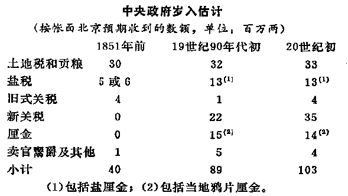

= 费正清_中国传统与变革
:toc: left
:toclevels: 3
:sectnums:

'''

====  中国对周边少数民族的控制方法:

- 让部落首领离开原领地, 迁到中国城市甚至京城, 使之汉化.

====  努尔哈赤建立新的行政制度, 后来逐渐形成"八旗"制度:

[options="autowidth" cols="1a,1a"]
|===
|Header 1 |Header 2

|人事权:
|- 所有的部落民都被编入. 各旗**用任命的官员, 来取代以前世袭的首领.**
- 从亲王以下, 分为12个主要品级. 这些品级由儿子继承后, 就要比父亲低一级, 以激励后代努力.

|削弱官员成为诸侯的力量
|- 旗民们分得的土地分散在各地, 与非旗民所拥有的土地混在一起. 因此, 旗民们即使有自己的土地, 他们也不固定在一个地方.
- 军事指挥权被分割, 防止任何军事力量做大.

|保持住满人的特权
|- 满人不受制于汉人的地方司法机构.
- 禁止所有满人经商或做工. (士农工商, 商最末.)
|===

==== 满族吸引汉人知识分子加入的手段:

- 按中国方式组织国家政权, 因此汉人就被参加一个"儒家"形式的政府的前景, 所吸引.

==== 清朝对付台湾郑成功的方法:

- 限制大陆的对外贸易
- 迫使中国沿海居民迁到离海十英里或更远的内陆, 以便切断台湾取之于大陆的人力、食物和丝绸贸易的来源.

==== 清代对蒙古族的控制方法

- 将各部落固定在指定的地区.
- *以夷制夷.* 用"内蒙古人"对抗"外蒙古人". 用结盟者对抗叛乱者. *以防止任何一个蒙古人领袖积聚起力量.*

==== 清朝控制政治架构的方法

- 雍正在行政机构中, 广泛地利用间谍和密告.
- "内阁"处理日常事物, "军机处"(雍正与1729年建立)则直接与皇帝一起处理紧急公务.

==== 清代对思想的控制

- 编撰<四库全书>的目的, 是搜寻所有对清朝统治者不利的书籍, 销毁有反清意识的著作.

==== 科举制

[options="autowidth"]
|===
|层级 |考试周期 |考中者即为

|县级
|3年中,考2次
|

|省城
|3年中, 考1次
|举人

|京城
|
|进士 (一般年龄为30多岁, 可被任命为知县)

|殿试
|
|
|===

==== 顾炎武提出"经世致用"说.

- 顾炎武游离中国北方, 直接接触到农业, 商业, 金融, 工业等问题. 他探寻明王朝崩溃的原因, 谴责明代那些"空泛无用"的新儒学 -- 即"宋学"或朱熹的"理学", 及王阳明. 顾炎武提出"经世致用"说.
- 并帮助创立了**"考据学", 用来判断古代文献的真伪. 有人把它看做为中国在"现代以前"科学方法的一个发展. 不过"考据学"只能用于文化研究的有限领域, 不能用于自然科学和技术.** 中国许多早期的科学发现和发明, 更多与道教徒有关, 而不是与儒士有关. *中国对自然的研究, 从来没有像西方那样, 将现代科学"系统化"和"理性化".*

==== 清王朝衰落 : 底层失业, 上层腐化, 军事无能

1800年, 衰落至少表现在三种状态上:

[options="autowidth" cols="1a,1a"]
|===
|Header 1 |Header 2

|大量增加人口的生计困难
|- 1741年, 全国人口约1.42亿. 到1851年, 人口达4.32亿. 不过, 清代人口数字不具有统计学意义. 有些省每年上报的人口数字都是均匀增加, 常是比上一年增加一个固定的百分数, 比如 +0.3% 或 +0.5%. *清代人口增长, 但政府管理能力却没有相应的发展.*

- *国家的经典学说不重视经济的发展, 强调"节约使用地税", 而不是"创造新财富". 也没有通过海外出口, 来增加国民财富的"重商主义"观念.*
- *当欧洲正在把"科学"和"发明"制度化的时候, 中国尚未这样做, 所以新技术的发展微乎其微.*
- *除非官商结合, 否则"资本积累"便靠不住, 根本没有立法保障,* 投资市场, 和合股公司的存在.
- *生产没有增加, 人口却增加, 生产只能刚好维持人民生存. 在这种情况下, "纯结余"和"投资"就是完全不可能的.* 同样, 中国农民的自给自足, 和贫穷, 使得他们几乎无钱可花, 所以中国对英国产品的进口需求非常有限.

- 清政府具有对外国刺激**反应迟钝**的特点.
- 地方官希望三年内能升迁到一个新职位, 对辖区内对他不利的事, 隐而不报. 不求有功, 但求无过, 对促进其辖区长期发展的事不感兴趣. 所以中国的宦海精神是消极的.
- 清**政府税收, 也不按"预算"和"审计制度"来计算.**

- *清代的主要学术, 只提供了历代王朝典章制度的详细知识. 但对如何解决清代晚期面临的紧迫问题, 几乎没有提供任何良策.*

- 鸦片的流入(进口), 引起**中国白银外流. 而中国又没有"出口增加"让白银流入回来. 这导致国内铜钱和银子之间的兑换率发生改变, 引起铜币贬值. 农民必须交更多的铜钱才能完税.** 同时, 官方每年铸币量增加, 又加重了这一问题.

|官僚腐败
|- 在战争中, 为了能获得(贪污到)政府的大笔拨款, 将领们故意拖延战事.
- 和珅把持着掌管"财政"和"官员任命"的重要职位. 有时他兼任的官职多达20个.

|八旗军事无能
|- 八旗兵的供给渐渐不足, 他们还受到价格上涨的压力. 有些人不得不去当小商人.
|===

==== 清朝对叛者的消灭方法

白莲教在元代后期和明代很活跃. 1800年前后, 白莲教叛乱反对满清统治, *但它却没有政治思想, 也没有建立新政府的想法.* 在早期, 叛乱也缺乏统一组织.

清政府的对策:

- 坚壁清野: 清除田野中的所有食物来源. 断绝叛乱者的食物和兵源.
- 分化招抚: 赦免普通叛乱者, 但悬赏首领人头.
- 组织各村团练武装. 事后清政府不得不又试图解散这些团练.

太平天国:

- 太平军曾进入中国18个省中的16个, 但它们却无法统治自己所征服的地区. 由于<圣经>没有提供建立理想政权的详细蓝图, 所以太平天国的很多制度, 事实上来自中国的传统.
- 太平军事实上没有建立土地管理机构, 所以不能确定土地使用的平等化, 达到什么程度.
- 太平军将反满, 与对儒教及整个社会秩序的攻击, 结合在一起, 所以他们就将士绅阶层排除在外了.
- 太平天国的领导人, 没有认识到上海能作为"获取外援"来源的价值, 几乎没有做出"发展对外贸易"的努力.
- 在西方看来, *太平军似乎不可能比清廷更有力地促进与西方的贸易, 西方列强也因此对叛乱保持中立.*

==== 西方对中国科学与思想的推动发展, 及条约的作用

科学:

- 西方的科学, 和基督教道德教义相结合, 吸引了中国一批人. 明代徐光启即是其中之一. 他与利玛窦一起, 翻译完成了"欧几里得几何学"的前六卷.

司法制度:

- 西方人对中国落后的司法(随意逮捕, 折磨被告)不满, 因此执行"治外法权"制度 (由外国司法机构, 来审理外国国民). 中西方法律差距的背后, 实际上隐含着对"个人权利和义务"的两种截然相反的看法. 于是在通商口岸里, 西方和中国的企业就能相对摆脱中国官员的任意敲诈勒索.

被迫融入西方经济:

- 鸦片战争的背景, 是清政府反对取消"进贡制度". *英国的目的是用军事优势, 来在中国对外关系中建立一种新秩序 -- 使清朝接受西方有关"国际贸易"和"国际关系"的概念.*

- 中国也从来没有建立一支常备不懈, 并能够实施海权的机动力量(即海军)的概念. 清朝时, 海上的小舰队, 是由各省分散管理的, 事实上也只是一支"保安队"而已. 所以**海盗可以用陆上流寇的方式来保护自己 -- 通过管辖分界线, 这样, 受害之省份就不能追击他们.**

《南京条约》规定:

- 废除"公行"在广州对外贸的垄断，允诺实行"公平、正规的关税".
- 英国侨民享有"治外法权". 西方法律程序有时实际上扩大到了他们的中国仆人和助手。于是西方和中国的企业, 相对摆脱了清朝官员们的任意敲诈勒索.

《南京条约》后, 又签订了三个条约, 作为对第一个条约的补充 -- 中英《虎门条约》, 中美《望厦条约》, 中法《黄埔条约》. 其中, *“最惠国"条款 -- 每一国都可享受以后给予他国的任何特权的承诺。* 使美国人不费吹灰之力得到了英国人曾为之而战的全部特权。

*<南京条约>等, 由于主要是中国出让主权, 所以它们就被称为"不平等的".*

中国市场, 对纺织品和其他英国制造品的需求, 仍旧有限,令人失望. 这主要是因为中国农民的自纷自足和贫穷,他们几乎无钱可花。

世界范围废除奴隶制的努力，奴隶没了, 便产生了对契纳劳工的需求 (华工的原因).

上海成为通商口岸后, 因为上海靠近茶、丝产区。所以1848年上海的开放, 使得广州的运输帮失去了工作。

就短期而言, 外国外交活动的影响并不总是革命性的.  相反,中国近代史上的问题之一是: 1860年以后, 西方列强可能在多大程度上, 通过支持摇播欲坠的消王朝, 阻止了政治变革?

在没有清帝国海关的情况下, 英国领事一直在征收协定关税,以阻止中国在内地对外国贸易的征税。因为没有平等的关税，就会损害自由贸易和合法商业的稳定增长.

英国人清楚自己想要什么 ——使天子接受西方有关"国际贸易"和"国际关系"的概念。

英法为了逼迫清朝同意他们的公使可以根据外交平等的条件, 驻节北京。将其舰队开往天津, 在那里签署了条约(1858.6). 在清朝看来, 西方使团常驻北京, 会结束中国朝贡体制的优越地位, 不愿让步, 尽管它已经接收了条约草案. 一年后, 英法公使被北京拒绝进京. 于是使用武力进入北京(1860.10), 圆明园被毁, 并和皇帝的兄弟、此时代表朝廷的恭亲王, 签订了新的条约。

历史记载倾向于成功者 —— 至少可以说成功者的记载比较丰富。晚清史在1912年以后, 也仍没有得到充分客观的阐释。简言之,*日本的历史编纂, 随着日本自身现代化(科学化)了.* 而在中国, 对历史的编撰, 仍然遵循着传统(缺乏科学)的方式.

传统解释认为, 中国现代化过程的缓慢, 主要是因为西方“帝国主义"压迫的有害影响。但这种观点无法解释为什么势不可当的“帝国主义"影响, 在日本和中国却产生了如此不同的结果 (日本明治维新成功了)。事实上, 儒家文化的某些特征, 阻碍了中国的变革.

1860年, 清政治结构, 发生了两个重要变化: +
(1). 英法迫使清朝天子接受平等对待外国君主的要求, 从根本上削弱了天子是四海共主的古老想法. +
(2). 以曾国藩为首的汉族士绅, 建立了地区性的汉人军事势力, 削弱了满清的控制。

为了专门处理与西方的外交关系，设立了一个新机构(率属于军机处)—一以恭亲王为首的“总理各国事务衡门”或称"总理衙门"(1861). 直到1901年设立"外务部"之前,它行使外交部职责。

海关: (英国人)李泰国认为, 自已是为中国当局工作，而不是在他们领导下工作。他说“一个绅士在亚洲野蛮人领导下行事的这种观念, 是荒谬可笑的。”

在发生了比关国时间更长、地区更广的战争(太平天国战争, 捻乱等)以后,中国却缺乏强大的近代工业, 来恢复经济. 大量无家可归的人需要养活并安置工作。

19世纪50年代内战爆发后，中央攻府的国库很快消耗殆尽。同时, 来自富庶省份的"土地税"也断绝了。为了应付财政危机, 1853年在江苏对商人开征了一项低额税,后来称为厘金(“值百抽一税")。这项新税有三个重要特征: +
(1) 因税额过低, 而不值得设法逃避，因此很容易征收. +
(2) 征税范围限于消费商品，征收方式是: 当货物通过厘卡时, 征"转运税"; 或者是在货物销售的地方, 征"销售税". +
(3) 厘金税收, 主要存于地方士绅参与管理"厘金制度"的各省手中。

到1860年, 这项税收几乎扩大到了中国的每一个地方. 该税成为筹措军费的来源之一。

在1850年前, 中央政府的岁入, 主要征自农业经济部门。而到19世纪末,新的"商品税", 已是原收入的两倍多. 在交给北京的各项税收中，"厘金"起初是最重要的。但新的"海关税"在19世纪60年代大大上升。

地方军队的加强, 和厘金制度的推广, 加强了"分权化"或"地方主义"的趋势.

中国儒家思想:

- 圣人的道德榜样使之具有道德权威. **与近代的"平等思想"趋势正相反, 这种哲学具有强烈的高人一等的优越感和等级色彩. **
- 经济致策的重心, 不是放在"增加生产"和税收上, 而是放在"节俭"上.

在清代大部分时间内，来自长江下游富庶且文化发达城市的士子, 在北京考试及第者中, 占很大比例. 其中约五分之二, 来自江苏一省. 满清在那里获得大米供给, 需要在那里拥有支持者。

罗马"天主教", 和"新教"(来自北欧, 北美)不同, 天主教把宗教改革看做异端. 而站在新教的立场, 罗马也是反基督的. 所以基督教的这两个支系, 合作甚至联系都是最低限度的。

罗马"天主教"的布道, 有单一的机构协调他们的活动. 而新教则没有. 后者的活动几乎像西方商人的活动一样分散。新教有很多流派.

1866年, 一位杰出的英国组织者戴德生, 创立了内地会. 他说:“在那块土地上(中国)每月有一百万人死去，死时未得到上帝的拯救。"他从所有国家的"新教"派别中, 召募传教土，明确告诉他们没有固定薪金，宣布"上帝将指引"并派遣他们到内地, 去朴素地生活在人民之中, 穿中国式服装,引导中国人的灵魂得救。在他使"除折祷以外, 不谋求任何支持"的信念, 广为人知以后,戴德生发现, 捐助和应募者源源而来。

*为了传播基督教教义*, 传教士们发现, *向社会秩序提出质疑 -- 至少通过暗示来做到这一点,是必要的.* 而士绅则是这种秩序在地方上的中坚人物。
传教士们在诸如孤儿抚养、济贫, 和在灾荒年月提供赈济之类的事务中, 与士绅展开竞争. 在传统势力看来,  基訾教似乎一心在鼓动对现实不满的人。 (因为基督教在解决儒教无法解决的问题，反衬出儒教的无能，所以在儒教看来，基督教就是暴露自己无能的人, 是敌人.)

传统势力的反击就是 : 对基督教做的各种事，都进行意义上的扭曲，犯罪化，搞臭.

在通商口岸，大片土地由英、法政府永久租借，每年向清政府支付少量的地租. 这些地方被称为“租界”。

在这些租借地内, 外国领事馆又以九十九年为期, 将土地租给土地租用者 (相当于当了二房东)。根据"治外法权"，领事馆还可以对自己的国民行使司法裁判权, 并逐淅具备了税收、警察及其他市政府的特征。中国居民要纳税, 但没有代表权 (无代表, 不纳税)。

商业法律, 也随着西方的控制而来, 诸如"合法的合并", 与"强制执行合同"的法律等。

最惠国条款, 继续将任何一个条约国所取得的所有特权, 给予每一个条约国。 始自19世纪40年代的这一体系, 在20世纪最终发展为大概控制包括约90个通商口岸和开放港口、约25个(轮船) 停靠港, 和约30多万外国侨民的体系。在通商口岸城市中, 西方人引进了西方都市化的市政设施 -- 报纸、学校、图书馆, 医院、供水排水系统、铺石道路, 和照明系统。还有西方的更高的生活标准。

海关的中国职员, 则为培养文官提供了现代训练基地。

帝国主义者在中国所使用的新方法, 是运用贷款、铁路、租借地、降低关税、地方司法权、治安权, 和矿山开采权等, 建立事实上的"势力范围". 租借地和铁路沿线地区, 就变成半殖民地.

俄国的决策人员中, 经常产生意见分歧，因此它的许多努力遭到失败，事件的发展经常难以预测, 大胆的行动和迟疑交替出现。其他列强的情况也相似。

英国和德国, 拥有巨额资本. 其银行家向中国贷款, 后者用以支付对日本赔款中的大部分.

在继续支持中国的领土完整、门户开放, 和所有国家贸易机会均等, 等传统原则的同时, 英国却事实上按照两强标准, 来规划它的军事实力. 这个标准规定: 英国在海军军备竞赛中, 必须拥有能够与任何其他两强相当的海军.

早在1652年, 皇帝以"党争导致明代衰败"为由, 禁止士子发表政见, 禁止“与其他阶层广泛接触，或结社串联”。雍正和乾隆将"由官员组成的会社", 都定性为谋取私利的“党”. 要求每一个官员都要以皇帝的"好恶为己愿". 所以, 维新运动带来的那些没有官职的士大夫, 对政治问题进行的讨论, 是对这一清朝帝规的打破. 士大夫一旦涉政, 便很快成为记者, 学会开始发行报刊杂志。改良派在维新运动中, 开始用团体组织、研讨会, 和活跃的新闻工具进行活动，其方式与传教士极为相似。

通商口岸报纸的出现, 和传教土教育事业的兴起, 使大量外国思想传入中国.

义和团最初提出的口号是"反清灭洋"(1899), 后来又改成"扶清灭洋". 义和团攻击外国人, 传教士和中国基督教徒. 外国使团不断向清朝递交照会(1900), 要求镇压义和团. 最后动用海军力量. 清政府对外国宣战. 但当时的李鸿章(广州总督), 刘坤一(南京), 张之洞(武汉), 袁世凯(山东), 对朝廷的宣战置之不理. 山东的震世凯一起决定对朝廷的宣战置之不理。他们提出, 只要外国不向长江流域增派军舰, 驻在那里的总督们就能维持当地的秩序。这就使除了北方省份以外的整个中国, 处于中立的地位。所以, 义和团的行动就只局限于华北地区. 慈禧逃离北京, 李鸿章被指定出面收拾残局. 签订<辛丑条约>(1901), 内容为:

- 扩大使馆区.
- 由外国军队占据铁路沿线要地,以确保从沿海到北京通道的畅通.
- 将进口税率提高到5%.

外国在华金融机构, 向中国政府贷款. 这些债务均以海关关税作抵押。

中国对日本的战争赔款, 就是从外国银行借入的钱. 而借款条件十分苛刻:

- 中国得到的借款均打折扣（比如94折等)
- 须支付长达45年的高利息
- 要按浮动的金银兑换率, 用黄金支付。

《辛丑条约》规定赔款额为 3.33亿美元, 将用利息为4%的黄金债券支付。这样到1940年全部付清时, 本息合计为 7.39亿美元. 不过, 由于沙皇俄国和德意志帝国, 在第一次世界大战中倒台, 美国、英国和其他国家放弃索取赔款要求, 和发生的其他变化，这笔赔款最终只支付了原来规定数目的1/3弱。

从银行借出的赔款的钱, 无法用于投资. 这给中国经济发展带来损失.

"瓜分中国"未能实现的部分原因, 是中国精英努力使帝国主义列强相互牵制, 以保持平衡。当然,这方面的研究还极为有限。

美国扩张的原因:

- 为国内产品寻求海外市场
- 向国外传教
- 社会达尔文主义, 和白种人优越论, 当时兴起
- 马汉海权论兴起
- 公众强烈要求开凿一条横贯尼加拉瓜的运河，以便让美国舰队能够在两大洋同时作战.
- 美国与西班牙的竞争, 从西班牙手中获得了古巴, 菲律宾, 关岛, 珍珠港等潜在的海军基地.

美国提出"门户开放"要求(1899): 在所有通商口岸对各国贸易所征收的税率, 应一视同仁,而不论这些口岸是否位于新的“势力范围"之内。门户开放的目的, 旨在维护各国在中国的均等通商机会. 但俄国拒绝.

新的政府学堂, 受到基督教传教士办的教育机构的竞争。这些教育机构通过广泛地传授基督教、个人主义、妇女教育思想, 和西方生活方式，树立起革命性的榜样。这些教学活动都受到"治外法权"的保护，传教士办的学校拒绝让学生对孔子或皇帝行效忠礼。而在政府学堂中，学生们都耍这样做。具有现代思想的学生, 投奔到教会学校和私立学校的门下。北京通过禁止教会学校毕业生跻身仕途的方式, 来进行对抗。

张之洞开始将日本, 看作是新一代中国教师的最佳培养地, 因为日本离中国很近，比在西方培养教师省钱.
中国青年去东京接受现代教育始于1896年, 在情代最后十年里赴日深造的数万人中, 约有一半人得到中国政府的资助,其中主要是得到省级政府的资助。

淮军和湘军, 虽然配备了现代武器, 但缺乏"经过现代化军事训练的"军官和参谋人员, 更不用说辅助兵种了 -- 如工兵, 军需官, 医疗队, 现代运输工具等.

李鸿章和张之洞在19世纪80年代, 都创办了军事学堂,雇用德国教官, 来训练新军官团。

袁世凯, 在1895年, 受命与德国教官一起 训练新建的清朝陆军。这支军队后来被称为"北洋军". 在他手下的那些早期军官中，至少有十人, 在革命后成为各省的都督，有五人(除了袁世凯本人之外) 成为共和制的北京政府的总统或总理。

进入20世纪后, 雇用日本军官比雇用德国教官省钱. 中国侯补军官们被派到日本的士官学校去学习。如, 年仅18岁的蒋介石, 于1906年进入保定军校,次年又赴日本留学。

司法改革，如同在日本一样,被外国列强认为是废除在华"治外法权"的必要前提。

1905年, 清朝岁入大约是0.7亿美元. 海关税和厘金税, 就都用于偿付外国赔款.

1908年, 全国岁入调查, 总收入是2.97亿两. 但支出上, 中央和省的支出是3.38亿两, 地方支出是0.37亿两, 结果赤字就是 latexmath:[ 2.97-\left( 3.38+0.37 \right) =-0.78] 亿两.

1898-1914年这段时期内,中国历史的进程受到了日本的很大影响. 堪比英国在19世纪, 或美国在1915-1949年之间, 或苏联在20世纪50年代, 对中国所起的影响.

康有为从1899年起, 他开始出访世界各地的华侨社区,建立他的保皇会组织，筹集资金，鼓动进行改良主义的宣传。

梁启超的著作涉及各种问题, 这使他成为这一时期最有影响的一位政论家。他是中国学生了解世界的窗口,他先后主编的一系列杂志的名称, 表明了他的思想发展趋势.

1903年，当梁启超仅三十岁的时候，他很快便超过了他的老师。康有为当时四十五岁，已过了更新思想的年龄。梁启超运用了当时风行世界的"社会达尔文主义"学说。但他仍然是一个渐进主义者、君主立宪主义者,和反共和主义者。他对革命并不积极. 他的组织"政闻社"也因此受到了清政府和反清革命派, 两方面的抨击.

梁启超是知识界的上层人物和思想界的领袖,并不重视采取行动。而孙逸仙则不同, 他是现代的早期职业革命家之一. 孙逸仙的家乡在澳门附近,这里受西方人的影响时间最久、受北京的控制也最薄弱。从这一带移居到国外华侨社区的移民, 不计其数。孙早年的经历, 也同样不会使他效忠于北京的皇帝. 他在十三岁时, 在檀香山一所由英国国教会开办的寄宿学校, 学习英国的课程, 成为了一个反对崇拜偶像的人。 之后又到香港求学. 他在广州和香港学习化学、生理学、外科学等,并在一家英国教会办的医院中获得了医学学位。

孙逸仙与传统的反叛者组织 -- 三合会建立了联系。也自己建立了一个秘密组织 -- 兴中会(1894),在夏威夷和港澳穗地区都建有支部。1895年, 该组织的第一项计划, 夺取广州政府领导权的计划失败. 孙被通缉, 并在英国被中国公使馆捕获. 他的医学老师康德黎, 动员英国舆论促成他的获释。这样，孙中山在三十岁的时侯已成为一名具有世界声誉的反清革命派领袖,他感到自己是个受命运驱使的人。

当时有很多不同思想的革命团体:

- 康有为 -> 得到东南亚大部分守旧的华侨商人的支持
- 梁启超 -> 对学生群体有很大的思想影响
- 章炳麟, 蔡元培 -> 学者群体. 对康,梁进行抨击.
- 黄兴 -> 创建了"华兴会"组织(1903). 试图将军官、学生和秘密会社的成员联合起来, 发动起义.

所以, 虽然革命活动在增长, 但它缺乏协调关系, 明确的思想, 和长期的计划.

面临着这种竞争和机会,孙中山提出了他自己的思想 -- 三民主义(民族, 民权, 民生)。 这三个概念的具体含义, 能在特定情况下做较大的变更.

孙中山和黄兴, 合作成立同盟会(1905). 孙中山任总理, 黄兴的位置居次, 章炳麟和其他人均被提名担任要职。设在新加坡、布鲁塞尔、旧金山和檀香山的海外支部, 与十七省的支部平级。在该会早期的约一千名会员中,来自湖南和湖北的人最多.

许多人都被孙中山的个性所吸引。在革命党人中间,39岁的孙中山不仅是年纪最大的,而且也是最著名的一个。他去过的地方最多,阅历也最丰富。尽管他在长江沿岸诸省中的熟人不算多, 但是他在日本和其他国家中熟人多于其他任何人 (海外人脉广)。另一方面,孙中山是一个外国化的中国人, 而不是一个著名学者,他以他的密谋和果敢的行动而著称，而不是以他的文章而闻名: 他确实有理论, 却失之于肤浅. 因此，他不能充当指导同辈人思想的理论家角色。

关于共和主义的新思想体系, 是孙中山在同盟会的刊物《民报》中, 那些做文字工作的副手们, 加以阐述的。汪精卫和胡汉民等撰稿人, 通过抨击梁启超的浙进改良和君主立宪的思想,成功赢得中国学生对一个引人入胜的论点的支持, 即中国通过一场迅疾的革命, 就能够赶上和超过西方(如同日本一样)。(事后证明这种想法太乐观了.)

《民报》支持孙中山的三阶段计划: +
1.三年"军政之治",各县逐一建立起地方自治政府. +
2.六年"约法之治"，这一阶段被称为“训要”. +
3.最后为"宪政之治",选举产生总统和国会。

梁启招所宣扬的开明君主制的观点, 由于1908年光绪帝的去世, 而失去了市场。

到1909年, 清政府的逮捕和处决, 加上革命党人缺乏协调、连吃败仗, 打击了华侨提供财政援助的积叛性, 也导致革命运动内部发生不和。 孙中山再次到西方去寻求财政支持.

清朝覆灭的到来, 在一定程度上是出于偶然，完全出于同盟会的控制之外。学生和士兵们(枪杆子里面出政权)在湖北组织了一系列的革命学会, 他们的密谋计划(10月9日)被泄露，驻武昌的一些新军士兵不得不在10月10日发动起义。虽然在人数众多的新军中只有不到三千人参加了起义,但是满族总督逃离了这座城市。武昌落入起义者的手中,外国领事宣布中立。由于没有革命领导人在场，黎元洪被推为领导人。这次反满起义受到各地强有力的支持,在几个星期以内，它促使另外约二十个重要城巿或地区宣布反满,这种行动通常都得到了同盟会、新军和谐议局的支持。到12月初,所有南部和中部省份,甚至包括西北部省份都宣告独立。

孙中山在报纸上看到武昌起义的消息, 即赶往英国, 寻求得到借款和英国的帮助. 并组织日本对清朝政府提供财政或军事援助. 之后, 孙中山被选为中华民国临时总体. 并允诺不论袁世凯在何时支持新的共和国, 他都将随时让位给袁. 因为孙中山和同僚既没有掌握武装力基,在各省又没有大批的支持者。

总体上, 辛亥革命是一场非暴力革命, 也是一场无确定成果的革命.

袁世凯与革命党人和清皇室, 都进行了公开或秘密的谈判, 并达成一项总的解决办法.

清帝溥仪退位(1912.2.12)之后, 孙中山随即辞去临时总统的职务, 袁世凯被南京选为孙的继承人. 不过, 袁借口北京发生兵变, 不南下就职, 而在自己的势力范围北京就职, 按照《临时约法》进行统治, 直到选出国会, 和建立完全的立宪政府时为止.

但是, 袁世凯和其后继者, 都缺乏革命派所企望的那种"建立 Anglo-Saxon 盎格鲁–撤克逊式政府"所必备的法理依据, 而不得不依赖于武力维持统治。 共和制, 变蜕变为军阀政府.

从1912-1916年,袁世凯为了保住权力,采用贿赂、武力, 暗杀等手段,胁迫国会, 随意修改宪法, 最后又企图复辟帝制。

436

==== 其他

- 达赖喇嘛中的"达赖", 是蒙古语"大海"的意思.

-

