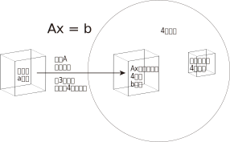
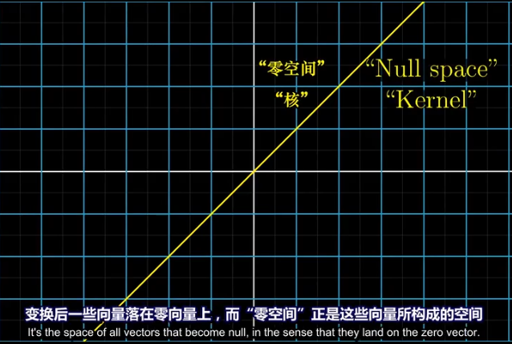
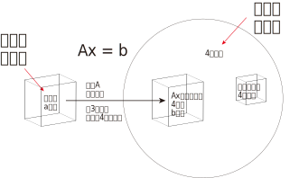

:toc:
:toclevels: 3
:sectnums:

== 向量空间

运算封闭:: 从某个非空数集中, 任选两个元素（同一元素可重复选出），选出的这两个元素通过某种（或几种）运算后的得数, 若仍是该数集中的元素，那么，就说该集合对于这种（或几种）运算是"封闭"的。

向量空间，就必须满足空间"对线性运算（"相加"和"数乘"）封闭"这一原则。

[options="autowidth"]
|===
|Header 1 |Header 2

|Column 1, row 1
|Column 2, row 1
|===

在向量空间中任取一部分，得到的结果可能不是向量空间::
如果我们把二维坐标平面上的第一象限, 单独拿出来，这个区域仍然是"向量空间"吗？不是的，因为该空间无法满足“线性组合仍在空间中”的要求，比如做数乘运算时，随便取个负数, 得到的向量就会位于第三象限. 也就是说，在向量空间中任取一部分，得到的结果可能不是向量空间。

那么两个向量空间的并集，其结果可以构成子空间吗？答案是否定的.::
假设我们有一条过原点的直线, 和一个过原点的平面（直线不在平面上），二者均可以视作向量空间，而两者的并集, 并不能满足"线性运算封闭". 因为在直线上任取一向量，在平面上任取一向量，两向量的和, 会位于直线与平面之间，脱离了两空间并集的范围。

那么两个向量空间的交集，其结果可以构成子空间吗？答案是肯定的.::
直线和平面的交集是零向量，零向量依然为向量空间。

---

== 子空间 subspaces

子空间 : 就是向量空间内的一些向量, 它们属于母空间, 但自身又构成向量空间. that's a spaces -- that's some vectors inside the given space inside R three that still make up  a vector space fo their own. 即, "子空间"是向量空间内的向量空间. it's a vector space inside a vector space.

比如在三维空间(stem:[ R^3])中, 过原点的平面, 或一条直线, 就是 stem:[ R^3] 的子空间.  +
所有子空间, 必须包含原点, 或者说零向量.

取任意两个子空间的交集, 结果仍然是子空间, 只不过比原来小一些罢了.

---

== 列空间

==== MIT 的讲解 -- 列空间

列空间: 是指由矩阵的"列向量"所构造出的空间。

例如:
\begin{align}
A=\left[ \begin{matrix}
	1&		1&		2\\
	2&		1&		3\\
	3&		1&		4\\
	4&		1&		5\\
\end{matrix} \right]
\end{align}

这个矩阵A 的列向量, 均是空间中的四维向量，所以可以说A的"列空间", 是stem:[ R^4] 的子空间。

在这个列空间中，除了包含这给出的三个列向量外，还包含了它们的各种线性组合，也就是说，A的列空间是由:
\begin{align}
\left[ \begin{array}{l}
	1\\
	2\\
	3\\
	4\\
\end{array} \right],
\left[ \begin{array}{l}
	1\\
	1\\
	1\\
	1\\
\end{array} \right],
\left[ \begin{array}{l}
	2\\
	3\\
	4\\
	5\\
\end{array} \right]
\end{align}

这三个向量所张成的子空间。

那么这个空间有多大呢？这就需要用 stem:[ A\vec{x} = \vec{b}] 来解释了。

比如, 这个方程 stem:[ A\vec{x} = \vec{b}] 如下：

\begin{align}
A\overrightarrow{x} = \left[ \begin{matrix}
	1&		1&		2\\
	2&		1&		3\\
	3&		1&		4\\
	4&		1&		5\\
\end{matrix} \right] \left| \begin{array}{l}
	x_1\\
	x_2\\
	x_3\\
\end{array} \right|=\left| \begin{array}{l}
	b_1\\
	b_2\\
	b_3\\
	b_4\\
\end{array} \right|
\end{align}

该方程其实可以改写成如下形式:

\begin{align}
Ax\ =\ x_{1\}\left| \begin{array}{l}
	1\\
	2\\
	3\\
	4\\
\end{array} \right|\ +\ x_{2\}\left| \begin{array}{l}
	1\\
	1\\
	1\\
	1\\
\end{array} \right|\ +\ x_{3\}\left| \begin{array}{l}
	2\\
	3\\
	4\\
	5\\
\end{array} \right|
\end{align}

可以看出: stem:[ A\vec{x}] 的本质 就是对 A的列向量, 进行线性组合. 即:  stem:[ A\vec{x}] 就代表着的"列空间"。

**显然, 对于一个四维空间, 是无法用三个"基"(三个未知元,代表三个轴)来撑满的.  因此, 由这三个"基轴"张成的空间, 也只能是 stem:[ R^4] 空间中的部分子空间.**

因此, 在四维空间中任意取一个向量(是四维坐标的), 大概率会身处在 stem:[ Ax] 代表的子空间之外.

那么, 对于这个 stem:[ A \vec{x} = \vec{b}] 来说, b 是一个四维的向量, 什么样的 stem:[ \vec{b}], 才能在四维空间中, 能找到它的原像 stem:[ \vec{x}] 存在呢? 而不是身处在 stem:[ A\vec{x}] 的子空间之外.

既然 stem:[ A\vec{x}] 只是把一个三维物体, 放在四维空间中 (只是用四个坐标轴来表示三维物体的位置罢了), **那么 stem:[ \vec{b }] 只要也位于 矩阵A的 "列空间"中, 就可以找到一种由 A 的"列向量"通过"线性组合"而构成的向量 stem:[ \vec{b}], 我们也就能倒推回去, 找到 stem:[ \vec{b}] 的原像 stem:[ \vec{x}]了**, 即能找到stem:[ Ax=b] 的解。

详细 :

\begin{align}
A = \left[ \begin{array}{c|c|c}
	1&		1&		2\\
	2&		1&		3\\
	3&		1&		4\\
	4&		1&		5\\
\end{array} \right]
\end{align}

- 它一共有3列, 它只作用于一个三维的物体. 对三维物体做变换.
- 它每列中有4个数值, 说明变换后, 会赋予物体四个轴坐标, 来标明它的位置. 这就说明, 它会将物体置于四维空间中.

这个矩阵A 的列向量, 处在 stem:[ R^4] 空间中. **因此A 的列空间, 是 stem:[ R^4] 的子空间.** 那么, 该子空间包含些什么?

A的列空间, 记为: stem:[ C(A)].

显然, A中的每一列向量, 都属于子空间中的东西. 但单独的三个向量是构不成"向量空间"的, 只有它们的"线性组合"张成的平面或多维物体, 才能构成"空间". 所以本例中, **矩阵A的列空间, 是由它所有的"列向量"的"线性组合"构成的.**

那么, 这个矩阵A的列空间, 有多大? 它占整个stem:[ R^4]空间多少份额?

首先思考下: stem:[ A\vec{x} = \vec{b}] 是否对所有的"新像stem:[ \vec{b}]", 都能找到它的原像stem:[ \vec{x}] ? 回答是否定的. 那么进一步说, 什么样的b, 才有原像x的存在?

对于本例, stem:[ A\vec{x} = \vec{b}] 就是:

\begin{align}
A\overrightarrow{x} = \left[ \begin{matrix}
	1&		1&		2\\
	2&		1&		3\\
	3&		1&		4\\
	4&		1&		5\\
\end{matrix} \right] \left| \begin{array}{l}
	x_1\\
	x_2\\
	x_3\\
\end{array} \right|=\left| \begin{array}{l}
	b_1\\
	b_2\\
	b_3\\
	b_4\\
\end{array} \right|
\end{align}

什么样的"新像 stem:[ \vec{b}]", 能找到其"原像stem:[ \vec{x}]"?

- b 是零向量的话, 可以找到x, 此时x也是零向量. 即 stem:[ A\vec{x} = \vec{0}] 总有解(零解).
- b 是 stem:[ \[1,2,3,4\]^T ] 的话, 可以找到 x是 stem:[ \[1,0,0 \]^T]
- b 是 stem:[ \[1,1,1,1\]^T ] 的话, 可以找到 x是 stem:[ \[0,1,0 \]^T]

事实上就是: **如果 stem:[A\vec{x} = \vec{b} ] 有解的话 (即能找到"原像 stem:[ \vec{x}]" 的话), 条件是: 当且仅当等号右侧的 stem:[ \vec{b}], 是属于矩阵A的"列空间"的.** +
**只有 stem:[ \vec{b}] 是 A 的各列的"线性组合"时 (即 b 在 A 的列空间中),  stem:[A\vec{x} = \vec{b} ] 才有解.**

这就是我们为什么要关注"列空间"的原因. 因为它能告诉我们,  stem:[A\vec{x} = \vec{b} ] 何时有解.

我们再来看看, 矩阵A 中的各列, 线性无关吗? 也就是说, 是否有冗余的列存在? 本例的矩阵A, 表面上有3列, 好像能接收一个三维物体. 但如果A的列有冗余存在, 事实上只有两列是"线性无关"的话, 那它事实上就只能接收一个二维物体. 它是把二维物体做变换, 投射在了四维空间上.

\begin{align}
A = \left[ \begin{array}{c|c|c}
	1&		1&		2\\
	2&		1&		3\\
	3&		1&		4\\
	4&		1&		5\\
\end{array} \right]
\end{align}

本例的A矩阵, 的确有冗余列存在. 比如: 列③ = 列① + 列②.

因此, 这里A的列空间, 其实就是 stem:[ R^4] 中的二维子空间.

---

==== 列空间 的定义

新基矩阵 = stem:[ \[ \hat{i} | \hat{j} \] ]

新基矩阵中的列向量(即"新基坐标系"中的每个轴) 张成的空间, 就是"列空间"  column space.

如, 假设"新基矩阵A"是: +
\begin{align}
A=\left[ \begin{array}{c|c|c}
	1&		0&		0\\
	0&		1&		0\\
\end{array} \right]
\end{align}

则A的"列空间"就是: +
\begin{align}
a\left| \begin{array}{l}
	1\\
	0\\
\end{array} \right|+b\left| \begin{array}{l}
	0\\
	1\\
\end{array} \right|+c\left| \begin{array}{l}
	0\\
	0\\
\end{array} \right|=\left| \begin{array}{l}
	a\\
	b\\
\end{array} \right|
\end{align}

即, 也就是"新基矩阵A" 的 "列向量" 的所有"线性组合"的集合, 构成一个子空间，称为矩阵A的"列空间"(column space), 或"列张成"(column span)，用符号 Col(A) 表示。

所以, 更精确的 rank 的定义, 就是: 列空间的维度数.

当 rank 达到最大时, 就意味着 "rank" 与 "列数"相等. 我们就称之为"满秩".

注意: 零向量一定会包围在"列空间"中.

---

== 零空间 Null space

==== 3Blue1Brown 的几何解释

image:../img/0036.gif[]

将一个二维平面, 变换降维成一条直线, 则该物体一定会有一列(即一整条直线的部分), 被压缩到原点(0,0)上. +
变换后落在原点的原向量的集合, 就称为新基矩阵A 的"零空间" 或 "核" kernel.

**变换后, 会有一些向量落在原点上, 而"零空间", 正是这些向量所构成的空间.**

**对于 stem:[ A\vec{x} = \vec{0}] 来说, A的零空间, 即线性方程组 stem:[ A\vec{x} = \vec{0}]  的所有解 (即原像 stem:[ \vec{x}]) 的集合。**

矩阵A 的零空间, 记为: stem:[ N(A)]

---

==== MIT 的讲解 -- 零空间

**什么是"零空间"? 就是 stem:[ A \vec{x} = \vec{0}] 的所有的原像stem:[ \vec{x}], 所构成的一个空间.**

如:

\begin{align}
A = \left[ \begin{array}{c|c|c}
	1&		1&		2\\
	2&		1&		3\\
	3&		1&		4\\
	4&		1&		5\\
\end{array} \right]
\end{align}

其 stem:[ Ax=0] 就是:

\begin{align}
\underset{A}{\underbrace{\left[ \begin{matrix}
	1&		1&		2\\
	2&		1&		3\\
	3&		1&		4\\
	4&		1&		5\\
\end{matrix} \right] }}\underset{\overrightarrow{x}}{\underbrace{\left| \begin{array}{l}
	x_1\\
	x_2\\
	x_3\\
\end{array} \right|}}=\underset{\overrightarrow{0}}{\underbrace{\left| \begin{array}{l}
	0\\
	0\\
	0\\
	0\\
\end{array} \right|}}
\end{align}

零空间就是原像stem:[ \vec{x}] 所构成的空间. 本例中, x有三个分量, 所以其"零空间"是 stem:[ R^3] 中的子空间。

**注意比较: 对于一个 stem:[ m \times n] 的矩阵来说**:

- **其"列空间", 是 stem:[ R^m] 的子空间. <- 即是 A矩阵 所投射到的"新维度空间"的子空间.**
- **其"零空间", 是 stem:[ R^n] 的子空间. <- 即是原像stem:[ \vec{x}] "自己所属维度"的子空间.**

也可以说: stem:[ fnA(x)=b] : +
-> 原像x的维度, 就是"零空间"的母空间.  +
-> 输出值b的维度, 是"列空间"的母空间.

详细:

\begin{align}
A\overrightarrow{x}=\overrightarrow{b}\ \rightarrow \underset{A}{\underbrace{\left[ \begin{matrix}
	1&		1&		2\\
	2&		1&		3\\
	3&		1&		4\\
	4&		1&		5\\
\end{matrix} \right] }}\underset{\overrightarrow{x}}{\underbrace{\left| \begin{array}{l}
	x_1\\
	x_2\\
	x_3\\
\end{array} \right|}}=\underset{\overrightarrow{b}}{\underbrace{\left| \begin{array}{l}
	b_1\\
	b_2\\
	b_3\\
	b_4\\
\end{array} \right|}}
\end{align}

**该A矩阵的零空间, 它包含什么?** 它不包含右侧的stem:[ \vec{b}], **它包含 stem:[ A \vec{x} = \vec{0}] 中 所有的解(即原像x).**

即:
\begin{align}
A\overrightarrow{x}=\overrightarrow{0}\ \rightarrow \underset{A}{\underbrace{\left[ \begin{matrix}
	1&		1&		2\\
	2&		1&		3\\
	3&		1&		4\\
	4&		1&		5\\
\end{matrix} \right] }}\underset{\overrightarrow{x}}{\underbrace{\left| \begin{array}{l}
	x_1\\
	x_2\\
	x_3\\
\end{array} \right|}}=\underset{\overrightarrow{0}}{\underbrace{\left| \begin{array}{l}
	0\\
	0\\
	0\\
	0\\
\end{array} \right|}}
\end{align}

本例中, stem:[ \vec{x}] 的所有的解, 是三维的, 属于 stem:[ R^3] 的子空间. 而 A的列空间, 是属于stem:[ R^4] 的子空间.

求"零空间"和"列空间"的一般方法, 是通过"消元"来进行. 但本例中, 我们能直接看出来 stem:[ \vec{x}] 的解:

- stem:[ \vec{x}=  \vec{0}]. <- 不管矩阵是什么, 零空间必然包含stem:[ \vec{0}].
- stem:[ \vec{x} = \[1,1,-1\]^T] <- 事实上, stem:[ \vec{x} = \[c,c,-c\]^T]

即:
\begin{align}
\vec{x} = c \left| \begin{array}{l}
	1\\
	1\\
	-1\\
\end{array} \right| <- 这个向量, 就是A的零空间
\end{align}

显然, 原像 stem:[ \vec{x}] (即零空间) 是一条 stem:[ R^3]中的直线, 经过原点.

image:../img/0072.png[]

注意: "向量空间"这个概念, 必须包含原点. 如果你解出的原像stem:[ \vec{x}] 不包含原点(不经过原点), 即, 它是一个不经过原点的平面或直线, 那它就不能被称为"空间"了, 当然也就不是"子空间"了.

---

