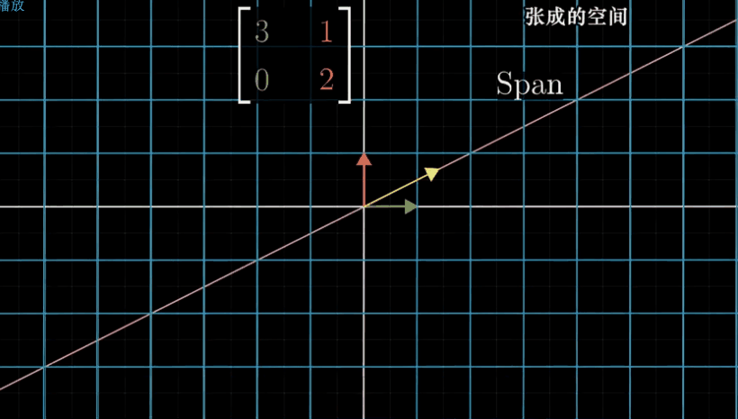
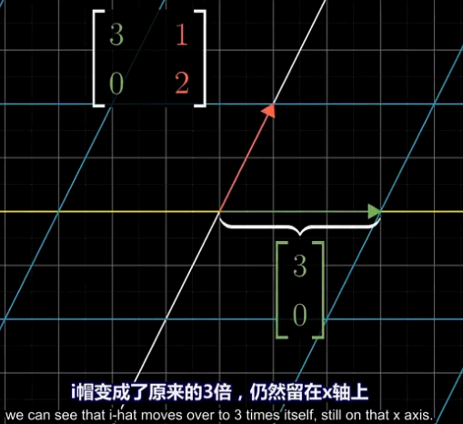
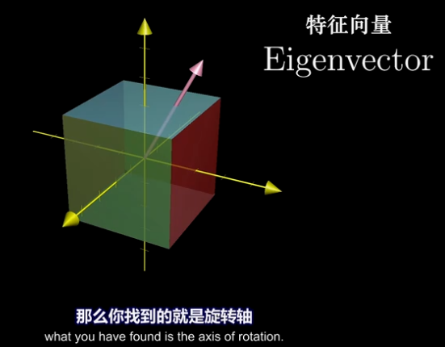
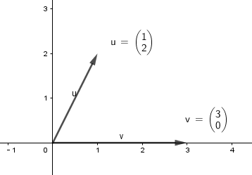
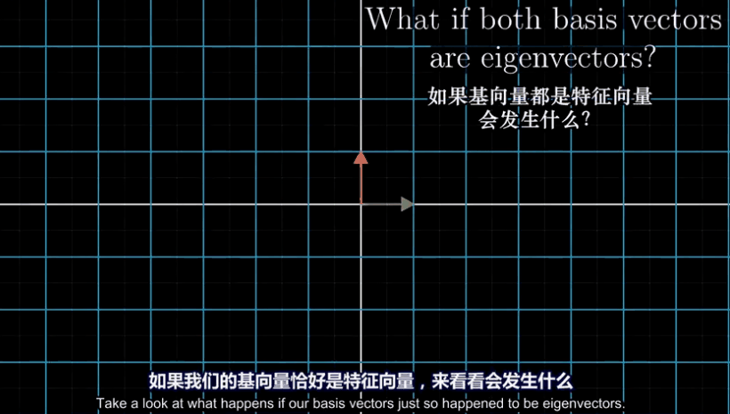
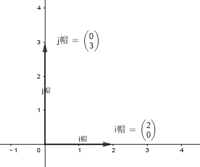

:toc:
:toclevels: 3
:sectnums:

== 特征向量 Eigenvector & 特征值 Eigen value

可以用这个公式, 来同时表达出这两者的关系: +
\begin{align}
\boxed{
A\vec{x} = \lambda\vec{x}
}
\end{align}

**即, 对一个非零的列向量 stem:[\vec{x}], 应用一个A矩阵变换, 变换后的结果, 就相等于只是对这个  stem:[\vec{x}] 向量做了一次同方向上的伸缩变换(即变成原来的 stem:[ \lambda]倍).** 则: +
-> λ : 就称为 矩阵A 的一个特征值（characteristic value), 或本征值（eigenvalue). +
-> stem:[\vec{x}] : 就是对应于 "特征值λ"  的"特征向量".

.标题
====
例如：
\begin{align}
A = \left[ \begin{matrix}
1	&6		\\
5	&2		\\
\end{matrix} \right],
\vec{u} = \left| \begin{array}{l}
	6\\
	-5\\
\end{array} \right|,
\vec{v} = \left| \begin{array}{l}
	3\\
	-2\\
\end{array} \right|
\end{align}

问, 向量u和v, 是否是A的 特征向量?

只要套入公式即可, 如果u是A的特征向量, 则必有: stem:[ A\vec{u}=λ\vec{u}], 向量v也是一样.

本例的结果是: Au = -4u, 说明 u 的确是 A 的特征向量. 特征值就是 -4.

Av 无法做出来等于 λv. 所以 v 不是 A 的特征向量.
====

---

==== 已知矩阵A, 来求其 "特征向量x", 和 "特征值λ"

套用公式:
\begin{align}
Ax = λx \\
Ax - λx = 0 \\
Ax - λEx = 0 \\
(A - λE)x = 0
\end{align}

这是一个齐次线性方程组. 由于x是特征向量, 不为零向量. 所以该齐次方程要有非零解(即非唯一解)存在的话, 其矩阵A 的行列式值必须 = 0 才行.

....
齐次线性方程组 的系数矩阵的秩r, 等于未知数个数n时，这时系数矩阵是满秩，其对应的行列式不为0，此时方程组有唯一零解。(齐次线性方程组有一个零解, 是显然解. 即: 齐次线性方程组总有零解，不存在无解的情况.)

齐次线性方程组 的系数矩阵的秩r, 小于未知数个数n时，其系数矩阵的行阶梯形, 必然包含0行. 这时对应的"行列式值"就=0了，方程组有无穷解。

也就是说，我们可以根据系数矩阵对应的行列式值是否为0, 来判断方程组解的情况:
-> |A|≠ 0, 则系数矩阵是满秩矩阵，此时方程组只有唯一的一个零解。
-> |A|= 0, 说明A有零行存在, 则方程组有无穷个解.
....

即, 原像x (即特征向量) 要不等于stem:[ \vec{0}]的话, 就必然有: stem:[ |A - λE| = 0 ] (即A有零行存在, x有无穷多解, 而不是只有一个必然存在的零解. 因为"特征向量"不能是零向量.)

这样:
[options="autowidth"]
|===
|Header 1 |Header 2

|stem:[ \|A - λE\| = 0]
|<- 叫 A 的"特征方程"

|stem:[ \|A - λE\|]
|<- 叫 A 的"特征多项式"
|===

总结: 求解出"特征向量x"与"特征值λ"的步骤:

1.先求出stem:[ |A-λE|=0] 的根λ, 就能得到"特征值": stem:[ λ_1, λ_2, ... λ_n]

2.对每一个特征值 stem:[ λ_i], 代入进 stem:[ (A - λE)x = 0] 的公式中, 即成为 stem:[ (A - λ_i E)x = 0 ], 来求出 x 的非零解. +
这第2步, 可以分两步操作: +
(1)先求 "stem:[  (A - λ_i E)x = 0]" 的基础解系 stem:[ p_1, ... p_r]. +
(2)然后, stem:[ k_1 p_1 + ... + k_r p_r] 就是 stem:[ λ_i] 的全部"特征向量". 但我们要排除掉 stem:[ k_1, ... k_r] 全为0 的情况, 因为如果这些k都等于0的话, 特征向量x 就会=0, 而"特征向量"是不能等于"零向量"的.

.标题
====
例如： 在一个森林里, 有猫头鹰 owl, 其食物主要是老鼠 rat. 假设在k时刻(单位:月), 两者的数量, 用一个向量 stem:[\vec{x} ] 来表示:

\begin{align}
& x^{kMonth} = \left| \begin{array}{l}
	Num_{owl}^{kMonth}\\
	Num_{rat}^{kMonth}\\
\end{array} \right| \\
& 即: 第k月的 两者的总数量 \vec{x} = \left| \begin{array}{l}
	第k月的猫头鹰owl的数量\\
	第k月的老鼠rat的数量\\
\end{array} \right|
\end{align}

并且这两种动物, 在下一个月的数量, 可以用下面式子来表示:

\begin{align}
& Num_{owl}^{kMonth +1} = 0.5 \ast Num_{owl}^{kMonth} + 0.4 \ast  Num_{rat}^{kMonth} \\
& ← 即:猫头鹰在下一个月(k月份+1)的数量 = 上一个月(k月份)的, 猫头鹰数量的0.5倍, 和老鼠数量的0.4倍, 两者之和. \\
\\
& Num_{rat}^{kMonth +1} = -0.104 \ast Num_{owl}^{kMonth} + 1.1 \ast  Num_{rat}^{kMonth} \\
& ← 即: rat 在下一个月的数量 = 上一个月的owl数量的 负0.104倍, 与 rat数量的1.1倍, 两者之和.\\
\end{align}

即:

\begin{align}
\underset{b}{\underbrace{\left| \begin{array}{l}
	Num_{owl}^{k+1}\\
	Num_{rat}^{k+1}\\
\end{array} \right|}}=\underset{A}{\underbrace{\left[ \begin{matrix}
	0.5&		0.4\\
	-0.104&		1.1\\
\end{matrix} \right] }}\underset{x}{\underbrace{\left| \begin{array}{l}
	Num_{owl}^{k}\\
	Num_{rat}^{k}\\
\end{array} \right|}}
\end{align}

即:
\begin{align}
\underset{A}{\underbrace{A}}\underset{x} {\underbrace{\vec{x}^k}} = \underset{b} {\underbrace{\vec{x}^{k+1}}}
\end{align}

也就是说: 把一个"数量变换矩阵A" 应用到 第k月时的 stem:[ \vec{x}] 身上, 就能得到下一个月(即k+1个月)时, stem:[ \vec{x}] 的新数值.

先把矩阵A的特征向量, 和特征值求出来. A 的"特征值"有两个, 所以对应的"特征向量"也有两个:

\begin{align}
& λ_1 = 1.02, 特征向量 p_1 = \left| \begin{array}{l}
10	\\
13	\\
\end{array} \right| \\
& λ_2 = 0.58, 特征向量 p_2 = \left| \begin{array}{l}
5	\\
1	\\
\end{array} \right|
\end{align}

特征向量, 是线性无关的, 所以 p1 和 p2 就是线性无关的, 它们就可以表示一组基, 能线性表示出 stem:[ R^2] 空间中的任何向量.

猫头鹰和老鼠的初始总数量, 我们用 stem:[ x^{(0)}] 来表示, 则就有:

\begin{align}
x^{(0月)} &= c_1 p_1 + c_2 p_2 ← c_1, c_2 是系数 \\
\\
x^{(1月)} &= A x^{(0月)}  \\
&= A (c_1 p_1 + c_2 p_2)  \\
&= c_1 (A p_1) + c_2 (A p_2) \\
& ← 注意: p是特征向量, 而特征向量有这个性质: A \ast 特征向量 = 特征值λ \ast 特征向量. 所以 A p = λ p \\
&= c_1 (λ_1 p_1) + c_2 (λ_2 p_2) \\
&= 1.02 c_1  p_1 + 0.58 c_2  p_2 \\
\\
x^{(2月)} &= A x^{(1月)}  \\
&= 1.02^2 c_1  p_1 + 0.58^2 c_2  p_2 \\
& ← 系数的指数增长. 即c系数的指数, 和等号左边的x的指数(即表示第几个月时), 完全一致 \\
\\
& ... ... \\
\\
x^{(k月+1)} &=   (1.02^{k+1} c_1  p_1) + (0.58^{k+1} c_2  p_2) ← 别忘了 p_1, p_2 是特征向量. \\
& 第二个括号部分, 其中的 0.58^{k+1}, 随着指数k的增大, 其值会迅速降低为0. 所以第二个括号就可以忽略不计. \\
&≈   (1.02^{k+1} c_1  p_1) \\
&= 1.02 \ast (1.02^k c_1  p_1) ← 注意括号部分, 其实就近似等于第k月时, 两种动物的总数量.\\
&≈ 1.02 \ast x^{(k月)} ← 即两种动物的总数量, 每月增长1.02倍\\
\end{align}
====

---

== Eigenvector 和 Eigen value 的几何意义

==== 特征向量 -> 线性变换后, 依然留在原"张成空间"上的那个向量.

特征向量::
变换后, 向量一般都会偏离原来的位置. **但如果有向量, 依然保留在原来的位置上, 就意味着该"变换"的作用, 仅仅是对该向量原地拉伸或压缩而已, 就如同一个标量所起的效果(即"数乘"效果). 则, 这种特殊的向量, 就被称为"特征向量".**

又如, i基向量, 被拉伸为原来的3倍, 但它依然留在原位置处 (留在原来的张成空间中), 所有 i就是 "特征向量".

---

==== 特征值 -> 即"特征向量"倍伸缩的倍数

特征值::
每个"特征向量", 都有一个所属的值, 叫**"特征值". 它用来衡量"特征向量"在变换后, 被伸缩了几倍?** 如, 上例中, 基向量i 被拉伸了3倍, 则"特征值" = 3.

---

== "特征向量"到底是什么东西, 它的用处是什么?

==== 特征向量, 是旋转轴

如果一个物体在三维空间中旋转, 那么它的"特征向量" 就是该物体的"旋转轴" axis of rotation. 因为它不随旋转而偏离原来的张成空间.

在这种情况下, 该旋转轴(即"特征向量") 的"特征值"为 1. 因为它不随旋转而被缩放.

---

==== 理解"线性变换"的关键, 依赖于"特征向量"和"特征值"

事实上, 理解"线性变换"的关键, 较少依赖于你的特定坐标系, 更好的方法是求出它的 Eigenvector 和 Eigen value.

线性变换的"特征向量"量（本征向量）, 其方向在该变换下不变。该向量在此变换下缩放的比例, 称为其"特征值"（本征值）。**一个线性变换, 通常可以由其"特征值"和"特征向量"完全描述。**

“特征”一词来自德语的 eigen。eigen一词可翻译为”自身的”、“特定于……的”、“有特征的”、或者“个体的”.

核心公式是: +
\begin{align}
\boxed{
\underset{新基矩阵.}{\underbrace{A}}\underset{要求的解}{\underbrace{\vec{v}}}=\underset{特征值.}{\underbrace{\lambda }}\underset{特征向量}{\underbrace{\vec{v}}}
}
\end{align}

- A: 是新基矩阵, 表示某种"变换规则".
- stem:[\vec{v}] : 就是"特征向量".
- λ : 是一个数(系数), 就是 特征向量 stem:[\vec{v}] 所对应的"特征值".

该等式的意思就是: 新基矩阵A, 作用于某个"特征向量 stem:[\vec{v}]"后, 所起的作用, 就相当于是 用一个系数λ (即"特征值"), 伸缩了该"特征向量 stem:[\vec{v}]" 的长度.

该等式可以进一步变化为一个"齐次方程": +
\begin{align*}
& A \vec{v} = λ \vec{v} \\
& A \vec{v} = λ E \vec{v} \\
& A \vec{v} - λ E \vec{v} = 0 \\
& \underset{把它整体看做一个新基矩阵}{\underbrace{\left( A-\lambda E \right) }}\cdot \vec{v}=0
 <- 即类似于 Ax=0 的形式. \\
\end{align*}

把 stem:[(A - λ E)] 整体看做是一个"新基矩阵", 它应用到 stem:[\vec{v}] 身上, 把它降维, 变换成了 stem:[\vec{0}].

其实是, **原坐标系空间, 被压缩成了零维. 就意味着该"新基矩阵"的行列式值 (面积), 为0. 即: stem:[|A - λ E|=0]**

我们就能求出 λ了.

.标题
====
例如： 求出下面坐标系空间中的"特征值 λ"

即: +
\begin{align*}
& A = \left[ \begin{array}{c|c}
	3&		1\\
	0&		2\\
\end{array} \right]
\end{align*}

根据公式:   +
\begin{align*}
& |A - λ E|=0 \\
& \left| \left[ \begin{matrix}
	3&		1\\
	0&		2\\
\end{matrix} \right] -\left[ \begin{matrix}
	\lambda&		\\
	&		\lambda\\
\end{matrix} \right] \right|=\ 0 \\
& \left| \begin{matrix}
	3-\lambda&		1\\
	&		2-\lambda\\
\end{matrix} \right|=0 \\
& (3-λ)(2-λ) = 0 \\
& λ=3 \quad 或 \quad λ=2
\end{align*}

现在, 特征值 λ 有了, 把它代回 stem:[(A-λE) \vec{v}=0] 公式中, 来算出 特征向量 stem:[\vec{v}] :

\begin{align*}
& (A-λE) \vec{v}=0 \\
& \left| \begin{matrix}
	3-\lambda&		1\\
	&		2-\lambda\\
\end{matrix} \right|\left| \begin{array}{l}
	x\\
	y\\
\end{array} \right|=0
\end{align*}
====

---

==== 所有的基向量, 都是"特征向量"

如同 单位矩阵E中, 每一列就是"正常坐标系"中的"基向量" 一样.
对于一个"对角矩阵", 如:
\begin{align*}
\left[ \begin{array}{c|c|c|c}
	-5&		&		&		\\
	&		-2&		&		\\
	&		&		-4&		\\
	&		&		&		4\\
\end{array} \right]
\end{align*}

它所有的基向量(即每一列), 都是"特征向量". all the basis vectors are eigenvectors.  +
矩阵对角线上元素的值, 就是它们所属的"特征值 λ". with the diagonal entries of the matrix /being their eigenvaluse.

.标题
====
又如：

\begin{align*}
& 新基矩阵 A = \left[ \begin{array}{c|c}
	2&		0\\
	0&		3\\
\end{array} \right]  \\
& 它的新基\hat{i}的值, 其实是这样来的: \\
& \hat{i} = A \cdot i = \left[ \begin{matrix}
	2&		0\\
	0&		3\\
\end{matrix} \right] \left| \begin{array}{l}
	1\\
	0\\
\end{array} \right|=\left| \begin{array}{l}
	2\\
	0\\
\end{array} \right|=2\underset{即\ i}{\underbrace{\left| \begin{array}{l}
	1\\
	0\\
\end{array} \right|}}  \\
& 头尾就是:  Ai = 2i <- 这个就是 A\vec{v} = \lambda \vec{v} 的形式\\
& 即: i 是特征向量, 2 是特征值.\\
\end{align*}

换言之, 基向量, 本身就是"特征向量". 新基矩阵中, 列上值, 就是该"列"对应的"新基向量"的"特征值".
====

一组基向量 (同样也是"特征向量") 构成的集合, 称为一组"特征基". 假设你要计算这个矩阵的100次幂, 一种更容易的做法是: 先把它变换到"特征基"下, 在那个坐标系中, 来做100次幂, 更容易计算. 然后再把结果转换回你当前的坐标系中.

不过, 不是所有变换都能进行这一过程. 比如说"斜切(剪切)"变换, 它的特征向量不够多, 并不能张成全空间.

---

== Eigenvector 和 Eigen value 的性质

==== stem:[A] 和 stem:[A^T] 有相同的"特征值", 但它们的"特征向量"不一定相同.

---

==== 若矩阵A 的n个"特征值"是 stem:[\lambda_1, \lambda_2, ...  \lambda_n], 则有:

[options="autowidth"]
|===
|Header 1 |Header 2

|1.所有的"特征值"之和, 等于矩阵A 的对角线元素 之和.
|即: +
\begin{align*}
\sum_{i=1}^n{\lambda_i} = \sum_{i=1}^n{a_{ij}}
\end{align*}

把主对角线元素都相加, 有一个术语来称它, 叫做"迹" tr(A).

|2.所有的stem:[\lambda] 相乘, 等于矩阵A的行列式值.
|即: +
\begin{align*}
\lambda_1 \lambda_1 ... \lambda_n = \|A\|
\end{align*}

那么等号左边, 其中只要有一个"特征值" stem:[\lambda=0], 则 stem:[\|A\|=0]. 矩阵A 就不可逆. 所有, 对于该矩阵A, 要想它可逆, 就要保证 所有的stem:[\lambda] 都不能是0.
|===

---

==== n阶方阵A, 互不相同的"特征值"stem:[\lambda_1, \lambda_2, ... \lambda_n] 对应的特征向量 stem:[\vec{v_1}, \vec{v_2},...\vec{v_m}] 线性无关.

---

==== kA 的特征值, 是 stem:[k\lambda]

\begin{align*}
根据核心公式: \quad & A\vec{x} = \lambda \vec{x} \\
两边同时乘上3, 就是: \quad   & 3A\vec{x} = 3\lambda \vec{x} \\
&  (3A)\vec{x} = (3\lambda) \vec{x} \\
& 即: kA的的特征值, 就是 k \lambda.
\end{align*}

---

==== stem:[A^2] 的特征值, 是 stem:[\lambda^2]

\begin{align*}
根据核心公式: \quad & A\vec{x} = \lambda \vec{x} \\
两边同时左乘A : \quad & AA\vec{x} = A\lambda \vec{x} \\
& A^2\vec{x} =\lambda(A \vec{x}) <- 核心公式已经告诉我们, 其实 A\vec{x} 就= \lambda \vec{x}\\
&  A^2\vec{x} =\lambda  \lambda \vec{x} \\
& A^2\vec{x} =\lambda^2 \vec{x} \\
& 即: A^2 的特征值, 是 \lambda^2
\end{align*}

即 stem:[\lambda] 与 stem:[A] 的指数次数相同. +
同理: stem:[\lambda^3] 是 stem:[A^3] 的特征值. +
stem:[\lambda^k] 是 stem:[A^k] 的特征值.

.标题
====
例如： 已知 A 的特征值是2, 问 stem:[A^5 + 6A^2 + A + 3E] 的特征值 = ?

根据 stem:[ \lambda]  与 "A 的指数次数"相同. 就有:

[options="autowidth"]
|===
|Header 1 |根据"核心公式"(stem:[A \vec{x} = \lambda \vec{x}]), 就有:
|stem:[A^5 ] 特征值是 stem:[2^5].
|stem:[A^5 \vec{x} = 2^5 \vec{x}]

|stem:[A^2 ] 特征值是 stem:[2^2].
|stem:[6 A^2 \vec{x} = 6 \cdot 2^2 \vec{x}]

|已知 A 的特征值是2
|stem:[A \vec{x} = 2 \vec{x}]

|E 的特征值: 单位矩阵的特征值皆为 1
|stem:[3 E\vec{x} = 3\vec{x}]

|所以,  stem:[(A^5 + 6A^2 + A + 3E)\vec{x}]
|stem:[= (2^5  +  6 \cdot 2^2  + 2 + 3)\vec{x} ]
|===

即: +
\begin{align*}
\underset{A}{\underbrace{\left( A^5 +6A^2 +A +3E \right) }}\vec{x} = \underset{特征值\ \lambda}{\underbrace{\left( 2^5+6\cdot 2^2 +2 +3 \right) }}\underset{特征向量}{\underbrace{\vec{x}}}
\end{align*}

所有,  stem:[A^5 + 6A^2 + A + 3E] 的特征值 stem:[= 2^5+6\cdot 2^2 +2 +3]

其实, 更快的技巧只需这样做: +
stem:[A^5 + 6A^2 + A + 3E], <- 把所有的A, 都替换成它们的"特征值", 把 E 替换成 1 (因为单位阵的特征值=1). 就能直接有: +
stem:[2^5 +6\cdot 2^2 +2 +3 \cdot 1]
====

---

==== stem:[A^{-1}] 的 特征值, 是 stem:[\frac{1} {\lambda}]

\begin{align*}
根据核心公式: \quad & A\vec{x} = \lambda \vec{x} \\
等号左右交换下: \quad & \lambda \vec{x} =  A\vec{x} \\
两边同时左乘 A^{-1} :\quad  & A^{-1}  \lambda \vec{x} = A^{-1}  A\vec{x} \\
& \lambda A^{-1} \vec{x} = \vec{x} \\
&  A^{-1} \vec{x} = \frac{1} {\lambda } \vec{x} <- 即:  A^{-1} 的特征值, 是 \frac{1} {\lambda } \\
\end{align*}

---

==== stem:[A^{\ast}] 的 特征值, 是 stem:[\frac{1} {\lambda} |A|]

---

==== 上(下)三角矩阵的"特征值λ", 就是其主对角线上的所有元素.

.标题
====
例如：
\begin{align}
A = \left[ \begin{matrix}
	λ_1& * & *		\\
	&  λ_2 & *		\\
	&   &  λ_3		\\
\end{matrix} \right]
\end{align}

该A的 特征值是什么?

根据公式:
\begin{align}
|A-\lambda E| &=  0 \\
\left[ \begin{matrix}
	\lambda _1-\lambda&	 * &		*\\
	&		\lambda _2-\lambda&		*\\
	&		&		\lambda _3-\lambda\\
\end{matrix} \right] &=0 \\
(λ_1 - λ)(λ_2 - λ)(λ_3 - λ) &= 0
\end{align}

所以, 特征值 stem:[ λ = λ_1, λ_2, λ_3]. 即就是 A 的主对角线元素.
====

所以就有定理: **上(下)三角矩阵的"特征值λ", 就是其主对角线上的所有元素.**

---

==== 对角阵 A, 其特征值, 也是其"主对角线上"的所有元素.

还有推论: 一个对角阵 A, 主对角线上元素为  stem:[  λ_1, λ_2, λ_3], 则其特征值, 就是  stem:[ λ = λ_1, λ_2, λ_3].

"对角阵"是一个方阵, 除了主对角线上的元素外，其余元素都等于零.

\begin{align}
对角阵 A\ =\ \left[ \begin{matrix}
	a_{11}&		&		&		\\
	&		a_{22}&		&		\\
	&		&		\ddots&		\\
	&		&		&		a_{nn}\\
\end{matrix} \right]
\end{align}

简记为 stem:[ A = diag{a_{11}, a_{22}, ..., a_{n n}}]

---

==== 单位阵E 的特征值, 也是"主对角线上"的所有元素, 即 n个1. (n重特征值, 都是1)

---

