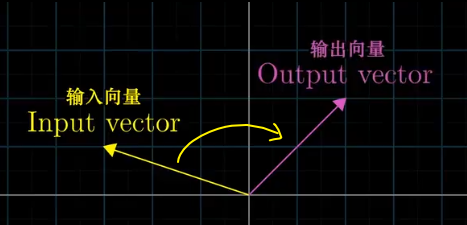
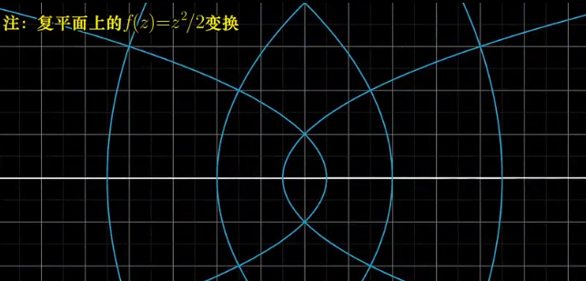
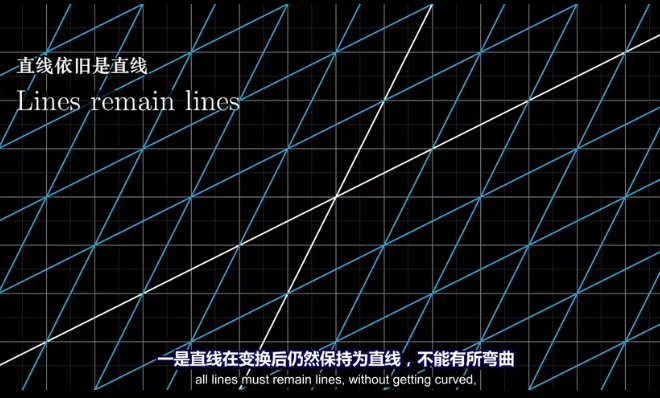
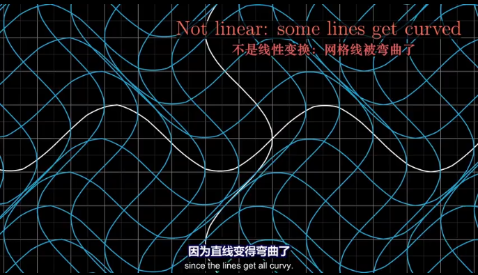
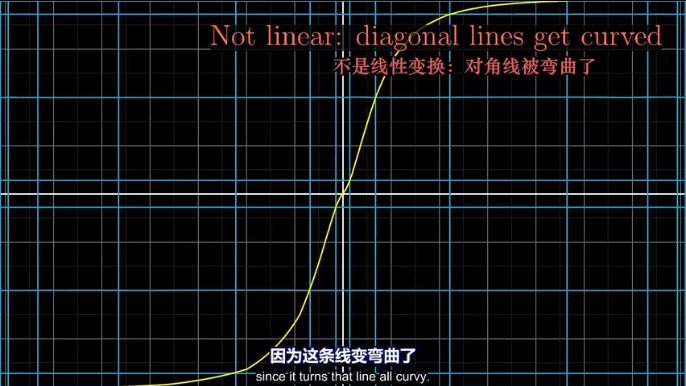
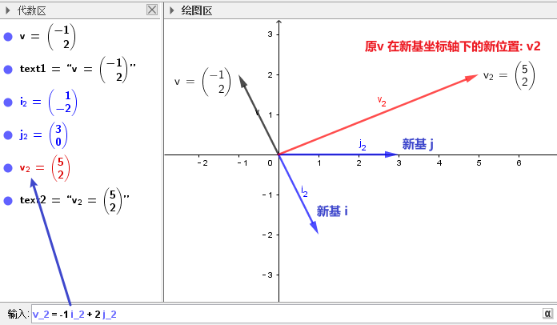
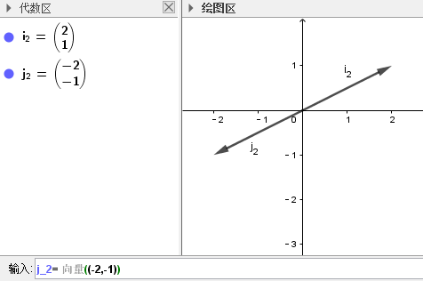

:toc:

== 线性变换 = 函数

线性变换中的"变换"二字, 其实是"函数"的另一种说法, 它们所起的作用其实是一样的. 即: 它把一种形式, 输出成另一种形式.

linear transformation = function

\begin{align}
\underset{输入的向量}{\underbrace{|\vdots |}}\rightarrow \underset{函数}{\underbrace{L\left( \overrightarrow{v} \right) }}\rightarrow \underset{输出成新的向量}{\underbrace{|\vdots |}}
\end{align}

**L() 相当于一个函数, 括号里接收一个参数(类型是向量). 该函数返回一个做了"新基矩阵"变换后的新向量.** 即把原向量, 做了"扭曲变形, 旋转, 斜切, 拉伸"等操作.

即: +
\begin{align}
\underset{①输入一个坐标值}{\underbrace{\left[ \begin{array}{l}
	x_{in}\\
	y_{in}\\
\end{array} \right] }}\rightarrow \underset{②变换规则,函数体}{\underbrace{fn\left(  \right) }}\rightarrow \underset{③输出一个新坐标值}{\underbrace{\left[ \begin{array}{l}
	x_{out}\\
	y_{out}\\
\end{array} \right] }}
\end{align}

即: stem:[ A\vec{x} =\vec{b}] 的本质, 可以用函数来表示: stem:[ fnA(\vec{x})= \vec{b}].  输入x向量, 输出另一个b向量.

所谓的 求解出 stem:[ \vec{x}], 就好比黑洞A 扭曲了空间, 我们要从被扭曲后的"异像stem:[ \vec{b}]", 倒推来找回扭曲前的它的"原像stem:[ \vec{x}]".

==== 满足什么条件, 才是"线性的变换"?

满足以下两条性质的变换, 就是"线性"的:

[options="autowidth"]
|===
|Header 1 |Header 2

|1.可加性:  +
stem:[L(\vec{v} + \vec{w}) = L(\vec{v}) + L(\vec{w})]
|即: 和的变换, 效果 = 变换的和

|2.成比例: +
stem:[L(c \vec{v}) = c L(\vec{v})]
|即: 先伸缩,后变换 = 先变换, 后伸缩
|===

微积分中的求导, 同样具有"可加性" 和 "成比例性":

① stem:[\quad \frac{d}{dx} (x^3 + x^2)= \frac{d}{dx} (x^3) + \frac{d}{dx} ( x^2)]

② stem:[\quad \frac{d}{dx} (4 x^3)= 4 \cdot \frac{d}{dx} (x^3) ]

---

== 变换有"线性"的, 就有"非线性的"

如果变换将原坐标轴, 扭曲成了曲线式的, 这就不属于"线性变换"了. 如: +

即, "线性"类的变换, 必须符合这几个条件:

1.直线在变换后, 依然为直线, 不能变弯曲.

2.坐标轴的原点, 必须保持在固定的原来原点位置, 即坐标轴整体不能平移. The origin must remain fixed in place.

3."线性"类的变换, 不会改变网格间的"等距分布". 即: 变换前是等距的, 变换后依然是等距的. +
<- 这能令我们得到一个重要的推论: **变换前, 向量v 是单位基 i 和 j 的一个特定的线性组合, 那变换后的向量v, 依然是新基 stem:[ \hat{i}] 和 stem:[ \hat{j}] 的同样的线性组合.**

比如, 若一个向量v的终点是(-1,2), 它其实是: +
\begin{align}
\vec{v} & = -1i + 2j \\
& = -1\left| \begin{array}{c}
	1\\
	0\\
\end{array} \right|+2\left| \begin{array}{c}
	0\\
	1\\
\end{array} \right| \\
& = \left| \begin{array}{c}
	-1\\
	2\\
\end{array} \right|
\end{align}

如果"新基坐标"变换成了 stem:[ \hat{i}] 和 stem:[ \hat{j}], 则在新基坐标轴下, 向量v的终点位置, 就会变换成: +
\begin{align}
& \boxed{
新 \vec{v} = -1 \hat{i} + 2 \hat{j} } \\
& 若 \hat{i} = \left| \begin{array}{c}
	1\\
	-2\\
\end{array} \right|,
\hat{j} = \left| \begin{array}{c}
	3\\
	0\\
\end{array} \right| \\
& 则 新的\vec{v} =
-1\left| \begin{array}{c}
	1\\
	-2\\
\end{array} \right|+2\left| \begin{array}{c}
	3\\
	0\\
\end{array} \right|
= \left| \begin{array}{c}
	-1\\
	2\\
\end{array} \right| + \left| \begin{array}{c}
	6\\
	0\\
\end{array} \right| =\left| \begin{array}{c}
	5\\
	2\\
\end{array} \right|\
\end{align}

**换言之, 我们只要知道了新基(stem:[\hat{i} 和 \hat{j} ])向量终点的坐标位置, 就能推算出任意原向量, 在变换后的新位置.** 而不用去管这个变换, 具体过程是怎样的 (旋转, 切线还是什么的)

---

== 我们将新基坐标, 包装在一个矩阵A中 -> 就有 Ax=b, x是原像, b是"新基坐标系下的x的新像"

对于2维平面, 通常, 我们将"新基"的坐标, 包装在一个2阶矩阵中. 如: +
\begin{align}
\left[ \begin{array}{c|c}
	3&		2\\
	\underset{新i}{\underbrace{-2}}&		\underset{新j}{\underbrace{1}}\\
\end{array} \right]
\end{align}

**矩阵中的每一列, 就是"新基坐标系"中的一个轴 (即"新单位基"向量, 终点的坐标)**

所以: +
\begin{align}
& 对于某向量v\ =\left| \begin{array}{l}
	a\\
	b\\
\end{array} \right|,\ 若新基是\left[ \begin{array}{c|c}
	i_x&		j_x\\
	i_y&		j_y\\
\end{array} \right] \\
& 则, 新基坐标系下的v向量, 终点坐标就会变成: \\
& 新v=\left[ \begin{array}{c|c}
	i_x&		j_x\\
	i_y&		j_y\\
\end{array} \right] \left| \begin{array}{l}
	a\\
	b\\
\end{array} \right|\ =\left| \begin{array}{l}
	i_xa+j_xb\\
	i_ya+j_yb\\
\end{array} \right|
\end{align}

**所以: "新基矩阵 * v = 新v", 其实就是 "Ax=b" 这种形式. x是原像, A是新基矩阵, b是"x被新基矩阵A变换后, 移位后的新坐标值(新像)".**

因为任何向量, 都能表示为"基向量"的线性组合. 所以"基向量"的变动, 就决定了其他向量的变动. 正所谓"纲举目张" (相当于你左右胳膊的位置, 决定了你头所处的位置.)

---

== 从"基坐标"的变化上, 就能看出"整体的坐标系空间"发生了什么变化(如降维, 升维了)

如: +
\begin{align}
原基为\left[ \begin{matrix}
	1&		0\\
	0&		1\\
\end{matrix} \right] ,\ 新基为\left[ \begin{matrix}
	2&		-2\\
	1&		-1\\
\end{matrix} \right]
\end{align}

你发现, 新基的两个轴, 被变换到同一条直线上去了. 这就说明, "原基坐标系"的二维平面空间, 变换后, 变成了一维空间(本例准确说是二维空间中的一条直线上), 被压缩降维了.

所以, **"线性变换"的本质, 其实是通过变形"原坐标系", 来操纵空间的一种手段.**

stem:[ A \vec{x}= \vec{b}],  或 stem:[ A \vec{x}= \vec{0}]

因此, **每当你看到一个矩阵时, 都可以把它解读为"一种对空间(原坐标系)的一种特定的变换". 它就是起到这个作用.**

所以, **如果在 stem:[ \vec{x}] 前面, 有多个新基矩阵, 连乘存在, 就意味着这是对 stem:[ \vec{x}] 做了一系列分步骤进行的变换.**

其实, 这三步可以先合并起来, 即我们先把这三个矩阵先乘起来, 就得到复合后的"新基矩阵", 直接一次性作用于 stem:[ \vec{x}] 即可. 这就类似于"复合函数"的概念: stem:[ h(g(f(x)))].

这也就证明了: stem:[ A(BC) = (AB)C ]. <- 复合变换. (但注意: ABC 的左右顺序不能变)

计算的目的, 不在于数字本身, 而在于洞察其背后的意义. The purple of computation is insight, not numbers.

---

