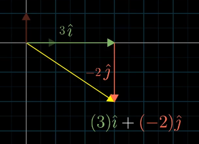
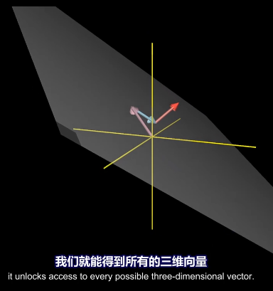

:toc:

== 向量 vector

通常, 当你考虑"一个"向量时, 就把它看成是"箭头". +
当你考虑"多个"向量时, 就把它看成是"箭头终点"的那个点(point).

注意: 向量的值, 表示的是坐标轴的位置, 而不是该向量线段的长度(即不是"模"的概念).

image:../img/0014.png[]

---

== 系数k的作用, 是把向量伸缩 k倍

\begin{align}
2\left| \begin{array}{l}
	x\\
	y\\
\end{array} \right|=\left| \begin{array}{l}
	2x\\
	2y\\
\end{array} \right|
\end{align}

image:../img/0015.png[]

系数k 为负数的话, 就是把向量朝"反方向"伸缩 k倍.

---

== 单位向量 (基 basis)

The **basis** of a vector space /is a set of linearly independent vectors /that span the full space.

image:../img/0016.png[]

\begin{align}
\left. \begin{array}{r}
	\hat{i} = 1\\
	\hat{j} = 1\\
\end{array} \right\} 称为"单位向量"或"基"
\end{align}

事实上, 每当我们描述一个向量时, 它都依赖于我们正在使用的"基". +
\begin{align}
\vec{v}=\left| \begin{array}{l}
	3\\
	-2\\
\end{array} \right|= 3 \hat{i} + (-2)\hat{j}
\end{align}

向量的终点坐标, 其实就是系数倍的"基向量"的线性组合.

---

== 张成 span

the span of stem:[ \vec{v}] and stem:[\vec{w} ]  /is the set of  all their linear combinations.

the set of all possible vectors /than you can reach /is called the span of those two vectors. <- 相当于"势力范围", 就是张成.

两个斜率不同的向量(a,b), 自由伸缩, 它们的和(即a+b=c),即新向量c的终点, 能遍及二维平面上的任何点处.

image:../img/0018.png[]

但如果两个向量都是零向量的话, 它们的系数倍的和, 也永远被束缚在原点(0,0)了. +
stem:[ k_1 \vec{0}  +  k_2 \vec{0}=0]

三维空间中, 两个斜率同的向量, 能张成出过原点的一个平面. +
image:../img/0019.png[]

三维空间中, 三个斜率不同的向量, 它们的和, 能张成出三维空间中所有的地方. +

---

