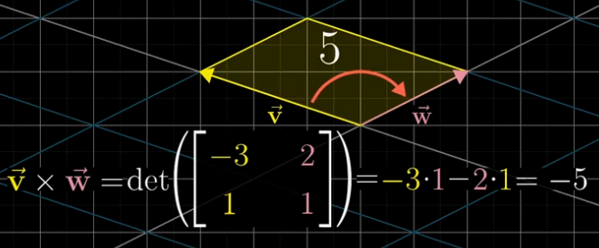
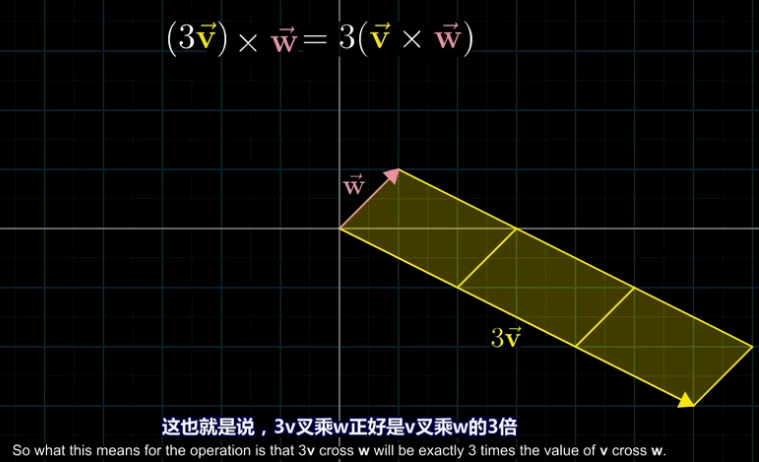
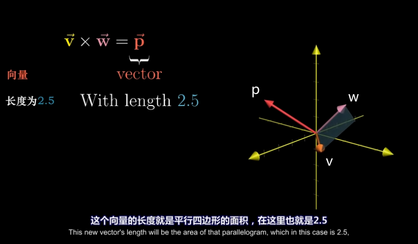
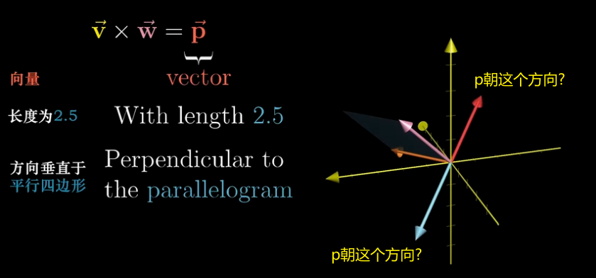
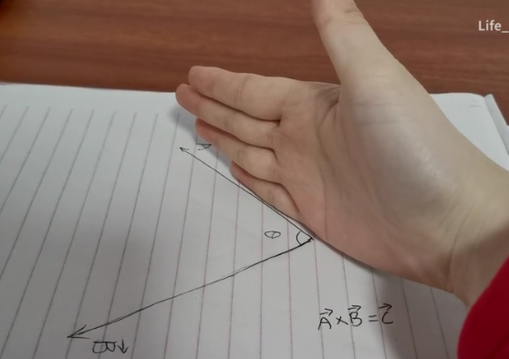
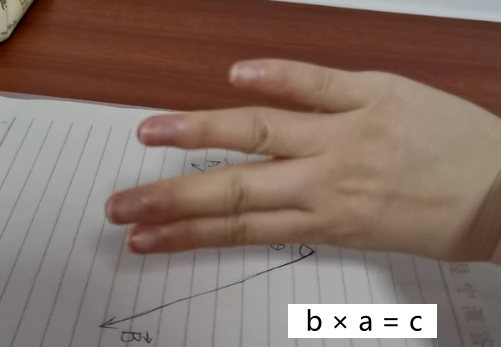
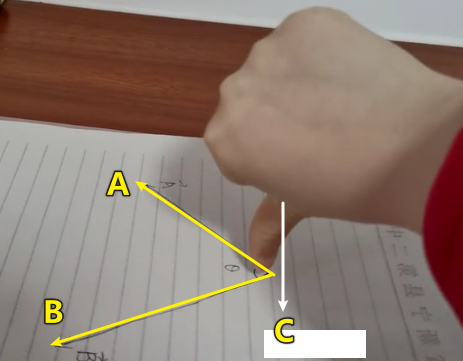

:toc:
:toclevels: 3
:sectnums:

== ★ 向量的 #叉积 (外积)# exterior product 或  cross product

---

== 向量"叉积 (外积) stem:[\times]" 的几何意义 -> stem:[\vec{v} \times \vec{w}] : ①在二维空间中, 是由这两个向量围成的"平行四边形"的面积, 即是一个数值. ②在三维空间中, 是一个垂直于这个"平行四边形"平面的"新向量".

几何意义上, **叉积, stem:[\vec{v} \times \vec{w}], 就是由这两个向量围成的"平行四边形"的面积.**

image:../img/0047.png[500,500]

注意: 顺序会对"叉积"有影响: 如果 stem:[\vec{v} \times \vec{w}] 是正数, 则 stem:[\vec{w} \times \vec{v}] 就是负数. 即: 交换叉乘时的顺序, 值要变号.

之前说过, **行列式的值, 就是表示的是: 将基 stem:[i \times j] 的面积, 缩放多少倍.**

面积的概念, 也就证明了: +
\begin{align*}
3(\vec{v} \times \vec{w}) = 3 \vec{v} \times \vec{w}
\end{align*}

把平行四边形其中的任一一条边, 延长3倍 (变成 stem:[ 3 \vec{v} 或  3 \vec{w}]), 面积也就是 stem:[= 3 (\vec{v} \times \vec{w})]

其实, **真正的"叉积", 是通过两个三维向量, 来生成一个新的三维向量. 注意: 叉积的结果不是一个数, 而是一个向量!**

比如: 假设 stem:[\vec{v} \times \vec{w} = 2.5], 在三维空间中, 这两个向量构成一个平面(平行四边形). 它们的"叉积"构成一个新向量 stem:[\vec{p}=2.5], 它与"平行四边形"所在的面"垂直".

但垂直于一个平面的向量, 可以由正反两个方向, stem:[\vec{p}] 到底是朝哪个方向呢?

这就要用到"右手螺旋法则".

---

== 右手螺旋法则

注意顺序: stem:[\vec{a} \times \vec{b} = \vec{c}], 和 stem:[\vec{b} \times \vec{a} = \vec{c}], -> stem:[\vec{c}] 的方向朝向是不同的.

====  stem:[\vec{a} \times \vec{b} = \vec{c}]

1.用右手, 伸展手指, 朝向 stem:[ \vec{a}] +

2.然后, 握拳, 手指收回, 朝向  stem:[ \vec{b}] 的方向. +
image:../img/0053.png[]

3.则, 大拇指朝向的方向, 就是 stem:[\vec{a} \times \vec{b} = \vec{c}] 中, stem:[ \vec{c}] 的朝向. +
image:../img/0054.png[]

---

==== stem:[\vec{b} \times \vec{a} = \vec{c}]

1.食指朝向 stem:[\vec{b}] 的方向. +

2.握拳, 食指等收回. 此时大拇指的方向, 就是 stem:[\vec{b} \times \vec{a} = \vec{c}] 中 stem:[ \vec{c}] 的朝向. +

---

