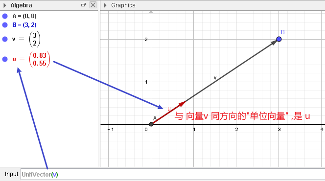
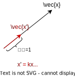
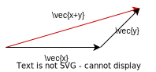

:toc:
:toclevels: 3
:sectnums:

== 向量的模(范数) length 或 norm 或 module -> 计算公式 stem:[ ∥x∥ = \sqrt{\vec{x} \cdot \vec{x}]

即 向量本身的长度 (而非终点坐标值).

\begin{align}
\lVert x \rVert = \sqrt{\overrightarrow{x}\cdot \overrightarrow{x}}\ = \ \sqrt{x^T x}
\end{align}

---

== 单位向量 unit vector : 长度为1

则, 长度为1 的向量, 就是"单位向量". 即: +
\begin{align}
单位向量: \lVert x \rVert = 1
\end{align}

---

=== ★ 单位化 normalize -> 求法公式: 向量x 的"单位向量" = 向量x 除以 它自己的模长

所谓"单位化": 就是去找一个与 stem:[ \vec{x}] 同方向的"单位向量"出来.

那么, stem:[ \vec{x}] 的单位向量是什么?

\begin{align}
& 首先, 单位向量 \vec{x'}, 可以表示为是 \vec{x} 的系数倍. 即: \vec{x'} = k \vec{x} \\
& 根据模长的公式: \lVert \vec{x'} \rVert = \sqrt{k \vec{x} \cdot k \vec{x}} = 绝对值|k| \cdot \lVert \vec{x} \rVert \\
& 即:  \lVert \vec{x'} \rVert = |k| \cdot \lVert \vec{x} \rVert \\
& |k| = \frac{\lVert \vec{x'} \rVert}{\lVert \vec{x} \rVert} <- 单位向量 x'的模长=1 \\
& k = \pm \frac{1}{\lVert \vec{x} \rVert} \\
\end{align}

系数k 有了, 则 单位向量x' 也能算出来了: +
\begin{align}
& 因为: x' = kx <- 把刚才算出的系数k, 代入进来 \\
& \boxed{
\vec{x'} = \frac{1}{\lVert \vec{x} \rVert} {\vec{x}}
} <- 即: \vec{x} 的单位向量, 就等于 \vec{x}自己, 除以它自己的模长 \\
\end{align}

.标题
====
例如： +
\begin{align}
& 问: x =\left| \begin{array}{l}
	2\\
	3\\
\end{array} \right| 的单位向量是什么? \\
& 根据"单位向量"公式:  \vec{x}的单位向量 x' = \frac{\vec{x} 自己 }{\vec{x}的模长} \\
& \vec{x} 的模长 = \sqrt{\vec{x} \cdot \vec{x}}  \\
& x'\ =\ \underset{分母上,\ 是向量x的模长}{\underbrace{\frac{1}{\sqrt[]{2\cdot 2+3\cdot 3}}}}\ \cdot \underset{向量x自己}{\underbrace{\left| \begin{array}{l}
	2\\
	3\\
\end{array} \right|}}\ \\
& x'\ =\ \underset{系数k}{\underbrace{\frac{1}{\sqrt[]{13}}}}\ \underset{向量x}{\underbrace{\left| \begin{array}{l}
	2\\
	3\\
\end{array} \right|}}\
\end{align}
====

---

== 模长的性质

==== stem:[‖k \vec{x} ‖ = |k| \cdot‖\vec{x}‖ ]

即: (kx)整体的模长 = "绝对值k" 乘以 "向量x的模长".

即:
\begin{align}
\lVert k \vec{x} \rVert = |k| \cdot \lVert x \rVert
\end{align}

---

==== stem:[‖ x+y ‖ <= ‖x‖ + ‖y‖]

其实就是, 三角形两边之和 ( stem:[‖x‖ + ‖y‖ ] ), 大于第三边 (stem:[ ‖ x+y ‖])

---
