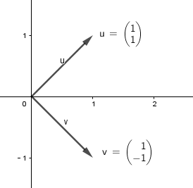
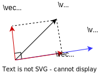
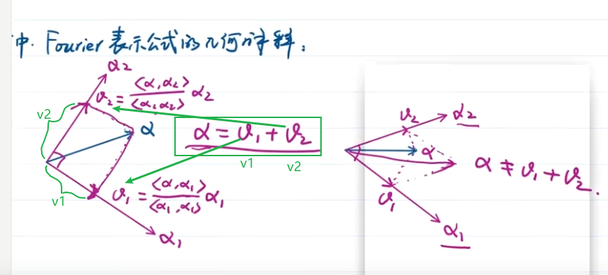

:toc:
:toclevels: 3
:sectnums:

== 两个向量互相垂直, 就叫做 #"正交"# Orthogonality

若 stem:[ \vec{x} \cdot \vec{y} = 0], 即它们的夹角 stem:[ \theta = 90°], 则这两个向量就是互相垂直的, 称为"正交".

Orthogonality::  /ɔːθɒ-ɡə-ˈnæ-lɪti/ n. [数] 正交性；相互垂直

如:
\begin{align}
\left| \begin{array}{l}
	1\\
	0\\
\end{array} \right|,\ \left| \begin{array}{l}
	0\\
	1\\
\end{array} \right|\ \gets \ 这两个向量正交
\end{align}

又如, 下面两个向量, 也是正交的, 它们互相垂直. 夹角=90° +

可以知道: 若两个向量 a 和 b 正交，那么它们的点积就是0, 即:  stem:[ a \cdot b = 0]

---

==== stem:[ \vec{0}] 与任何向量, 都是"正交"的

因为 stem:[\vec{0} \cdot \vec{x} = 0], 于是就: 零向量与任何向量, 都是"正交"关系了.

---

==== ★ 在统计学中, 向量的角度, 常用来衡量两组数据的"接近(相近)程度".

换言之, 单组数据中的所有元素, 都可以放在一个向量里 (一个维度中放一个元素, 你向量设为几十万的维度都行, 就能放几十万个元素数据). +
这样, 每组数据, 就被我们转换形式成了"向量", 就能对它们, 进行"任意两个向量间角度"的比较.

---

== 正交向量组 orthogonal vector group -> 它的每个向量, 一定是"线性无关"的. 可以作为生成空间里的一组"基", 称为"正交基".

由一组非零的 两两正交(即内积为0)的向量, 构成的向量组, 就是"正交向量组".

定理: 若 stem:[ \vec{x_1}, \vec{x_2}, ... \vec{x_r}] 是 "正交向量组", 则  stem:[ \vec{x_1}, \vec{x_2}, ... \vec{x_r}]  是 "线性无关"的.

---

==== 正交基 orthogonal basis

orthogonal::  /ɔr-ˈθɑ-ɡə-nəl/ adj. [数] 正交的；直角的. n. 正交直线 +
ADJ relating to, consisting of, or involving right angles; perpendicular 直角的; 垂直的

即, 一组基向量, 它们彼此两两是正交的, 它们就被称为"正交基".

---

==== 标准正交基 Orthonormal basis

即, 一组向量, 如果它们满足下面3个条件, 它们就是"标准正交基" :

1. 它们是"基向量"
2. 它们满足"正交向量组", 彼此两两"正交"关系.
3. 它们是单位向量, 即模长=1, stem:[‖\vec{x_i}‖ =1]

---

==== 定理 (fourier 表示公式): 若 stem:[ \vec{x_1}, x_2, ... x_r] 是一组"正交基", 则有 ->   stem:[\vec{x}=\underset{系数k}{\underbrace{\frac{\vec{x}\cdot \vec{x}_1}{\vec{x}_1\cdot \vec{x}_1}}}\vec{x}_1+\underset{系数k}{\underbrace{\frac{\vec{x}\cdot \vec{x}_2}{\vec{x}_2\cdot \vec{x}_2}}}\vec{x}_2+...+\underset{系数k}{\underbrace{\frac{\vec{x}\cdot \vec{x}_r}{\vec{x}_r\cdot \vec{x}_r}}}\vec{x}_r ]

定理: 若 stem:[ \vec{x_1}, x_2, ... x_r] 是 V 的一组"正交基", 则的任意 stem:[ \vec{x} \in R], 有:

\begin{align}
\boxed{
\vec{x}=\underset{系数k}{\underbrace{\frac{\vec{x}\cdot \vec{x}_1}{\vec{x}_1\cdot \vec{x}_1}}}\vec{x}_1+\underset{系数k}{\underbrace{\frac{\vec{x}\cdot \vec{x}_2}{\vec{x}_2\cdot \vec{x}_2}}}\vec{x}_2+...+\underset{系数k}{\underbrace{\frac{\vec{x}\cdot \vec{x}_r}{\vec{x}_r\cdot \vec{x}_r}}}\vec{x}_r
}
\end{align}

上面这个式子是怎么来的? 证明过程如下:

第1步: 任意 stem:[ \vec{x}] 可以表示为  stem:[ \vec{x_1}, x_2, ... x_r] 的线性组合:

\begin{align}
令 \vec{x} =\ k_1 x_1\ +\ ...\ +\ k_r x_r\ \gets 线性表示
\end{align}

第2步: 首先求系数 stem:[ k_1]

\begin{align}
& 令 \vec{x} =\ k_1x_1\ +\ ...\ +\ k_rx_r\ \gets 线性表示\\
& 等号两边同时乘上\ x_1 : \\
& x \cdot x_1\ =\ \left( k_1x_1\ +\ ...\ +\ k_rx_r \right) \cdot \ x_1 \\
& x\cdot x_1=\ k_1x_1x_1\ +\ k_2\underset{它们是正交基,内积就=0}{\underbrace{x_2x_1}}\ +\ ...\ +\ k_r\underset{=0}{\underbrace{x_rx_1}} \\
& x\cdot x_1=\ \ k_1x_1x_1 \\
& k_1=\frac{\ x\cdot x_1}{x_1x_1}
\end{align}

第3步: 依上面的步骤, 求出所有的系数 stem:[ k_2, k_3, ... k_r]

\begin{align}
\boxed{
k_r=\frac{ \vec{x} \cdot \vec{x_r}} { \vec{x_r} \cdot \vec{x_r}}
}
\end{align}

---

==== 定理: 若 stem:[ \vec{x_1}, x_2, ... x_r] 是一组"标准正交基", 则有 -> stem:[ \vec{x}=\underset{系数 k_1}{\underbrace{\left( \vec{x}\cdot \vec{x}_1 \right) }}\vec{x}_1+\underbrace{\left( \vec{x}\cdot \vec{x}_2 \right) }\vec{x}_2+...+\underset{系数 k_r}{\underbrace{\left( \vec{x}\cdot \vec{x}_r \right) }}\vec{x}_r]

若 stem:[ \vec{x_1}, x_2, ... x_r] 是一组"标准正交基", 则上面的公式, 系数部分, 即:

\begin{align}
系数 k_r=\frac{ x \cdot x_r}{x_r x_r}
\end{align}

分母部分是 =1的, 因为"标准正交基"的模长=1.

所以, 系数就能直接是:

\begin{align}
\boxed{
系数 k_r = \vec{x} \cdot \vec{x_r}
}
\end{align}

因此, 完整的 stem:[ \vec{x}] 的公式就是:

\begin{align}
\boxed{
\vec{x}=\underset{系数 k_1}{\underbrace{\left( \vec{x}\cdot \vec{x}_1 \right) }}\vec{x}_1+\underbrace{\left( \vec{x}\cdot \vec{x}_2 \right) }\vec{x}_2+...+\underset{系数 k_r}{\underbrace{\left( \vec{x}\cdot \vec{x}_r \right) }}\vec{x}_r
}
\end{align}

---

==== 向量的"正交分解" orthogonal decomposition

物理中, 将一个力F, 分解为stem:[P_1]和stem:[ P_2]两个"相互垂直"的分力的方法，叫作力的"正交分解"。

即: 有 stem:[ \vec{x}, \vec{x_1} \in R^n], 则 stem:[ \vec{x}] 可以分解为两个向量之和, 即: stem:[ \vec{x} = \vec{a} + \vec{b} ], 其中: +
-> stem:[ \vec{a}] 与 stem:[ \vec{x_1}] 共线. +
-> stem:[  \vec{b}] 与 stem:[ \vec{a}] 正交.

这样, 就称 a 为 x 在 stem:[ \vec{x_1}] 上的"正交投影向量".

那么, stem:[ \vec{a}] 的值是什么呢? 即 x 在 stem:[ x_1] 上的投影的长度是多少?

因为 a 与 stem:[ x_1] 共线, 所以就可以用系数(倍数)来表示它们的关系:
\begin{align}
a = k x_1
\end{align}

b是多少呢?
\begin{align}
& 因为向量 a+b=x \\
& b=x-a <- 把刚才求出的 a = k x_1 代进去\\
& b= x - k x_1 \\
\end{align}

因为向量 a 和 b 要满足"正交"关系, 即它们的内积 =0. 即有:
\begin{align}
& a \cdot b =0 \\
& 即: \underset{a}{\underbrace{\left( kx_1 \right) }}\cdot \underset{b}{\underbrace{\left( x-kx_1 \right) }}=0 \\
& k = \frac{x \cdot x_1} {x_1 x_1}
\end{align}

系数k 有了, 代入 stem:[a = k x_1 ]中, 就能求出 a 了:
\begin{align}
\boxed{
\vec{x} 在 \vec{x_1}上的投影长度, 即 \vec{a} =\underset{系数k}{\underbrace{\frac{x\cdot x_1}{x_1x_1}}} \cdot x_1
}
\end{align}

你回过头来看之前学过的这个定理:

.定理
====
定理: 若 stem:[ \vec{x_1}, x_2, ... x_r] 是 V 的一组"正交基", 则的任意 stem:[ \vec{x} \in R], 有:

\begin{align}
\boxed{
\vec{x}=\underset{系数k}{\underbrace{\frac{\vec{x}\cdot \vec{x}_1}{\vec{x}_1\cdot \vec{x}_1}}}\vec{x}_1+\underset{系数k}{\underbrace{\frac{\vec{x}\cdot \vec{x}_2}{\vec{x}_2\cdot \vec{x}_2}}}\vec{x}_2+...+\underset{系数k}{\underbrace{\frac{\vec{x}\cdot \vec{x}_r}{\vec{x}_r\cdot \vec{x}_r}}}\vec{x}_r
}
\end{align}
====

你会发现, 任意向量 stem:[ \vec{x}] 可以表示为 : 它在 stem:[ x_1] 上的投影长度, 加上它在stem:[ x_2] 上的投影长度, 加上..., 加上它在stem:[ x_r] 上的投影长度 的总和.

从几何上, 也能看出来这一点:

如上图, α = 它在 α1 和 α2 上投影长度 的相加.

**注意: 该性质只对"正交分解"(即 α1 和 α2 必须是垂直的)有效. 如果 α1 和 α2 不垂直, 那 α 就不等于 它在 α1 和 α2 上的投影长度的相加了. 如图右边的情况.**

---

