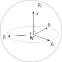
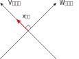

:toc:
:toclevels: 3
:sectnums:

== 一个向量与一个空间的正交

有:

- 向量: stem:[ \vec{x}] 是属于 stem:[ R^n] 中的向量.
- 空间: W 是一个stem:[ R^n] 的子空间.
- 还有 stem:[ \vec{y}], 所有的 向量y 都属于W空间内.

如果有 stem:[ x \cdot y = 0], 就称:  stem:[ \vec{x}] 与 W空间 "正交". 记作: stem:[ \vec{x} ⊥ W ]

---

== 两个空间的正交

V,W 是 stem:[ R^n] 的两个子空间, 若 V中的任意向量, 与 W中的任意向量,都"正交", 就称: V与W 正交. 记作 stem:[ V ⊥ W].

比如一个房间，地面是一个子空间 ，两面墙的"交线"是另一个子空间 ，这两个子空间是正交的。 +
两面看起来垂直的墙不是正交的，因为它们相交于一条直线，这条直线同时存在于两个子空间，它不可能自己垂直于自己。

如果一个向量, 同时位于两个"正交"的子空间内，那这个向量一定是零向量，只有零向量自己垂直于自己。

---

== 正交补 orthogonal complement

与W空间"正交"的"所有向量"构成的集合, 称作 W空间的"正交补". 记作: stem:[ W^⊥]  +
即: stem:[ W^⊥ = { \vec{x} \in R^n | \vec{x} ⊥ W}]

如下图, 在二维平面上:

stem:[ \vec{x} ⊥ W]. +
并且可以看出: 与W子空间 正交的所有向量, 都在V子空间上, 所以, stem:[ W ⊥ V], 并且 stem:[W^⊥ = V ]

但是, 在三维空间中, 即 stem:[ R^3] 中, 有三个基轴 X, Y, Z . 则 X的正交补, 就不仅仅是Y轴这个子空间了, 而是YZ构成的整个平面: stem:[ X^⊥ = YZ]

---

=== 正交补 的性质

==== W是 stem:[ R^n]中的子空间, 则 stem:[ W^⊥] 也是 stem:[ R^n]中的子空间.

---

==== stem:[ W ∩ W^⊥ = \vec{0}] <- 交集是零向量. 其实, 子空间必然包含零向量.

---

== 性质

