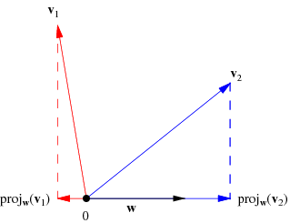
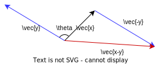
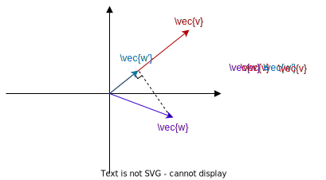
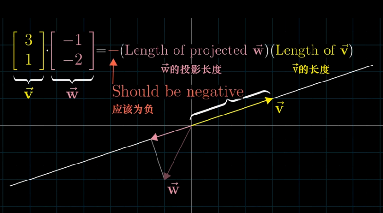
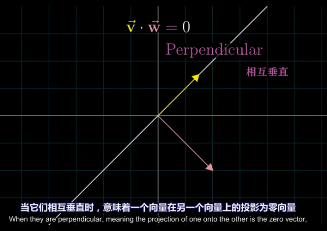

:toc:
:toclevels: 3
:sectnums:

== ★ 向量"#点积 (内积)#  inner product  或 dot product 或 scalar product

两个向量的"点积"  stem:[\vec{x} \cdot \vec{y}], 也有写作 <x,y> 的形式.

=== stem:[x \cdot y = x_{1} y_{1} + x_{2} y_{2} + ...]

\begin{align*}
& x=\left| \begin{array}{l}
	x_1\\
	x_2\\
	x_3\\
\end{array} \right|,\ y=\left| \begin{array}{l}
	y_1\\
	y_2\\
	y_3\\
\end{array} \right|, \\
& 则 :
\boxed{
\ x\cdot y = x_1 y_{1} + x_2 y_{2} + x_{3}y_{3}
} \\
& 即:   x\cdot y = x^T \cdot y <- 即把\vec{x}横过来, 变成一行, 再和 \vec{y} 的一列相乘. 规则和矩阵的乘法完全一样. \\
& 其实:   x\cdot y = x^T \cdot y = y^T  \cdot x
\end{align*}

注意: **"点积"(inner product)运算的结果, 是一个"数".** 这和向量的其他操作是有区别的. 比如:  +
-> 两个向量做"加法", 结果依然是个向量. +
-> 向量的"数乘", 结果也依然是个向量.

在二维空间中:

[options="autowidth"]
|===
|Header 1 |则

|若两个向量 stem:[\vec{x}, \vec{y}] 间的夹角 < 90°
|stem:[\vec{x} \cdot \vec{y} > 0]

| stem:[\vec{x}, \vec{y}] 间的夹角 > 90°
|stem:[\vec{x} \cdot \vec{y} < 0], 即是个负值.

|stem:[\vec{x}, \vec{y}] 间的夹角 = 90°
|stem:[\vec{x} \cdot \vec{y} = 0]
|===

---

=== stem:[x \cdot y = x的模 \cdot y的模 \cdot cos \theta]

image:../img/0066.png[]

两个向量的点积 = 每个向量"模长"的乘积, 再乘以它们的夹角的cos值.

根据"余弦定理" : 它关于三角形"边角关系"的重要定理之一。该定理断言：三角形任一边的平方, 等于其他两边平方和, 减去"这两边与它们夹角的余弦的积"的两倍。 即: +
\begin{align}
& a^2 = b^2 + c^2 - 2(bc \cdot \cos A) \\
& 或 \\
& \cos A = \frac{b^2 + c^2 - a^2} {2bc}
\end{align}

那么对于由两个向量组成的三角形, 如下图, 就有:

根据余弦定理, 第三边, 即 (stem:[ \vec{x-y}]) 的模长, 就是: +
\begin{align}
& 余弦定理: ‖x-y‖^2 = x^2 + y^2 - 2 ‖x‖‖y‖ \cos \theta \\
& 经过变换 ..., 就有:  \\
& \boxed{
 x \cdot y = ‖x‖‖y‖ \cos \theta \
}\\
& 若 向量x 和 y 都不是零向量的话, 则有: \\
& \boxed{
\theta  = \arccos \frac{x \cdot y} {‖x‖‖y‖}
} <- 这就是 \vec{x} 和\vec{y} 的夹角公式.
\end{align}

---

== ----- -----

---

== 向量"点积 (内积) stem:[\cdot]"的几何意义 ->  stem:[\vec{v} \cdot \vec{w} = \vec{v} \cdot \vec{w'}], stem:[\vec{w'}] 是 stem:[\vec{w}] 在 stem:[\vec{v}] 上的投影长度.

[cols="2a,4a"]
|===
|Header 1 |Header 2

|stem:[\vec{w'}] 是 stem:[\vec{w}] 在 stem:[\vec{v}] 上的投影长度.

则: stem:[\vec{v} \cdot \vec{w} = \vec{v} \cdot \vec{w'}]
|

|如果 stem:[\vec{w}] 的投影, 是在 stem:[\vec{v}] 的反方向延长线上, 则此时: +
\begin{align*}
\vec{v} \cdot \vec{w} = \vec{v} \cdot \vec{w'} = 是负值
\end{align*}
|

|如果这两个向量, 本身就互相垂直, 则一个向量在另一个向量上的投影长度, 就为0. 这时它们的"点积"就等于0.
|
|===

---

== ----- -----

---

== 点积 的性质

==== 正定性 :  stem:[ \vec{x} · \vec{x} >= 0]

stem:[ \vec{x} · \vec{x} >= 0]  <- 向量自己与自己的内积, 大于等于0

若 stem:[ \vec{x} · \vec{x} = 0 +
则根据内积公式: +
\begin{align}
\left| \begin{array}{l}
	x_1\\
	x_2\\
	x_3\\
\end{array} \right|\cdot \left| \begin{array}{l}
	x_1\\
	x_2\\
	x_3\\
\end{array} \right|\ = x_1 x_{1} + x_2 x_{2} + x_{3} x_{3}
\end{align}

若它们的和=0, 就说明该向量的每部分, 都是0. 即 stem:[x_1 = x_2 = x_3 = 0 ]. 说明该向量是个"零向量". 即 stem:[ \vec{x} = \vec{0}]

---

==== 对称性(交换律) : stem:[ \vec{x} \cdot \vec{y} =  \vec{y} \cdot \vec{x} ]

---

==== 分配律 : stem:[ (\vec{x} + \vec{y}) \cdot \vec{z} = (\vec{x} \cdot \vec{z}) + (\vec{y} \cdot \vec{z})]  或 stem:[ a(b+c) = ab + ac]

---

==== stem:[ (k \vec{x}) \cdot \vec{z}  = k (\vec{x} \cdot \vec{z})]  = stem:[  \vec{x} (k \vec{z})]  <- 即, 向量间可以先结合, 系数后乘上去. 系数k 非常自由.

---

==== ★ schwarz 不等式 (Schwarz inequality) :  stem:[ (\vec{x} \cdot \vec{y})^2 <= (\vec{x} \cdot \vec{x}) (\vec{y} \cdot \vec{y}) ]

它是一条很多场合都用得上的不等式 : 例如线性代数的"矢量"，数学分析的"无穷级数"和"乘积的积分"，和概率论的"方差"和"协方差"。它被认为是最重要的数学不等式之一。

---
