:toc:
:toclevels: 3
:sectnums:

== Schmidt orthogonalization (施密特正交化) : 基的标准正交化

.标题
====
比如: 二维平面中:

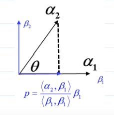

α1 和 α2 是两个基, 但它们还不是正交基, 如何把它们掰直成正交基?  +
我们可以以其中一条向量(比如α1)为边, 把它先定位成正交基的一条边(重新命名为β1), 再来找它的正交基(比如β2)即可.

α2 可以分解成两个向量的和, 即 : stem:[ α_2 = \beta_2 + p]

其中 p 是 α2 在 β1 上的垂直投影(即正交投影).

我们就能算出 β2基了:

\begin{align}
α_2 &= \beta_2 + p \\
\beta_2 &= \alpha_2 - p \\
& =  \alpha_2 - \frac{α_2 \beta_1} {\beta_1 \beta_1} \beta_1
\end{align}
====

详细:

.标题
====
例如： +
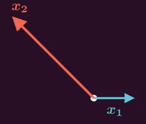

x1, x2 目前还不是"正交基", 我们要来找到由它们张成空间中的一组"正交基"(比如叫 v1, v2). 方法是:

先令其中一条边, 变成正交基. 如, 让x1成为正交基中的一条边. 即让v1 和 x1 共线.

再做出x2 在 x1上的正交投影, 得到 x2拔. 其垂线向量, 就是我们要找的另一个正交基 v2.

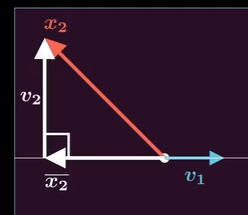

x2拔由于和v1共线, 所以可以写成 v1 的 k倍 形式, 即: stem:[ \overline{x_2} = k_1 v_1]

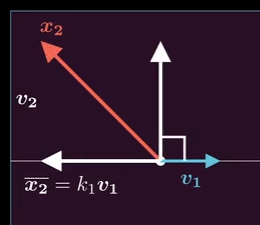

x2这个向量, 可以分解为两个向量的和, 即: stem:[ x_2 = \overline{x_2}  + v_2 ]

所以 stem:[ v_2 = x_2 - \overline{x_2} = x_2 - k_1 v_1 ]

现在, 我们要求的正交基 v1, v2, 就能用下面的式子来表示了:
\begin{align}
\left\{ \begin{array}{l}
	基 v_1 = x_1\\
	基 v_2 =  x_2 - k_1 v_1
\end{array} \right.
\end{align}

在这些变量中, 只有 k1 我们还不知道. 我们就来求 k1.

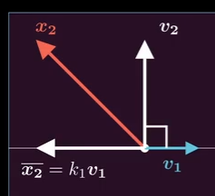

因为 v2 和 v1 成正交(垂直)关系, 所以它们的点积 = 0

即:
\begin{align}
& v_2 \cdot v_1 = 0 \\
& (x_2 - k_1 v_1) \cdot v_1 = 0 \\
& x_2  v_1 - k_1 v_1 v_1 = 0 \\
& k_1 = \frac{x_2  v_1} {v_1 v_1} \\
\end{align}

所以, k1 就得到了, 把它代入 v2的式子中, 就有:

\begin{align}
& \left\{ \begin{array}{l}
	基 v_1 = x_1\\
	基 v_2 =  x_2 - k_1 v_1
\end{array} \right. \\
& \left\{ \begin{array}{l}
	基 v_1 = x_1\\
	基 v_2 =  x_2 - \frac{x_2  v_1} {v_1 v_1} v_1
\end{array} \right. \\
\end{align}

我们就得到了一组正交基 v1, v2.

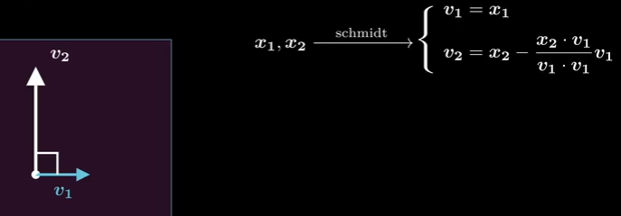
====

.标题
====
比如：在三维空间中:

首先, 三个向量不是正交基状态. +
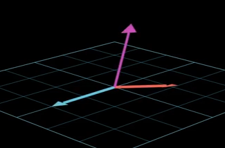

先将其中任意两个向量, 正交化 +
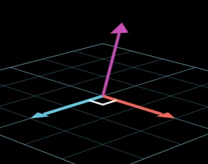

用第三个向量, 向"前两个正交向量所张成的平面", 做垂线, 就得到了第三个正交基. +
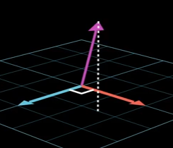

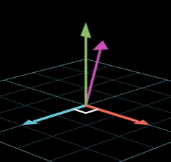

具体:

假设, 三个非正交基的向量, 为 x1, x2, x3 +
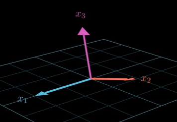

我们令"正交基"中的其中一个基(v1), 与x1 共线.

套用二维平面的公式, 我们可以首先得到 v1, v2 正交基的公式:

\begin{align}
\left\{ \begin{array}{l}
	基 v_1 = x_1\\
	基 v_2 =  x_2 - \dfrac{x_2  v_1} {v_1 v_1} v_1
\end{array} \right. \\
\end{align}

然后, 将x3, 向平面做垂直投影, 得到其投影向量 x3拔 +
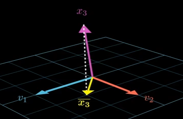

x3 与  x3拔 的这根垂直连线, 就是我们要求的另一个基 v3 +
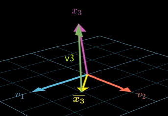

x3 可以分解为两个向量的和, 即:
\begin{align}
& x_3 = \overline{x_3} + v_3 \\
&  v_3 = x_3 - \overline{x_3}
\end{align}

现在, 就有了 另一个基 v3 的公式, 但是 stem:[\overline{x_3} ] 的值是什么?

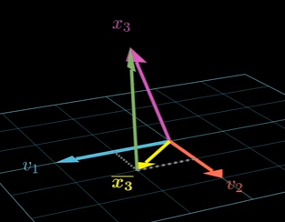

因为 stem:[\overline{x_3} ]  在 v1, v2 所张成的平面上, 所以它是 v1, v2 的线性组合. 可以写成:
\begin{align}
\overline{x_3} = k_1 v_1 + k_2 v_2
\end{align}

因为 v3垂直于底下的平面, 即  v3和 v1 的点积 =0,  v3 和 v2 的点积也 =0.  即:

\begin{align}
& \left\{ \begin{array}{l}
	v_3 v_1\ = 0  ← 代入进去 v_3 = x_3 - \overline{x_3}\\
	v_3 v_2\ = 0
\end{array} \right.  \\
& \left\{ \begin{array}{l}
	(x_3 - \overline{x_3}) v_1\ = 0 \\
(x_3 - \overline{x_3}) v_2\ = 0
\end{array} \right.  \\
& 继续代入进去: \overline{x_3} = k_1 v_1 + k_2 v_2 \\
& \left\{ \begin{array}{l}
	(x_3 -  (k_1 v_1 + k_2 v_2)) v_1\ = 0 \\
(x_3 -  (k_1 v_1 + k_2 v_2)) v_2\ = 0
\end{array} \right.  \\
& \left\{ \begin{array}{l}
	k_1\ = \dfrac{x_3 v_1} { v_1 v_1} \\
	k_2\ = \dfrac{x_3 v_2} { v_2 v_2}
\end{array} \right.
\end{align}

把 k1, k2 代入 v3 公式:
\begin{align}
v_3 &= x_3 - \overline{x_3} \\
& = x_3 - (k_1 v_1 + k_2 v_2) \\
& = x_3 - (\dfrac{x_3 v_1} { v_1 v_1} v_1 + \dfrac{x_3 v_2} { v_2 v_2} v_2)
\end{align}

所以, 现在3个正交基都有了, 就是:
\begin{align}
\left\{ \begin{array}{l}
	v_1\ = x_1\\
	v_2\ = x_2 - \dfrac{x_2  v_1} {v_1 v_1} v_1 \\
	v_3 = x_3 - \dfrac{x_3 v_1} { v_1 v_1} v_1 - \dfrac{x_3 v_2} { v_2 v_2} v_2 \\
\end{array} \right.
\end{align}
====

n 维中, Schmidt  正交化的公式是:

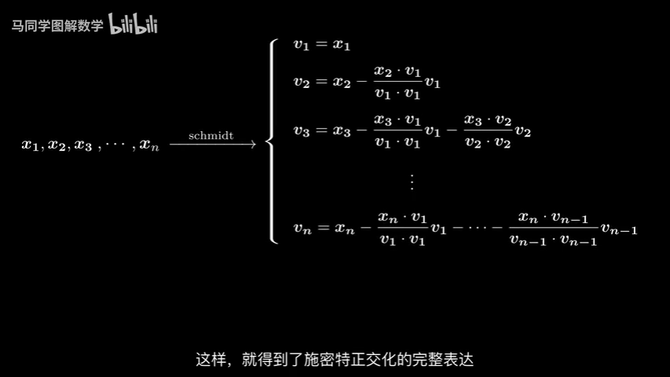

---

== 将正交基, 单位化, 变成"单位正交基"

比如, β1 是一组正交基中的一个, 把它单位化, 只要除以它的模长即可. 即:

\begin{align}
单位正交基 γ_1 = \dfrac{1} {‖β_1‖} β_1
\end{align}

组中的其他的正交基同理.

---

