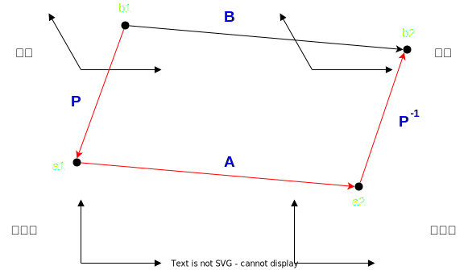
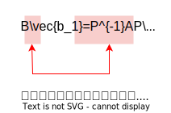

:toc:
:sectnumlevels:

== 相似矩阵 similar matrix

如上图, 矩阵A, 将 stem:[a_1] 点 映射到 stem:[a_2] 点. -> 即: stem:[A \vec{a_1} = \vec{a_2}]. +
矩阵P , 把stem:[b_1]点 变换为stem:[a_1]点. +
P的逆阵stem:[P^{-1}], 把stem:[a_2]点 变换为stem:[b_2]点.

这样我们就会发现: 从 stem:[b_1] 变换为stem:[b_2], 可以有两种路径:

1. 直接走:  stem:[b_1] -> B -> stem:[b_2]
2. 绕路走: stem:[b_1] -> P -> A -> stem:[P^{-1}] -> stem:[b_2]

即: stem:[B \vec{b_1} = P^{-1} A P \vec{b_1}] <- 等号右边, 是"从右往左看"的, 一步步在变换. 即: stem:[P^{-1} (A (P \vec{b_1}))]

所以, stem:[B] 和 stem:[P^{-1} A P] 其实是同一个变换规则. A 与 B 就叫"相似矩阵", 记作 stem:[A ~ B]. <- 注意: A 与 B 必须是同阶方阵, 并且P 必须是可逆的.

---

== 相似矩阵 的性质

==== 反身性： A~A

---

==== 对称性：若 A~B, 则 B~A

---

==== 传递性：若 A~B, B~C, 则 A~C

---

==== 若A~ B，则A与B : ① 两者的秩相等, 即 r(A)=r(B). ② 两者的行列式值相等, 即|A|=|B|. ③ 两者的迹数相等, 即 tr(A)=tr(B). ④ 两者的"特征值"相同，尽管相应的"特征向量"一般不同.

迹 (trace 或 Spoor) : 即主对角线上元素相加

spoor  /spʊr/::
[ sing.] a track or smell that a wild animal leaves /as it travels （野兽走过留下的）足迹，嗅迹

---

==== 若A~B， 且 A,B 都可逆的话, -> 则 stem:[A^{-1} ~ B^{-1}]

证明过程:  +
\begin{align*}
根据: B & = P^{-1} A P <- 它们是一回事, 所以它们的逆阵也是一回事, 就有: \\
(B)^{-1} & = ( P^{-1} A P)^{-1} \\
B^{-1} & =   P^{-1} A^{-1} (P^{-1}) ^{-1} <- 注意要颠倒位置 \\
B^{-1} & =   P^{-1} (A^{-1}) P <- 即 B^{-1} 和 A^{-1} 是相似矩阵.
\end{align*}

---

==== 若A~B, -> 则 A, B 同时可逆, 或同时不可逆.

原因: 因为"相似矩阵", 它们的"行列式值"是相等的, 即 |A| = |B|.

行列式的值, 表示的是"新基"的面积 (stem:[ \hat{i} * \hat{j}]), 比原基的面积(stem:[ i * j]) 大多少倍.

所以, 如果它们的行列式值 stem:[\ne 0], 就代表它们没有被压缩成 0 维. 就可以 ctrl + z 来还原, 可逆. 如果行列式值 =0, 就不可逆. 既然它们"行列式值"相同. 所以当然的, 它们就是同时"可逆"或"不可逆"了.

---

==== 若A~B,  -> 则  stem:[A^m ~ B^m]

---

==== 总结

\begin{align*}
A \sim B\ \rightarrow \ 则有\left\{ \begin{array}{l}
	|A|\ =\ |B|\\
	tr(A) = tr(B)\\
	都可逆,\ 或都不可逆\\
	A^{-1} = B^{-1}\\
	A^m = B^m\\
	特征值相同\\
	r(A) = r(B)\\
\end{array} \right.
\end{align*}

---

