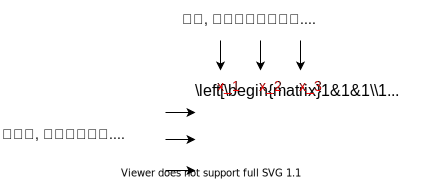

:toc:

== 齐次线性方程 homogeneous linear equations

形如 stem:[A\vec{x}=0] 的形式.  +
A是矩阵, 相当于一个函数, 功能是对向量进行变换(终点的位移).

如: +
\begin{align*}
\underset{常数项全部为零,\ 就是齐次的}{\underbrace{\left\{ \begin{array}{l}
	x_1+x_2+x_3=0\\
	x_1-x_2+5x_3=0\\
	-x_1+x_2+6x_3=0\\
\end{array} \right. }}
\end{align*}

它可以写成 stem:[A\vec{x}=0] 的形式:

齐次方程的解的情况:

- 它至少有非零解存在, 即: stem:[x_1 = x_2 = x_3 = 0]

---

== 非齐次方程 non-homogeneous equation

形如 stem:[A\vec{x}=\vec{b}] 的形式. 即: 常数项不全为零.

