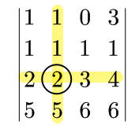

:toc:

== 余子式 minor

某个元素的"余子式", 就是**把它所在的行和列去掉后, 剩下的元素所组成的行列式.**

即, "余子式"的: +
- 余 : 剩余 +
- 子 : 子集 +
- 式 : 依然是个行列式

例如: 下面的行列式中, 圆圈圈出的2 +

它的余子式就是:

\begin{align}
M_{32}=\left[ \begin{matrix}
	1&		0&		3\\
	1&		1&		1\\
	5&		6&		6\\
\end{matrix} \right]
\end{align}

---

== 代数余子式 Algebraic cofactor

**它只比"余子式"前面多一个正负号.**  +
是正还是负, 由目标元素所在的"行数与列数的和"来决定 : 奇为负, 偶为正.

如: +

该目标元素的"代数余子式"就是:

\begin{align}
\text{A}_{32}=\left( -1 \right) ^{3+2}\cdot \text{M}_{32}=-\left[ \begin{matrix}
	1&		0&		3\\
	1&		1&		1\\
	5&		6&		6\\
\end{matrix} \right]
\end{align}

---

