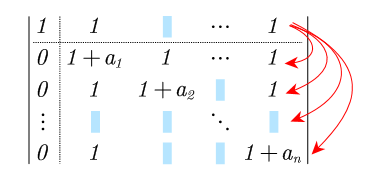
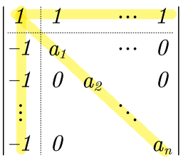
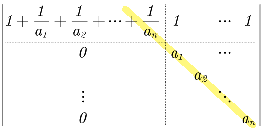

:toc:

== 求"行列式值"的算法: 加边法 -> 以转换成"上三角行列式"

"加边法"这种技巧, 不会改变行列式的值. 不过, 此方法在实际中运用很少.

如: +
\begin{align}
\left| \begin{matrix}
	1+a_1&		1&		\cdots&		1\\
	1&		1+a_2&		&		1\\
	&		&		\ddots&		\\
	1&		&		&		1+a_n\\
\end{matrix} \right|
\end{align}

[options="autowidth"]
|===
|Header 1 |Header 2

|第1步: 我们在它顶上加一行, 全是1;  最左边加一列, 全是0.
|

|第2步: 我们把第1行, 乘以(-1), 加到下面的每一行上去.
|

|第3步:
|

这种叫"三叉型"行列式, 即只有第1行, 第1列, 及主对角线上元素为非零.

"三叉型"行列式的计算技巧都一样, 即: 按列来操作, 用主对角线上的元素, 来消掉第一列上的元素.  +

本例即: +
- 把 第2列 × stem:[\frac{1}{a_1}] , 加到第1列上. +
- 把 第3列 × stem:[\frac{1}{a_2}] , 加到第1列上. +
- 把 第n列 × stem:[\frac{1}{a_n}] , 加到第1列上. +

|第4步:
|

现在, 它就转化成了"上三角行列式", 就能套用公式了: 行列式的值, 就是主对角线上元素的乘积

stem:[ \|D\| = (1+\frac{1}{a_1} + \frac{1}{a_2}+\cdots +\frac{1}{a_n}) * a_1 a_2 ... a_n ]

|===

