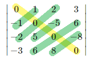

:toc:

== 反对称行列式

形如: +

它的特征是:

- 主对角线上元素, 全是0.
- 上下对应位置的元素, 成相反数.
- **若它是"奇数阶"的行列式, 则 stem:[|D| = 0]**

奇数阶反对称行列式，其值为0。 其证明过程:

\begin{align*}
& D=\underset{奇数阶的反对称行列式}{\underbrace{\left| \begin{matrix}
	0&		a&		b\\
	-a&		0&		c\\
	-b&		-c&		0\\
\end{matrix} \right|_{3*3}}}=\left( -1 \right) ^3\underset{每行提取公因子-1出来}{\overset{注意到它其实是D的转置}{\overbrace{\underbrace{\left| \begin{matrix}
	0&		-a&		-b\\
	a&		0&		-c\\
	b&		c&		0\\
\end{matrix} \right|}}}}=-D^T\\
& D=\ -D \\
& 2D\ =\ 0 \\
& D\ =\ 0 \\
\end{align*}

---

