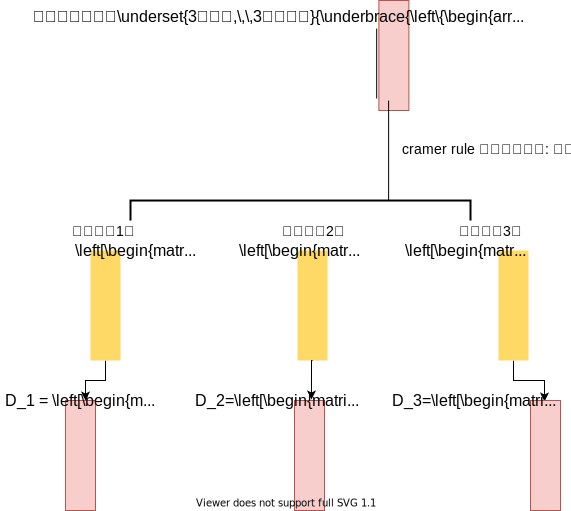

:toc:

== 克莱姆法则 Cramer's Rule

该法则, 专门用于计算这种方程组的解:

- 只适用于n个方程, 正好有n个未知元时.
- 其系数行列式的值, 即 stem:[|D|\ne 1].

则此时, 该行列式有解: stem:[x_i = \frac{D_j} {D}]

例如:

有了 stem:[D_1, D_2, D_3] 的值后, 现在, 我们就能求出三个未知元的值了.  +
根据公式 stem:[x_i = \frac{D_j} {D}]

即: +
\begin{align*}
\left\{ \begin{array}{l}
	x_1 = \frac {D_1}{D}\\
	x_2 = \frac {D_2}{D}\\
	x_3 = \frac {D_3}{D}\\
\end{array} \right.
\end{align*}

不过, 在实际应用中, 我们一般是不用 cramer法则的, 因为它的计算量太大.

---
