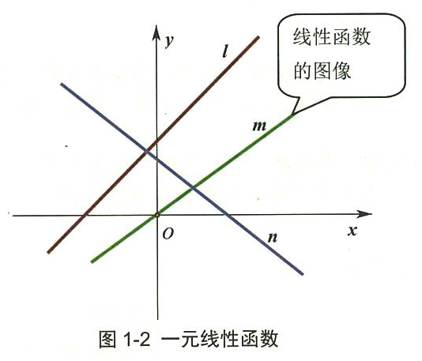
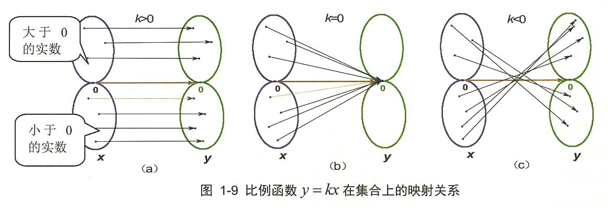
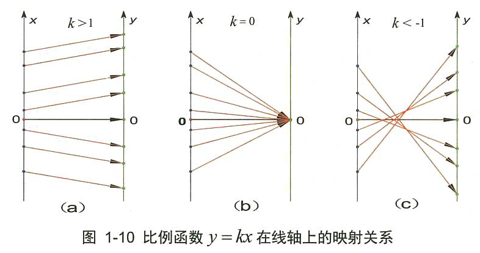
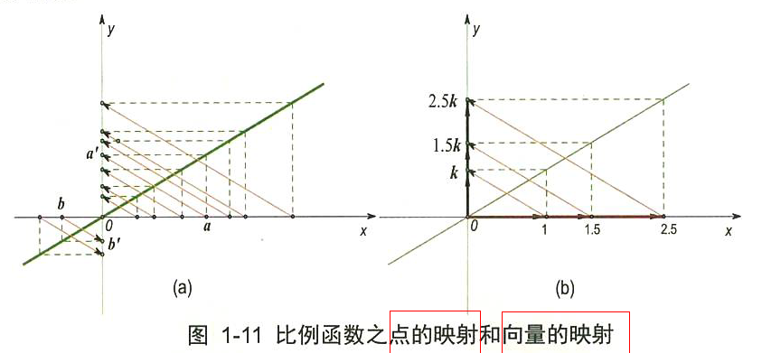
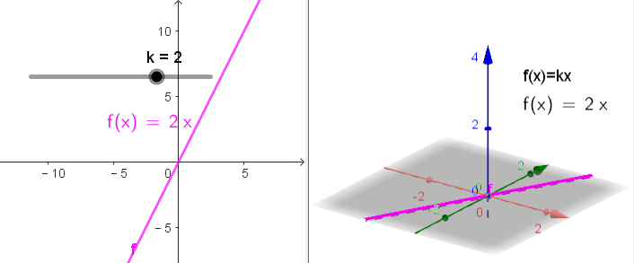
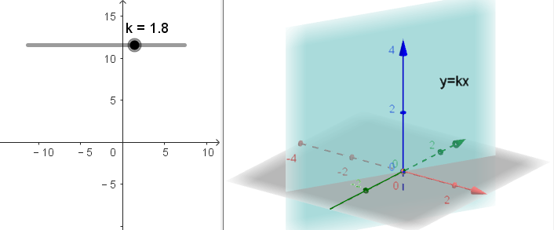
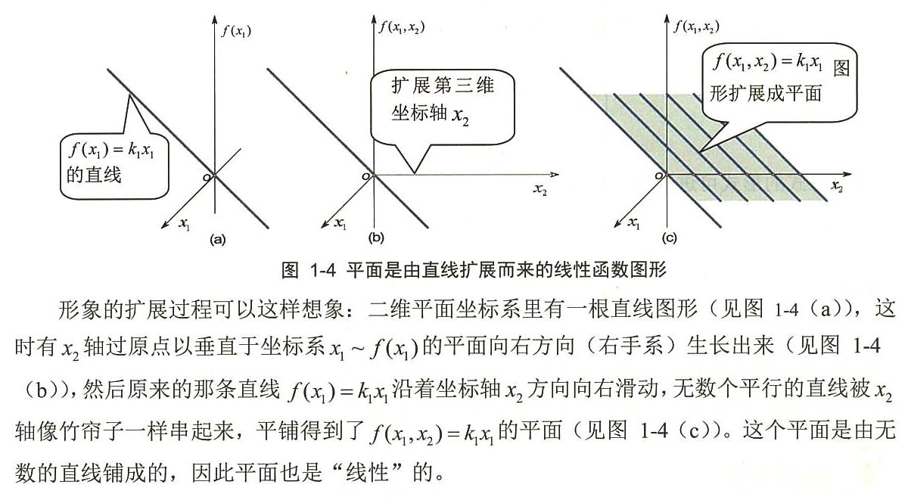
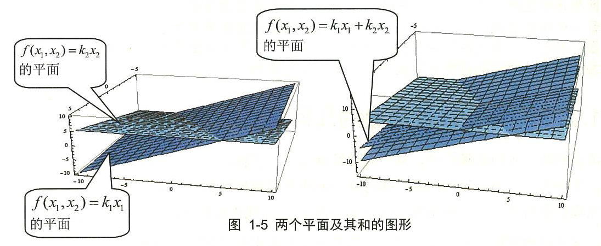

= 线性映射
//:stylesheet: ../my-stylesheet.css
:toc: left
:toclevels: 3
:sectnums:

'''

== 只有过原点的直线, 才满足"线性代数"中所指的"线性"含义

函数 f(x)= kx+b (k,b 是不变量)，称为一元线性函数. 如果 b=0, 则这个函数的外观就变成 f(x)= k的形式了，这是一条过原点的直线.

严格说来，*只有过"原点"的最简单的直线 f(x) = kx, 才被称为一元线性函数.因为不过原点的直线, 不满足线性代数里, 对线性函数的"比例性"的要求.*  所以, f(x)=kx+b 虽然是线性函数, 但它却不满足"线性代数"里所指的"线性"含义.

y=Kx 所做的动作, 就是将一个向量x, 通过矩阵K, 映射变换为另一个新向量y. 矩阵K, 就相当于一个"函数"的作用. +
线性代数里面的"线性", 主要意思就是线性空间里的"线性变换"(映射, 类似函数的概念, 把输入变成另一种输出).

'''

== 线性映射, 满足: "比例性", "可加性"

不过"原点"的直线, 不满足线性代数里, 对线性函数的 "比例性"的要求

下面的图, 给出了一元线性齐次函数 f(x)=kx,  当"k取不同的数"时的映射对应关系。 +
注意: 在三个分图中，*有一个共性就是: 元素0 必然映射到元素0.*

如果把两个坐标轴的原点, 进行重合(因为0元素必然映射到0元素)，再把两个坐标轴的夹角, 调整到 stem:[ \frac{\pi}{2}]角，就可得到笛卡尔平面坐标系 (而 线性代数中讲的"线性空间"坐标系的坐标轴, 可以是任意非零的夹角). 如下图只画出 k>0 的映射情况.

上图, 如果把点a、a'、b和b', 分别与原点0连起来，就会得到线段 0a、0b、0a'、0b'。于是, 线段0a, 映射到线段0a'; 线段0b, 映射到线段0b'. +
所以, 线性映射, 就是把"线段"映射到"线段".  +
如果我们把"线段"改称为"向量"的话，就是: 线性映射就是把"向量"映射成"向量". 线性映射, 把向量变成另外一个向量.

其实, 对于"数乘变换" T(a)= ka，除了把a看做向量外，我们可以直接把a看做一个几何图形("向量"就是一个几何图形，只不过它是一个简单的有向线段).

[options="autowidth"]
|===
|T(a)= ka |Header 2

|k>1时
|就是对向量线段(几何图形)a 做放大

|0<k<1时
|就是对a 做缩小

|k=-1时
|就是把a 做反方向(反转)变化
|===

当然，这个线性映射, 也满足线性的"可加性"和"比例性"的性质.

线性函数:  +
→ 其几何意义是: 它表示为一条直线.  +
→ 其代数意义 : 最基本的意义只有两条: "可加性"和"比例性".

[options="autowidth"]
|===
|Header 1 |Header 2 |用数学表示上面的这两种性质, 就是:

|可加性
|*两个向量先求和, 再映射. 结果就等于: 先各自映射, 再求和.* +
即: x轴上的两向量的和, 映射得到的y轴向量, 等于"两个x轴向量,分别映射得到的y轴向量"的和.

即: 如果函数 f(x) 是线性的, 则有:
\begin{align*}
	\boxed{
	f\left( x_1+x_2 \right) =f\left( x_1 \right) +f\left( x_2 \right)	
	}
\end{align*}

其意思就是一句话: 和后的函数, 等于函数后的和. +

物理意义就是说: 因变量"叠加后"的作用结果, 就等于各个因变量"独自作用结果"的叠加. 即: 先结合, 再做函数变形. 等于 先各自做函数变形, 再结合.

|stem:[T(a+b) = Ta + Tb ] +
→ 其中, T是映射运算(即矩阵), a、b是任意两个向量.

|比例性(数乘)
|*先倍数, 再映射. 结果就等于: 先映射, 再倍数.* +
即:"x轴向量的倍数"映射得到的y轴向量, 等于"x轴向量映射的y轴向量"的倍数.

比例性, 也叫做齐次性、数乘性, 或均匀性. 即: 如果函数 f(x) 是线性的, 则有:
\begin{align*}
	\boxed{
	f(kx) = k \cdot f(x)
	}
\end{align*}

一句话: 先做比例变化, 后做函数变换, 等于先做函数变换,后做比例变化. +
物理意义是说: 对因变量做缩放时，函数对因变量的作用结果, 也会同等比例地缩放.

*而对于不经过原点的直线 f(x)=ax+b 而言, 就不满足此"比例性". 因为: stem:[ f(kx) = akx+b], 而 stem:[ k\cdot f(x)=akx+kb], 所以 stem:[ f(kx) \neq k \cdot f(x)].* 因此严格地讲, f(x)=ax+b 不能再叫"线性函数"了.  或者说，线性代数的"线性变换", 不直接研究"坐标系的移动".

|stem:[ T(ka) = k \cdot Ta]
|===

"可加性"与"比例性"组合在一块, 就是"线性"的全部意义了. 即有:
\begin{align*}
f\left( k_1x_1+k_2x_2 \right) =k_1f\left( x_1 \right) +k_2f\left( x_2 \right) \ \ ←\ k_1,k_2\text{为常数}
\end{align*}
一句话: 线性组合的函数，等于函数的线性组合。这里面既有"缩放"又有"叠加"的物理含义.

[options="autowidth"]
|===
|在物理上 |Header 2

|可加性
|表明函数所描述的事物, 具有累加性. 即: 所有起因的累加, 所导致的结果, 完全等于"每个起因独自所引起的结果"的累加。 +
是否满足"可加性", 就界定了它所描述的事物, 到底是"线性"的, 还是"非线性"的.

|比例性
|比例性又名"齐次性", 说明没有初始值。没有输入信号时, 输出也没有; 有几倍的输入量, 就刚好就有几倍的输出量.
|===

*T本来表示一种"线性映射"的动作关系(或函数关系). 但在上式中, 就像一个实数或变量一样参与运算。* 如T(a+b)=Ta+Tb，就像乘法对加法的分配律一样展开运算. *因此T在这里, 也叫"线性算子"。具体的算子有: 微分算子、积分算子、拉普拉斯算子等.*

.标题
====
\begin{align*}
\left\{ \begin{array}{l}
	y_1=k_{11}x_1+k_{12}x_2+...+k_{1n}x_n\\
	y_2=k_{21}x_1+k_{22}x_2+...+k_{2n}x_n\\
	...\\
	y_m=k_{m1}x_1+k_{m2}x_2+...+k_{mn}x_n\\
\end{array} \right. \ ←k_{11},...,k_{mn}\ \text{不是变量,而是系数}
\end{align*}

如上式, 这m个n维(n元)线性函数, 都是齐次函数. 他们全部过原点.

线性齐次函数, 形如 stem:[y=k_{1}x_1+k_{2}x_2+...+k_{n}x_n], *这个式子中, 每项里的变量x出现的次数, 都是一次的(没有常数项)，整齐划一，故此称为"齐次"的.* 全称为"n元线性齐次函数".

上式, 可等价写成:

\begin{align*}
\left| \begin{array}
	y_1\\
	y_2\\
	...\\
	y_m\\
\end{array} \right|=\left[ \begin{matrix}
	k_{11}&		...&		&		k_{1n}\\
	...&		&		&		\\
	&		&		&		\\
	k_{m1}&		&		&		k_{mn}\\
\end{matrix} \right] \left| \begin{array}
	x_1\\
	x_2\\
	...\\
	x_n\\
\end{array} \right|
\end{align*}

并可进一步简写成: y=f(x) = Kx

即:
\begin{align*}
y=\left| \begin{array}
	y_1\\
	y_2\\
	...\\
	y_n\\
\end{array} \right|,\ K=\left[ \begin{matrix}
	k_{11}&		...&		&		k_{1n}\\
	...&		&		&		\\
	&		&		&		\\
	k_{m1}&		&		&		k_{mn}\\
\end{matrix} \right] ,\ x=\left| \begin{array}
	x_1\\
	x_2\\
	...\\
	x_n\\
\end{array} \right|
\end{align*}

矩阵, 其实就是线性方程组的"系数". 矩阵, 就核心地代表了"线性变换". +
因为 y=Kx 所做的动作, 就是将一个向量x, 通过矩阵K, 映射变换为另一个新向量y. 矩阵K, 就相当于一个"函数"的作用. 即, 一个矩阵对应着一种"线性变换"规则.  +
线性函数, 用运动的概念来理解, 就是"映射", 如同函数的功能一样.
====

'''

==  线性超平面

f(x) = kx 是二维坐标空间中的几何图形.

把这个二维直线, 放到三维空间中, 其函数表达式, 就要改写成: stem:[ f\left( x_1,x_2 \right) =k_1x_1] 或 stem:[f\left( x_1,x_2 \right) =k_1x_2]. 它的图形是一个过原点的"平面". 其中, 多出来的这个stem:[ x_2], 可以取任意值. 也就是说:  stem:[ f\left( x_1,x_2 \right) =k_1x_1] 的图像, 是一个过stem:[ x_2]坐标轴的平面.

既然在三维空间中, stem:[k_1 x_1] 是一个平面, 那么 stem:[k_1 x_1 +  k_2 x_2], 就是两个平面相加了. 即就是 stem:[f\left( x_1,x_2 \right) =k_1x_1] 和 stem:[f\left( x_1,x_2 \right) =k_2 x_2] 的图形相加. *一般情况下, 两个平面相加, 仍然是一个平面.*

因此，线性函数 stem:[f(x_1, x_2) = k_1 x_1 + k_2 x_2] 的几何图形, 是一个过原点的平面. 这个平面, 是在三维坐标系下的二维几何图形.

由二元线性函数 stem:[
f\left( x_1,x_2 \right) =k_1x_2+k_2x_2
] 继续扩展到三元线性函数stem:[
f\left( x_1,x_2,x_3 \right) =k_1x_2+k_2x_2+k_3x_3
]时，所在的坐标系, 由三维扩展到四维。可以想象: 这个三元变量函数, 构成了一个三维空间，是由三个空间
stem:[f\left( x_1,x_2,x_3 \right) =k_1x_1],
stem:[f\left( x_1,x_2,x_3 \right) =k_2x_2],
stem:[f\left( x_1,x_2,x_3 \right) =k_3x_3] 叠加得到的. 因此它是一个四维空间中(四维坐标系)的一个三维子空间.

继续扩展到"四元", 及"n元"的线性函数 stem:[
f\left( x_1,x_2,...,x_n \right) =k_1x_2+k_2x_2+...+k_nx_n
], 坐标系空间扩展到五维, 乃至n+1维，*其几何图形, 仍将是一个低于坐标系维度一个维数的"子空间".*

*这个n元几何图形, 总是低于坐标系一个维数。我们常常把一个高维的坐标系, 称为一个"空间''. 那么，只能把这个线性函数低一维的几何图形, 称为一个"平面''. 这是一个扩展意义上的平面，常被称为"超平面"* (原理如同 对于三维"空间里''而言，低一维度的子空间就是平面). *所以, 超平面等同于包含在n维空间 stem:[R^n] 中的 n-1维 欧式空间*，它们对应于通常三维空间中的二维平面、平面内的直线、直线上的点等.

把线性函数 stem:[f\left( x_1,x_2,...,x_n \right) =k_1x_2 + k_2x_2 +...+ k_nx_n] 的形式改写为 +
stem:[k_1x_2 + k_2x_2+...+ k_nx_n-f\left( x_1,x_2,...,x_n \right) =0] +
或者更一般的形式为  +
stem:[k_1x_2+k_2x_2+...+k_nx_n+k_{n+1}x_{n+1}=c] +
这是一个 n+1维空间 stem:[R^{n+1}]中的一个n维超平面，只是这个平面不一定过原点了（*注意，不过原点的超平面, 依然可称之为"空间"，但不能称之为"线性空间"*}.

因此, 我们就明白了多元线性函数的"线性", 不能单纯地理解为空间中的一条直线了，把线性函数几何图形, 想象成一个"平面", 更有代表性。 +
实际上，把n个n元线性函数, 组成一个"满秩方程组", 才能表示一条直线。

相比较而言，*线性函数中含有的参数少，涉及的运算简单，仅为"加法"和"乘法"，便于运算，是变量数学中最简单的函数.* 其实许多复杂的函数, 都可以在一定范围和精确度下, 近似地"用线性函数"来表示. 所以"线性函数"是变量数学中最重要的函数。

在工程中常用的差分运算、微分运算, 及积分运算, 都属于"线性变换"，都满足以上的"可加性"和"比例性"的关系.

.线性变换,可以有两个方面的含义: +
1.对空间里的"向量", 做变换，但保持"空间坐标系"不变. +
2.对"坐标系"做变换, 但保持"向量"不变.

线性代数, 是高等代数的一大分支。在研究多变量问题(多元函数)时, 如果变量间的因果关系是"线性"的，那么称这个问题为线性问题.

线性问题, 或方程里的"变量", 就是"向量". 因此一说"线性"必提"向量". +
一般的线性代数课本里的主要内容: 行列式、向量组、矩阵、线性方程组, 及二次型等，这些内容都是对"向量"的函数或组合. +
*"向量"的概念，从数学的观点来看, 不过是"有序多元数组".* +
没有掌握"线性代数", 要去学习自然科学, 简直就是文盲. 要是没有线性代数，任何数学和初等教程都讲不下去。

'''

