= 向量
//:stylesheet: ../my-stylesheet.css
:toc: left
:toclevels: 3
:sectnums:

'''

== 向量 vector 的几何意义

==== 向量, 就是箭头线段的"终点"坐标

通常, 当你考虑"一个"向量时, 就把它看成是"箭头".  +
当你考虑"多个"向量时, 就把它看成是"箭头终点"的那个点(point).

注意: 向量的值, 表示的是坐标轴的位置, 而不是该向量线段的长度(即不是"模"的概念).}

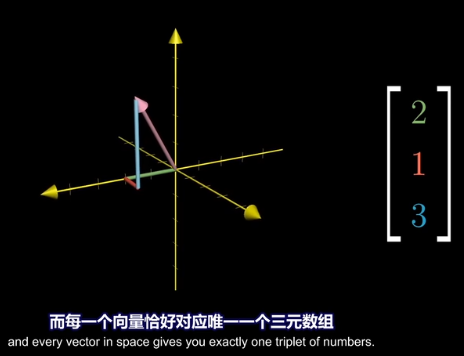

*向量没有确定的位置, 它们不依赖于任何坐标系而存在。* 所以, 凡是两个向量大小相等、方向相同的，我们就说这两个向量是相等的。

虽然向量独立于任何坐标系之外，但为了与解析技术联系起来, 以实现对向量的计算，数学上, 我们还必须把向量放在某一个坐标系下来研究。 +
如果把空间中所有的向量的尾部, 都拉到坐标原点，这样, n维点空间, 就可以与n维向量空间, 建立起一一对应的关系: n维点空间中的点(0,0,0，...)取作原点，那么每一个点, 都可以让一个向量和它对应. 这个向量就是"从坐标原点出发, 到这个点为止的向量"。 +
*我们默认所有的向量是"从原点出发"的，不要忘了这个约定。*

向量, 被看做线性空间, 或向量空间中的一个元素。但**向量与点不同，向量表示的是"两点之间的位移", 而不"是空间中的物理位置"，它是独立于坐标系的.** 这就是为什么我们可以在描述向量的加法、数乘等运算的几何解释时, 常常不用画出坐标系，但一个点离开坐标系就无法表示. 向量还可以"确定方向", 而一个点就不能。

'''

== 向量的运算

==== 向量的加法 → 平行四边形法则

把单位坐标向量 i(1,0,0), j(0,1,0), k(0,0,1) 首尾连接相加，就得到了(1,1,1)的图像.  +
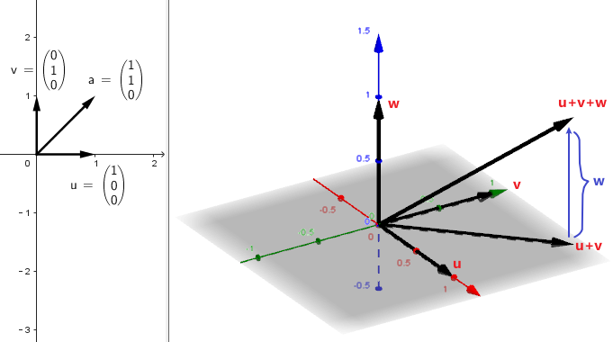

所以, 任意一个向量 a=(x,y,z), 就可以表示为 a=(x,y,z)=xi+yi+zk.  (← x,y,z是系数倍). 即分别对"单位坐标向量" 进行缩放x、y、z倍, 然后相加. +
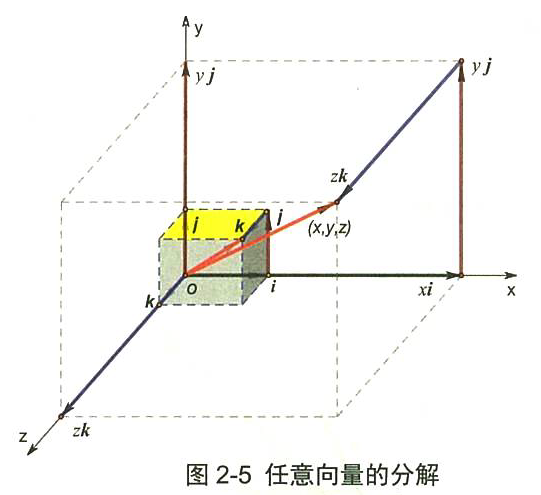

向量的运算, 有:
- 加法 +
- 减法 +
- 乘法(包括两种: 点积, 叉积).  +
- 但没有除法.

把 u, v, w, a 四个向量相加, 得到的结果(新向量), 就是"从原点出发, 直接指向最后一个向量a的尾部"的b向量. +
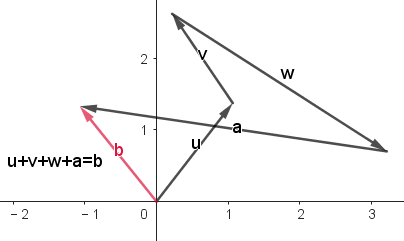

多个向量加法的本质, 实际上是这些向量, 在坐标轴上的投影的合成(相加或相减)后的结果. 同样, 点积和叉积, 也是这个数学结果的体现.
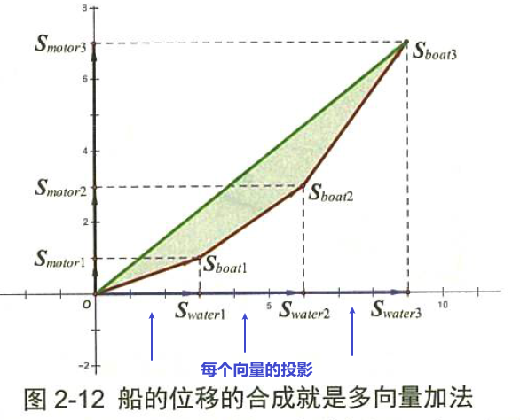

.标题
====
向量加法的结合律的几何解释: +
三个向量加法的结合律为: stem:[ (a+b) + c = a + (b+c)] +
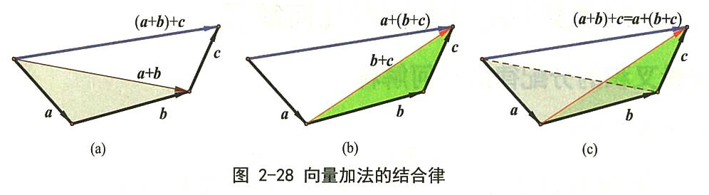
====

'''

==== 向量的"数乘" : 系数k的作用, 是把向量伸缩 k倍

\begin{align*}
2\left| \begin{array}{l}
		x \\
		y \\
	\end{array} \right|=\left| \begin{array}{l}
		2x \\
		2y \\
	\end{array} \right|
\end{align*}

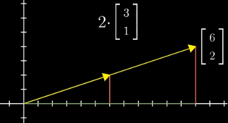

其充要条件是: 要么 数k=0, 或要么 α =0向量.

*其实, 把"x分量"看做是坐标系的x轴(上的单位值), 把"y分量"看做是y轴.  kx 不就是代表"滑动x轴的滑块"么! 让x轴可以去任何值. 同样, ky就是"滑动y轴的滑块", 让y可以取到任何值. 于是就有:  kx+ky 就是任意取x和y值, 也就是能取到 坐标系上的任意一点了.*

'''

== 单位向量 : 基 basis

The basis of a vector space /is a set of linearly independent vectors /that span the full space.

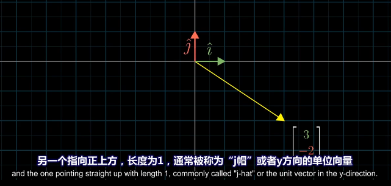

\begin{align*}
\left. \begin{array}{r}
		\hat{i} = 1 \\
		\hat{j} = 1 \\
	\end{array} \right\}
\end{align*}
← 称为"单位向量"或"基"

事实上, 每当我们描述一个向量时, 它都依赖于我们正在使用的"基".

\begin{align*}
\vec{v}=\left| \begin{array}{l}
		3  \\
		-2 \\
	\end{array} \right|= 3 \hat{i} + (-2)\hat{j}
\end{align*}

image:img/0069.png[,25%]

向量的终点坐标, 其实就是系数倍的"基向量"的线性组合.

你可以选择任意两个方向作为"基", 只要它们互相垂直即可. +
比如，你可以选择指向右上方的向量 v, 和 指向右下方的向量 w, 作为基向量.  +
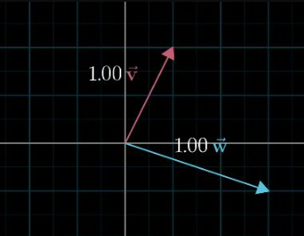

这组新的基向量, 进行缩放, 再相加，同样能构造出其他的向量. +
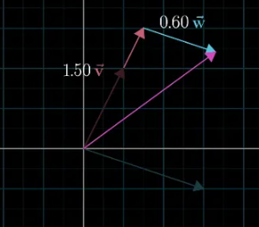

所以, 一组"基向量", 就对应一个坐标系. 选择不同的基向量, 就构造出了不同的坐标系. 同一个向量，在不同的坐标系下(即采用不同的基向量)，其坐标值也要相应地发生变化.

上面, 反复出现"将向量进行缩放,再相加"的操作, 这样的操作，我们称之为"线性组合".

'''

==== 我们将新基坐标, 包装在一个矩阵A中 -> 就有 Ax=b, x是原像, b是"新基坐标系下的x的新像"

对于2维平面, 通常, 我们将"新基"的坐标, 包装在一个2阶矩阵中. 如: +
\begin{align}
\left[ \begin{array}{c|c}
	3&		2\\
	\underset{新i}{\underbrace{-2}}&		\underset{新j}{\underbrace{1}}\\
\end{array} \right]
\end{align}

**矩阵中的每一列, 就是"新基坐标系"中的一个轴 (即"新单位基"向量, 终点的坐标)**

所以: +
\begin{align}
& 对于某向量v\ =\left| \begin{array}{l}
	a\\
	b\\
\end{array} \right|,\ 若新基是\left[ \begin{array}{c|c}
	i_x&		j_x\\
	i_y&		j_y\\
\end{array} \right] \\
& 则, 新基坐标系下的v向量, 终点坐标就会变成: \\
& 新v=\left[ \begin{array}{c|c}
	i_x&		j_x\\
	i_y&		j_y\\
\end{array} \right] \left| \begin{array}{l}
	a\\
	b\\
\end{array} \right|\ =\left| \begin{array}{l}
	i_xa+j_xb\\
	i_ya+j_yb\\
\end{array} \right|
\end{align}

**所以: "新基矩阵 * v = 新v", 其实就是 "Ax=b" 这种形式. x是原像, A是新基矩阵, b是"x被新基矩阵A变换后, 移位后的新坐标值(新像)".**

因为任何向量, 都能表示为"基向量"的线性组合. 所以"基向量"的变动, 就决定了其他向量的变动. 正所谓"纲举目张" (相当于你左右胳膊的位置, 决定了你头所处的位置.)

---

==== 从"基坐标"的变化上, 就能看出"整体的坐标系空间"发生了什么变化(如降维, 升维了)

如: +
\begin{align}
原基为\left[ \begin{matrix}
	1&		0\\
	0&		1\\
\end{matrix} \right] ,\ 新基为\left[ \begin{matrix}
	2&		-2\\
	1&		-1\\
\end{matrix} \right]
\end{align}

image:/img/0138.png[]

你发现, 新基的两个轴, 被变换到同一条直线上去了. 这就说明, "原基坐标系"的二维平面空间, 变换后, 变成了一维空间(本例准确说是二维空间中的一条直线上), 被压缩降维了.

所以, **"线性变换"的本质, 其实是通过变形"原坐标系", 来操纵空间的一种手段.**

stem:[ A \vec{x}= \vec{b}],  或 stem:[ A \vec{x}= \vec{0}]

因此, **每当你看到一个矩阵时, 都可以把它解读为"一种对空间(原坐标系)的一种特定的变换". 它就是起到这个作用.**

所以, **如果在 stem:[ \vec{x}] 前面, 有多个新基矩阵, 连乘存在, 就意味着这是对 stem:[ \vec{x}] 做了一系列分步骤进行的变换.**

image:/img/0139.svg[,]

其实, 这三步可以先合并起来, 即我们先把这三个矩阵先乘起来, 就得到复合后的"新基矩阵", 直接一次性作用于 stem:[ \vec{x}] 即可. 这就类似于"复合函数"的概念: stem:[ h(g(f(x)))].

这也就证明了: stem:[ A(BC) = (AB)C ]. <- 复合变换. (但注意: ABC 的左右顺序不能变)

计算的目的, 不在于数字本身, 而在于洞察其背后的意义. The purple of computation is insight, not numbers.

'''

'''

== 张成 span

==== 二维空间中

在二维平面中，选取 2 个向量, 然后考虑它们所有可能的"线性组合", 我们会得到什么呢? 这取决于我们选择的 2 个向量.

[options="autowidth"]
|===
|Header 1 |Header 2

|→ 通常情况下，我们会得到整个平面.
|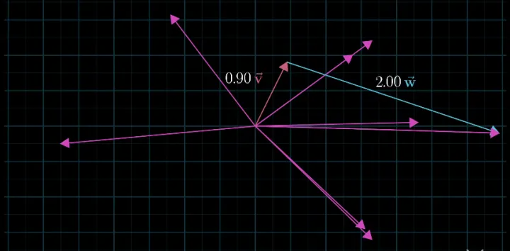

|→ 但如果选择的 2 个向量，恰好"共线"的话，那它们的线性组合, 就被局限在一条过原点的直线上了.
|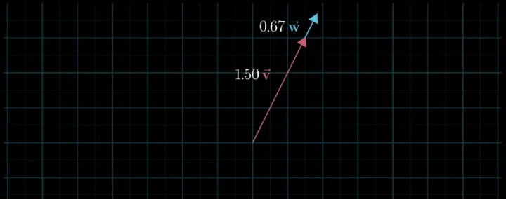

|→ 最极端的情况是，如果选择的 2 个向量都是零向量，那么它们的线性组合, 就只可能是零向量了.
|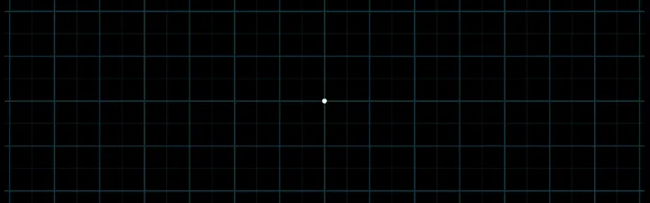
|===

"数乘"和"加法", 是向量的两个最基础的运算. 当我们谈论向量所"张成"的空间时，我们实际上就是在问: 仅仅通过"数乘"和"加法"这两种运算，你能获得的所有可能的向量集合是什么.

在线性代数中，向量的起点, 始终固定在"原点"的位置，因此, 向量的终点就唯一确定了向量本身. 这样，我们便可以将向量, 看成是"空间中的点"（即"向量的终点"）.

'''

==== 三维空间中

将线性组合的想法扩展到 3 维空间中。想象 3 个 三维向量，它们所张成的空间会是什么样的呢？这取决于我们选择的 3 个向量的箭头位置:

[options="autowidth"]
|===
|Header 1 |它们所张成的空间

|→ 通常情况下:
|得到整个 3 维空间.

|→ 当选择的 3 个向量是"共面"时(即3个向量, 存在在两个维度的世界上):
|一个过"原点"的二维平面.

|→ 当 3 个向量"共线"时(即3个向量, 共同挤在一个维度上):
|一条过原点的一维直线.

|→ 当 3 个向量都是零向量时 (即三个向量, 都挤在0维度的世界上):
|只扩展到零向量.
|===

显然, 在满足能够"张成"一个空间时, 只需要最低的维度数量就行了. 比如张成2维空间, 只需要最低2个向量(即轴)就行了. 用3个向量去"张成"二维空间, 那其中有 1 个向量是多余的.  *数学上，我们就是用 "线性相关"来描述这样的"多余向量"的现象.*

[options="autowidth"]
|===
|Header 1 |Header 2

|→ 当我们说: "几个向量所构成的向量组, `线性相关'"时，意思就是说:
|向量组中的 (任意) 一个向量, 都可以用"向量组"中其他向量的"线性组合", 来表示出来。也就是说: 这个向量, 已经落在其他向量所"张成"的空间中，它对整个向量组张成的空间是没有贡献的，把它从"向量组"中拿掉，并不会影响向量组所张成的空间的维度 (即空间维度不会塌缩, 不会降维). +
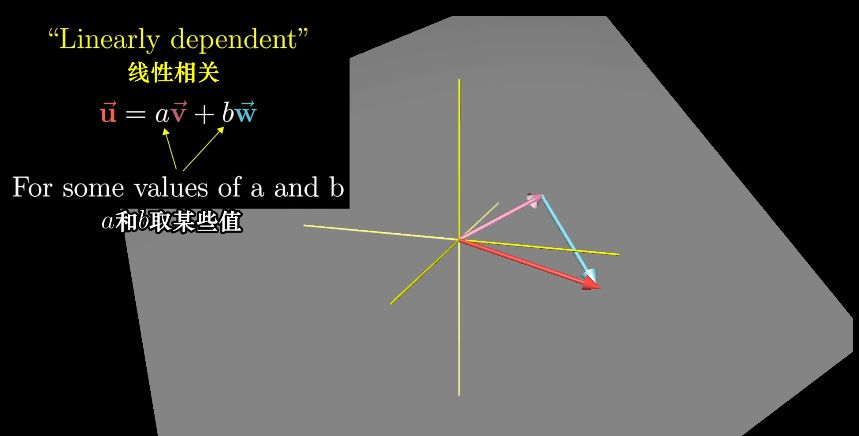

|→ "线性无关"就指的是:
|向量组中的（任意）一个向量, 都无法用"该向量组"中其他向量的"线性组合"来表示出来。换句话说: 向量组中的每一个向量, 都为该向量组所张成的空间贡献了一个维度(一个轴). 少了任何一个向量，都会让空间降维. +
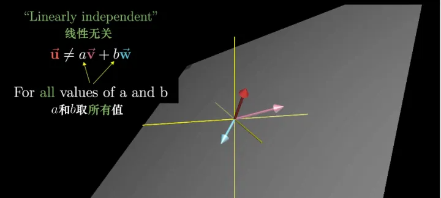
|===

所以: 向量空间的一组"基"(即维度, 轴), 就是"张成"该空间的一个"线性无关"的"向量集". The basis of a vector space /is a set of linearly independent vectors /that span the full space.

the span of stem:[ \vec{v}] and stem:[ \vec{w} ]  /is the set of  all their linear combinations. +
the set of all possible vectors /than you can reach /is called the span of those two vectors. ← 相当于"势力范围", 就是张成.

两个斜率不同的向量(a,b), 自由伸缩, 它们的和(即a+b=c), 即新向量c的终点, 能遍及二维平面上的任何点处.

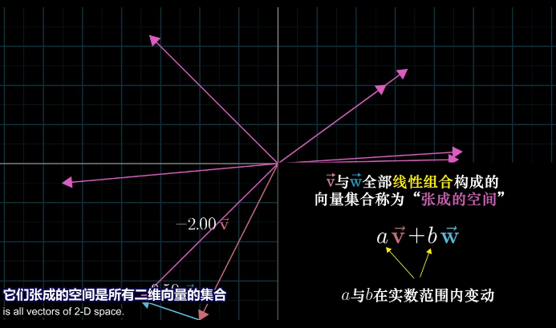

但如果两个向量都是"零向量"的话, 它们的系数倍的和, 也永远被束缚在原点(0,0)了. stem:[ k_1 \vec{0}  +  k_2 \vec{0}=0]

三维空间中, 两个斜率同的向量, 能"张成"出"过原点"的一个平面. +
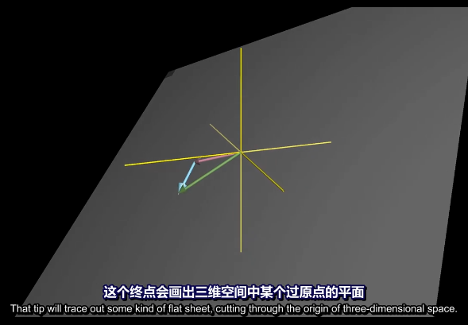

三维空间中, 三个斜率不同的向量, 它们的和, 能张成出三维空间中所有的地方. +
image:img/0072.png[,30%]

'''

== 向量和"微积分"的关系

微积分学的基本思想是“以直代曲”，在极限条件下，无数的"切线段"连接起来, 就完全等同于曲线自身。在这个意义下，*微分元dx、dy(包括多元"偏微分元" ∂x、∂y) 就是"向量".*

.微分的几何意义: +
如下图(a)所示,曲线上的点, 从M(stem:[ x_0, y_0]) 移动到 N(stem:[ x_0 + Δx, y_0 + Δy])时, MP是曲线在点M处的切线. 则:
\begin{align*}
	&\text{切线}MP\text{的斜率 }=\ \text{曲线}f(x)\text{在}M\text{点处的导数}\\
	&\underset{=f'(x)}{\underbrace{\text{切线}MP\text{的斜率}}}=\frac{dy}{\varDelta x}\\
	&\text{即} dy=f'(x)\cdot \varDelta x
\end{align*}

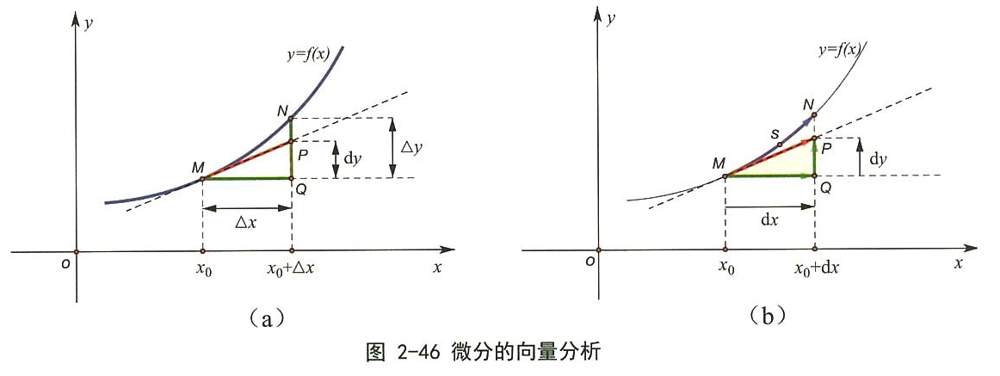

Δy是曲线的增量, dy是切线的增量. 当Δx 趋于无穷小dx时, N点就趋向于P点(两点趋于重合), 因此 Δy 也趋向于 dy 的长度. 即 Δy = dy. +
也即: 在Δx趋向于无穷小的情况下, 曲线 f(x) 的y轴改变量Δy, 就可以用 dy 来代替. 即, 在微观上能"以直代曲".

如果我们以向量的观点, 来看微分(上图b) : *把 dx 和 dy 看做两个向量, 那么它们的和 dx+dy, 不就是向量 MP 吗? 在Δx趋向于无穷小时, 即在微观层面上, 向量MP, 不就是等于曲线上的一段有向弧 MSN 了吗?* 这就是微分的几何意义。 +
*所以, 可微函数曲线上的每一段"微小的曲线段", 都可以分解为 "微元向量之和 dx+dy"。*  ← 根据这个结论, 我们就可以由此得到"求导"的几何解释了。如下例:

.标题
====
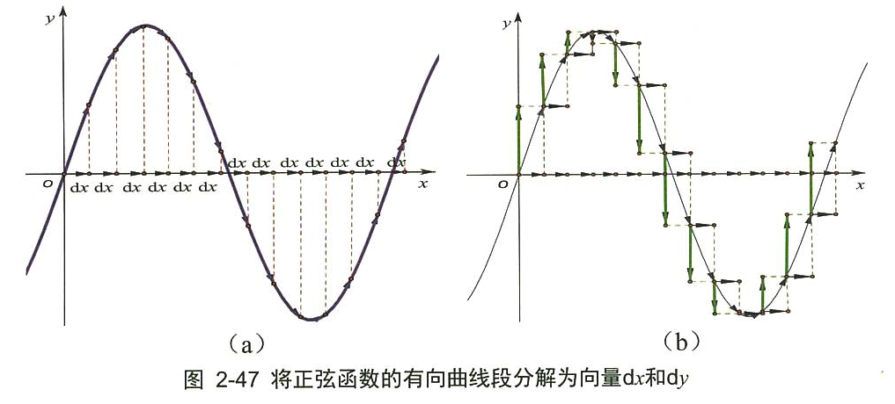

如上图. 对于正弦函数 y= sin x,

- 第1步: 我们将x轴分成 n个 dx区间, 就将函数曲线 f(x), 分割成一段段小的曲线段出来, 把它们看做是"切线向量" (从向量的角度看, 这些曲线段具有方向).  +
- 第2步: 然后, "切线向量"可以分解为 dx + dy 这两个向量的和 (如图2-47 右).  +
- 第3步: 我们把所有 dy向量的"起始端端点", 统统拉到x轴上平放. 就变成下图 (图 2-48)的样子. 可以看出: 所有向量 dy 的末端 (即箭头端点处), 构成了一个 cos x 曲线的轮廓. 这个不就是 sin x 的导数曲线么!

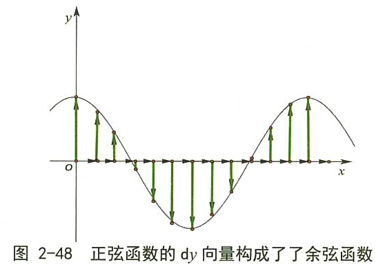
====

'''

== 向量与"解析几何"的关系

中学, 研究的解析几何, 只在二维平面上, 比较直观. 主要以"坐标"为工具来进行研究.  +
大学, 则是n维空间上的解析几何. 就需要用"向量"作为工具来研究了.  向量是个非常基础的工具, 在整个学科的展开过程中, 处处都要用到它.

'''

