= 向量: 点积 & 叉积
//:stylesheet: ../my-stylesheet.css
:toc: left
:toclevels: 3
:sectnums:

'''

== 向量的 #点积(内积)# : stem:[ x \cdot y = x_{1} y_{1} + x_{2} y_{2} + ...]

做向量内积运算, 其实就在我们的日常生活中. 比如: 你购买的食物的价格向量是 p=(蔬菜2元/斤，大米1.5元/斤，牛肉10元/斤，啤酒3元/瓶)，消耗的数量向量为d=(3.5斤，5斤，2斤，3瓶); 那么你的饮食消费, 就是向量p和d的"内积": stem:[ p \cdot d =  (2, 1.5, 10, 3) \cdot (3.5, 5, 2, 3) =7+7.5+20+9=43.5] 元.

向量的内积, 也叫数量积、标积、点积. 因为"内积"的结果就是个"数量"或者"标量 scalar".

[options="autowidth"]
|===
|Header 1 |Header 2

|标量
|只具有数值大小，而没有方向 (部分有正负之分).

标量（或作纯量）是指在"坐标变换"下保持不变的物理量。如: 质量、密度、温度、功、能量、路程、速率、体积、时间、热量、电阻、功率、势能、引力势能、电势能等物理量。 +
*无论选取什么坐标系，"标量"的数值恒保持不变。*

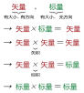

"矢量加法"一般可用平行四边形法则。但"标量加法"不遵守平行四边形法则！

|向量(矢量)的内积, 有两种定义:
|①  stem:[ a\cdot b=ab\cdot \cos \theta ]  +
← 就是说, 等于 向量 a, b 的长度之积, 再乘以它们夹角的余弦. +

②  \begin{align*}
\overrightarrow{a}\cdot \overrightarrow{b}=a_xb_x+a_yb_y+a_zb_z
\end{align*}
 ← 即等于 先让两个向量对应的"分量", 做相乘, 然后再把这些乘积做求和.
|===

.标题
====
上面这两个公式, 其实是一回事. 你可以这样来理解:

你有一个向量a, 现在,你来创建一个这样的坐标系: 让坐标系的原点, 和向量a的起点重合; 让坐标系的x轴, 重合于向量a的箭头方向. +
则, 用这个坐标系, 来衡量向量a的箭头端点处的坐标, 就是:
\begin{align*}
\overrightarrow{a}=\left| \begin{array}{l}
	a_x\\
	a_y\\
	a_z\\
\end{array} \right|=\left| \begin{array}{l}
	a\\
	0\\
	0\\
\end{array} \right|
\end{align*}

那么, 我们就来看看, "a向量"和"另一个向量b"的点积, 会是什么?
\begin{align*}
\overrightarrow{a}\cdot \overrightarrow{b} =\underset{=a}{\underbrace{a_x}}b_x  +\underset{=0}{\underbrace{a_y}}b_y+\underset{=0}{\underbrace{a_z}}b_z =a\cdot \underset{\text{即}b\text{在}x\text{轴上的坐标值}}{\underbrace{b_x}}
\end{align*}

注意: stem:[b_x] 是向量b在x轴上的分量值, 而x轴就是"向量a"所在的方向. 所以 stem:[ b_x] 就是b在a上的投影了! 而
\begin{align*}
\cos \theta =\frac{b_x}{\overrightarrow{b}},\ \text{即 }b_x=b\cdot \cos \theta
\end{align*}

所以,
\begin{align*}
\overrightarrow{a}\cdot \overrightarrow{b}=a\cdot \underset{=b\cdot \cos \theta}{\underbrace{b_x}}=a\cdot b\cdot \cos \theta
\end{align*}
← 到此, 点积的两个公式, 就统一起来了.

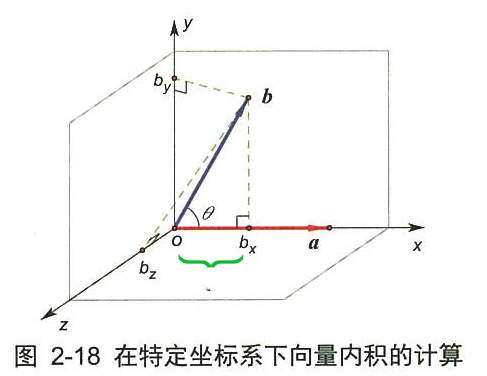

因此,向量"内积"的几何解释, 就是一个向量在另一个向量上的投影的积, 也就是同方向的积.
====

特别地，*如果一个向量(如量a)是某个坐标轴的"单位坐标向量". 那么，两个向量的内积 stem:[ a \cdot b] , 就是向量b在此坐标轴上的坐标值。因此，如果想要将一个向量, 变换到新的坐标系上，就只需进行"内积"运算即可。* 这个结论很重要，这是"傅立叶分析"的理论基础之一。

实际上, *矩阵的乘法运算, 就是"内积"运算. * 两个矩阵相乘, 就是左矩阵的行（向量）, 与右矩阵的列（向量), 进行逐次内积.

'''

==== 点积的几何意义: stem:[ \vec{v} \cdot \vec{w} = \vec{v} \cdot \vec{w'}] ← 其中,stem:[ \vec{w'}] 是 stem:[ \vec{w}] 在 stem:[ \vec{v}] 上的投影长度.

[options="autowidth"]
|===
|Header 1 |Header 2

|→ 如果 stem:[ \vec{w'}] 是stem:[\vec{w}] 在 stem:[\vec{v}] 上的投影长度.
|则:  stem:[\vec{v} \cdot \vec{w} = \vec{v} \cdot \vec{w'}] +
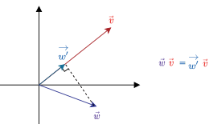

|→ 如果 stem:[\vec{w}] 的投影, 是在stem:[\vec{v}] 的反方向延长线上
|则此时: stem:[\vec{v} \cdot \vec{w} = \vec{v} \cdot \vec{w'} = \text{是负值}] +
image:img/0092.png[,70%]

|→ 如果这两个向量, 本身就互相垂直
|则一个向量在另一个向量上的投影长度, 就为0. 这时它们的"点积"就等于0. +
image:img/0093.png[,70%]]
|===

所以, 注意: "点积"(inner product)运算的结果, 是一个"数"(投影的长度, 就是一个数呀). 这和向量的其他操作是有区别的. 比如:   +
→ 两个向量做"加法", 结果依然是个"向量". +
→ 向量的"数乘", 结果也依然是个"向量".

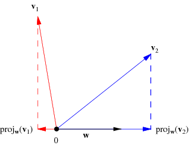

[options="autowidth"]
|===
|Header 1 |Header 2

|若两个向量 stem:[ \vec{x}, \vec{y} ]间的夹角 < 90° | stem:[\vec{x} \cdot \vec{y} > 0]
|若  stem:[\vec{x}, \vec{y}] 间的夹角 > 90°         | stem:[\vec{x} \cdot \vec{y} < 0] 即是个负值.
|若 stem:[\vec{x}, \vec{y}] 间的夹角 = 90°         | stem:[\vec{x} \cdot \vec{y} = 0]
|===

'''

==== 内积的用处: 从"内积"值上, 我们还可以看出两个向量在方向上的接近程度

[options="autowidth"]
|===
|Header 1 |Header 2

|→ 内积值 > 0 时:
|两个向量, 大致指向"相同"的方向 (方向夹角小于90°)

|→ 内积值 < 0 时:
|两个向量大致指向"相反"的方向 (方向夹角大于90°)

|→ 内积值 = 0 时:
|两个向量"互相垂直".
|===

笼统来说，内积值越大，两个向量在方向上的就越接近; 内积值越小，在方向上就越相反。

比如下图: +
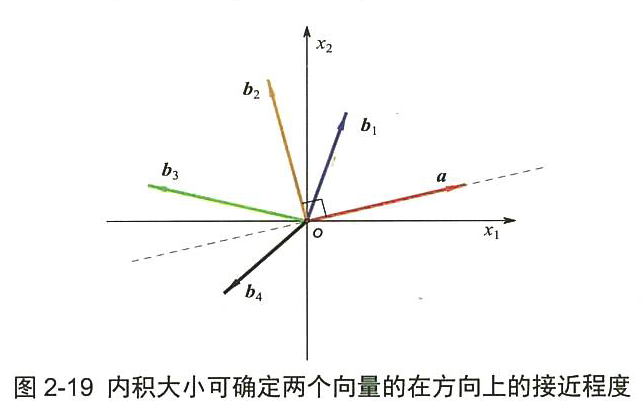

- 向量a 与 stem:[ b_1] 的夹角最小, 方向最接近. 所以它们的内积为正数.
- 向量a 与 stem:[ b_2]  的方向垂直, 内积就为0.
- 向量a 与 stem:[ b_3]  的夹角为钝角, 方向基本相反, 内积就为负数.

'''

==== 点积的做法公式1 : stem:[  x\cdot y = x_1 y_{1} + x_2 y_{2} + x_{3}y_{3}]

两个向量的"点积" (inner product  或 dot product 或 scalar product) : stem:[ \vec{x} \cdot \vec{y}], 也有写作 <x,y> 的形式.

点积的做法公式就是:
\begin{align*}
	 & x=\left| \begin{array}{l}
		            x_1 \\
		            x_2 \\
		            x_3 \\
	            \end{array} \right|,\ y=\left| \begin{array}{l}
		                                           y_1 \\
		                                           y_2 \\
		                                           y_3 \\
	                                           \end{array} \right|, \\
	 & \text{则} :
	\boxed{
	\ x\cdot y = x_1 y_{1} + x_2 y_{2} + x_{3}y_{3}
	}
\end{align*}

即:   stem:[ x\cdot y = x^T \cdot y]  ← 即把 stem:[\vec{x}] 横过来, 变成一行, 再和 stem:[\vec{y}] 的一列相乘. 规则和矩阵的乘法完全一样.
其实:   stem:[x\cdot y = x^T \cdot y = y^T  \cdot x]

'''

==== 点积的做法公式2: stem:[x \cdot y = \text{x的模} \cdot \text{y的模} \cdot cos \theta]

两个向量的点积 = 每个向量"模长"的乘积, 再乘以它们的夹角的cos值.  +
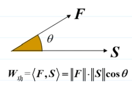

根据"余弦定理", 有 : stem:[ a^2 = b^2 + c^2 - 2(bc \cdot \cos A) ] +
或:  stem:[\cos A = \frac{b^2 + c^2 - a^2} {2bc}]

那么对于由两个向量组成的三角形, 如下图, 就有: +
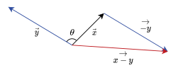

证明过程: +
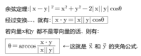

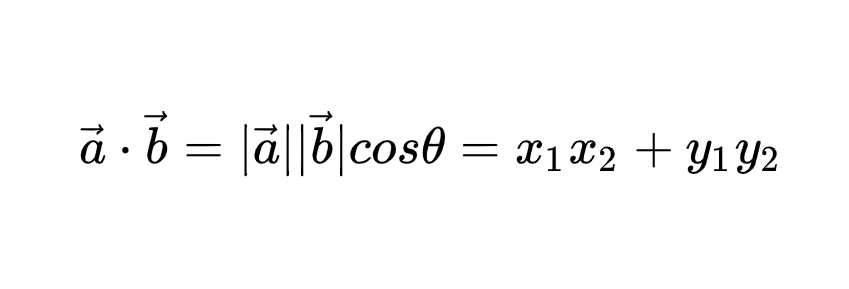 +
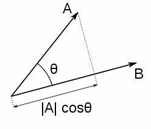 +
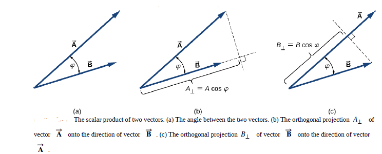 +

根据这个公式, 就可以计算向量a和向量b之间的夹角。从而就可以判断这两个向量是否是同一方向，是否正交(也就是垂直), 等方向关系. 具体对应关系为：

'''

== 向量的 #叉积(外积)# : stem:[ \vec{v} \times \vec{w}]

向量的 叉积 (外积) exterior product 或  cross product

==== 叉积(外积) 的几何意义 : 在二维空间中, 是由这两个向量围成的"平行四边形"的面积, 即是一个数值.

在二维空间中, 几何意义上, 叉积, stem:[ \vec{v} \times \vec{w}], 就是由这两个向量围成的"平行四边形"的面积. +
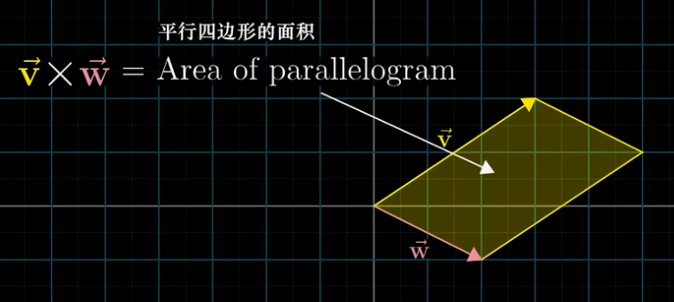

*注意: 顺序会对"叉积"有影响*: 如果 stem:[ \vec{v} \times \vec{w}] 是正数, 则  stem:[\vec{w} \times \vec{v}] 就是负数. *即: 交换叉乘时的顺序, 值要变号.*

之前说过, 行列式的值, 就是表示的是: 将基  stem:[i \times j] 的面积, 缩放多少倍. +
image:img/0074.png[,40%]

面积的概念, 也就证明了: stem:[ 3(\vec{v} \times \vec{w}) = 3 \vec{v} \times \vec{w}] +
把平行四边形其中的任一一条边, 延长3倍 , 变成 stem:[ 3 \vec{v}] 或  stem:[ 3 \vec{w}], 面积也就是 stem:[ = 3 (\vec{v} \times \vec{w})] +
image:img/0075.png[,50%]

'''

==== 叉积(外积) 的几何意义 : 在三维空间中, 是一个垂直于这个"平行四边形"平面的"新向量".

.向量叉积(Cross product):

- 又译为"交叉积"(交叉积的名称来自于其运算规则，因为两个向量作"叉积"运算时，是把向量的元素"交叉相乘";当然其计算符号 a×b 刚好也是叉叉).  +
- *也可称为"外积"，因为叉积会产生新的一维向量。两个向量确定了一个二维的平面，叉积又会产生垂直于这个平面的向量。*

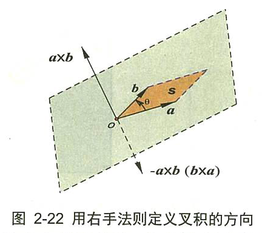

如上图, *a×b 的结果, 为一个新生成的向量. 这个向量, 垂直于a和b展成的平面.* (图2-22中的灰色大平行四边形，由线段oa 和 ob所确定的平面). *向量的大小, 等于以a和b为邻边 所张成的平行四边形*(图中的深色小平行四边形的面积S.

.叉积的公式定义, 也有两个: +
设三维空间中的两个向量为 : stem:[ \vec{a}=\left( a_x,a_y,a_z \right) ,\ \vec{b}=\left( b_x,b_y,b_z \right) ], 则:

[options="autowidth"]
|===
|Header 1 |Header 2

|① stem:[a×b=\left( ab \sin \theta \right) n_0 ]
| ← 其中, stem:[ n_0] 是垂直于a和b展成平面的"单位法向量".

|② stem:[a×b=\ \left( a_yb_z-a_zb_y,\ a_zb_x - a_xb_z,\ a_xb_y - a_yb_x \right)  ]
|← 即, a×b 的: +
x轴的分量是 stem:[a_yb_z-a_zb_y ],  +
y轴的分量是 stem:[ a_zb_x-a_xb_z],  +
z轴的分量是 stem:[  a_x b_y - a_y b_x ] +
|===

换句话说，*"两个三维的向量α和b" 的叉积 stem:[ a×b=\left( c_x,c_y,c_z \right) ],  在空间中张成一个平行四边形面积块，它(即平行四边形面积块)在三个二维坐标平面上的投影, 就是这两个向量的"叉积"的三个分量.* +
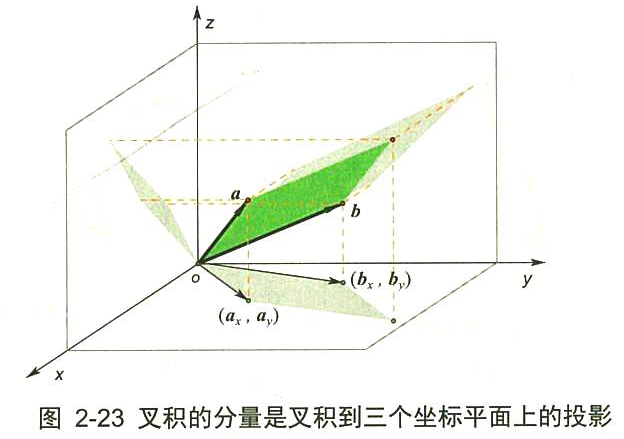

比如，第三个叉积分量 stem:[ c_z =a_xb_y - a_yb_x], 就是在 xoy平面上的投影. 即上图 2-23中 的底部 xoy平面上的灰色平行四边形。

*实际上，叉积的这三个分向量, 分别又是三个叉积的结果 -- 是向量a和b投影的叉积.* +
例如，向量a 在xoy平面上的投影是(stem:[ a_x, a_y])，向量b在xoy平面上的投影是(stem:[ b_x, b_y]) (见图2-23)，那么向量投影的叉积, 就是(stem:[ a_x, a_y]) 和 (stem:[ b_x, b_y]) 的叉积, 亦即 stem:[ \left( a_xa_y \right) ×\left( b_xb_y \right) =a_xb_y-a_yb_x]

*注意: 两个向量的叉积, 只能定义在"三维"空间中. 它不能推广到高维的空间中.* 因为 : +
→  在三维空间里，根据右手法则，定义两个向量a和b的一个叉乘 a×b=c, 仍然是一个向量. 新向量c 垂直于a和b所张成的平面, 并由右手定则"唯一地被确定"。 +
→ 但在四维以上空间里, 则无法定义两个向量的叉积. 比如, 在四维空间里，与四维向量α和b所张成的平面之外, 与之正交的向量, 有无穷多个(一个平面都是)，因此无法以几何方式来"唯一确定"一个向量, 与α和b相联系.

**虽然在四维空间里, 无法定义"两个向量的叉积"，但我们可以定义"三个向量的连叉积" a × b × c, 因为, 这样叉积的方向又可以"唯一确定"了. 所以，在n维空间里，可以有 n-1个向量的"向量积"的公理化定义. **

在三维空间中:
其实, 真正的"叉积", 是通过两个三维向量, 来生成一个新的三维向量. *注意: 在三维空间中, 叉积的结果不是一个数, 而是一个向量!*

.标题
====
如下面的图中所示, A,B两个箭头的向量的"叉积", 就是第三个向量C. 这个C向量, 始终与两个原点箭头(即A,B)正好为90度.  C向量箭头的长度, 就表示A,B向量的叉积, 它总是完全等于A,B所构成的平行四边形的面积.

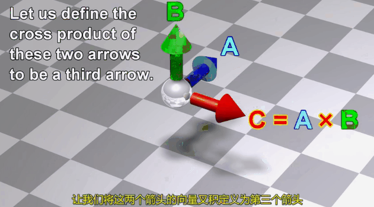 +
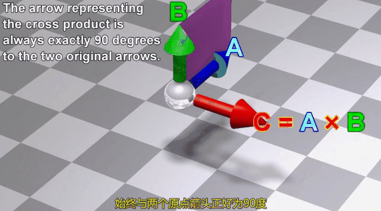 +
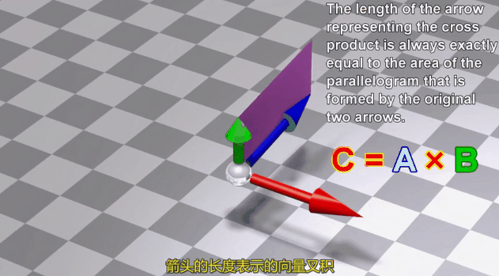 +
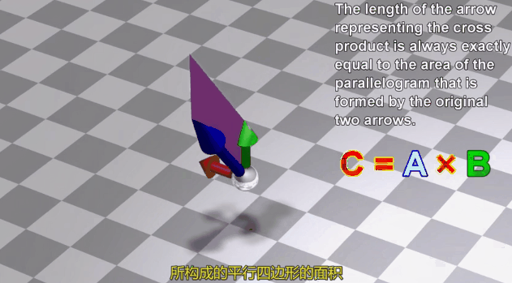 +
====

.标题
====
又如: 假设 stem:[ \vec{v} \times \vec{w} = 2.5], 在三维空间中, 这两个向量构成一个平面(平行四边形). 它们的"叉积"构成一个新向量 stem:[ \vec{p}=2.5], 它与"平行四边形"所在的面"垂直".

image:img/0080.png[,70%]

即: *三维叉积, 得到一个三维矢量.*  +

stem:[\vec{v} \times \vec{w}] 得到新的向量 stem:[\vec{p}]，新向量 stem:[\vec{p}] 的长度, 等于向量 stem:[\vec{v}] 与向量 stem:[\vec{w}] 组成的平行四边形的面积，并且 向量stem:[\vec{p}],  与 向量 stem:[\vec{v}] 和向量 stem:[\vec{w}] 所在平面垂直. +
所以"三维叉积"很容易拿来算平面的"法向量".

但垂直于一个平面的向量, 可以有正反两个方向, stem:[\vec{p} ]到底是朝哪个方向呢? 这就要用到"右手螺旋法则". +
image:img/0081.png[,60%]
====

'''

== 右手螺旋法则

注意顺序: stem:[\vec{a} \times \vec{b} = \vec{c}], 和 stem:[\vec{b} \times \vec{a} = \vec{c}], ← stem:[\vec{c}] 的方向朝向是不同的.

==== stem:[\vec{a} \times \vec{b} = \vec{c}]

[options="autowidth"]
|===
|Header 1 |Header 2

|1.用右手, 伸展手指, 朝向  stem:[\vec{a}]
|image:img/0082.png[,50%]

|2.然后, 握拳, 手指收回, 朝向  stem:[\vec{b}] 的方向.
|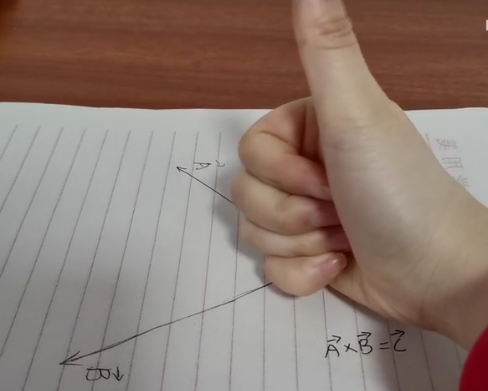

|3.则, 大拇指朝向的方向, 就是 stem:[\vec{a} \times \vec{b} = \vec{c}] 中, stem:[\vec{c}] 的朝向.
|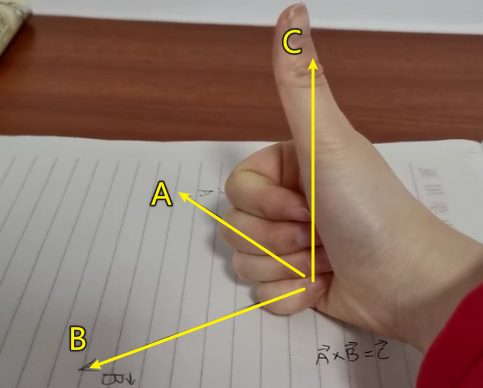 +
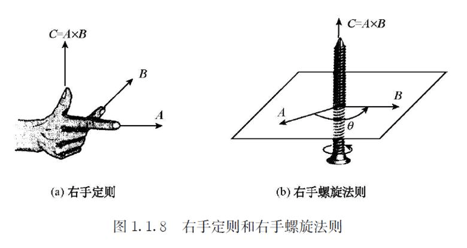
|===

'''

==== stem:[\vec{b} \times \vec{a} = \vec{c}]

[options="autowidth"]
|===
|Header 1 |Header 2

|1.食指朝stem:[向\vec{b}] 的方向.
|image:img/0085.png[,50%]

|2.握拳, 食指等收回. 此时大拇指的方向, 就是 stem:[\vec{b} \times \vec{a} = \vec{c}] 中 stem:[\vec{c}] 的朝向.
|image:img/0086.png[,50%] +
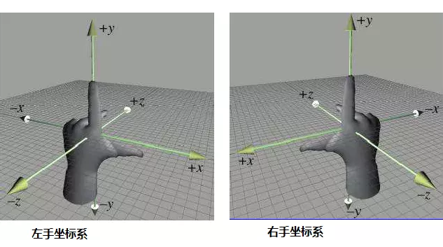
|===

所以, 在3D图像学中，叉乘的概念非常有用，可以通过两个向量的"叉乘"，生成第三个垂直于a，b的"法向量"，从而构建X、Y、Z坐标系.

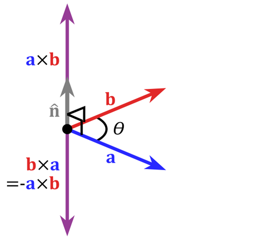
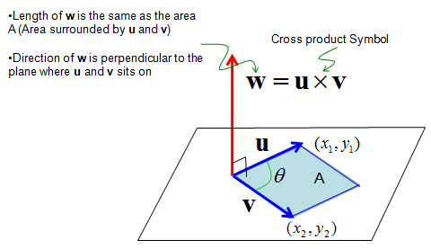

'''
