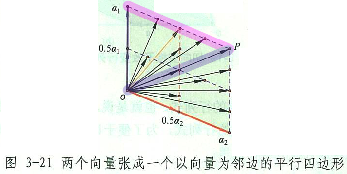
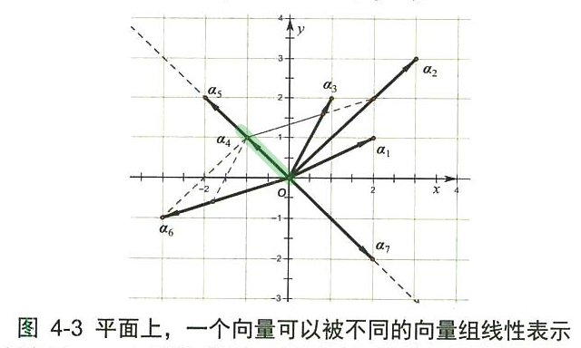
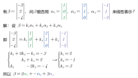
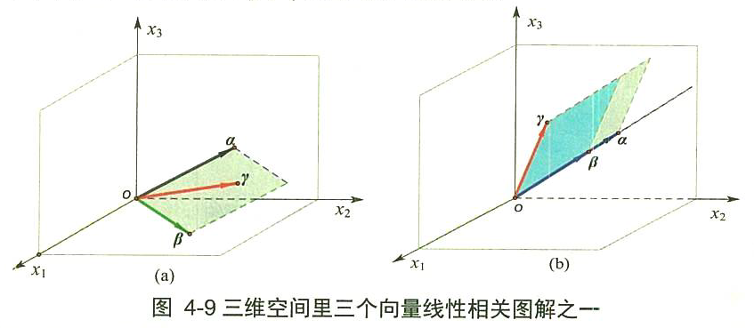
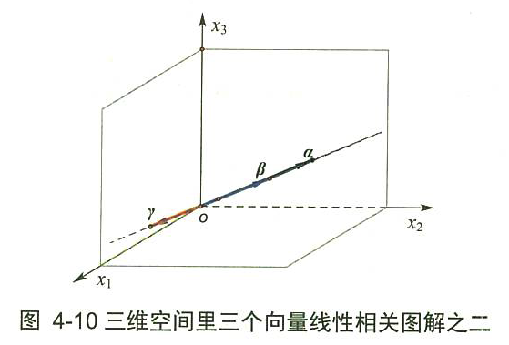
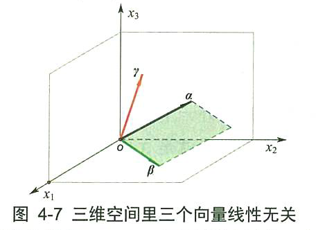
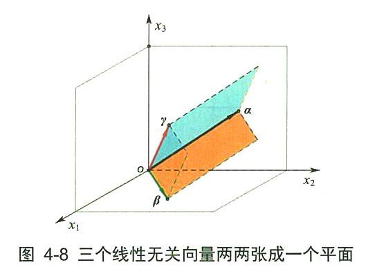
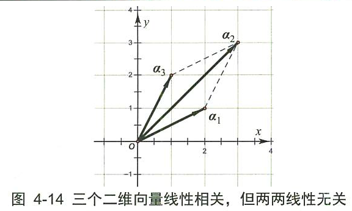
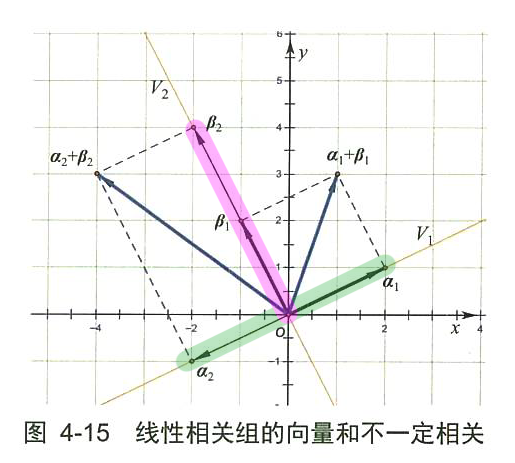

= 向量组 线性无关 & 线性相关
//:stylesheet: my-stylesheet.css
:toc: left
:toclevels: 3
:sectnums:

'''

== 向量组

实数, 可看做一维向量（正负是实数的方向）.  +
复数, 可看做二维向量.

多个向量, 组成"向量组". 向量组关键的概念有: 线性相关性、秩等。有了向量组，就会产生"向量空间"的概念，因为**一个有限元素的"向量组", 会张成一个无限元素的"向量空间"。**  +
在"向量组"张成的"向量空间"里，基、维数、坐标等概念, 完整地勾画出了一个"线性空间"的全貌。如果再加上"线性映射"、"线性变换"和"基变换"等概念，那么"向量空间"就是向量活动的一个社会了。

"线性空间"里, 需要建立"坐标系"才能数量化. 坐标系就是"基"，基就是由几个骨干向量构成的一个"有序向量组"。因此，要讨论"向量空间"，先讨论"向量组"是正点。

向量组, 是对"有限个"向量集合的研究。 +
"矩阵"实际上也是一个有序向量组。"线性方程组"实际上就是向量组的线性表示。因此，在开展矩阵及方程组的研究之前，有必要先研究清楚"向量组"的问题。

向量组里的向量们, 有哪些特性呢?有什么共性?有没有不变量? 有，这个不变的特性, 就是一个叫“秩”的东西。

'''

== 线性组合 : stem:[\beta =k_1\alpha _1+k_2\alpha _2+...+k_n\alpha _n]

由向量(基轴)张成的平行多面体:

如下图, 从两个向量a1, a2, 可以张成一个平行四边形 latexmath:[ o a_1 P a_2]. 在这个平行四边形中有无数的向量, 都满足线性组合 latexmath:[ k_1 a_1 + k_2 a_2  \ (0 \le k_1, k_2 \le 1)]  的定义. 比如:

- 对角线向量 latexmath:[ \vec{oP}] 是长度最大的向量, 满足latexmath:[ k_1 = k_2 = 1] 的条件.
- 所有箭头末端在latexmath:[ a_1 P]这条横线上的向量, 都满足 latexmath:[ k_1 = 1, 且 \ 0 \le k_2 \le 1]的条件.

我们可以推广到n维欧几里德空间中的, m个向量(轴)张成的"m维超平行多面体"。*如果这m个向量表示为 latexmath:[ a_1 ,a_2,...,α_m]，那么这个m维超平行多面体, 就是由以下无穷个向量 latexmath:[ k_1 a_1 + k_2 a_2 + ...+k_m a_m \ (0 \le k_1, k_2, ..., k_m \le 1)] 组成的。*

即, 这个(s维空间的)超平行多面体(空间)中的**任何一个向量, 都可以由另外一个或几个向量(向量组)用"数乘之和"的形式表示出来.** 一般表达式就是: latexmath:[ β = x_1 α_1 + x_2 α_2  + ... +  x_s α_s]. 其中, latexmath:[ x_1, ..., x_s] 是常数(系数, 倍数).  ←这个表达式, 我们就称为: 向量β, 可以由向量组 latexmath:[ {a_1, ... ,a_s}](这里的每一个α, 显然就是基轴了) 来线性表示.

*上式也告诉我们了: 一个向量β 可以被分解为几个向量的倍数的和 (就能拿到了任意平行四边形的对角线处) .*

.标题
====
如下图: *向量 latexmath:[ a_4] 可以由多种向量组, 来线性表示，只要这个向量组所确定的直线、平面或空间, 包含latexmath:[ a_4]即可.*  +

latexmath:[ a_4]:

- 可以被 latexmath:[ a_5] 向量组线性表示
- 可以被 latexmath:[ a_5, a_7] 向量组线性表示
- 可以被 latexmath:[ a_3, a_6] 向量组线性表示

**换言之: 一个向量a, 可以被向量组x"线性表示"的前提是: 这个向量a处于以向量组x的"极大无关组"为"基"的"线性子空间"(即"基"能"张成"的势力范围空间里面)里面. **
====

有 stem:[ \beta, \alpha_1, \alpha_2, \alpha_n], 它们都是n维向量. 若存在 stem:[k_1, k_2, ..., k_n]这些系数(即权重), 能使得 stem:[\beta =k_1\alpha _1+k_2\alpha _2+...+k_n\alpha _n], 则就称 stem:[\beta] 是向量组stem:[\alpha_1, \alpha_2, \alpha_n]的一个"线性组合", 或称 stem:[\beta] 可由向量组stem:[\alpha_1, \alpha_2, \alpha_n] 来"线性表示".

那么这组系数k, 可不可以全取0? 可以. 这样的话,  stem:[\beta=0] 了.

.标题
====

====

'''

== 线性组合的性质

==== 性质: 0向量, 可由任意向量组来表示. 即: stem:[0\text{向量}=\ 0\alpha _1+0\alpha _2+...+0\alpha _n]

'''

==== 性质: 向量组A中, 任取出其中的一个向量stem:[α_i]出来, 它可以由这个向量组A来表示. 如: stem:[\alpha _3=0\alpha _1+0\alpha _2+1\alpha _3...+0\alpha _n]

'''

==== 任意一个向量组, 都可由这些个向量(即"n维单位向量")来表示: stem:[\varepsilon _1=\left( 1,0,...,0 \right) ,\ \varepsilon _2=\left( 0,1,...,0 \right) ,\ ...\ ,\varepsilon _n=\left( 0,0,...,1 \right) ]

例如:
\begin{align*}
\left| \begin{array}{c}
	1 \\
	2 \\
	3 \\
\end{array} \right|=1\left| \begin{array}{c}
	1 \\
	0 \\
	0 \\
\end{array} \right|+2\left| \begin{array}{c}
	0 \\
	1 \\
	0 \\
\end{array} \right|+3\left| \begin{array}{c}
	0 \\
	0 \\
	1 \\
\end{array} \right|
\end{align*}

'''

== 线性相关

若向量 α, β, γ "线性相关". 可以包括两种情况:

[options="autowidth"]
|===
|Header 1 |Header 2

|1.一种情况是: 三个向量在一个平面上(三向量共面).
|

|2.另一种情况是: 三个向量在一条直线（共线)上.
|
|===

线性相关 linearly dependent: +
对于n个m维的向量 stem:[ \vec{v_1},  \vec{v_2}, ...  \vec{v_n}], 若存在一组 k (系数, 倍数)不全为0, 使得 stem:[ k_1  \vec{v_1} + k_2  \vec{v_2} + ... + k_n  \vec{v_n} = 0 ], 则称 stem:[ \vec{v_1},  \vec{v_2}, ...  \vec{v_n}] 是"线性相关"的.

.标题
====
下面这三个向量, 是否线性相关?
\begin{align}
		\left| \begin{array}{l}
			1 \\
			0 \\
		\end{array} \right|,\ \left| \begin{array}{l}
			0 \\
			1 \\
		\end{array} \right|,\ \left| \begin{array}{l}
			2 \\
			3 \\
		\end{array} \right|
\end{align}

那么就看下面这个式子, 是否能存在非零的系数 (只要有一个k是不为零的, 就满足了我们的条件)

\begin{align}
		k_1\left| \begin{array}{l}
			1 \\
			0 \\
		\end{array} \right|+k_2\left| \begin{array}{l}
			0 \\
			1 \\
		\end{array} \right|+k_3\left| \begin{array}{l}
			2 \\
			3 \\
		\end{array} \right|=0
\end{align}

那么显然, 当 stem:[ k_1]取2, stem:[k_2]取3, stem:[k_3]取1时, 该式子能成立. 即, 的确存在一组非零的k. +
这就说明, 这三个向量, 是"线性相关"的. (不需要所有的系数k都不为0, 只要有一个系数k不为零就行了.)
====

若只能是 k全为0时, 该等式才成立, 那么这些向量 stem:[ \vec{v_1},  \vec{v_2}, ...  \vec{v_n}] 就是"线性无关"的 (linearly independent).

"线性无关"就表示, 这组向量中的任何一个, 都无法表示成其他向量的"线性组合". 即, 它们中每一个向量, 都是"独当一面"的, 无法被其他向量所替代.

'''

== 线性无关

- *如果一个向量, 可以由一个"向量组"来线性表示，我们就称这个向量和向量组"线性相关"。* +
- 另外的说法就是: *一个向量组里, 只要有一个向量可以由组内的其他向量"线性表示"，我们就称这个向量组"线性相关"。反之，如果向量组里的任意一个向量, 都不能由其他向量"线性表示"，我们就称向量组"线性无关"。*

比如下图: +

若向量 α, β, γ "线性无关". 即它们两两之间都"线性无关". 比如, α, β线性无关, 就是它们不在同一条(一维的)直线上, 而是这两个向量能构成一个二维平面. 这个平面上所有的向量, 就是 latexmath:[ x_1 a + x_2 β] (latexmath:[ x_1, x_2] 为任意实数). +
进一步, *α, β, γ 都"线性无关", 就是这三个向量中任意一个, 都不在其余两个向量所张成的二维平面内.*

'''

==== 注意: 三个向量, 两两都是"线性无关", 并不能推导出这三个向量作为整体也"线性无关".

比如下图: 向量组 latexmath:[ \{a_1, a_2, a_3\}], 其中∀两个向量, 都是"线性无关"的. 如 a1和a2 是线性无关的; a1 和 a3 是线性无关的; a2 和 a3 也是线性无关的. 但 latexmath:[ a_2 = a_1 + a_3], 所以这个向量组 latexmath:[ \{a_1, a_2, a_3\}] 依然是"线性相关"的.

上面这个例子,其实说明, 对于二维平面, 其实只需要两个基轴就能"张成"出来了. 而上图中却给了三个向量, 显然有一个向量是多余的. 则这三个向量必然"线性相关"! +
所以, *n维向量空间里, 若存在 n+1个以上的向量, 则它们必定"线性相关".*

'''

==== 若 latexmath:[ a_1 和 a_2]线性相关, [ β_1 和 β_2] 也线性相关, 则不能推导出 latexmath:[ a_1 + β_1] 和 latexmath:[ a_2 + β_2] 也线性相关.

如下图,  latexmath:[ a_1 + β_1] 和 latexmath:[ a_2 + β_2] , 不在同一条直线上, 显然它们线性无关.

这个例子说明: α1 和 α2 在空间V1(直线）上; β1 和 β2 在空间 V2(直线)上，两个不同空间上的向量（零向量除外）相加，必然会进入第三个空间(直线)、第四个空间（直线）, ... 以致布满整个二维空间（平面). 显然 latexmath:[ a_1 + β_1] 和 latexmath:[ a_2 + β_2] 绝大部分会"线性无关".

'''

== 向量组等价

- *两个向量组A和B的"等价", 就是指: 这两个向量组, 能够互相被"线性表示"。即: 向量组A中的每一个向量, 都可以被向量组B"线性表示"; 同样，向量组B中的每一个向量, 也可以被向星组A"线性表示"。* +
或者说: 如果把一个向量组中的任意一个向量拿出来, 放到另外一个向量组中，那么另外这个扩大的向量组, 就会"线性相关"，而不论原向量组是否线性相关。

- *两个向量组"等价", 就是两个向量组所扩张成的直线、平面或空间, 相互重合。*

'''
