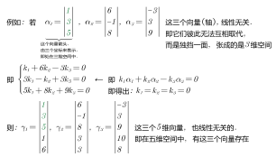

= 向量组 线性无关 性质
//:stylesheet: my-stylesheet.css
:toc: left
:toclevels: 3
:sectnums:

'''

== 线性无关的 性质, 定理

==== 任意一个非零向量, 必"线性无关".

如: stem:[k\vec{v}]. 因为 stem:[\vec{v} \ne \vec{0}], 则只能系数 k=0, 这样本例中, 我们就找不到一组不全为0的k, 那么这一向量必"线性无关".

'''

====  ① "线性无关"的向量组, 把每个向量的内部的维度, 往后接长, 则新的向量组, 依然是"线性无关"的.  ②"线性相关"的向量组, 把每个向量的内部的维度, 截短后, 则新的向量组, 依然是"线性相关"的.}

.标题
====

====

'''

==== n个n维向量( 即,此处是"向量的个数"="每个向量自己的维数")所构成的行列式, 则: ① 若  stem:[|D| \ne 0], 则这些向量就是"线性无关"的. ② 若 D=0, 则这些向量是"线性相关"的.

.标题
====
如: 这三个向量是"线性相关"还是"无关"的?
\begin{align*}
		\left| \begin{array}{l}
			1\\
			0\\
			3\\
		\end{array} \right|,\ \left| \begin{array}{l}
			2\\
			1\\
			1\\
		\end{array} \right|,\ \left| \begin{array}{l}
			1\\
			1\\
			0\\
		\end{array} \right|
	\end{align*}

那么我们就来算算它们作为一个整体的行列式的值, 是否=0?
\begin{align*}
		\left| \begin{matrix}
			1&		2&		1\\
			0&		1&		1\\
			3&		1&		0\\
		\end{matrix} \right| = ?
	\end{align*}
====

'''

==== n维的"单位向量"组 (单位向量, 显然就是"基轴"本身了), 是它们是"线性无关"的.

'''

==== 替换定理:在线性空间中, 给出两个有限向量组: stem:[a_1, a_2, ..., a_t], 与 stem:[b_1, b_2, ..., b_s]. 若向量组1是"线性无关''的，并且"向量组1"可由"向量组2"来线性表示的话，则:  stem:[t \leq s].

向量组1中向量, 是"线性无关"的. 所以它的t轴(都属于基轴了), 彼此独立, 成为独当一面的维度.  +
向量组2中的向量, 可以用来表示向量1中的轴. 这就意味着, 向量组2中可能存在多余的"伪轴". 所以"向量组2"中的向量数量s, 一定是 stem:[\geq] "向量组1"中的向量数量t的.

'''
