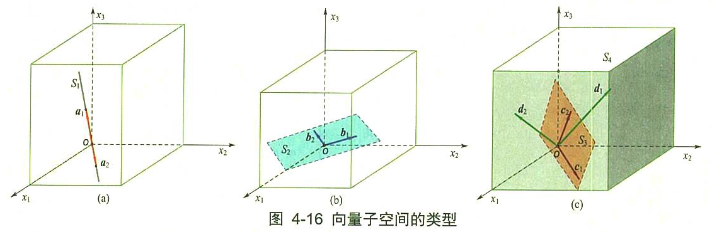
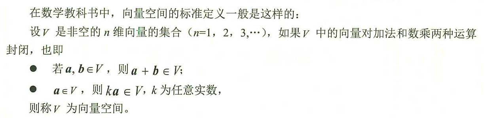
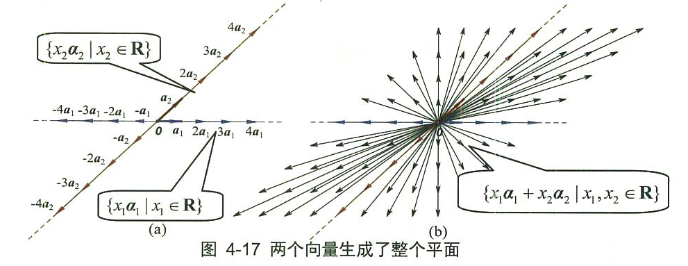
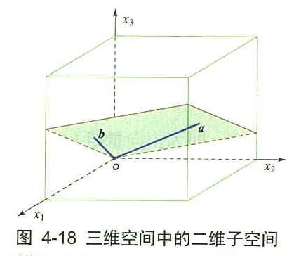
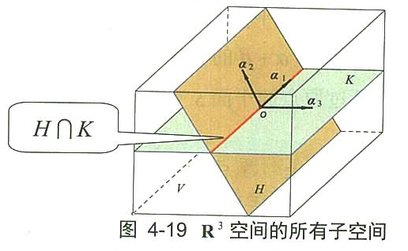
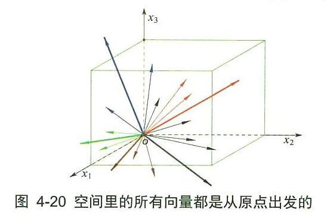
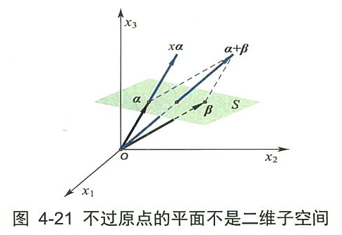

= 向量空间
//:stylesheet: my-stylesheet.css
:toc: left
:toclevels: 3
:sectnums:

'''

== 向量空间(即线性空间)的几何意义

向量的集合, 通常叫做"向量空间". +
向量空间的基本规则只有两条: ① 任意两个向量相加, 不能超出空间. ②任意一个向量伸头缩脑（数乘）,也不能超出空间.

空间和子空间的图形, 大致有下图所示的几类:

[options="autowidth"]
|===
|Header 1 |Header 2

|左图,
|向量子空间 latexmath:[ S_1] 是一根"直线", 包含向量 a1、a2, 因为这两向量在直线上. **latexmath:[ a_1, a_2] "相加"和"数乘"运算, 不会超出直线的范围。**

|中图
|向量子空间latexmath:[ S_2] 是一个"平面"，包含向量 b1、b2. 显然向量 b1、b2 相加和数乘运算, 也不会超出平面latexmath:[ S_2]的范围。

|右图
|同样，向量子空间latexmath:[ S_3] 中的c1、c2,也遵守相同的规则.

另外, *整体看这三张图, S1, S2,和 S3, 都是S4 的子空间，它们包含的向量 latexmath:[ a_i、b_i、c_i、d_i],都属于latexmath:[ S_4] 空间，所有向量的"相加"和"数乘", 都不会超出三维空间的范围。*
|===

所谓"封闭", 就是说: 计算结果还是落在这个集合中.

"空间"和"子空间"的说法可以不加区别，一个空间也可以是自己的子空间。

.向量空间, 主要有两种:
1. 一种是由v中的一个向量组, 张成的空间（比如由"特征向量"张成的"特征子空间"等).
2. 另一种是由"齐次线性方程组"的解集, 组成的"解空间"(即"原像x"组成的空间)。实际上，线性方程组的解空间, 也是由"解向量"所张成的。

'''

==== 由向量(基轴)所"张成"的空间

如下图, 由 向量组 latexmath:[ \{a_1, a_2\}] 所"张成"的向量空间平面S,  +
latexmath:[S=Span\left\{ a_1,a_2 \right\} =\left\{ x_1a_1+x_2a_2\ |\ x_1,x_2\in R \right\}  ]

**由向量所张成的线性空间, 是无穷大的. 空间里的向量也是无穷多的。**因为在"向量空间"的数学定义式 latexmath:[ \left\{ x_1a_1+x_2a_2+...+x_na_n\  |\ x_1,x_2,...x_n\in R \right\} ]中, *系数可以无穷大, 所以可以"张成"无穷大的空间。*

'''

== 子空间的几何意义

"子空间"的一般定义是这样的: 如果V和H 都是向量空间，而且 latexmath:[ H\subset V]，则称H是V的"子空间"。

比如, 在5维空间中, 你用4个向量来张成一个空间, 这4个向量最多也只能张成出一个4维空间. 显然, 这4维空间就是5维空间的子空间了.

**注意: 零向量存在于所有空间中. 即任意一个子空间, 都要包含"0向量"，否则就不能满足"加法"和"数乘"的封闭运算。** +

.标题
====
下图, 在3维空间中, 用两个三维向量 latexmath:[\vec{a}=\left( a_1,a_2,a_3 \right)  ] 和 latexmath:[\vec{b}=\left( b_1,b_2,b_3 \right)  ] 来张成一个平面的二维空间. 这个过原点的二维平面, 显然就是3维空间中的二维"子空间" (*相当于把二维平面放在了3维空间中, 只不过二维子空间里的向量, 和三维空间里的向量一样, 都是三维的向量*).

====

.标题
====
比如, 三维向量空间 latexmath:[ R^3], 它的所有子空间包括:

- 三维子空间: 本身 latexmath:[ R^3=Span\left\{ a_1,a_2,a_3 \right\} ] (latexmath:[a_1,a_2,a_3] 线性无关). 作为自身的子空间表现为一个立体空间，同自身一样，也包含原点.
- 二维子空间: 如 latexmath:[ Span\left\{ a_1,a_2 \right\}] (latexmath:[a_1,a_2] 线性无关). 表现为通过原点的任意一个平面（注意: *二维空间latexmath:[ R^2] 不是latexmath:[ R^3]的子空间*)
- 一维子空间:如 latexmath:[ Span\left\{ a_1 \right\} \ \left( a_1\ne 0 \right) ], 表现为通过原点的任意一条直线.
- 零维子空间:只包含原点0向量,只有零空间。

下图 4-19 给出了latexmath:[ R^3] 的所有子空间的图形。

图中，V为三维向量空间即 latexmath:[R^3]:

- 它可以由 latexmath:[Span\left\{ a_1,a_2,a_3 \right\}  ] (a1, a2, a3 线性无关) 表示
- latexmath:[H=Span\left\{ a_1,a_2 \right\}  ](a1, a2线性无关) , 表示一个二维子空间
- latexmath:[K=Span\left\{ a_1,a_3 \right\}  ](a1, a3线性无关) , 表示另一个二维子空间
- H和K 的公共集合交集 latexmath:[ H∩K =Span \{a_1\}(a≠0)]，是一维向量子空间
- 上述所有的子空间, 皆包含零向量 0= (0,0,0). 当然零向量自身可以组成一个零空间。

====

'''

==== 子空间必须要过"原点"的几何意义

*所有子空间, 一定要包含"零空间"在内.*  +
实际上，在"坐标系"下讨论的向量，不能称之为自由向量，因为所有的向量的尾部, 都被拉到了原点上. 或者说，空间里的所有向量都是从原点出发的（见图4-20)，大家都有一个共同的零空间，这就是为什么所有的子空间一定要包含零空间的原因了。

为什么要把向量的尾部, 都拉到原点呢? -- 就是为了更方便地用解析方法, 来研究向量. 因为这样就可以把向量和空间中的点一一对应起来。空间中一旦建立起了坐标系，点有坐标值，这样向量就有了解析式, 我们就可以使用矩阵技术, 来进行分析计算了。 +
假设一个子空间没有通过原点，就可能造成向量头部(即箭头终点)在子空间上, 而尾部(即起点)在空间外(因为原点在空间外)。当然，向量的加法和数乘也都跑出这个子空间外面去了，如图4-21所示。*这说明对线性变换运算不封闭，因此这个“子空间”不是真正的向量空间。*

图4-21中，**严格来讲, 向量α和β 并不在平面空间s中，因为只有向量的身体的全部在上面才算数,** 而上图中, 只有向量α和β的头部在平面上。 +
但如果α和β向量, 是采用点坐标解析式表达的话，我们常会误认为这两个向量（实际是点）在平面上。即便这样，*向量α的数乘 latexmath:[ x \vec{a}] 的头部, 还是超出了平面s之上. α和β相加的"和向量α+β"的头部, 也超出了平面之上。因此，它们对向量的加法和数乘运算, 不封闭。所以，不过原点的平面s, 绝对不是二维向量子空间。*

*实际上，在三维几何向量空间中，凡是过"原点"的平面或直线上的全体向量, 组成的集合, 都是latexmath:[ R^3]的子空间，而不过原点的平面或直线上的全体向量, 组成的集合, 都不是latexmath:[ R^3]的子空间。*

'''
