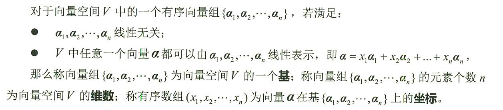
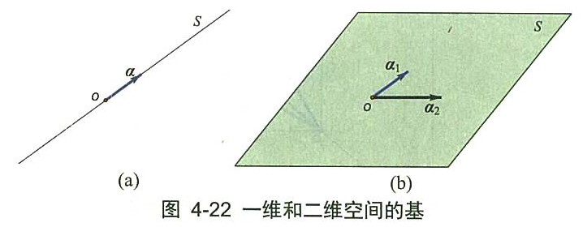
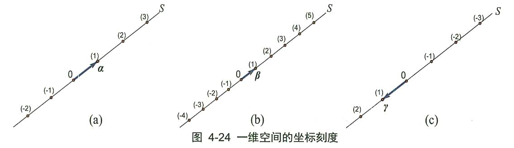
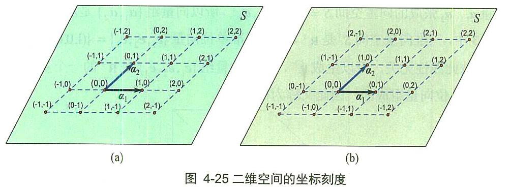
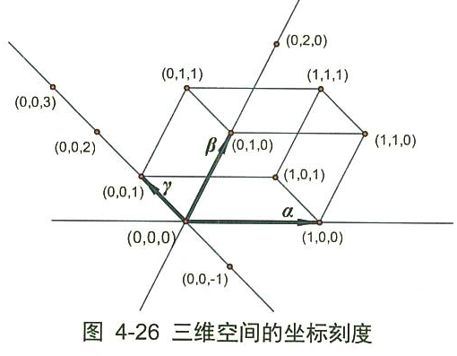
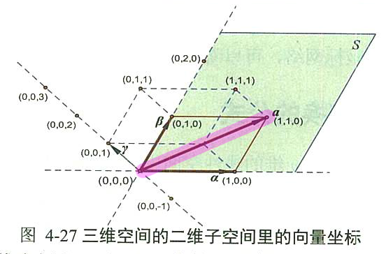
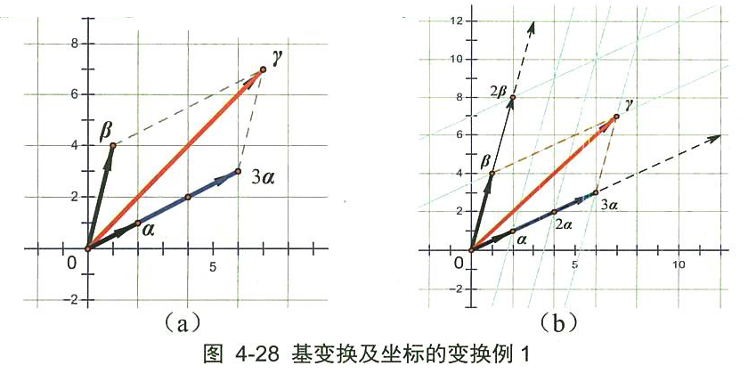

= 基
//:stylesheet: my-stylesheet.css
:toc: left
:toclevels: 3
:sectnums:

'''

== 基

什么是"基"? +

有几个基轴，撑出的空间就是几维度的.

我们给一个"向量空间"找一个基，目的是为了给这个空间定一个坐标系，以方便我们定位和计算向量。 **一个基, 实际上就是选取的一个坐标系. 另外一个基,就是选取另一个新的坐标系。** +
*基向量, 对应坐标系的坐标轴(所以叫"基轴")，有几个基向量就有几个坐标轴*. n维空间的一个基, 就需要有n个基向量。(*注意: "一个基"不是指一个轴, 而是指"一个坐标系"(可以包括n个轴)*)

.标题
====

上图左,  向量组latexmath:[ \{\vec{a} \}], 是一维向量空间S的一个基. +
上图右, 向量组 latexmath:[ \{\vec{a_1}, \vec{a_2} \} ], 是向量平面S的一个基.
====

**一个"基"包含的向量个数, 就是坐标轴的个数，也就是向量空间的"维数"。** +
维数是空间的一个本质特征，它不依赖于基的选取。选取不同的基，基向量的个数不会改变，它支撑起的空间维数不会变。

'''

=== 一个向量空间的"基"选定后,其坐标是什么? -- 坐标轴的刻度, 是以所选"基向量"的长度, 为基本单位的.

==== 一维空间的基

如上图:

- 一维空间 S, 维数为1，只需一个基向量。当选取的基为latexmath:[ \{ \vec{a} \}]时，坐标选取见图4-24(a).
- 当选取的新基向量β 为0.5a时，坐标刻度的密度加大一倍，见图4-24(b).
- 当选取的新基向量z 为 -α 时，坐标轴方向也随之反转，见图4-24 (c).

*显然，坐标轴的刻度, 是以所选"基向量"的长度, 为基本单位的.*

'''

==== 二维空间的基

如下图,  +

在二维空间S中, 只需要两个基向量. 当选取的基为{α1, α2}时，坐标选取见图4-25( a)。两个坐标轴分别与"基向量"latexmath:[ a_1, a_2]共线，*刻度的划分是遵循向量加法的平行四边形规则. 或者说，坐标网络, 就是由坐标轴上的"基向量"为基本单位, "作平行线"所构成.*

另外, **要注意"基向量"的顺序. 如果基向量的顺序进行了调整，坐标值也会相应进行调整。**在图 4-25(b）中，我们把图4-25(a）的空间 S 的基 latexmath:[ \left\{ \overrightarrow{a_1},\overrightarrow{a_2} \right\}] 调换顺序, 成为一个新的基 latexmath:[ \left\{ \overrightarrow{a_2},\overrightarrow{a_1} \right\}]，自然, 空间中的坐标也要变了.

从上面可以看出:

- 两个基向量不一定垂直.
- 一个基向量的方向, 是对应坐标轴的正方向.
- 坐标单位, 是基向量的长度。

'''

==== 三维空间的基

如下图, 三维空间的一个基, 包含了三个线性无关的向量{a,β,γ}，空间以α、β、γ为基的坐标刻画, 满足平行六面体法则，见图4-26. 向量(1,1,1)是与"原点"相对应的平行六面体的"对角点"。

'''

==== 三维空间的"子空间"的基, 及其向量坐标

如上图, 在三维空间 Span{α,β,γ}中, 对角线那个粉红色向量a的坐标, 是(1,1,0). 该向量如果放在由向量组{α, β} 张成的子空间 S=  Span{α,β}中 (即绿色的平行四边形二维空间中), 又是什么呢? 坐标就变成了 (1,1).

'''

== 基变换(即坐标系变换)的几何意义

如上图, 在直角坐标系下(实际上是在"单位正交基"i、j 的空间中), 向量γ的坐标是(7,7). +
但若以α, β 来作为一对基的话, 在由它们张成的新坐标系(右图b)中, 向量γ的坐标就是(3,1). 即 latexmath:[ γ = 3α + β]

所以, 同一个向量, 在不同的基(即坐标系)下, 有不同的坐标. 这两个基(坐标系)是可以互相转换或变换的. 按什么规则来变换呢? 按一个矩阵(相当于函数)作为规则, 来变换. 这个矩阵, 就称为"过渡矩阵".

'''

== 仿射坐标系

在空间中任取一点0，以点0为起点, 任意作三个不共面的向量 latexmath:[ ε_1, ε_2,ε_3]，这就建立了一个"仿射坐标系"，记为 latexmath:[ \left\{ 0;\varepsilon _1,\varepsilon _2,\varepsilon _3 \right\} ].

仿射坐标系, 按手征性分为: 左手坐标系, 和右手坐标系。 +
如果仿射坐标系 {0; i, j, k} 的基 i、j、k 是"两两垂直"的单位向量, 则称之为直角坐标系。 i、 j、 k 所在的坐标轴, 分别称为x轴、y轴和z轴。*我们常用的直角坐标系, 为"右手直角坐标系"。*

'''

