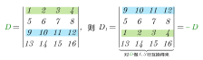
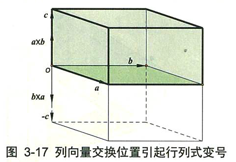
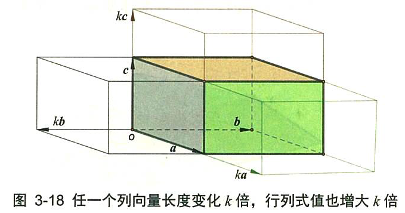
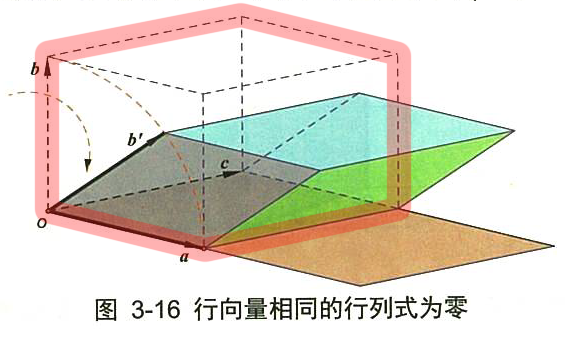
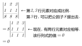
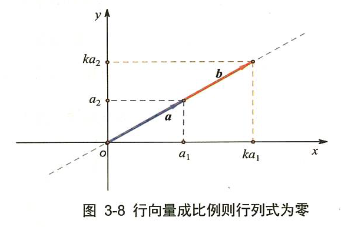
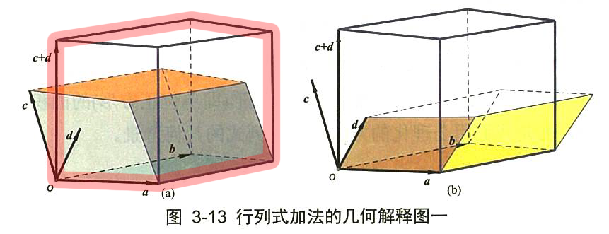
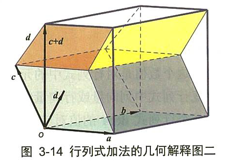
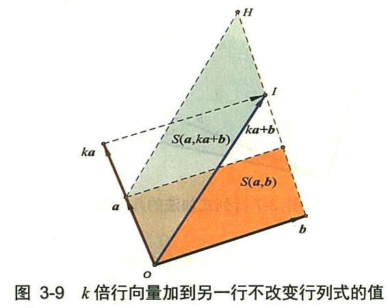
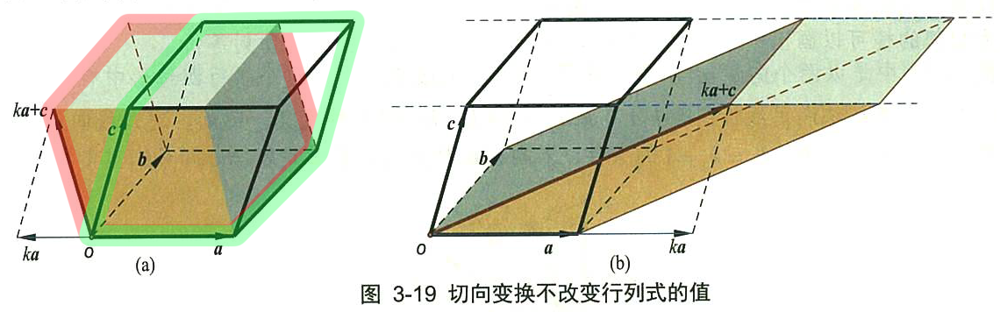

= 行列式的性质
//:stylesheet: my-stylesheet.css
:toc: left
:toclevels: 3
:sectnums:

'''

== 行列式的性质

注意: 对"行"成立的性质, 对"列"也成立.

=== stem:[\left( D^T \right) ^T=D ]

'''

=== stem:[D^T=D] ← 行列式转置与否, 其值不变

'''

=== 行列式中两行(两列也行)互换, 行列式的值, 就改变正负号

即:

这个性质由行列式的"叉积"特性得到的。交换行列式的两行，就是改变了向量α和b 的叉积顺序，根据 stem:[ a×b=- b× a]，因此行列式换号。

这个性质即: latexmath:[ det(a,b,c) = - det(b,a,c)]

一般地，一个行列式 det A 的值, 对应矩阵A的"列向量"的一个固定顺序。当改变 detA 的列向量中的元素顺序时, detA 就为之前的"负值". 相当于是原像的一个倒影反射了. 如下图.

实际上, latexmath:[ 	\det \left( a,b,c \right) =\left( a×b \right) \cdot c=-\left( b×a \right) \cdot c\\
	=-\det \left( b,a,c \right)\\
	=\det \left( b,a,-c \right)]

'''

=== 某一行都乘以k, 等于用k乘以这个行列式D.  即 → latexmath:[ k \cdot det(a,b,c)=  det(ka,b,c) = det(a,kb,c) =  det(a,b,kc) ]

即:
\begin{align*}
	\left| \begin{matrix}
		1&		2&		3\\
		4k&		5k&		6k\\
		7&		8&		9\\
	\end{matrix} \right|=k\left| \begin{matrix}
		1&		2&		3\\
		4&		5&		6\\
		7&		8&		9\\
	\end{matrix} \right|
\end{align*}

换言之就是: 如果行列式中的某行, 有公因子k, 则k可以提到行列式外面去.

如果每行都有k, 则每行都要提一次k. 比如一共有3行, 就提3次k.
\begin{align*}
	\left| \begin{matrix}
		1k&		2k&		3k\\
		4k&		5k&		6k\\
		7k&		8k&		9k\\
	\end{matrix} \right|=k^3\left| \begin{matrix}
		1&		2&		3\\
		4&		5&		6\\
		7&		8&		9\\
	\end{matrix} \right|
\end{align*}

即: 如果一个n阶行列式的所有元素, 均有公因子k, 则 k 就向外提 n次(因为有n行, 每行只需提一次, 就是提n行次).

用公式表示, 这个性质就是: latexmath:[ k\left| \begin{array}{l}
	a\\
	b\\
	c\\
\end{array} \right|=\left| \begin{array}{l}
	ka\\
	b\\
	c\\
\end{array} \right|=\left| \begin{array}{l}
	a\\
	kb\\
	c\\
\end{array} \right|=\left| \begin{array}{l}
	a\\
	b\\
	kc\\
\end{array} \right|]

这个性质, 从下图上就可以看出来. *将一个立方体的任何一条轴边, 扩大k倍. 就会导致该立方体的体积变成扩大k倍的.*

'''

=== 行列式, 若两行(或两列)的元素相等, 则该行列式的值=0

.标题
====
有这个行列式, 其第1,3行上的元素, 完全相同.
\begin{align*}
	D=\left| \begin{matrix}
		2&		3&		4&		5\\
\hline
		1&		0&		0&		0\\
		2&		3&		4&		5\\
\hline
		8&		8&		8&		1\\
	\end{matrix} \right|
\end{align*}

我们对它的1,3行做交换, 得到的 stem:[ D_1 = -D] (因为交换两行, 行列式的值要变号). 而新的stem:[ D_1]的内容, 和老D依然是完全一样的. 于是我们就有: D=-D, 即 2D=0, 即 D=0. +
于是我们就得到了这个性质: 行列式,  若两行(或两列)的元素相等, 则该行列式的值=0.
====

这个性质即: stem:[ det(a,a,c)=0]

三阶行列式 latexmath:[ det(a,b,c)] 的值, 是由这三个列向量, 作为三条轴边来构成一个立方体(如下图的红色框立方体). 这个的立方体的体积, 就是这个三阶行列式的值. +
*而如果这个三阶行列式, 变成了 latexmath:[ det(a,a,c)] 的话, 也就是它有两条轴边重合了, 变成了只有两个轴(a和c)存在. 换言之, 这个立方体, 就变成了一个二维平面(被降维了. 变成了下图中的 土黄色平面). 显然, 二维平面的体积就是0了.* 即也就是本处性质所说的内容.

所以:

- 三阶行列式, 表示平行六面体的"有向体积". 如果其中有某两列(两个轴边)"相等"或"成比例"，就说明这两个轴重合为一了, 或在同方向上. 这个三维体积, 也就被"降维"成了二维平面. 面积为零.
- 二阶行列式, 表示平行四边形的"有向面积". 如果两列相等，就说明这个二维平行四边形的两个轴边, 重叠了, 变成了一维物体, 就是一条线段了,面积也为零.
- 一般地, n阶行列式, 可以想象成一个n维超立方体的n维"体积"，如果它有某两列"相等"或"成比例"，则该“n维立方体”就降维成 n-1维, 或者更低维数的图形，“n维维度的体积”当然就等于零。

'''

=== 行列式的两行(或两列)元素, 对应成比例, 则该行列式的值=0

比如, 对于二阶行列式来说: +

latexmath:[ \left| \begin{matrix}
	a_x&		k\cdot a_x\\
	a_y&		k\cdot a_y\\
\end{matrix} \right|] ← 第二列, k倍的向量a, 我们若称为向量b的话, 就有下图的样子: +

显然, 向量a 和 b 共线了. 而二阶行列式的值, 是这两个向量构成的平行四边形的面积值. *而共线的两个向量, 构成的平行四边形, 显然就是0面积了.* 所以就证明了本性质: 行列式的两行(或两列)元素, 对应成比例, 则该行列式的值=0.

'''

=== 某一行全为0, 则D=0

现在, 我们就有了:
\begin{align*}
	\left. \begin{array}{r}
		\text{两行上的元素,对应成比例}\\
		\text{某一行元素,全为}0\\
		\text{两行相等}\\
	\end{array} \right\} \ →\ \text{则 }D=0
\end{align*}

上面, 左边可以推导出右边. 但反过来, 右边是无法推导出左边的. 即 D=0 的行列式, 未必是属于左边的三种情况之一.

'''

=== 某一行上的元素, 是两个元素的和的话, 则该行列式就可以拆成这两个行列式相加

.标题
====
即:
\begin{align*}
	\left| \begin{matrix}
		1&		2&		3\\
		7+8&		2+3&		9+10\\
		8&		8&		9\\
	\end{matrix} \right|=\ \left| \begin{matrix}
		1&		2&		3\\
		7&		2&		9\\
		8&		8&		9\\
	\end{matrix} \right|+\left| \begin{matrix}
		1&		2&		3\\
		8&		3&		10\\
		8&		8&		9\\
	\end{matrix} \right|
\end{align*}
====

注意: 拆分的时候, 只能拆"是和那一行", 其他行的元素要保持不变!
.标题
====
如:
\begin{align*}
	\left| \begin{matrix}
		b+c&		c+a&		a+b\\
		a+b&		b+c&		c+a\\
		c+a&		a+b&		b+c\\
	\end{matrix} \right|\ne \left| \begin{matrix}
		b&		c&		a\\
		a&		b&		c\\
		c&		a&		b\\
	\end{matrix} \right|+\left| \begin{matrix}
		c&		a&		b\\
		b&		c&		a\\
		a&		b&		c\\
	\end{matrix} \right|\ ←\text{这种拆分是错的!}
\end{align*}

正确的拆分是如下 (比如拆第一行的话):
\begin{align*}
	\left| \begin{matrix}
		b+c&		c+a&		a+b\\
		a+b&		b+c&		c+a\\
		c+a&		a+b&		b+c\\
	\end{matrix} \right|\ne \left| \begin{matrix}
		b&		c&		a\\
		a+b&		b+c&		c+a\\
		c+a&		a+b&		b+c\\
	\end{matrix} \right|+\left| \begin{matrix}
		c&		a&		b\\
		a+b&		b+c&		c+a\\
		c+a&		a+b&		b+c\\
	\end{matrix} \right|
\end{align*}
====

.这个性质的几何解释:
就是对于行列式 latexmath:[ \det \left( a,b,c \right) =\left| \begin{array}{c|c|c}
	a_1&		b_1&		c_1\\
	a_2&		b_2&		c_2\\
	a_3&		b_3&		c_3\\
\end{array} \right|],  +
有性质: latexmath:[ \det \left( a,b,\underset{}{\underbrace{c+d}} \right) =\det \left( a,b,\underset{}{\underbrace{c}} \right) +\det \left( a,b,\underset{}{\underbrace{d}} \right)]

如下图: +
→ 三阶行列式 det(a,b,c) 的值, 就是左图的倾斜"绿色块"体积. +
→ 三阶行列式 det(a,b,d) 的值, 就是右图的倾斜"黄色块"体积. +
→ 三阶行列式 det(a,b,c+d) 的值, 就是左图的"红色"框出来的整个体积. +
→ 而 绿色块体积 + 黄色块体积, 恰恰就是 = 红色框体积的. ← 即证明了本处的性质.

'''

=== ★ 某一行乘以一个数, 加到另一行上去, 行列式D的值不变

.标题
====
对于二阶行列式, 即: +
image:img/0146.svg[,330px]

或 +
latexmath:[\left| \begin{matrix}
	a_x&		a_y\\
\hline
	b_x&		b_y\\
\end{matrix} \right|=\left| \begin{matrix}
	a_x&		a_y\\
\hline
	b_x+k\cdot a_x&		b_y+k\cdot a_y\\
\end{matrix} \right| ]

上式, 如下图, 等号左边的行列式值, 就是"a向量(Oa)"和"b向量"(Ob), 所构成的平面四边形的面积, 也就是橙色区域的面积. +
等号右边的行列式值, 就是"a向量", 和 "ka+b 向量(OI)" 所构成的平面四边形的面积, 也就是 绿色区域的面积. +
而橙色和绿色这两块平行四边形, 有共同的底边 Oa, 有共同的高度(大致是Ob的方向). 所以面积就是一样的. 就证明了本定理.

====

.标题
====
对于三阶行列式, 即: latexmath:[ k\left| \begin{array}{l}
	a\\
	b\\
	c\\
\end{array} \right|=\left| \begin{array}{l}
	a\\
	b\\
	ka+c\\
\end{array} \right|]

如下图左, +

→ det(a,b,c) 的值, 是红框立方体的体积. +
→ det(a,b,ka+c) 的值, 是绿框立方体的体积. +
*这两个体积, 我们把向量 a, b 看做是底面的话, 这两个体积就有相同的高度, 所以它们的体积值相同. 即行列式值相同.* ← 即证明了本处的定理.

事实上, 通过观察我们就能发现，切变后的平行六面体的体积, 与k值无关。k值不同，只是让向量 ka+c 的终端, 始终在一条与向量α平行的直线上滑动，所以保持了六面体的等高.
====

.标题
====
\begin{align*}
			& D=\left| \begin{matrix}
				1&		2&		3\\
				1&		1&		0\\
				9&		9&		10\\
			\end{matrix} \right|\ ←\text{将第一行}×5,\text{加到第二行上去}\\
			& =\left| \begin{matrix}
				1&		2&		3\\
				1+\left( 1\cdot 5 \right)&		1+\left( 2\cdot 5 \right)&		0+\left( 3\cdot 5 \right)\\
				9&		9&		10\\
			\end{matrix} \right|\\
			& =\left| \begin{matrix}
				1&		2&		3\\
				1+5&		1+10&		0+15\\
				9&		9&		10\\
			\end{matrix} \right|\ ←\text{第二行的元素是两个数的和,\ 可以拆分成两个行列式}\\
			& =\left| \begin{matrix}
				1&		2&		3\\
				1&		1&		0\\
				9&		9&		10\\
			\end{matrix} \right|+\underset{\text{第1,2行成比例,\ 这个行列式的值}=0}{\underbrace{\left| \begin{matrix}
						1&		2&		3\\
						5&		10&		15\\
						9&		9&		10\\
					\end{matrix} \right|}}\\
			& =\left| \begin{matrix}
				1&		2&		3\\
				1&		1&		0\\
				9&		9&		10\\
			\end{matrix} \right|=D
\end{align*}
====

'''

=== 异乘变零定理

异乘变零定理: 即, *某行上的元素, 与另一行(即别人的行)上对应元素的"代数余子式"相乘, 将所有的乘积值, 再全加起来, 其和 =0.*

.标题
====
如:(1)
\begin{align*}
	\begin{matrix}
		\left| \begin{matrix}
			1&		1&		2&		3\\
			\hline
			0&		0&		8&		9\\
			2&		5&		5&		4\\
			9&		9&		9&		10\\
			\hline
		\end{matrix} \right|\\
	\end{matrix}
\end{align*}

用第4行, 与第1行元素的"代数余子式"相乘, 再把相乘后的值, 全加起来, 则:
\begin{align*}
D= a_{41}A_{11} + a_{42}A_{12} + a_{43}A_{13} + a_{44}A_{14} = 0
\end{align*}
====

"异乘变零定理"的证明过程:
比如这个行列式(2):

\begin{align*}
		\left| \begin{matrix}
			9&		9&		9&		10\\
			\hline
			0&		0&		8&		9\\
			2&		5&		5&		4\\
			9&		9&		9&		10\\
			\hline
		\end{matrix} \right|\\
\end{align*}

其中, 1,4行相同. 即两行相同, 则该行列式的值=0. +
若用第1行展开, 你会发现, 展开的式子, 与上面的行列式(1), 完全相同. 既然这边的(2)是0, 那么上面的(1)也是0了. 证毕.

'''

