= 行列式
//:stylesheet: my-stylesheet.css
:toc: left
:toclevels: 3
:sectnums:

'''

== 一阶行列式 的几何意义

一阶行列式 stem:[ |a_1|=a], 就是数 stem:[ a_1], 或 向量 stem:[ a_1]本身.  这个数 stem:[ a_1] 是一维坐标轴上的"有向长度". +
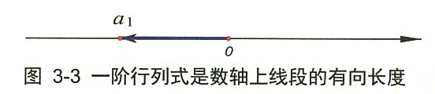

'''

== 二阶行列式

\begin{align*}
	\left| \begin{matrix}
		a&		b\\
		c&		d\\
	\end{matrix} \right|=\underset{\text{主对角线}}{\underbrace{ad}}-\underset{\text{副对角线}}{\underbrace{bc}}
\end{align*}

'''

==== 二阶行列式的几何意义

二阶行列式
latexmath:[\left| \begin{matrix}
	a_x&		b_x\\
	a_y&		b_y\\
\end{matrix} \right|]
的几何意义, 就是以向量a 和 b 为邻边的, 平行四边形的有向面积. 如下图: +

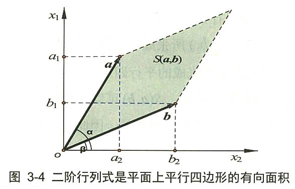

而两个向量的"叉积", 也是这个公式. 或者说, 向量a,b 的叉积是: 垂直于"α 和 b 展成的平面"的单位向量。 +
因此，*二阶行列式的另一个意义, 就是两个行向量或列向量的"叉积"的数值。*

'''

== 三阶行列式

\begin{align*}
	\left| \begin{matrix}
		a&		b&		c\\
		d&		e&		f\\
		h&		i&		j\\
	\end{matrix} \right|=\left( aej+bfh+cdi \right) -\left( ceh+dbj+aif \right)
\end{align*}

即: +
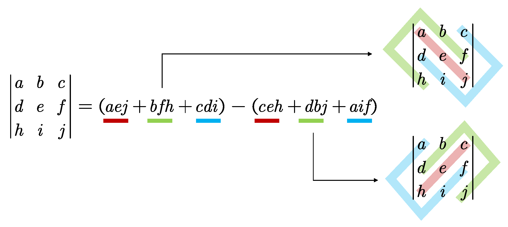

'''

==== 三阶行列式的几何意义

*一个3×3阶的行列式, 是其"行向量"或"列向量"所张成的"平行六面体"的"有向体积"。*

如下图 3-12: +
→ 由两个向量a, b 张成的平行四边形为 0aPb. 即由向量a、b构成的行列式, 就是面积S. 就是向量 a,b 叉积的结果. 即 a×b +
→ 那么沿着第三个向量c方向, 生长出无数个平行于原四边形的新的平行四边形来，直至到向量c的末端为止。显然，所有的这些平行四边形, 构成一个以向量a、b、c为棱的平行六面体，*这些四边形的面积叠加起来, 正是平行六面体的体积。 这个体积, 正是 向量 c 与 a,b 混合积的结果. 即 = stem:[ (a×b)\cdot c]*

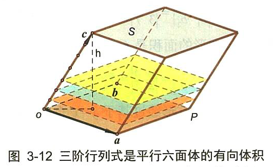

'''

== 行列式的几何意义

=== 行列式的值, 表示的是"新基"的面积 (stem:[  \hat{i} × \hat{j}]), 比原基的面积(stem:[  i × j]) 大多少倍

\begin{align*}
\boxed{
	|D| = \frac{ \hat{i} × \hat{j}}{ i × j}
	= \frac{\text{新基的面积}}{\text{原基的面积}}
}
\end{align*}

.标题
====
比如: +
→ 原基矩阵"的行列式的值:
\begin{align*}
\left| \begin{array}{c|c}
	1&		0\\
	\underset{i}{\underbrace{0}}&		\underset{j}{\underbrace{1}}\\
\end{array} \right|=1*1\ -\ 0*0\ =\underset{=i*j}{\underbrace{1}}\
\end{align*}

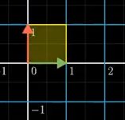

→ "新基矩阵"的行列式的值:
\begin{align*}
	\left| \begin{array}{c|c}
		3&		2\\
		\underset{i}{\underbrace{0}}&		\underset{j}{\underbrace{2}}\\
	\end{array} \right|=3*2\ -\ 2*0\ =\underset{=i*j}{\underbrace{6}}\
\end{align*}

即, 由"新基"中的两个基向量, 组成的平行四边形的面积 = 6.

image:img/0044.png[,45%]
====

所以, 行列式的值, 其几何意义, 本质就是表示: 把原基(stem:[ i \cdot j]) 这个单元面积, 缩放了多少倍.

[options="autowidth"]
|===
|Header 1 |Header 2

|stem:[\| D \|=3]
|就意味着, 新基坐标系下, 它已将"原基"的面积 stem:[ (i×j)], 缩放为了原来的3倍. 即:  stem:[ \hat{i} \cdot \hat{j} = 3(i \cdot j) ].

|\|D\|=0
|新基矩阵A 里面, 存放的是新基的坐标. 只要 stem:[ \|A\| \ne 0], 就说明原坐标系空间, 还没有被压缩降维. 那么它就存在 stem:[  A^{-1}].  +
如果stem:[ \|D\|=0 ] 了, 就意味着, "原基"已被压缩到一条直线上, 甚至一个点上. 被降维了.

当 i 与 j 越来越靠近, 它们围成的平行四边形的面积, 就越来越小. 即坐标系空间, 被压缩得越来越严重. 当 i 与 j 完全重合时, 它们就共线了, \|D\| = 0.

image:img/0045.png[,25%]

|\|D\|=负值
|这意味着, 原坐标系已经被翻转了, 正反面翻转 (invert the orientation of space). 这就被称为"空间定向"发生了改变. 此时, 行列式的值, 就会变成负值.
|===

'''

=== 在三维空间中, 行列式的值, 表示的就是: 体积的缩放倍数.

三维空间中, 原基的行列式的值 stem:[ = i \cdot j \cdot k = 1 \cdot 1 \cdot 1 = 1] +
image:img/0047.png[,20%]

在做了变换后, stem:[ |D| = \hat{i} \cdot \hat{j} \cdot \hat{k} ] 会从原立方体, 变为一个斜不拉几的立方体 (即"平行六面体"). after the  transformation, the cube might get wrapped into some kind of slanty cube. +
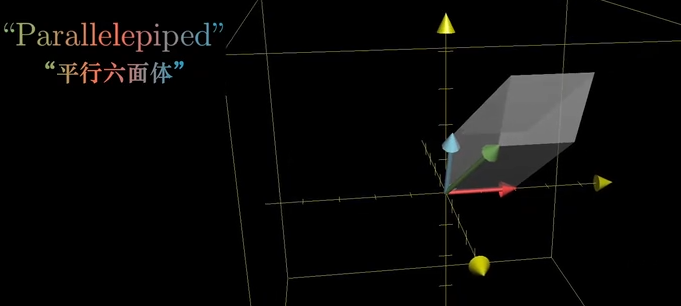

三维空间中 : +
→ stem:[ |D|=0], 就意味着整个空间被压缩成 0体积的东西, 即一个平面, 或一条线, 甚至是一个点. 换言之, 此时的新基 stem:[  \hat{i}, \hat{j}, \hat{k}] 线性相关了. +
→ 若 |D|是负值, 就意味着整个坐标系的"定向"发生了改变. 

你可以用"右手螺旋法则" 来确定坐标系的"定向"是否发生了改变.

'''

== 行列式的转置 transpose

转置, 就是, 行变列, 或列变行.

'''

== 行列式的值

n 阶行列式 -- 按列展开: +
- "列标"取自然排列 1,2,3,...,n.  +
- "行标"取n个数的"全排列"的所有排序可能. +
- 从不同行, 不同列, 取n个元素来相乘, 就得到每一项. +
- 每一项前的正负号, 由"行标排列"的"奇偶性"来决定.

行列式"按列展开"的公式即:  +
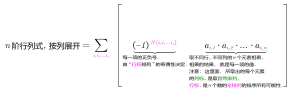

'''

=== 余子式 minor : stem:[M_{ij}]

你选定某个元素x, 把它所在的行去掉, 所在的列去掉, 将剩下的元素按原位置排好, 这个新的行列式, 就是x的"余子式".

比如: +
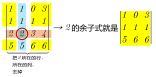

某个元素的余子式, 用 stem:[ M_{ij}]表示. 如, 上例中的2, 在 i=第3行, j=第2列, 所以它的"余子式"就是: 
\begin{align*}
		M_{32}=\left| \begin{matrix}
			1&		0&		3\\
			1&		1&		1\\
			5&		6&		6\\
		\end{matrix} \right|
\end{align*}

'''

=== 代数余子式 Algebraic cofactor : stem:[ A_{ij}=\left( -1 \right) ^{i+j}M_{ij}]

在余子式的前面, 加一个负号, 即 stem:[ \left( -1 \right) ^{i+j}], 就是"代数余子式".  +
某个元素x的"代数余子式", 用符号 stem:[ A_{ij}] 来表示. i是x的行号, j是x的列号. +
	 
比如上例的"余子式"是:
\begin{align*}
	M_{32}=\left| \begin{matrix}
		1&		0&		3\\
		1&		1&		1\\
		5&		6&		6\\
	\end{matrix} \right|
\end{align*}

那么其"代数余子式"就是:
\begin{align*}
	A_{32}=\left( -1 \right) ^{3+2}\left| \begin{matrix}
		1&		0&		3\\
		1&		1&		1\\
		5&		6&		6\\
	\end{matrix} \right|
\end{align*}

'''

=== 按某一行（列）展开的展开公式: stem:[  |A|=\sum_{i=1}^n{a_{ij}A_{ij}\ \left( j=1,2,...,n \right)}=\sum_{j=1}^n{a_{ij}A_{ij}\ \left( i=1,2,...,n \right)}]

有定理: *行列式的值等于: 随便选一行, 把这行上所有的元素, 各自乘以它们的"代数余子式", 再求和, 所得到的结果, 就是这个行列式的值了.*
\begin{align*}
	\boxed{
		D=\underset{\text{某一行的元素}}{\underbrace{a_{i1}}}\cdot \underset{\text{该元素的}“\text{代数余子式}”}{\underbrace{A_{i1}}}+a_{i2}\cdot A_{i2}+...+a_{in}\cdot A_{in}		
	}
\end{align*}

用列来做, 也是一样.
\begin{align*}
	D=\underset{\text{某一列的元素}}{\underbrace{a_{1j}}}\cdot \underset{\text{该元素的}“\text{代数余子式}”}{\underbrace{A_{1j}}}+a_{2j}\cdot A_{2j}+...+a_{nj}\cdot A_{nj}
\end{align*}

.标题
====
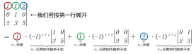
====

从上例, 你就能发现, "行列式"按行或列展开后, 它的每一个元素的代数余子式, 都"降阶"了. 即 原行列式是3阶的, 现在展开后, 你只要计算 2阶的行列式(即代数余子式)了. 大大减轻了我们的计算负担. 

其实, 上面的这个例子, 我们按第二行展开更方便, 因为它有0元素存在啊, 0元素和其代数余子式相乘, 就是0. 根本就不需要我们去计算了. 所以, *我们要选0元素最多的那一行, 来展开* :
	\begin{align*}
	& \left| \begin{matrix}
		1&		1&		2\\
		0&		1&		0\\
		2&		3&		5\\
	\end{matrix} \right|\ ←\text{要选0元素最多的那一行来展开,本例即第二行}\\
	& =0+\underset{a_{22}\text{元素}}{1}\cdot \underset{a_{22}\text{元素的代数余子式}}{\underbrace{\left( -1 \right) ^{2+2}\left| \begin{matrix}
				1&		2\\
				2&		5\\
			\end{matrix} \right|}}+0
\end{align*}

'''

=== ★ 行列式值的计算, 方法是: 把行列式, 先化成"上三角行列式"

方法论: 一般, 我们要把行列式, 化成"上三角行列式". 则该行列式的值, 就是"主对角线"上元素的乘积了.

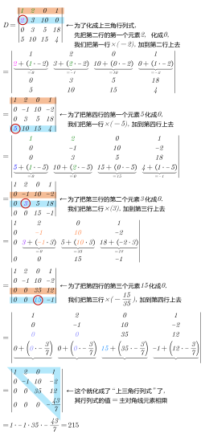

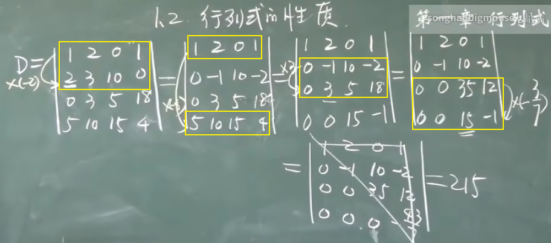

总结: +
1.先处理第1列, 再处理第2列, 再处理第3列. +
2.第1列处理完后, 第1行就不再参与运算.

如果某一行的首元素是1, 就把该行移到第一行上去. 比如:
\begin{align*}
	\left| \begin{matrix}
		8&		&		\\
		1&		...&		\\
		3&		&		\\
	\end{matrix} \right|
\end{align*}

.标题
====
第二行的首元素是1, 就把这第二行, 移到第1行上去. 变成:
\begin{align*}
	\left| \begin{matrix}
		1&		...&		\\
		8&		&		\\
		3&		&		\\
	\end{matrix} \right|
\end{align*}

这样, 能更方便的用第一行元素乘以某个数, 来消去下面行上的数字, 以变成0. 化成"上三角行列式". +
注意: 在交换两行时, 行列式的值要变号.
====

'''

=== 拉普拉斯定理

==== k阶子式

就是从一个n阶行列式中, 随便取k行, 取k列, 组成的新的行列式, 就是k阶子式.

.标题
====
比如: +
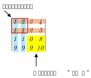

我们取出它一个2阶子式 (即2*2区域的子集). 比如, 就取第1,2行,和第1,2列 交叉点, 所组成的子式, 即:
\begin{align*}
\left| \begin{matrix}
	1&		2\\
	1&		1\\
\end{matrix} \right|
\end{align*}
	这个就是一个"二阶子式".

那么这个二阶子式的"余子式", 就是:
\begin{align*}
\left| \begin{matrix}
	0&		8\\
	9&		10\\
\end{matrix} \right|
\end{align*}

这个二阶子式的"代数余子式", 就是:
\begin{align*}
\left( -1 \right) ^{\overset{\text{行1,行}2}{\overbrace{\left( 1+2 \right) }}\overset{\text{列1,列}2}{\overbrace{\left( 1+2 \right) }}}\left| \begin{matrix}
	0&		8\\
	9&		10\\
\end{matrix} \right|
\end{align*}

注意: 上面 -1 的指数, 两个括号的意思是:
\begin{align*}
	\left| \begin{matrix}
		0&		8\\
		9&		10\\
	\end{matrix} \right|
\end{align*}
====

'''

==== 拉普拉斯展开定理

拉普拉斯展开定理 Laplace expansion : *在n阶行列式中, 任意取定k行(而不仅仅是只取一行展开), 由k行元素组成的所有"k阶子式"与"代数余子式"的乘积之和, 就等于该行列式的值.*

.标题
====
如: 下面这个5阶行列式
\begin{align*}
		\left| \begin{matrix}
			1&		2&		0&		0&		0\\
			\hline
			3&		4&		0&		0&		0\\
			\hline
			1&		2&		3&		4&		5\\
			1&		1&		1&		1&		1\\
			6&		6&		8&		3&		1\\
		\end{matrix} \right|
\end{align*}

我们任取k=2行, 比如就取 第1, 2 行. 它的k阶子式, 就是二阶子式. 那么因为这个行列式有5列, 在其中取2列, 就有 stem:[ C_{5}^{2}=10] 种取法. 即有10个二阶子式存在. +
即, 这个5阶行列式的值 D=  (第1个二阶子式的行列式值×其代数余子式) + (第2个二阶子式的行列式值×其代数余子式) + ... + (第10个二阶子式的行列式值×其代数余子式)

如果我们取到的是"列上都是0元素"的那些列的话, 那么这个二阶子式的行列式的值就是0了. 其"二阶子式"与"代数余子式"的乘积之和, 当然也是0了. +
所以, 在全部10个二阶子式中,  唯一行列式值不为零的二阶子式, 就是取第1和第2列. 它的"二阶子式"值×其"代数余子式" =
\begin{align*}
	\underset{\text{二阶子式}}{\underbrace{\left| \begin{matrix}
				1&		2\\
				3&		4\\
			\end{matrix} \right|}}\cdot \underset{\text{代数余子式}}{\underbrace{\left( -1 \right) ^{\left( 1+2 \right) +\left( 1+2 \right)}\left| \begin{matrix}
				3&		4&		5\\
				1&		1&		1\\
				8&		3&		1\\
			\end{matrix} \right|}}
\end{align*}

即, 本例的这个5阶行列式的值 =
\begin{align*}
	\underset{\text{二阶子式}}{\underbrace{\left| \begin{matrix}
				1&		2\\
				3&		4\\
			\end{matrix} \right|}}\cdot \underset{\text{代数余子式}}{\underbrace{\left( -1 \right) ^{\left( 1+2 \right) +\left( 1+2 \right)}\left| \begin{matrix}
				3&		4&		5\\
				1&		1&		1\\
				8&		3&		1\\
			\end{matrix} \right|}} + 0 + 0 + ...
\end{align*}
====

'''

=== 其他形状的行列式

==== 只有一个元素的行列式, 就等于该元素本身 → stem:[| a_{11} |=a_{11} ]
|8|=8 +
|-1|=-1

'''

==== 下三角行列式 =主对角线上元素的乘积

\begin{align*}
\underset{\text{下三角行列式}}{\underbrace{\left| \begin{matrix}
			a_{11}&		&		&	0	\\
			a_{21}&		a_{22}&		&		\\
			...&		&		...&		\\
			a_{n1}&		...&		...&		a_{nn}\\
		\end{matrix} \right|}}=\underset{\text{即主对角线元素相乘}}{\underbrace{a_{11}\cdot a_{22}\cdot ...\cdot a_{nn}}}
\end{align*}

'''

==== 上三角行列式 =主对角线上元素的乘积

\begin{align*}
\underset{\text{上三角行列式}}{\underbrace{\left| \begin{matrix}
			a_{11}&		...&		&		a_{1n}\\
			&		a_{22}&		&		a_{2n}\\
			&		&		...&		...\\
			0&		&		&		a_{nn}\\
		\end{matrix} \right|}}=\underset{\text{即主对角线元素相乘}}{\underbrace{a_{11}\cdot a_{22}\cdot ...\cdot a_{nn}}}
\end{align*}

'''

==== 对角形行列式 =主对角线上元素的乘积

\begin{align*}
\underset{\text{对角形行列式}}{\underbrace{\left| \begin{matrix}
			a_{11}&		&		&		0\\
			&		a_{22}&		&		\\
			&		&		...&		\\
			0&		&		&		a_{nn}\\
		\end{matrix} \right|}}=\underset{\text{即主对角线元素相乘}}{\underbrace{a_{11}\cdot a_{22}\cdot ...\cdot a_{nn}}}
\end{align*}

'''

==== 伪下三角行列式  stem:[ =\left( -1 \right) ^{\frac{n\left( n-1 \right)}{2}}a_{1,n}\cdot a_{2,n-1}\cdot a_{n,1}]
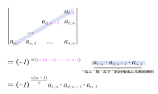

'''

==== 伪上三角行列式 stem:[ 	=\left( -1 \right) ^{\frac{n\left( n-1 \right)}{2}}a_{1,n}\cdot a_{2,n-1}\cdot a_{n,1}]
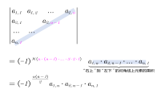

'''

== 行列式相乘

=== 两个"同阶"行列式 相乘
两个同阶行列式, 相乘, 方法是: 前行×后列

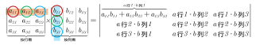

'''

=== 两个"不同阶"行列式 相乘

那就只能先算出各自行列式的值, 再来相乘了.

'''

