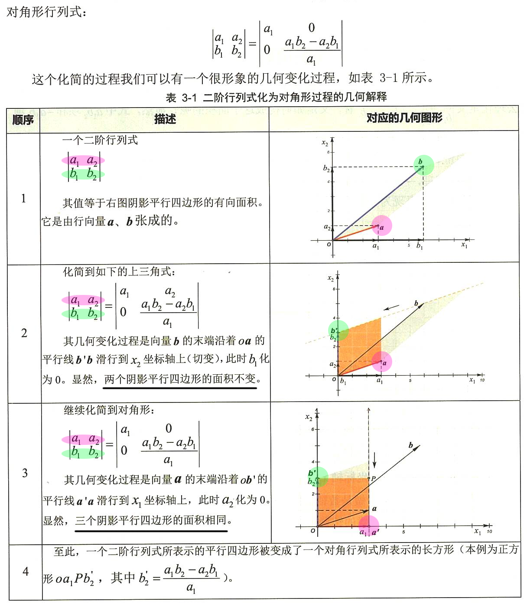
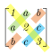
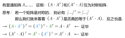
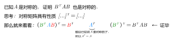

= 特殊矩阵
//:stylesheet: my-stylesheet.css
:toc: left
:toclevels: 3
:sectnums:

'''

== 特殊矩阵 (都是方阵)

=== 数量矩阵 → stem:[ (aE)B = B(aE) = aB]

数量矩阵(或叫"纯量阵") scalar matrix : 就是"主对角线上"元素都是同一个数值，其余元素都是零.

即:
\begin{align*}
\left[ \begin{matrix}
	a&		&		&		\\
	&		a&		&		\\
	&		&		\ddots&		\\
	&		&		&		a\\
\end{matrix} \right]
= aE
\end{align*}

所以, 零矩阵, 和单位阵E, 都是特殊的"数量矩阵".

有性质:
(aE)B = B(aE) = aB

'''

=== 对角型矩阵

对角矩阵 diagonal matrix : 主对角线元素无要求(可以不相等), 但之外的所有元素都为0.

\begin{align}
	A\ =\left[ \begin{matrix}
		\lambda _1&		&		&		\\
		&		\lambda _2&		&		\\
		&		&		\ddots&		\\
		&		&		&		\lambda _n\\
	\end{matrix} \right]
\end{align}

可记为: stem:[ A = diag(\lambda_1, \lambda2, ..., \lambda_n) ] +
所以, "数量矩阵"(主对角线上的元素都相等), 只不过是一种特殊的"对角矩阵"罢了.

.行列式化为"对角形"的几何解释: +

同样, 将三阶行列式, 化为对角形, 这个过程会把一个平行六面体, 变化为一个相同体积的立方体或长方体.

'''

==== diag × B : 对角阵元素在哪一行上, 就乘到B的相同行上去

\begin{align}
	\left[ \begin{matrix}
		k_1&		&		\\
		\hline
		&		k_2&		\\
		\hline
		&		&		k_3\\
	\end{matrix} \right] \left[ \begin{matrix}
		1&		2&		3\\
		\hline
		2&		2&		2\\
		\hline
		8&		8&		8\\
	\end{matrix} \right] =\left[ \begin{matrix}
		1k_1&		2k_1&		3k_1\\
		\hline
		2k_2&		2k_2&		2k_2\\
		\hline
		8k_3&		8k_3&		8k_3\\
	\end{matrix} \right]
\end{align}

即: diag 在前, 就乘到后者的"行"上去. (前行,后列) +
即: *左乘, 对应后面的行.*

'''

==== B × diag : 对角阵元素在哪一列上, 就乘到B的相同列上去

\begin{align}
	\left[ \begin{array}{c|c|c}
		1&		2&		3\\
		2&		2&		2\\
		8&		8&		8\\
	\end{array} \right] \left[ \begin{array}{c|c|c}
		k_1&		&		\\
		&		k_2&		\\
		&		&		k_3\\
	\end{array} \right] =\left[ \begin{array}{c|c|c}
		1k_1&		2k_2&		3k_3\\
		2k_1&		2k_2&		2k_3\\
		8k_1&		8k_2&		8k_3\\
	\end{array} \right]
\end{align}

即: diag 在后, 就乘到前者的"列"上去. (前行,后列) +
即: *右乘, 对应后面的列.*

'''

=== 上三角形矩阵 upper triangular matrix

\begin{align*}
\left[ \begin{matrix}
	a_{11}&		a_{12}&		a_{13}&		a_{14}\\
	&		a_{22}&		a_{23}&		a_{24}\\
	&		&		\ddots&		a_{34}\\
	&		&		&		a_{44}\\
\end{matrix} \right]
\end{align*}

性质:

- 上三角矩阵, 乘以系数后, 也是上三角矩阵
- 上三角矩阵间的"加减法"和"乘法"运算的结果, 仍是上三角矩阵
- 上三角矩阵的"逆矩阵", 也仍然是上三角矩阵
- 上三角矩阵的行列式, 为"主对角线"元素相乘

'''

=== 下三角形矩阵

\begin{align*}
\left[ \begin{matrix}
	a_{11}&		&		&		\\
	a_{21}&		a_{22}&		&		\\
	a_{31}&		a_{32}&		\ddots&		\\
	a_{41}&		a_{42}&		a_{43}&		a_{44}\\
\end{matrix} \right]
\end{align*}

'''

=== #对称矩阵#: 有 stem:[ A^T = A] ← 即对自己做转置, 依然等于自己.

对称矩阵 Symmetric Matrices : 是以主对角线为对称轴, 上下元素对应相等. 即: stem:[ a_{ij}= a_{ji}] +

如: +

对称矩阵, 有性质: stem:[ A^T = A]

.标题
====
注意: 下面例题中的字打错了, 不是"互为", 而是"都是".  +

====

.标题
====

====

A,B 是同阶的"对称矩阵", 则有性质:

'''

==== 对称矩阵, 性质: stem:[  \left( A+B \right) ^T=A^T+B^T=A+B]

\begin{align*}
\left( A+B \right) ^T =\underset{A^T=A} {\underbrace{A^T}} + \underset {B^T=B} {\underbrace{B^T}} =A+B
\end{align*}

'''

==== 对称矩阵, 性质: stem:[ \left( A-B \right) ^T=A^T-B^T=A-B]

'''

==== 对称矩阵, 性质: stem:[\left( kA \right) ^T=k\cdot A^T=kA ]

\begin{align*}
\left( kA \right) ^T= k\cdot \underset {A^T=A} {\underbrace{A^T}} =kA
\end{align*}

'''

==== 对称矩阵, 性质: stem:[\left( AB \right) ^T=B^TA^T=BA\ne AB ]

\begin{align*}
\left( AB \right) ^T =\underset{B^T=B.} {\underbrace{B^T}} \underset{A^T=A} {\underbrace{A^T}} =BA\ne AB
\end{align*}

'''

==== 定理: 两个对称矩阵A,B 相乘后, 新矩阵AB 一般就不再是对称的了. 除非A,B 是可交换矩阵, 型矩阵AB 才是对称的.

即: 对称矩阵A, B, 只有在它们是"可交换矩阵"的前提下, 它们的乘积A×B, 才也是"对称矩阵".

'''

=== 反对称矩阵 : 有 stem:[ A^T = - A]

反对称矩阵 Skew-symmetric matrix : 主对角线上的元素全为零，主对角线两侧对称的元素, 反号(即互为相反数). 即 stem:[a_{ij}= -a_{ij}]

如: +
image:/img/0023.svg[,13%]

为什么它主对角线上的元素都是0呢? 因为根据"反对称矩阵"的性质: stem:[a_{ii}= -a_{ii}], 则就 stem:[2a_{ii}=0], 所以就有 stem:[a_{ii}=0] 了.

反对称矩阵, 有性质: stem:[A^T = - A]

'''
