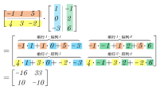
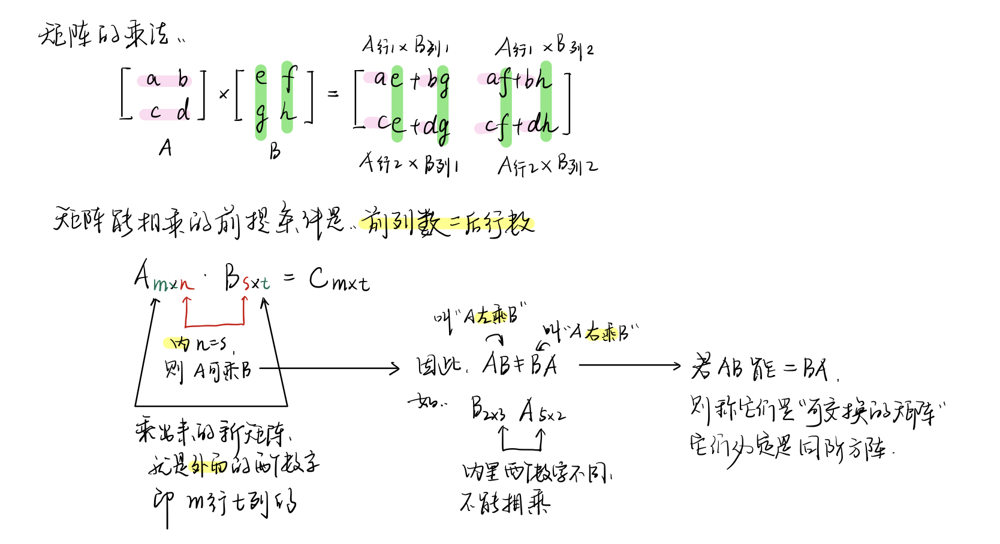
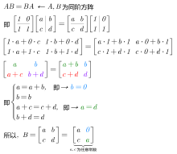
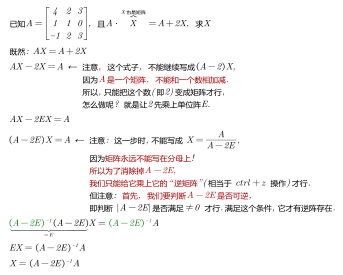
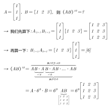

= 矩阵的运算
//:stylesheet: my-stylesheet.css
:toc: left
:toclevels: 3
:sectnums:

'''

矩阵的运算

== 矩阵的加法, 减法

矩阵的加法, 只要把两个矩阵, 对应位置的元素直接相加就行了. 即:
\begin{align*}
	\left[ \begin{matrix}
		a&		b&		c\\
		d&		e&		f\\
	\end{matrix} \right] +\left[ \begin{matrix}
		g&		h&		i\\
		j&		k&		l\\
	\end{matrix} \right] =\left[ \begin{matrix}
		a+g&		b+h&		c+i\\
		d+j&		e+k&		f+l\\
	\end{matrix} \right]
\end{align*}

*注意: 只有"同型矩阵"才能做相加减.*

减法也是这个规律: 对应元素相减即可.
\begin{align*}
\left[ \begin{matrix}
	a&		b&		c\\
	d&		e&		f\\
\end{matrix} \right] -\left[ \begin{matrix}
	g&		h&		i\\
	j&		k&		l\\
\end{matrix} \right] =\left[ \begin{matrix}
	a-g&		b-h&		c-i\\
	d-j&		e-k&		f-l\\
\end{matrix} \right]
\end{align*}

==== 加法的性质

[options="autowidth"]
|===
|Header 1 |Header 2

| A+B = B+A
|

|(A+B) + C = A + (B+C)
|

|A + 0 = A
|← 注意, 零矩阵与A, 应该是"同型"的才能相加. (同时, 两个零矩阵, 也未必是同型的. 如 stem:[ 0_{3 \times 5} \ne 0_{4 \times 7}]

| A + (-A) = 0
|

|\begin{align*}
A + B = C \Longleftrightarrow  A = C - B
\end{align*}
|
|===

'''

== 矩阵的 数乘

\begin{align*}
	k\left[ \begin{matrix}
		1&		2&		3\\
		4&		5&		6\\
		7&		8&		9\\
	\end{matrix} \right] =\left[ \begin{matrix}
		1k&		2k&		3k\\
		4k&		5k&		6k\\
		7k&		8k&		9k\\
	\end{matrix} \right]
\end{align*}

就是把数字k, 乘给矩阵中每一个元素身上.

反过来说, 就是: 若矩阵中的所有元素, 都有同一个公因子, 则该公因子提到矩阵外, 只需提"一次". +
注意: 行列式中的公因子, 是"每行提一次"的.

'''

==== 数乘的性质

[options="autowidth"]
|===
|Header 1 |Header 2

| k(A+B) = kA + kB
|

| (k+l)A = kA + lA
|

|stem:[ k(lA) = (k \cdot l)A]
| ← 两个数K和L, 可以先结合, 再去乘以矩阵A
|===

'''

== 矩阵的 乘法

\begin{align*}
	\left[ \begin{matrix}
		a&		b\\
		\hline
		c&		d\\
	\end{matrix} \right]
\cdot
\left[ \begin{array}{c|cc}
		e&		f\\
		g&		h\\
	\end{array} \right] =\left[ \begin{matrix}
		ae+bg&		A\text{行}1*B\text{列}2\\
		A\text{行}2*B\text{列}1&		A\text{行}2*B\text{列}2\\
	\end{matrix} \right]
\end{align*}

.标题
====

====

.标题
====
\begin{align*}
\left\{ \begin{array}{l}
	x_1=y_1-y_2\\
	x_2=y_1+y_2\\
\end{array} \right. \ \ \text{可以写成: }\left[ \begin{array}{c}
	x_1\\
	x_2\\
\end{array} \right] =\underset{\text{这两块,就是两个矩阵相乘}}{\underbrace{\left[ \begin{matrix}
			1&		-1\\
			\hline
			1&		1\\
		\end{matrix} \right] \left[ \begin{array}{c}
			y_1\\
			y_2\\
		\end{array} \right] }}
\end{align*}
====

注意:  *两个矩阵能相乘的前提是: 前面矩阵的列数 = 后面矩阵的行数.* +

所以:

- 两个矩阵相乘的顺序不同的话, 结果就不同. 即: stem:[ AB \neq BA ] +
- AB这个顺序能相乘, 不一定BA这个顺序也能相乘. 比如, stem:[ A_{5×2}B_{2×3}] 是可以相乘的(它们内侧两个数字相同, 都是2), 能得到一个 5行3列的矩阵. 而顺序倒过来 stem:[ B_{2×3}A_{5×2}] 就不能相乘了, 因为它们的内侧两个数字(前为3, 后为5)不相同.

所以, 我们要区分一下相乘的顺序: +
→  AB : 叫"A左乘B", 或"B右乘A"  +

单位阵E, 就相当于1的作用. 所以 AE = EA = A. 但是注意, 这里前后的两个单位阵E, 不是同一个E!  比如: stem:[ A_{2×3}E_{3×3}=E_{2×2}A_{2×3}] +
前面的E, 只能是3阶方阵. 后面的E, 只能是2阶方阵. 所以这两个E不是同一个单位阵.

'''

==== 结合律: (AB)C = A(BC)

ABC的顺序, 在等号两边, 不变.

'''

==== 分配律: ① (A+B)C = AC+BC, ② C(A+B) = CA+CB

C在右边时, 分配进去, C还是在右边. +
C在左边时, 分配进去, C还是在左边.

'''

====  k(AB) = (kA)B = A(kB)

即 k乘以AB, 可以先和A结合来算, 也可以先和B结合来算. +
并且无论k在哪, AB的左右顺序, 永远是AB.

'''

==== 矩阵乘法的例题

.标题
====
求出 与
\begin{align*}
A=\left[ \begin{matrix}
	1&		0\\
	1&		1\\
\end{matrix} \right]
\end{align*}
可交换的所有矩阵.

那我们就设其可交换的矩阵
\begin{align*}
B=\left[ \begin{matrix}
	a&		b\\
	c&		d\\
\end{matrix} \right]
\end{align*}

B要能与A可交换, 它就必须满足: stem:[ A_n B_n = B_n A_n ], 即A和B是同阶的方阵.

====

.标题
====

====

'''

== 矩阵, 幂的运算

==== stem:[ A^k=A\cdot A\cdot ...A\ ←\text{等号右边共}k\text{个}A]

\begin{align*}
	A^k=\underset{k\text{个}A}{\underbrace{A\cdot A\cdot ...A}}
\end{align*}

==== stem:[ A^0 = E]

==== stem:[ A^{k_1}A^{k_1}=A^{k_1+k_2}]

==== stem:[ \left( A^{k_1} \right) ^{k_2}=A^{k_1k_2}]

==== 一般, stem:[\left( AB \right) ^k\ne A^k B^k ]

比如,  stem:[ ( AB \right) ^2\ne A^2 B^2] +
因为: 等号左边 stem:[ \left( AB \right) ^2=\ ABAB], 等号右边 stem:[ A^2 B^2= A A B B], 而一般 stem:[ ABAB \ne A A B B]. 因为虽然它们最左边都是A, 最右边都是B, 但是中间的两个矩阵相乘, BA一般就不等于AB了. 除非它们是可交换矩阵.

其他的: +
stem:[  A+B \right) ^2\ne A^2+2AB+B^2]  ← 这个, 一般也不相等 +
stem:[ ( A-B \right) ^2\ne A^2-2AB+B^2]  ← 这个, 一般也不相等

.标题
====
问 stem:[ \left( A+E \right) ^2] 是否等于 stem:[ A^2+2AE+E^2] ?

\begin{align*}
		& \left( A+E \right) ^2=\left( A+E \right) \left( A+E \right)\\
	& =A\left( A+E \right) +E\left( A+E \right)\\
	& =A^2+\underset{=A}{\underbrace{AE}}+\underset{=A}{\underbrace{EA}}+\underset{=E}{\underbrace{E^2}}\\
	& =A^2+\underset{=2AE}{\underbrace{2A}}+E
\end{align*}

所以这个是对的. 相等.

同样, stem:[ \left( A-E \right) ^2 = A^2-2AE+E^2]
====

'''

==== 矩阵的幂运算 例题

.标题
====

====

'''
