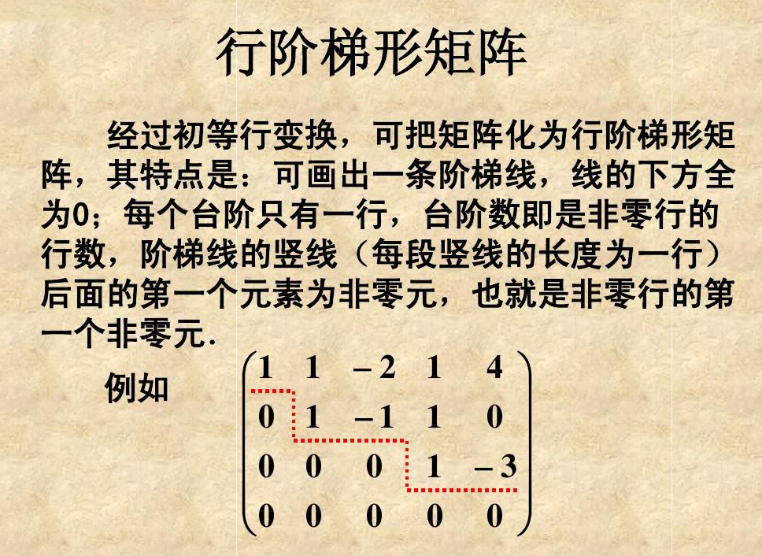
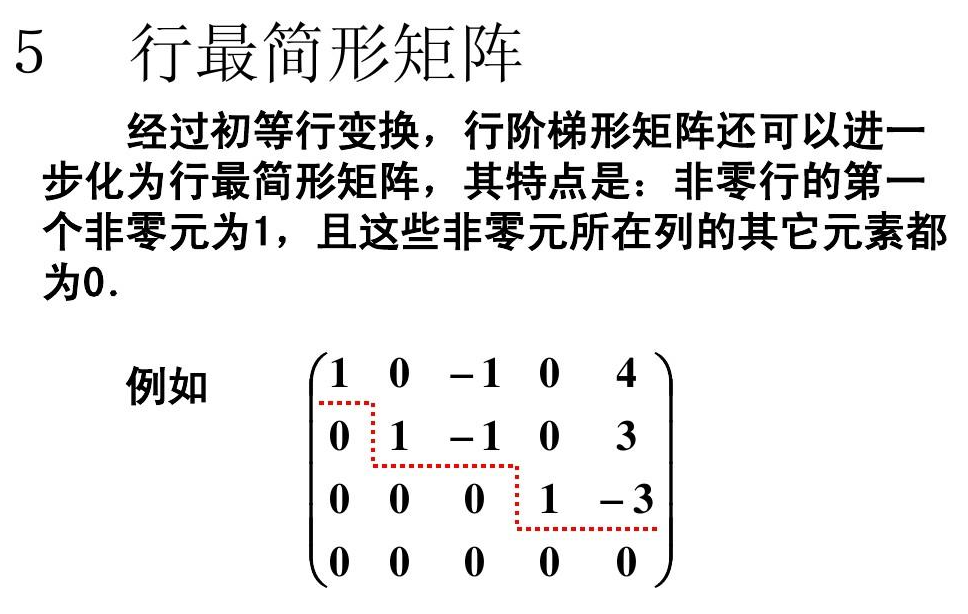
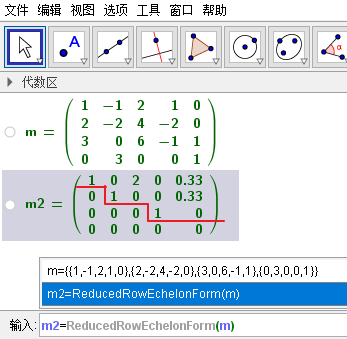

= 初等变换
//:stylesheet: my-stylesheet.css
:toc: left
:toclevels: 3
:sectnums:
'''

== 初等变换, 有三种

矩阵的初等变换 Elementary transformation, 有三种:

1.交换两行.

比如
\begin{align*}
\left[ \begin{matrix}
	1&		1&		1\\
	2&		2&		2\\
	4&		4&		4\\
\end{matrix} \right] \underrightarrow{\text{交换第1,2行}}\left[ \begin{matrix}
	2&		2&		2\\
	1&		1&		1\\
	4&		4&		4\\
\end{matrix} \right]
\end{align*}

2.用k(stem:[k \ne 0 ]) 乘以某一行.
\begin{align*}
\left[ \begin{matrix}
	1&		1&		1\\
	2&		2&		2\\
	4&		4&		4\\
\end{matrix} \right] \underrightarrow{line1 ×6}\left[ \begin{matrix}
	6&		6&		6\\
	2&		2&		2\\
	4&		4&		4\\
\end{matrix} \right]
\end{align*}

3.把某一行的k倍(k可为0), 加到另一行上去.
\begin{align*}
\left[ \begin{matrix}
	1&		&		\\
	2&		\cdots&		\\
	4&		&		\\
\end{matrix} \right] \underrightarrow{newLine3=-4(line1)+(line3)}\left[ \begin{matrix}
	1&		&		\\
	2&		\cdots&		\\
	0&		&		\\
\end{matrix} \right]
\end{align*}

注意: 矩阵的"初等变换", 与行列式的初等变换, 没有任何关系. 虽然它们的三条变换规则相同.

任何矩阵, 都可以通过"初等变换", 变成"标准形"
\begin{align*}
\left[ \begin{matrix}
	1&		&		&		&		&		\\
	&		\ddots&		&		&		&		\\
	&		&		1&		&		&		\\
	&		&		&		0&		&		\\
	&		&		&		&		\ddots&		\\
	&		&		&		&		&		0\\
\end{matrix} \right]
\end{align*}

.标题
====
例如： +
image:/img/0035.svg[,45%]
====

'''

== 等价

等价: A经过初等变换得到B, 则A与B等价. 记为 stem:[A\cong B].

等价的性质有:

1. 反身性: stem:[A\cong A]  ← 自己等价于自己.
2. 对称性: stem:[A\cong B], 则 stem:[B\cong A]. ← 就是说: A经过"初等变换"得到B, B也能再经过"初等变换"得回A.
3. 传递性: 若stem:[A\cong B], stem:[B\cong C], 则 stem:[A\cong C]. ← 就相当于: A→C 的一步, 分成了两步来做. B只是中间状态而已.
4. 任意矩阵A stem:[\cong ] 标准形
\begin{align*}
\left[ \begin{matrix}
	1&		&		&		&		&		\\
	&		\ddots&		&		&		&		\\
	&		&		1&		&		&		\\
	&		&		&		0&		&		\\
	&		&		&		&		\ddots&		\\
	&		&		&		&		&		0\\
\end{matrix} \right] 
\end{align*}

image:/img/0034.svg[,65%]

'''

== 初等方阵

初等方阵 Elementary matrix: 对单位阵E 做一次"初等变换"得到的矩阵, 就是"初等方阵".

既然是做"初等变换", 就是3种了:

.(1)交换两行:
\begin{align*}
	\left[ \begin{matrix}
		1&		&		&		\\
		\hline
		&		1&		&		\\
		&		&		1&		\\
		\hline
		&		&		&		1\\
	\end{matrix} \right] \overset{\text{交换1,3行}}{\rightarrow}\left[ \begin{matrix}
		&		&		1&		\\
		\hline
		&		1&		&		\\
		1&		&		&		\\
		\hline
		&		&		&		1\\
	\end{matrix} \right]
\end{align*}

记为: stem:[ E(i,j)] , 即交换"第i行"和"第j行"后, 所得到的矩阵.

.(2)用k 乘上某一行/列
\begin{align*}
	\left[ \begin{matrix}
		1&		&		&		\\
		&		1&		&		\\
		&		&		1&		\\
		&		&		&		1\\
	\end{matrix} \right] \overset{newLine3\ =\ 5* line3}{\rightarrow}\left[ \begin{matrix}
		1&		&		&		\\
		&		1&		&		\\
		&		&		5&		\\
		&		&		&		1\\
	\end{matrix} \right]
\end{align*}

记为: stem:[E(i(k))] , 即把第i行, 变为k倍. stem:[k \ne 0].

.(3) 某行的k倍, 加到另一行上去
\begin{align*}
	\left[ \begin{matrix}
		1&		&		&		\\
		&		1&		&		\\
		&		&		1&		\\
		&		&		&		1\\
	\end{matrix} \right] \overset{newLine1\ =\ (5* line3)+line1}{\rightarrow}\left[ \begin{matrix}
		1&		&		5&		\\
		&		1&		&		\\
		&		&		1&		\\
		&		&		&		1\\
	\end{matrix} \right]
\end{align*}

记为:  stem:[ E(i, j(k))] , 即把 "j行的k倍", 加到"第i行"上去.

可以看出: 三种不同的变换方式, 所得到的"初等方阵", 其"行列式值", 是不同的.

.→ 第(1)种:
\begin{align*}
\left[ \begin{matrix}
	&		&		1&		\\
	&		1&		&		\\
	1&		&		&		\\
	&		&		&		1\\
\end{matrix} \right] =-1
\end{align*}

- 即: stem:[|E(i,j)| = -1].
- 其逆阵是: stem:[E^{-1}(i,j) = E(i,j)]

.→ 第(2)种:
\begin{align*}
\left[ \begin{matrix}
	1&		&		&		\\
	&		1&		&		\\
	&		&		5&		\\
	&		&		&		1\\
\end{matrix} \right] =5
\end{align*}

- 即: stem:[|E(i(k))| = k, (k \ne 0)]
- 其逆阵是: stem:[E^{-1}(i(k)) = E(i(\frac{1}{k}))]

.→ 第(3)种:
\begin{align*}
\left[ \begin{matrix}
	1&		&		5&		\\
	&		1&		&		\\
	&		&		1&		\\
	&		&		&		1\\
\end{matrix} \right] =1
\end{align*}

-  即: stem:[|E(i, j(k))| = 1]
- 其逆阵是: stem:[E^{-1}(i, j(k)) = E(i,j(-k))]

上面三种初等变换得到的矩阵, 做出来的行列式值, 都不等于0. 说明:

1. 它们(即初等方阵)都可逆.
2. 它们的逆矩阵, 也是"初等方阵."
3. 并且, 初等方阵的转置, 也是"初等方阵."

注意区别:
[options="autowidth"]
|===
|Header 1 |Header 2

|初等变换(v.)
|是动词, 是对矩阵做"变换"的一种过程.

|初等方阵(n.)
|是名词. 它就是一个方阵.
|===

.标题
====
image:/img/0036.svg[,85%]

这两个单位阵E, 做了一次"初等变换"后, 就已经是"初等方阵"了. 那么用"初等方阵"左乘"一个普通矩阵, 和"右乘"一个普通矩阵, 顺序不同, 运算规则也是不一样的:

[options="autowidth"]
|===
|Header 1 |Header 2

|1.用初等方阵"左乘" A矩阵 (即初等方阵在A左边)
|E在左边, 即:  *用第i种初等方阵 "左乘"A, 效果就相当于对 A 实施了同种的  (即也是第i种的)"初等行变换".* (左行,右列) +
比如本例, 对E做了 "对第2行, 乘上3倍" 的操作, 就相当于对A做了 "对第2行, 乘上3倍" 的操作.

|2.用初等方阵"右乘" A矩阵 (即初等方阵在A右边)
|E在右边, 即: *用第i种初等方阵 "右乘"A, 效果就相当于对 A 实施了同种的 (即也是第i种的)"初等列变换".* (左行,右列)
|===

这就好像是古代的扎小人巫术, 对初等方阵E(人偶)做扎针, 就相当于对A(真人对象)做同等扎针.
====

数学研究中, 喜欢等号. 而初等方阵, 恰恰能提供等号.

'''

== 定理

==== 对于任意一个矩阵A, 都存在"初等矩阵" stem:[P_1, P_2, ..., P_s, Q_1, Q_2, ..., Q_t], 能使得 stem:[	P_s\cdot ...\cdot P_1AQ_1\cdot ...Q_t	] 为 "标准形".

因为任意矩阵A, 可以通过"初等变换"(行变换或列变换), 化为标准形. 

image:/img/0037.svg[,55%]

'''

==== 若A,B等价, 其充要条件是:  存在可逆矩阵P,Q, 使得 PAQ=B

"A,B等价"的意思是: A通过"初等变换"(用初等行变换, 或初等列变换), 可以得到B. 

所以, 在变换过程中, 如果用了"初等行变换", 就等价于是让A"左乘"初等方阵P(初等方阵有这个性质: 初等方阵均可逆). 如果用了"初等列变换", 就等价于让A"右乘"初等方阵Q. 即就有: stem:[	P_s\cdot ...\cdot P_1AQ_1\cdot ...Q_t = B]

'''

==== "A可逆"的充分必要条件是: "A的标准形"为单位阵E

.标题
====
这个定理的证明过程如下:

若A可逆, 且标准形为D, 则存在初等方阵P,Q, 能使得:
\begin{align*}
\underset{\text{初等方阵}}{\underbrace{P_s\cdot ...\cdot P_1}}A\underset{\text{初等方阵}}{\underbrace{Q_1\cdot ...Q_t}}=\underset{\text{标准形}}{\underbrace{D}}
\end{align*}

我们对等号两边取行列式, 就有: stem:[|P_s\cdot ...\cdot P_1AQ_1\cdot ...\cdot Q_t|=|D|]

等号左边, 因为根据性质: "矩阵的乘积"的行列式, 等于"行列式的乘积", 即 : |AB|=|A||B| +
所以就是: stem:[ |P_s|\cdot ...\cdot |P_1|\cdot |A|\cdot |Q_1|\cdot ...\cdot |Q_t|=|D|]

因为P,Q 是初等方阵, 初等方阵均"可逆", 而可逆的矩阵, 行列式值是不等于0的. 所以就有:
\begin{align*}
\underset{\text{这里每一个矩阵都可逆,所以每一个行列式值都}\ne 0}{\underbrace{|P_s|\cdot ...\cdot |P_1|\cdot |A|\cdot |Q_1|\cdot ...\cdot |Q_t|}}=\underset{\text{所以它的行列式值, 也就}\ne 0\text{了}}{\underbrace{|D|}}
\end{align*}

而D是个标准形, 即:
\begin{align*}
\underset{\text{标准形}}{\underbrace{\left| \begin{matrix}
			1&		&		&		&		&		\\
			&		\ddots&		&		&		&		\\
			&		&		1&		&		&		\\
			&		&		&		0&		&		\\
			&		&		&		&		\ddots&		\\
			&		&		&		&		&		0\\
		\end{matrix} \right|}}
\end{align*}

上面这个标准形的行列式值要 stem:[\ne 0], 其对角线元素就不能存在0. 所以这个标准形, 就只能是形如下面的形式:
\begin{align*}
\underset{\text{标准形}}{\underbrace{\left| \begin{matrix}
			1&		&		&		&		&		\\
			&		\ddots&		&		&		&		\\
			&		&		1&		&		&		\\
			&		&		&		1&		&		\\
			&		&		&		&		\ddots&		\\
			&		&		&		&		&		1\\
		\end{matrix} \right|}}
\end{align*}
← 这个, 不就是单位阵E了么.
====

'''

==== 若A可逆(即 stem:[|A|\ne 0]), 则其充要条件是: A可以表示成"一些初等方阵的乘积". 即 stem:[	A=P_1\cdot ...\cdot P_s	]

'''

== 阶梯形矩阵

阶梯形矩阵 Row-Echelon Matrix : 就是每行上, 左侧的0的个数, 必须要下行比上行0多!

.标题
====
比如, 下面这个矩阵就不满足"阶梯形矩阵"的要求:  
\begin{align*}
A=\left[ \begin{matrix}\
	1&		&		&		&		\\
	&		1&		&		&		\\
	&		&		&		1&		\\
	&		&		&		3&		4\\
	&		&		&		&		\\
\end{matrix} \right]
\end{align*}

因为它的第3,4行, 左边的0一样多了. 而没满足"下行比上行的 0 严格增加"的要求. +
即: 阶梯形矩阵, 水平横线可跨多个数, 但竖线只能一步下一层台阶, 而不能一步下几层台阶.
====

'''

== 行简化阶梯形

有定理:

1. 矩阵的秩 r(A) = 非零行的行数. 非零行有几行, 该矩阵的秩数就是几.
2. 初等(行或列)变换, 不会改变矩阵的秩. 那么我们就可以不需要把矩阵一定化成"简化阶梯形"了, 只需化成"阶梯形", 数一数它的非零行有几行, 就是矩阵的秩数了.

.标题
====
GeoGebra中, 可以用下面的命令, 来得到一个矩阵的简化阶梯形:  +
简化阶梯形=ReducedRowEchelonForm(矩形) +

所以该矩阵的秩 r(A)=3 ← 即非零行的行数.
====

