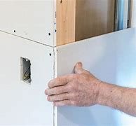

= 0022 Immigration to America is down. Wages are up
:toc: left
:toclevels: 3
:sectnums:

'''

== Immigration to America is down. Wages are up

*There are nonetheless 尽管如此 scraps 一丁点 of evidence that* some workers are benefiting from America’s growing *antipathy (n.)厌恶；反感 to* immigrants.

Gordon Hanson of Harvard University suggests that if *the impact of* reduced 减少的 low-skill migration *is showing up 使显露;显露 anywhere*, it will be *in three particular occupations* 工作；职业: housekeepers 管家，杂务主管（通常为女性）, building-and-grounds *maintenance workers* 维修工；保养工, and drywall (不抹灰的)板墙 installers.

These occupations 工作；职业 *rely 依赖；依靠 heavily on* immigrant labour /and 主 the services (they provide) 谓 cannot be traded internationally.

*Average wages* in those occupations *are rising considerably  非常；很；相当多地 faster* than wages in other low-paid jobs, *according to* calculations by The Economist.

.标题
====
.drywall
N-VAR Drywall is material such as plasterboard that can be used to make walls without using wet plaster. (不抹灰的)板墙

尽管如此，仍有零星的证据表明，美国人对移民们日益增长的反感, 给一些工人带来了好处. 哈佛大学(Harvard University)的戈登•汉森(Gordon Hanson)认为，低技能移民的数量减少, 其影响, 在三个特定的职业中表现最突出: 即, 管家、建筑与地面维护工人, 和干墙安装工. 因为这些工作严重依赖外来的移民劳工，他们所提供的服务, 是无法通过国际贸易来进口的。根据《经济学人》的计算，这些职业的平均工资增长速度, 要比其他低薪工作快得多。
====

'''

== <pure> Immigration to America is down. Wages are up

There are nonetheless scraps of evidence that 主 some workers 谓 are benefiting from America’s growing antipathy to immigrants. Gordon Hanson of Harvard University suggests that if the impact of reduced low-skill migration is showing up anywhere, it will be in three particular occupations: housekeepers, building-and-grounds maintenance workers, and drywall installers. These occupations rely heavily on immigrant labour and 主 the services they provide 谓 cannot be traded internationally. Average wages in those occupations are rising considerably faster than wages in other low-paid jobs, according to calculations by The Economist.

'''

