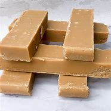

= 0104
:toc: left
:toclevels: 3
:sectnums:

'''

== A manager’s manifesto for 2020

1-. *Give out some praise*. People don’t come to work just for the money. They like to feel *they are making a valuable contribution*. Praise doesn’t have to happen every day and *it cannot be generic* (a.) 一般的；普通的；通用的.

*Pick something specific* that a worker has done which shows extra skill or effort and *single them out*  单独挑出; ideally (ad.)完美的；理想的；最合适的 so that others can hear the compliment 赞扬；称赞. *This is particularly important* for the most junior 地位（或职位、级别）低下的 employees, who will *feel anxious about* their status.

.标题
====
给予一些赞美。人们来工作,不只是为了钱。他们喜欢感觉到自己做了有价值的贡献。你不需要每天都给予赞美，但赞美时,也不能泛泛而谈。挑选出某位员工做过的能表现出他们行使了额外技能或努力的事例，将这位员工挑选出来, 表扬他; 最理想的是让别人听到你的赞美。这对初级的员工尤为重要，因为他们一般会对自己的地位, 感到焦虑。
====

2-. Remember that *you set the tone*.

If a manager is angry and swears  咒骂；诅咒；说脏话 a lot, *that will be seen as* acceptable behaviour.  +
If bosses *barely 几乎不；几乎没有 communicate*, they are unlikely to receive useful feedback. +
If they *fail to keep their promises*, workers will be less likely to co-operate. +
And if a manager frequently belittles  贬低；小看 a particular employee, that person *is unlikely to get the respect of* their colleagues.

.标题
====
记住，你定下了基调(即, 你的言行是怎样的, 你部门的文化就是怎样的)。如果一个经理易怒，经常骂人，则这将被你的部属视为可以接受的行为(上梁不正下梁歪)。如果老板很少与员工交流，那他们就不太可能得到员工们对其有用的反馈。如果他们不能兑现自己的承诺，则员工们也不太可能与其合作。如果一个经理经常贬低某个员工，则他(即被贬低的员工)就不太可能得到其他同事的尊重。
====

4-. *Make your priorities* 优先事项；最重要的事；首要事情 (for the next year) *clear*, and communicate them well. Is the company or division （机构的）部门) *trying to launch a new product*? Or *to boost sales of* existing products? Or *to control costs*? If you are not sure, then 主 those who work for you 谓 will have no idea. That can lead to a lot of wasted effort.

5-. *To that end* 为了实现那个目标, cut out 删除；删去;裁剪 the jargon 行话；黑话；行业术语；切口.

The use of *pretentious 炫耀的；虚夸的；自命不凡的 phrases* and complex acronyms 首字母缩略词 is generally designed to obfuscate (v.) （故意地）混淆，使困惑，使模糊不清 rather than 而不是 elucidate (v.) 阐明；解释；说明.

In Bartleby’s experience, 主 the reason people use unclear language 系 is that *they have nothing clear to say*.

If you are sending a general memo to all the staff, look carefully through it and ask *whether you would have understood it* on your first day of work. If not, make it simpler.

Remember George Orwell’s maxim 格言；箴言；座右铭: “Never use a foreign phrase, a scientific word, or a jargon word *if you can think of* an everyday English equivalent (n.) 相等的东西；等量；对应词.” It *applies to* other tongues  说话方式,语言, too.

.标题
====
.end
目的；目标

.pretentious
trying to appear important, intelligent, etc. in order to impress other people; trying to be sth that you are not, in order to impress 炫耀的；虚夸的；自命不凡的

.acronyms
/ˈækrə-nɪmz/

.obfuscate
⇒ ob-,在上，表强调，-fusc,黑的，词源同dusk.即使变黑的，引申词义混淆，模糊。

.elucidate
-> e-, 向外。-lucid, 照明，词源同light, lucid.

.would have done
“would have understood it”是英语语法中的一种虚拟完成时态。它**用于描述过去的假设情况，但实际上并没有发生。** +
例如，“If I had studied harder, *I would have done better* on the test.”的意思是，如果你学习得更努力，你会在考试中做得更好。

明确明年的工作重点，并做好沟通。公司(或部门)正在尝试推出新产品吗? 或者是要促进现有产品的销售? 还是需要控制成本? 如果你不确定明年你的工作重点，那么你的属下人也不会知道。这会导致大量的努力被白费。

为此，不要使用行话。去使用自命不凡的短语和复杂的缩写词的这种行为, 往往目的是为了故意令人难以理解, 而不是为了阐明清楚。根据巴特比的经验，人们之所以使用含糊不清的语言，是因为他们没有明确的话要说。如果你要给所有的员工发一份备忘录，先仔细看一遍，问问自己在第一天上班时是否就理解它。如果不是，就让这些话语变得更简单。记住乔治•奥威尔(George Orwell)的格言:“如果你能想出一个日常英语中的对等词，就永远不要去使用外国短语、科学词汇或行话。” 它也适用于其他语言。

====

'''

==== <pure> A manager’s manifesto for 2020

1-. Give out some praise. People don’t come to work just for the money. They like to feel  they are making a valuable contribution. Praise doesn’t have to happen every day and it cannot be generic. Pick something specific that a worker has done which shows extra skill or effort and single them out; ideally so that others can hear the compliment. This is particularly important for the most junior employees, who will feel anxious  about their status.

2-. Remember that you set the tone. If a manager is angry /and swears a lot, that will be seen as acceptable behaviour. If bosses barely communicate, they are unlikely  to receive useful feedback. If they fail to keep their promises, workers will be less likely  to co-operate. And if a manager frequently belittles a particular employee, that person is unlikely to get the respect of their colleagues.

4-. Make your priorities (for the next year) clear, and communicate them well. Is the company (or division) trying to launch a new product? Or to boost  sales of existing products? Or to control costs? If you are not sure, then 主 those who work for you 谓 will have no idea. That can lead to a lot of wasted effort.

5-. To that end, cut out the jargon. 主 The use of pretentious phrases and complex acronyms 谓 is generally designed to obfuscate  rather than elucidate. In Bartleby’s experience, 主 the reason (people use unclear language) 系 is that they have nothing clear to say. If you are sending a general memo to all the staff, look carefully through it and ask {whether you would have understood it [on your first day of work]}. If not, make it simpler. Remember George Orwell’s maxim: “Never use a foreign phrase, a scientific word, or a jargon word [if you can think of an everyday English equivalent].” It applies to other tongues, too.

'''

== Finding new physics will require a new particle collider

*DEEP UNDER the countryside* north of Geneva, straddling  跨过，横跨（河流、道路或一片土地）;骑；跨坐；分腿站立 the Franco-Swiss border, 主 one of the most advanced scientific machines ever built 谓 *has been banging 碰撞；磕 subatomic  亚原子的；比原子小的；原子内的 particles together* for more than a decade.

This device, *the Large Hadron 强子 Collider* (LHC), accelerates （使）加速，加快 *beams 光线；波束 of protons* 质子 (members of **a class 种类；类别；等级 of** particle called hadrons 强子) [in opposite directions] [around a 27km ring] *until they reach almost* the speed of light.

Powerful magnets 磁铁,磁体 then [underline]#force# these protons 质子 [underline]#into# *head-on 迎头相撞的；正面相撞的 collisions*, causing the energy (they carry) [underline]#to be converted#  — *as described by* Einstein’s best-known equation, latexmath:[ E=mc^2] —  [underline]#into# matter.

And *what matter*! For 主 sorting [through the ejecta (火山喷发或流星陨落时的)喷出物 from the collisions] 谓 *gives* physicists *fleeting (a.)短暂的；闪现的 glimpses of* the fundamental building blocks 组成部分；构成要素 of the universe and the forces (that bind or repel 排斥；相斥;推开 them).

.标题
====
.straddle
⇒ 改写自 stride,大步，阔步，跨，张开，-le,表反复。引申词义骑，横跨等。

.Hadron
强子(Hadron)是一种亚原子粒子，所有受到"强相互作用"影响的亚原子粒子都被称为强子。 强子，包括重子和介子。 +
按现代的粒子物理学中的标准模型理论而言，强子是由夸克、反夸克和胶子组成的。胶子是量子色动力学中的基本粒子，它将夸克连在一起，强子是这些连接的产物。

.proton
⇒ proto-,原始的，最早的，-on,物理名词后缀，来自electron.

.beam
a line of light, electric waves or particles 光线；（电波的）波束；（粒子的）束 +
（建筑物的）梁

.fleeting
(a.)lasting only a short time 短暂的；闪现的

- a fleeting (a.) glimpse/smile 短暂的一瞥；一闪即逝的微笑

在日内瓦北部横跨法瑞边境的乡村深处，十多年来，有史以来建造的最先进的科学机器之一, 一直在将亚原子粒子碰撞在一起。这个设备，即大型强子对撞机(LHC)，可以加速质子束(一类称为强子的属于粒子类的成员)绕着27公里的环, 向相反的方向加速，直到它们几乎达到光速。然后，强大的磁铁迫使这些质子发生正面碰撞，导致它们携带的能量被转换成物质—​正如爱因斯坦最著名的方程E=mc2所描述的那样。那又有什么关系呢！因为通过对碰撞中喷出的物质进行分类，物理学家们可以短暂地瞥见宇宙的基本构件，以及束缚或排斥它们的力。
====

The discovery of the Higgs, though, *was supposed to be*  一般认为；人们普遍觉得会 a beginning as well as an end, 因为 for *the Standard Model* now *needs to be extended into* something bigger.

It does not, for example, include gravity. *That is the province  知识（或兴趣、职责）范围；领域 of* General Relativity.

Dark matter is also absent. This is a substance, invisible but detectable by its gravitational 引力的；重力引起的 effects, that *makes up*  形成；构成 27% of the universe — *over five times as much as* the so-called normal matter of stars, planets, people and so on.

And *it does not include* dark energy, a thing of *unknown nature*  基本特征；本质；基本性质 which constitutes (v.)（被认为或看做）是；被算作,组成；构成 the remaining 68% of reality and somehow 以某种方式（或方法）,不知怎么地 acts (v.) [underline]#to push# everything else (in the cosmos) [underline]#apart#.

.标题
====
然而，希格斯粒子的发现虽然是一个终点, 它也被认为是一个开始，因为现在, 标准模型需要被扩展成更大的东西。例如，它没包括进重力, 重力还属于广义相对论的范畴中。它也没含进暗物质, 这是一种肉眼不可见, 但却可以通过引力效应能检测到的物质，占宇宙构成的27% — 是那些所谓正常的物质的5倍多. 正常物质, 即构成了恒星、行星、人体等的物质。它也没包括进暗能量，这是一种性质未知的东西，它构成了宇宙中剩余的68%，并以某种方式, 将宇宙中的其他一切物质推开 (暗能量被认为是导致宇宙加速膨胀的力量)。
====

主 *Each of these inadequacies (n.)不充分；不足；不够 谓 points to* physical laws, particles and forces (*yet to be* 有待, 尚未 discovered) — mysteries (which 主 physicists 谓 had expected 预料；预期；预计 that the LHC would have started *cracking 找到解决（难题等的）方法；爆裂声,噼啪声 open* by now). But it has not.

That suggests 主 *their hypotheses（有少量事实依据但未被证实的）假说，假设 about* what lies beyond the Standard Model, which were *the basis 基础,基点 of those expectations 预料；预期*, 谓 must be wrong.

*The weightiest 严重的；重大的,沉重的 expectation 期望；指望 was placed on the shoulders of* an elegant idea called supersymmetry 超对称性.

This theory, developed over the past 50 years, is a way of removing [from the Standard Model] a lot of things ([underline]#known# in the trade 同业；同行；同人 [underline]#as# *fudge 乳脂软糖,敷衍，装模作样（没有真正解决问题） factors* 系数, 经验系数; 容差系数).

*A fudge factor* is *an arbitrary  任意的；武断的；随心所欲的 value* that makes a model work, but which itself *defies (v.)不可能，无法（相信、解释、描绘等）;违抗；蔑视 deeper explanation*.

In the Standard Model, many such fudges (n.)敷衍，装模作样（没有真正解决问题）;不太令人满意的折中方案 can be erased [by 谓 introducing, for each and every Standard Model particle, 宾 *a heavier “supersymmetric” 超对称的 partner* (that has not yet been seen)).

主 The putative (a.)推定的；认定的；公认的 superpartners of the electron and quark, for example, 谓 *are known as* the selectron 超电子 and squark 超夸克.

.标题
====
.cracking :
(a.)( BrE informal ) excellent 优秀的；出色的；极好的；顶呱呱的

-  She’s in cracking form at the moment. 她这会儿状态好极了。
- We set off at a cracking pace (= very quickly) . 我们迅速地出发了。

(v.)~ sth/sb (on/against sth)to hit sth/sb with a short hard blow 重击；猛击

(v.) 找到解决（难题等的）方法

- to crack the enemy's code 破译敌人的密码

.the trade
[ sing.+sing./pl.v. ] : a particular area of business and the people or companies that are connected with it 同业；同行；同人
→ a trade magazine/journal 行业杂志╱期刊
→ They offer(v.) discounts to the trade (= to people who are working in the same business) . 他们对同行业的人给予折扣。

.fudge
/fʌdʒ/ +
(1)法奇软糖，乳脂软糖（用糖、黄油和牛奶制成） +
(2) a fudge [ sing. ] ( especially BrE ) a way of dealing with a situation that does not really solve the problems but is intended to appear to do so 敷衍，装模作样（没有真正解决问题） +
-> 词源不详。可能来自17世纪真实存在的Captain Fudge, 每次出海总会带回一箩筐的谎言，回避老板和同事的问题，因此，其名字通用化成为胡扯瞎说的代名词。后也用来指一种软糖。

- *This solution is a fudge* [rushed in to win cheers at the party conference]. 这个解决方案, 是为了赢得党的会议的赞誉而仓促搞出来的表面文章。

.factor :
→ a suntan lotion with a protection factor(=a particular level on a scale of measurement 系数) of 10 防护系数为10的防晒油

.fudge factors
经验系数; 容差系数.

.defy :
(v.) ~ belief, explanation, description, etc. : to be impossible or almost impossible to believe, explain, describe, etc. 不可能，无法（相信、解释、描绘等）;/违抗；反抗；蔑视

.putative
/ˈpjuːtətɪv/
(a.)( formal ) ( law 律) believed to be the person or thing mentioned 推定的；认定的；公认的. SYN presumed +
-> putative ⇒ 来自拉丁语putare,计算，判断，思考，词源同compute,repute.

- the putative father of this child 这孩子的推定的父亲

这些不足之处中的每一个, 都指向着尚未被发现的物理定律、粒子和力-- 这些谜团, 物理学家们曾期望大型强子对撞机现在已经开始破解了。但事实并非如此。这表明他们关于标准模型之外的东西的假设, 肯定是错误的，而这些假设是这些预期的基础。

最大的期望, 被寄托在了一种被称为"超对称"的优雅思想的身上。这一理论已经存在了超过50年. 该理论, 能用于将众多的"容差系数"从标准模型中删除出去. "容差系数"是业内的叫法. "容差系数"是一个任意的值，它虽然可以使标准模型工作，但这个容差系数为什么是这个值, 你却无法对它做解释。

在标准模型中，可以通过为每个标准模型粒子引入一个更重的“超对称”伙伴(虽然它还没有被试验证实存在), 来消除许多的"容差系数"的这种任意值。例如，电子和夸克的超对称伙伴, 被称为超电子和超夸克。
====

Unfortunately, after almost a decade of increasingly energetic collisions at the LHC, *nothing new has emerged beyond* the Higgs itself. No hidden dimensions. No *unexplained phenomena*. No supersymmetric particles. [As a result] supersymmetry *has*, for many physicists, *lost its lustre* 光泽；光辉; 荣光；荣耀.

[And *of the myriad (n./a.)无数；大量 alternatives* 后定 *jostling (v.)（在人群中）挤，推，撞，搡; 争夺；争抢 to take its place*],  no one knows {主 *which*, if any, 系 *might be closest to the truth}*.

.标题
====
.lustre
/ˈlʌstər/

.myriad
⇒ 来自希腊语myrias,大量的，无数的，一万，可能来自PIE meu,流动，流出，水流，词源同 emanate(=to produce or show sth 产生；表现；显示), marine(=海的；海产的；海生的). 即由流动的水引申词义丰饶的，许多的，无数的。需注意的是，该词在古希腊语为单个词所表示的最大数。词义演变比较abundant.

.jostle
(v.)/ˈdʒɑːs(ə)l/ to push roughly against sb in a crowd （在人群中）挤，推，撞，搡 +
-> 来自joust,推挤，打斗，-le,表反复。引申词义竞争，争夺。拼写比较claim,clamor.

不幸的是，在LHC经历了近10年的越来越高能量的撞击试验之后，除了希格斯粒子本身之外，没有任何其他的新发现。没有隐藏的维度。没有原因不明的现象出现。没有超对称粒子。因此，对许多物理学家来说，超对称性已经失去了它的光泽。在无数的替代方案中，没有人知道哪一个(如果有的话)最接近事实真相。
====

Regardless of the details, though, the consensus (n.)一致的意见；共识 is that {主 the route to finding physics (beyond the Standard Model) 谓 *runs through* the Higgs boson itself}.

This means 宾 examining (v.) and characterising  描述，刻画，表现（…的特征、特点） that object [in exquisite 精美的；精致的 detail].

Physicists do not know, for example, if it is truly *an elementary particle* with no *internal structure* (like an electron or a quark) /or is a composite 合成物；混合物；复合材料 of smaller objects (*in the way* that protons and neutrons are *made of* three quarks each).

*It is even possible that* {主 what has been identified as the Higgs 系 is not actually the particle *predicted by* the Standard Model — but, rather, a different particle (from *an as-yet-unknown 至今仍未知的 theory*) (that *happens to* 恰好,偶然发生 have the Higgs’s predicted mass)}.

.标题
====
不管细节如何，人们的共识是，找到超越标准模型的物理学的途径, 是通过希格斯玻色子本身。这意味着要仔细地研究和描述那个物体的细节。例如，物理学家不知道它究竟是一个没有内部结构的基本粒子(比如电子或夸克)，还是由更小的物体组成的复合物(比如质子和中子分别由三个夸克组成)。甚至有可能，被确认为希格斯的粒子, 实际上并不是标准模型预测的粒子，而是来自另一种尚不知名理论的不同粒子，该粒子恰好具有希格斯的预测质量而已。
====

Higgs bosons are unstable. They decay （力量、影响等）衰弱，衰减 into pairs of other particles [almost as soon as they are created].

The Standard Model predicts that 宾 [around 60% of the time] this will create a bottom quark and its antimatter  反物质 equivalent. +
[A further 21% of the time] a pair of W bosons will emerge, and `主` 9% of Higgs-boson decays `谓` should *end up with* a pair of gluons (the other 10% *will result in* yet further combinations).

[By making *enormous numbers of* Higgs bosons /and then *measuring the precise rates* (at which 主 bottom quarks, W bosons, gluons and other elementary particles 谓 emerge)], those running 管理，经营；运行 the FCC would be able to *watch for*  观察等待（某人出现或发生某事） discrepancies 差异；不一致 from the Standard Model’s predictions.

The more Higgses created, the more *statistical 统计的；统计学的 power* 主 the results 谓 will have, and the more confident 主 researchers 谓 will be (that 主 any deviations 背离；偏离；违背 from Standard Model predictions (which they measure) 谓 actually represent (v.) something real).

.标题
====
.The+形容词/副词的比较级+主语+谓语

1. the more...the more...结构其实是一个 从句+主句 的结构: +
*第一个the more...相当于一个"原因状语从句"*, 是从省略了表示原因的连词as等进化而来的(也可理解成是省略了if的条件状语从句); *第二个the more...引导的是主句.* +
-> *The thicker* a mammal's skin is(从句), *the less hair* it has(主句). +
= As a mammal's skin is thicker(从句), it has less hair(主句).

2. the more 后面的谓语, 如果是be动词的话, 可以省略, 这一点对于前后两个都适用. *特别当主谓语是 it is时, 常同时省略.* +
-> What size box do you want? -- *The bigger, the better*.  +
= 其实就是 The bigger *it is*, the better *it is*

3. 第二个the more后面可以使用"倒装", 而第一个后面却不行. (因为 *只有主句才能倒装,从句绝不能倒装!* 如果继续深究第二个the more后面什么时候用倒装时, 可认为 *如果主语长,谓语动词短时, 为避免头重脚轻, 主谓语倒装.*

希格斯玻色子是不稳定的。它们几乎一产生就会衰变成成对的其他粒子。标准模型预测，在大约60%的时间里，这将产生一个底夸克和它的反物质当量。另外21%的情况下会出现一对W玻色子，9%的希格斯玻色子衰变会产生一对胶子(另外10%会产生更多的组合)。通过制造大量的希格斯玻色子，然后测量底夸克、W玻色子、胶子和其他基本粒子出现的精确速率，FCC的管理者将能观察到与标准模型预测的差异。希格斯玻色子创造的越多，结果所带来统计力量, 就越强大，研究人员就越有信心，他们测量的任何与标准模型预测的偏差实际上都代表了一些真实的东西。
====

'''

==== <pure> Finding new physics will require a new particle collider

DEEP UNDER the countryside north of Geneva, straddling the Franco-Swiss border, one of the most advanced scientific machines ever built has been banging subatomic particles [together] for more than a decade. This device, the Large Hadron Collider (LHC), accelerates beams of protons (members of a class of particle called hadrons) [in opposite directions] around a 27km ring until they reach almost the speed of light. Powerful magnets then force these protons into head-on collisions, causing the energy they carry to be converted — as described by Einstein’s best-known equation, E=mc2 — into matter. And what matter! For 主 sorting through the ejecta from the collisions 谓 gives physicists fleeting glimpses of  the fundamental building blocks of the universe and  the forces that bind or repel them.

The discovery of the Higgs, though, was supposed to be a beginning as well as an end, for the Standard Model now needs to be extended into something bigger. It does not, for example, include gravity. That is the province of General Relativity. Dark matter is also absent. This is a substance, invisible but detectable by its gravitational effects, that makes up 27% of the universe — over five times as much as the so-called normal matter of stars, planets, people and so on. And it does not include dark energy, a thing of unknown nature which constitutes the remaining 68% of reality and somehow acts to push everything else in the cosmos [apart].

Each of these inadequacies  points to physical laws, particles and forces (yet to be discovered) — mysteries (which physicists had expected that the LHC would have started cracking open by now). But it has not. That suggests 主 their hypotheses about what lies beyond the Standard Model, which were the basis of those expectations, 谓 must be wrong.

The weightiest expectation was placed [on the shoulders of an elegant idea called supersymmetry]. 主 This theory, developed over the past 50 years, 系 is a way of removing [from the Standard Model] a lot of things known [in the trade] as fudge factors. A fudge factor is an arbitrary value that makes a model work, but which itself defies deeper explanation. In the Standard Model, many such fudges can be erased [by introducing, for each and every Standard Model particle, a heavier “supersymmetric” partner that has not yet been seen]. 主 The putative superpartners of the electron and quark, for example, 谓 are known as the selectron and squark.

Unfortunately, after almost a decade of increasingly energetic collisions at the LHC, nothing new has emerged beyond the Higgs itself. No hidden dimensions. No unexplained phenomena. No supersymmetric particles. [As a result] supersymmetry has, for many physicists, lost its lustre. [And of the myriad alternatives jostling  to take its place], no one knows {主 which, if any, 系 might be closest to the truth}.

Regardless of the details, though, the consensus is that {主 the route to finding physics beyond the Standard Model 谓 runs [through the Higgs boson itself]}. This means {examining and characterising that object [in exquisite detail]}. Physicists do not know, for example, if it is truly an elementary particle with no internal structure (like an electron or a quark) or is a composite of smaller objects (in the way that protons and neutrons are made of three quarks each). It is even possible {that 主 what has been identified as the Higgs 系 is not actually the particle (predicted by the Standard Model—but), rather, a different particle (from an as-yet-unknown theory) that happens to have the Higgs’s predicted mass}.

Higgs bosons are unstable. They decay into pairs of other particles almost as soon as they are created. The Standard Model predicts that around 60% of the time this will create a bottom quark and its antimatter equivalent. A further 21% of the time a pair of W bosons will emerge, and 9% of Higgs-boson decays should end up with a pair of gluons (the other 10% will result in yet further combinations). By making enormous numbers of Higgs bosons and then measuring the precise rates at which bottom quarks, W bosons, gluons and other elementary particles emerge, those running the FCC would be able to watch for discrepancies from the Standard Model’s predictions. The more Higgses created, the more statistical power the results will have, and the more confident researchers will be that any deviations from Standard Model predictions which they measure actually represent something real.

'''

==   What a museum of disgusting food reveals about human nature

When people recognise that disgust *depends [in part] on* upbringing (a.) 抚育；养育；培养, they can learn to overcome it, at least some of the time.

Not only 主 do “immoral” things 谓 disgust people; sometimes, disgust can affect their moral judgments.

In one experiment, Thalia Wheatley of the National *Institutes of Health* 国立卫生研究院 and Jonathan Haidt of the University of Virginia took a group of people *who were susceptible (a.)易受影响（或伤害等）；敏感；过敏) to* hypnosis 催眠状态.

*They were hypnotised (v.)对（某人）施催眠术 to feel* a brief pang (n.)突然的疼痛（或痛苦）；一阵剧痛) of disgust [when they read an everyday 每天的；每日发生的；日常的 word, either “take” or “often”].

Then they read accounts (n.)描述；叙述；报告 of theft, bribery (n.)行贿；受贿 or incest (n.)乱伦；血亲相奸, and were asked how morally outrageous (a.)骇人的；无法容忍的 they thought each incident was.

When *an account 描述；叙述；报告 of* an offence(n.)违法行为；犯罪；罪行 included one of the words that triggered disgust, the participants *condemned (v.) it more severely*.

Other experiments have shown that 主 people who are easily disgusted 谓 *make harsher moral judgments* [when subjected (v.)使经受；使遭受 to *disgusting 极糟的；令人不快的 stimuli* 刺激物, such as *a sticky 黏（性）的 desk* or *foul 肮脏恶臭的；难闻的 smells*].

.标题
====
.hypnosis
/hɪp-ˈnoʊ-sɪs/
⇒ hypno-,睡觉，催眠，-osis,情况，疾病征兆。引申词义催眠，催眠状态。许普诺斯（Hypnos）是希腊神话中的睡神.

.outrageous
⇒ 来自outrage,愤怒，愤慨。
当人们意识到, "厌恶感"在某种程度上取决于你从小受过什么教育时，他们可以尝试学会克服它，至少在某些时候是这样。

.incest
-> in-,不，非，-cest,纯的，词源同caste,castrate.即不纯洁的，引申词义乱伦。

不但做“不道德”的事, 会令人厌恶;有时，厌恶的感观感觉, 也会影响他们的道德判断。

在一项实验中，美国国立卫生研究院的Thalia Wheatley和弗吉尼亚大学的Jonathan Haidt, 对一组容易受到催眠影响的人, 进行了研究。他们在被催眠后，就让他们阅读每一个日常的普通单词, 比如“take” 或 “often”, 同时, 给他们施加一阵令人会产生厌恶感的短暂刺激. 之后, 就给他们阅读关于盗窃、贿赂或乱伦的报道，并询问他们, 这每一个有罪的行为, 令他们有多无法容忍? 结果证明, 当报道中含有会令人引起厌恶的用词时, 被试者就会更加严厉地谴责它。

其他的实验表明，容易感到厌恶感的人, 在受到令人作呕的刺激时，比如黏糊糊的桌子, 或难闻的气味时，会做出更严厉的道德判断。
====

Another finding is that 主 people who are more easily disgusted 系 *are more likely(a.) to be* socially conservative (a.)保守的.

A study by Xiaowen Xu of the College of William and Mary 威廉与玛丽学院 in Virginia and others *found evidence that* “disgust-sensitive people [underline]#extend# (v.) their preference (n.) for order 秩序;条理 (in the physical environment (eg, tidying up 使整洁；使整齐 ；使有条理；整理 one’s room)) [underline]#to# *the sociopolitical 社会政治的 environment* (eg, strengthening (v.) *traditional norms*).”

Woo-Young Ahn of Virginia Tech 弗吉尼亚理工大学 and others found that by scanning (v.) *brain responses* to a single disgusting image (such as *a mutilated 使残废；使残缺不全；毁伤) body*, they could *make accurate predictions about* a subject’s  接受试验者；实验对象 *political ideology*  意识形态；观念形态.

主 People *who are highly sensitive to disgust* 系 are especially likely to oppose (v.)反对（计划、政策等）；抵制；阻挠 immigration 外来移民. This is true *even after* controlling for education, income and political ideology.

.标题
====
.the College of William and Mary :
威廉与玛丽学院. 是美国历史第二悠久的高等院校(1693年)，建校时间仅次于1636年建立的哈佛大学。

.mutilate
⇒ 来自拉丁语mutilus,使残的，可能来自PIE*mai,砍，切，词源同 maim, mangle. 引申词义使残废。

另一项发现是，更容易会产生恶心感的人, 也更有可能是社会保守主义者。弗吉尼亚的威廉与玛丽学院的 Xiaowen Xu 等人研究发现，有证据表明，“对厌恶感敏感的人, 会将他们对物理环境中的秩序(如整理房间)的偏好, 延伸到社会的政治环境上(如强化传统规范)。” 弗吉尼亚理工大学的 Woo-Young Ahn 等人发现，通过扫描大脑对单独的恶心图像(比如残损的身体)所作出的反应，他们可以准确预测一个被试的政治意识形态。

那些最容易产生(具有敏感性)厌恶感的人, 尤其可能反对移民。即使将他们的教育、收入, 和政治意识形态考虑在内，也是如此。
====

'''

==== <pure> What a museum of disgusting food reveals about human nature

When people recognise that {disgust depends in part on upbringing}, they can learn to overcome it, at least some of the time.

Not only do “immoral” things disgust people; sometimes, disgust can affect their moral judgments. In one experiment, Thalia Wheatley of the National Institutes of Health and Jonathan Haidt of the University of Virginia took a group of people who were susceptible to hypnosis. They were hypnotised to feel a brief pang of disgust when they read an everyday word, either “take” or “often”. Then they read accounts of theft, bribery or incest, and were asked how morally outrageous they thought each incident was. When an account of an offence included one of the words that triggered disgust, the participants condemned it more severely. Other experiments have shown that 主 people who are easily disgusted 谓 make harsher moral judgments [when subjected to disgusting stimuli, such as a sticky desk or foul smells].

Another finding is that 主 people who are more easily disgusted 系 are more likely  表 to be socially conservative. A study by Xiaowen Xu of the College of William and Mary in Virginia and others found evidence that “disgust-sensitive people extend their preference for order in the physical environment (eg, tidying up one’s room) to the sociopolitical environment (eg, strengthening traditional norms).” Woo-Young Ahn of Virginia Tech and others found that by scanning brain responses to a single disgusting image (such as a mutilated body), they could make accurate predictions about a subject’s political ideology.

People who are highly sensitive to disgust are especially likely to oppose immigration. This is true even after controlling for education, income and political ideology.

'''

== Life is getting harder for foreign VCs in China

Chinese founders （组织、机构等的）创建者，创办者，发起人 *have coveted (v.) 渴望；贪求（尤指别人的东西）；觊觎 attention from* foreign funds, *seen as the best route* to listing on American exchanges  交易所 and keener (a.)（对…）着迷，有兴趣 than Chinese counterparts to back 帮助；支持 ideas (that *take longer* to make money).

Their *dollar-denominated (v.)以（某种货币）为单位 funds* have durations (n.)持续时间；期间 of ten years or more, whereas yuan 元（中国货币单位） investors usually want a return in five. (Most foreign VCs now also raise yuan funds, which enable exits (v.) on mainland stockmarkets and investments in more industries.)

Foreigners offer (v.) expertise 专门知识；专门技能；专长 [*on top of*  除…之外 cheques 支票, especially to startups *keen (a.) to expand(v.) overseas*].

.标题
====
.keener
(a.)(=keen on sb/sth/on doing sth : ( BrE informal ) liking sb/sth very much; very interested in sb/sth 喜爱；（对…）着迷，有兴趣

.covet
⇒ 来自拉丁词cupio, 渴求，词源同 Cupid(罗马爱神-丘比特), cupidity, hope.

.on top of sth/sb :
in addition to sth 除…之外

- He gets commission on top of his salary. 他除了薪金之外还拿佣金。

中国的创始人特别希望获得外国风投基金的关注，因为这被视为, 能被列入美国上市排队名单的最佳方法. 并且, 外国风投也比他们中国的同行, 能更热衷于支持那些需要更长的时间才能赚钱的创业项目。他们的以美元来计价的基金, 投资持续期能达到10年或更长时间，而以人民币来投资的中国风投, 则希望在5年内就获得回报。(现在, 大多数外国风投公司, 也筹集人民币资金，这使它们能够从中国大陆的股市退出，并在更多行业进行投资。) 除了提供支票之外，外国的风投还会提供专业技能，尤其是针对那些渴望向海外扩张的中国初创企业。
====

'''

==== <pure> Life is getting harder for foreign VCs in China

Chinese founders have coveted attention from foreign funds, seen as the best route to listing on American exchanges and keener [than Chinese counterparts] to back ideas that take longer to make money. Their dollar-denominated funds have durations of ten years or more, whereas yuan investors usually want a return in five. (Most foreign VCs now also raise yuan funds, which enable exits on mainland stockmarkets and investments in more industries.) Foreigners offer expertise [on top of cheques], especially to startups keen to expand overseas.

'''

== The number of the best

*Whereas* （用以比较或对比两个事实）然而，但是，尽管 150 *is sometimes referred to as* the “Dunbar number”, the academic himself in fact *refers to* a range of figures.

*He observes that* humans *tend to have* five *intimate  亲密的；密切的 friends*, 15 *or so* 大约，左右 good friends, around 50 social friends and 150-odd 大约；略多 acquaintances.

.标题
====
.odd :
( no comparative or superlative; usually placed immediately after a number 无比较级或最高级；通常紧接在数字后面 ) approximately or a little more than the number mentioned 大约；略多

- How old is she — seventy odd? 她多大年纪？七十出头？
- He’s worked there for twenty-odd years. 他在那里工作了二十多年。

150有时被称为“邓巴数”，而学者自己实际上指的是一系列数字。他发现，人类往往有5个亲密的朋友，15个左右的好朋友，大约50个社会朋友和, 150多个熟人。
====

'''

==== <pure> The number of the best

Whereas 150 is sometimes referred to as the “Dunbar number”, the academic himself in fact refers to a range of figures. He observes that humans tend to have five intimate friends, 15 [or so] good friends, around 50 social friends and 150-odd acquaintances.

'''

== Back pain is a massive problem which is badly treated

Doctors *used to think that* back pain *was almost entirely the result of* mechanical damage to tissue beyond the capacity of X-rays to detect.

The advent of *MRI scans* showed {this was not true}. A definitive (a.)最后的；决定性的；不可更改的 *physical cause* — such as a fracture, a tumour 肿瘤；肿块, *pressure on a nerve*, infection or arthritis 关节炎 — is found in 5-15% of people with back pain.

The rest  剩余部分；残留；其余 *is all labelled (v.)贴标签于；用标签标明 as “non-specific”* 不明确的；非特定的；泛泛的; 不止一种病因的；有多种致病可能的, and there is increasing evidence that it is not mechanical *in origin*.

.标题
====
.mechanical damage :
机械损伤. 是指人体同某种致伤物接触，因机械运动作用, 所造成的机体正常组织的破坏, 或器官的机能性障碍。可分为钝器伤、锐器伤、枪弹伤、火器伤等类。机械性损伤的基本征象有: 表皮剥脱、皮下出血、创伤、骨折、内脏破裂, 肢体断离, 六种。

.non-specific :
a. not definite or clearly defined; general 不明确的；非特定的；泛泛的
→ The candidate’s speech was non-specific. 这位候选人的讲话只是泛泛之谈。

医生们过去认为，背部疼痛几乎完全是组织受到机械损伤的结果，超出了x光检测的能力。核磁共振扫描的出现, 表明事实并非如此。5-15%的背痛患者, 都有明确的生理原因，如骨折、肿瘤、神经压迫、感染或关节炎。其余的都被贴上了“非单一原因导致的”的标签，而且越来越多的证据表明, 机械损伤并非是它的病因。
====

Some sufferers  *catastrophise (v.)小题大做，把事情复杂化 the news into the idea that* they have a broken, fragile back and  start avoiding normal physical activity — *not least* 特别；尤其, says Ms Knight of St Thomas’, because doctors *often fail to explain to them ① that* {abnormalities (n.)身体、行为等不正常，反常  are, in fact, quite normal}, and ② *that* {degeneration 蜕化；衰退**can basically 总的说来；从根本上说 be** wear and tear 损耗}.

exercise daily;  *[underline]#accept# flare-ups(n.)疾病突发；（尤指）复发 [underline]#as# temporary setbacks*(n.)挫折；阻碍;  *don’t get fixated (a.) on* （对…）异常依恋，固恋 the pain.

The programme, explains Ms Knight, aims [underline]#not# *to reduce pain* [underline]#so much as# *to add to life*.

*In a typical class* of ten people, Ms Knight says, one or two *decide that* the approach *is not what they want*, and may *drop out* 不再参加；退出；脱离. Most of them *take away at least some skills* which add to their *quality of life*. One or two, like Mr Moore, find the programme life-changing(a.)改变人生的.

.标题
====
.wear and tear
损耗,磨损

.not A so much as B / not so much A as B :
与其说A, 倒不如说B / 是B,而不是A. 即, 轻前, 重后 +
A和B是两个被比较的平行结构，如同为介词短语、动词不定式、名词短语或其他平行结构。

- Science moves forward, they say, *not so much* through the insights of great men of genius *as* because of more ordinary things like improved techniques and tools.
他们说，科学的发展**与其说**源于天才伟人的真知灼见，**不如说**源于改进了的技术和工具等更为普通的东西。

- The great use of a school education is *not so much* to teach you things *as* to teach you the art of learning.
学校教育的伟大作用不在于教会你多少东西，而在于教会你学习的技巧。

一些患者将他们从扫描中看到的信息, 小题大做, 以为他们有了一个骨折的, 脆弱的背部，并开始避免正常的身体活动，尤其是, 因为医生经常未能向他们解释，这种异常, 实际上是很正常的，身体机能的退化, 基本上源于年龄所导致的身体器官的磨损。而你如果不活动的话, 带来的肌肉僵硬和身体虚弱, 反而往往会令情况变得更糟。

每天锻炼；将突发的疾病, 视为是暂时的挫折；不要专注于疼痛。奈特女士解释说，这个项目的目的, 与其说是减轻病痛，不如说是为了增加生命的质量。

在一个典型的有十人的班级里，会有一两个病友认为这种方式不是他们想要的，而可能退出。但班里的大多数人, 至少会学到一些机能, 能给他们的生活质量带来提高。班里会有一两个人, 就像摩尔先生一样，会发现这个项目能改变他们的人生。
====

'''

==== <pure> Back pain is a massive problem which is badly treated

Doctors used to think that back pain was almost entirely the result of mechanical damage to tissue beyond the capacity of X-rays to detect. The advent of MRI scans showed this was not true. 主 A definitive physical cause — such as a fracture, a tumour, pressure on a nerve, infection or arthritis — 谓 is found in 5-15% of people with back pain. 主 The rest `谓 is all labelled as “non-specific”, and there is increasing evidence that it is not mechanical in origin.

Some sufferers catastrophise the news into the idea that they have a broken, fragile back and start avoiding normal physical activity — not least, says Ms Knight of St Thomas’, because doctors often fail to explain to them that 主 abnormalities 系 are, in fact, quite normal, and that 主 degeneration 系 can basically be wear and tear.

exercise daily; accept flare-ups as temporary setbacks; don’t get fixated on the pain.

The programme, explains Ms Knight, aims not to reduce pain so much as to add to life.

In a typical class of ten people, Ms Knight says, one or two decide that the approach is not what they want, and may drop out. Most of them take away at least some skills which add to their quality of life. One or two, like Mr Moore, find the programme life-changing.

'''

