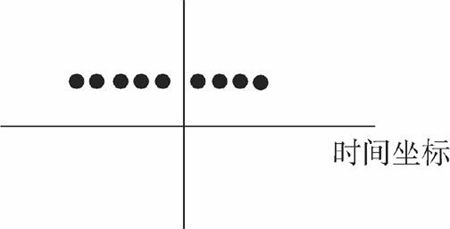
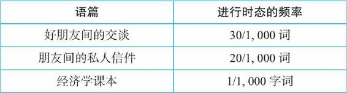
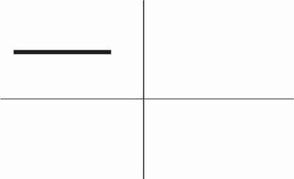
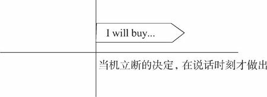
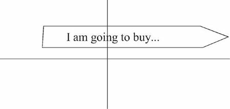

= new 张满胜 时态01
:toc:

---

== Tense chart 时态表

记住所有时态最好的方法是: 背例句!!

[options="autowidth"]
|===
|Tense chart |present |past |future |过去将来时

|simple
|do
|did
|- will do +
- be going to +
- shall do
|would do

|progressive
|am /is /are doing
|was /were doing
|will be doing
|would be doing

|perfect
|have /has done
|had done
|will have done
|would have done

|perfect progressive
|have /has been doing
|had been doing
|will have been doing
|would have been doing

|===

---

== 任意过去到未来, 任意时间段长短 <- do/does

要表达从过去到现在, 直至将来的一段时间内, 发生的动作（action）或存在的状态（state）, 可以用"do".

- 它们**可发生于任何时间，包括现在、过去和将来**.
- *这一段时间到底有多长，我们不知道*。它可以是近乎无限长（如表示客观真理），也可以是人们生活中的一段时间（如人们的习惯活动）。
- 因此可以用来表达**不受时间限制的**科学事实、客观真理、谚语格言，以及用于概括、结论、观点等.

例:

- “We do not say...” <- "do", 才能传达出这样一个一贯性的政策，即不论是在过去、现在还是将来.
- Opportunities *always favor*(v.) the prepared minds. 机会总是青睐有准备的人。 <- 表示普遍的事实或真理（expressing ageneral truth）
- The opening ceremony of the Olympic Games *includes*... . It also *includes*...  <- 这类介绍性的文字，一般都是表示规律性的活动，同样不受时间的限制，故而要用"do"。
- Nothing and no one *can destroy* the Chinese people. They *are* relentless survivors.  赛珍珠的观点 <- 在表达概括、总结、个人观点时，我们也都是用"do"。

[cols="1a,1a"]
|===
|一般时态 -> 不会变化的, 固定的 |进行时态 -> 暂时的, 会变化的

|- John *lives* in Beijing.   -> "一般时态"具有完整和**不变**的核心意义. 把“约翰住在北京”这个情况作为一个整体事件来描述，*没有任何进一步发展和变化的可能。*
|- John is living in Beijing. -> "am/is/are doing"表示约翰在北京的居住可能是**暂时的，存在发生变化的可能。**此时，约翰在北京的居住是整个过程中的某个片断.
|===

---

== 重复性(/习惯性)活动 <- do/does

表示重复活动/状态（expressing a regularly occurring event）-> 用"do"

- I *go to the gym* twice a week. 我每周去两次健身房。 <- 表示"习惯的动作"
- I *like rice* for dinner. <- 表示"习惯的状态"

[cols="1a,1a"]
|===
|"do" -> 无法表示明确的时间段(开始/结束) |完成进行时 -> 可以明确表示"从过去一直目前为止"

|- I swim 1,000 meters every afternoon.  +

<- 这里用"do"swim，是指昨天以前是swim 1,000 meters，今天也是swim 1,000 meters，明天以后还是swim 1,000 meters。 +
至于何时开始swim 1,000 meters, 或何时将结束swim 1,000 meters，则并不是"do"能够表达的出来的，即**"do"无法向我们展示一个明确具体的时间段。**

- I winter swim for about four years.*
- I winter swim since 1984.* +
<- 这两句是错的, 因为"do"是在泛泛地谈时间，并没有时间段的概念；"do"无法用来表明时间段, 所以不能加时间段!

|- I have been swimming 1,000 meters every afternoon.

<- **"完成进行时"是能够表示明确的时间段概念的，这个时间段就是“从过去一直目前为止”。**来潜含一个较为明确的时间段。这句话的意思是，也许“我”打算以后改变一下游泳锻炼的计划.

image:img_engGram/张满胜eng 02.jpg[]
|===

---

== 在任意时间点(过去/现在/将来) + 正在发生 <- 进行时 be doing

[cols="1,3a"]
|===
|Header 1 |Header 2

|在说话的时刻"正在进行"的动作 -> 用"am/is/are doing"
|- Jenny: Hello? +
Frank: Hi, Jenny. *What are you doing*? +
Jenny: Oh, hi, Frank. *I'm doing my laundry*. You? +
Frank: Well, this neighborhood *is really booming*. It's not really a suburb any more. +
Jenny: Yeah, *it is getting crowded*. Where *are you looking for* an apartment? +
Jenny: Yes. And I know *while you're not living in poverty*, a college student still can't afford an apartment by the train station.

在上述这些场景中，"进行时态"都是表示"此时此刻"所发生的活动（action happening exactly now）。

进行时态, 因为往往强调在说话的时刻某活动正在发生，所以**常用"进行时态"表达生动、具体的场景。**而"进行时态"因为其表现生动，所以在口语中出现的频率, 要远远高于书面语。

笔者曾经看到过一个对口头和书面语篇的研究统计，结果表明, *"进行时态"在那些表人物互动的语篇中（即口语中）, 出现频率要比那些没有人物互动的语篇中高得多。*

|"进行时"是**强调在某个特定的（现在、过去或将来）"时间点"**，某项活动正在发生。*所以, "进行时态"往往要和"某一特定的时间点"连用(即必须指明时间)*，来表示某一个活动在"该时刻"正在进行.
|- I will be watching CCTV news [*at this time tomorrow evening*]. 明天晚上的这个时间，我将正在...。<- 这里是**直接给出具体的时间**，如 right now 和 at this time tomorrow evening。
- I was watching CCTV news [*when he arrived*]. 他到的时候，我正在... <-  这里我们是通过**引入"时间状语从句"**, 来表达某一特定的时间点的，如 when he arrived 或 when you come tomorrow。
|===

---

== ---------- ----------

---

==  过去 + 短暂动作/状态 <- did

要表达"过去"发生的"短暂"动作或状态, 就用"did".

此时, 常和表示过去的特定的"时间状语"连用。这些时间状语有：yesterday, last pring（去年春天）等等。 +
*注意，这些时间状语之前不需加介词*，比如不能说：at last night*，in last year* 或 in three years ago*等等。

[cols="1a,2a"]
|===
|Header 1 |Header 2

|过去存在的动作
|- I began(v.) to learn English *ten years ago*. 我10年以前开始学习英语。 <- 虽然学英语是个长期状态, 但begin是个短暂的动作.
- I bought(v.) this computer three years ago. 我三年以前买的这台电脑。

|过去存在的状态
|- He was late(a.) for school *this morning*. 他今天早上上学迟到了。
- I was tired(a.) last night, so I went to bed early. 我昨晚感到很累，所以早早地
上床睡觉了。
|===

上述例子, 均表示在过去某一特定的时间点（a specific point of time in the past）发生的动作或状态.

image:img_engGram/张满胜eng 03.jpg[]

但是很多时候, 句子里没有明确的过去时间，如果根据上下文地语境, 推断出某个动作是过去发生的，这时也要用"did"。

---

== 过去 + 一段时期内 + 重复性动作/状态 <- did

要表达过去的一段时间（a specific period of time in the past）内延续或重复的动作, 就用"did".

- I slept(v.) for eight hours last night. 我昨晚睡了八个小时。
- She lived(v.) in our town for three years, but now she is living in Beijing. 她在我们这个小镇生活了三年，不过她现在住在北京。 <- 表示过去延续的活动

- I wrote(v.) a letter once a week to my family /when I was in my first college year. 在大一的时候，我通常每个星期给家里写一封信。<- 表示过去重复发生的活动

---

==== "did"(did) VS "have/has done"(have/has done) 区别  -> 1.["did"+for时间段]:动作早在历史上结束了,如恐龙早已灭绝; 2.["have/has done" + for时间段]:动作延续到现在,如人类还将继续繁衍下去.

区别:

[cols="1a,1a"]
|===
|"did" + for时间段 |"have/has done" + for时间段

|表示动作在过去**已经结束，并没有延续到现在**.

|表明动作**延续到现在，并且还有可能延续下去**。

image:img_engGram/张满胜eng 05.jpg[]

|- She lived(v.) in our town for three years. 她在我们小镇生活过三年（但现在不在这里）。 <- "did"lived, 表示在过去的某一段时间内持续的动作，但这一动作现在已经结束，即“她现在不再住在这里”。

我们可以继续补充说明她现在住在哪里。比如说：

- She lived(v.) in our town for three years, *but now* she is living in Beijing.
- I was born(v.) and raised in New York for 10 years, *and then* I moved(v.) to
New Jersey and lived there for another 11 years. *Now*, I am currently residing in Tampa, Florida.

- Its final resting place *remained(v.) a mystery* for more than 70 years. <- 因为现在“泰坦尼克”号的沉没地点已被发现，所以remained终止于过去，而并没有延续到现在。

|- She has lived(v.) in our town for three years. 她在我们小镇已经生活了三年（现在还在这里）。 <- "have/has done"has lived表示动作一直延续到了现在，即“现在她还住在这里”，而且往往还可能延续下去。

*既然事件延续到了现在，因此可以在时间状语for three years的后面填上一个now*:

- She has lived(v.) in our town *for three years now*.

而"did"中则不能这样加now, 因为"did"中的动作没有延续到现在(now), 就像恐龙早就在古代灭绝了!
|===

---

==== 过去时 VS 现在时 区别 -> 1.[过去时]:过去是那样,现在已经不是那样了,已经变了. 2.[现在时]:过去是那样,现在依然是那样, 没变.

[cols="1a,1a"]
|===
|过去时 -> 时代变了,现在完全不同于以往了 |现在时 -> 一如以往,没变

|- *I didn't know* you were her mother.  我刚才不知道... <- 之前不知道, 现在已经知道了, 所以"之前的不知道"就是 didn't know.
- You: Sorry, *I didn't realize* you could hear it. 抱歉，我没想到你能听得见。
|

|- I forgot(v.) to bring your sth back. <- 我忘了把你的某物带过来了, 但现在想起来了.
- I forgot to do....  我忘记做某事 <- 因为这一定是当你现在想起来之后才能说的一句话，“忘记”已成为过去.

“我忘记”还可以说成 : *It slipped my mind...*。

- Oh, no. It must've slipped my mind. 哦，不会吧！我一定是忘记了。
|- *I forget* the meaning of the word. <- 即, 我"现在依然不知道"这个单词的意思

|- *I really thought(v.) that* I'd win the match. 我（本来）真的以为这个比赛我会赢的。<- 这显然是在比赛失败后说的一句话，而“以为”是在比赛之前，所以现在已经成为过去。 +
简单来说，I thought 是强调“我刚才这么想”，而现实结果却往往不同. 即, 当我们要说“我本来还以为……”时，就要说成 I thought...。

- Harry: Sally Alright? +
Sally: Hi, Harry. +
Harry: *I thought(v.)* it was you. <- 因为刚才他是在远处看见萨莉的，并不敢确定那个人一定是萨莉，所以，他的意思是说“我刚才就觉得那个人像你。原来真的是你”。

- Sally: It is. Huh... this is Marie.
(Marie is already on her way down stairs.) +
Sally: *Was* Marie. <- 刚才在我身边的那位是玛丽. (现在 marie 已经走了)
|- I really think(v.) that I will win the match.（我真的很肯定我会赢得这场比赛。） <-这就一定是在比赛之前说的话 . +
*I think 相当于 I have an opinion（我这么认为），表示自己的观点.*

|- It *was* nice meeting you. <- 在两人聊天结束后说，*因为已经认识了, 所以就要用过去时态 was 了*.   +
另外要注意的是，*告别时说“认识”用的是动名词 meeting，而不是不定式 to meet。*

或者说成 It *was* nice talking to you.  <- 这里同样是用了"did" was。*因为经过聊天后，“认识（meet）”或“聊天（talk）”都已成为刚刚的过去，所以自然要用 was 而不是 is。*

上面两句告别用语, 可以分别简化成:  Nice meeting you. 和 Nice talking to you.
|- It is nice to meet you. <- 当两人见面刚刚认识时说.

|- Ted: Hey, *that was fun*. Thanks for the lesson! <- 这里泰德（Ted）用的是 that was fun，他是表示“学溜冰真有趣”。*通过was就表明“学溜冰“这个活动刚刚结束.* 通过 was 我们就知道, 这句话是在学溜冰这个活动结束后说的。
|如果是在"活动进行的过程中"说“真有趣”，那谓语就应该用 is , 说成 that is fun。

|- Mr. Dean: And it's not as cheap as the last apartment *we saw*(v.) . <- 这里的过去时saw比较好理解，是表示在"过去的某个时间"看（saw）房子。

- Mrs. Dean: But *that apartment was(v.) dark and dingy*. And *it was*(v.) in a dangerous neighborhood.

<- 显然，上一个公寓“暗（dark）”和“脏（dingy）”，这种状况现在依然没有改变，而且它所处的环境不安全, 现在也不会改变。既然是一个一直延续到现在说话时刻的不变的状态，那按理说应该用"do"，说成 But that apartment is dark and dingy. And it is in a dangerous neighborhood. 那为什么这里要用was呢？

*其实, 这里的"过去时态"并不是表示一个今昔对比*，...was dark and dingy 并不是要表示该公寓“过去 dark and dingy”而现在不是这样了；同样，...was in a dangerous neighborhood”也并不是要表示该公寓“过去不安全”但现在安全了。

**而是，这里的过去时was是与上一句的saw密切相关的，类似于前文讲过的“时态呼应“的道理。**因为上一个公寓是在“过去看（saw）”的，那么有关上一个公寓的一切情况, 在说话者看来都“停留”在过去了。所以，说话者这里用过去时 was 来描述一切与之相关的情况，因此用了 ...*was* dark and dingy 和 ...*was* in a dangerous eighborhood。
|

|- Excuse me. I believe I________(be) here first. Do you mind waiting your turn?  <- 遇到有人插队, 你说"我想我比你先来这里的。你能排队等候吗？" . 这里应该用 I believe I *was*(v.) here first.
|

|===

---

== 过去 + 特定时刻 + 正在发生 <- was/were doing

- A: You *were speeding*. <- 表示“刚刚过去的时刻正在发生的活动”。比如警察说You were speeding. 就是表示“你刚才超速了”。 +
B: I was speeding?  +
A: You certainly were. Do you have any idea how fast you were going? +
B: I'm not sure, but *I think* I was going about 35.

---

== 过去 + 故事的背景 <- was/were doing.  => 即: 1.长动作,用"was/were doing"; 2.短动作,用"did"(did)

讲故事时:

|===
|背景 |前景动作

|故事发生的过去的背景环境 -> 要用"was/were doing"

因为**进行时态**往往表示一个在持续的活动场景，用它来铺垫故事的背景，往往会**给人一种身临其境的感觉**。(就好像你就在看电影,每个角色都在"现场演绎"一样)
|表示在此“故事背景”下发生的一个短暂的动作或状态(即前景动作) -> 就用"did".

**简言之，长动作用"was/were doing"; 短动作用"did"，**以此表示在"was/were doing"的背景动作的持续期间，发生了另一个前景的短暂动作。*这两个动作之间用when或while连接.*
|===

- It *was getting darker*. The rain *was beating on the windows*. The wind was rising. ... A girl was playing the piano... Suddenly, there *was* a knock on the door...  +
<- 这里就是用了一系列"was/were doing"（was getting, was beating, was rising, was burning, was sleeping, was playing和was singing）来进行故事背景的铺垫 ——屋外是风雨交加的恶劣天气，而屋内是温馨、舒适和祥和的气氛，这两者形成了鲜明的对比．然后“传来了敲门声”——这一切都烘托出了一种略带恐怖的氛围.

- I *was walking along the street* late last night /when suddenly I *heard* footsteps behind me. Somebody was following me. I was frightened /and I started to run.  +
<- 这句中的walk表示“一直在走”，显然是长动作，所以要用"was/were doing"；hear表示“听到了”，显然是短动作，所以用了"did"。这里表示在was walking这个持续动作的背景下, 发生了短暂动作heard。

- A married man *was visiting* his "girlfriend" when she *requested that* he shave his beard. 一个已婚男人去拜访他的“女朋友”时，女朋友要求他刮去胡须。

- That night James *crawled into bed* with his wife /while she *was sleeping*. 夜里，在妻子熟睡时，詹姆斯爬上了床。
<- 这个故事中的 was visiting/requested 与 crawled/was sleeping 都是符合我们刚才讲过的思维规律的：visiting 和 sleeping 是较长的活动，用了"was/were doing"；而 requested 和 crawled 是较短的动作，所以用了"did"。

注意，这里所说的动作的长与短, 是相对而言的.

- I *was watching TV* /when the telephone *rang*. <- 在这个句子里，“看电视（watching TV）”可能持续几个小时，而“电话铃响”可能就持续几秒钟（a few seconds）。

- I *was walking past the car* /when it *exploded*. 汽车爆炸时我正好刚走过。  +
<- 在这里，walking past the car可能只持续了几秒钟（a few seconds），而exploded则更短，可能也就几毫秒（a few milliseconds）。

即: +
-> 用"was/were doing", 表示一个历时较长的体现“背景”的动作或状态； +
-> 而用"did", 来表示在此“背景”下发生的一个短暂的动作或状态。

因此若两个时态用反，句意可能就要发生改变。

- I *was cooking dinner* last night /when I *cut my finger*. 我昨晚做晚饭的时候，不小心把手指给切了。 +
<- 做饭是背景, 切刀手指是前景动作. 如果说成 While I was cutting my finger,... 就变成“当我在砍手指的时候……”，此时 cutting 就变成一个长动作了。

- I *was telephoning* Harry when she *arrived*. 她回来时，我正在给哈里打电话。 +
<- telephone是一个延续动作，arrive是短暂动作。用进行时telephoning是表明在“我”打电话的过程中，她到了，即先telephone，后arrive。

-  如果说成  I *telephoned Harry* when she *arrived*. 就是 telephone和arrive都用"did"，都变成了短暂动作。此时，是表明“我”打电话是发生在她回来之后，即先arrive，后telephone。她到了之后，我再给哈里打电话。

这两个例句同样, 长动作, 用"was/were doing"（was cooking 和 was telephoning），短动作, 用"did"（cut和arrived）。

---

==== 在连接"背景(用"was/were doing")" 和"前景(用"did")"动作时, when 和 while 的区别

"was/were doing"与"did"的这种搭配使用, 主要由when或while连接，但两者有以下区别：

[cols="1a,2a"]
|===
|when + 短动作 -> 用"did" |Header 2

|when + 短动作 -> 用"did"
|- I was walking past the car /*when* it *exploded*(v.).

|when+ 长动作 -> 用"was/were doing"
|-The car exploded /*when* I *was walking(v.) past it*.

|while + 只能接"长动作" -> "was/were doing"
|- The car exploded /*while* I *was walking(v.) past it*. <- 注意, 不能说：I was walking past the car while it exploded.* 因为 exploded(爆炸) 是一个短暂动词，不能和while搭配。
|===

---

==== 两个动作都是"长动作" -> 则都用 was/were doing

但是，*若句中的两个动作, 都是较长的动作，则两个动作都用"was/were doing"，表示两个过去同时在持续的动作。* 此时我们是分不出哪个动作先发生的。

- While I *was studying* last night, my wife *was watching TV*. 我昨晚学习的时候，我的妻子在看电视。

---

==== 两个动作都是"短动作" -> 则都用 did

同理, 如果是两个短动作，则都用"did"。

---

== ---------- ----------

---

== 当前 + 特定场合中 + 正在发生 + 短暂动作 <- do/does

在某些特定的场合，我们想表达正在发生的动作, 可以用"do"

[cols="1a,2a"]
|===
|Header 1 |Header 2

|在以there或here开头的句子中，要表示目前的短暂动作, 可以用"do"
|- *Here comes* your wife. <- 这里显然是说话人看到your wife正在走过来. +
在这个结构中不能用"am/is/are doing"，不能说：Here is coming your wife.*

- Your wife is coming. 你妻子很快就要过来了。 <- 此时的进行时, 是表示将来动作了.

- *There goes* our bus; we'll have to wait for the next one. 我们的车开走了，我们只好等下一辆了。<- There开头

|表达说话人在**说话的同时即刻发生的瞬间的动作**（instant actions）, 就用"do"。 +
比如：球赛解说、剧情介绍、解释自己正在做的事情、给别人一边说一边做的示范动作等等。
|- Michael *passes to* Clint. Clint *to* Jack, Jack *back to* Clint—and Clint *shoots* —and it's a goal! 迈克尔传给克林特，克林特传给杰克，杰克又回传给克林特——克林特射门——球进了！

- The woman *is a spy*, now she *enters the room*, *opens the drawer*, *takes out* a pistol /and *slips it* into her pocket. <- 剧情说明

- Watch carefully. First I *pick up* the receiver, *dial the number* I want, then *drop the coin into the slot* as required. <- 这是解释自己正在做的动作。或动作示范
|===

---

== 当前 + 临时 + 正在持续 <- am/is/are doing

要表示在目前一段时期内, 持续着的一种"暂时"的(而非永久存在的)情况. 就用"am/is/are doing". 这个活动在说话时刻不一定正在发生（通常都不在发生）.

[cols="1a,2a"]
|===
|Header 1 |Header 2

|即, 表达这种意思时, *进行时态都是表示现阶段正在"延续着"的一般活动，而不是"眼前就正在发生"的活动。* +
但它们也并不是恒久的或是规律性的活动（not permanent or habitual），否则就要用"do"了。
|- Jenny: Yes. And I know 条件状 *while you're not living in poverty*, a college student still can't afford an apartment by the train station. 即使你现在的生活还算可以  +
<- 这里的**进行动作are living并不是强调"在说话的时刻"正在做什么，而是表示目前短暂的居住情况。**

- A: *What are you doing* these days?  +
B: *I am taking Prof*. Zhang's grammar course in New Oriental School. +
A: Oh, really? *How are you getting along with your English*? *Is your English getting better*? +
B: Yeah. Of course! *I'm coming along*.
A：最近在忙什么？ +
B：我在新东方学校上张老师的语法班。 +
A：是吗？那最近你的英文学得怎么样？有提高吗？ +
B：是啊，当然有提高了！

- Long hair is really in right now. So *I'm letting my hair grow*. <- 你为了赶时髦而留长发. **这里的 letting 显然是表示一个现阶段在持续的活动。**注意此句中的 in 表示“流行，时髦”的意思。

- Florence *is putting away half her pay* each month. Soon, she'll be able to buy a new car. 弗洛伦斯现在每月把一半的薪水存起来。我想不久她就能买辆新车了。 <- 这里的putting away显然是表示一个现阶段在持续的一般活动。

|因为进行时态的这种用法, 表示目前的一种"短暂的"情况，所以**它有时含有一种“今昔对比”之意**。
|- *I am taking the bus to work* this week, because my car is in the garage.  这个星期我都是坐公共汽车上班，因为我的车正在维修厂修理。  +
<- 这里的 am taking the bus to work *表示“坐公共汽车上班”是暂时的，只是在这个星期内的短暂活动*，并且与过去“开车上班”形成了一个今昔对比。
|===

---

== 当前 + 逐渐在变化 <- am/is/are doing

用于表示“改变”的动词，若想用来强调“逐渐变化”的过程, -> 就用"am/is/are doing".

常见的表示“改变”的动词有：change, come, get, become, grow 和 deteriorate（恶化）等。

- Frank: Well, *this neighborhood is really booming*. It's not really a suburb any more.
Jenny: Yeah, *it is getting crowded*.
<- 这里的booming和getting用于进行时态, 显然都是表示“逐渐改变”的意思，所以分别译成“越来越繁荣”和“越来越（拥挤）”。

- *It's getting dark*. 天渐渐黑了下来。
- Mom *is getting old*. 妈妈越来越老了。
- His health *is deteriorating*. 他的健康状况日益恶化。
- My dream *is coming true*. 我的梦想正一点点地成为现实。

---

== ---------- ----------

---

== 将来 + 眼前立马就要发生 <- 1.be on the point/verge/brink/eve of doing;  2.be about to do

即将发生的动作（比如通常在5分钟之内就会发生）

[cols="1a,1a"]
|===
|Header 1 |Header 2

|*be on the point/verge/brink/eve of doing*  +
<- 这一结构与be about to do的意思差不多，但其动作发生的时间比 be about to do 还要快一些。
|- He was *on the point of* killing himself /when she stepped into his room. 她走进房间时，看见他正要自杀。
- The child was *on the verge of* laughing, but he held back. 这孩子差一点笑出声来，但还是忍住了。

|*be about to do*  +
<- 用来表示即将发生的动作（比如通常在5分钟之内就会发生），意思是“正要，马上就要”。
|- The train *is about to leave*. 火车马上就要开了。
- Sally has her hand on the doorknob. She *is about to* open the door. 萨莉握住门把手，正要开门。
|===

---

== 将来 + 主观 <- will; 将来+ 客观 <- be going to

[cols="1a,1a"]
|===
|will do <- 较主观; 个人的主观决定 |be going to <- 更客观; 客观困难或现实问题

| will可以用来表示意愿（willingness）和意图（intention）等情态意义. 所以 *will do 往往表示主观意愿*，如 :

- will do 有“蓄意为之”的含义
- won't do 则有“不愿意为之”的含义。
|将来进行 will be doing 则是表示**"客观的"将来**时间，侧重于对将来事件的"*客观陈述*"，表示在正常情况下"预计"要发生的事件，*而不表达"个人意图"*。

|- Bob and Amy *won't come to the party*.  +
<- **won't do的意思往往相当于 refuse to do，表示“拒绝做，不愿意做”。**所以这句话一般会理解为“不愿意来参加聚会”。
|- A: It's already 10 o'clock. I guess Bob and Amy *won't be coming to the party*. They called at nine to say that they'd been held up. 现在已经10点了，我猜鲍勃和埃米不会来参加聚会了。 +
<- *强调因为其他事情耽误了而“来不了”这一"客观事实"，而不是"主观意愿上"的“不愿来”。*

|
|- If I fail to show up by 7 o'clock, *I will not be coming at all*. 如果我7点钟还没到的话，我就压根来不了了. +
<- 用进行时(这里是"will be doing"), 强调是“我来不了”的客观困难, 而并非“我不愿来”的主观心理态度.

|- Mary won't pay this bill. 玛丽不愿意付账，她拒绝付账。 +
<- 则表示玛丽本人的意图或意愿，*玛丽自己就不想付钱*。
|- Mary *won't be paying this bill*. 我想玛丽不会付账的。 +
<- 用"will be doing"*表示说话人的一种猜测，而并非玛丽本人的意图.*

|- He *won't resign*. 他拒绝辞职。 +
<- 相当于He refuses to resign. 表示“他拒绝辞职”。won't do 一般的含义即指refuse to do。
|- He *won't be resigning*. 我想他不会辞职。 +
<- 等于I guess he will not resign. 表示“我想他不会辞职”。而非他本人的主观意思.
|===

will be doing和will do的区别：will be doing表示客观的将来，will do表示主观意愿。 +
大家可以借助“来不了（won't be coming）和“不愿来（won't come）”这两个简易句子来记住两者的不同意思.

---

== 将来 + 想象 + 某一特定时刻 + 正在做 <- shall/will be doing

想象自己或其他人, 在将来某一特定时刻（at a particular time in future）正在做某事 ->  就用"将来进行".

- Just think, two days from now /*I will be lying on the beach* in the sun. <- 说话人用了will be lying这一动词变化形式，表示想象自己后天就正躺在海滩上的情景. *用进行时后, 如身临其境, 这样的表达就很生动。*
- Do you think *you will still be working here* in two years' time? 你认为两年之后你还会在这里工作吗？
- Wait until seven o'clock /so that *they won't still be eating*. 等到7点钟再过去吧，这样他们那时就不会还在吃饭了。

上面这些例句中的"将来进行"，都是表示想象某人在将来特定的时刻, 正在从事的活动。

---

== 将来 + 条件状语从句/时间状语从句中 <-  do/does

在条件状语从句（if和unless）和时间状语从句（when，as soon as，before和after等）中要表示将来的动作, 就用"do"。

[cols="1a,3a"]
|===
|Header 1 |Header 2

|条件状语从句
|- I'll be glad *if she comes(v.) over* to visit me. 如果她来看我，我会很高兴。 <-条件状中
- I'll give the book to him *as soon as I see(v.) him*. 我一见到他就会把书给他。<-条件状中

|时间状语从句
|- Please let me know *when he comes back*. 他回来时请告诉我。 <- 时间状中
- A boy was up an apple tree stealing apples. A policeman came along ... and said, "When are you coming down, young man?" “年轻人，你什么时候下来？” <-
"*When you go away*!" replied the boy.  “等你走了以后！” <- 在when引导的时间状语从句中，要用"do"代替"将来时"。
|===

不过, 若从句的动作含有“意愿”的意思，则从句中可用will。

- *If they will not accept a check*, we shall have to pay in cash, though it would be much trouble for both sides. 要是他们不愿意接受支票，我们就只好用现金支付，尽管这样会给双方带来不便。

---

== 将来 + 主句中为将来时  + 则从句中想表达将来 <-  用 do/does

主句用了一个将来时, 则从句中想要表示将来的动作, 就用"do"

- I will reward the person *who finds(v.) my lost kitten*. 我将酬谢找到我的猫的人。
- I will give the booklet to *whoever asks(v.) for it*. 谁来索取这个小册子，我就把它给谁。

---

== -------------------- --------------------

---

== 预测 + 将来 + 少证据支持(即更主观) <- 情态动词(按可信度大小排): will > may > might

预测（prediction）：表示说话人认为将来会发生某件事.

发生在"过去"或"现在"的事情都已是确定无疑的，是一个事实（fact）。但谈论"将来"要发生的事情，就不可能成为一个确定无疑的事实，而只能是表示一种"可能性". 所以，发生在“将来”的事件与发生在“过去”或“现在”的事件, 不可能有相同的确信度（certainty）。

[cols="1a,1a"]
|===
|表预测 |Header 2

|*will 只是用来表示"很有把握"的"预测"（prediction），但不是对事实的叙述或报告。* +
will 比 may 的把握性大.

*will 有两个特性: (1) 未来可近可远, (2) 做出这个预测的实证证据少. 即更主观化.*

|- It will rain later. <- 表示"将来"意义的 will do，在本质上只是情态动词 will 的一种用法而已。

- Will China be Number One? （中国会成为全球霸主吗？）<- 常用will来表示对将来的预测。
- Will women still need men? （女人还需要男人吗？）
- Will the Internet rule(v.) our lives? （互联网能主宰我们的生活吗？）

|may 比 might 的把握性大
|- It may rain(v.) later. 过会可能会下雨。

|might
|- It might rain(v.) later.
|===

因此, 我们可以看出: 表示"将来的事件"往往是与各种"情态意义"联系在一起的。比如：预测某事将会发生，计划将来做某事，或表示愿意去做某事。 +
因此, 我们一般就不会认为 may do 或 might do 是"一般将来时态"。

---

== 预测 + 将来 + 有证据支持(即更客观) <- be going to

- Look at those black clouds! *It's going to rain*. <- 说话人在对天气情况做出预测. 说话人根据目前明显的迹象，即“黑云密布（black clouds）”来做出“要下雨”的预测的。

---

==== 表预测, will 和 be going to 的区别 -> 1.will 证据更少/更远的未来/更正式场合 ; 2. be going to : 有更多证据支撑/近在眼前的将来/更口语化/非自己可控

[cols="1a,1a"]
|===
|will |be going to

|只是表明**说话人"主观"认为或相信, 某件事将要发生, 而没有多少证据支持。**

|*有更多的证据, 能支持这个预测*

|- It is not over yet. I think *she will make a come back*. 现在选举还没结束呢，我想她最终会反败为胜的。<- 没有证据支持, 只是主观预测
|- With all of these typos in this resume, *you are not going to make a very good impression*. 这份简历上有这么多的打印错误，这样恐怕你不会给对方留下好印象的。<- 说话人根据 with all of these typos in this resume 这一证据，而预测“你”不会给别人留下好印象。

- Look at the time. *I'm going to miss my bus*. <- 说话人通过look at the time表明时间很晚了，据此推断(推测)自己要误车了。
- You look very pale. I am sure *you are going to get sick*. 你的脸色看起来这么苍白，我想你肯定是要生病了。
- The figures suggest that *we are going to make a good profit* this year. 这些数据表明，我们今年将会是获利颇丰的一年。<- 这里的the figures就是证据。

可以看到，上面表达“预测”的说话, 都具有“现在的证据支持预测”这个特点。

|所预测的情况, 可以**发生在"很久以后", 而非眼前**.
|事件发生的时间更接近"当前"(即**近在眼前**, 而非很久后的未来).

由于be going to是一个"*现在时态*"的形式（如am/is/are going to），因此，它所**表示的对"将来行为"的预测, 往往暗示与“现在”有联系**，而且是在说话后不久就将发生的. +
所以当有"现在的证据"可以支持预测时，或者说根据"目前的明显迹象"来推断某件事将要发生时，我们就要用be going to，而不宜用will。

其实, (1)有更多的证据支持，且 (2)事件发生的时间更接近"眼前", 这两点本质上是同一体的. 如同天气预报一样, 当前证据的因果链涉及, 对就近未来几天还能准确; 再远下去的将来, 证据的因果链就很难延续到这么远了.

|- If you stay in Larissa, you *will* find peace. You *will* find a wonderful woman, and you *will* have sons and daughters, who *will* have children. And they'*ll* all love you and remember your name. But when your children are dead, and their children after them, your name *will* be forgotten... <- 在阿喀里斯（Achilles）出战前，他妈妈忒提斯（Thetis）“预测”了他的命运.

我们看到，在上文中，都是**用的will表示“预测”，表达的都是"很久以后"的事，而并不是"眼前即将发生"的事。** +
**而且这些含有will的句子，归属于三个"条件状语从句"**：If you stay in Larissa, you will find peace... / If you go to Troy, glory will be yours...  / But if you go to Troy, you will never come back… 所以阿喀里斯的妈妈此时是不会说 you are going to...*的。
|

|- I *will be sick*.  我会生病的。  +
<- 说话人相当于说：I will be sick (if I eat any more of this ice cream). 意思是“我不能再吃冰淇淋了，再吃就要生病了(未来时间稍远)”。*这种预测是附带在另一条件之上的*。
|- *I'm going to be sick.*  我感觉要生病了。  +
<- 当于说：I'm going to be sick （because I feel terrible now）．即有目前的迹象(证据)表明要生病了(近在眼前)。*并且对你是不可抗力.*

|- The bridge *will collapse*. 这座桥将来会塌的。  +
<- 说话人意指将来的某一天这座桥会坍塌的，也许是因为他是造桥专家，他知道这座桥的设计明显不合理或工程质量上有问题，所以他做出了“桥将会坍塌”这样的推断。而且**从时间上来看，will常常是指在较远的或不确定的将来，**比如我们这样说：The bridge *will collapse in an earthquake*.
|- The bridge *is going to collapse*. 这座桥就要塌了。  +
<- 说话人意指这座桥"目前"人或车走在它上面都会摇晃，或是看见桥面上有多处裂纹，或是远远地在看这座桥被炸掉，然后说道“这桥马上就要坍塌了”. (1)有更多证据, (2)这个事件发生就近在眼前.

|
|当你想表示: *当前已有迹象表明, 说话者无力控制的（uncontrollable）的行为即将发生*, 要用 be going to

|
|- Help! *I'm going to fall*! <- 当你不小心失足要掉下去时，你会这样喊.
- The traffic is terrible. *We're going to be late*. <- 交通糟糕对你是"不可抗力", 你无法控制它. 所以要用 be going to

|表示“预测”时，*will的语气比be going to显得正式*.
|be going to *(常说成 be gonna)常用于私人谈话中*，在口语中很常用.

|- 比如两个朋友在餐馆里吃饭点菜，一个会对另一个说：I'*m gonna* have the chicken. 但一会侍者过来为他们点菜时，这个人可能会对侍者改说道：I'*ll* have the chicken. 这样以保持一定程度的正式性。
|- *I'm really gonna miss you*, and I'm never gonna forget about you. 我会想你的，我不会忘记你的
- Rachel:  Monica, what are you doing? *You're gonna lose your job!* This is not you!  莫尼卡，你在干什么？你会丢了工作的！你可不是这样的呀！

|===

---

== 预测 + 将来 + 在某条件下 <- will

你想表达**“在某种条件下, 某事才会发生”的情况, 要用 will.** +
*因此，在带有"条件"或"时间状语从句"的主句中，我们通常用will表示预测*，而不用 be going to。

- You'*ll* feel better *when* you take this medicine. 吃完这些药，你就会感觉好些的。
- *If* much more snow accumulates, the roads *will* have to be closed. 如果雪继续堆积，道路可能就得关闭了。

---

== 表"预测"（prediction） 总结

预测（prediction）：表示说话人认为,将来会发生某件事.

[options="autowidth"]
|===
|will |be going to

|只是说话人的主观意愿
|用于预测的"证据"明显

|未来可近可远
|未来就在眼前, 马上就要发生, 或很近.

|能表示迅速的、当机立断的决定
|

|
|说话人"无力控制"即将发生的行为, 很被动.

|语气更正式
|口语化

|===

---

== -------------------- --------------------

---

== 事先计划（future plan） + 将来

事先计划（future plan）：即早就计划好了. 表示说话人在头脑里已经做出决定"将来"要做某件事

---

== 计划 + 将来 + 短暂性动作(go，start，leave等) <- do/does

在谈到未来的计划和时间安排表的时候，表示将来的动作(属于短暂性动作, 如go，come，leave，start和move等等)时, 就用"do"

- *The train starts* at 2 o'clock. 火车两点钟开。
- *We move* next week. 我们下周搬家。
- *I begin(v.) to work at the Swan Laundry* on Monday. 我下周就要开始在天鹅洗衣店工作了。 <- 这里的"do" begin" 表示将来的动作.

---

== 计划 + 将来 <- be going to

表示“计划或打算（plan or intention）”，要用 be going to.

**因为只有人才能有主观的思维意识, 来对将来的行为, 做出“计划”，因此，be going to 的这个用法主要是用于"人称主语"（person subject），而不可能用于"非人称主语"（non-person subject）。**即, be going to表示“计划”，需要用“人”作主语.

- Close your eyes. *I'm going to give you a surprise*. <- 早有预谋. 表示计划时, 必须是"人"做主语.
- Look at those black clouds! *It's going to rain*. 这里就不可能是说老天“打算”要下一场雨，而是说话人“预测”要下雨。
<- 这里没有用人做主语, 而用了"it", 就说明这里的 be going to 不是表示"计划"(即 "人"是"计划"的主语.  主语人+"计划"+做某事); 而是表示人对it的"预测, 推测"(宾语某事, 会怎样), 即其实 it 是人推测的宾语.

---

==== 人 + be going to 能表示 1.计划, 2.预测(有证据,更客观) <- 如何区分它们? -> 通过上下文语境.

由于 "人 + be going to" 也能表示预测, 也能表示计划, 此时, 就需要上下文的语境来帮助区分意思。

- Look at the time. *I'm going to miss my bus*. <- 这里的be going to显然是表示“预测”，而不是表示“计划或打算”，因为不可能是“我打算赶不上公共汽车。”
- *I am going to make my team lose* if I keep playing. 我要是继续打下去，会让我们队输掉的。<- 这里的be going to显然是表示“预测”，而不是“计划”，不是说“我早已计划好故意让我们队输掉比赛”。

---

==== 计划(决心很强) + 将来 <- be going to

当be going to的“打算”或“预测”意味进一步升华后，就可以解释成个人的“决心（great determination）”，具有强烈的感情色彩。

- *We're going to become* the world's leading forwarding company. <- 表明要把公司发展壮大的决心.
- *You're gonna be sorry!* You're gonna be so sorry! <- 这里用be going to正是表明这个被欺负的小男孩要报复对方的决心。

阿甘正传

[cols="1a,1a"]
|===
|Header 1 |Header 2

|Mr. Hillcock: *I'm going to show you something*, Mrs. Gump.
|<- 这里的第一个be going to (I'm going to show you something.) 表示“*打算*”，是医生打算给阿甘妈妈看阿甘的智商检测报告。

|*He's going to have to go to a special school*. He'll be just fine.
|<- 这个be going to (He's going to have to go to a special school.) 表示“*预测*”，是说话人“医生”的预测，预测阿甘只能去残障学校上学。

|Mrs. Gump: What does normal mean, anyway? He *might be* a bit on the slow side, *but my boy, Forrest, is going to get the same opportunities as everyone else.*  *He's not going to some special school* to learn how to retread tires. We're talking about 5 little points here. There must be something can be done.
|<- 这个 be going to (... but my boy, Forrest, is going to get the same opportunities as everyone else.) 以及第四个be going to (He's not going to some special school to learn how to retread tires.) *表示“决心”*，表明阿甘妈妈决心要让阿甘接受正式的教育，而不能因为智商低而被歧视。

<- *她用might这种非常不肯定的情态动词说He might be* a bit on the slow side. 表明她并没有因为儿子的智商比正常人少五个点而觉得有什么大不了的. *她没有用may（很可能是），更没有用must（一定是）*，否则会显得她对儿子的前途命运非常悲观。
|===

---

== 计划 + 将来 <-  am/is/are doing

表示对最近的将来, 做出计划或安排（definite future plans）, 可以用"am/is/are doing". +
表示将来确定的安排，都要用"am/is/are doing"为妥.

用"am/is/are doing"表示将来的动作, 要注意以下几点：

[cols="1a,2a"]
|===
|Header 1 |Header 2

|1.句子必须带有表示"将来"的"时间状语". +
即 : *动作发生的时间必须指出, 或在前文中已经指出，否则会让人误以为这里的"am/is/are doing"指的是其本意("当前正在进行中"), 而非"计划的将来"*.
|- *I am taking a makeup test* tomorrow. 我明天要补考。<- 必须指出未来时间

- A: *What are you doing* on Saturday night? <- 必须指出未来时间 +
B: I'm doing some shopping with Jane.

- A: The summer holidays are coming soon, Jack. What are your plans?  +
B: Well, Mike, *I am taking(v.) my girlfriend to Qingdao*. <- 我计划带我的女朋友去青岛。

- *I am flying(v.) to Beijing* next Monday. （表示机票已买好）我计划下周一要飞往北京。
- *We are meeting(v.) the supplier* on Tuesday. 我们计划周二要见那个供货商。

- A: *What are you doing next Sunday*? +
B: *I'm not going out*. I'm staying at home.

- A: My daughter gets married at three o'clock in St. Mary's Church on Saturday. <- 这里的"do" gets married 是表示将来的动作，表示时间表上的安排，所以后面给出了确切的时间 at three o'clock...on Saturday。 +
B: How do you feel about it? +
A: Well, *I'm losing a daughter* but *I am gaining a telephone*! <- 进行时态 I'm losing... am gaining... 是表示将来的动作。将来时间前面已经给出.

- Harry: Hmm, *I'm getting married*. <- 哈里说I'm getting married. 并不是说自己正在结婚，而是说“我要结婚了”。这里的进行时态表示的就是一个确定的、计划好的将来的活动。 +
*You're getting married?* （你要结婚了？）这句话同样表示将来的动作。 +
Harry: Helen Helson, she is a lawyer, *she's keeping her name*.  她是个律师，婚后要保留她的娘家姓氏。  <- 西方女性在结婚之后，一般要把自己的娘家姓氏改为夫家的姓氏，这是一个传统习俗。但哈里的女友海伦（Helen）较特殊，即使结婚后，她将依然 keeping her name。所以这里的 is keeping 也是表示一个将来的事件，而不是现在正在进行的活动.

- Sally: *Is Harry bringing anyone to the wedding*? <- 的is bringing表示的是将来的活动，意思是“哈里要带谁参加你的婚礼吗？”
Marie: I don't think so. +
Sally: *Is he seeing anyone*? <- is seeing则是表示现阶段暂时持续着的活动，意思是“他最近在和谁约会交往吗？”，“他现在正在和一个人类学家交往”。 +
Marie: He is seeing the anthropologist. +
Sally: What does she look like? +
Marie: Thin, pretty, big tits. Your basic nightmare. 苗条，漂亮，胸部丰满。绝对是你的噩梦。(tit : [usually pl.] ( also titty ) ( taboo slang ) a woman's breast or nipple （女人的）奶子，奶头，乳头)

|2.主语必须是"人" +
|例如不能说：

- It's raining tomorrow.* <- 因为像rain，snow或storm等这样的活动是人们无法事先计划好的。

|3.用"am/is/are doing"表示的将来, 必须是"之前就计划好"的. 换言之, 如果没有事先计划或安排可以保证相应的结果必定会出现，就不能使用"am/is/are doing"!
|- We are winning the tennis match next weekend.* 错误! *因为比赛输赢无法事先保证。此时, 你只能用"预测", 这里的 be going to 就只能表示"预测,推测", 而不能表示"计划".*
- We are going to win the tennis match next weekend. <- 推测可能会赢.  +
当然, be going to 还可以表达一个“决心”，所处本句还可以理解为"一定要赢得".
|===

---

== 计划 + 将来 + 口语中用 <- will be doing

在日常口语中，来谈一个"将来计划好的事情", 常用 will be doing。

- Professor Smith *will be giving a lecture* on American literature [tomorrow evening]. 明晚史密斯教授将会举行有关美国文学的讲座。<- 表示确定好的安排, 用将来进行
- Professor Smith *is giving a lecture* on American literature tomorrow evening. <- *"am/is/are doing"be doing也可以表示计划好的事。对于就近的将来来说, 此时，用am/is/are doing 和 will be doing 两者的区别不是很大。因此，表示将来安排好的事情，两种时态可以换用。*

|===
|"am/is/are doing" am/is/are doing <- 只表示最近的将来 |"will be doing" will be doing <- 表示的将来可近可远

|- *I'm taking her to the Forbidden City* in the morning, and later *I'll be taking her to the Great Wall*. 上午要带她去紫禁城，随后再带她去长城。<- 计划好的
|- He *isn't coming/won't be coming to the party*. 他不参加这次聚会。<- 计划好的

|===

---

== 表"计划的将来", 用 am/is/are doing 和 shall/will be doing 的区别 <- am/is/are doing 只能指眼前的将来, 不能再远了.

[cols="1a,1a"]
|===
|"am/is/are doing"(am/is/are doing) |"will be doing"(shall/will be doing)

|*只表示最近的将来*  +
记忆方法: 既然是"现在"的进行时, 肯定就不包括遥远的未来的, 只能从当下最多往未来推一小段时间(即最近的将来, 近几天内)

- *I am meeting him* tomorrow. 我明天要见他。<- "现在"进行时, 即使推未来, 也只能就近的未来几天. 不能再推远了.

|既可以表示"最近"的将来，也可表示"较远"的将来。

- *I will be meeting him* tomorrow/next year. 我明天／明年要见他。 <- 很远的未来. 因为是"将来"的进行时么, 可以推到很遥远的未来时间.

|表示"最近将来"的动作时，必须有确定的表示将来的时间状语 (目的是为了不混淆"am/is/are doing"的最经典本意)；

- *He's working in this room* next Monday.  +
<- 必须带有明确的"将来时间", 才能表明清楚这个"am/is/are doing"不是指其经典本意("正在进行的活动"), 而是指未来的动作.
|无限制

- *He'll be working* in this room.
|===

---

== 表"计划的将来", 用 am/is/are doing 和 用 be going to 的区别 <-在确定性上: be doing > be going to

同样表示 "计划的将来", 总的来说，*be doing 要比 be going to的计划更确定（more definite）*。

|===
|be going to <- 计划并非板上钉钉 |be doing <- 计划的确定性更加板上钉钉

| be going to 重点在表现说话者的计划和意图，并不是已确定的安排。
|"am/is/are doing" be doing, 强调事先已经做好的安排，是**比较确定要发生的**.

|- Frank and Jenny *are going to get married*. <- 表示他们两人打算结婚，并没有确定将来具体的日期。还未板上钉钉.
|- Frank and Jenny *are getting married*? I didn't even know they were going together.  +
<- 这里的进行时态are getting married表明结婚日期已确定。结婚这件事基本板上钉钉. 就好像"现在已经在进行中("am/is/are doing")"一样确定.

|- *I'm going to take my holiday* in April. 我打算四月份休假。  +
<- 只是个想法, 而非板上钉钉. *因为 be going to 有表示“将来预测”的意味，这就给它带来了不确定性。*
|- *I'm taking my holiday* in April. 我四月份要休假了。 +
<- 确定性更高. 基本板上钉钉了. *因为"进行时态 be doing"给人的感觉是事情马上就要发生了，因而应该是确定无疑的.*
|===

---

== 表"计划的将来", 用 am/is/are doing 和 do/does 的区别 <- 后者更正式.

[cols="1a,1a"]
|===
|"am/is/are doing" am/is/are doing |"do" do/does

|更主观

- *I am leaving tonight*. 我想好了今晚走。<- "进行时态"表达的个人主观色彩要浓些，一般含有“*我自己决定今晚走*”的意味。
|更正式，个人主观色彩要淡些

- *I leave tonight*.  我今晚需要动身走。 <- "一般时态"更加客观，比如可能是“*公司安排了我出差，给我安排的是今晚动身*”。

- 所以说 Our shop *opens next week*. 比 Our shop *is opening next week*. 要好，显得更正式。

|累赘
|如果是"一系列"的"预定好的"将来的安排，比如旅游行程安排，用"进行时态"显得较累赘，而用"一般时态"则较简洁。

- We *leave(v.) Beijing* at 9:00 tomorrow morning, *arrive(v.) in Kunming* around 12:00 and then we *tour(v.) the World Horti-Expo Garden*. 我们明天上午9点离开北京，大约12点左右抵达昆明，然后就参观世博园。
|===

---

== 计划 + 将来 <-  be to do

be to do <- 表示"已安排好"要在将来发生的事，是比较正式的用法

- *She is to be married*(v.) next month. 她预定在下个月结婚。
- *They are to go on a strike* on July 8th. 他们定于7月8日举行罢工。

---

== -------------------- --------------------

---

== 意愿（willingness）(临时起意) + 将来 <- will

意愿（willingness）：即临时起意. 表示说话人既不是预计某事将会发生，也不是预先经过考虑, 来决定将做某事，而是**当机立断**（spontaneous decision）, **在说话的时刻立即做出决断**, 表明他"将去"做某事。

- A: I can't go out there again. +
B: You just weren't ready. Go back out there! Your team needs you. +
A: *I am going to make my team lose* if I keep playing. 我要是继续打下去，会让我们队输掉的。 <- 这里的be going to显然是表示“*预测*”. +
B: No, that is not true. I trust you. +
A: OK, *I'll give it one more shot*, but I'm not sure *how good it will be*.  那好吧，我就再试一次，但我不敢保证结果会怎么样。 <- *这里的will表示“意愿”，是一个当机立断的决定*，因为A本来并不想继续打比赛了，但被B说服了之后而做出决定要再试一次。所以这里他并不是事先计划好的，因而不能说 I'm going to give it one more shot.*  最后一个will（... but I'm not sure how good it will be.）是表示“预测”. +
B: Now you are talking!

- A: The telephone is ringing. +
B: *I'll get it*. <- 临时决定. B是在说话的此刻, 做出的“要去接电话”这个决定。若B回答说 That'll be for me. 则他是在“预测”。

---

==== 比较：will表示“意愿”; be going to表示“打算”

[cols="1a,1a"]
|===
|will <-临时做的决定 |be going to <- 事先就做好的计划

|- Husband: There isn't any milk left in the fridge. +
Wife: *I'll buy some* after work. <- 用will，表明这是当机立断的决定，意指她丈夫先发现没有牛奶，告诉她之后，她才决定去买牛奶。

|- Husband: There isn't any milk left in the fridge. +
Wife: *I'm going to buy some* after work. <- 用 be going to，表明这是预先计划好的决定。意指她先发现没有牛奶，并已经决定去买牛奶，然后她丈夫才发现。

|===

---

==== 物做主语 + won't <- 有拟人的意味，指说话人在抱怨

若用“物”作主语, 则具有拟人的意味，此时说话人往往是在抱怨，而且通常用否定形式的won't。

- *My car won't start*. Will you give me a ride? 我的车子就是发动不了，我能搭你的车吗？
- *The closet door won't open*. Will you try it? 这个储藏室的门就是打不开，你要试试看吗？

---

==== Will you? <- 表提出“请求”

表示"意愿"时, will 若用于第二人称（you）的一般疑问句（Will you?）中，则可以用来提出“请求”

- *Will you marry me*? 嫁给我好吗？

---

==== will的否定 <- 可表意愿, 或推测, 具体看语境.

关于will的否定的含义, 就要看具体的语境.

|===
|表意愿 |表推测

|- *Paul won't come*, because he doesn't want to. <- 这里 will 作“意愿”用. 保罗不愿意来，因为他不想来。 +
<- 其实**一般来讲，我们通常把 won't do 等同于 refuse to do 来理解，即表示“不愿意”，而用 won't be doing 来表达说话人的预测。**
|- *Paul won't come*, because he is too busy. <- 这里 will 作“推测”用. 我想保罗恐怕来不了，因为他太忙了。
|===

---

== -------------------- --------------------

---

== 将来 + 故事的背景动作 <- shall/will be doing

同"was/were doing"的用法类似，可以用"will be doing"来表示一个背景动作，来描述在这个背景动作下，将会发生的另外一个短暂动作。

- *Will* your friends *be waiting for you* at the airport /when you arrive? 你一会到达机场时，你的朋友们会在那接你吗？
- If we don't hurry, *the musicians will be playing* /by the time we arrive.如果我们再不快点走，一会儿到那时，音乐家们一定正在演出了。
- What do you think *she'll be doing* /when we get there? 你觉得等我们一会儿到那时，她会正在做什么？

---

== --------- -----------

---

