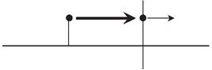
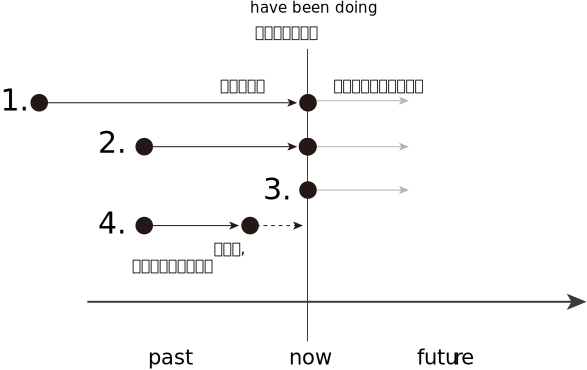
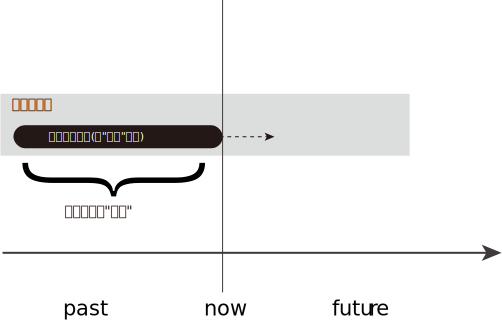
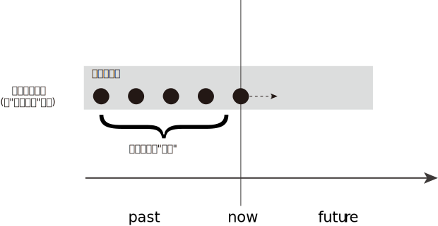
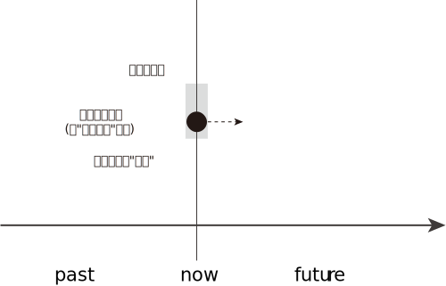
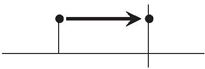
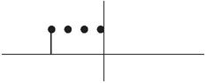
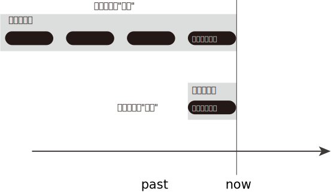
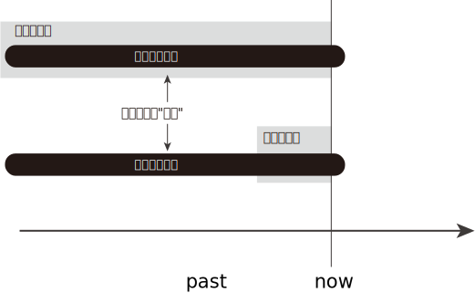
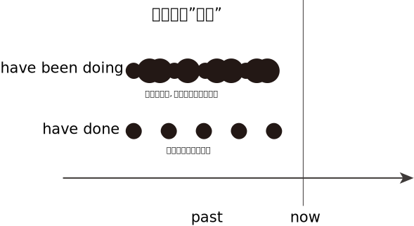

= new 张满胜 完成进行时 : have /has been doing
:toc:

---

== 现在完成进行时 have been doing -> 用来表示: 开始于过去的活动, 持续到了现在，并且还没有结束，还将继续持续下去.

完成进行时态（perfect continuous tense）是由"完成时态"和"进行时态"复合而成:

[cols="1a,1a" options="autowidth"]
|===
|完成时态 have＋-en |进行时态 be＋doing

2+| 所以"完成进行时"可以表示为: +
have-en ＋ be doing ＝ have been doing。
|===

因此"完成进行时"兼备“完成体”和“进行体”这两种时体的意义:

[cols="1a,1a" options="autowidth"]
|===
|完成时态 have＋-en |进行时态 be＋doing

|-> 表示一个动作或状态, 开始于"现在之前", 是从"过去"持续或重复到"现在".
|-> 表示一个动作或状态, 还处于暂时的、不间断的"延续性"状态中.

2+| 综合: +
所以，结合这两者的特点，*我们就用"现在完成进行时"来表达这个意思: 被描述的事件, 开始于现在之前，并且是"有期限地"（不会无限期地）持续下去。* +
即: *开始于过去的活动, 持续到了现在，并且还没有结束 (到目前为止尚未完成 an incomplete activity)，还将继续持续下去。*

|===

完成进行时, 包含三种:

[cols="1a,1a,2a"]
|===
|Header 1 |Header 2 |

|*have* been working
|<- 现在完成进行时
.3+|其实, 这三种"完成进行时态"的本质意义是相同的，区别只是“时（tense）”, 即"动作发生的时间"不同而已。

|*had* been working
|<- 过去完成进行时

|*will have* been working
|<- 将来完成进行时

|===

---

== ---------- ----------

---

== 1.表示"事件还在延续中 (即未完成)"

-> 图中的黑点, 表示"现在"和"过去"两个时刻； +
-> 粗箭头表示: 动作开始于过去, 并一直在持续； +
-> 细箭头表示: 该动作(到目前为止还尚未完成) 还将继续持续下去.

此时, have been doing 常与for＋时间段、since＋时间点、all morning、all day、all week 等表示"一段时间"的时间状语连用，以强调在这一段期间内，这项活动正在持续。

[cols="1a,1a"]
|===
|Header 1 |Header 2

|- 1. I'*ve been studying* English *for over ten years now*, but I still can't speak it well.
|<- have been studying 表示从过去(10年前)就开始学习英语了，一直持续到目前说话的时候，还没完成, 未来还将继续持续下去。

|- 2. I *have been studying too much* and need a change. +
最近我一直学得很辛苦，需要换换脑子了.
.2+|<- 从活动持续时间的长短来看，从第一句到第三句，study的持续时间是越来越短的，比如从第一句的over ten years 到第三句的over an hour。

|- 3. You'*ve been studying* that one page *for over an hour*.

|- 4. A: Hey, you're watching TV again. +
B: I'*ve been studying for the whole morning*. I need to relax now.
|<- study 没有持续到说话的时刻，而是在说话之前就已经结束了。
|===

所以, 同样是延续事件，也可以根据"延续时间长短"的不同，而细分成四种:

1. 长期在延续的事件
2. 近期在延续的事件
3. 在说话时刻, 仍在延续的事件
4. 一个事件在说话时刻之前一直在延续，但到说话时刻已经结束.（a recently finished activity）。虽然已经结束, 但这个事件对现在造成了清晰可见的后果。

---

==== (1) "长期"在延续的事件 -> 等价于 have done 时态

即, have been doing, 可以表示"从过去到现在"的一个相当长的时期内, 在"持续"的一个一般性活动。

它的特点是:

- 说它们是“一般性活动”，是因为这些活动并不具有很强的“正在进行”的动作的意味. 换言之, 这些活动在说话的时刻, 一般并不正在持续。
- *这些活动类似于一个"持续"的"状态"，更具有"状态"的意义，而没有多少"动作"的意义。*
- 所以，have been doing 的这一用法与 have done 的关系更近, 而与 be doing 的关系较远.
- *所以, have been doing 的这一用法, 意思几乎等价于 have done, 两者意义上没有多大差别.*

如下:

[cols="1a,1a"]
|===
|have been doing 现在完成进行时  | have done 现在完成时态

|- have been doing 用来表示的是: 在"相当长的一个时间段内"（比如 for 30 years）"持续"的"一般性活动"(即"状态")。
- 注意: *既然是表示"长期时间段", 则谓语动词也必须是"无限延续动词"*, 而不能是"有限延续动词"(该动词的持续时间短).
|

|- I *have been living 无限延续动词 here* since 3 years ago. +
我从三年前就一直住在这里。
|- = I'*ve learned English* for over ten years now.

|- I *have been teaching* 无限延续动词 in this school for 25 years. +
我在这所学校教书有25年了。
|- = I *have taught* in this school for 25 years.

|- I'*ve been waiting 无限延续动词 for this* for months. +
我等了好几个月了！
|- = I'*ve waited* for this for months.
|===

---

==== ---- 无限延续动词 vs 有限延续动词(不能长期延续)

[cols="1a,1a"]
|===
|无限延续动词(状态意味很强) |有限延续动词(动作意味很强)

|这种动词, 不表达某一具体的动作，它们所表达的意思更近于是"状态的延续". +
如: study，live，work，learn，teach, wait等.

"无限延续动词"在英文中较少。
|这种动词虽然具有一定的延续性，但持续的时间不能太长. 即它们只能"在有限的短时间内延续". +
如:  repair 这样的表示"单一具体动作"的动词.

英文中的大多数动词, 都是"有限延续动词"。
|===

1. 长期时间段 + 无限延续动词 -> 表示事件在"长期延续";
2. 长期时间段 + 有限延续动词 -> 表示事件在"重复";
3. 短期时间段 + 有限延续动词 -> 表示事件在"短期延续";

即:

[options="autowidth"]
|===
|have been doing |长期时间段 |短期时间段

|无限延续动词
|表示事件在"长期延续"
|表示事件在"短期延续"

|有限延续动词
|表示事件在"*重复*"
|表示事件在"短期延续"
|===

---

==== ---- 1. 无论时间段长短 + 无限延续动词(有"状态"意味) -> 都表示事件在"延续"(长期延续或短期延续);

[cols="1a,1a"]
|===
|Header 1 |Header 2

|-  I'*ve been working* (状态意味) in this company *for over five years now*.
|-> work不表现一个"具体的动作"，而是一个具有"状态"意义的动词。

|-  But "someday" never seems to arrive. Now is the time for those little activities you'*ve been saving* (状态意味) for the future. +
对于那些你一直攒着想等将来做的事情，现在就应该去做。
|-> 这里的save不表现一个"具体的动作"，而是一个具有"状态"意义的动词。

|- He *has been working* on the puzzles *for two hours*.  +
他玩这个拼图游戏有两个小时了。 +
- He *has been working* in the same job *for 30 years*.  +
这个工作他做了有30年了。
|-> work是无限延续动词，表示一种"状态". 因此无论时间是长是短, for two hours 还是 for 30 years，都是表示"延续"事件.

|- I'*ve been waiting* for you *for three hours*!  +
我等你有三个小时了！
- I'*ve been waiting* for this *for months*.  +
我等了好几个月了！
|-> wait 是无限延续动词，表示一种"状态". 无论时间长短, 都表示"延续"事件.

|===

---

==== ---- 2. 长期时间段 + 有限延续动词(有"具体动作"意味) -> 表示事件在"重复";

[cols="1a,1a"]
|===
|Header 1 |Header 2

|- He *has been repairing* 有限延续动词 cars *for almost 20 years*.
|-> repair这个动作, 不可能一直不间断地持续了将近20年. 所以这里要把它解释成“重复事件”. 即在将近20年当中，他不断“重复”地修理汽车. 这表明，修车很可能是他的职业。
|===

---

==== ---- 3. 短期时间段 + 有限延续动词(有"具体动作"意味) -> 表示事件在"短期延续";

"有限延续动词" 如果用于 have been doing 时态中, 只有接"较短时间"的状语, 才能表示延续事件("只能短期存在的延续", 即"有限延续性" )。

[cols="1a,1a"]
|===
|Header 1 |Header 2

|- He *has been repairing* 有限延续动词 his car *since 6:00 this morning*.
|-> 是一个“从早上6点到现在”短短几个小时的延续活动。 +
这句话的言外之意是，他现在仍然在修车，也就是说，在说话的时刻，repair的动作依然在进行。
|===

---

==== ---------- ----------

---

==== (2) "近期"在延续的事件 (即在"较短时间内"持续的活动) -> 等价于 be doing 时态

have been doing 既可以表示一个"长期"持续的活动，也可用来表示"最近一段时期内"正在持续的一般性活动.

这里有几点要注意:

- have been doing 表达这种意思时, *重点并不关心"在说话时刻"该事件是否正在进行，而是关心该"在最近一段时期内"该事件是否在持续。*
- have been doing 的这种语义意思, **更接近于 be doing (现在进行时)时态. **因为 be doing 也能表示一个在"近期时间段内"持续的一般性活动.

- have been doing 的这种语义用法, 在大多数情况下是不带有"持续时间状语"的. 当然, 你要带也行（如带 for the past couple days）, 两者都可以表示一个"近期"在"持续"的一般性活动。

- 要注意，所谓“近期”也只是一个相对概念，可能是近几天，也可能是近几个星期，甚至是近几个月。与上一小节讨论的“长期”并没有明确的界限，完全是根据实际生活经验来判断的。

[cols="1a,1a"]
|===
|Header 1 |Header 2

|- Rose and John *have been dating* for a year. Recently, they *have been considering* getting married. +
罗丝和约翰恋爱有一年了。最近他们一直在考虑要结婚。
|-> have been dating 表示"较长时间"的持续活动. +
-> have been considering  表示"近期"在持续的活动. (有 recently 也表明了这一点)

所以, have been doing  既可以表示一个"长期"持续的活动，也可表示"最近一段时期内"正在持续的一般性活动.

|- Jo: You look tired. What *have* you *been doing*? +
Emily: I'*ve been burning* the midnight oil. *been writing* my mid-term essay. +
乔：你看上去很疲惫，最近都在忙什么？ +
艾米丽：我最近一直在开夜车，写我的期中论文。
|-> What have you been doing?  中的 have been doing 表示的是"近期"在持续的一般性活动，而不是表示"说话此刻或刚刚之前"在延续的活动. +
所以其意思是“你最近在忙什么”，而不是“你刚刚一直在忙什么”。

- burn the midnight oil 是英语的成语，意思是“挑灯夜战，开夜车”。
- Been writing my mid-term essay. 是一个省略句，相当于说 I've been writing my mid-term essay.

|- For the past couple days, people *have been avoiding* me and *giving* me these really strange looks. +
最近几天人们总是故意逃避不理我，看到我时表情总是很奇怪。
|-> for the past couple days 这个时间状语, 都明确告诉你了 have been avoiding...giving 是一个近期在持续的活动。

|- I *have been thinking about* changing my job.  +
我最近一直在考虑换个工作。
|

|- I *have been looking forward* to meeting you.  +
久仰大名！
|-> 这里用"现在完成进行时" have been looking 显得相当正式(甚至有点虚伪)(有对陌生人敬而远之感), 而不亲随.

|- Thank you so much for the binoculars. I'*ve been wanting* a pair for ages.
- I *have been wanting* to meet you for long.
|-> 虽然是事件在"近期"(最近一段时期内)延续, 但你也可以把它们看作是“长期"在持续的事件。 即: 所谓的“近期”也是一个相对概念而已.

|===

在口语中, 你想要表达"我一直想要什么/干什么"等, 就使用 have been doing 的 <- 即你"近期"的延续性事件 :

[options="autowidth" cols="1a,1a"]
|===
|你想要表达 | 用 have been doing

|我一直想要什么 +
I *have been wanting* ...
|

|我一直想干什么 +
I *have been wanting* to do sth.
|- I *have been wanting* to meet you for long.  +
我早就想见你了。

|我早就想干什么 +
I *have been meaning* to do sth.
|- I *have been meaning* to talk to you.  +
我一直想找你聊聊。
- I'*ve been meaning* to exchange it for a larger size.  +
我一直想着要去换一件大号的。

|===

---

==== (3) 在"说话时刻"仍在延续着,进行中的事件 (即在"较短时间内"持续的活动) -> 等价于 be doing 时态

have been doing  可以表示一个活动, 它在说话时刻之前一段时间内是在延续的，并且在说话的此刻, 它仍在进行。当然, 也可以"现在"就停止了, 不再继续。

图中的黑点表示"现在"和"过去"两个时刻；黑箭头表示动作一直在持续，该动作到"现在"时刻即告终止.

have been doing 的这种意思, 与 be doing 很接近, 后者也能表示“说话时刻仍在延续的事件”. 两者的区别是 :

[cols="1a,1a"]
|===
|have been doing + "持续的时间"状语 | be doing <- 不能接"持续的时间"状语（durational adverbials）

|- You'*ve certainly been reading* that one page *for a long time now*. +
那一页内容你显然已经看了很长时间了。
|-> read 动作, 从过去开始, 并且持续到了现在说话的时刻

|- It *has been snowing all day*. I wonder when it will stop.  +
雪一直下了一整天了，我不知道它何时会停。
|

|- I'm so sorry I'm late. *Have* you *been waiting* long?  +
对不起我迟到了，你等了很久吗？

-> 开始于过去的wait 持续到说话时刻为止, 就不再继续下去了.
|

|- I'*ve been staring* at this computer screen *for hours* and my eyes hurt.  +
-> have been doing 往往会接上一个"表持续的时间状语".
|- I'*m staring* at this computer *for hours*. × +
-> 这句话是错的, 因为 be doing(现在进行时) 不能接"表持续的时间状语", 即不能加 for hours.

所以只能说成:

-  I'*m staring* at this computer. √
|===

---

==== ---------- ----------

---

==== (4)在说话时刻之前在延续, 现已结束的事件, 但对"当前现在" 有后果影响  -> 等价于 have done 时态

一个事件在说话时刻之前一直在延续，但到说话时刻已经结束.（a recently finished activity）。虽然已经结束, 但这个事件对现在造成了清晰可见的后果。

这种表达法, 有以下几个特征:

[cols="1a,3a"]
|===
|Header 1 |Header 2

|
|- 因为 have been doing 表达出了刚刚在延续的事件(虽然现在已经结束)对现在带来了后果影响. 所以, 也可以反过来: 即, 在日常口语中，*如果你看到某一个现状或后果，就可以用 have been doing 来往前推导出刚刚在持续的、与这个后果有关的相关事件.*

|*have been doing + "持续的时间"状语* => 意思会有歧义 +
(不过默认的解释是"*事件一直持续到现在*")
|-  have been doing 表达这种意思时, 一般不接"持续的时间"状语. 除了这种意思的句子以外: I'*ve been standing* outside in Arctic temperatures *for over an hour* waiting for a bus.  +
如果 *have been doing + "持续的时间"状语 => 则表示的意思就是"事件延续至今了, 而不是现在已经完结了."*

- 不过, have been doing + "持续的时间"状语,  所表达的事件的意思, 也可能带有歧义: 即, 它既可以理解成"一直在持续, 包括现在", 也可以理解成"延续到刚刚才结束, 但对现在有后果影响".

- 但是, 如果没有上下文语境来帮助排除歧义的情况下，默认情况下, *对于 have been doing + "持续的时间"状语, 我们一般会选择理解成"一直在持续, 包括现在".*

| *have been doing 不带 "持续的时间"状语* => 意思会有歧义 +
(不过默认的解释是"*事件延续到刚刚才结束, 但对现在有后果影响*")
|- have been doing 不带"持续的时间状语", 同样会存在歧义: 既可以理解成"延续到刚刚才结束, 但对现在有后果影响", 也可以理解成"一直在持续, 包括现在".

- 如果没有上下文语境来帮助排除歧义的情况下，默认情况下, *对于 have been doing 不带 "持续的时间"状语, 我们一般会选择理解成"事件刚刚在延续(现已结束)".*
|===

总结:

[options="autowidth"]
|===
|现在完成进行时 |表示一个"刚刚结束"的活动, 但对现在有后果影响 |表示一个"延续至今"的活动

|have been doing + "持续的时间"状语
|√
|√ (默认理解)

|have been doing 不带 "持续的时间"状语
|√ (默认理解)
|√
|===

---

==== ---- 从"事件后果", 倒推"其原因事件" -> 用 have been doing, 注意, 这种用法时, 一般不接"持续的时间"状语!

[cols="1a,1a"]
|===
|have been doing + 不接"持续的时间"状语! |

|- A: You look hot. +
B: Yes, I'*ve been running*. +
A：看你很热的样子。 +
B：是的，我刚刚一直在跑步来着。
|-> have been running 表示: 说话人此刻已经不在run了, run在刚刚已经结束了. 但这个延续到刚才才结束的run, 对"现在"造成了清晰可见的后果 (You look hot).

|- Your friend is out of breath. You ask, "*Have* you *been running*?"
|<- 从后果, 反推"原因事件". 你问他：“你刚刚是一直在跑步吧？”

|- Your eyes are red. You'*ve been crying*?  +
看你眼睛红肿的，你刚刚哭过吧？
|<- 从后果, 反推"原因事件"

|- What *have* you *been doing* while I have been away? +
我刚才不在的时候，你们一直在干什么？
|

|- It's only when the tide goes out that you learn who'*s been swimming* naked. +
只有当潮水都已退去，你才能知道是谁刚刚在裸泳。
|

|===

---

==== ---- have been doing + "持续的时间"状语 -> 有歧义, 但默认表示"事件延续至今了"

[cols="1a,1a"]
|===
|have been doing + "持续的时间"状语 =>  事件延续至今|have been doing + 不带"持续的时间"状语 => 延续性的事件, 在刚刚已经结束, 但其对"现在"造成后果影响

|- I'*ve been painting* the door *for half an hour*. +
-> painting 到说话此刻还没结束.
|- Be careful! I'*ve been painting* the door! +
小心，这门我刚刚刷完漆！

-> painting这个延续活动，刚刚才结束。

2+|其实, 对于have been doing + "持续的时间"状语, 到底其意思是“刚刚才结束延续”, 还是"延续至今”，需要结合上下文的具体语境来看。如果没有上下文，那么就可能有歧义，即两种情况都可能存在:

2+|- A: You do look cold. What happened? +
B: I'*ve been standing* outside in Arctic temperatures *for over an hour* waiting for a bus.

这句话其实有两种意思:

- 在这样冷的天气里，我刚才一直站在外面等车, 等了一个多小时(我现在已经结束等待, 上车了)。
- 在这样一个大冷天，我站在外面等车到现在, 都等了一个多小时了（可是车还没来）(语气带有情绪)。

|===

---

==== ---- have been doing + 不带"持续的时间"状语 -> 有歧义, 但默认表示"事件延续到刚刚才结束, 但对现在有后果影响"

-  It'*s been snowing*.

这句话可以有两种意思理解:

1. 下雪的事件至今并未结束.
2. 下雪的事件刚刚才结束, 并且对现在有后果 -- 地上是白的. <- 默认要优先理解成这个

---

==== ---- 过去的时间, 对现在有后果影响 -> have been doing VS have done 两者的区别是什么? => have been doing(强调动作的"持续",伴随有后果); have done (突出强调动作的"后果")

have been doing VS have done 两者的相同点:

- 表示一个事件在说话的时刻, 已经结束；
- 事件对现在, 有清晰可见的后果影响
- 不接"持续性的时间状语"

两者的不同点, 即各自特点是:

[cols="1a,1a"]
|===
|have done : 单一事件  |have been doing : 事件延续到刚刚才结束, 但对现在有后果影响

|- 强调活动的"结果，成果"（emphasis on achievement）
- *谓语是"短暂动词"*，不表示一个延续活动. 所以不能接"持续的时间"状语.
|- 强调活动本身的"持续性"（emphasis on duration）
- *谓语是"延续性动词"*，以表示一个延续活动. 所以可以接"持续的时间"状语.
- 如果接了"持续的时间状语", 句意会变成另一种意思.

|- I'*ve just cleaned* the car. +
我刚把车洗干净了。

-> 强调"活动的结果": 车子现在干净了。 +
-> 这里的clean是用作一个短暂动词，不用来表示延续活动。
|- My hands are dirty. I'*ve been cleaning* the car. +
我的手很脏，我刚刚一直在洗车来着。

-> have been doing 强调活动的"持续性". 然后得出与这个持续的活动相关的后果——手脏了。 +
-> 这里的 clean 是一个延续活动.

|- I'*ve painted* the door green. +
我把门漆成了绿色。
|- Be careful! I'*ve been painting* the door! +
小心！这门我刚刚刷过油漆。

-> have been doing 强调活动的"持续性"——我刚刚一直在给门刷漆，由此的结果是 —— 门上的油漆现在还没有干. 所以你要be careful（小心）。

|===

---

==== ---------- ----------

---

==== 表达"延续事件", 用 have been doing 和 have done 的区别

==== ---- [have been doing + "持续的时间"状语] VS [have done + "持续的时间"状语] <= 两者几乎没有区别

在带有"持续的时间状语"时，这两种时态几乎没有多大区别，都表示"一个开始于过去的动作, 一直延续到现在"。

[cols="1a,1a"]
|===
|have done + 持续的时间 | = have been doing + 持续的时间

|- I *have taught for 25 years*. +
我教书有25年了。
|- = I *have been teaching for 25 years*.

2+|不过也有这样一种观点，认为此时二者的细微区别在于：

|have done 表示: 动作**有可能(而非板上钉钉, 只是有这种可能性而已)会**持续下去。

所以上面的话语, 可能有如下言外之意:

- I *have taught for 25 years*, so now it's time to think about doing something else. +
-> 考虑改行 (所以"继续当老师"这件事, 未必会持续下去)
|"现在完成进行时"会**强烈暗示动作会继续持续下去(概率极高, 几乎板上钉钉)**.

所以上面的话语, 可能有如下言外之意:

-  I *have been teaching for 25 years*, and I can't imagine doing anything else. +
-> 所以"几乎肯定"会继续当老师下去
|===

- It is amazing that the Leaning Tower of Pisa________ *for so long*. +
比萨斜塔至今依然屹立不倒，这真是了不起。 +
+
A．has stood <- 表示比萨斜塔可能刚刚倒掉(因为 have done 所表示的事件的"持续下去性", 可能性并不绝对高)，然后我们"回顾"它的历史时说了这么一句话。 +
B．has been standing <- 表示比萨斜塔现在一定还是“巍然耸立”的(因为 has been doing 强烈暗示动作会"继续"持续下去)，即到现在还依然standing. +
C．stood <- 用一般过去时stood，则表示比萨斜塔现在已经倒掉，已成为历史，这显然不符合事实.

---

==== ---- (1)have been doing + 无"持续的时间"状语 => 表示事件"延续至今"; (2)have done + 无"持续的时间"状语 => 表示事件"在过去已完成", 没有延续至今

[cols="1a,1a"]
|===
|have done + 无"持续的时间"状语 |have been doing + 无"持续的时间"状语

|- 表示事件"在过去已完成", 没有延续至今. （refer to a singular occurrence 单一事件 at an indefinite time in the past）
|- 表示事件"延续至今", 尚未结束.

|-  I *have worked* in this company. +
我在这家公司工作过。

-> 没延续至今, 只是回顾过去的经历
|-  I *have been working* in this company. +
我一直就在这家公司工作。

-> 延续至今

|- He *has slept*. +
他睡过了。
|- He *has been sleeping*. +
他一直在睡觉(现在也未醒)。

|
|-  You look tired. *Have* you *been working* hard? +
你看起来很累，最近工作一直很辛苦吧？(至今也很工作辛苦)

|-  I'*ve cleaned* the house, but I still haven't finished. × +
-> have done 表示动作在过去已完成, 而句子后面又来了句"still haven't finished", 明显造成前后语义矛盾. 所以本句逻辑错误.
|

|===

---

== ---------- ----------

---

== 2.表示: 事件在到目前为止的一段时间内, 重复发生

have been doing 的这种意思, 即表示 : a *repeated* activity, a habitual action in a period of time up to the present.

---

==== 1. have been doing + 短暂动词 + 较长的时间段 -> 表示: "短暂动作"在到目前为止的一段(长)时间内, 重复发生.

像come这样的"瞬间即结束"的动词(短暂动词)，它不能延续，所以如果它用于"较长的时间段"中时, 即: [短暂动词 + have been doing + 较长的时间段], *只能理解为该"短暂动词"在"重复"进行.*

注意: *"短暂动词"用于 have been doing 时态时, 一般不宜接“短的时间"状语。*

比如:

- Mike *has been winning* that race *for two hours*. ×  +
-> 这句话没有什么意义, 因为一个人是不可能在两个小时内, 连续多次赢得某个比赛的胜利的。所以，后面应该接"较长时间"的状语, 才能表示在"一段相对较长的时间内""重复"的动作。

所以, 只能说成:

- Mike *has been winning* that race *for years*.

[cols="1a,1a"]
|===
|have been doing + 短暂动词 + 较长的时间段 |表示: "短暂动作"在到目前为止的一段(长)时间内, 重复发生

|- I *have been coming* 短暂动词 to Beijing *for 14 years*. +
在14年期间，他多次重复来北京.
|<- 而不是说他一直在北京住了14年。

|- I'*ve been coming* to see him *for 10 years*.
|have been 短暂动词ing : 表示一个在10年当中不断重复的活动。10年来，我常常过来看望他。

|- ... *have been falling in love* 短暂动词 *for three years*.
|fall in love 也是一个短暂动词，它的 have been doing 就表示一个不断重复的活动。 +
所以这句话的意思其实就是: 在三年当中，他不断地恋上不同的人，恋事不断，但终无结果.

所以更正常的说法, 应该是:

- They *have been going together for over three years now*. +
-> go together 谈恋爱. 他们恋爱都三年多了。

|- You'*ve been going 短暂动作 with* Nancy *for over three years now*. Why don't you pop her the question? +
你与南希交往已经有三年多了，怎么还不向她求婚呢？
|-> go是一个短暂动词，用在 have been doing 中表示一个在三年当中不断重复的活动. +
-> pop the question 俚语，“求婚”。

|- Koreans *have been marrying* 短暂动作 U. S. soldiers stationed here *since the 1950s*.  +
自20世纪50年代以来，就有韩国人不断嫁给在当地的美国驻军，70年代达到了高峰，每年有四千多人嫁给美国大兵。
|marry，是一个短暂动词. have been marrying 是表示一个不断重复发生的事件，即“不断嫁给”。

如果要表示“我结婚有一年了”，要用“状态表达”说成:

- I'*ve been married* for a year.

而不是 I'*ve married* for a year. ×

|- *In recent years*, railroads *have been combining* 短暂动作 with each other and *merging into* 短暂动作 supersystems, causing heightened concerns about monopoly. +
近些年来，铁路公司相互合并，而成为超大型集团，这引起人们对垄断的日益关注。
|have been combining...merging 同样是表示重复发生的活动。

|- The price *has been going up 短暂动作 recently*. I wonder whether it will remain so. +
最近物价一直看涨，不知是否会一直这样。
|
|===

---

==== 2. have been doing + 有限延续动词 + 较长的时间段 -> 表示动作或事件在“重复”

有些动词, 比瞬间动词come 有更长的延续性, 但"延续的时间长度"依然有限, 即, 它们只能表"单一具体的动作" (所以一般不可能持续太长的时间). 如 : chat, listen, interview, ask, eat等. +

对于这种虽具有"一定"的延续性, 但又不能"长时间延续"的动词，就称之为“有限延续动词”.

所以, “有限持续性”动词, 持续时间就不宜太长 (即能接的时间状语所表示的时间段, 也应该是"有限长度"的).

[options="autowidth"]
|===
|有限延续动词 + 较短时间段 |有限延续动词 + 较长时间段

|表示“延续活动”
|表示“重复活动”

|===

[cols="1a,1a"]
|===
|Header 1 |Header 2

|- We'*ve been writing* 有限延续动词 to each other *for years*. +
我们多年来一直保持通信联系。
|-> 有限延续动词, 用于"长时间段"中, 只能理解成它在不断"重复". 本例即 "定期保持通信联系".

|- I'*ve been calling* 有限延续动词 David *for the past half hour*, but I keep getting a busy signal. +
近半个小时以来，我一直在给大卫打电话，但总是忙音。
|*半个小时是长还是短? 其实对不同的事情来说, "时间长短"的意义是相对的. 对"试图拨通电话"来说, 半个小时绝对是很长的时间了.* +
从后文的 but I keep getting a busy signal 可以得知，"我打电话给大卫"是多次重复的.

|That story is a legend. People *have been telling 有限延续动词 it for hundreds of years*. +
-> 这个故事只是个传说，几百年来人们一直在讲述着.
|

|- You'*ve been saying* 有限延续动词 that *for five years*. I wonder when you're going to put it into practice. +
这话你都说了有五年了，我不知道你何时才能付诸实践。
|

|- His boss doesn't know Frank *has been listening* to him talk on the phone *for the past three years*. +
他老板还不知道他(重复)偷听电话有三年了。
|

|===

---

==== 3. have been doing + 有限延续动词 + 较短的时间段 -> 表示一个“延续活动”

[cols="1a,1a"]
|===
|Header 1 |Header 2

|- I'*ve been writing* 有限延续动词 this letter *for an hour*.+
这封信我写了有一个小时了。
|-> 有限延续动词, 用于"短时间段"中, 才满足它能够"延续"的可能性. 本例即: “我在说话时刻正在做的一项活动”。

|- He *has been listening* to him talk on the phone *for ten minutes now*. +
他老板还不知道他(延续)偷听电话有10分钟了。
|
|===

---

==== 4. have been doing + 无限延续动词(表"状态")  -> 无论时间段长度, 都表示 : 活动在"延续"

所谓"无限延续动词", 它们并不表示某一具体的动作，而更像表达一种"状态". 因此, 所接的时间状语不论表达的时间段是长是短，都表示: 事件在"延续"中.

无限延续动词(表"状态")有: work, learn, wait

注意: 这里事件的“长期延续性”并不是 have been doing 所赋予的(事实上 have been doing只能表示“有限延续性”这个核心意义)，而是"无限延续动词"本身所具有的特点。因此，这里即使不用 have been doing 而用 have done，依然是表示一个"长期在延续"的事件。

[cols="1a,1a"]
|===
|have been doing + 无限延续动词 + 较长时间段 |have been doing + 无限延续动词 + 较短时间段

|表“延续"
|表“延续"

|- He *has been working* in the same job *for 30 years*. +
这个工作他干了有30年了。
|- He *has been working* on the puzzles *for two hours*. +
他玩这个拼图游戏有两个小时了。

|-  I'*ve been waiting* for this *for months*. +
我等了好几个月了！
|- I'*ve been waiting* for you *for three hours*! +
我已经等了你三个小时了！
|===

---

==== 总结表

[options="autowidth"]
|===
|have been doing |较短时间段 |较长时间段|

|瞬间动词(短暂动词)
|
|表动作在"重复"
|

|有限延续动词 +
chat, listen, interview, ask, eat
|表动作在"延续"
|表动作在"重复"
|

|无限延续动词
|表事件在"延续"
|表事件在"延续"
|
|===

---

==== 表示"事件在重复发生", have been doing 和 have done 都能使用, 那两者有何区别? -> have been doing 表达的"重复"是作为一个整体的,不可细分. have done 表达的"重复", 可以细分成具体次数.

[cols="1a,1a"]
|===
|have been doing 表"活动在重复"|have done 表"活动在重复"

|*人们能感觉到"活动在重复", 但不能明确把它细分成具体的单个组成部分. 即: 不能分割它. 它只能作为一个整体存在.* -> 这也符合 doing 进行时的特点("持续性").

have been doing 所表示的重复动作, 是不能被分割开来的，而只能看作是一个不间断的过程，这是"doing 进行体"赋予它的特点.

|- *可以被细分, 即能说出"具体的重复次数".* +
have done 常常表示"间断的"重复活动，可以标明具体几次或几件事，这也是"完成时"强调"活动结果"的语意体现。

- 我们在下列两种情况下, 就会把动作分割开:

1. 谈到在一段时间内, 一共做了多少件事情（比如"喝了五杯咖啡"）； +
2. 说明某件事曾经发生的次数（比如"去过三次洛杉矶"）。

- 注意: 如果动词是"短暂动词", 它用于 "have done + 持续的时间段(往往是较长时间段)" 中时, 必须加上具体的重复次数! +
即, 结构是:
*短暂动词 + have done + 具体重复次数 + 持续的时间段*

|- I'*ve been calling* David for the past half hour, but I keep getting a busy signal. +
近半个小时以来，我一直在给大卫打电话，但总是忙音。

-> 句中并没有明确说出打电话的具体次数, 所以要用 have been doing 来表达. +
反之, 如果说出具体的次数，则必须改用 have done 来表达.
|- I'*ve called* David *four times* for the past half hour, but I keep getting a busy signal. +
近半个小时以来，我给大卫打了四次电话，但每次都是忙音。

-> 明确说出了重复的次数(four times), 所以只能用 have done 来表达.

|-  I'*ve been writing* letters this morning. +
今天上午到目前为止我一直在写信。
|-  I'*ve written three letters* this morning. +
今天上午到目前为止我写了三封信。

|- I *have been drinking five cups* of coffee this afternoon.  × +
-> 错误! 既然说出了具体的重复次数, 只能使用 have done, 而不能使用 have been doing.
|

|
|- He *has gone* to Los Angeles *three times* this year.

-> 也可说成 He *has been* to Los Angeles *three times* this year.

2+|- Larry King *has been interviewing* important people for more than 40 years. King *has been asking* famous people questions throughout his career and has done more than 40,000 interviews. He *has talked* with every American president since Richard Nixon. +
拉里·金从业40多年来，采访过众多名人，向他们提出各种问题，累积采访达四万多人次。自从尼克松总统以来，历届美国总统都接受过他的采访。

-> has been interviewing 和 has been asking , 显示是表达 "没有说明具体的次数的 重复活动". +
-> 而接下来, 由于说出了具体的"40,000次采访"以及采访过"每一位"美国总统（every American president），就要使用 have done 来表达. 即, 动作已经被分割开，强调一个结果或成就.

|
|- I'*ve come* 短暂动词 to see him *for 10 years*. ×

-> 错误. 短暂动词 + have done + 时间段, 必须加上具体的重复次数. 否则, 就改成用 have been doing 时态.

改成:

- I'*ve been coming* 短暂动词 to see him *for 10 years*. √

|===

---

==== 表示"事件在重复发生", have been doing 和 does(一般现在时) 都能使用, 那两者有何区别? -> have been doing 表达的"重复",时间段为"到目前为止". have done 表达的"重复", 是指日常习惯, 没有时间段的概念.

[cols="1a,1a"]
|===
|have been doing -> 表"事件在重复" |does(一般现在时) -> 表"事件在重复"

| - 时间段是"到目前为止".
- 既然暗含了"到目前为止", 那么, 用 have been doing 就可能带有"言外之意", 即: 以后的情况可能会变化.
|- 只表示一种泛泛的日常习惯, 而没有"时间段"的概念.

|- I'*ve been running* a mile every afternoon. +
到目前为止，我每天下午都跑一英里。(可能含有"言外之意", 即之后可能会做改变)

-> 句子里虽然没有明说, 但 have been doing 暗含有"到目前为止"的时间段结束点. +
即: 它的完整的语境比如 I'*ve been running* a mile every afternoon *for the past month*, but I still haven't been able to lose more than a pound or two.
|- I *run* a mile *every afternoon*. +
我每天下午都会跑一英里

|
|- I *run a mile* every afternoon *for the past month*. × +
-> 错误! does 表示日常习惯, 没有时间段的概念.

|有时，若上下文的语境中已暗示有一个"时间段"的概念，即使没有明确说出这个时间段，也要用 have been doing 来表示在这一未明示的"时间段内"(从"过去"到"目前为止"的一个时间段内), 动作在"重复"。

- I *have been running* a mile *every afternoon*, but I think I'll run two miles later. +
他是强调“到目前为止的一个时间段内每天跑一英里”，所以才有下文说“不过我想以后改为两英里”。
|

|- Jim *has been phoning* Jenny every night *for the last week*. +
近一个星期来，吉姆每天晚上都要给珍妮打电话。
|- Jim *phones* Jenny *every night*. +
吉姆每天晚上都要给珍妮打电话。

-> 只是单纯谈日常习惯

|===

---

== ---------- ----------

---

== 3.单一事件 <- have been doing 没有这样的含义. 不存在

have done 具有“单一事件”的用法，而 have been doing 则没有这样的用法。 +
不过，还是可以找到一个大概与“单一事件”对应的 have been doing 的用法，这就是“刚刚在延续的事件(现已结束, 但对现在有后果影响)”.

== ---------- ----------

---

== have been done 与 have done 的语意对比总结

这两个时态在用法上的种种区别, 其实都源于二者的这一根本区别：

[cols="1a,1a"]
|===
|have been doing |have done

|- 重在“进行（ongoing）”，即"*未完成*"（incomplete）
- 强调动作**"持续"的过程**（emphasis on duration）
|- 重在“完成”，即"*已完成*"（completed）
- 强调动作的"*结果或成就"这个影响*（emphasis on achievement）

|未完成

- I *have been reading* the book you lent me but I haven't finished it yet. +
你借给我的那本书我一直在看，现在还没有看完。
- Your mother is still in the kitchen. She *has been cooking* all morning.  +
-> cook 至今未完成
|已完成

- I *have read* the book you lent me, so you can have it back now. +
你借我的那本书我已经看完了
- I *have cooked* a lovely meal, which I'll be serving in a couple of minutes. +
我做完了一顿可口的饭，再过两分钟就可以上桌了。

|have been doing 强调"延续的过程"

- How long *have* you *been learning* English?  +
你学习英语有多久了？
- The phone *has been ringing* for almost a minute. Why doesn't someone answer it? +
电话铃声响了有一分钟了，怎么就没有人去接呢？

|have done 强调"结果或成果"

- How many words *have* you *learned*? +
你已经学会了多少英语单词？
- The phone *has rung four times* this morning, and each time it has been for Clint. +
今天上午电话铃响了四次，而且每次都是打给克林特的。

2+|- Oh, I *have been sitting* in the same position too long. My legs *have fallen* asleep. +
噢，我一个姿势坐得太久了，两条腿都麻木了。

-> have been sitting : 有doing, 强调"活动的持续时间", 即长时间持续地sit. +
-> have fallen asleep : 只有done, 强调"活动的成果怎样", 即腿麻了.

|have been doing 对动词的"持续性"比较敏感. 既然强调"持续性"，就是作为一个不可分割的整体了, 所以不能讲具体的"重复次数"

- I'*ve been traveling*.  +
最近我一直在出差。
-  I'*ve been ironing* my shirts this morning. +
我今天上午一直在熨烫我的衬衫。
|have done 强调事件的成果,后果，可以说明具体的"重复次数" +

- I'*ve done a lot of* travel.  +
最近我出了很多差。
- I'*ve ironed five shirts* this morning. +
我今天上午熨烫了五件衬衫。

|往往带有强烈的感情色彩，较为口语化。

- Why are you so late? I'*ve been waiting* here for more than an hour! +
-> 表达出强烈感情色彩, 本例中显得较为生气。

|只是说明一个事实，一种结果，较为平铺直叙，缺乏明显的感情色彩。

- A: What *have* you *done* with my knife? +
B: I put it back in your drawer. +
A: (taking it out) But what *have* you *been doing* with it? The blade's all twisted! *Have* you *been using* it to open tins? +
A：你把我的刀子弄到哪里去了？ +
B：我把它放回你的抽屉里了。 +
A：（拿出小刀）可你用这刀子干什么来着？刀刃都卷了！你用它开罐头了吧？

-> 先用 have done，不带情感色彩地询问对方是如何处理小刀的。 +
-> 当看到小刀被弄坏了之后，用 have been doing, 来表明自己的强烈情感 -- 气愤。 +
-> have been using，同样表示自己生气了。
|===

[cols="1a,3a,3a"]
|===
|Header 1 |have been doing |have done

.2+|延续事件
|have been doing + "持续的时间"状语 : +
表示一个开始于过去的动作, 一直延续到现在

|have done + "持续的时间"状语 : +
表示一个开始于过去的动作, 一直延续到现在

|have been doing (无持续时间状语) : +
表示一个开始于过去的动作, 一直延续到现在

|have done (无持续时间状语): +
表示一个"在过去已经完成了"的事件（即表示“单一事件”中的"回顾过去经历"）

.2+|重复事件
|在表示"重复活动"时，不能被分割开来，即不能说出具体的次数。这是由 have been doing 的“有限延续性”这一核心意义决定的——既然是“延续(doing)”的，那么当然就不能把某个动作断开来数具体的次数。

- I *have been receiving letters* from my readers over the past few years.  +
近几年来我不断地收到读者来信。
|往往要说出具体的次数

- I *have received 100 letters* from my readers over the past few years.  +
具近几年来我收到了100封读者来信。

|have been 短暂动词doing : +
表示“重复事件”。

- He *has been coming* to Beijing *for 10 years*. 10年来他多次来北京。
|have 短暂动词done : +
表示“单一事件”。

- He *has come* to Beijing. 他已经到了北京。

|单一事件
|无此用法. +
但也有一个意思大致相近的这个用法: have been doing 表示 “刚刚在延续的事件, 现已结束, 并对现在有后果影响”.

用法 : +
*have been 延续性动词doing* <- 表示一个延续活动

- He *has been running延续性动词*. 他刚刚一直在跑步。

|have done 的"单一事件"用法, 和 have been doing的"刚刚在延续的事件"的用法, 两者有三个共同点：

1. 二者都表示这一个事件, 在说话的时刻已经结束；
2. 二者都伴随有"现在"清晰可见的后果；
3. 二者都不接"持续性的时间"状语。

用法 : +
*have 短暂动词done* <- 不表示一个延续活动. 所以也不能接"持续的时间"状语.

- He *has just arrived短暂动词*. 他刚刚到。

|===

---

