= new 张满胜 现在完成时 : have done
:toc:

---

== 完成时: 表"回顾" ->  即,有"两个"时间点存在, 从后一个时间点,回顾前一个时间点的事.

完成时态的本质意义 : 用来表“回顾"（retrospect）, 从后一个时间点, "回顾"前一个时间点. 因此, 完成时态必定涉及前后两个时间。

[cols="1a,3a"]
|===
|Header 1 |Header 2

|现在 (回顾)-> 过去
|即: 现在完成时（present perfect tense） <- 在英语中更常见

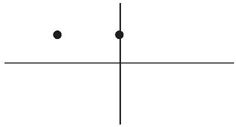

- In all the work *I have done* as president, every decision *I have made*, every executive action *I have taken*, ... +
<- 克林顿用"现在完成时"来"回顾"他作为总统的经历. 注意: 此时他还没下台. 所以他的"总统"身份是贯穿到现在时间点的.

如果克林顿现在(已下台)再说这番话, 就要用“一般过去时态”了:

- In all the work *I did* as president, every decision *I made*, every executive action *I took*,...

|过去 (回顾)-> 更远的过去
|即: 过去完成时（past perfect tense）

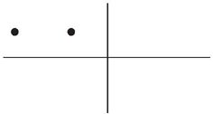

|未来 (回顾)-> 之前的事
|即: 将来完成时（future perfect tense）

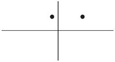
|===

---

== 一个事件, 如何贯穿前后两个时间点? -> 三种方式: 1. 事件一直在延续; 2. 事件一直在断断续续重复; 3. 前一个时间点事件的结果, 影响到后一个时间点

[cols="2a,3a"]
|===
|一个事件 |Header 2

|从A时间点, “延续（continue）”到B时间点
|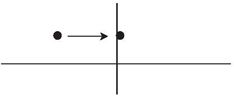

- I'*ve reiterated* support for the "One China" policy. It'*s been* my government's policy for a long period of time, and *I haven't changed it*. +
<- 用"现在完成时", 才能表示这个事件(美国政府支持一个中国)一直延续(贯穿)到现在时刻, 不曾改变.

如果小布什用了"一般过去时态", 就表示现在美国政府不再坚持这个政策了: +
-> The "One China" policy *was* my government's policy for a long period of time.

|从A时间点, “重复（repeat）”到B时间点
|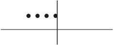

|事件虽然在A时间点已经结束，但它的影响“延续”到B时间点
|image:../00 英语语法常识/img_engGram/张满胜eng 24-3.jpg[]

这个"单一事件"可以看作是"重复事件"的特例——事件只发生了一次，而没有多次重复。

|===

---

==== ---------- ----------

---

==== 1. 动作或事件, 从A时 延续到-> B时 -> 并可能继续延续到未来.  => (1). 谓语必须是"延续性动词"(而非"短暂动词"); (2). 句子要带"延续性时间状语"(since..., for+时间段, 等)

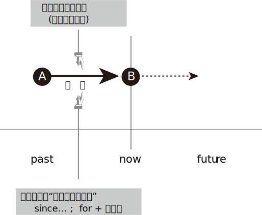

注意以下几点:

1. 上图中两个黑点,表示"现在"和"过去"两个时间；实箭头表示动作在"延续"；虚箭头表示动作"可能持续到将来"。

2. 为了表示事件是"延续性"的, *谓语也要用能够表示"延续性含义"的动词 (而不能用"短暂动词").*

3. 为了表达出"事件延续至今", 因此**句子要带上“延续性时间状语”（durational adverbials）连用**(如, since＋时间点或从句; for＋时间段, 等等), 以说明某个动作或状态持续到现在有多久了。 +
反过来说, *完成时中, 如果没有带"延续性的时间状语", 就表示"这个动作在过去已经完成，而没有延续到现在".*

---

==== ---- a. 谓语要用"延续性动词"(而非"短暂动词")

[cols="1a,1a"]
|===
|Header 1 |Header 2

|- All of my life *I have lived(延续性动词) by a code* /and the code is simple: ...
|特洛伊的大王子郝克托尔（Hector）用了"完成时态"，表示从"过去"到"现在"自己一直所坚持的人生价值理念。

|- *I have fallen(短暂动词) in love* for eight years. ×
- *I have married*(短暂动词) for over a year. ×
|这里的fall和marry都是短暂动词，无法与延续性的时间状语（如 for eight years）连用。即: 两者存在冲突, 无法共存.

既然"短暂动词"和"延续性时间状语"有冲突, 无法共存, 那就去掉其中一个, 句子就正确了:

- I have fallen(短暂动词) in love. √

|- I *have been married(a.)* for over a year. I am happily married.
|"现在完成时态"表示“延续”思维，即从过去一直延续到现在的“已婚”的状态。

*注意: marry都是短暂动词，无法与延续性的时间状语连用。所以，这里的 married 其实是形容词. 否则这句话就是语法错误了.*
|===

---

==== ---- b. 句子要带"延续性时间状语"(since..., for+时间段, 等)

“延续性时间状语”（durational adverbials）包括:

[cols="2a,3a"]
|===
|Header 1 |Header 2

|since＋时间点或从句
|*Since time began*, man *has lived in fear of fire*. 自古以来，人们就害怕发生火灾。

|for＋时间段
|Great changes *have taken place* in Beijing *for the past few years*. 近几年来，北京发生了巨大的变化。

|“到目前为止”，“迄今为止” +
这样的时间短语有：until now, up until now, up to now, up till now 和 so far 等。
|We *have [up until now] failed* to take(v.) any action to decide on a common language that would further communication between nations.
迄今为止，我们尚未采取任何措施来确定一种国际通用语言，以促进各国之间的交流。

|“在最近几个／年／月以来” +
这样的时间短语有：in the past few years, over the past few years, during the last three months, for the last few centuries, through centuries 和 throughout history 等。
|*Throughout history* man *has had to accept the fact that*... 自古以来，人类就不得不接受这样的事实：...

|===

---

==== ---- c. 完成时中, 想表达"事件延续到现在", 就要带上"延续性的时间状语".

比较:

|===
|Header 1 |Header 2

|*I have lived in China* for 3 years.
|<- 表示"我住"的状态贯穿到现在时刻, 即"我还在中国居住着"

|*I lived in China* for 3 years.
|<- 只是说“我”曾经在中国生活过三年，而现在已经不住在中国了。这里三年的起止时间，何时开始，何时离开中国，我们无从知晓。
|===

---

==== 完成时中, 如果没有带"延续性的时间状语", 就表示"这个动作在过去已经完成，而没有延续到现在".

比较:

[cols="1a,1a"]
|===
|带 "延续性的时间状语" for ... years  +
 -> 表示动作**延续到现在** |没带 "延续性的时间状语"  +
 -> 表示动作**在过去已完成, 没有延续到现在**

|- John has lived in Paris *for ten years*.  +
-> 表示John现在还在巴黎生活
|- John has lived in Paris.  +
-> 没带延续性的时间状语, 就表示"他已不住在巴黎了. 他曾经在巴黎生活过."

注意 : 只有在特殊的上下文语境中，John has lived in Paris. 这句话才有可能当“延续”讲。

|
|- *You've been in love*, of course. If not, you've got it to come. +
-> have been in love后面没有接"延续性的时间状语"，所以这句的意思是“你曾经恋爱过吧”，而不是“你一直恋爱到现在”。

|- I have been married *for a year*. +
-> 结婚的状态"延续"到了现在. 即我结婚已经有一年了。
|- I have been married. +
-> 动作状态没有延续到现在. 即: 我曾经结过婚.  +
言外之意是：“我”现在要么离婚了，要么丧偶了，总之是单身（single）。

注意: 说这种话是中国学生常犯的一个错误。你想表达“我已经结婚了”，却说成 I have been married. 而没有带 for..., 则老外会理解成"我结过婚，后来离婚了。"

|- His father *has been dead* for three years. √
|- His father *has been dead*. × +
-> 没带"延续性时间状语", 就表示动作(die)没延续到现在. 这句话的意思就变成: 他爸爸曾经死过。(后来又复活了)

这句话是有问题的! 所以，对于像“死亡”这样天然不具有重复性的事件，就不能用"现在完成时".

---

那么“他爸爸已死”英文怎么说？

-  只单纯陈述"已经过世了"这一事实 : His father *is dead(a.)*.  +
- 表达"他爸爸之死"对他现在造成了影响 : His father *has died*.

|
|- I have been old. × +
-> “我曾经老过”，言外之意是我现在又年轻了。

所以你只能说, 自己曾经年轻过 : I have been young. (young 没有延续到现在, 所以我现在老了)

|===

---

==== ---- d. “for＋一段时间”可用在"现在完成时"中(表事件延续到现在), 也能用在"一般过去时"中(表事件发生在历史上的一段时间)

[cols="1a,1a"]
|===
|现在完成时 |一般过去时

|- *I have lived in China* for 3 years. +
-> 表示"我住"的状态贯穿到现在时刻, 即"我当前还在中国住着".
|- *I lived in China* for 3 years. +
-> 只是说我"过去曾经"在中国生活过三年(具体起止时间未知)，现在已经不住在中国了。

|===

---

==== ---------- ----------

---

====  2. 从A时 重复到-> B时

所谓“重复事件”，就是站在"现在"的角度, 回顾"到目前为止"的一个时间段内（a time period up to now），某一活动或事件重复发生了多次。

image:../00 英语语法常识/img_engGram/张满胜eng 26.jpg[]

其实，把一个"延续性"事件（continuous activity）"断断续续化, 就变成了"重复性"事件（repeated activity）. 所以两者只是同一本体的不同表象而已.

所以, 有时我们不容易对二者(是"延续"? 还是"重复"?)进行严格的区分。那就不必强求区分. 直接用完成时即可.

[cols="1a,1a"]
|===
|Header 1 |Header 2

|- In all the work *I have done* 重复 as president, every decision *I have made* 重复, every executive action *I have taken* 重复, ...
|克林顿表示在他的八年总统任职期间，他“重复不断”地在 have done, have made decisions, have taken action, have proposed and signed bills。 +
克林顿不可能一直毫不间断地（continuously）在“签署法案”，这一签就持续了八年，而是表示在八年的总统任职期间，他“多次重复”签署各种不同的法案。

|- Tom Cruise *has been* 延续 Hollywood's leading man *for the last over 20 years*. ...  He moved to New York and appeared in a few teen movies before starring in his first big hit, Top Gun in 1986. Since then *he has made* 重复 hit after hit movies.
|这段话里有两个现在完成时态：has been和has made :  +
-> has been表示一个延续的状态, 即过去二十多年来，汤姆·克鲁斯一直是好莱坞的一线男演员。 +
-> has made 表示一个"重复"意义, 即阿汤哥一次又一次地好戏不断.

*可见，"完成时态"的这两种思维表达, 经常同时出现。*

|- I'*ve been* 延续 in Canada *for six months*. I'*ve met* 重复 many new friends.
|-> have been 表"*延续*"意味. +
-> met 表"*重复*"

我来加拿大已经六个月了，我认识了很多新朋友。
|===

注意以下几点:

1. 既然你用"完成时态"来表示"重复性"事件, 那你的说话语句中, 往往就应带有表示"重复"意味的词语（如复数-s）.
2. "重复性"事件可以在话语中不"明着"出现, 而是隐含在语境中.

3. 既然事件能"重复"到未来, 你说话时, 句子里就不能带上"确定的过去时间状语"（如yesterday和last night）! 因为过去时间状语表明事件在"过去"已经完成, 就不存在延续或重复到"将来"的可能了.

---

==== ---- a. 话语中, 往往要带有表示"重复"意味的词语（如复数-s）

[cols="1a,1a"]
|===
|Header 1 |Header 2

|- *I have had 重复 so many teachers* in my life. ... The teachers that *I have valued and enjoyed* 重复 most of all, though, *have been* 重复 the teachers who taught me about love.
|-> 作者用众多的"现在完成时态", 表示 “*回顾*”自己曾经遇到过的很多可以作为自己老师的人(即"重复性事件" repeated events). +
-> “*多次遇到*”, 可从so many 以及名词复数teachers看出来。

|比如上例中的：

- I have had *teachers* in school.
- ...*every decision* I have made, *every executive* action I have taken, *every bill* I have proposed and signed,...
- Since then he has made *hit after hit* movies.
- I've met *many* new friends.
- You've changed your mind *a dozen times* in a few minutes!

|so many、名词复数-s（如teachers, movies, friends）、every、hit after hit、many 以及表示次数的 a dozen times 等“语言标示”, 都表示"多次重复"的事件或活动.
|===

---

==== ---- b. 表示是"重复性"事件的意思, 可以隐含在语境中, 而不明说

有时，句中并没出现上述这样明确表示重复活动的“语言标示”，但重复性思维, 隐含在说话的语境中。

[cols="1a,2a"]
|===
|Header 1 |Header 2

|- "For us this *has been* the most perfect way to remember her, and this is how she *would want* to be remembered."
|这是威廉王子, 在纪念其母亲戴安娜的音乐会上说的。为什么他不说is, 而使用完成时态 has been?

其背境是: 自戴安娜去世10年来，英国举办过各种纪念活动。现在，威廉王子显然**是在“回顾”过去10年的各种重复性活动**，说这次音乐会“是迄今为止的纪念她的最佳方式”. 所以说成 For us this has been..., 即暗示未来还会继续有其他活动.

如果他用"一般现在时态"说成 For us this *is* the most perfect way to remember her,... 那么**根据"一般现在时态"的意味特征 ——表示从过去,到现在,直至将来的一个永恒的状态，则意味着这次音乐会作为纪念戴安娜的方式是“前无古人，后无来者”的，是永远无法被超越的了。**

*所以, 如果你想表达的事件, 是具有“可重复性”的, 那就要使用"现在完成时态", 否则就要用"一般过去时态".*

---

- ...and this is how she *would want* to be remembered.

为什么要加would？因为这里用的是"虚拟语气"。戴安娜已死, 她无法在演唱会现场“希望”了，所以只能用虚拟的条件——如果她现在还活着的话（if she were alive），她会希望（she would want...）。 +
即: 这是一个对现在情况的虚拟，表示与现在事实相反的情况，此时"主句的谓语"要用would do（"从句谓语"用过去时，be动词要用were）.

|===

可见, 英语的特点，借用时态（如has been）可以潜含丰富的“言外之意”. 很多人翻译时常犯的错误,就是会“丢失”英语原文所想传达的“言外之意”. +
*很多中国人在读英语时，注意力主要集中在实词上 (如动词、名词和形容词)，而很少关注动词的时态变化、情态动词和介词的微妙含义, 以及连词的使用，殊不知，后者才是英文思维表达规律的附着载体。*

---

==== ---- c. 没必要对"延续"还是"重复"进行严格区分

[cols="1a,1a"]
|===
|Header 1 |Header 2

|- For more than eighty years, scientists *have argued over* whether life exists on the planet Mars.
|-> 这里的 have argued, 既可以理解成"争论一直在持续"(持续),  +
-> 也可以理解成"争论不断被挑起"(重复出现).

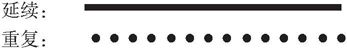

|- I have lived in Beijing for 10 years.
|-> 这句话既可以表示“我”一直生活在北京，一刻也没有离开过； +
-> 也可以表示在北京断断续续地生活了10年，中间也离开过北京。
|===

---

==== ---- d. 判断用"现在完成时态"还是用"一般过去时态", 就看事件是否具有“可重复性”（Principle of Repeatability） -> (1)事件是"将来可重复的", 要用"现在完成时态"; (2)事件是"将来不可重复的", 要用"一般过去时态"

[cols="1a,1a"]
|===
|事件是"将来也可重复的" -> 要用"现在完成时态"|事件是"将来不可重复的" -> 要用"一般过去时态"

|- *I have called him* three times this morning. +
-> 即动作(call) 重复到了现在(this morning). 并暗示还可能继续重复到未来(继续打第四次、第五次电话等)

我今天上午到目前为止, 已经给他打过三次电话了。

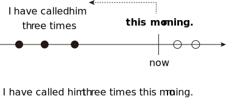

|- *I called him* three times this morning. +
-> *用了"一般过去时态"，则表明事情在过去已完结, 不会在重复到未来. 该事件与现在也没有什么联系了.* 即: 我“今天上午”给他打电话的次数仅为三次，没有继续重复的可能性.

我今天上午给他打了三次电话。

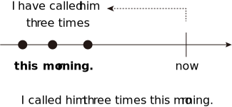

|- I *haven't seen* him *this morning*.  +
-> 用了完成时, 表示: 1. 事件可能重复到未来; 2. 事件的后果对现在有影响.

今天上午到现在, 我还一直没有见到他。(未来可能会见到他)

|- I *didn't see* him *this morning*.  +
-> 用了"一般过去时"，表示 : 1. 事情已经结束, 不具有未来"重复"性. 2. 这件"过去"的事情对"现在"没有什么联系和影响.

我今天上午没有见到他。

|- How many people *have entered* for the race? +
这里用"完成时态", 表达出以下几个意味: +
-> 是"重复性"的活动(报名) +
-> 事件能延伸到"将来" (将来可能继续有人"报名") +
-> 既然将来也可以继续报名, 就说明这个比赛还没有开始，是一个将来才会开始的活动.

到目前为止，有多少人报名参加这个(还没开始的)比赛？

|- How many people *entered* for the race? +
这里用"一般过去时态"，表达出: +
-> 事件(比赛)已经在过去结束, 对现在没有影响. +
-> 自然也不存在重复到将来的可能性.

有多少人报名参加了那次(已经结束的)比赛？

|- Many athletes *have entered* for the Olympic Games this year. +
-> 用"现在完成时态", 表明“报名”动作会持续到"将来". 即, 奥运会还没正式开始.

很多运动员报名参加了今年的奥运会。
|

|- *Have* you *visited* the new exhibit? +
-> 即使是一个"单一"的事件,而不是一个"重复"活动，如果使用了"现在完成时态"，同样表示"该事件"与"将来时间"有关系。 +
用"现在完成时态", 表示事情(展览会)可以持续到将来. 即这个 exhibit 还没有结束.

这次(还在举办中的)新的展览会你去参观了吗？

|- *Did* you *visit* the new exhibit? +
-> 表明这个展览会已经撤展结束了，已是一个过去的事件。

|- *Have* you ever *fallen off* a horse? +
-> 用了"现在完成时态"，意味着将来可能会继续"骑马"，因此fall off a horse这个事件可能会重复发生。

到目前为止，你骑马从马背上摔下来过吗？

|- *Did* you ever *fall off* a horse? +
-> 用了"一般过去时态"，意味着“骑马”这项活动对当事人来说已经在过去结束了, 不会再"重复持续"到"将来"，说话人不再骑马了.

你以前骑马的时候，从马背上摔下来过吗？

|- I *have been* absent twice *this semester*. +
-> 用"现在完成时", 表明“缺课（absent）”这件事, "未来"可能还会继续"重复"发生.

这学期到目前为止, 我逃过两次课。

|- I *was* absent four times *last semester*. +
-> 过去时间状语 last semester 表明“缺课（absent）”这个事件已经在过去结束，不存在重复到未来的情况.

我上学期逃课四次。

|- I *have gotten up* at five o'clock *in the morning*. +
-> in the morning（在早晨）没有明确告诉我们时间(morning)是在哪一天, 可以是任何一天的早晨, 不一定是"今天"的早晨. 所以, at five o'clock in the morning 并不是指一个具体的过去时间. +
所以, 这就使得 get up 具有了“可重复性（repeatable）的可能.

我曾经在早晨五点钟起过床. (并且"未来"还可能"继续"这样早起床)

|- I *have gotten up* at five o'clock *this morning*. × +
-> 这句是错误的. 因为 this morning 已经明确告诉我们, 事件是"今天早晨"发生的, 所以是"过去"的时间 事件已经完成, 不会延续到未来. 所以不能用"现在完成时".

|- *In this city*, I *have had* two jobs. +
-> 有时，"地点状语"能表达出事件所发生的时间. 因为一件事情必有其发生的"时空合一". +
->  in this city 表明出我"现在"人就在这个城市，所以 have job 具有未来可重复性, 用了"现在完成时态".

在这个城市，到目前为止, 我做过两份不同的工作。

|- *In my hometown*, I *had* five jobs. +
-> 地点状语 in my hometown , 表明出“我”现在人不在老家，即 my hometown这个地点所发生的事情(have five jobs), 是"过去"发生的，所以该句要用"一般过去时态".

我在老家的时候，曾做过五份不同的工作。

|- Julia Roberts *has starred* in many American movies. +
-> 还活着的人, 其事情用"现在完成时态", 因为还活着的人做的事情, 是具有"未来可重复性"可能的.

茱莉亚·罗伯茨(还活着)出演过很多美国电影。

|- Marilyn Monroe *starred* in many movies. She died in 1962. +
-> *一般来说，谈到"已死之人"的相关的情况时，往往都是无法持续和重复的，即不具有"将来"可重复性，所以，涉及"已死之人"的句子通常要用"一般过去时态", 而不能用"现在完成时态"。*

玛丽莲·梦露于1962年去世，她生前出演过多部电影。

---

活人的事如果使用"一般过去时", 只表示两种情况:

1. 等她去世之后这么说.
2. 她明确宣布退出影坛了。

|===

---

==== ---- x. (最高级＋名词)＋(that从句＋现在完成时谓语) <- 回顾"以往的重复经历", 并与"现在当前"的事情进行比较. 整句话的意思就是: "现在这个, 是我经历过的最...的一次."

- I don't mean to offend you, madam. But this is the *ugliest* baby I'*ve ever seen* in my life. +
我无意冒犯您，夫人，但这是我平生所见到过的最丑的婴儿。

*英语中, 常常把"现在完成时态"用于这样的结构中*：
....
(最高级＋名词)＋(that从句＋现在完成时谓语)
....

也就是说，*在"形容词最高级"修饰的名词后面, 若接有一个that从句，此时从句的谓语, 要用"现在完成时态"。* +
*这一用法, 其实就是"完成时"用法意思中的: "回顾"自己以前类似的经历, 某事件"重复"发生过. 并把这些重复发生的某事, 与"现在"的事件进行比较.*

上面那个例句中, 那位男子说“这孩子是我平生所见到的最丑的婴儿”时，他显然是在“回顾”自己曾经见过的所有孩子，所以他后来接着说 I mean I've seen ugly babies before, but this baby is the ugliest of all. 然后作比较，最后得出结论说“这个孩子是最丑的”。整句意思就是“我见过长得丑的孩子，但没见过长得这么丑的”。 +
这里的现在完成时 I'*ve seen* ugly babies before 就是表示一个重复的事件。

从这个例句讲解中, 我们就能看出: "最高级"与"现在完成时态"有一种“天然”的内在联系 -- 二者都具有“重复”的意义 -- 表示从过去到目前为止的一个时间段内的重复事件。

下面左右两句的说法, 是等价的:

[cols="1a,1a"]
|===
|用简单句来表达 |用从句来表达

|- For us this *has been* the *most perfect way* to remember her, and this is how she would want to be remembered. +
-> 威廉王子在纪念他的母亲戴安娜的音乐会上说的一番话。 +
这里, 完成时has been 就与最高级the most perfect way 结合在一起。
|- = This *is the most perfect way* that we *have had* to remember her...
|===

又例

[cols="1a,1a"]
|===
|Header 1 |Header 2

|-  I am truly honoured to be here today to help celebrate the incredible life of *the most amazing lady* this country *has seen* for many, many years. She was the nation's lady, the nation's princess, always has been and always will be.
|我非常荣幸地出席今天这个音乐会，以此来纪念**这位英国多年来一直是最有魅力的女性**。她作为英国的王妃，过去是，现在是，将来也永远是。

|- He is *the cockiest* guy I *have ever met* in my life.
|他是我有生以来见过的最自负的人。

|- This is *the hardest* job that I'*ve ever done*.
|这是我做过的最难的工作。

|- This is *the most forceful* denunciation President Carter *has ever made* about an American president.
|这是卡特总统对一名美国总统最猛烈的斥责.
|===

---

==== ---- y. (序数词＋名词)＋(that从句＋现在完成时谓语) <- 回顾自己做这件事已经重复到了第几次.

[cols="1a,1a"]
|===
|Header 1 |Header 2

|- This is the *tenth* cup of coffee that I'*ve drunk* this evening.
|这是我今晚喝的第10杯咖啡了。

|- Doctor, I'm very nervous. This is *the first time* I'*ve ever needed* an operation.
|医生，我现在很紧张。这是我第一次需要做手术。

|- This is *the third time* that I'*ve come* to Paris.
|这是我第三次来巴黎。

|- A problem has been detected and Windows has been shut down to prevent damage to your computer. If this is *the first time* you'*ve seen* this stop error screen, restart your computer. If this screen appears again, follow these steps.
|如果这是你第一次看到这个终止操作的屏幕错误信息...

|===

**在上述句型中，主句的谓语若是"一般过去时"，比如was（如It was the second/best...），that后面的句子的谓语要用"过去完成时态"。**如：

- That *was* the *tenth* cup of coffee that I *had drunk* that night. 那是我那天晚上喝的第10杯咖啡。

本节的内容较为简单，大家只要记住下列结构须用现在完成时态即可： +
（This/That/It is＋ "最高级"或"序数词"修饰名词)＋(that从句)，从句谓语用"现在完成时"。 +
同时，要能真正理解这一结构背后所反映的“重复”意义的现在完成时。

---

==== ---------- ----------

---

==== 3. 过去的事件, 对现在有影响 (事件在过去A时已结束, 但其后果影响到B时)

就是某一个短暂事件, 是在过去发生并结束的，但是这一事件产生的影响, 是一直到现在都还存在的.

这个短暂动作, 有两个变量:(1)发生的时间离现在, 是远还是近? (2)发生的次数, 是只一次, 而是重复了多次? +
就可以分成三种情形:

[cols="1a,1a,1a"]
|===
|事件 |事件只发生一次 |事件重复了多次

|发生的时间离现在"近"
|- He has *just* been fired.（他刚刚被开除了。——近的过去单一事件）
|

|发生的时间离现在"远"
|- He has been fired *before*.（他以前被开除过。——“远的过去”单一事件）
|- He has been fired three times. 到目前为止，他已经被开除过三次了。

|===

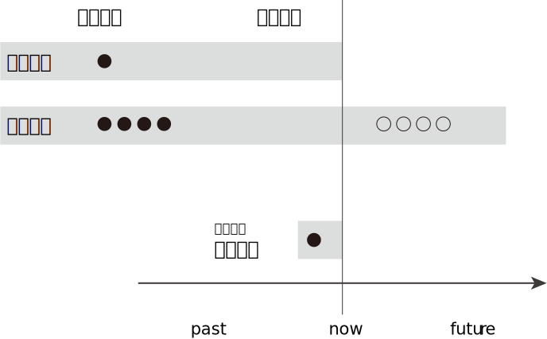

[cols="1a,1a"]
|===
|Header 1 |Header 2

|- 一个衣着前卫的摩登女郎，有一天她身穿吊带背心，脚蹬一双拖鞋就去了音乐厅。门口的检票员看她这身装束就很礼貌地拒绝让她进场： +
"Miss, NO ADMISSION WITH SLIPPERS."（小姐，穿拖鞋是不准进剧场的。）
+

这位小姐听完之后立即脱掉拖鞋并提在手中，说道： +
"Really? Then I will go in barefootedly."（哦，是吗？那我就光脚进去！）
+

这时，这位目瞪口呆的检票员惊叫道： +
"Oh, my god! Fortunately, I *have not told* her NO ADMISSION WITH A VEST."（天啊！幸好我刚才没有对她说穿背心不准进！）

|-> 检票员说的是 have not told, 就是强调了“过去”的行为对“现在”造成的影响. +
同时,**told 是个短暂动作(单一事件,而非延续事件), 不具有"重复发生多次"的意思。**所以这里的"完成时态" have not told 就是其第三种意思: 表示"过去发生的事件"对"现在"有影响。

*所以, 我们可以把"完成时"的这第三种意思, 称为“单一事件”完成时. 以区别于前面说过的 “延续事件”完成时, 和“重复事件”完成时意思。*

image:../00 英语语法常识/img_engGram/张满胜eng 28.jpg[] +
图中黑点表示: 过去某一时刻发生的动作； +
虚线表示 : 过去发生的动作对现在有影响。

-> 如果他用 did not tell，就只是在陈述过去“没有告诉”这个事实，而对现在的结果没有任何影响。

|===

“单一事件”完成时表示的“对现在有影响”，从句子的字面本身是反映不出来的，而是与说话语境密切相关，表现出一种“言外之意”。

[cols="1a,1a"]
|===
|Header 1 |Header 2

|- David *has fallen* in love.
|has fallen是一个短暂动作，不表示延续或重复，所以这句是“单一事件”完成时。 +
"单一事件完成时"是用来表达该事件(陷入爱河)对"现在"造成的影响的, 什么影响呢? 句子没有明说, 这就是它带有的言外之意.

|- "What *have* I *done* wrong?" Mr. Odds asked himself. "*Have* I *driven* on the wrong side of the road? *Has* there *been* some trouble at the bank? *Have* I *forgotten* to pay an important bill?" +
"Hello, Uncle," said the policeman, "My name's Mark."  +
欧兹先生心想：“我做错什么了吗？是开车逆行了？是银行工作中出了问题？还是某个重要的账单我忘了付钱？” +
“你好，舅舅，”那位警察说道，“我是麦克。”
|欧兹先生怀疑自己做错的四件事(短暂事件), 并非是“延续”和“重复”发生到现在的. 所以"单一事件完成时"强调的是"过去事件对现在的影响"：警察为什么会来找他。这一影响从上述四个完成时句子本身是看不出来的，要靠语境或背景情况来知道。

|===

事件在过去发生, 这个"过去"的时间点, 可近可远.  +
-> "近的过去"（near past）比如几分钟前, +
-> "远的过去"（distant past）比如几个月前.

[cols="1a,2a"]
|===
|Header 1 |Header 2

|- She *has been* to the bank.
|由于没有言明发生时间, 所以这句话可以有两种理解: +
-> 也可以理解成较近的过去事件——“她刚去过这家银行”。 +
-> 可以理解成较远的过去事件——“她以前去过这家银行”

|- *Have* you *asked* your little brother to do the dishes?
|由于没有明确的时间, ask 发生的时间就存在两种可能性: +
-> ask是"近的过去" : 你(刚刚)让你弟弟把碗刷了(把饭做了)吗? +
-> ask是"远的过去" : 你(以前)有没有让你弟弟刷过碗(做过饭)?

|- He *has been fired*.
|没有给出明确的发生时间. 所以该句话有两种理解: +
-> 理解成“远的过去”事件 : 即表示“过去的经历”(可一次,可多次)：他以前曾被开除过。 = He has been fired *before*. 即, 事件具有可重复性的, 未来也可能会再次发生. +
“他被开除过”只是说明他过去的经历，并不表示他现在没工作.

-> 理解成“近的过去”事件 : 他刚被开除了。= He has *just* been fired.  +
这一“最近被开除事件”导致对现在的直接影响就是“他失业了”。
|===

所以, “单一事件”的完成时态，若是离开语境(因为语境中才带有明确的时间)，就不可能精确理解它要表达的意思。

如果给出明确的时间 :

[cols="2a,3a"]
|===
|Header 1 |Header 2

|较远的过去：

- ever（英文意思是any time between the past and the present，表示“曾经”，一般指较远的过去时间）；
- before；
|- A: *Have* you *ever worked* in a restaurant?

|较近的过去：

- yet，
- already，
- lately,
- recently；
|- A: Have you found a job *yet*? 你找到工作了吗？ +
B: No, *not yet*. 还没有。 +
或 Yes. I'*ve found* a job *already*. 是的，我已经找到工作了。 <- *在肯定句中，用already代替yet表示“已经”*. +

|更近的过去：

- just，表示“刚刚”，常与完成时态连用。
|- A: Would you like something to eat? 你想吃点什么吗？ +
B: No, thanks. I'*ve just had* dinner. 不了，谢谢。我刚吃过饭（现在不饿）。
|===

---

==== ---- a. "近的过去", 对现在有影响 -> "现在完成时"提起话题 + "一般过去时"继续详谈细节

“较近的过去”事件, 对"现在"的影响, 一般具有以下特点:

1.所造成的现在结果, 往往是"直接具体", 或依然"清晰可见"的

[cols="1a,1a"]
|===
|Header 1 |Header 2

|- Look! Somebody *has spilt(v.) milk* on the carpet.
|对现在造成的“清晰后果”是：地毯被弄脏了，毯上现在还有牛奶渍。

|- The car *has arrived*. 车子到了。
|

|- A problem *has been detected* and Windows *has been shut down* to prevent damage to your computer. If this is the first time you'*ve seen* this stop error screen, restart your computer.
|这里的"完成时态"表示的显然就是“刚刚”(近的过去)发生的错误，且后果清晰可见 -- 死机, 蓝屏等.

|- Who'*s taken* my chair? 谁拿走了我的椅子?
|
|===

2.因为"最近"才发生, 所以具有"最新热点新闻"的效果

[cols="1a,1a"]
|===
|Header 1 |Header 2

|- Saddam Hussein *has been captured alive* in his hometown of Tikrit.
|萨达姆被抓时，各大媒体立即在新闻报道中这样说.

|- "Superman" actor Christopher Reeve, *has died* in a New York hospital of heart failure.
|“超人”的扮演者... 在纽约的一家医院死于心脏病. (新闻报道)

---

但是，如果某个名人的“死亡”不是刚刚发生的，而是离现在的时间比较远了，就要改用"一般过去时态"了。

- John F. Kennedy *was assassinated*. +
约翰·F·肯尼迪被刺杀。(他的死时很久以前的事了)

|===

3."完成时"提起话题，"过去时"继续详谈细节

*口语对话中, 常出现“现在完成时＋一般过去时”的搭配使用. 此时，我们用“现在完成时”提起一个新闻话题，用“一般过去时”继续详谈内容*（Topic: Present Perfect; Details: Past Simple）。

即:  +
-> 事情由于是发生在过去, 所以在详细说明事件的内容时，在谈该事件的细节 when，where，how和why等时, 用"一般过去时". +
-> 该事件由于对现在造成了影响, 所以我们对其感兴趣,来作为一个"聊天话题"提出. 所以用"现在完成时"来提出话题.

[cols="1a,1a"]
|===
|Header 1 |Header 2

|- Saddam Hussein *has been captured alive* in his hometown of Tikrit, the U. S. military *said* Sunday Dec. 14, 2003. A force of 600 American soldiers *captured* Saddam Hussein in a raid ...
|-> 萨达姆被捕对现在具有影响, 所以作为一个话题提出, 用"现在完成时". +
-> 接下去谈细节内容，细节都发生在过去, 就要用"一般过去时态"。

|- A: The President *has been assassinated*. +
B: Really? When *did* that happen? +
A: He *was killed* last night when he spoke in crowd.
|"较近的过去"事件
|===

---

==== ---- b. "远的过去", 对现在有影响 -> "一般过去时"讲述自己过去的[独特的]经历 + "现在完成时"探询对方是否有相似的经历

当谈论一个"较远过去"的某事件时，常常含有"回顾"自己曾经的经历的意味（past experience）。

[cols="1a,1a"]
|===
|Header 1 |Header 2

|- *Have* you ever *called* in sick at work when not ill? 你曾经...吗?
|“远的过去”事件

|- *Have* you ever *taken* anything valuable from your company for personal use? 你曾经...吗?
|“远的过去”事件

|- Tell me, little brother, *have* you *ever killed* a man?
|完成时have ever killed是海克特问弟弟帕里斯：“……你杀过人吗？”这显然是“远的过去”事件, 表示曾经的经历. 而不是表示“近的过去”事件，否则会译成“你刚刚杀了人了吗？”, 这里的ever排除了这个意思.

|- *(Have) Ever seen* a man die in combat?
|表示曾经的经历，是一个“远的过去”事件

---

- I'*ve killed* men and I'*ve heard* them dying and I'*ve watched* them dying and there's nothing glorious about it, nothing poetic.

这里三个"现在完成时态" I've killed... I've heard... I've watched 则是“重复”事件. killed，heard 和 watched 显然是多次重复发生的。

|===

[options="autowidth"]
|===
|Header 1 |Header 2

|你询问对方过去的经历("较远的过去"事件)
|+ 你继续详谈自己这个经历的具体情况
|↓ +
用现在完成时
|↓ +
用一般过去时
|===

即 : The present perfect often serves(v.) to introduce a topic, which in turn becomes a definite event /and is talked about using the past tense.

[cols="1a,1a"]
|===
|Header 1 |Header 2

|- We *got to* the Civic Center about an hour early, since I didn't have tickets yet, and I *knew* that it would be crowded. If you'*ve never been* to a professional wrestling match, you really should go ...
|用"现在完成时态" If you've never been to...来探询读者是否有观看职业摔跤比赛的经历.
|===

- A: Hey, this sounds good — snails with garlic! *Have* you ever *eaten* snails? （询问对方过去的经历, 用"现在完成时"） 嘿，这道菜听起来不错——蒜蓉蜗牛！你吃过蜗牛吗？ +
B: No, I *haven't*. +
A: Oh, they're delicious! I *had* them last time. Like to try some?  （提供过去的事实, 用"一般过去时"） 我上次吃过。你想尝尝吗？ +
B: No, thanks. They sound strange. 不了，谢谢，这菜听起来怪怪的。

---

==== ---- c. "远的过去", 对现在有影响 -> "一般现在时"讲述自己过去的[人人都会有的普通的]经历 + "现在完成时"探询对方是否有相似的经历

注意: 如果这个远的经历, 不是个人独特的, 而是人人都会有的普通经历, 就不能用"一般过去时", 而要用"一般现在时"!

即:
[options="autowidth"]
|===
|Header 1 |Header 2

|人人都会有的一般的, 常见的经历
|+ 探寻听话者／读者是否有过类似的经历

|↓ +
用"一般现在时态"
|↓ +
用"现在完成时态"
|===

[cols="1a,1a"]
|===
|Header 1 |Header 2

|- I'*m going through* this divorce. I know you'*ve been there* before, but mine is turning into a real legal battle. +
我正在办离婚(人人都会有的普通经历)。我知道你也经历过这个，但我的离婚手续完全是一场法律战。
|注意: *you have been there 的意思不是“你去过那个地方吧”，而是“你也有过类似的经历吧”。*

|===

---

==== ---- d. 远的过去的"单一事件", 只要加上"次数", 就能变成"重复事件".

表示远的过去经历的“单一事件”, 只要加上一个表示"具体次数"的频度状语, 就能变成“重复事件”.

[cols="1a,1a"]
|===
|单一事件 |单一事件 + 次数 = 重复事件

|- I have been married. 我结过婚。 +
-> 这句话并没有告诉我们“结婚”经历了几次.
|- I have been married *three times*. 到目前为止我结过三次婚。
|===

---

==== ---------- ----------

---

== "短暂动作"动词

==== 短暂动作 不能与“一段时间”连用 -> 一定要用, 有两种修整方法: (1) 使用该"短暂动词"对应的"状态动词", (2)直接把句子改为用"一般过去时"(而不用"现在完成时")

短暂动词(come，go，leave，kill，die，lose，buy，start，give，marry，join和bring等)，即指动作在短时间或瞬间内就已终止，不会延续. 所以, 它的完成时态, 不能与“一段时间”(for a year等)的时间状语连用. +
相反, 延续动词, 即“延续事件”的完成时, 必须加表示"一段时间持续"的时间状语.

[cols="1a,1a"]
|===
|"短暂动作", 不能和"一段时间"连用|"状态", 可以和"一段时间"连用

|下面这些说法都是错的, 因为谓语都是"短暂动词", 不能带有"持续性的时间状语". +
↓
|那么左边例句的这些错误, 该怎样改正呢? *只要把“动作（action）”转化为“状态（state）”即可，因为状态是可以延续的。* +
↓

|- I *have married for over a year*. ×
- I'*ve got married* for a year. ×
- I *have fallen in love for eight years*.  ×
- He *has left his hometown for three years*.  ×
|- I *have been married* for over a year. 我结婚有一年多了。 √
- I *have been in love* for eight years. 我恋爱有八年了。 √
- He *has been away* from his hometown for three years. 他离开家乡有三年了。 √

|
|*若句中的“动作”表达无法转化成“状态”表达(比如see没有对应的"状态动词"来表达)
，就不能用"现在完成时态"，而只好改为"一般过去时态"*:

- I *have seen* the movie *for two years*. ×
- I *saw* the movie *two years ago*. 一般过去时 √

其他句子也可以作同样的时态改变，说成：

- I *got married* over *a year ago*.
- He *left* his hometown *three years ago*.
|===

---

==== "短暂动作"动词, 不能表示延续; 但它用在"否定句中"时, 表示"事情还未发生"这样一种状态, 就具有了"延续"的含义.

**"短暂性动词"虽然不能表示"延续", 但它有一种情况它可以含有"延续"的含义, 即: 用在否定句中, 短暂性动词的"完成时", 可以表示"尚未发生的事情", 即表示一种"状态"（state）. "状态"就能含有"延续"的意味了.
**

[cols="1a,1a"]
|===
|把"短暂性动词"用在"否定句"中 |-> 该"短暂性动词"就表示为一种"状态"(state), 带有"延续性"意味.

|- Beggar: Madam, I *haven't seen* a piece of meat *for weeks*. +
乞丐：夫人，几个星期以来我都没见过一片肉了。
|这里短暂动词see的否定式, 与延续的时间状语for weeks连用了。

|- I *haven't seen* you *for ages*!  +
我很久没见到你了！
|

|- I *haven't bought* a pair of shoes *for a year*.  +
我有一年没买过鞋了。

|- I *haven't heard* from my girlfriend *since I came to America*. +
自从我来到美国以后, 就一直没收到过我女朋友的来信。
|
|===

---

== ---------- ----------

---

== ("短暂动作"动词 + 完成时态) = ("状态"动词 + 一般现在时态)

在英文里, 可以用**最近发生的动作的“现在完成时态”, 来表达现在的状态。**

即: 英语中，“动作action”动词的"完成时态", 在意思上相当于“状态state”动词的"一般现在时态"。

注意:

- 这里的动作往往指的是"短暂动作".
- 且, 这里的动作应该是“最近发生”的，即是一个“近的过去”单一事件，动作发生的过去时间,离现在不能太远.

[cols="1a,1a"]
|===
| "状态"动词 + 一般现在时态 | = "短暂动作"动词 + 完成时态

|客观平静地说明某事实. (理性)
|强调刚刚过去(近的过去)的事件, 对现在的影响. (感性)

|- Saddam *is captive*.
|- Saddam *has been captured*. +
萨达姆刚刚被美军抓住时，新闻报道就可以用"现在完成时"态这样说.

| - Kennedy *is dead*.
|- Kennedy *has been assassinated*. +
肯尼迪刚刚被暗杀后，就可以这样说.

---
但是，随着时间的改变，语境也就变了，“萨达姆被抓”、“肯尼迪被杀”离现在都比较久远了，因此，现在就不便说：Saddam has been captured.和 Kennedy has been assassinated. 而只能用"一般过去时"并加上具体的"过去时间状语"说成：

- Saddam *was captured* on 14 Dec. 2003.
- Kennedy *was assassinated* on 22 Nov. 1963.

|- = His father *is dead*. <- 状态 +
单纯强调事实. 此时他爸爸去世的时间往往不是在最近.
|- His father *has died*. <- 动作 +
强调刚刚过去(近的过去)的事件, 对现在的影响. (比如 he 依然很悲痛)

|- I *am married*. <- 状态 +
客观平静地说明“我已经结婚了”这个事实
|- I *have married*. <- 动作 +
带有感情色彩, 强调“对现在的影响”, 还在新婚的兴奋中. "我已经结婚了!"

---

注意: I have been married. 的意思则是"我结过婚".

|- My boss *is here* or is in his office now. +
他现在就在这里或在他的办公室里。
|- My boss *has arrived*. 我的老板来了。

|- *Do* you *have* a reservation? <- 状态
|- *Have* you *made* a reservation? <- 动作 +
酒店问客人是否有预定.

|- I'*m here* to see... <- 状态 +
你去某个公司找人，说“我来找某某”
| - I'*ve come here* to see... <- 动作

|===

---

== (1)动作动词 + 完成时态 = 强调"最近发生"的事件; (2) 状态 + 完成时态 = 强调“较远的过去”经历

*在英语中，“动作表达”的完成时态, 强调"最近发生"的事件; 而“状态表达”的完成时态强调“较远的过去”经历。*

[cols="1a,1a"]
|===
|动作动词 + 完成时态 = 强调"最近发生"的事件, 即强调对现在的影响或结果（current influence） |状态 + 完成时态 = 强调“较远的过去”经历（past experience）

|- His father *has died*. +
-> has died是“动作表达”，此时通常要理解成"最近的事件"。
|- His father *has been dead*. × +
-> 这是“状态表达”，强调"较远过去的经历"，所以表示“他爸爸曾经死过（但现在又活过来了）”，显然逻辑不通.

|- I *have become old*. +
-> 我已经变老了
|- I *have been old*. × +
-> 状态表达, 强调"较远过去的经历"，这句意思就变成了“我曾经老过（现在又返老还童了）”，显然逻辑不通.

|
|- I *have been married*. +
-> be married是“状态表达”，所以它的现在完成时态一般表示“曾经的经历”. 这句话的意思就是“我曾经结过婚”.

|- He *has come here*. +
-> 动作表达, 表示"近的事件"对现在的影响, 影响就是他来了”, “他人现在在这里”. = He is here.
|- He *has been here*. +
-> 状态表达, 强调"较远过去的经历". 这句意思就是“他曾经来过这里”，但现在已不在这里了。
|===

---

== 如果一个动词, 无法明确区分它到底是"动作"还是"状态", 则对它的理解就会有歧义存在.

一个谓语动词, 如果不能明确区分它到底是"动作"还是"状态"，则会产生歧义。 对它的正确理解, 就只能靠语境了.

[cols="1a,2a"]
|===
|Header 1 |Header 2

|- He *has been fired*.
|be fired 既可以是“动作表达”, 也可以作为“状态表达”. 所以这个句子的意思就有两种可能: +
-> 可以理解成"最近"一次动作——“他被开除了” +
-> 也可以理解成("较远的")"曾经的经历"——“他曾经被开除过”.

|- *Have* you *asked* your little brother to do the dishes?
|之所以有两个意思——“你让你弟弟把碗刷了吗？”或“你有没有让你弟弟刷过碗？”就是因为这里的谓语既可以看作是“动作表达”，也可以是“状态表达”。
|===

汉语则能轻易区分“过去的经历”和“最近的事件”——汉语用语助词“过”表示“过去的经历”，而用语助词“了”表示“最近的事件”，从而不会产生歧义。

---

== ---------- ----------

---

== since后面接"延续性"或"短暂性"动词，分别用于不同时态(一般过去时, 或 现在完成时)，所表达的意义是不同的。

[cols="1a,1a"]
|===
|since＋短暂动词 |since＋延续动词

|-> 主句用"现在完成时"， +
-> *since后面的从句用"一般过去时"。因为这些动作都是在过去发生的.* +
实际上，*since后面的从句谓语, 也可以采用"现在完成时态"，句子的意思不变。*

|*当since接延续动词时，延续动词的时态, 用"一般过去时态"或"现在完成时态", 意思是不一样的: +
-> 用"一般过去时态"，表示的是: 从句动作“结束”以来，主句活动在持续. +
-> 用"现在完成时态"，则表示: 从句动作“开始”以来，主句活动在持续。*

|- I *have worked* in this company *since* I *left* 短暂动词 school.  +
= I have worked in this company *since* I *have left* school.
自从毕业离校以来，我就一直在这家公司工作。 +
-> leave是短暂动词，不论用于"一般过去时态"（left）还是用于"现在完成时态"（have left），都表示leave的动作结束后，主句活动work才开始,并且一直在持续（即离开学校后就一直在这家公司工作）。
|- 例子见下面新的表格

|- It has been three years *since* I *came* 短暂动词 to China.  +
= It has been three years *since* I *have come* to China. +
我来中国已经有三年了。
|

|-  I must admit that *since* I *started* 短暂动词 the exercises I've been feeling less tired. +
我得承认，自从开始锻炼以来，我就再也不像以前那么觉得累了。 +
-> 从句的谓语start是一个短暂动词，所以要用"一般过去时态"
|

|综上, since后面接"短暂动词"时，用"一般过去时态"或"现在完成时态"均可，而且意思一样，都表示从句动作“结束”以来，主句活动在持续。翻译成中文时，句子的意思就按英文字面去理解。
|
|===

since＋延续动词:

[cols="1a,1a"]
|===
|since＋延续动词(一般过去时) |since＋延续动词(现在完成时)

|表示从句动作“*结束*”以来，主句活动在持续
|表示从句动作“*开始*”以来，主句活动在持续

|- It's been three years *since* I *worked* 延续动词 in this company. +
-> 主句时间是从work这个活动已经“结束”后开始算起, 到现在有三年了， +
即"我不在这家公司工作已经有三年了".
|- It's been three years *since* I *have worked* in this company. +
-> 主句时间是从work这个活动“开始”以来算起, 到现在有三年了， +
即:  “我开始在这公司工作已经有三年了。"

|- It has been a while *since* we *talked*... +
我们好久没有交流了… (自上次结束交流以来, 已有很久了)
|

|
|- *Since* China *has been open* she's traveled to Australia. +
自从中国开放以来，她已经多次到澳大利亚旅游. +
-> 这里的从句用了"现在完成时态" has been，表明中国“一直”在开放。 +
如果用"一般过去时态"说成 Since China was open...则是表示中国不再奉行改革开放政策了.

|- It's two years *since* I *was* 延续动词 in this university. +
我大学毕业已经有两年了。 +
-> 这里表示延续状态的动词be用了过去式was，就表示从was in this university的状态结束后, 开始计算时间.
|- It's two years *since* I *have been* 延续动词 in this university. +
我上大学已经有两年了

---

注意：**since引导的主句, 如果单纯表示时间，可以说：It is 或 has been＋时间段＋since...**  +
所以这句话也可以说成:

- It'*s been* two years since I have been in this university。

|
|- Are you keeping current on the news from home *since* you'*ve been* here? +
你来这之后一直和家里有联系吗？最近有什么消息？ +
-> 用了表示"延续状态"的be动词的"完成式have been"，以说明“你”一直在这，而不是离开了这个地方。

|
|- It was long *since* I *had last seen* her. +
我上次见她已经是很久以前的事了
|===

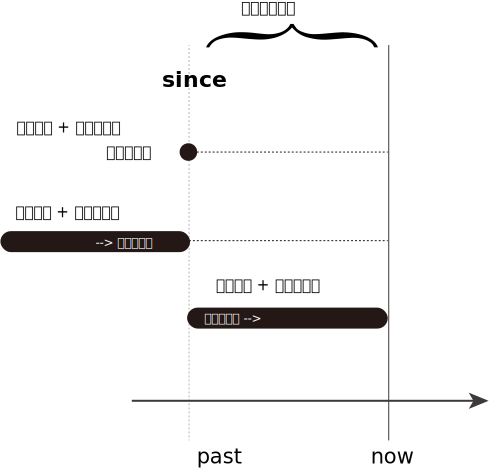

---

