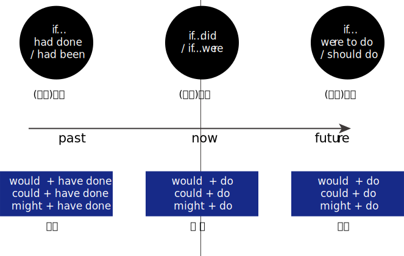
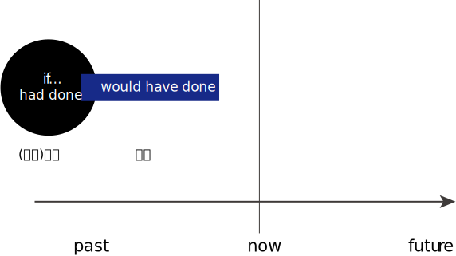
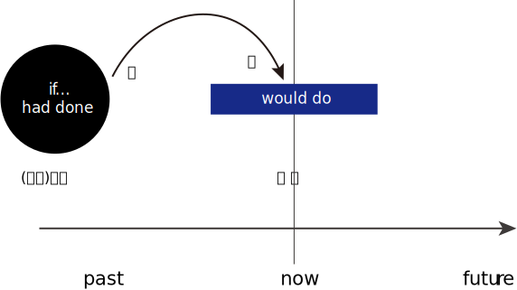
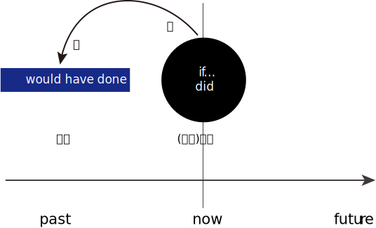
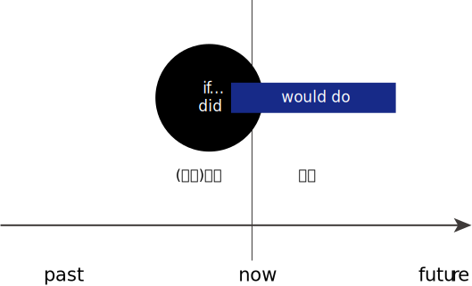

= 张满胜_虚拟语气
:toc:

---

== mood 语气

语气（mood）

[options="autowidth" cols="1a,1a"]
|===
|Header 1 |Header 2

|目的
|用来表示说话者的意图和态度.

- 说话者谈到自己与实际情况相反的情况时
- 主观想象某事有可能发生时
- 建议、要求某事发生时

|表达方式
|利用"谓语动词的形式变化"来实现

|包含3种语气
|- 陈述语气（indicative mood）
- 祈使语气（imperative mood）
- 虚拟语气（subjunctive mood）
|===

---

== 虚拟语气 Subjunctive Mood -> 两类(hypothetical, counterfactual) × 三时 (past, present, future)

可以分成两种:

|===
|Header 1 |Header 2 |Header 3

.2+|1.非真实条件句（unreal conditional） +
/或叫"虚拟条件句"
|(1).counterfactual 事实相反句
|是表示与"现在"或"过去"的某个事实相反的情形 (即: 平行宇宙)

|(2).hypothetical 假设条件句
|表示一种假想的情形，表示说话者的一种主观愿望或态度等，实现的可能性不大或极小。

|
2+|即: "虚拟条件句", 具有两种类型 (counterfactual & hypothetical)，并会对三种时间(过去, 现在, 将来) 进行虚拟。(两类三时)

|2.

|- 表示建议、命令或要求等语气 (多在"名词从句"中来使用)
|
|===

unreal conditional 的"两类三时":

[cols="1a,3a,3a"]
|===
| |hypothetical  假设的；假定的 |counterfactual 反事实的

||发生的可能性极低|发生的可能性为0

|过去
|不存在. +
你如何假想"已经发生了的历史"?
|既然是过去了，那么事情早已既成事实，所以"过去+虚拟"表达的, 只能是一个与"过去事实"相反的情形。

- 如果我在毕业时, 当了老师 ...
- If I *had had* the time yesterday, I *would have helped* him. +
昨天我要是有时间的话，我就会帮他了。 +
-> 与过去的事实相背的情形

|现在
|有

- If I *had* the time now, I *would help* him. +
如果我现在有时间，我就会帮他的。

|有

- 如果我有这几种超能力: 时空门, 会飞, 能预知未来的事情.
- If I *were* you, I *would help* him. +
如果我是你，我就会帮他的。 +
-> 表示与现在事实相反的情形。

- If my grandfather *were* alive today, he *would experience* a very different world. +
如果我爷爷现在还活着，那他就会经历一个完全不同的世界了。 +
-> 表示与现在事实相反的情形

|将来
|将来的情形还没有发生，所以对于将来时间的虚拟, 不可能以"未来的事实"为基础，而只能是表达说话人的一个"设想"或"愿望"。

- 如果明天就是我的最后一天.
- If I *were to have* the time tomorrow, I *would help* him. +
如果我明天有时间，我就会帮他的。

|不存在. +
将来还未发生, 何来"将来的已发生事实"?
|===

简言之:

- 对于将来的情形, 只能是"假设"；
- 对于现在的情形, 既可以是"假设"，也可以是谈"与现在事实相反"的情况；
- 对于过去，只能是谈"与事实相反"的情形。

---

== ---------- ----------

---

== 谓语的形式如何变化, 才表达出是"虚拟语气"?

[options="autowidth"]
|===
|对...时间的事,进行虚拟 |主句(Independent clause 或 main clause )中的谓语形式 |从句(Subordinate clause)中的谓语形式

|past
.2+|(主过)(主现): +
would /could / might + have done
|(从过): had done 或 had been

|present
|(从现): did 或 were

|future
|(主将): would /could / might + do
|(从将): were to do / should do
|===

上表中, 尤其是 past 和 present 的四种谓语形式，要牢记. 因为在实际使用中，主从句的谓语, 可能会有以下四种不同的搭配组合（以would为例）:

[cols="1a,3a,3a"]
|===
|对...时间的事,进行虚拟 |主过 |主现

|从过
|*主过 would have done ＋ 从过 if...had done*

主过-从过:

- "主句"和"if引导的条件状语从句", 都是表示对"过去"的虚拟。

|*主现 would do ＋ 从过 if...had done*

主现-从过 :

- 主句是表示对"现在"的虚拟，
- 而"if引导的条件状语从句"是表示对"过去"的虚拟， +
即"主句"与"从句"所虚拟的时间不一致。

|从现
|*主过 would have done ＋从现 if...did*

主过-从现 :

- 主句是表示对"过去"的虚拟，
- 而if 引导的条件状语从句, 是表示对"现在"的虚拟. +
即主句与从句所虚拟的时间不一致。

|*主现 would do ＋ 从现 if...did*

主现-从现 :

- "主句"和"if引导的条件状语从句", 都是表示对"现在"的虚拟。

|===

---

==== 你在使用虚拟语气时, 要先依次考虑3个步骤问题 -> 1. 你所讲述的事件, 是否为"虚构类"事件(才要用到"虚拟语气"). 2. 这件虚构类事件, 发生在什么时间(过去, 现在, 将来)? 3.主句和从句的谓语各自变化形式, 要形成肌肉记忆, 脱口而出.

依次问自己3个问题: 一个前提(事件是否虚构)，三个变量(时间变量、主句变量, 和从句变量)
[cols="2a,3a"]
|===
|Header 1 |Header 2

|1.你想描述的这件事, 是否需要使用到"虚拟语气"?
|即: 你述说的这件事, 是一个"真实"的情况，还是只是一种与事实相反的"假设"?  +
如果是后者, 英语中就要通过动词的变形, 来表达是"假设"情况.

|2.你述说的这件虚拟的事情, 发生在什么时间?
|即: 是对"过去", "现在", 和"将来", 这三种时间中的哪个时间, 进行虚拟? 虚拟事件发生在哪个时间?

|3.分清谁是主句，谁是从句? 因为虚拟语气的使用中, 主句和从句要采用的谓语形式, 是不同的.
|主句的谓语形式, 有两种:

- would have done <- 对"过去"时间中的事件, 进行虚拟
- would do <- 对"现在"和"将来"时间中的事件, 进行虚拟

主句的谓语形式, 有3种:

- had done/had been <- 对"过去"时间中的事件, 进行虚拟
- did/were <- 对"现在"时间中的事件, 进行虚拟
- were to do 或 should do <- 对"将来"时间中的事件, 进行虚拟
|===

*记住这些主从谓语时态的最好方法, 就是背例句!*

要能真正达到native speaker的思维表达水平, 虚拟语气已完全成为我们思维表达的一部分, 口语中运用自如, 若没有经过多年的潜心观察、细心体会、反复操练，是达不到的。能达到这一阶段的英语学习者可谓凤毛麟角.

要想真正达到最后这个“口语阶段”，本身是需要大量的口语实践的.

世界本无语法规则，说的人多了便成了规则。*人类是先有语言，然后再从中总结出在表达某种语意意思时, 大体的思维规律或表达倾向*，即所谓的"规则"。所以语法规则只不过是人们的语言表达习惯而已。

老外是在使用英语思维，尽管他们不懂语法规则。

---

== 1. 对"过去已发生事实"的虚拟, 主句和从句都表示对"过去历史"的虚拟 <- ①(从过) If+主语+had done, ②(主过) 主语+should/would/might/could+have done

- If I *had got* there earlier，I *should/would have met* her. +
如果我早到那儿，我就会见到她。

- I *wouldn't have grown up* into the person I am if they *hadn't passed on* their values to me. +
没有父母的教诲，我也就不能成为现在的“我”。

- I don't know what I *would have done* if he *hadn't answered* yes. +
如果他当时没有回答说爱我，我真不知道该怎么办.

---

== 2. 主句和从句都表示对"现在一般情况"的虚拟 <- ①(从现) If+主语+动词一般过去时did (Be动词用were), ②(主现) 主语+ should/would/might/could+do

[cols="1a,1a"]
|===
|Header 1 |Header 2

|- If I *were* the president of a university I *should establish* a compulsory course in "How to Use Your Eyes".  +
如果我是一名大学校长的话，我会开设一门“如何用眼”的必修课。

- If with the oncoming darkness of the third night you *knew* that the sun *would never rise* for you again, how *would* you *spend* those three precious intervening days?
|<- 这些都是标准的"对现在的事实进行虚拟"的句子，即:

- 从句: 使用"一般过去时态"；如果是be动词，则不论句子的主语是单数还是复数，都是复数形式were，而不是was；
- 主句: 用"would/should＋动词原形"。

|-  My advice to all men is "Choose in marriage a woman that you *would choose* as a friend if she *were* a man".  +
我对于男士们的建议是：选取结婚对象时，要找这样的女人——假如她们是男人的话，你愿意和他们做朋友。
|<- 女人是无法变为男人的，所以这是一个对一般情况的虚拟。

|- (1) If we *could shrink* the earth's population to a village of precisely 100 people, ... it *would look* something like the following: +
There *would be* 57 Asians, 21 Europeans, ... +
22 *would speak* Chinese, 9 *would speak* English and 7 *would speak* Spanish. +
如果我们把全世界的人口按照现有的比例压缩为一个拥有100人的村子，情况就会像下面这样：...

- (2) If you *woke up* this morning with more health than illness, you *are* more blessed than the million who will not survive this week. +
如果你今天早上醒来的时候依然健康无恙，那么，比起活不过这一周的百万人来说，你真是幸福多了。

|<- 对"现在"的虚拟, 即表达与"现在事实"相反的情况.

---

<- 在第二部分，作者说： +
If you *woke up* this morning with more health than illness, you *are* more blessed than the million who will not survive this week. +
这里从句的谓语woke用的是过去式, 但并不是表示虚拟，而是 this morning（今天早晨）本身就是一个过去的时间, 所以这里其实就是一个普通的"一般过去时态"而已. **同样，主句的谓语用了一般现在时态are，而不是would be这样的虚拟形式。**这里, 作者都是在叙述真实的条件，所以都没有采用虚拟语气。

|- If I *became* President, I *would*...
|正确运用语气, 要根据说话人的不同身份, 来选择不同的语气表达。

比如对于“假如我当总统，我会……” , 若是出自小学生之口，他应该说成：

- If I *became* President, I *would*... +
-> 因为对于一个小学生来说，“当总统”是一个与"现实"相反的虚拟假设.

但若是对于一位正在竞选中的总统，他则要这么说：

- If I *became* President, I *will make* America stronger at home and more respected in the world. +
-> *他应该用表示"真实条件"的"陈述语气", 来表明对自己未来总统竞选获胜的信心。*

|===

---

== 3. if 将来会是... 则我在将来就会是... <- ①(从将) if+主语+were to do /should do /动词过去式, ②(主将) 主语+should/would/might/could+do => 谈一个将来不太可能实现的愿望; 或将来不太可能发生的事情.

对"将来"的虚拟, 只能是谈“不大可能发生”的未来情形，而不是在谈一个"与已发生事实相反"的情形。 +
所以, *我们常常会用"虚拟的将来", 来谈一个不太可能实现的愿望。*

来比较下**"真实条件"和"虚拟的将来条件"的区别**：下面这种**不同语气的选择，反映了说话人对未来下雨的可能性的信心程度不同。**

[cols="1a,1a"]
|===
|真实条件 -> 用来表达"将来的这件事", 发生的可能性存在|"虚拟的将来"条件 -> 用来表达"将来的这件事", 几乎没有可能发生.

|- If it *rains*, I *will stay* home. +
如果下雨了，我就在家呆着。

-> *用了陈述语气，表明说话人认为: "将来下雨"这件"将来的事", 可能性比较大。*
|- If it *were to rain*, I *would stay* home. +
万一要下雨，那我就在家呆着。

-> *用了虚拟语气，表明说话人认为: "将来下雨"这件"将来的事", 可能性不高。*

|===

[cols="1a,1a"]
|===
|Header 1 |Header 2

|- If I *were to* live my life over again, I *would have* you as my wife. +
如果我有来生，我一定会娶你为妻。
|<- 谈一个不太可能实现的愿望。或不太可能发生的事情.

|- If I *should win* the lottery, I *would buy* a house. +
万一我赢得了彩票大奖，我就会买一栋房子。
|<- 谈一个不太可能实现的愿望。或不太可能发生的事情.

|- What do you think *would be* the value of the necklace, if I *were to* sell it? +
假如我把这串项链卖了，你觉得会是什么价？
|事实上，*对于很多将来的情况，选择用"虚拟"还是不用"虚拟"，完全取决于说话人对所陈述事件的态度*，或者说"虚拟语气"能表明说话人的态度。

<- 这里“卖项链”这个事件是说话人完全可以控制的，不是像“假如我有来生”那样完全不能掌控，但说话人依然用了"虚拟将来"的谓语形式were to sell，这只是向听者表明自己这样一个态度——自己不会卖, 或不大可能会卖这个项链的。

---

既然"虚拟将来"在很大程度上是由说话人对事件的态度决定的，所以，"虚拟将来"使用起来也就非常灵活。比如，如果对于一个急需钱用而想把自己的项链卖掉换钱的人，他在询问卖价，这时就不会用将来虚拟了，而是用一般陈述的语气：

- What do you think *is* the value of the necklace if I *sell* it to you? 如果我把这串项链卖给你，你能出什么价？

|- What *would happen* if someone *were to* dispose litter in a public place?"It *would stir* public anger and denouncement," ... +
如果有人在公共场所公然乱扔垃圾，会怎样呢？索尼娅说：“这会引起公愤，招来谴责。
|这里用的都是虚拟语气，言外之意就是表明，那里(北欧)的人们不可能在公共场所乱扔垃圾，或者说这种情况极少发生。 +
因此, 如果这是在谈论中国人的情况，就不必用虚拟语气了. 乱扔垃圾是司空见惯的现象.

|===

---

== 4. 主句逆反现在＋从句逆反过去 <- ①(从过) had done , ②(主现) would + do 动词原形

即 : 主句是对"现在的事实"的虚拟，从句是对"过去历史"的虚拟.

- If I *had worked hard* at school，I *would be* an engineer now. +
如果我当时在学校学习刻苦的话，我现在就是一个工程师了

-  If I *hadn't listened* to my father and dropped teaching, I *would never be* here. +
如果当初我没有听从我父亲的建议，放弃教书，那我今天就不可能站在这里了。

- If they *had invested* in that stock, they *might be* wealthy now. +
如果他们当初投资了那支股票，他们现在就会很富有了。

- If he *had studied* English two years ago, he *might have* a chance of going abroad for further study now. +
如果他两年前学过英语，他现在可能就有机会出国深造了。

---

== 5. 主句逆反过去＋从句逆反现在 <- ①(从现) did , ②(主过) would have done

即: 从句是对"现在的事实"进行虚拟; 主句是对"过去已确定的历史"进行虚拟.

- If I *didn't love* her, I *wouldn't have married* her. +
如果我不爱她，我就不会娶她

- If you *knew* me better, you *wouldn't have said* that. +
如果你真的理解我的话，你当时就不可能说出那种话了

---

== ---------- ----------

---

== 倒装虚拟 -> 当if引导的条件句省去 if 时，可将 should，had 或 were 置于句首

在英文中，虚拟从句可以采用倒装结构。即: *当if引导的条件句, 省去 if 时，可将 should，had 或 were 置于句首，从而构成"倒装虚拟句"，而意义不变。*

[cols="1a,1a"]
|===
|Header 1 |Header 2

|- *Had he* not been promoted, he would never have remained with the company.
|=*If he had* not been promoted, he would never have remained with the company.  +
如果他没有被提升，他就不会继续留在这家公司了。

-> 注意 : 若条件从句为否定句，否定词not应置于主语之后，而不能与were，should，had 等缩略成Weren’t，Shouldn’t，Hadn’t而置于句首。

|- **Were he **to tell us everything, we could try to solve his problem.
|=*If he were* to tell us everything, we could try to solve his problem. +
如果他把一切都告诉我们，我们就能想办法解决他的问题。

|- *Should it* be necessary，I would go. +
假若有必要，我会去的。
|

|- *Were she* here，she would agree with us. +
如果她在这儿的话，她会同意我们的。
|
|===

---

== 跳层虚拟

---

file:///E:/+%20ebook/eng%20%E8%8B%B1%E8%AF%AD/%E5%BC%A0%E6%BB%A1%E8%83%9C%20eng%20img/Zhang%20Man%20Sheng/Ying%20Yu%20Yu%20Fa%20Xin%20Si%20Wei%20Zhong%20Ji%20J%20(141)/Ying%20Yu%20Yu%20Fa%20Xin%20Si%20Wei%20Zhong%20-%20Zhang%20Man%20Sheng/index_split_064.html#filepos1334047

