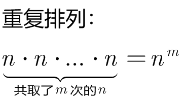
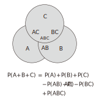
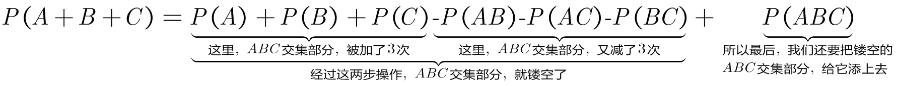
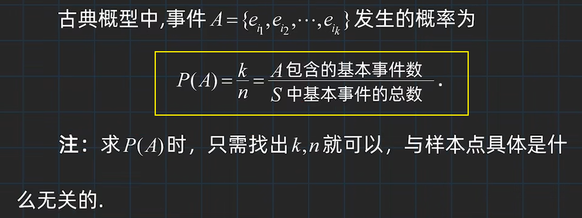
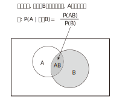
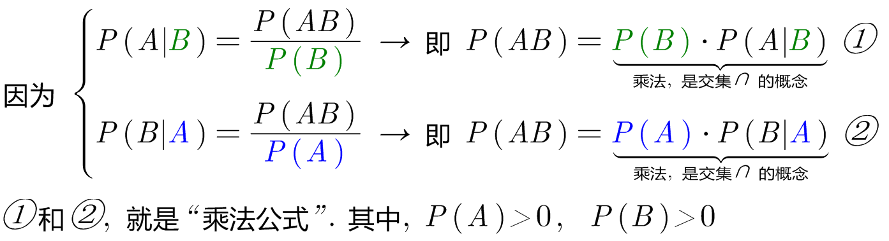
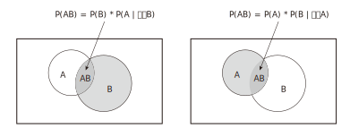
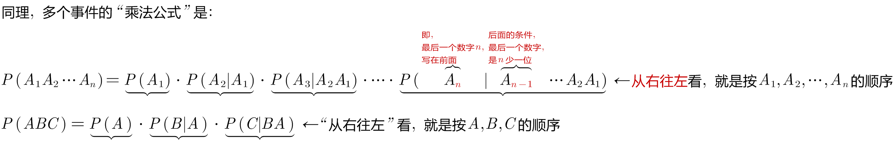

= 概率_基本公式
:toc: left
:toclevels: 3
:sectnums:

---

== 排列, 组合

[options="autowidth"]
|===
|Header 1 |Header 2

|"不放回型"排列
|stem:[P_(总数n)^(选数m) = n(n-1)(n-2)...(n-m+1) = \frac{n!} {(n-m)!} = \frac{"总数!"} {("总数-选数")!} ]

|"放回型"排列 (也叫"重复排列")
|

|全排列
|stem:[ P_n^n = n(n-1)(n-1)...3 \cdot 2 \cdot 2 \cdot \1 = n!]

|"不放回型"组合
|从n个(父father)不同元素中, 任取r个元素(子son), 并成一组 (不考虑元素间的先后顺序), 称为一个"组合". 记作 stem:[ C_n^r 或 C_{father}^{son}]

\begin{align}
& C_{father}^{son} = \frac{P_{f}^s} {s!} = \frac{f!} {s!(f-s)!} \\
&  C_{father}^{son} =  C_{f}^{f-s} \\
&  C_{father}^{0} =  C_{f}^{f} \\
\end{align}

|"放回型"组合
|从 n (father) 个不同元素中, 每次取出一个, 放回后再取下一个, 如此连续取 r (son)次, 所得到的的组合, 称为"重复组合".

\begin{align}
"放回型组合"的总数 = C_{father+son-1}^{son}   ← son允许大于father
\end{align}

|其他
|
\begin{align}
& 0! =1 \\
& C_{father}^0=1
\end{align}
|===

---

== 事件之间, 有交集的

[options="autowidth"]
|===
|Header 1 |Header 2

|stem:[ P(A) + P(\overline(A)) = 1]
|

|对于"完备事件组"中的所有事件来说: +
stem:[ P(A_1) + P(A_2) + ... +  P(A_n) =  P(Ω) = 1]
|

|加法公式:  +
stem:[ P(A+B) = P(A) + P(B) - P(AB)]
|image:img/055.svg[,300]

|
\begin{align}
& P(A+B+C) \\
& = P(A) + P(B)  +  P\(C) - P(AB) - P(AC) -  P(BC) +  P(ABC)
\end{align}
|

|减法:  +
stem:[ P(A-B) = P(A) - P(AB)]
|image:img/054.svg[,200]
|===

---

== 事件之间, 是"互不相容"的

=== 互不相容事件 + 古典概率

[options="autowidth"]
|===
|Header 1 |Header 2

|
|stem:[ A_1, A_2, ... A_n] 是互不相容的. →  stem:[ P(A_1 +A_2 + ...+ A_n)= P(A_1) +  P(A_2)  + P(A_n) ]

|"古典概率模型"具有"有限可加性" (加到 n):  +
"有限个"两两互不相容事件的"和事件"的概率，等于每个事件概率的和。
| stem:[ P(∪_(i=1)^n A_i) = \sum_(i=1)^n P(A_i)]

|"几何概率模型" 具有 "完全可加性" (加到 ∞):  +
先求和, 再求概率, 等于 先求每个事件概率, 再求和.
|stem:[ P(∪_(i=1)^∞ A_i) = \sum_(i=1)^∞ P(A_i)]
|===

---

=== 互不相容 + 完备事件组

---

== 事件之间, 是"彼此独立"的

---

== 条件概率 Conditional probability

[options="autowidth"]
|===
|Header 1 |Header 2

|在B已经发生的条件下, A发生的概率, 就叫做A对B 的"条件概率"
|
\begin{align}
 P(A \| 条件B) & = \frac{在B发生的条件下, A发生的样本点数, 即AB同时发生了} {B里面有多少个样本点} \\
& =  \frac{n_{AB}} {n_B}
 = \dfrac{\dfrac{n_{AB}} {n}} {\dfrac{n_{B}} {n}}
 = \frac{P(AB)} {P(B)}
\end{align}

|条件概率下的"互不相容"事件:
|若 stem:[ A_1, A_2, ... A_n, ...] 是"互不相容"的事件,  则有: +
stem:[ P(\sum_{i=1}^∞ A_i \| B) = \sum_{i=1}^∞ P(A_i \| B)]

|乘法公式
| stem:[ P(前后)=P(后) \cdot P(前 \|后) = P(前) \cdot P(后 \|前)]   +
规律就是"前后前后"这样交错, 或反过来交错.

|===

