= 3Blue1Brown_线性代数的本质
:toc:
:toclevels: 3
:sectnums:

---

== 向量的加法, 就是把对应的项加起来

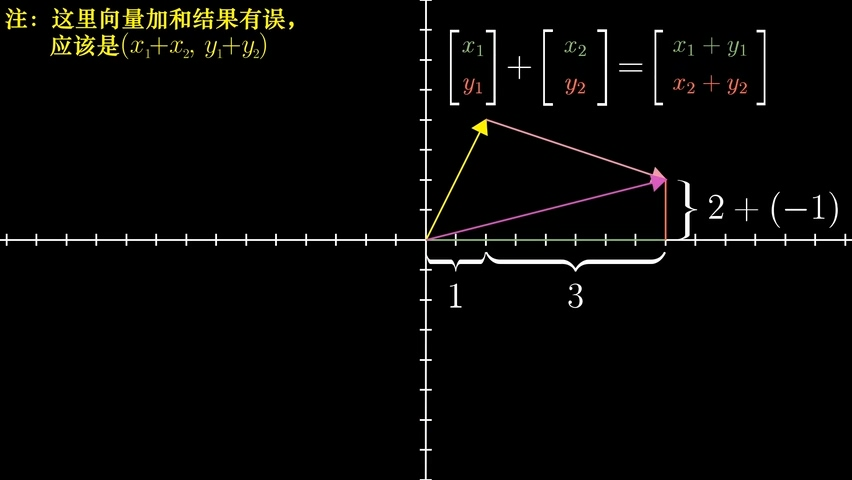

---

== 向量的数乘, 即系数k的作用, 就是把向量伸缩k倍

k, 又称"系数"或"标量" (scalars). 数字在线性代数中, 起到的主要作用, 就是缩放"向量". +
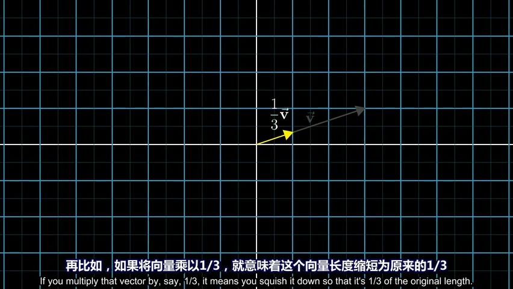

k是负数的话, 就是反方向伸缩k倍 +
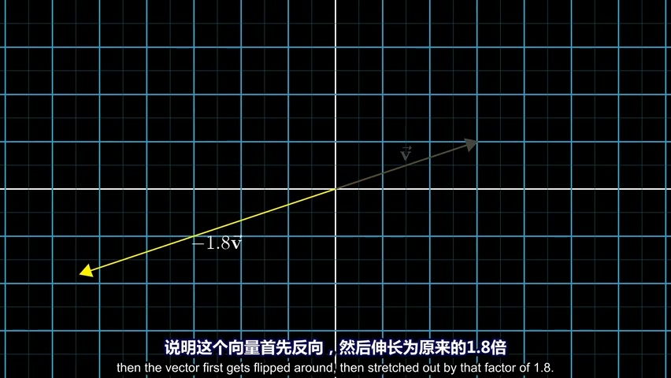

从几何上看, 将一个向量伸长2倍, 对应于将每一个分量, 都乘以2倍. +
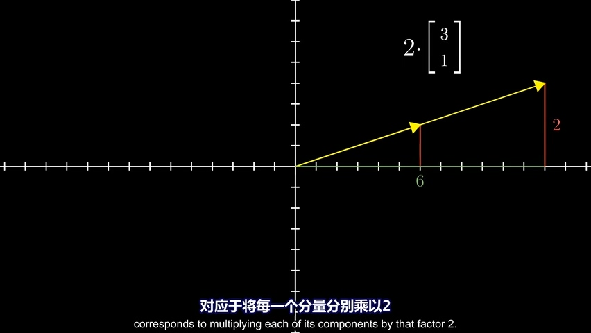

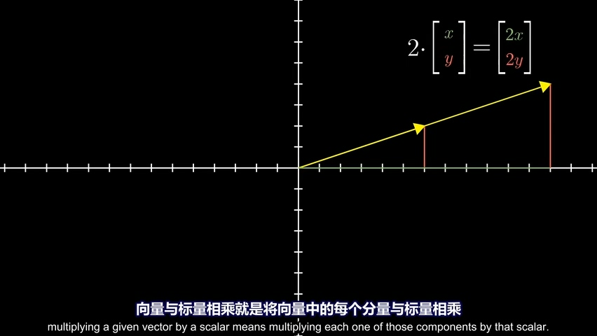

---

== 单位向量: x坐标的 stem:[\hat{i}], 和 y坐标的 stem:[\hat{j}], & 基 basis.

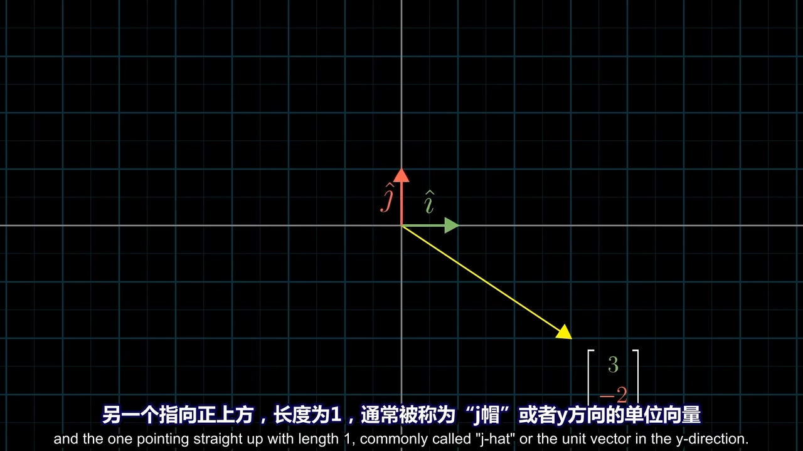

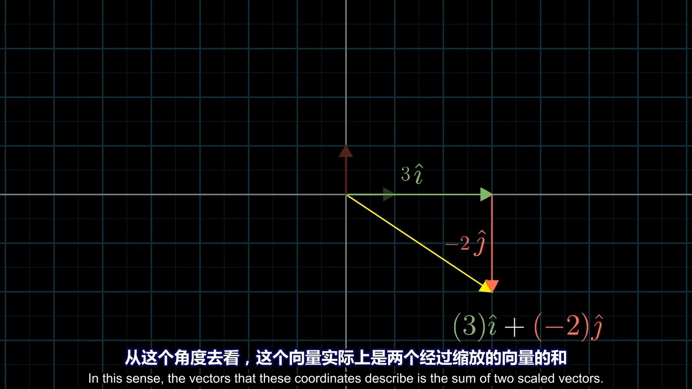

x坐标的 stem:[\hat{i}], 和 y坐标的 stem:[\hat{j}], 就被称为坐标系的"基"(basis). +
因此, 向量, 就相当于你把"基向量"缩放k倍来得到的. 换言之, 每当我们用数字来描述向量时, 它都依赖于我们正在使用的"基". +
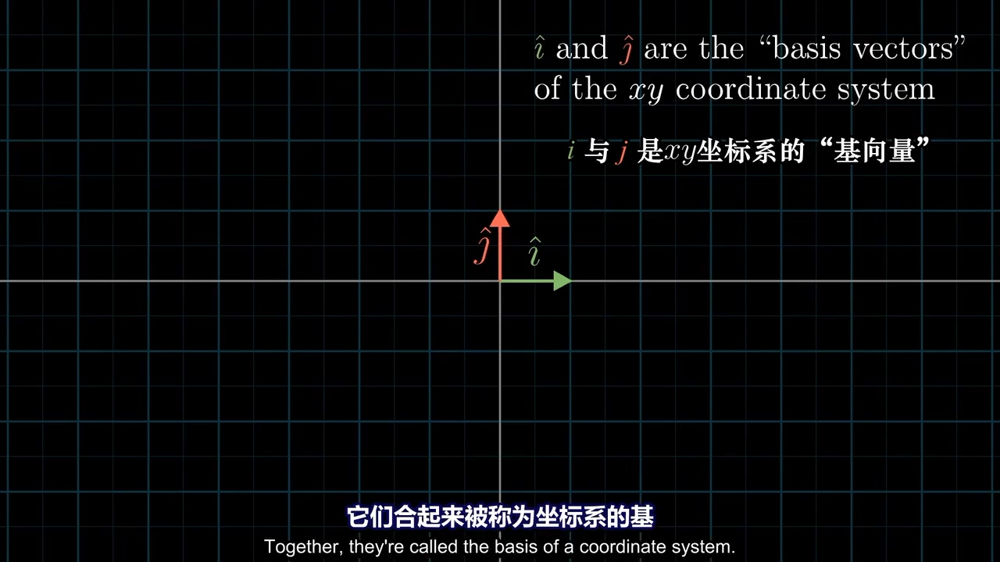

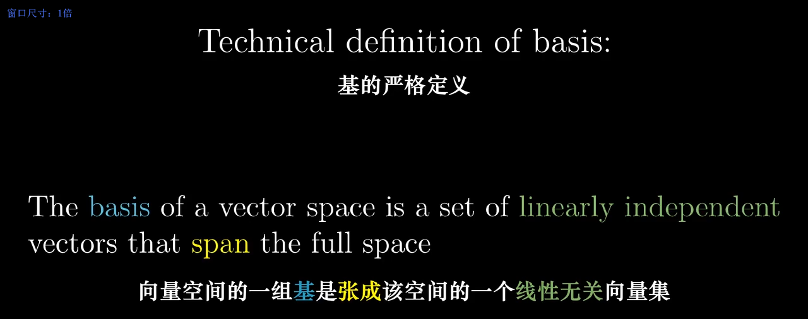

基向量的长度, 是人为确定的, 换言之, 你完全可以采用一个不同的"基向量", 来得到一个符合你特定要求的, 全新的坐标系.

---

== linear combinations 线性组合

两个"数乘向量"的和, 被称为这两个向量的"线性组合". +
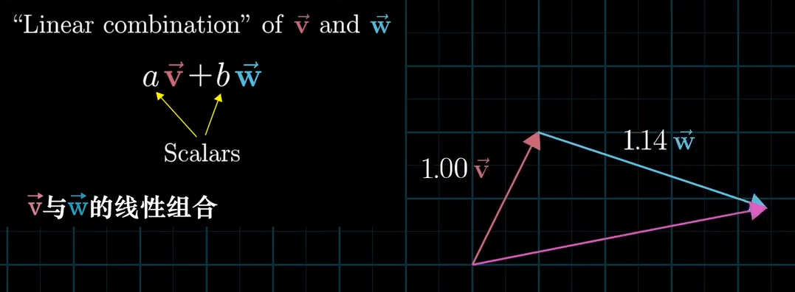

如果固定其中一个标量, 让另一个标量自由变化(即自由伸缩k倍), 这两个向量的和, 即终点坐标, 就会构成一条直线. +
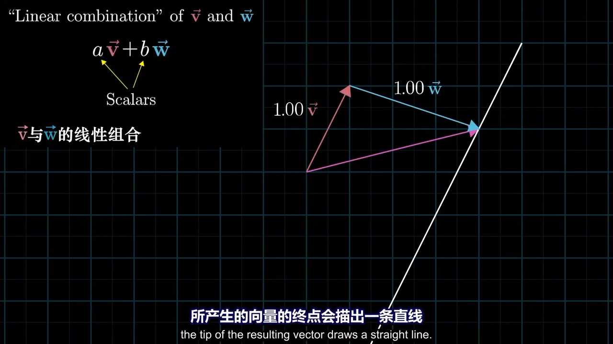

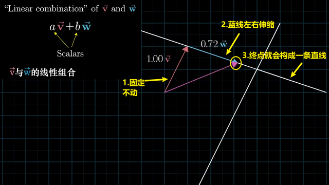

[options="autowidth"]
|===
|Header 1 |Header 2

|若两个向量, 斜率不同
|如何你让两个向量都能自由变换, 那它们向量的和, 即终点坐标, 能达到平面上的任何点处. +
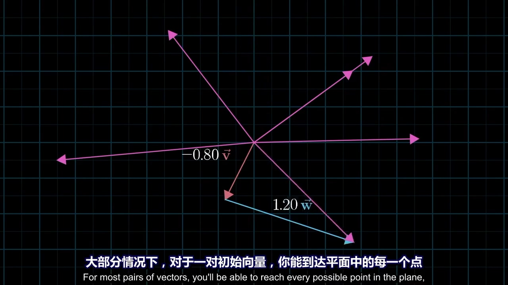

|若两个向量, 斜率相同
|但当这两个向量, 是"共线"的时(即直线斜率相同), 那它们的和, 即终点坐标, 就被限制在它们自身这条"共线"上了. +
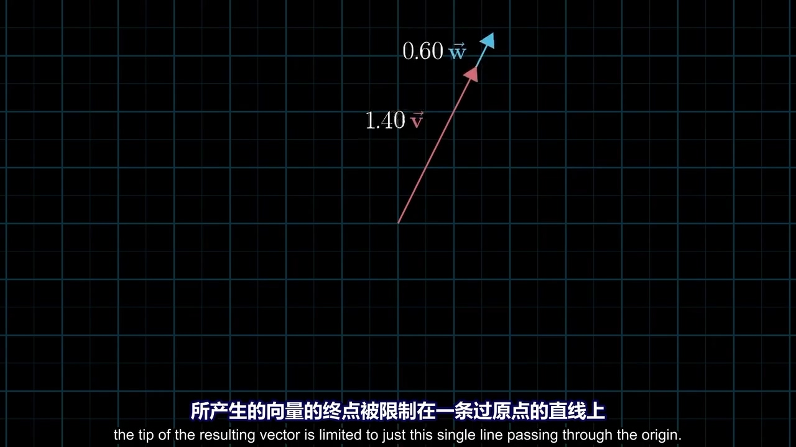

|如何这两个向量都是"零向量"
|那它们的线性组合, 即"和"的终点坐标, 永远被束缚在原点(0,0)上.
|===

---

== span 张成

the span of stem:[ \vec{v}] and stem:[ \vec{w}] is the set of all their linear combinations. +
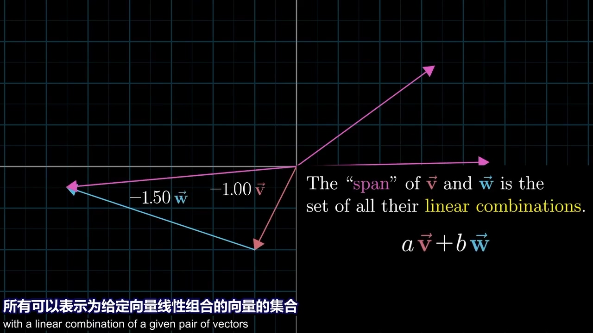

#the set of all possible vectors that you can reach /is called the span of those two vectors. 终点能遍及到的所有领域, 就被称为这些向量的"张成" (势力范围空间).#

[options="autowidth"]
|===
|Header 1 |Header 2

|两个斜率不相同的2维向量
|对大部分二维向量来说, 它们张成的空间, 就是所有二维向量的集合. 就是整个无限大的二维平面. +
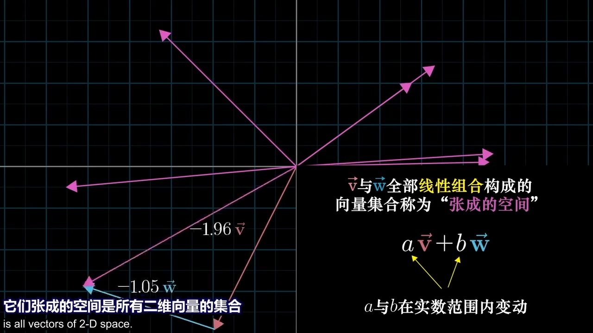

两个向量张成的空间, 实际就是在问: 仅通过向量"加法"与"数乘"这两种操作, 你能获得的所有可能的"向量的集合"是什么?

|在三维空间中, 两个斜率不相同的3维向量
|它们张成的空间, 就是三维空间中的过原点的一个平面. +
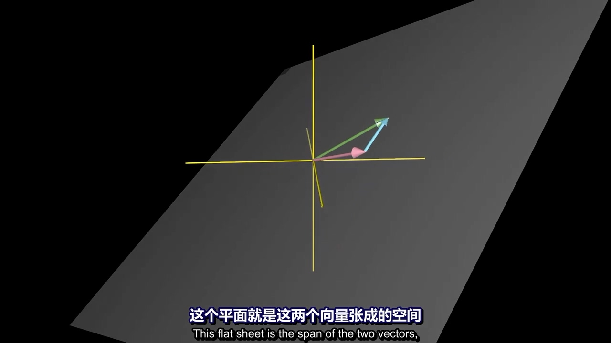

|在三维空间中, 3个斜率不相同的3维向量
|即 stem:[ a\vec{v} + b\vec{w} + c\vec{u} ], <- a,b,c 是系数. +
如果第三个向量, 恰好落在前两个向量所""张成的平面上, 则它们张成的空间, 依然是三维空间中的过原点的一个平面. +

如果第三个向量, 不能由前两个向量来"线性表示", 即他们是"线性无关"的, 则它们的"张成", 能遍及整个三维空间. +
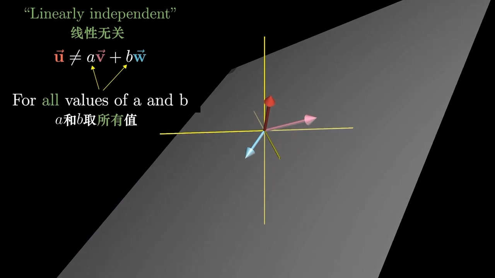

|===

通常, 我们就用向量的终点, 来代表该向量. (它的起点位于原点.) +
即: 当你考虑一个向量时, 就把它看成"箭头"; 当你考虑多个向量时, 就把它们看成"点".

---

== 变换 = 函数. "线性变换"的本质

"线性变换"中的"变换", 其实就是"函数"的意思. 它类似于函数所起的功能 : 输入一种形式, 而输出另一种形式. +
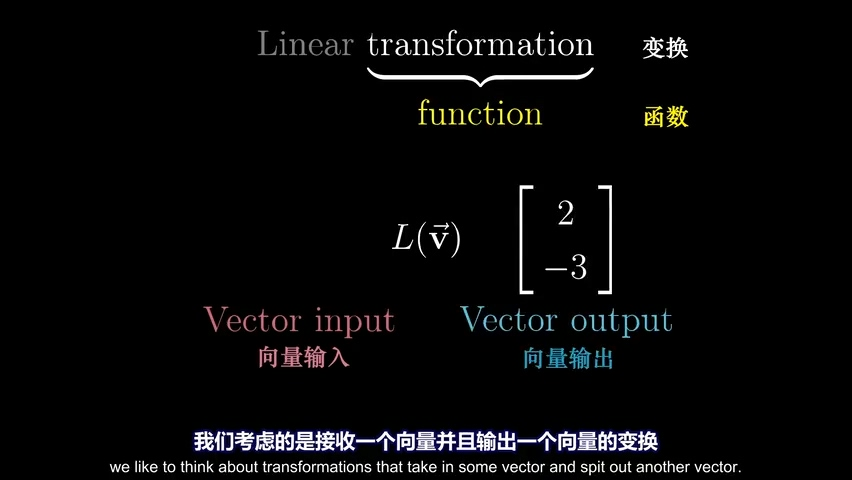

#如果一个变换, 接收一个stem:[ \vec{a}]向量, 并输出另一个stem:[ \vec{b}]向量, 我们就可以把它想象成: 该变换所起的功能, 其实就是将 stem:[ \vec{a}] 向量, 移动到 stem:[ \vec{b}] 向量的新位置处.#
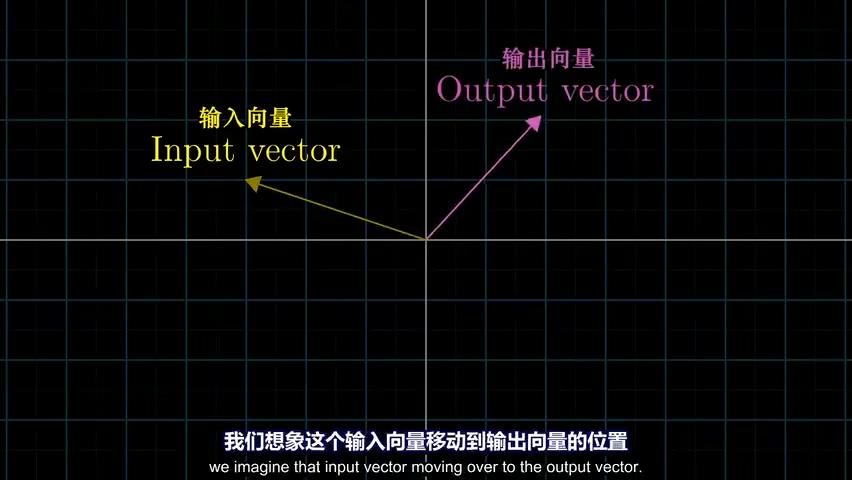

就像是黑洞会扭曲时空一样(变换了空间中的所有坐标点). +
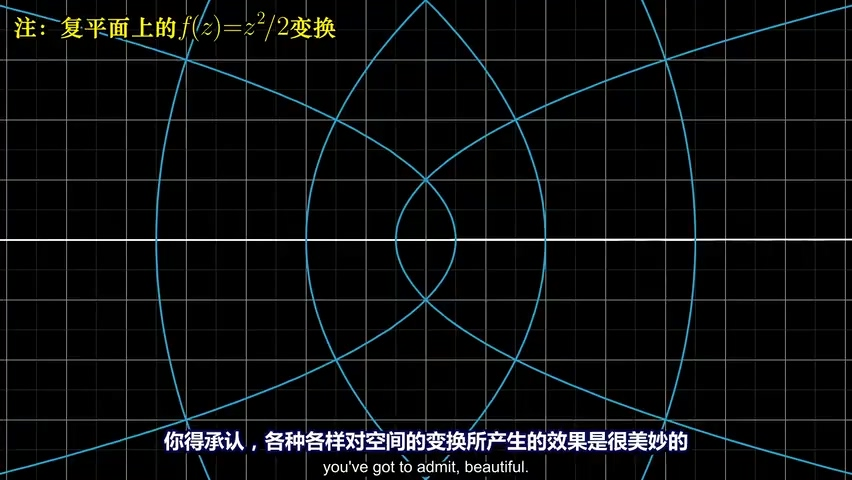

不过, "线性变换", 它不会球状扭曲原坐标轴, 变得弯曲化. 既然它称为"线性"的, 就只会进行"直线"式的扭曲, 如, ps中的"变形"一样. +
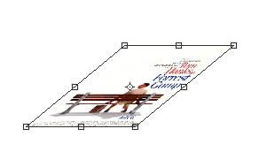

即: #如果一个变换具有以下两条性质, 它就是"线性"的变换:#
[options="autowidth"]
|===
|Header 1 |Header 2

|1.直线在变换后, 仍然保持为直线, 不能有所弯曲.
|如果变换后, 直线被弯曲了, 这就不是"线性变换"了. +
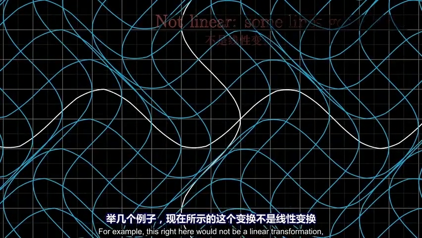

同样, 下面这个也不是"线性变换"了, 因为它让对角线变弯曲了. +
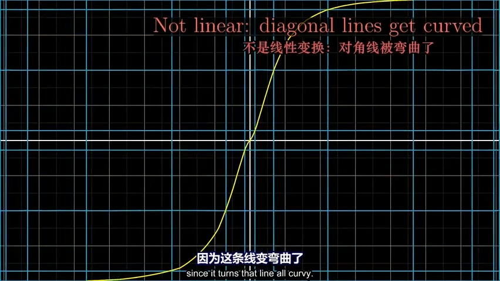

|2.原点必须保持固定在原位置 (the origin must remain fixed in place).
|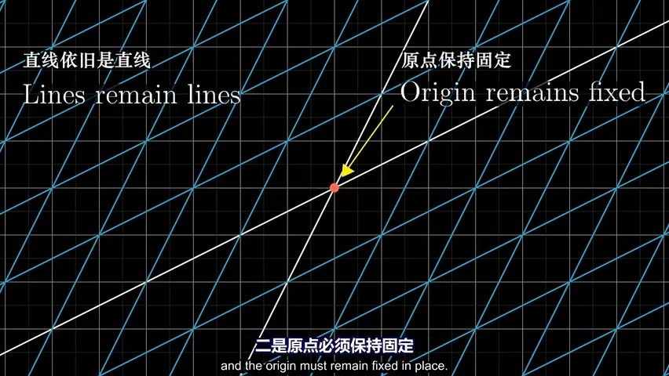

如果原点为移动位置了, 它也不是"线性变换". +
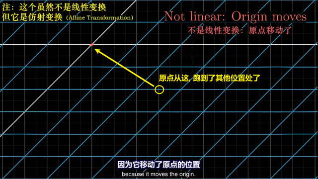
|===

所以, #"线性"这种变换, 不会改变网格间的"等距分布". 即, 变换前是等距的, 变换后依然是等距的.# +
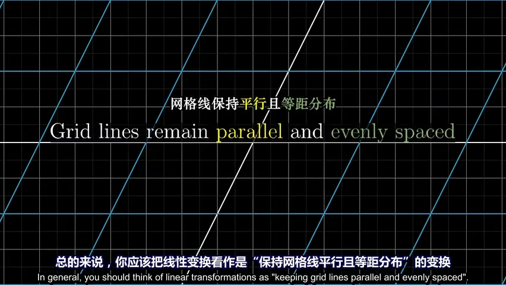

符合"线性"这种变换的有:

- 将图形, 围绕原点旋转
- 将图形, 斜切
- 将图形, 正反面对调(即反转)

给你一个原始坐标, 和变换位置后的坐标, 你如何知道它们变换了多少距离呢? +
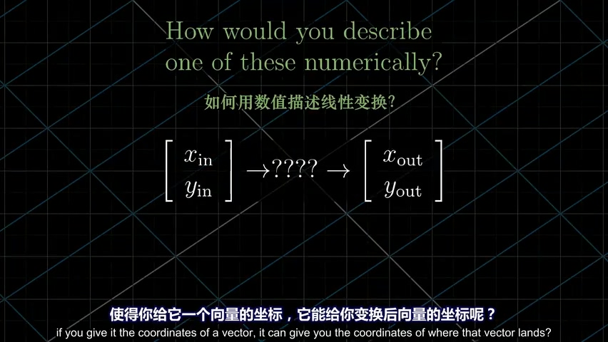

方法很简单: #你只需要记录两个基向量, 即stem:[ \hat{i}] 和stem:[ \hat{j}] 变换后的位置. 因为其他向量, 都会随之而动.# (可以想象成一个蛛网, 牵动其中一条边, 其他所有网格都会随之变形移动)

==== 例如:

[options="autowidth"]
|===
|Header 1 |Header 2

|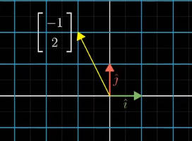 +
\begin{align}
\vec{v} = -1i +2j
\end{align}
|-> 变换为: +
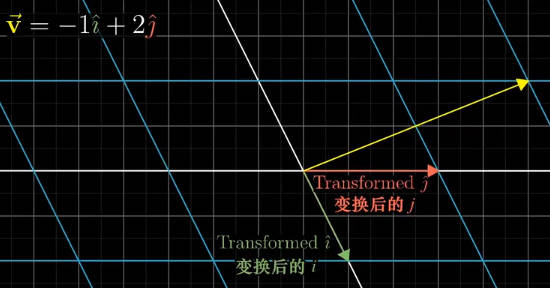 +
\begin{align}
\vec{v} = -1\hat{i} +2\hat{j}
\end{align}
|===

例如上图, 三个向量, 从左边变换到右边的位置.

#网格线保持"平行"且"等距分布", 有一个重要的推论:  变换前, 向量 stem:[ \vec{v}]是stem:[ \hat{i}] 和 stem:[ \hat{j}] 的一个特定线性组合; 那么"变换后的stem:[ \vec{v}]",  也是 "变换后的"stem:[ \hat{i}] " 和 "变换后的stem:[ \hat{j}]" 的同样的线性组合.#

这就意味着: 你可以只根据变换后的 stem:[ \hat{i}] 和 stem:[ \hat{j}] 所在位置 , 来推断出"变换后的stem:[ \vec{v}] 所在位置. (#相当于, 你的左右胳膊位置, 决定了你头的位置.#)

原"基"的坐标是:
\begin{align}
i = \begin{bmatrix}  1 \\  0\\  \end{bmatrix} ,
j = \begin{bmatrix}  0 \\  1\\  \end{bmatrix}
\end{align}

变换后的"基"的坐标是:
\begin{align}
\hat{i} = \begin{bmatrix}  1 \\  -2\\  \end{bmatrix} ,
\hat{j} = \begin{bmatrix}  3 \\  0\\  \end{bmatrix}
\end{align}

所以, 变换后的stem:[ \vec{v}] 的终点坐标就是:
\begin{align}
\vec{v} & = -1\hat{i} +2\hat{j} <- 相当于把"基"拉伸多少倍 \\
& = -1 \begin{bmatrix}  1 \\  -2\\  \end{bmatrix}
+ 2 \begin{bmatrix}  3 \\  0\\  \end{bmatrix} \\
& = \begin{bmatrix}  5 \\  2\\  \end{bmatrix}
\end{align}

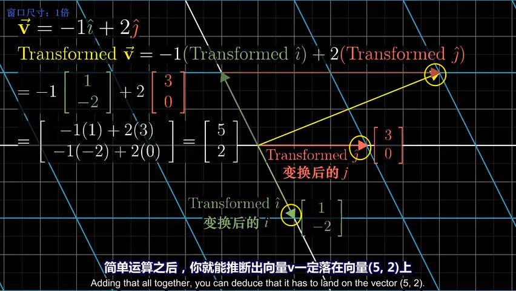

因此, #只要记录了变换后的 i帽 和 j帽, 我们就可以推断出任意向量在变换之后的位置.# 而完全不必去亲眼查看变换本身是什么样的. +
即: 一个二维平面上的线性变换, 可以仅由4个数字, 即"基"的新坐标(i帽坐标, 和j帽坐标), 来完全确定.

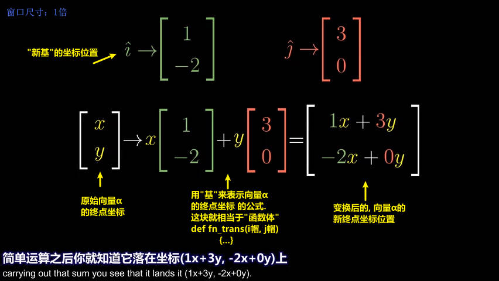

#通常, 我们将 i帽坐标, 和j帽坐标, 包装在一个 2*2的矩阵中.#

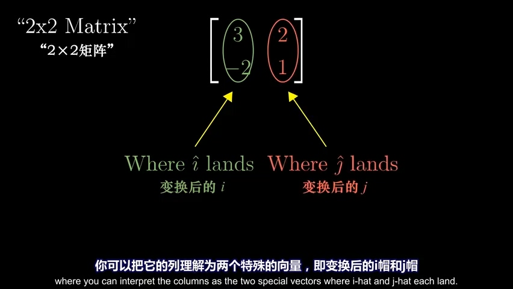

如果你有一个描述"线性变换"规则(简称T规则)的 2*2矩阵(简称T矩阵), 以及一个给定的原始向量stem:[ \vec{α}], 你想了解T规则 对 stem:[ \vec{α}] 的作用, 只需取出T矩阵中封装的"新基", 作为新的拉伸倍数, 代替掉原stem:[ \vec{α}]得出公式中的"拉伸倍数"即可.

比如:
\begin{align}
& 原始向量 c = \begin{bmatrix}  5 \\  7 \\  \end{bmatrix} \\
& 这个原始向量c, 可以拆解成两个"基向量"的和. 即 c= 5i + 7j, 其中, i =\begin{bmatrix}  1 \\0 \\  \end{bmatrix},
j =\begin{bmatrix}  0 \\1 \\  \end{bmatrix} \\
& 即,向量c终点坐标的位置, 相当于把基i=1 拉伸5倍, 基j拉伸7倍. \\
& 现在, 给定一个"新基"的坐标矩阵: \begin{bmatrix}  3 & 2 \\  -2 & 1 \\  \end{bmatrix} 其中, 第一列是"新基"的i坐标, 第二列是"新基"的j坐标. \\
& 那么, 在新基坐标轴中, 向量c的终点新坐标 (即"线性变换"后的结果), 就是拿"新基"代替"原始基"就能得到了: \\
& c =   5i + 7j = 5 \begin{bmatrix} 3 \\  -2 \\  \end{bmatrix} + 7 \begin{bmatrix} 2 \\  1 \\  \end{bmatrix} <- 这与"缩放基向量, 再相加"的思想是一致的.
\end{align}

3-6.52

