= 线性代数 - 可汗学院
:toc:
:toclevels: 3
:sectnums:

---

== 矩阵 matrix

=== (1)两个矩阵stem:[\underset{A行*A列}{A}] 和 stem:[\underset{B行*B列}{B}]要能相乘, 必须满足这个条件: 内侧的两个数要相等, 即 A列数 = B行数 , 矩阵A*B 才可行. 否则, 它们无法相乘. (2)相乘后得到的结果, 行数与列数是外侧的两个数. 即 A行, B列.

如, 下面有两个矩阵: stem:[\underset{2*4}{m1}] 和 stem:[\underset{4*2}{m2}], 即 m1矩阵是2行4列, m2矩阵是4行2列.

[options="autowidth"]
|===
|Header 1 |Header 2

|可以 m1*m2 吗?
|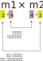

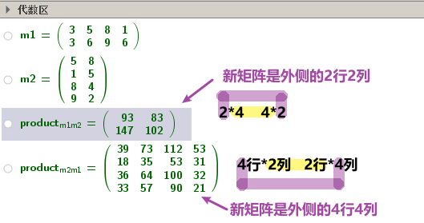

|===

---

=== 矩阵A * 矩阵A的逆矩阵 stem:[A^{-1}] = 单位阵I

[options="autowidth" cols="1a,1a"]
|===
|Header 1 |Header 2

|单位阵 I
|单位阵 I : 就是从左上到右下对角线(即"主对角线")上, 全是1, 而其他位置上全是0的矩阵.

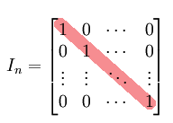

|逆矩阵  stem:[A^{-1}]
|从单位阵I, 可以得到一个新概念: 逆矩阵.  +

设A是一个n阶矩阵，若存在另一个 n阶矩阵B，使得： AB=BA=I ，则称方阵A可逆，并称方阵B是A的逆矩阵

即 : 如果有 stem:[A * A^{-1} = I], 并且反过来也是一样 stem:[A^{-1} * A = I] , 则 stem:[A^{-1}] 就是A的逆矩阵.

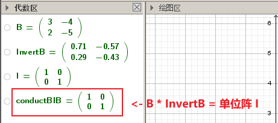
|===

逆矩阵的计算公式如下:

解法1::

若
\begin{align*}
A = \begin{bmatrix}  a & b \\  c & d \\  \end{bmatrix}
\end{align*}

则它的逆矩阵stem:[A^{-1}] 就是:

\begin{align*}
A^{-1} = \frac{1} {ad-bc} *  \begin{bmatrix}  d & -b \\  -c & a \\  \end{bmatrix}
\end{align*}

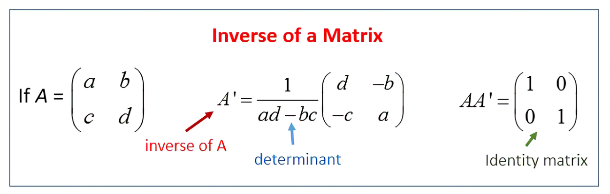

---

解法2::

假设一个矩阵是

\begin{align*}
A = \begin{bmatrix}  1 & 0 & 1 \\  0 & 2 & 1 \\  1 & 1 & 1\\  \end{bmatrix}
\end{align*}

我们在它的右边添加一个同纬度的单位矩阵, 变成一个增广矩阵:

即变成:

\begin{align*}
\left[
\begin{array}{ccc|ccc}
1 & 0 & 1 & 1 & 0 & 0 \\
0 & 2 & 1 & 0 & 1 & 0\\
1 & 1 & 1 & 0 & 0 & 1   \end{array}
\right]
\end{align*}

#只要我们把左边的"原始矩阵", 整理成"单位矩阵I"的时候, 竖线右边的矩阵, 就是左边"原始矩阵"的"逆矩阵"了!#

经过换算, 我们就得到下面的矩阵(注意, 竖线左边已经被转换成了单位矩阵):

\begin{align*}
\left[
\begin{array}{ccc|ccc}
1 & 0 & 0 & -1 & -1 & 2 \\
0 & 1 & 0 & -1 & 0 & 1\\
0 & 0 & 1 & 2 & 1 & -2   \end{array}
\right]
\end{align*}

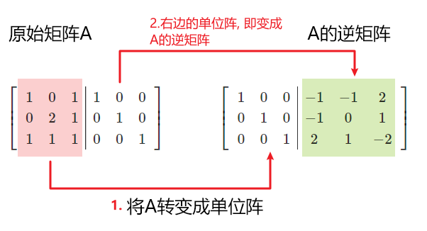

---

=== 矩阵用什么用? 用来解方程组 -> 对"方程组"的求解, 可以转成用"矩阵"的方法来求

比如,
\begin{align*}
\begin{cases}   3x+2y=7  \\  -6x+6y=6 \end{cases}
\end{align*}

借用矩阵来表示它, 其实就是:
\begin{align*}
\begin{bmatrix}  3 & 2 \\  -6 & 6 \\  \end{bmatrix}
\begin{bmatrix}  x\\  y \\  \end{bmatrix}
=
\begin{bmatrix}  7 \\  6 \\  \end{bmatrix}
\end{align*}

因为你能看出: +
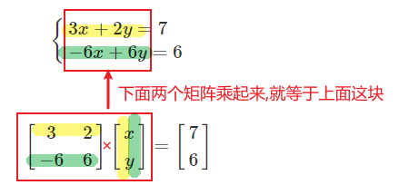

然后, 我们用三个字母来分别代表着三个矩阵:

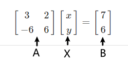

即: A*X = B

在它等号两边同时乘上一个逆矩阵stem:[A^{-1}], 等号不变. 即:

\begin{align*}
& A^{-1} * AX = A^{-1} B  \quad //A乘以它的逆矩阵 A^{-1}, 等于单位阵I \\
& I*X = A^{-1} B \\
& X = \frac{A^{-1} B} {I} \quad //任何矩阵除以单位阵I, 都等于该矩阵本身. 即I如同数字1一般的存在 \\
& X = A^{-1} B
\end{align*}

本题中, A的逆矩阵, 就是:

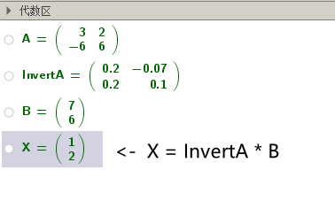

和你用传统的解方程法来算, 结果是完全一致的!

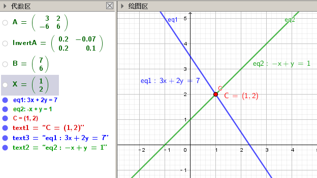

---

=== 矩阵有什么用?

假设有3个向量:

\begin{align*}
\vec{a} =  \begin{bmatrix} 3 \\ -6 \\  \end{bmatrix}, \quad
\vec{b} =  \begin{bmatrix} 2 \\ 6 \\  \end{bmatrix}, \quad
\vec{c} =  \begin{bmatrix} 7 \\ 6 \\  \end{bmatrix}, \quad
\end{align*}

并且它们有这个关系:

\begin{align*}
\vec{a} x +\vec{b}y = \vec{c}
\end{align*}

即, 将stem:[\vec{a}]的长度延伸成x倍, 再加上延伸y倍长度的stem:[\vec{b}] ,就等于 向量 stem:[\vec{c}]. 问: 此时 x 和 y 是什么值?

解:  +
我们先把向量 a,b,c 的具体值, 代进来:

\begin{align*}
& \begin{bmatrix} 3 \\ -6 \\  \end{bmatrix} x
+ \begin{bmatrix} 2 \\ 6 \\  \end{bmatrix}y
=  \begin{bmatrix} 7 \\ 6 \\  \end{bmatrix} \\
& \begin{bmatrix}  3 & 2 \\  -6 & 6 \\  \end{bmatrix} ×
\begin{bmatrix} x \\  y \\  \end{bmatrix}
= \begin{bmatrix}  7\\   6 \\  \end{bmatrix}
\end{align*}

即, 我们得到: #A*X = B 这种形式, X(即系数,倍数)就有现成公式可以算出的#, 是:

\begin{align*}
\boxed{
A*X = B \\
X = A^{-1} B
}
\end{align*}

通过计算, 就得到
\begin{align*}
X = \begin{bmatrix} 1 \\  2\\  \end{bmatrix}
\end{align*}

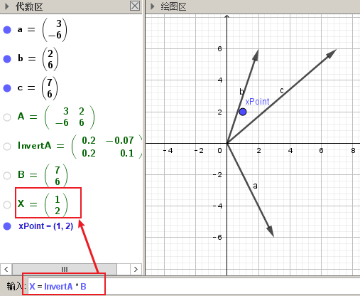

即, 证得:
\begin{align*}
\begin{bmatrix} 3 \\ -6 \\  \end{bmatrix} * 1
+ \begin{bmatrix} 2 \\ 6 \\  \end{bmatrix} * 2
=  \begin{bmatrix} 7 \\ 6 \\  \end{bmatrix}
\end{align*}

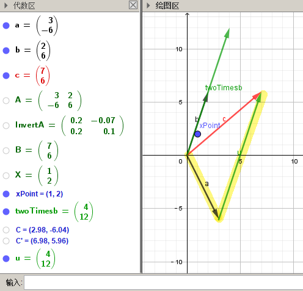

---

=== singular matrix 奇异矩阵 : 即它没有"逆矩阵"存在.

如果一个矩阵没有"逆矩阵"存在, 它就是"奇异矩阵 singular matrix" +

假设有一个矩阵为:
\begin{align*}
A = \begin{bmatrix}  a & b \\  c & d \\  \end{bmatrix}
\end{align*}

它的逆矩阵就是:

\begin{align*}
A^{-1} = \frac{1} {|A|}  \begin{bmatrix}  d & -b \\  -c & a \\  \end{bmatrix}
\end{align*}

什么时候, 一个矩阵没有逆矩阵? 即, #当满足什么条件时, 一个矩阵就是奇异矩阵  singular matrix ?#   +
#我们只要让它的"逆矩阵"公式失效就行了. 即, 只要让上面公式中的分母 |A| 等于 0. 让它无意义就行了.#

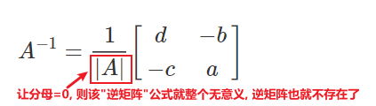

即: 我们要让 行列式 |A| = 0.

\begin{align*}
& 让 |A| = ad - bc = 0 \\
& ad = bc \\
& \frac{a} {b} =   \frac{c} {d}\\
& \frac{a} {c} =   \frac{b} {d}\\
\end{align*}

即, #若 a/c 的比值,  和 b/d 的比值, 相等, 则"逆矩阵"公式失效. 该矩阵无"逆矩阵"存在, 该矩阵就是 singular matrix.#

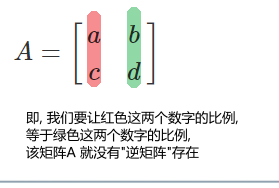

进一步, 我们来实际应用一下上面这个定理:

如果有下面的"线性组合"式子:

\begin{align*}
& \begin{bmatrix} a & b \\ c & d \end{bmatrix}
\begin{bmatrix} x \\ y \end{bmatrix}
=
\begin{bmatrix} e \\ f \end{bmatrix} \\
\\
& 即 \begin{bmatrix}  a \\  c \\  \end{bmatrix} x+
\begin{bmatrix}  b \\  d \\  \end{bmatrix} y =
\begin{bmatrix}  e \\  f \\  \end{bmatrix}\\
\\
& 即 \begin{cases}   ax+by=e  \\  cx+dy=f  \end{cases} \\
& \begin{cases}   y = \dfrac{e-ax}{b}   \\   y = \dfrac{f-cx}{d} \end{cases} \\
& \begin{cases}   y = -\dfrac{a}{b} x + \dfrac{e}{b}   \\ y = -\dfrac{c}{d} x + \dfrac{f}{d}    \end{cases} \\
\end{align*}

上面最后一行中, 这两个其实就是直线公式. 并且注意这里, #用红绿色圈出的部分, 其实就是"斜率"! 蓝色部分, 就是直线与y轴的截距.#

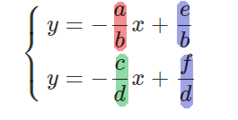

要让上面的矩阵关系式子, 不成立, 即等号不成立, 就只要让这两条直线的斜率, 相等就可以了.

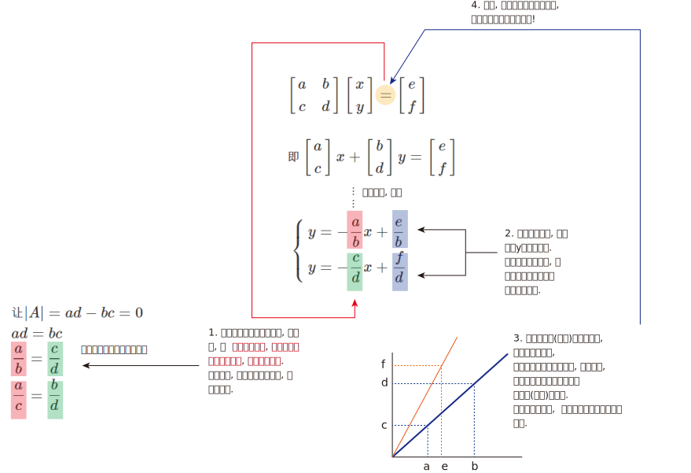

---

---

=== 三元线性方程组

==== 只有1个方程, 3个变量, 表示一个平面

二元(有2个变量)线性方程, 表示一条直线. +
#三元(有3个变量)线性方程, 表示一个平面.# +

例如:
\begin{align*}
& x + 4y + z = 8 \\
& 当 x, y =0时, z轴上就经过 =  8 \\
& 当 x, z =0时, y轴上就经过 =  2 \\
& 当 y, z =0时, x轴上就经过 =  8 \\
\end{align*}
即, 三维空间中的平面, 是由3个点(分别处在3个维度上)确定的.

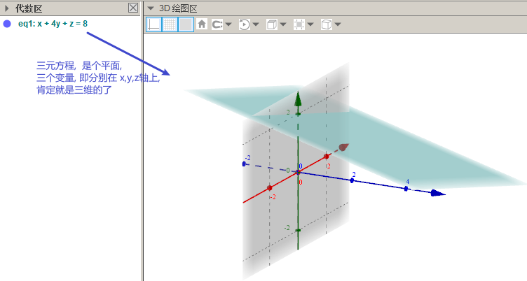

上图, red 为 x轴, green 为 y轴, blue 为z轴.

---

==== 有2个方程, 3个变量, 它们的方程组解集, 表示这两个平面相交处的"共线"

#如果有两个"三元线性方程", 就是有两个平面, 它们的共同解(x,y,z值), 就是这两个平面相交处的那条交线.#

如:
\begin{align*}
\begin{cases}
& x + 4y + z = 8 \\
& x + y + 3z = 3 \\
\end{cases}
\end{align*}

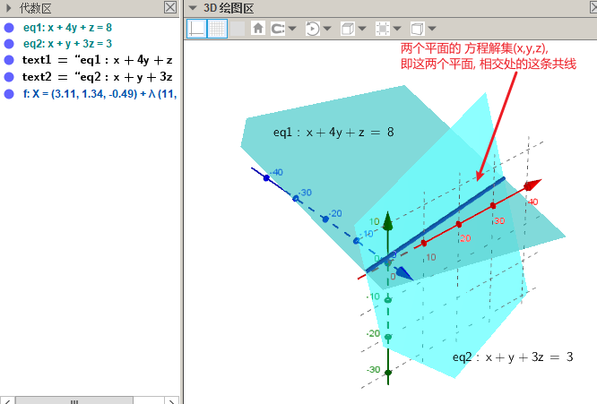

---

==== 有3个方程, 3个变量, 它们的方程组解集, 表示这三个平面相交处的"共点"

如:
\begin{align*}
\begin{cases}
& x + 4y + z = 8 \\
& x + y + 3z = 3 \\
& -x + -y -z = 0 \\
\end{cases}
\end{align*}

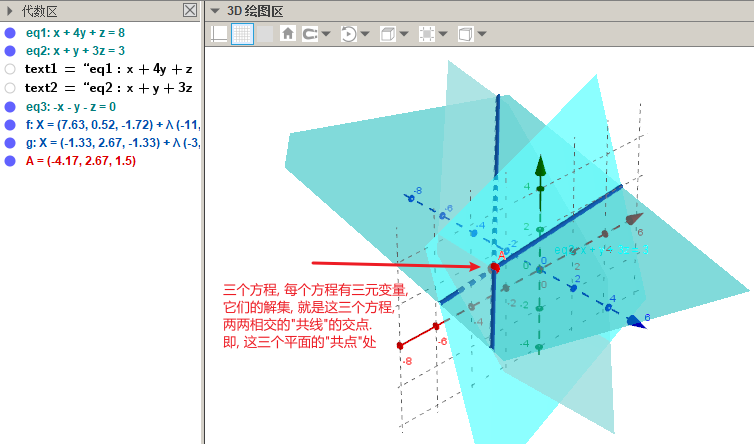

---

