:toc:
:toclevels: 3
:sectnums:

== 向量空间

---

== matrix basis

A矩阵中的列, 并不一定都"线性无关".

而"基"的概念, 它必须满足两个要求: +
1."基"之间彼此是"线性无关"关系. +
2. 这些"基", 能 span 张成整个空间.

比如, 三维空间 stem:[ R^3] 中的基:

可以是::
\begin{align}
\left| \begin{array}{l}
	1\\
	0\\
	0\\
\end{array} \right|,\ \left| \begin{array}{l}
	0\\
	1\\
	0\\
\end{array} \right|,\ \left| \begin{array}{l}
	0\\
	0\\
	1\\
\end{array} \right|
\end{align}

也可以是::
(假设下面三列是线性无关的. 其实 麻省理工 Gilbert Strang 老师犯了错误, 因为下面的矩阵, 第一行和第二行完全相同, 本身就已经是线性相关的了.)
\begin{align}
\left| \begin{array}{l}
	1\\
	1\\
	2\\
\end{array} \right|,\ \left| \begin{array}{l}
	2\\
	2\\
	5\\
\end{array} \right|,\ \left| \begin{array}{l}
	3\\
	3\\
	8\\
\end{array} \right|
\end{align}
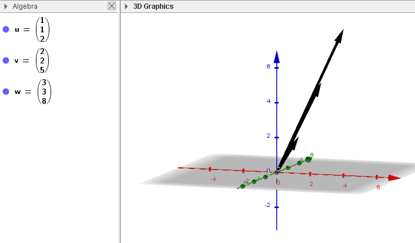

可以看出, 这组基, 相当的斜切, 坐标轴空间变形非常严重.

所以, 某维度空间中的基, 可以有无数个的(相当于多元宇宙).

但是, 这里有个定理: **对于给定的空间(stem:[ R^3, R^n] 或 "列空间"等等), 无论空间里有多少组基, "每组基"中的向量的个数, 是相同的.** 也就是只是把同一个原始空间, 做各种扭曲而已, 这不会改变空间中"基"的数量.

---

== space dimension

注意: rank 的概念 是属于"矩阵"的, 而不是属于"空间"的. 只有 matrix 有 rank.

---

== ----- -----

---

== 四大子空间(是"线性代数"的核心)

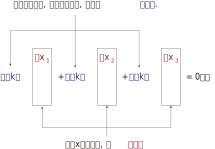

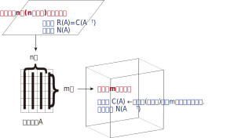

[options="autowidth"]
|===
|stem:[ A_{m \times n}] |该"子空间"是属于哪个维度下的子空间?

|列空间 stem:[ C(A)]
|stem:[ N(A) \in R^m] 的子空间. <- 列空间所处的维度, 是经过矩阵A, 投射到的维度(异世界).

|行空间 stem:[ R(A) = C(A^T)]
|stem:[ C(A^T) \in R^n] 的子空间.

|零空间 stem:[ N(A)]
|stem:[ N(A) \in R^n] 的子空间.

|左零空间stem:[ N(A^T)]
|stem:[ N(A^T) \in R^m]  的子空间.
|===

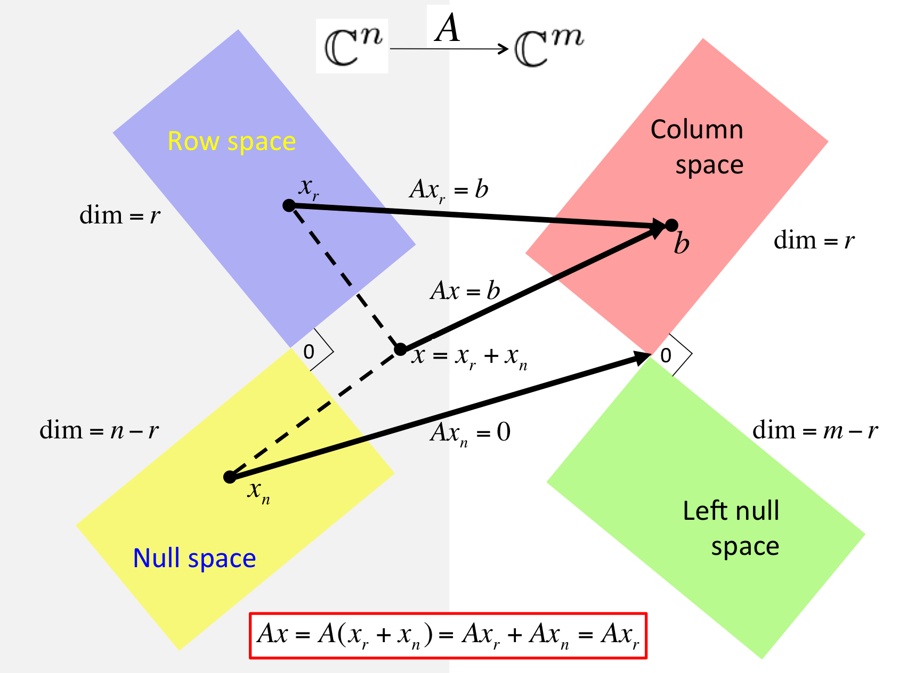

[options="autowidth" cols="1a,1a"]
|===
|原像的空间 (n维) |新像的空间 (m维)

|stem:[ R(A)]
|stem:[ C(A)]

|stem:[ N(A)]
|stem:[ N(A^T)]
|===

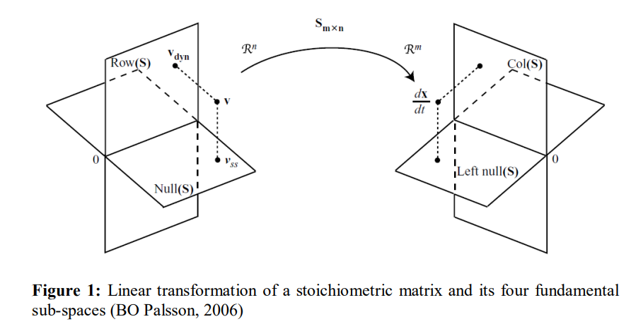

对于每个子空间, 我们都要问两个问题: 1.基 basis. 2.维度 dimension. 是怎样的.

维度::
- 一组基中, 向量的个数, 即"维度".

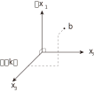

- 矩阵的"秩" rank, 是"主元列"的数目. 它也是空间(子空间, 列空间等等)的"维数".

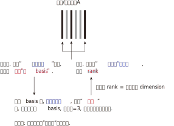

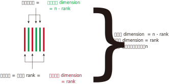

---

=== #Col(A) 列空间# -> stem:[ C(A)]

**矩阵A的"列空间", 是由其"列向量"的所有"线性组合"的集合, 构成一个空间.** 所以英文就是  column space 或 column span (列向量的所有线性组合的"张成").

例如:
\begin{align}
A=\left[ \begin{matrix}
	1&		1&		2\\
	2&		1&		3\\
	3&		1&		4\\
	4&		1&		5\\
\end{matrix} \right]
\end{align}

A的列空间是由:
\begin{align}
\left[ \begin{array}{l}
	1\\
	2\\
	3\\
	4\\
\end{array} \right],
\left[ \begin{array}{l}
	1\\
	1\\
	1\\
	1\\
\end{array} \right],
\left[ \begin{array}{l}
	2\\
	3\\
	4\\
	5\\
\end{array} \right]
\end{align}

这三个向量所张成的子空间。

显然, 该子空间包括了这3个列向量本身, 及它们的各种线性组合.

**这个矩阵A 的列向量, 均是空间中的四维向量，所以可以说A的"列空间", 是stem:[ R^4] 的子空间。**

那么这个"列空间"有多大呢？ 既然是由所有列的线性组合的集合, 那其实就是等于 stem:[ A\vec{x} = \vec{b}] 中的 stem:[\vec{b}]了。

比如:

\begin{align}
A\overrightarrow{x} = \left[ \begin{matrix}
	1&		1&		2\\
	2&		1&		3\\
	3&		1&		4\\
	4&		1&		5\\
\end{matrix} \right] \left| \begin{array}{l}
	x_1\\
	x_2\\
	x_3\\
\end{array} \right|=\left| \begin{array}{l}
	b_1\\
	b_2\\
	b_3\\
	b_4\\
\end{array} \right|
\end{align}

我们发现, 本例的矩阵A, 只有3列, 即3跟轴. 每个轴(或基)是由4个数字来定位坐标的, 即每根轴处在4维空间中.

**显然, 对于一个四维空间, 是无法用三个"基"(三个未知元,代表三个轴)来撑满的.  因此, 由这三个"基轴"张成的空间, 也只能是 stem:[ R^4] 空间中的部分子空间.**

---

==== Col(A) 的 dimension 维度数 = rank

列空间的维度数 dimension = 矩阵的 rank数

---

==== Col(A) 的 basis 基 = 主元列的列数

列空间的 basis  = 即"阶梯形"主元数量 = 主元列的列数

---

==== Col(A) 的正交补, 是"左零空间". 即: stem:[ (C(A))^⊥ = N(A^T)]

---

=== #Row(A) 行空间# -> stem:[ R(A) = C(A^T)]

一般, 我们把矩阵A 转置一下, 就能使用"列空间"技巧来处理"行空间"了. 即: stem:[ Col(A^T)]

---

==== Row(A) 的 dimension 维度数 = rank

行空间的维度数 dimension = 矩阵的 rank数

行空间 和 列空间, 有相同的维度数 = 该矩阵的 rank 数.

---

==== Row(A) 的 basis 基

---

==== Row(A) 的正交补, 是零空间. 即: stem:[ (R(A))^⊥ = N(A)]

---

=== #Null(A) 零空间# -> stem:[ N(A)]

==== 零空间的几何解释

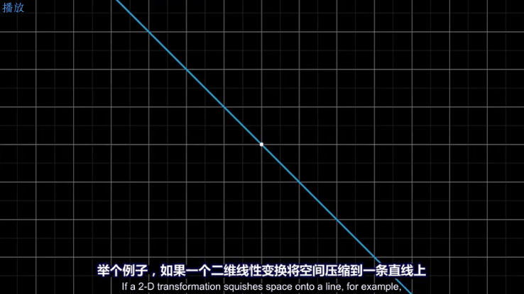

将一个二维平面, 变换降维成一条直线, 则该物体一定会有一列(即一整条直线的部分), 被压缩到原点(0,0)上. +
变换后落在原点的原向量的集合, 就称为新基矩阵A 的"零空间" 或 "核" kernel.

**变换后, 会有一些向量落在原点上, 而"零空间", 正是这些向量所构成的空间.**

image:../img/0037.png[,500px]

**对于 stem:[ A\vec{x} = \vec{0}] 来说, A的零空间, 即线性方程组 stem:[ A\vec{x} = \vec{0}]  的所有解 (即原像 stem:[ \vec{x}]) 的集合。**

矩阵A 的零空间, 记为: stem:[ N(A)]

如:

\begin{align}
A = \left[ \begin{array}{c|c|c}
	1&		1&		2\\
	2&		1&		3\\
	3&		1&		4\\
	4&		1&		5\\
\end{array} \right]
\end{align}

**矩阵A的"零空间"是什么? 就是 stem:[ A \vec{x} = \vec{0}] 的所有的原像stem:[ \vec{x}], 所构成的一个空间.**

其 stem:[ Ax=0] 就是:

\begin{align}
\underset{A}{\underbrace{\left[ \begin{matrix}
	1&		1&		2\\
	2&		1&		3\\
	3&		1&		4\\
	4&		1&		5\\
\end{matrix} \right] }}\underset{\overrightarrow{x}}{\underbrace{\left| \begin{array}{l}
	x_1\\
	x_2\\
	x_3\\
\end{array} \right|}}=\underset{\overrightarrow{0}}{\underbrace{\left| \begin{array}{l}
	0\\
	0\\
	0\\
	0\\
\end{array} \right|}}
\end{align}

零空间就是原像stem:[ \vec{x}] 所构成的空间. 本例中, x有三个分量(即, x向量, 有三个值来定位住它的坐标值, 即x向量处在三维空间中), 所以A矩阵的"零空间"是 stem:[ R^3] 中的子空间。

image:../img/0078.svg[,500]

**注意比较: 对于一个 stem:[ m \times n] 的矩阵来说**:

- **其"列空间", 是 stem:[ R^m] 的子空间. <- 即是 A矩阵 所投射到的"新维度空间"的子空间.**
- **其"零空间", 是 stem:[ R^n] 的子空间. <- 即是原像stem:[ \vec{x}] "自己所属维度"的子空间.**

也可以说: stem:[ fnA(x)=b] : +
-> 原像x的维度, 就是"零空间"的母空间.  +
-> 输出值b的维度, 是"列空间"的母空间.

如:

\begin{align}
A\overrightarrow{x}=\overrightarrow{b}\ \rightarrow \underset{A}{\underbrace{\left[ \begin{matrix}
	1&		1&		2\\
	2&		1&		3\\
	3&		1&		4\\
	4&		1&		5\\
\end{matrix} \right] }}\underset{\overrightarrow{x}}{\underbrace{\left| \begin{array}{l}
	x_1\\
	x_2\\
	x_3\\
\end{array} \right|}}=\underset{\overrightarrow{b}}{\underbrace{\left| \begin{array}{l}
	b_1\\
	b_2\\
	b_3\\
	b_4\\
\end{array} \right|}}
\end{align}

求"零空间"和"列空间"的一般方法, 是通过"消元"来进行. 但本例中, 我们能直接看出来 stem:[ \vec{x}] 的解:

[options="autowidth"]
|===
|本例, |Header 2

|矩阵A的"列空间"
|因为列向量, 是有四个数字来定位坐标的, 所以"列向量"处在4维空间中. 所以列空间, 就是属于stem:[ R^4] 的子空间.

|矩阵A的"零空间"
|它不包含右侧的stem:[ \vec{b}], **它包含 stem:[ A \vec{x} = \vec{0}] 中 所有的解(即原像x).**  本例中, stem:[ \vec{x}] 的所有的解, 是三维的, 属于 stem:[ R^3] 的子空间.

我们可以看出, 其原像stem:[\vec{x}], 有一个是:  stem:[ \vec{x} = \[1,1,-1\]^T] , 事实上是, stem:[ \vec{x} = \[c,c,-c\]^T].

即:
\begin{align}
\vec{x} = c \left\| \begin{array}{l}
	1\\
	1\\
	-1\\
\end{array} \right\| <- 这个向量, 就是A的零空间
\end{align}

另外, 零空间必然包含stem:[ \vec{0}]. 因为 stem:[ \vec{x}=  \vec{0}].

注意: "向量空间"这个概念, 必须包含原点. 如果你解出的原像stem:[ \vec{x}] 不包含原点(不经过原点), 即, 它是一个不经过原点的平面或直线, 那它就不能被称为"空间"了, 当然也就不是"子空间"了.

所以, 本例的A矩阵, 其"零空间", 即原像 stem:[ \vec{x}]的集合, 是一条 stem:[ R^3]中的直线, 经过原点.

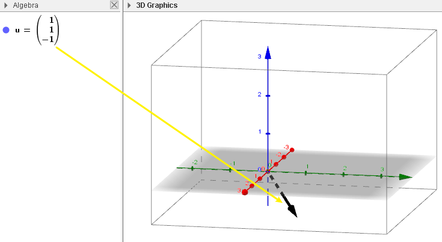

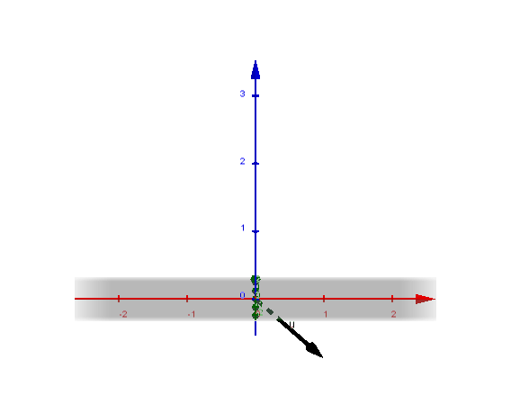

|===

---

==== Null(A) 的 dimension 维度数 = 矩阵的列数n - 主元列数 rank

**矩阵的列数, 减去"主元列数"(即"基本变量"的数目, 即 rank数), 剩下的就是"自由变量"数目.**

零空间的维度数 dimension = 矩阵中"自由变量"的数目 = (矩阵的列数n - 主元列数 rank)

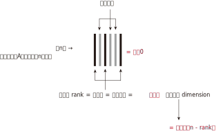

---

==== Null(A) 的 basis 基

每个特解 special solution 都是从"自由变量"得出的. 特解也是零空间中的一组基.

---

=== #左零空间# -> stem:[ N(A^T)]

A转置后的零空间: stem:[ N(A^T)] <- 也叫"左零空间" the left null space of A.

stem:[ A^T\vec{x} = \vec{0}] 的原像stem:[ \vec{x}]集合, 就是构成"左零空间".

\begin{align}
A^T\vec{x} & = \vec{0} \\
左右两边取转置 : (A^T x)^T & = 0^T \\
x^T A & = 0 ← 你发现原像x在矩阵A的左边, 所以x就构成A的"左零空间".\\
\end{align}

---

==== stem:[ N(A^T)] 的 dimension 维度数 = 矩阵的行数m - rank

因为A的转置就变成 n行m列, m列 - 主元列数(=rank) = 维度数

左零空间的维度数 dimension = 矩阵的行数m - rank

---

==== stem:[ N(A^T)] 的 basis 基

---
