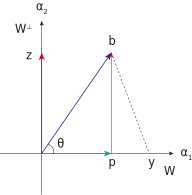
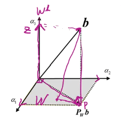
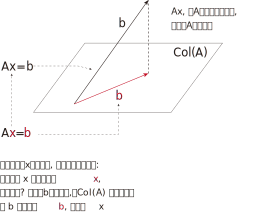
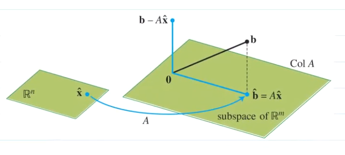
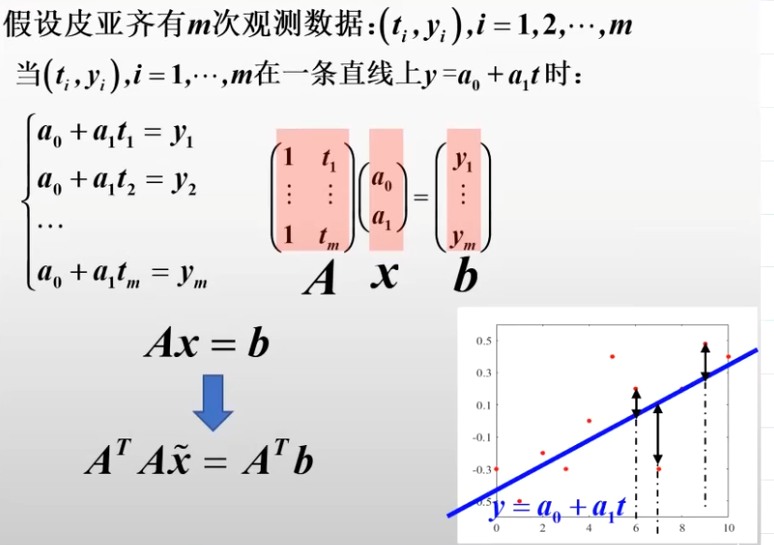
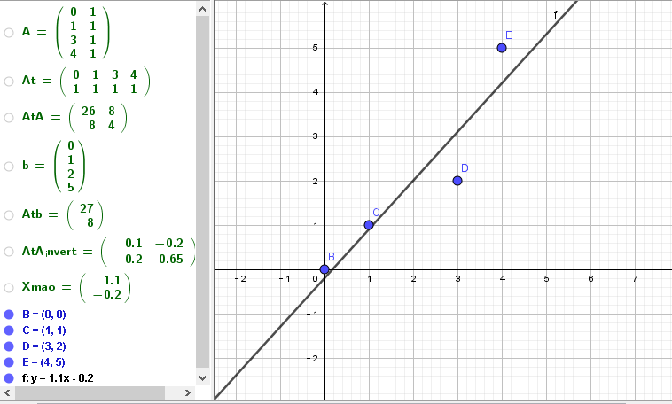
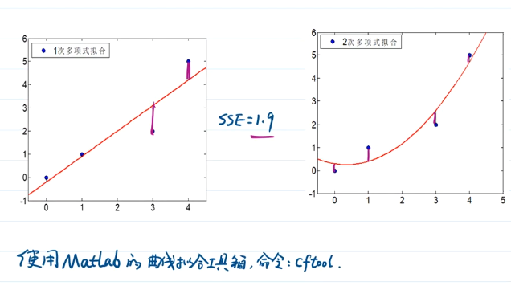

:toc:
:toclevels: 3
:sectnums:

== 正交投影定理 Orthogonal projection

[options="autowidth"]
|===
|Header 1 |Header 2

|
|<- 如图, w 是由stem:[ \alpha_1] 生成的"子空间". w子空间的正交补, 就是stem:[ w^⊥] 子空间.

b向量, 可以分解为两个向量, 一个在w子空间上 (也即stem:[ \vec{p}]), 一个在stem:[ w^⊥] 子空间上 (即stem:[ \vec{z}]). 即: stem:[ \vec{b} = \vec{p} + \vec{z} ]

b到w子空间的距离最短值, 就是bp这条线段(也就是向量z). 比如, by线段的长度, 是要大于bp线段的.

所以, stem:[ \vec{p}] 就称为: stem:[ \vec{b}] 在 w空间上的"正交投影".

|
|<- 如图, 向量 stem:[ α_1] 和 stem:[α_2 ] 满足正交关系. 它们生成了 W空间.

b向量, 可以分解为两个向量之和, 一个在w空间中, 另一个在w空间的"正交补"(即 stem:[ α_3]向量生成的空间)中. 即: stem:[ \vec{b} = \vec{p} + \vec{z}] +
stem:[ \vec{p} \in W] 子空间 +
stem:[\vec{z} \in W^(⊥)] 子空间 +

|===

"正交投影(orthogonal projection)定理"就是: ::

- 母空间stem:[ R^n]中, 有一个子空间W. +
母空间中有一个向量b, 该stem:[ \vec{b}] 可以分解为两个向量的和, 即可以有 stem:[ \vec{b} = \vec{p} + \vec{z}]. 其中, stem:[ \vec{p} \in W]子空间. stem:[ \vec{z} \in W^⊥]子空间. 即: stem:[ \vec{p}] 是 stem:[ \vec{b}] 在 W子空间上的"正交投影". 记为: stem:[ P_w b] <- 从右往左看, 即:b投射到w空间上的"正交投影".

- W子空间里面, 还有一个向量y, 该y不是向量p. 则必有: stem:[ ‖b-p‖<‖b-y‖].

- 若w子空间的一组正交基, 是 stem:[ \alpha_1, α_2,... α_r], 则有:
\begin{align}
P_w b = \frac{b \cdot α_1}{α_1 \cdot α_1} α_1 + \frac{b \cdot α_2}{α_2 \cdot α_2} α_2 + ... + \frac{b \cdot α_r}{α_r \cdot α_r} α_r
\end{align}

---

== 最小二乘法 ordinary least squares

现实中, stem:[ Ax=b] 往往是无解的, 即找不到精确的原像x. 我们的策略是: 来找到一个替代的 stem:[ \hat{x}] (即x的近似值), 使 stem:[A \hat{x} ] 的值 越接近b越好. 即, 让 stem:[ ‖A \hat{x} - A x ‖], 即 stem:[ ‖A \hat{x} - \vec{b} ‖] 越小越好.

所以, 所谓的"最小二乘问题", 就是求stem:[ Ax=b] 的原像x 的近似解. +
即, 找一个 stem:[\hat{x}], 该stem:[ \hat{x}  \in Col(A) ], 使 stem:[ ‖A \hat{x} - \vec{b}‖] 最小. +
stem:[ \hat{x}  ] 即"最小二乘解".

显然, **在 C(A) 中 与 b 距离最小的向量, 就是 b 在 C(A) 的"正交投影向量", 即: stem:[P_{col(A)}b ].**

我们要找到x的近似值 stem:[ \hat{x}], 就是有这种关系:
stem:[ A \hat{x} = P_{col(A)}b ]

根据上图的关系可知: stem:[ b - A \hat{x} \in C(A)^⊥]  <- 即 向量b 可以分解为两个向量的和.

注意: b 是不在A的列空间中的, 因为b如果在里面, x就有解了, 即就能找到x的原像了. 我们也不需要去找它的近似值 stem:[ \hat{b}  ] 了.

既然 b 不在 A 的列空间里, 我们的策略就转为: 在A的列空间中, 去找一个与 b 距离最接近的 向量stem:[ \hat{b}  ]. 这个目标向量stem:[ \hat{b} ], 就是 b 在 A的列空间上的"正交投影向量".

有了stem:[ \hat{b} ], 我们就能通过 stem:[ A \hat{x} = \hat{b}] 等式, 来倒推回去找出 stem:[  \hat{x}].

同时, b向量, 可以分解为两个向量的和, 如图, 即:
stem:[ \vec{b} =  \hat{x} + (b-A \hat{x})]

stem:[ \vec{b}] 和  stem:[b-A \hat{x} ] 这两个向量, 是正交关系. 所以,  stem:[b-A \hat{x} ] 这个向量, 就在 A的列空间的"正交补"空间中. 即: stem:[ b-A \hat{x} \in (C(A))^⊥]

"列空间"的正交补, 是"左零空间". 所以, stem:[ b-A \hat{x}] 这个向量, 就是属于"左零空间"里的.

"列空间"的正交补, 是"左零空间", 就是:
stem:[ (C(A))^⊥ = N(A^T)]

零空间, 是 stem:[ Ax=0] 的原像集合.

同理, 左零空间, 就是: stem:[ A^T (?) = 0] 的原像 (此处用问号?代替) 的集合. 既然 stem:[ b-A \hat{x}] 这个向量, 在"左零空间"里. 那就把它代入进去, 替代掉问号这个占位符.

就有:
\begin{align}
& A^T (b-A \hat{x}) = 0 \\
& A^T A \hat{x} =  A^T b \\
& \underset{A}{\underbrace{\left( A^TA \right) }}\underset{x}{\underbrace{\hat{x}}}=\underset{b}{\underbrace{A^Tb}} ← 称为"正规方程 normal \; equation"(或"法方程") \\
& 注意: A如果是 m \times n的矩阵, A^T 就是 n \times m 的矩阵,  A^T_{n \times m} A_{m \times n} 就是 n \times n 的方阵, 有逆存在. \\
& 两边同时乘上 (A^T A) 的逆, 就能暴露出 \hat{x} : \\
& \hat{x} =  (A^T A)^{-1} A^T b ← 注意: A不是方阵, 是无逆阵的.
\end{align}

.标题
====
例如： 某观测数据如下, 不同时间, 有不同的结果:

[options="autowidth"]
|===
|Header 1 |Header 2 |Header 3 |Header 4 |Header 5

|time (t)
|0
|1
|3
|4

|value (v)
|0
|1
|2
|5
|===

本观测, 只有两个变量, 估计应该能用一条直线 (y=kx+b) 来拟合.

即, value = k * time + b. <- 我们要求出 k (下面用stem:[ x_1]表示) 和 b (下面用stem:[ x_2]表示) , 这两个未知元.

那么把所有的观测数据, 代入这个直线公式, 有:

\begin{align}
\left\{ \begin{array}{l}
	0\ =\ 0 x_1\ +\ x_2\\
	1=\ 1 x_1\ +\ x_2\\
	2\ =3 x_1\ +\ x_2\\
	5=\ 4 x_1\ +\ x_2\\
\end{array} \right.
\end{align}

用  stem:[ A \vec{x} = \vec{b}] 的形式, 就是:

\begin{align}
A\ =\ \left[ \begin{matrix}
	0&		1\\
	1&		1\\
	3&		1\\
	4&		1\\
\end{matrix} \right] ,\ \vec{x} =\left[ \begin{array}{c}
	x_1\\
	x_2\\
\end{array} \right] ,\ \vec{b}\ =\ \left[ \begin{array}{c}
	0\\
	1\\
	2\\
	5\\
\end{array} \right]
\end{align}

显然, 这个 stem:[ A \vec{x} = \vec{b}] 是找不到精确的原像x 的, 我们只能找它的近似解 stem:[ \hat{x}].

近似解 stem:[ \hat{x}] 的公式就是:

\begin{align}
\hat{x} =  (A^T A)^{-1} A^T b
\end{align}

算出来后,
\begin{align}
\hat{x} = \left[ \begin{array}{c}
	1.1\\
	-0.2\\
\end{array} \right]
\end{align}

即: stem:[ x_1 = 1.1, \quad  x_2 = -0.2]

拟合的直线公式就是:
\begin{align}
& y = kx + b \\
& y(y坐标, 存放value值) = k(即未知元x_1) * x(x坐标, 存放 time值) + b(即未知元x_2) \\
& y = 1.1x - 0.2
\end{align}

====

.标题
====
例如： 抛物线的方程是: stem:[y=ax^2+bx+c ]

我们有以下观察到的数据, 需要找一个能拟合它们的抛物曲线.

time(放x轴上): 0, 1, 3, 4 +
value(放y轴上): 0, 1, 2, 5

把观察所得数据, 代入抛物线方程. 来做.

====

