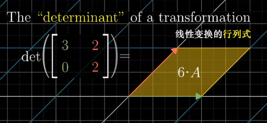
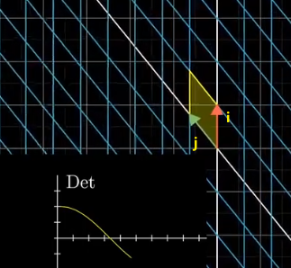
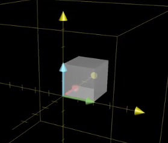

:toc: left
:toclevels: 3
:sectnums:

== 行列式的值, 表示的是"新基"的面积 (stem:[ \hat{i} * \hat{j}]), 比原基的面积(stem:[ i * j]) 大多少倍

即: +
\begin{align}
|D| = \frac{ \hat{i} * \hat{j}}{ i * j}
= \frac{新基的面积}{原基的面积}
\end{align}

---

==== "原基矩阵"的行列式的值

\begin{align}
\left| \begin{matrix}
	1&		0\\
	\underset{i}{\underbrace{0}}&		\underset{j}{\underbrace{1}}\\
\end{matrix} \right|=1*1\ -\ 0*0\ =\underset{=i*j}{\underbrace{1}}\
\end{align}

image:../img/0029.png[]

---

==== "新基矩阵"的行列式的值

如: +
\begin{align}
\left| \begin{matrix}
	3&		2\\
	\underset{i}{\underbrace{0}}&		\underset{j}{\underbrace{2}}\\
\end{matrix} \right|=3*2\ -\ 2*0\ =\underset{=i*j}{\underbrace{6}}\
\end{align}

即, 由"新基"中的两个基向量, 组成的平行四边形的面积 = 6.

所以, **行列式的值, 其几何意义, 本质就是表示: 把原基 stem:[ (i*j)] 这个单元面积, 缩放了多少倍.**

[options="autowidth"]
|===
|Header 1 |Header 2

|stem:[ \| D \|=3 ]
|就意味着, 新基坐标系下, 它已将"原基"的面积 stem:[ (i*j)], 缩放为了原来的3倍. 即:  stem:[\hat{i} * \hat{j} = 3(i*j) ].

| stem:[ \| D \|=0 ]
|新基矩阵A 里面, 存放的是新基的坐标. 只要 stem:[ \|A\| \ne 0], 就说明原坐标系空间, 还没有被压缩降维. 那么它就存在 stem:[ A^{-1}].

如果 stem:[ \| D \|=0 ] 了, 就意味着, "原基"已被压缩到一条直线上, 甚至一个点上. 被降维了.

|stem:[\|D\|=负值 ]
| 这意味着, 原坐标系已经被翻转了, 正反面翻转 (invert the orientation of space). 这就被称为"空间定向"发生了改变. 此时, 行列式的值, 就会变成负值.

|===

当 i 与 j 越来越靠近, 它们围成的平行四边形的面积, 就越来越小. 即坐标系空间, 被压缩得越来越严重. 当 i 与 j 完全重合时, 它们就共线了, |D| = 0.

---

== 在三维空间中, 行列式的值, 表示的就是: 体积的缩放倍数.

三维空间中, 原基的行列式的值 stem:[= i * j * k = 1 * 1 * 1 = 1]

在做了变换后, stem:[ |D| = \hat{i} * \hat{j} * \hat{k}] 会从原立方体, 变为一个斜不拉几的立方体 (即"平行六面体"). after the  transformation, the cube might get wrapped into some kind of slanty cube.

image:../img/0033.png[]

三维空间中, stem:[ |D|=0], 就意味着整个空间被压缩成 0体积的东西, 即一个平面, 或一条线, 甚至是一个点. 换言之, 此时的新基 stem:[ \hat{i}, \hat{j}, \hat{k}] 线性相关了.

若 |D|是负值, 就意味着整个坐标系的"定向"发生了改变. +
你可以用"右手螺旋法则" 来确定坐标系的"定向"是否发生了改变.

---

==== 右手螺旋法则

---

