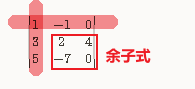
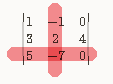

-
- 行列式中, ==一个元素的"余子式" (minor): 即 把这个元素所在的行和列, 删掉后, 剩下的行列式.== 就是这个元素的"余子式".
	- > -minor :  
	  /ˈmaɪnə/ ADJ You use minor when you want to describe something **that is less important, serious, or significant than other things** in a group or situation. 次要的
	  •  She is known in Italy for a number of **minor roles** in films. 
	  她因担任电影中一些配角而闻名意大利。
	- 例如:
	   \begin{vmatrix}
	  1 & -1 & 0 \\
	    3 & 2 & 4\\
	    5 & -7 & 0
	  \end{vmatrix}
	- 其中, 第一行第一列的元素 a_{ 11} (即1), 它的余子式就是:
	  #+BEGIN_EXPORT latex
	  M_{11} = \begin{vmatrix}
	  2 & 4 \\
	  -7 & 0 \\
	  \end{vmatrix}
	  #+END_EXPORT 
	  
	  
	-
	- 又如, 上面元素 a_{ 32} 的"余子式"就是:
	  #+BEGIN_EXPORT latex
	  M_{32} = \begin{vmatrix}
	  1 & 0 \\
	  3 & 4 \\
	  \end{vmatrix}
	  #+END_EXPORT
	  
	  