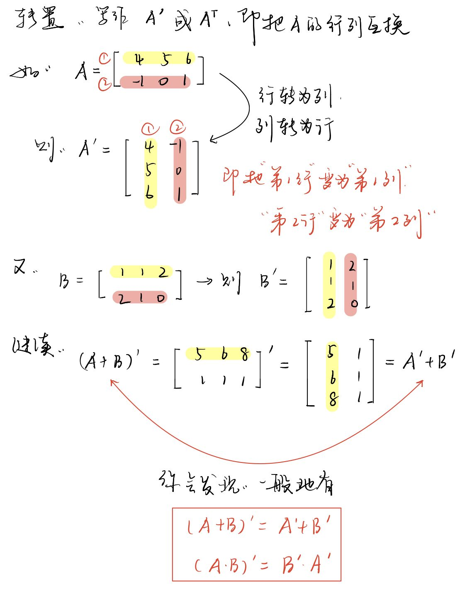

-
- matrix transpose
	- > -transpose
	  /trænˈspoʊz/ v. ( formal ) **to change the order** of two or more things 使掉换顺序
	  ( formal ) to move **or change sth to** a different place or environment or **into** a different form 使转移；使换位；使变形
	  => The director **transposes** Shakespeare's play **from** 16th century Venice **to** present-day England. 导演把莎士比亚的戏剧从16世纪的威尼斯改成当代的英国。
- 
-