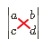
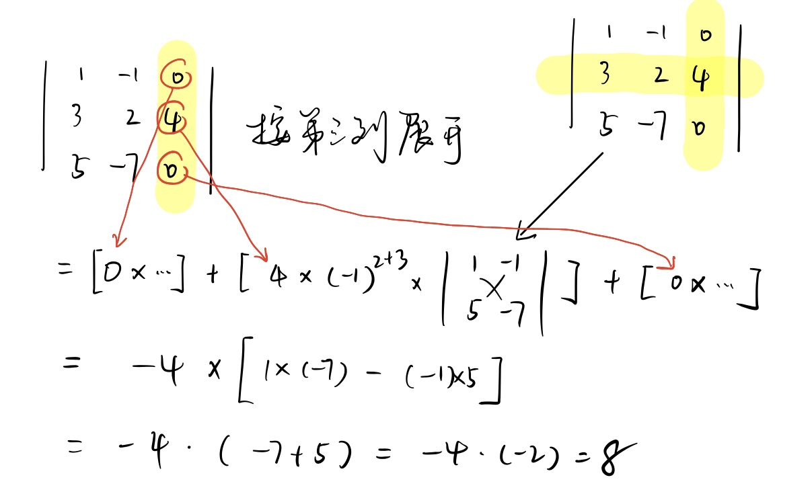
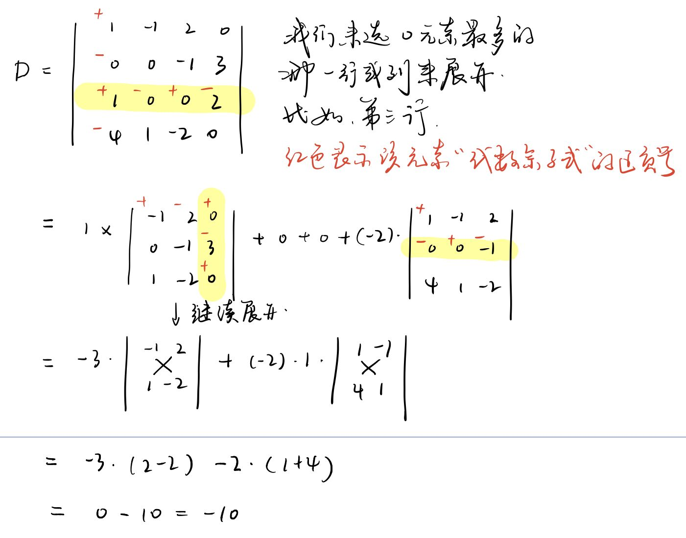

- > -determinant
   /dɪˈtɜːr-mɪ-nənt/  ( formal ) a thing that decides whether or how sth happens 决定因素；决定条件
- 行列式 determinant, 其实就是代表一个数值. 所以, "二阶行列式", 可以和"五阶行列式"进行比大小.
- 行列式的值 = 按任何一行或一列, 进行展开, 即:
  ^^行列式的值 = (某一行(或列)的第一个元素 * 它的代数余子式) + (该行(或列)的第二个元素 * 它的代数余子式)  + ... +(该行(或列)的最后一个元素 * 它的代数余子式)^^
-
  \begin{align*}
  \begin{vmatrix}
  a & b \\
  c & d \\
  \end{vmatrix} 
  &= 我们按第一行来展开的话  \\
  &=  (a × a的代数余子式) + (b  × b的代数余子式) \\
  &= (a  × -1^{(1+1)} ×d) +  (b  × -1^{(1+2)} ×c) \\
  &= ad - bc
  
  \end{align*}
  
- ---
- 例:
	-
	  \begin{align*}
	  \begin{vmatrix}
	  3 & 5 \\
	  -1 & 6 \\
	  \end{vmatrix}
	  = (3 × 6) - (5 × -1) = 18+5 =23
	  \end{align*}
- ---
- 例:
	-
	  \begin{align*}
	  \begin{vmatrix}
	  1 & -1 & 0\\
	  3 & 2 & 4\\
	  5 & -7 & 0 
	  \end{vmatrix}
	  &  = 若按第一行展开的话 \\
	  & = (1 × -1^{(1+1)} × \begin{vmatrix}
	  2 & 4 \\
	  -7 & 0 \\
	  \end{vmatrix})  +
	  (-1 × -1^{(1+2)} × \begin{vmatrix}
	  3 & 4 \\
	  5 & 0 \\
	  \end{vmatrix} )
	  + 
	  (0 × 0^{(1+3)} × \begin{vmatrix}
	  3 & 2 \\
	  5 & -7 \\
	  \end{vmatrix} ) \\
	  &=(2×0 + 4×7) + (3×0-5×4) + 0 \\
	  &= 28 - 20 = 8\end{align*} 
	  
	  若按第三列展开的话:
	  {:height 293, :width 489} 
	  
	  结果是一样的, 都=8.
- ---
- 从中, 我们可以得到启示:
	- 1. 你可以用任何一行, 或任何一列来展开, 结果都是一样的.
	  2. ==那么, 我们就找 0 多的那一行(或列)来做, 跟方便你的计算.== 因为 0 * 他的代数余子式, 就=0. 那太好了, 就不用计算它了.
- ---
- 例:
	- > 
	-
-